# DFusion-SLAM: A Lightweight Semantic Fusion Framework for Robust Visual SLAM in Dynamic Environments

Jin Sun , Member, IEEE, Haowei Huang, Xue Shen, Haitao Zhao , Senior Member, IEEE, Yue Yin , Member, IEEE, Tomoaki Ohtsuki , Senior Member, IEEE, and Guan Gui , Fellow, IEEE

Abstract—In dynamic and cluttered environments, traditional simultaneous localization and mapping (SLAM) systems often sufer from degraded localization accuracy and unstable map construction due to the presence of moving objects and occlusions. To address these challenges, we propose DFusion-SLAM, a lightweight and robust SLAM framework that integrates an enhanced object detection module into ORB-SLAM3. The detection module is based on an improved D-Fine architecture, in which the original Transformer is replaced with a more eficient PolaLinearAttention mechanism. Furthermore, a MetaFormerbased semantic fusion structure is introduced to strengthen multiscale feature representation. These architectural improvements jointly enhance detection accuracy while reducing model complexity, achieving a performance increase from 42.8% to 43.7% mean average precision (mAP). Experimental evaluations on dynamic RGB-D sequences from the TUM and Bonn datasets demonstrate that DFusion-SLAM significantly improves localization accuracy and mapping stability under dynamic conditions, while maintaining high computational eficiency. These results highlight the framework’s strong potential for real-time deployment in IoT-oriented mobile and robotic platforms operating in complex environments.

Index Terms—Detection-aware fusion for SLAM (DFusion-SLAM), dynamic environment, MetaFormer, object detection, PolaLinearAttention, simultaneous localization and mapping (SLAM).

## I. INTRODUCTION

IMULTANEOUS localization and mapping (SLAM) is a fundamental capability for autonomous systems, enabling agents to construct a map of unknown environments while estimating their own pose in real time. Over the past two decades, SLAM has progressed from classical filter-based methods [1] to modern optimization-based techniques. A major milestone in this evolution was the advent of real-time monocular visual SLAM systems such as ORB-SLAM3 [2], which significantly improved the practical deployment of SLAM in areas like robotics and augmented reality. A typical SLAM pipeline comprises four primary components: a front end for feature extraction and tracking [3], a back end for global pose graph optimization [4], a mapping module for building sparse or dense maps [5], and a loop closure mechanism to reduce accumulated drift. Recent advances have introduced deep learning into SLAM pipelines, improving system robustness under challenging visual conditions [6]. Earlier approaches relied on variants of Kalman filters [7] for state estimation, but these techniques often fail in highly dynamic environments.

Despite substantial progress, most traditional SLAM methods assume a static environment. This assumption leads to degraded performance when dynamic elements, such as moving people or vehicles, are present—resulting in data association errors, localization drift, and unstable maps. To mitigate these issues, recent eforts have explored dynamicaware SLAM, object-level mapping, and semantics-integrated SLAM frameworks [8]. With the rise of deep learning, visual SLAM systems have increasingly incorporated deep models to enhance adaptability in dynamic environments. These methods leverage deep learning’s strengths in object recognition and semantic understanding, which significantly improves perception accuracy and system robustness [9]. According to the type of deep neural network used, dynamic visual SLAM approaches can be broadly categorized into three types: object detection-based SLAM [10], semantic segmentationbased SLAM [11], and instance segmentation-based SLAM [12]. These paradigms have substantially enhanced the perception and mapping capabilities of SLAM systems, accelerating their real-world applications.

Among them, object detection-based visual SLAM approaches commonly integrate real-time detectors such as YOLO [13] and Faster R-CNN [14] to identify and filter out dynamic objects. For example, Yu et al. [15] proposed DS-SLAM, which combines human detection and optical flow to improve robustness in dynamic indoor environments. However, the tightly coupled architecture in DS-SLAM poses challenges for system maintenance and practical deployment. Bescos et al. [16] introduced DynaSLAM, which improves dynamic region handling by integrating the Mask R-CNN with motion consistency checks. While this achieves fine-grained dynamic object removal and improves mapping accuracy, the high computational cost of semantic segmentation networks limits their applicability on embedded or resource-constrained platforms.

In this article, we propose DFusion-SLAM, a lightweight and eficient SLAM framework designed to improve localization and mapping performance in dynamic environments by integrating a detection-aware semantic fusion module into ORB-SLAM3. Built upon an enhanced D-Fine architecture, DFusion-SLAM replaces the original Transformer with PolaLinearAttention and introduces a MetaFormer-based fusion module to improve feature expressiveness with reduced complexity. This makes the system particularly suitable for real-time deployment on intelligent vehicles and mobile robotics, especially when integrated with in-vehicle networks [17] for seamless intermodule communication. The main contributions of this article are summarized as follows.

1) We propose a lightweight variant of the D-Fine [18] architecture by replacing the original Transformer encoder [19] with a MetaFormer-based [20] module that enhances multiscale feature fusion using FPN and PAN structures. Trained on the COCO2017 dataset [21], the model achieves a better tradeof between accuracy and eficiency.

2) We integrate the improved D-Fine module into ORB-SLAM3 to construct the complete DFusion-SLAM system. Experimental results on the TUM RGB-D [22] and Bonn [23] datasets validate significant improvements in localization accuracy and mapping stability in dynamic scenes.

3) DFusion-SLAM adopts a modular design compatible with in-vehicle networks for eficient intermodule communication. This architecture facilitates real-time cooperation between perception, planning, and control modules in IoT-based systems, supporting scalable deployment in intelligent vehicles and robotic platforms.

## II. RELATED WORK

Recent advancements in dynamic-aware SLAM have focused on enhancing robustness under motion disturbances, occlusions, and perceptual degradation, critical challenges for real-world IoT-enabled autonomous systems.

Memon et al. [24] proposed DisView, a loop closure detection framework that leverages semantic information from visual IoT sources to address the robustness issues in disasterafected environments. The method demonstrates efectiveness even under severe motion blur, supporting reliable loop closure detection.

Zhao et al. [25] introduced DO-SLAM, a visual SLAM system that integrates image deblurring with lightweight object detection. By jointly performing deblurring and geometrybased dynamic feature elimination, the system improves localization accuracy in dynamic and motion-blurred scenes.

Xing et al. [26] presented a LiDAR–Inertial SLAM framework with real-time dynamic point removal. It distinguishes dynamic from static LiDAR points before feature extraction by employing a concavity-based enhancement mechanism and residual weighting adaptive to measurement distance. Their method supports the detection of nonrigid dynamic objects via hierarchical point cloud analysis.

Hu et al. [27] proposed DAP-VINS, a deep learningenhanced monocular visual–inertial SLAM system for complex trafic scenarios. It employs instance association and motion perception modules to identify and retain pseudo-static features while eliminating dynamic ones, thereby improving localization robustness.

Dai and Xu [28] developed IPD-SLAM, which integrates the CARPBNET instance segmentation network with a parallaxbased motion estimation strategy. This approach improves the completeness of dynamic object segmentation and the accuracy of motion state inference.

Guo et al. [29] proposed a lightweight semantic segmentation framework, Cross-SegNet, for dynamic feature removal in SLAM. At its core is the Cross Block module, which enables eficient dynamic object detection while maintaining computational eficiency. In addition, a spatiotemporal consistency-based auxiliary mask refinement algorithm is introduced, which compares masks across consecutive frames and network outputs to enhance the stability and precision of dynamic region identification.

## III. SYSTEM MODEL AND PROBLEM FORMULATION

DFusion-SLAM is a dynamic-aware visual SLAM framework built upon ORB-SLAM3, designed to achieve robust localization and mapping in highly dynamic environments. The overall architecture of the system is illustrated in Fig. 1. To overcome the limitations of conventional feature-based SLAM systems in scenes with intense motion, we introduce a perception-enhanced front end that integrates a lightweight and eficient dynamic object detection module named DFINE-PL.

At each time step t, the system receives an RGB-D input frame, which can be formally expressed as

$$
\boldsymbol {\mathcal {I}} _ {t} = \left\{\boldsymbol {I} _ {t} ^ {\mathrm{RGB}}, \boldsymbol {D} _ {t} \right\}\tag{1}
$$

where $I _ { t } ^ { \mathrm { R G B } }$ denotes the RGB image and $\scriptstyle { \pmb { D } } _ { t }$ is the aligned depth map. These inputs are first passed through DFINE-PL to perform pixel-wise semantic inference. The module outputs a binary mask $M _ { t } ( x , y )$ that distinguishes dynamic from static regions, defined as

$$
M _ {t} (x, y) = \left\{ \begin{array}{l l} 1, & \text { if } (x, y) \in \text { static   region } \\ 0, & \text { if } (x, y) \in \text { dynamic   region }. \end{array} \right.\tag{2}
$$

With this mask, the system identifies dynamic areas in the scene and proceeds to keypoint extraction. An image pyramid is constructed, and FAST keypoints [30] are detected at multiple scales. To ensure the reliability of the extracted features, keypoints falling within dynamic regions (where $M _ { t } ( x , y ) = 0 )$ are discarded. ORB descriptors are then computed exclusively for the remaining static keypoints, resulting in a robust and noise-resistant set of features for tracking. This dynamicstatic separation strategy not only suppresses interference from moving objects but also improves the temporal consistency of the features.

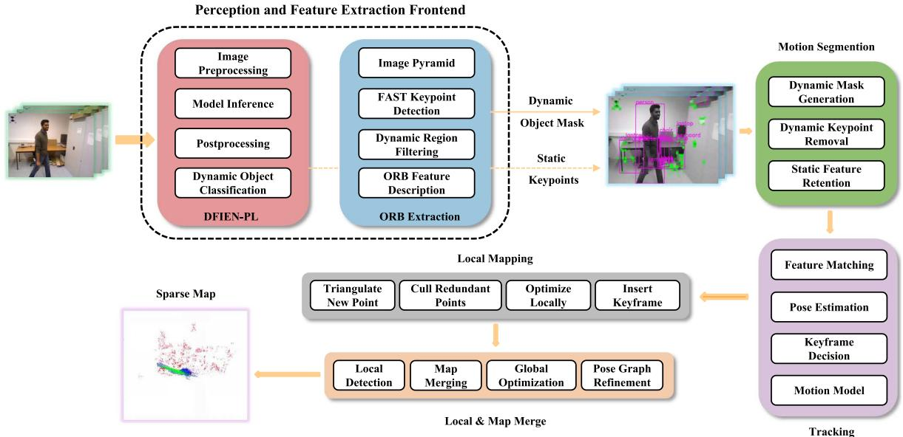  
Fig. 1. Overall architecture of the proposed DFINE-PL-based dynamic-aware SLAM system. DFINE-PL performs dynamic object perception and classification in the front end, followed by static feature extraction, motion segmentation, visual tracking, local mapping, and map merging. The system incrementally builds a sparse and drift-reduced visual map.

The system then enters the motion segmentation and tracking stage, where only static features are used for camera pose estimation. The matching process is guided by a constant velocity motion model, followed by local pose optimization. Keyframes are selected adaptively based on scene changes to ensure smooth trajectory generation and spatial accuracy. The camera pose is estimated by minimizing the reprojection error using only static features, formulated as

$$
\boldsymbol {T} _ {t} ^ {*} = \arg \min _ {\boldsymbol {T} _ {t}} \sum_ {i \in \mathcal {S} _ {t}} \| \boldsymbol {u} _ {i} - \pi (\boldsymbol {T} _ {t} \cdot \boldsymbol {P} _ {i}) \| ^ {2}\tag{3}
$$

where $\pmb { T } _ { t } \in \mathrm { S E } ( 3 )$ represents the camera pose at time $t , S _ { t }$ is the set of static keypoints determined by the mask, $P _ { i }$ is the 3-D position of the ith feature point, $\pmb { u } _ { i }$ is its observed 2-D projection, and $\pi ( \cdot )$ denotes the camera projection function.

πMeanwhile, a sparse 3-D map is maintained and continuously updated through local mapping, which includes redundant point removal, triangulation of new static points, and keyframe bundle adjustment. To mitigate long-term drift and ensure global consistency, the system periodically performs map merging and global pose graph optimization [31].

By integrating DFINE-PL into the front end of ORB-SLAM3, DFusion-SLAM enables early-stage suppression of dynamic interference, efectively reducing the computational load of downstream modules and preventing map corruption. It significantly improves robustness and localization accuracy in dynamic environments. The entire system is built on semantic-aware SLAM principles and is well-suited for complex real-world applications such as smart manufacturing, autonomous driving, and mobile robotics in IoT environments [32], [33].

## IV. OUR PROPOSED METHOD

## A. Improved Lightweight DFINE-PL

Fig. 2 presents the complete architecture of the dynamicaware feature integration network with PolaLinearAttention (DFINE-PL) [34], which consists of three core modules: a backbone module, a hybrid encoder, and a DFINE decoder. This architecture is designed to achieve eficient and accurate dynamic object understanding in complex real-world scenes.

In the backbone module, the input RGB image of size $H \times W \times 3$ is first processed via a stem layer extracting low-level features with resolution $H / 4 \times W / 4$ (C1). This is followed by a four-stage hierarchical feature extractor (Stage1 to Stage4), where the spatial resolution progressively decreases, while semantic richness increases. Each stage employs a MetaFormer Block [20] instead of conventional convolutional blocks, integrating the UniRepLKNetBlock [35] for spatial structure modeling and an eficient feed-forward network (EFFN) [36] for lightweight expressive transformation.

In the hybrid encoder, multilevel features from diferent backbone stages are jointly processed for cross-scale enhancement and global reasoning. Shallow features are refined through top-down feature pyramid networks (FPNs) [37]. Deeper semantic features are passed into a Transformer layer equipped with PolaLinearAttention, enabling global context modeling with linear complexity. The features are then aggregated via path aggregation networks (PANs) [38] to enrich spatial semantics.

Finally, the DFINE decoder accepts the fused features and performs hierarchical decoding. It consists of multiple decoder layers (Decoder $\mathrm { L a y e r } _ { 1 , 2 }$ to $\mathrm { L a y e r } _ { N } )$ , with skip connections and fine-grained convolutional refinement. The detection head outputs dense pixel-wise predictions for dynamic/static classification, enabling robust foreground recognition of moving entities.

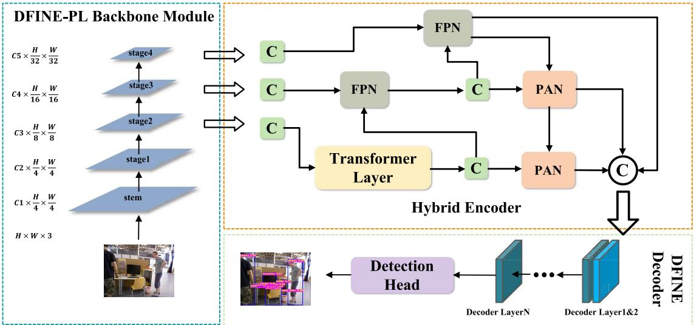  
Fig. 2. Architecture of the DFINE-PL perception and feature extraction front end. This module integrates image preprocessing, deep inference, and dynamic object classification, enabling robust static keypoint extraction and dynamic mask generation for SLAM in dynamic environments.

As shown in Fig. 2. the architecture maintains high eficiency while simultaneously preserving spatial details, enabling cross-scale feature fusion and global context modeling, making it particularly suitable for visual tasks in dynamic environments.

## B. Replacing Transformer With PolaLinearAttention

In this study, we replace the standard Transformer module in DFine with PolaLinearAttention [34] to reduce computational complexity and enhance the model’s ability to capture forgeryrelated features. PolaLinearAttention utilizes a kernel-based feature mapping to approximate the attention mechanism in linear time, reducing complexity from O(N2) to O(N). Additionally, it introduces a polarization mechanism that independently models attention across both spatial and channel dimensions, enabling the efective capture of long-range dependencies and semantic inconsistencies.

Given an input feature map $X \in \mathbb { R } ^ { N \times C }$ , the query, key, and value matrices are computed as

$$
Q = X W _ {Q}, \quad K = X W _ {K}, \quad V = X W _ {V}\tag{4}
$$

where $W _ { O } , W _ { K } , W _ { V } \in \mathbb { R } ^ { C \times d }$ are learnable projection weights. , ,To reduce complexity, PolaLinearAttention applies a kernel feature map (·) to enable linear attention computation

$$
\tilde {Q} = \phi (Q), \quad \tilde {K} = \phi (K).\tag{5}
$$

The linear attention is then computed as

$$
\text { Attention } (Q, K, V) = \frac {\tilde {Q} \cdot (\tilde {K} ^ {\top} V)}{\tilde {Q} \cdot (\tilde {K} ^ {\top} \mathbf {1})}\tag{6}
$$

where $\mathbf { 1 } \in \mathbb { R } ^ { N \times 1 }$ is a vector of ones used for normalization. To further improve feature representation, PolaLinearAttention applies a polarization mechanism by modeling attention separately in the spatial and channel dimensions

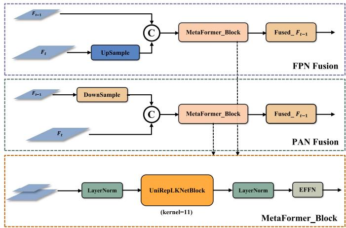  
Fig. 3. Illustration of the temporal feature fusion mechanism and the detailed architecture of the MetaFormer Block in the DFINE-PL framework. The top section shows the FPN fusion path, where features from the previous frame are upsampled and concatenated with current frame features, followed by refinement using a MetaFormer Block. The middle section presents the PAN fusion path with downsampling for coarse-to-fine integration. The bottom section details the internal structure of MetaFormer Block, which incorporates a UniRepLKNetBlock (kernel size 11) for spatial modeling, flanked by LayerNorm layers and an eficient feed-forward network (EFFN) for lightweight semantic enhancement.

$$
Y = \operatorname{Pola} _ {\text { spatial }} (X) + \operatorname{Pola} _ {\text { channel }} (X)\tag{7}
$$

where $\mathrm { P o l a } _ { \mathrm { s p a t i a l } }$ captures long-range spatial dependencies and $\mathrm { P o l a } _ { \mathrm { c h a n n e l } }$ captures semantic relationships across channels.

C. MetaFormer-Based Feature Aggregation in the FPN and PAN

As shown in Fig. 3, to enhance multiscale feature fusion in DFINE, we design a hybrid encoder that integrates the FPN and PAN with unified MetaFormer blocks. The FPN applies top-down fusion by upsampling high-level features, while the PAN adopts bottom-up fusion by downsampling lowlevel features, enabling stronger cross-layer information flow.

TABLE I  
ABLATION STUDY OF DFINE. “VANILLA” DENOTES THE STANDARD TRANSFORMER ATTENTION, AND “POLALINEAR” IS THE PROPOSED MODULE. METABLOCK VALUES 0/1 INDICATE ABSENCE/PRESENCE

<table><tr><td>Model</td><td>Attention</td><td>MetaBlock</td><td>GFLOPs</td><td> $\text{mAP}_{50-90}^{val}$ </td></tr><tr><td>A</td><td>Vanilla</td><td>0</td><td>7.0</td><td>42.8</td></tr><tr><td>B</td><td>PolaLinear</td><td>0</td><td>7.1</td><td>43.1</td></tr><tr><td>C</td><td>Vanilla</td><td>1</td><td>7.2</td><td>42.2</td></tr><tr><td>D</td><td>PolaLinear</td><td>1</td><td>7.4</td><td>43.7</td></tr></table>

The fusion structure, as shown in Fig. 3, each MetaFormer block is composed of the following structure: an initial LayerNorm, followed by a UniRepLKNetBlock (a convolutional block with large receptive field, kernel size = 11) to enhance spatial structure modeling. This large convolutional kernel enables the block to capture broader contextual information and integrate features across diferent spatial scales, which is particularly beneficial for multiscale feature fusion in object detection. This is followed by another LayerNorm and an EFFN to transform channel-wise features. This architecture follows the general MetaFormer paradigm and efectively overcomes the limitations of conventional convolution-based fusion modules in modeling long-range dependencies and global semantic context.

In implementation, we utilize two nn.ModuleList containers, namely fpn blocks and pan blocks, to construct the fusion modules in both FPN and PAN paths. Each fusion operation is implemented with a MetaFormer Block, ensuring architectural consistency and efective cross-scale information aggregation, which significantly improves semantic modeling and feature integration across the detection pipeline [39].

1) Enhanced Representation Power: The large-kernel token mixer enables more efective global context modeling, improving recognition of multiscale objects.

2) Structural Unification: A consistent block design for both top-down FPN and bottom-up PAN fusion improves learning stability and parameter eficiency.

3) Modularity and Flexibility: The architecture allows for easy substitution of token mixers, facilitating adaptation to diverse visual tasks.

## V. EXPERIMENTAL RESULTS AND ANALYSIS

## A. Experimental Environment

All experiments are conducted on a high-performance workstation equipped with an Intel Core i9-14900KF CPU, 64 GB of DDR5 RAM, and an NVIDIA RTX 4090D GPU. The software environment includes Ubuntu 20.04 LTS, CUDA 11.4, cuDNN 8.6.1, Python 3.8, and TensorRT 10.7.0.23. All experiments are performed under FP32 precision without enabling FP16 acceleration.

## B. Ablation Study

We compare the efects of diferent attention mechanisms (Vanilla versus PolaLinearAttention) and the MetaBlock, as shown in Table I. Results indicate that PolaLinearAttention improves accuracy without significant overhead, while MetaBlock alone also provides gains. Their combination achieves the best performance, demonstrating complementary benefits.

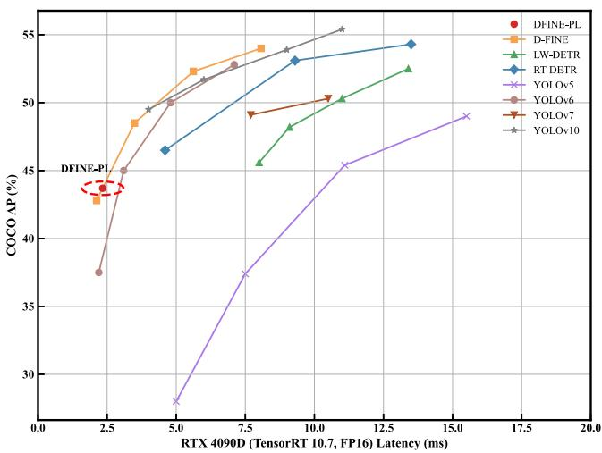  
Fig. 4. Latency versus COCO AP comparison between DFINE-PL and other detectors. The figure illustrates the tradeof between accuracy (COCO $\mathsf { A P } _ { 5 0 - 9 0 } ^ { \mathrm { v a l } } )$ and latency (ms) across multiple models on RTX 4090D (TensorRT 10.7). DFINE-PL appears in the upper-left corner, demonstrating its superior balance of precision and eficiency.

## C. Performance Analysis of DFINE-PL

To evaluate the performance of the proposed DFINE-PL model, we conduct comprehensive comparisons with several representative object detection baselines, including YOLOv5, YOLOv8, DEIM, and other DFINE variants. The evaluation metrics include COCO $\mathrm { \ m A P _ { 5 0 - 9 0 } ^ { v a l } }$ for accuracy, latency (in milliseconds), and computational eficiency. Here, giga floating-point operations (GFLOPs) measure the theoretical computational cost of a model, while frames per second (FPS) quantifies the practical inference speed, that is, the number of images processed per second.

As shown in Table II, DFINE-PL achieves 43.7% mAPval50−90 with only 2.34-ms latency, showing an excellent balance between accuracy and real-time performance. Although it has slightly more parameters (4.3M versus 4.0M) and FLOPs (7.4 versus 7.0) than DFINE-N, it delivers higher accuracy. Compared with YOLOv5-S and YOLOv8-N, DFINE-PL ofers significant accuracy gains while reducing latency by over 80% relative to YOLOv5-M and YOLOv8-M, demonstrating strong suitability for real-time and embedded applications.

As illustrated in Fig. 4, DFINE-PL is positioned in the upper-left region of the accuracy–latency curve, clearly outperforming lightweight detectors such as YOLOv5-S and YOLOv8-N by achieving higher accuracy at lower latency. This highlights the architectural eficiency of DFINE-PL, making it an ideal choice for real-time object detection tasks that demand both high precision and high speed.

Overall, DFINE-PL delivers a compelling compromise between detection accuracy, computational complexity, and real-time performance, making it a strong candidate for embedded and latency-sensitive applications in intelligent IoT systems.

TABLE II  
PERFORMANCE COMPARISON OF VARIOUS ALGORITHMS ON THE COCO2017 DATASET

<table><tr><td>Model</td><td>Params</td><td>GFLOPs</td><td>FPS</td><td> $\text{mAP}^{val}_{50-90}$ </td><td> $\text{mAP}^{val}_{50}$ </td><td>Latency</td></tr><tr><td>YOLOv5-S</td><td>7.2</td><td>16.5</td><td>217</td><td>37.4</td><td>56.8</td><td>14.3</td></tr><tr><td>YOLOv5-M</td><td>21.2</td><td>49.0</td><td>145</td><td>45.4</td><td>64.1</td><td>15.2</td></tr><tr><td>YOLOv8-N</td><td>3.2</td><td>8.7</td><td>123</td><td>37.3</td><td>54.3</td><td>6.4</td></tr><tr><td>YOLOv8-S</td><td>11.2</td><td>28.6</td><td>198</td><td>44.2</td><td>60.6</td><td>7.2</td></tr><tr><td>YOLOv8-M</td><td>25.9</td><td>78.9</td><td>149</td><td>50.2</td><td>67.2</td><td>10.1</td></tr><tr><td>DFINE-PL</td><td>4.3</td><td>7.4</td><td>356</td><td>43.7</td><td>59.5</td><td>2.34</td></tr><tr><td>DFINE-N</td><td>4.0</td><td>7.0</td><td>322</td><td>42.8</td><td>57.2</td><td>2.12</td></tr><tr><td>DFINE-S</td><td>10.6</td><td>25.3</td><td>367</td><td>48.5</td><td>66.3</td><td>3.49</td></tr><tr><td>DEIM-N</td><td>4.2</td><td>7.0</td><td>341</td><td>43.0</td><td>57.9</td><td>2.25</td></tr></table>

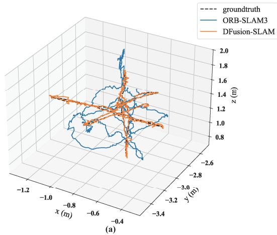

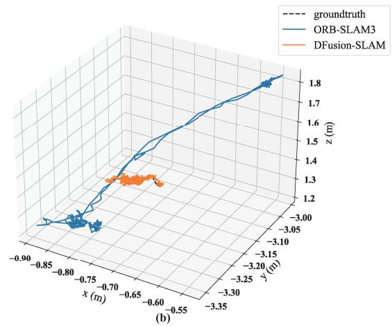

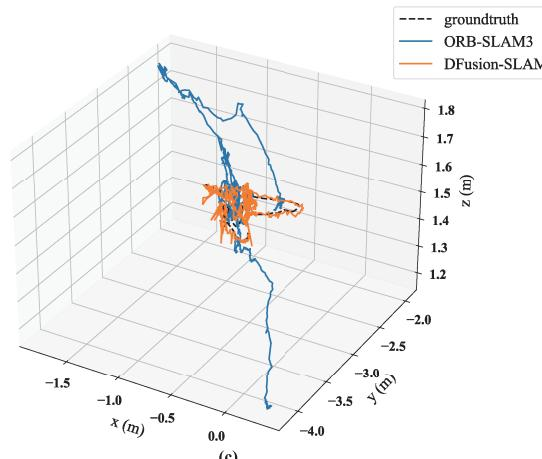  
(c)

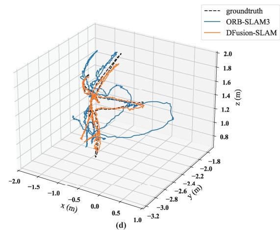  
Fig. 5. Trajectory comparison between ORB-SLAM3 and DFusion-SLAM on four dynamic TUM RGB-D sequences: (a) fr3/w/xyz, (b) fr3/w/static, (c) fr3/w/rpy, and (d) fr3/w/halfsphere. Ground truth is shown in black dashed lines, ORB-SLAM3 in blue, and DFusion-SLAM in orange. DFusion-SLAM exhibits significantly better alignment, especially under motion and occlusion.

## D. SLAM Test Datasets and Evaluation Metrics

To evaluate the performance and robustness of DFusion-SLAM, we conducted experiments on the TUM RGB-D and BONN RGB-D datasets, which include indoor scenes with varying motion, occlusion, and structural complexity.

For fair comparison, we selected three representative baselines: YOLOv5-SLAM [40] (real-time detection with SLAM),

DynaSLAM [16] (dynamic region filtering via segmentation and geometry), and ORB-SLAM3 [2] (a widely used multisensor feature-based SLAM).

Under a unified evaluation, we compared DFusion-SLAM with baselines on accuracy, robustness, and adaptability. Results show that DFusion-SLAM delivers superior localization stability and mapping consistency, confirming its efectiveness in dynamic and IoT-oriented scenarios.

To further evaluate the performance of DFusion-SLAM under dynamic conditions, we selected representative sequences from two widely used RGB-D benchmark datasets:

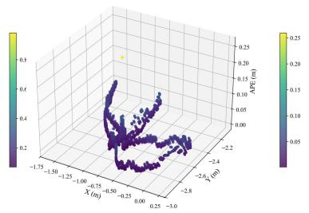

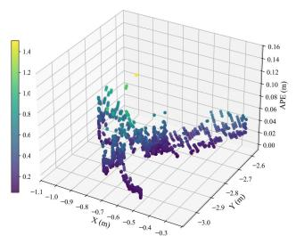

TABLE III  
COMPARISON OF THE ATE AND RPE ON DIFFERENT SEQUENCES

<table><tr><td rowspan="2">Sequence</td><td colspan="4">ATE [m]</td><td colspan="4">RPEt[m/f]</td></tr><tr><td>ORB-SLAM3</td><td>DynaSLAM</td><td>YOLO-SLAM</td><td>Ours</td><td>ORB-SLAM3</td><td>DynaSLAM</td><td>YOLO-SLAM</td><td>Ours</td></tr><tr><td>sitting/xyz</td><td>0.010</td><td>0.012</td><td>0.013</td><td>0.013</td><td>0.008</td><td>0.010</td><td>0.010</td><td>0.011</td></tr><tr><td>sitting/static</td><td>0.010</td><td>0.008</td><td>0.008</td><td>0.007</td><td>0.005</td><td>0.005</td><td>0.005</td><td>0.004</td></tr><tr><td>walking/xyz</td><td>0.632</td><td>0.015</td><td>0.016</td><td>0.015</td><td>0.026</td><td>0.013</td><td>0.017</td><td>0.012</td></tr><tr><td>walking/static</td><td>0.008</td><td>0.007</td><td>0.008</td><td>0.008</td><td>0.013</td><td>0.006</td><td>0.007</td><td>0.006</td></tr><tr><td>walking/rpy</td><td>0.633</td><td>0.041</td><td>0.034</td><td>0.031</td><td>0.027</td><td>0.020</td><td>0.020</td><td>0.019</td></tr><tr><td>walking/halfsphere</td><td>0.333</td><td>0.029</td><td>0.029</td><td>0.027</td><td>0.023</td><td>0.018</td><td>0.013</td><td>0.018</td></tr></table>

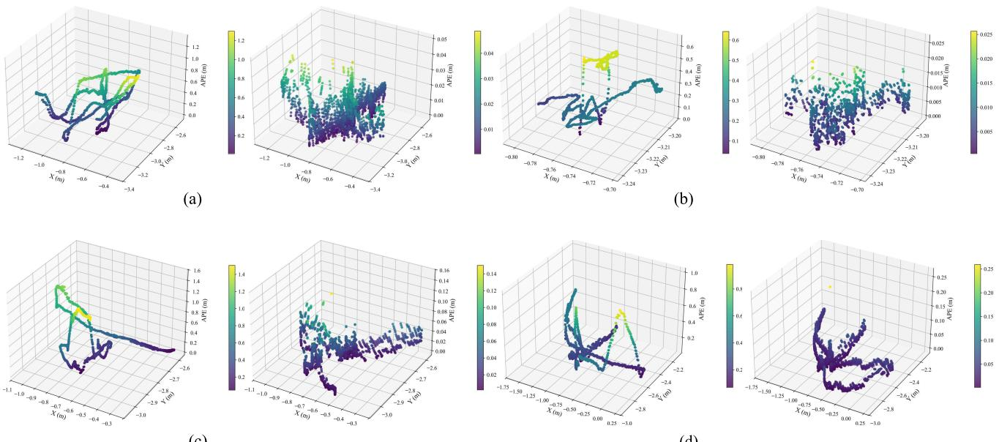  
(c)  
(d)  
Fig. 6. 3-D ATE heatmaps of DFusion-SLAM and ORB-SLAM3 on four dynamic sequences. In each pair of subfigures, the left shows ORB-SLAM3 and the right shows DFusion-SLAM. Color intensity represents the magnitude of the error—brighter areas indicate larger errors. DFusion-SLAM exhibits lower and more uniformly distributed errors, highlighting its robustness in dynamic environments. (a) fr3/w/xyz. (b) fr3/w/static. (c) fr3/w/rpy. (d) fr3/w/halfsphere

the TUM RGB-D dataset and the BONN RGB-D dynamic dataset.

From the TUM dataset, we selected six sequences from the fr3 series: fr3 sitting xyz, fr3 sitting static, fr3 walking xyz, fr3 walking static, fr3 walking rpy, and fr3 walking halfsphere. For clarity, we abbreviate them as fr3/s/xyz, fr3/s/static, fr3/w/xyz, fr3/w/static, fr3/w/rpy, and fr3/w/half. Specifically, xyz denotes translational motion along the X-, Y-, and Z-axes; rpy indicates rotational motion (roll, pitch, yaw); static refers to a stationary camera; and half represents camera motion along a hemispherical trajectory. The sitting sequences depict minimal motion, such as a person seated at a desk with slight movement, while the walking sequences involve dynamic occlusions and significant camera and subject motion.

From the BONN RGB-D dataset, we selected four highly dynamic sequences: balloon, crowd, placing nonobstructing box, and person tracking, abbreviated as balloon, crowd, p n box, and p tracking, respectively. These sequences depict various real-world dynamic interactions: balloon shows object motion driven by airflow, crowd includes multiple moving individuals and heavy occlusion, p n box involves interaction with static backgrounds, and p tracking captures person-following scenarios with varying motion intensity and distance.

To quantitatively assess the localization performance, we adopt two widely used metrics: an absolute trajectory error (ATE) and a relative pose error (RPE). The ATE measures the global consistency between the estimated and ground-truth trajectories by computing the root-mean-square error (RMSE) after aligning both trajectories via a rigid-body transformation T ∈ SE(3). It is formally defined as

$$
\mathrm{ATE} _ {\mathrm{RMSE}} = \sqrt {\frac {1}{n} \sum_ {i = 1} ^ {n} \left\| \boldsymbol {p} _ {i} ^ {\mathrm{gt}} - \boldsymbol {T} \cdot \boldsymbol {p} _ {i} ^ {\mathrm{est}} \right\| ^ {2}}\tag{8}
$$

where $p _ { i } ^ { \mathrm { g t } }$ and $\pmb { p } _ { i } ^ { \mathrm { e s t } }$ denote the ground-truth and estimated positions at time i, respectively. The RPE evaluates local accuracy by measuring the deviation in relative motion between consecutive poses over a fixed time interval ∆

$$
\mathrm{RPE} _ {\text { trans,RMSE }} = \sqrt {\frac {1}{n - \Delta} \sum_ {i = 1} ^ {n - \Delta} \| \mathrm{RPE} _ {\text { trans }} (i , \Delta) \| ^ {2}}.\tag{9}
$$

Together, the ATE and RPE comprehensively reflect both global alignment accuracy and local trajectory smoothness.

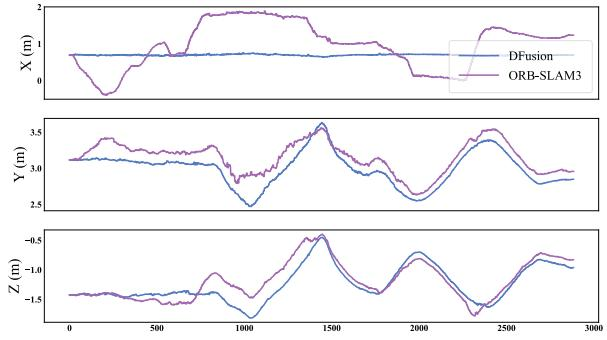

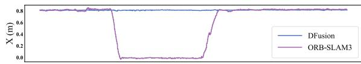

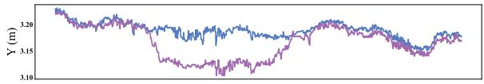

(a)  
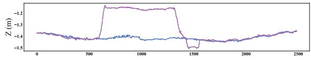

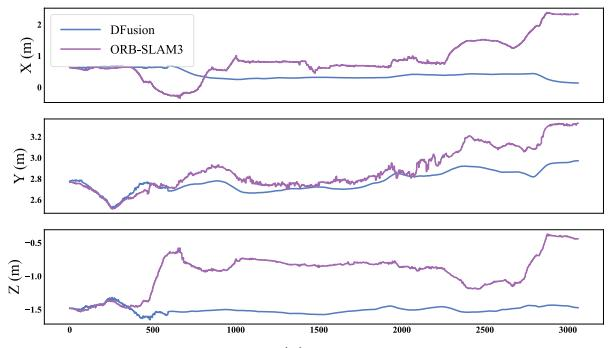  
(c)

(b)  
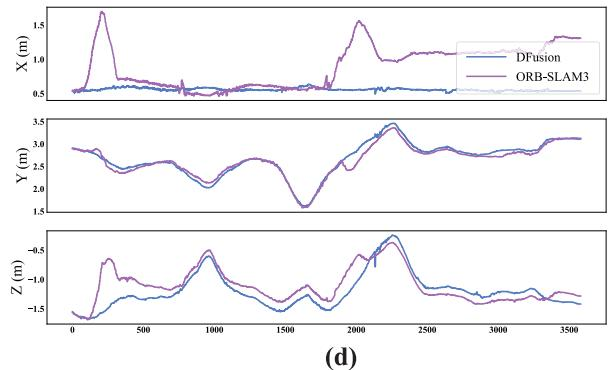  
Fig. 7. Translation error curves (X Y Z) of DFusion-SLAM and ORB-SLAM3 on dynamic TUM sequences. Red: DFusion-SLAM; Green: ORB-SLAM3 , ,DFusion-SLAM maintains consistently lower error levels, particularly under high-motion sequences such as (a) and (c), highlighting its superior translational stability. (a) fr3/w/xyz sequence. (b) fr3/w/static sequence. (c) fr3/w/rpy sequence. (d) fr3/w/halfshpere sequence.

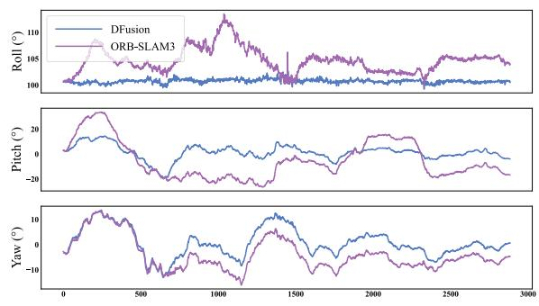  
(a)

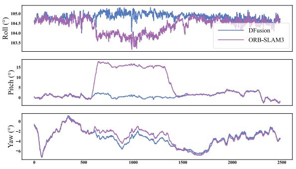

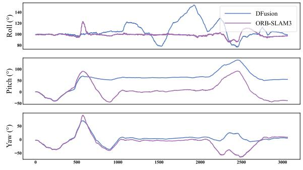  
(c)

(b)  
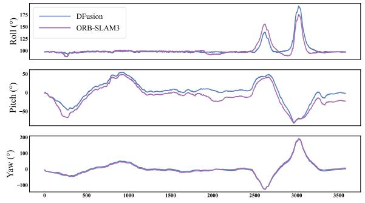  
(d)  
Fig. 8. Rotation error curves (roll, pitch, and yaw) of DFusion-SLAM and ORB-SLAM3 on dynamic TUM sequences. DFusion-SLAM demonstrates smoother angular trajectories with significantly fewer fluctuations than ORB-SLAM3, especially under complex rotational motion [e.g., (c) and (d)] (a) fr3/w/xyz sequence. (b) fr3/w/static sequence. (c) fr3/w/rpy sequence. (d) fr3/w/halfshpere sequence.

## E. Error Analysis on the TUM RGB-D Dataset

As shown in Fig. 5, after SE(3) rigid alignment (Horn, rotation+translation only), DFusion-SLAM produces trajectories that remain close to the ground truth across dynamic sequences. ORB-SLAM3, however, drifts noticeably on fr3/w/xyz, fr3/w/rpy, and fr3/w/half, where frequent occlusions and rapid motion transitions impair tracking. This evidences DFusion-SLAM’s stronger trajectory fidelity and robustness in highly dynamic settings.

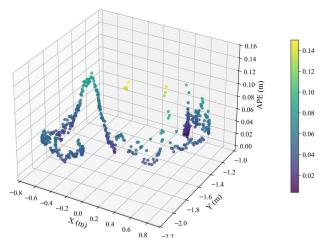

TABLE IV  
COMPARISON OF THE ATE AND RPE ON DIFFERENT SEQUENCES

<table><tr><td rowspan="2">Sequence</td><td colspan="4">ATE [m]</td><td colspan="4"> $RPE_t$  [m/f]</td></tr><tr><td>ORB-SLAM3</td><td>DynaSLAM</td><td>YOLO-SLAM</td><td>Ours</td><td>ORB-SLAM3</td><td>DynaSLAM</td><td>YOLO-SLAM</td><td>Ours</td></tr><tr><td>ballon</td><td>0.074</td><td>0.035</td><td>0.033</td><td>0.030</td><td>0.049</td><td>0.038</td><td>0.038</td><td>0.041</td></tr><tr><td>crowd</td><td>1.982</td><td>0.023</td><td>0.136</td><td>0.022</td><td>0.085</td><td>0.023</td><td>0.054</td><td>0.028</td></tr><tr><td>crowd2</td><td>1.252</td><td>0.024</td><td>0.500</td><td>0.034</td><td>0.178</td><td>0.028</td><td>0.053</td><td>0.027</td></tr><tr><td>crowd3</td><td>1.234</td><td>0.035</td><td>0.038</td><td>0.035</td><td>0.070</td><td>0.026</td><td>0.028</td><td>0.025</td></tr><tr><td>p_n_box</td><td>0.878</td><td>0.191</td><td>0.523</td><td>0.074</td><td>0.028</td><td>0.033</td><td>0.029</td><td>0.046</td></tr><tr><td>p_n_box2</td><td>0.026</td><td>0.027</td><td>0.032</td><td>0.020</td><td>0.027</td><td>0.025</td><td>0.025</td><td>0.024</td></tr><tr><td>p_n_box3</td><td>0.071</td><td>0.067</td><td>0.063</td><td>0.042</td><td>0.045</td><td>0.036</td><td>0.037</td><td>0.035</td></tr><tr><td>p_tracking</td><td>0.056</td><td>0.049</td><td>0.050</td><td>0.054</td><td>0.201</td><td>0.084</td><td>0.074</td><td>0.073</td></tr><tr><td>p_tracking2</td><td>0.779</td><td>0.095</td><td>0.044</td><td>0.073</td><td>0.105</td><td>0.063</td><td>0.065</td><td>0.065</td></tr></table>

The quantitative results in Table III corroborate the visual findings. In relatively static sequences such as sitting/xyz and sitting/static, all methods perform comparably with low ATE and RPE values. However, in dynamic sequences, DFusion-SLAM significantly outperforms baseline methods. For instance, in walking/xyz, DFusion-SLAM reduces ATE from 0.632 m (ORB-SLAM3) to 0.015 m and RPE from 0.026 to 0.012 m/f, demonstrating substantial improvements. Similar trends are observed in walking/rpy and walking/halfsphere.

Further evidence is provided by the 3D ATE heatmaps in Fig. 6. DFusion-SLAM’s heatmaps are dominated by low-error regions (deep purple/blue), indicating precise and stable localization. In contrast, ORB-SLAM3 exhibits large scattered errors, with notable yellow areas in sequences involving high motion or complex rotation (e.g., fr3/w/xyz and fr3/w/rpy). These observations reinforce the robustness of DFusion-SLAM under dynamic conditions.

In addition, we conduct a detailed comparison of translational and rotational error profiles, as illustrated in Figs. 7 and 8, respectively. Fig. 7 plots translational errors along X-, Y-, and Z-axes over time, while Fig. 8 shows roll, pitch, and yaw errors. In each case, the horizontal axis denotes time (s), and the vertical axis represents the absolute error.

The comparative plots clearly show that DFusion-SLAM consistently produces lower and more stable pose estimation errors across both translational and rotational dimensions. In highly dynamic sequences, ORB-SLAM3 exhibits sharp error spikes and frequent fluctuations, while DFusion-SLAM maintains smoother and more accurate estimations. Even in semi-static scenarios such as fr3/w/static, DFusion-SLAM shows enhanced robustness, attesting to its adaptability in mixed dynamic-static environments.

## F. Error Analysis on the BONN Dataset

Table IV compares DFusion-SLAM with ORB-SLAM3, DynaSLAM, and YOLO-SLAM on dynamic sequences from the BONN RGB-D dataset. Results show that DFusion-SLAM achieves the lowest or comparable ATE and RPE in most cases, significantly outperforming the static-scene assumption of ORB-SLAM3.

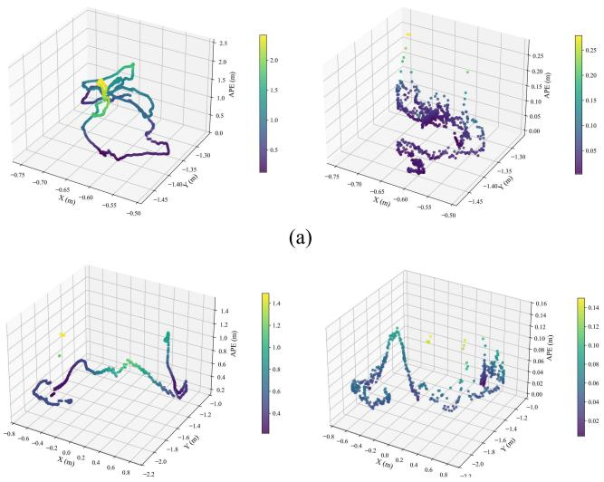  
(b)  
Fig. 9. Visualization of APE distributions on selected dynamic sequences from the BONN RGB-D dataset, including (a) crowd3 and (b) person tracking. The left column shows ORB-SLAM3 results, while the right column presents DFusion-SLAM. Compared to ORB-SLAM3, DFusion-SLAM exhibits tighter error distributions and fewer outliers, highlighting its robustness under occlusion, multiobject motion, and nonrigid interactions.

In the crowd sequences, DFusion-SLAM records the lowest errors; in the p n box sequences, it remains competitive, and in person tracking, it maintains stable accuracy, demonstrating robustness to occlusions, multiobject motion, and nonrigid interactions.

Fig. 9 shows absolute pose error (APE) distributions for crowd3 and person tracking.Compared with ORB-SLAM3 (left), DFusion-SLAM (right) yields tighter distributions and fewer outliers, confirming more stable pose estimation under dynamic conditions.

Fig. 10 provides three visualizations (error curves, bar charts, and boxplots), all confirming that DFusion-SLAM achieves lower mean and RMSE, tighter error distributions, and fewer outliers than competing methods.

Overall, DFusion-SLAM surpasses existing dynamic SLAM frameworks in both accuracy and consistency, highlighting its potential for deployment in complex real-world environments.

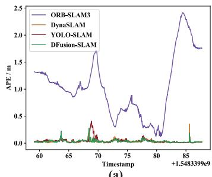  
(a)

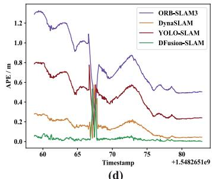

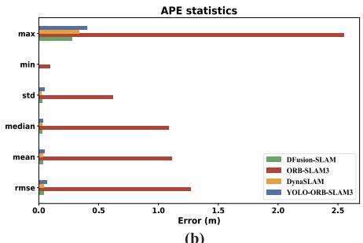  
(b)

(d)  
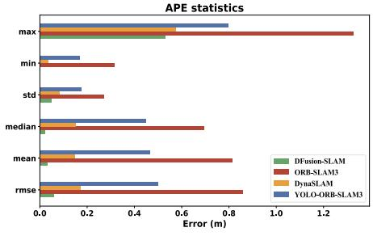

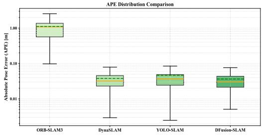  
(c)

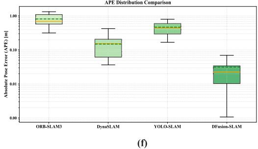

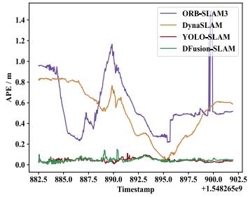  
(g)

(e)  
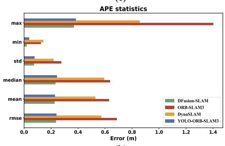  
(h)

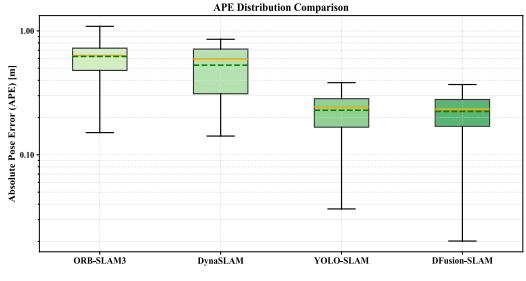  
(i)  
Fig. 10. Comparative analysis of the APE among ORB-SLAM3, DynaSLAM, YOLOv5-SLAM, and DFusion-SLAM across three dynamic sequences from the Bonn RGB-D dataset. (a)–(c) Correspond to the crowd3 sequence, (d)–(f) correspond to placing nonobstructing box, and (g)–(i) correspond to person tracking. Each row presents the APE over time, APE statistical metrics (max, min, std, median, mean, and rmse), and APE distribution via boxplot visualization.

## VI. CONCLUSION

This article presents DFusion-SLAM, a visual SLAM framework tailored for dynamic environments. By integrating a lightweight semantic module (DFINE-PL) into ORB-SLAM3 and employing PolaLinearAttention together with MetaFormer blocks in the FPN/PAN for eficient, multiscale semantic fusion, the system efectively suppresses dynamic features and enhances semantic awareness. Experiments on the TUM and Bonn RGB-D datasets show that, compared with ORB-SLAM3, DFusion-SLAM reduces ATE and RPE by 34.7% and 29.1% on dynamic sequences, respectively, and maintains stable, accurate localization in highly dynamic scenes such as crowd3 and person tracking.

Given that the current pipeline’s separation of front end and back end can lead to mismatches between perceptual suppression and geometric needs, that failures still occur under fast motion, partial occlusion, and pure rotation, and that real-time deployment on resource-constrained platforms is required, we will prioritize end-to-end optimization to jointly learn front-end masking and back-end geometric residuals, thereby reducing brittle hyperparameters and further lowering ATE/RPE; fuse IMU and other modalities to provide inertial priors that stabilize tracking and constrain scale/drift; and continue model compression (pruning/quantization) to reduce latency and power without altering the online inference graph, enabling real-time applications.

## REFERENCES

[1] J. Xiong, J. W. Cheong, Y. Ding, Z. Xiong, and A. G. Dempster, “Eficient distributed particle filter for robust range-only SLAM,” IEEE Internet Things J., vol. 9, no. 21, pp. 21932–21945, Nov. 2022.

[2] C. Campos, R. Elvira, J. J. G. Rodr´ıguez, J. M. M. Montiel, and J. D. Tardos, “ORB-SLAM3: An accurate open-source library for visual,´ visual–inertial, and multimap SLAM,” IEEE Trans. Robot., vol. 37, no. 6, pp. 1874–1890, Dec. 2021.

[3] G. Xing et al., “FLARE-SLAM: Multibeam feature extraction and residual enhancement for 3-D LiDAR mapping,” IEEE Internet Things J., vol. 12, no. 14, pp. 26620–26632, Jul. 2025.

[4] B. Chen, T. Song, D. Chen, J. Li, Z. Zhao, and R. Jia, “A 3D LiDAR SLAM algorithm based on graph optimization in indoor scene,” in Proc. 6th Asian Conf. Artif. Intell. Technol. (ACAIT), 2022, pp. 1–5.

[5] C. Li, B. Zhou, and Q. Li, “SemanticCSLAM: Using environment landmarks for cooperative simultaneous localization and mapping,” IEEE Internet Things J., vol. 11, no. 14, pp. 24739–24747, Jul. 2024.

[6] S. Chen et al., “TextGeo-SLAM: A LiDAR SLAM with text semantics and geometric-constraint-based loop closure,” IEEE Internet Things J., vol. 12, no. 9, pp. 12021–12033, May 2025.

[7] Y. Zhu, B. Mao, and N. Kato, “On a novel high accuracy positioning with intelligent reflecting surface and unscented Kalman filter for intelligent transportation systems in B5G,” IEEE J. Sel. Areas Commun., vol. 42, no. 1, pp. 68–77, Jan. 2024.

[8] Y. Li, L. Jiang, B. Lei, B. Tang, and J. Zhu, “Robust real-time localization system via semantic dimensional chains for degraded scenarios,” IEEE Internet Things J., vol. 12, no. 9, pp. 12579–12588, May 2025.

[9] J. Tang et al., “Deep reinforcement learning with robust augmented reward sequence prediction for improving GNSS positioning,” GPS Solutions, vol. 29, no. 2, Apr. 2025, Art. no. 65.

[10] L. Zhang, L. Wei, P. Shen, W. Wei, G. Zhu, and J. Song, “Semantic SLAM based on object detection and improved octomap,” IEEE Access, vol. 6, pp. 75545–75559, 2018.

[11] Y. He et al., “RamSeg: Real-time multimodal semantic segmentation for autonomous SLAM systems,” in Proc. IEEE Int. Conf. Unmanned Syst. (ICUS), China, Oct. 2024, pp. 1272–1276.

[12] Q. Ji, Z. Zhang, Y. Chen, and E. Zheng, “DRV-SLAM: An adaptive real-time semantic visual SLAM based on instance segmentation toward dynamic environments,” IEEE Access, vol. 12, pp. 43827–43837, 2024.

[13] X. Wu, Y. Miao, and Z. Sun, “ORB-YOLO: An indoor IMU-aided visual-inertial SLAM system for dynamic environment,” in Proc. Int. Conf. Artif. Intell. Things Syst. (AIoTSys), Oct. 2023, pp. 71–78.

[14] S. Ren, K. He, R. Girshick, and J. Sun, “Faster R-CNN: Towards real-time object detection with region proposal networks,” 2015, arXiv:1506.01497.

[15] C. Yu et al., “DS-SLAM: A semantic visual SLAM towards dynamic environments,” in Proc. IEEE/RSJ Int. Conf. Intell. Robots Syst. (IROS), Oct. 2018, pp. 1168–1174.

[16] B. Bescos, J. M. Facil, J. Civera, and J. Neira, “DynaSLAM: Tracking,´ mapping, and inpainting in dynamic scenes,” IEEE Robot. Autom. Lett., vol. 3, no. 4, pp. 4076–4083, Oct. 2018.

[17] F. Tang, B. Mao, N. Kato, and G. Gui, “Comprehensive survey on machine learning in vehicular network: Technology, applications and challenges,” IEEE Commun. Surveys Tuts., vol. 23, no. 3, pp. 2027–2057, 3rd Quart., 2021.

[18] Y. Peng, H. Li, P. Wu, Y. Zhang, X. Sun, and F. Wu, “D-FINE: Redefine regression task in DETRs as fine-grained distribution refinement,” 2024, arXiv:2410.13842.

[19] A. Vaswani et al., “Attention is all you need,” in Proc. Adv. Neural Inf. Process. Syst. (NeurIPS), 2017, vol. 30, pp. 5998–6008.

[20] W. Yu et al., “MetaFormer is actually what you need for vision,” in Proc. IEEE/CVF Conf. Comput. Vis. Pattern Recognit. (CVPR), Sep. 2022, pp. 10809–10819.

[21] T.-Y. Lin et al., “Microsoft COCO: Common objects in context,” in Proc. 13th Eur. Conf. Comput. Vis. (ECCV), Jul. 2014, pp. 740–755.

[22] J. Sturm, N. Engelhard, F. Endres, W. Burgard, and D. Cremers, “A benchmark for the evaluation of RGB-D SLAM systems,” in Proc. IEEE/RSJ Int. Conf. Intell. Robots Syst. (IROS), Feb. 2012, pp. 573–580.

[23] E. Palazzolo, J. Behley, P. Lottes, P. Giguere, and C. Stachniss,\` “ReFusion: 3-D reconstruction in dynamic environments for RGB-D cameras exploiting residuals,” in Proc. IEEE/RSJ Int. Conf. Intell. Robots Syst. (IROS), Jun. 2019, pp. 7855–7862.

[24] A. R. Memon, M. Iqbal, and D. J. Almakhles, “DisView: A semantic visual IoT mixed data feature extractor for enhanced loop closure detection for UGVs during rescue operations,” IEEE Internet Things J., vol. 11, no. 22, pp. 36214–36224, Nov. 2024.

[25] J. Zhao, X. Zhang, and Y. Yang, “Visual SLAM dynamic disturbance suppression algorithm combining blur denoising and object detection,” IEEE Internet Things J., vol. 12, no. 15, pp. 32259–32270, Aug. 2025.

[26] G. Xing et al., “DO-removal: Dynamic object removal for LiDARinertial odometry enabled by front-end real-time strategy,” IEEE Internet Things J., vol. 12, no. 9, pp. 11553–11567, May 2025.

[27] S. Hu, J. Hu, T. Ye, W. Lei, W. Liu, and X. Zhang, “DAP-VINS: Monocular visual-inertial SLAM for dynamic environments with instance association and moving probability propagation,” IEEE Internet Things J., vol. 11, no. 24, pp. 40968–40981, Dec. 2024.

[28] W. Dai and T. Xu, “IPD-SLAM: A VSLAM algorithm based on instance segmentation and parallax angle modeling in dynamic scenes,” IEEE Access, vol. 12, pp. 168728–168743, 2024.

[29] Z. Guo, N. Dong, Z. Zhang, X. Mai, and D. Li, “CS-SLAM: A lightweight semantic SLAM method for dynamic scenarios,” IEEE Trans. Cogn. Dev. Syst., early access, Sep. 71, 2024, doi: 10.1109/ TCDS.2024.3462651.

[30] H. Yang, H. Li, K. Chen, J. Li, and X. Wang, “Feature points extraction based on improved ORB-SLAM,” in Proc. Chin. Autom. Congr. (CAC), 2019, pp. 936–940.

[31] X. Li et al., “Time-diferenced carrier phase-assisted visual–inertial odometry with global pose graph optimization,” IEEE Sensors J., vol. 24, no. 9, pp. 14642–14655, May 2024.

[32] R. Gou, G. Chen, X. Pu, X. Liao, and R. Chen, “A visual SLAM with tightly coupled integration of multiobject tracking for production workshop,” IEEE Internet Things J., vol. 11, no. 11, pp. 19949–19962, Jun. 2024.

[33] Q. Ma, Q. Jian, M. Li, and S. Ullah, “LiDAR-visual fusion SLAM for autonomous vehicle location,” IEEE Internet Things J., vol. 12, no. 13, pp. 25197–25210, Jul. 2025.

[34] W. Meng, Y. Luo, X. Li, D. Jiang, and Z. Zhang, “PolaFormer: Polarityaware linear attention for vision transformers,” 2025, arXiv:2501.15061.

[35] R. Li and B. Zheng, “UAV small target detection model based on an improved YOLOv8s,” in Proc. 6th Int. Conf. Artif. Intell. Adv. Manuf. (AIAM), vol. 2024, 2025, pp. 336–343.

[36] Y. Sun, C. Xu, J. Yang, H. Xuan, and L. Luo, “Frequencyspatial entanglement learning for camouflaged object detection,” 2024, arXiv:2409.01686.

[37] W. Xu, J. Wu, Z. Li, and Z. Binru, “Feature point detection based on FPN and attention mechanism,” in Proc. 10th Int. Conf. Comput. Commun. (ICCC), Mar. 2024, pp. 887–891.

[38] S. Liu, L. Qi, H. Qin, J. Shi, and J. Jia, “Path aggregation network for instance segmentation,” 2018, arXiv:1803.01534.

[39] A. Raza, H. Huo, and T. Fang, “PFAF-Net: Pyramid feature network for multimodal fusion,” IEEE Sensors Lett., vol. 4, no. 12, pp. 1–4, Dec. 2020.

[40] S. Yang, A. Xu, P. Li, M. Chen, P. Du, and K. Shao, “Visual SLAM algorithm based on YOLOv5 in dynamic scenario,” in Proc. China Autom. Congr. (CAC), Nov. 2023, pp. 2640–2645.