# 视觉 SLAM 十四讲

从理论到实践

高翔 (gaoxiang12@mails.tsinghua.edu.cn)

张涛 (taozhang@mail.tsinghua.edu.cn)

最后更新 2017-3-31


## 视觉SLAM

## 十讲

从理论到实践

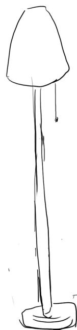

<details>
<summary>natural_image</summary>

Simple line drawing of a lamp with a curved shade and vertical stem (no text or symbols)
</details>

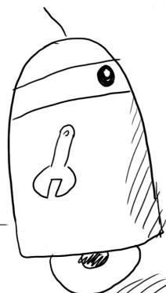

<details>
<summary>natural_image</summary>

Simple line drawing of a stylized helmet or bell with a fork and circular head (no text or symbols)
</details>

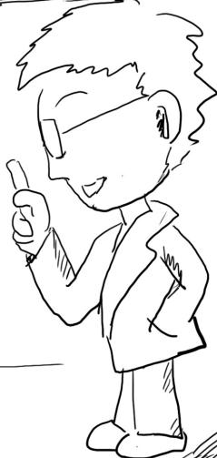

<details>
<summary>natural_image</summary>

Cartoon drawing of a person in a suit and glasses, pointing upward (no text or symbols)
</details>


高翔

张涛

刘毅

颜沁睿

## 谨 以此书献路

## 噜 嘴

## 闲居士

## 序

请谁来写序好呢？

## 作者自序

等我有空就写。

## 目录

## 第 1 讲 前言 1

1.1 本书讲什么 . . . . . . . .  
1.2 如何使用本书 . . . . . . . 3

1.2.1 组织方式 . . . . . . . 3  
1.2.2 代码 . . . . . . . 5  
1.2.3 面向的读者 . . . . . . 6

1.3 风格约定 6  
1.4 致谢和声明 . . . . . . 8

## 第 2 讲 初识 SLAM 10

2.1 引子：小萝卜的例子 . . . . . 12  
2.2 经典视觉 SLAM 框架 . . . . 18

2.2.1 视觉里程计 . . . . . . 19  
2.2.2 后端优化 . . . . . . . 21  
2.2.3 回环检测 . . . . . . . 21  
2.2.4 建图 . . . . . . . . . . 22

2.3 SLAM 问题的数学表述 . . . . 24  
2.4 实践：编程基础 . . . . . . . . 27

2.4.1 安装 Linux 操作系统 . 27  
2.4.2 Hello SLAM . . . . . . 29  
2.4.3 使用 cmake . . . . . . 30  
2.4.4 使用库 . . . . . . . . . 32  
2.4.5 使用 IDE . . . . . . . 34

## 第 3 讲 三维空间刚体运动 39

3.1 旋转矩阵 . . . . 41

3.1.1 点和向量，坐标系 . . 41  
3.1.2 坐标系间的欧氏变换 . 42  
3.1.3 变换矩阵与齐次坐标 . 45

3.2 实践：Eigen . . . . . . . . 46  
3.3 旋转向量和欧拉角 . . . . . . 50

3.3.1 旋转向量 . . . . . . . 50  
3.3.2 欧拉角 . . . . . . . . . 52

3.4 四元数 . . . . . . 53

3.4.1 四元数的定义 . . . . . 53  
3.4.2 四元数的运算 . . . . . 55  
3.4.3 用四元数表示旋转 . . 57  
3.4.4 四元数到旋转矩阵的转换 . . 57

3.5 \* 相似、仿射、射影变换 . . . 58  
3.6 实践：Eigen 几何模块 . . . . 59  
3.7 可视化演示 . . . . . . . 62

## 第 4 讲 李群与李代数 64

4.1 李群李代数基础 . . . . . . . . 66

4.1.1 群 . . . 66  
4.1.2 李代数的引出 . . . . . 67  
4.1.3 李代数的定义 . . . . . 69  
4.1.4 李代数 so(3) . . . . . 69  
4.1.5 李代数 se(3) . . . . . 70

4.2 指数与对数映射 . . . . . . . . 71

4.2.1 SO(3) 上的指数映射 . 71  
4.2.2 SE(3) 上的指数映射 . 73

4.3 李代数求导与扰动模型 . . . . 74

4.3.1 BCH 公式与近似形式 74  
4.3.2 SO(3) 李代数上的求导 76  
4.3.3 李代数求导 . . . . . . 77  
4.3.4 扰动模型（左乘） . . 78

4.3.5 SE(3) 上的李代数求导 79

4.4 实践：Sophus . . . . . . . . . 80

4.5 \* 相似变换群与李代数 . . . . 82

4.6 小结 . . . . 84

## 第 5 讲 相机与图像 85

5.1 相机模型 87

5.1.1 针孔相机模型 . . . . . 87

5.1.2 畸变 . . . . . . . . . . 90

5.1.3 双目相机模型 . . . . . 93

5.1.4 RGB-D 相机模型 . . . 95

5.2 图像 . . . . 97

5.2.1 计算机中图像的表示 . 97

5.3 实践：图像的存取与访问 . . 99

5.3.1 安装 OpenCV . . . . . 99

5.3.2 操作 OpenCV 图像 . . 100

5.4 实践：拼接点云 . . . . . . . . 103

## 第 6 讲 非线性优化 108

6.1 状态估计问题 . . . . . . . . . 110

6.1.1 最大后验与最大似然 . 110

6.1.2 最小二乘的引出 . . . . 112

6.2 非线性最小二乘 . . . . . . . . 113

6.2.1 一阶和二阶梯度法 . . 114

6.2.2 Gauss-Newton . . . . 115

6.2.3 Levenberg-Marquadt . 117

6.2.4 小结 . . . . . . . . . . 119

6.3 实践：Ceres . . . . . . . . . . 120

6.3.1 Ceres 简介 . . . . . . 120

6.3.2 安装 Ceres . . . . . . 121

6.3.3 使用 Ceres 拟合曲线 . 121

6.4 实践：g2o . . . . . . . . . . . 125

6.4.1 图优化理论简介 . . . . 125

6.4.2 g2o 的编译与安装 . . 126

6.4.3 使用 g2o 拟合曲线 . . 127

6.5 小结 . . . . . 131

## 第 7 讲 视觉里程计 1 133

7.1 特征点法

7.1.1 特征点 . . . . . . . . . 134

7.1.2 ORB 特征 . . . . . . . 136

7.1.3 特征匹配 . . . . . . . 139

7.2 实践：特征提取和匹配 . . . . 140

7.3 2D-2D: 对极几何 . . . . . . . 143

7.3.1 对极约束 . . . . . . . 143

7.3.2 本质矩阵 . . . . . . . 146

7.3.3 单应矩阵 . . . . . . . 148

7.4 实践：对极约束求解相机运动 151

7.4.1 讨论 . . . . . . . . . . 154

7.5 三角测量 . . .

7.6 实践：三角测量 . . . . . . . . 157

7.6.1 三角测量代码 . . . . . 157

7.6.2 讨论 . . . . . . . . . . 159

7.7 3D-2D: PnP . . . . . . . . . . 160

7.7.1 直接线性变换 . . . . . 160

7.7.2 P3P . . . . . . . . . . 162

7.7.3 Bundle Adjustment . . 164

7.8 实践：求解 PnP . . . . . . . 168

7.8.1 使用 EPnP 求解位姿 . 168

7.8.2 使用 BA 优化 . . . . . 169

7.9 3D-3D: ICP . . . . . . . . . . 175

7.9.1 SVD 方法 . . . . . . . 175

7.9.2 非线性优化方法 . . . . 177

7.10 实践：求解 ICP . . . . . . . 178

7.10.1 SVD 方法 . . . . . . . 178

7.10.2 非线性优化方法 . . . . 180

7.11 小结 . . .

## 第 8 讲 视觉里程计 2 184

8.1 直接法的引出 . . . . . . . . . 185  
8.2 光流（Optical Flow） . . . . 186

8.2.1 Lucas-Kanade 光流 . . 187

8.3 实践：LK 光流 . . . . . . . . 189

8.3.1 使用 TUM 公开数据集 189  
8.3.2 使用 LK 光流 . . . . . 190

8.4 直接法（Direct Methods） . 193

8.4.1 直接法的推导 . . . . . 193  
8.4.2 直接法的讨论 . . . . . 197

8.5 实践：RGB-D 的直接法 . . . 197

8.5.1 稀疏直接法 . . . . . . 197  
8.5.2 定义直接法的边 . . . . 198  
8.5.3 使用直接法估计相机运动 . 200  
8.5.4 半稠密直接法 . . . . . 201  
8.5.5 直接法的讨论 . . . . . 202  
8.5.6 直接法优缺点总结 . . 205

## 第 9 讲 实践章：设计前端 207

9.1 搭建 VO 框架 . . . . . . . . . 208

9.1.1 确定程序框架 . . . . . 209  
9.1.2 确定基本数据结构 . . 210  
9.1.3 Camera 类 . . . . . . 212  
9.1.4 Frame 类 . . . . . . . 214  
9.1.5 MapPoint 类 . . . . . 215  
9.1.6 Map 类 . . . . . . . . 216  
9.1.7 Config 类 . . . . . . . 217

9.2 基本的 VO：特征提取和匹配 218

9.2.1 两两帧的视觉里程计 . 219  
9.2.2 讨论 . . . . . . . . . . 226

9.3 改进：优化 PnP 的结果 . . . 227  
9.3.1 讨论 . . . . . . . . . . 229  
9.4 改进：局部地图 . . . . . . . . 229

## 9.5 小结 . . . . . . 235

## 第 10 讲 后端 1 237

10.1 概述 . . . . 238

10.1.1 状态估计的概率解释 . 238  
10.1.2 线性系统和 KF . . . . 241  
10.1.3 非线性系统和 EKF . . 244  
10.1.4 EKF 的讨论 . . . . . . 245

10.2 BA 与图优化 . . . . . . . . . 246

10.2.1 投影模型和 BA 代价  
10.2.2 BA 的求解 . . . . . . 248  
10.2.3 稀疏性和边缘化 . . . . 250  
10.2.4 鲁棒核函数 . . . . . . 257  
10.2.5 小结 . . . . . . . . . . 258

10.3 实践：g2o . . . . . . . . . . . 259

10.3.1 BA 数据集 . . . . . . 259  
10.3.2 g2o 求解 BA . . . . . 260  
10.3.3 求解 . . . . . . . . . . 264

10.4 实践：Ceres . . . . . . . . . . 266

10.4.1 Ceres 求解 BA . . . . 266  
10.4.2 求解 . . . . . . . . . . 268

10.5 小结 . . . 270

## 第 11 讲 后端 2 272

11.1 位姿图（Pose Graph） . . . . 273

11.1.1 Pose Graph 的意义 . . 273  
11.1.2 Pose Graph 的优化 . . 274

11.2 实践：位姿图优化 . . . . . . 276

11.2.1 g2o 原生位姿图 . . . . 276  
11.2.2 李代数上的位姿图优化 280  
11.2.3 小结 . . . . . . . . . . 285

11.3 \* 因子图优化初步 . . . . . . . 286

11.3.1 贝叶斯网络 . . . . . . 286  
11.3.2 因子图 . . . . . . . . . 287

11.3.3 增量特性 . . . . . . . 289

11.4 \* 实践：gtsam . . . . . . . . 290

11.4.1 安装 gtsam 4.0 . . . . 290

11.4.2 位姿图优化 . . . . . . 291

## 第 12 讲 回环检测 298

12.1 回环检测概述 . . . . . . . . . 299

12.1.1 回环检测的意义 . . . . 299

12.1.2 方法 . . . . . . . . . . 300

12.1.3 准确率和召回率 . . . . 301

12.2 词袋模型 . 303

12.3 字典 . . . . 305

12.3.1 字典的结构 . . . . . . 305

12.3.2 实践：创建字典 . . . . 307

12.4 相似度计算 . . . . . . . . . . 309

12.4.1 理论部分 . . . . . . . 309

12.4.2 实践：相似度的计算 . 310

12.5 实验分析与评述 . . . . . . . . 314

12.5.1 增加字典规模 . . . . . 314

12.5.2 相似性评分的处理 . . 316

12.5.3 关键帧的处理 . . . . . 316

12.5.4 检测之后的验证 . . . . 316

12.5.5 与机器学习的关系 . . 317

## 第 13 讲 建图 319

13.1 概述 . . . 320

13.2 单目稠密重建 . . . . . . . . . 322

13.2.1 立体视觉 . . . . . . . 322

13.2.2 极线搜索与块匹配 . . 323

13.2.3 高斯分布的深度滤波器 325

13.3 实践：单目稠密重建 . . . . . 328

13.3.1 实验结果 . . . . . . . 337

13.4 实验分析与讨论 . . . . . . . . 339

13.4.1 像素梯度的问题 . . . . 339

13.4.2 逆深度 . . . . . . . . . 341

13.4.3 图像间的变换 . . . . . 342

13.4.4 并行化：效率的问题 . 343

13.4.5 其他的改进 . . . . . . 343

13.5 RGB-D 稠密建图 . . . . . . . 344

13.5.1 实践：点云地图 . . . . 344

13.5.2 八叉树地图 . . . . . . 348

13.5.3 实践：八叉树地图 . . 351

13.6 \*TSDF 地图和 Fusion 系列 . 353

13.7 小结 . . . 356

## 第 14 讲 SLAM：现在与未来 358

14.1 当前的开源方案 . . . . . . . . 359

14.1.1 MonoSLAM . . . . . . 360

14.1.2 PTAM . . . . . . . . . 361

14.1.3 ORB-SLAM . . . . . . 362

14.1.4 LSD-SLAM . . . . . . 364

14.1.5 SVO . . . . . . . . . . 366

14.1.6 RTAB-MAP . . . . . . 367

14.1.7 其他 . . . . . . . . . . 368

14.2 未来的 SLAM 话题 . . . . . . 368

14.2.1 视觉 + 惯导 SLAM . 369

14.2.2 语义 SLAM . . . . . . 370

14.2.3 SLAM 的未来 . . . . . 372

## 附录 A 高斯分布的性质 373

A.1 高斯分布 . . . . . . . . . . . 373

A.2 高斯分布的运算 . . . . . . . . 373

A.2.1 线性运算 . . . . . . . 373

A.2.2 乘积 . . . . . . . . . . 374

A.2.3 复合运算 . . . . . . . 374

A.3 复合的例子 . . . . . . . . . . 374

## 附录 B ROS 入门 375

B.1 ROS 是什么 . . . . . . . . . . 375

B.2 ROS 的特点 . . . . . . . . . . 375

B.3 如何快速上手 ROS？ . . . . . 376

## 第 1 讲前言

## 1.1 本书讲什么

这是一本介绍视觉 SLAM 的书，也很可能是第一本以视觉 SLAM 为主题的中文书。

SLAM 是什么？

SLAM 是 Simultaneous Localization and Mapping 的缩写，中文译作“同时定位与地图构建”[1]。它是指搭载特定传感器的主体，在没有环境先验信息的情况下，于运动过程中建立环境的模型，同时估计自己的运动 [2]。如果这里的传感器主要为相机，那就称为“视觉 SLAM”。

视觉 SLAM 是本书的主题。我们刻意把许多个定义放到一句话中，让读者有一个较明确的概念。首先，SLAM 的目的是解决“定位”与“地图构建”这两个问题。也就是说，一边要估计传感器自身的位置，一边要建立周围环境的模型。怎么解决的呢？这需要用到传感器的信息。传感器能以一定形式观察外部的世界，不过不同传感器观察方式是不同的。这个问题为什么值得花一本书的内容去讨论呢？因为它很难——特别是我们希望实时地、在没有先验知识的情况下进行 SLAM。当用相机作为传感器时，我们要做的，就是根据一张张连续运动的图像（它们形成一段视频），从中推断相机的运动，以及周围环境的情况。

这似乎是个很直观的问题。当我们自己走进陌生的环境时，不就是这么做的吗？

在计算机视觉（Computer Vision）研究的创立之初，人们就想象着有朝一日，计算机将和人一样，通过眼睛去观察世界，理解周遭的物体，探索未知的领域——这是一个美妙而又浪漫的梦想，吸引了无数的科研人员日夜为之奋斗 [3]。我们曾经以为这件事情并不困难，然而事情却远不如预想的那么顺利。我们眼中的花草树木，虫鱼鸟兽，在计算机中却是那样的不同：它们只是一个个由数字排列而成的矩阵（Matrix）。让计算机理解图像的内容，就像让我们自己理解这些数字一样的困难。我们既不了解自己如何理解图像，也不知道计算机该如何理解、探索这个世界。于是我们困惑了很久，直到几十年后的今日，才发现一点点成功的迹象：通过人工智能（Artificial Intelligence）和机器学习（Machine Learning）技术，计算机渐渐能够辨认出物体、人脸、声音、文字——尽管它的方式（概率学建模）与我们是如此的不同。另一方面，在 SLAM 发展了将近三十年之后，我们的相机才渐渐开始能够认识到自身的位置，发觉自己在运动——虽然方式还是和我们人类有巨大的差异。至少，研究者们已经成功地搭建出种种实时 SLAM 系统，有的能够快速跟踪自身位置，有的甚至能够进行实时的三维重建。

这件事情确实很困难，但我们已经有了很大的进展。更令人兴奋的是，近年来的科技发展，涌现出一大批与 SLAM 相关的应用点。在许多地方，我们都希望知道自身的位置：室内的扫地机和移动机器人需要定位，野外的自动驾驶汽车需要定位，空中的无人机需要定位，虚拟现实和增强现实的设备也需要定位。SLAM 是那样重要。如果没有它，扫地机就无法在房间自主地移动，只能盲目地游荡；家用机器人就无法按照指令准确到达某个房间；虚拟现实就永远固定在座椅之上——所有这些新奇的事物都无法出现在现实的生活中，那将是多么遗憾。

今天的研究者和应用开发人员，正在意识到 SLAM 技术的重要性。在国际上，SLAM已经有近三十年的研究历史，也一直是机器人和计算机视觉的研究热点。二十一世纪以来，以视觉传感器为中心的视觉 SLAM 技术，在理论和实践上都经历了明显的转变与突破，正逐步从实验室研究迈向市场应用。同时，我们又遗憾地看到，至少在国内，SLAM 的相关论文、书籍，仍然处于非常匮乏的状态，让许多对 SLAM 技术感兴趣的初学者们无从窥其门径。虽然 SLAM 的理论框架基本趋于稳定，但其编程实现仍然较为复杂，有着较高的技术门槛。刚走进 SLAM 领域研究者们，不得不花很长的时间，学习大量的知识，走过许多弯路，才得以接近 SLAM 技术的核心。

我们希望通过这本书，全面系统地向读者介绍以视觉传感器为主体的视觉 SLAM 技术，（部分地）弥补这方面资料的空白。我们会详细地介绍 SLAM 的理论背景、系统架构，以及各个模块的主流做法。同时，我们极其重视实践：在本书介绍的所有重要算法，我们都将给出可以运行的实际代码，以求加深读者的理解。这么做的原因，主要是考虑到 SLAM毕竟是一项和实践紧密相关的技术。再漂亮的数学理论，如果不能转换为可以运行的代码，那就仍是可望不可即的空中楼阁，没有实际的意义。我们相信，实践出真知，实践出真爱。只有当您实际地运算过各种算法之后，才能真正地认识 SLAM，真正地喜欢上科研。

SLAM 自 1986 年提出之后 [4]，一直以来是机器人领域的热点问题。关于它的文献数以千计，想要对 SLAM 发展史上的所有算法及变种，作一个完整的说明，是十分困难而且没有必要的。我们会介绍 SLAM 牵涉到的背景知识，例如射影几何、计算机视觉、状态估计理论、李群李代数等，并在这些背景知识之上，给出 SLAM 这棵大树的主干，而略去一部分形状奇特、纹理复杂的枝叶。我们认为这种做法是有效的。如果读者能够掌握主干的精髓，那么自然会有能力去探索那些边缘的、细节的、错综复杂的前沿知识。所以，我们的目的是，让一个 SLAM 的初学者通过阅读本书，快速地成长为一个能够探索这个领域边缘的研究学者。另一方面，如果您已经是 SLAM 领域的研究人员，那或许本书也会有一部分您还觉得陌生的地方，可以让您产生新的见解。

目前，与 SLAM 相关的书籍主要有《概率机器人》（Probabilistic robotics）[5]、《计算机视觉中的多视图几何》（Multiple View Geometry in Computer Vision）[3]、《机器人学中的状态估计》（State Estimation for Robotics: A Matrix-Lie-Group Approach）[6] 等。它们内容丰富、论述全面、推导严谨，在 SLAM 研究者中间是脍灸人口的经典教材。然而就目前看来，还存在两个重要的问题：其一，这些图书目的在于介绍基础理论，SLAM 只是它们应用之一。因此，它们并不能算是专门讲解 SLAM 的书籍。其二，它们的内容偏重于数学理论，基本不涉及编程实现，导致读者经常出现“书能看懂却不会编程”的情况。而我们认为，只有读者亲自实现了算法，调试了各个参数，才能谈得上真正理解问题本身。

我们会提及 SLAM 的历史、理论、算法、现状，并且把完整的 SLAM 系统分成几个模块：视觉里程计、后端优化、建图以及回环检测。我们将陪着读者一点点实现这些模块中的核心部分，探讨它们在什么情况下有效，什么情况下会出问题，并指导您如何在自己的机器上运行这些代码。您会接触到一些必要的数学理论和许多编程知识，会用到 Eigen、OpenCV、PCL、g2o、Ceres 等库①，掌握它们在 Linux 操作系统中的使用方法。

从写作风格上，我们不想把这本书写成枯燥的理论书籍。技术类书应该是严谨可靠的，但严谨不意味着严肃和呆板。技术书同时也该是幽默的、生动有趣又易于理解的。有时候您会觉得“这个作者怎么这么不正经”——请您原谅，因为我本来就不是一个过于严肃的人②。不管如何，有一件事情我能够确定：只要您是一个对这门新技术感兴趣的人，我保证在学习本书的过程中，肯定会有收获！您会掌握与 SLAM 相关的理论知识，你的编程能力也将有明显的进步。在很多时候，您会有一种“我在陪你一起做科研”的感觉，这正是我所希望的。但愿您能在此过程中发现研究的乐趣，喜欢这种“通过一番努力，看到事情顺利运行”的成就感。

总之，话不多说，旅行愉快！我之后不会用“您”来称呼读者了，这似乎会显得有些隔阂感。如何佳用大书

## 1.2 如何使用本书

## 1.2.1 组织方式

本书名为“视觉 SLAM 十四讲”。顾名思义，我们会像在学校里讲课那样，以“讲”作为书籍的基本单元。每一讲都对应一个固定的主题，这个主题里会穿插“理论部分”和“实践部分”两种内容。通常是理论部分在前，实践部分在后，不过也有部分章节例外。理论部分中，我们将介绍理解算法所必要的数学知识，并且大多数时候以叙述的方式，而不是像数学书那样用“定义——定理——推论”的方式，因为我觉得这样的方式阅读起来更容易一些，尽管有时候显得不那么严谨。实践部分主要是编程实现，讨论程序里各部分的含义以及实验结果。在目录里看到的带有“实践”两个字的章节，你就应该（兴致勃勃地）打开电脑，和我们一起愉快地码代码了。我尽量让每一讲都保持统一的结构，但是由于每讲的内容并不相同，有些章节会显得长一些，另一些则短一点。如果我觉得有必要使用多个实践环节，那么一讲中也会有多个“理论部分”和“实践部分”。

值得一提的是，我只会把解决问题相关的数学知识放在书里，尽量保持它们足够浅显。我本人是工科生，也坦荡荡地承认某些做法只要经验上够用，没必要非得在数学上追求完备。只要我们知道这些算法能够工作，并且数学家们告诉了我在这什么情况下可能不工作，那我就表示满意，而不追究那些看似完美但实际复杂冗长的证明（当然它们固有自己的价值）。由于 SLAM 牵涉到了太多数学背景，为了防止本书变成数学书，我们把一些细节上的推导和证明留作习题和补充阅读材料，让感兴趣的读者进一步阅读参考文献，更深入地掌握那些细节。

每讲正文之后，我们设计了一些习题。带 \* 号的习题是具有一定难度的。我非常建议读者把习题练习一遍，这对你掌握这些知识很有帮助①。

全书的内容主要分为两个部分：

1. 第一部分为数学基础篇，我们会以浅显易懂的方式，铺垫与视觉 SLAM 相关的数学知识，包括：

• 本讲是前言，介绍这本书的基本信息，习题部分主要包括一些自测题。

• 第二讲为 SLAM 系统概述，介绍一个 SLAM 系统由哪些模块组成，各模块的具体工作是什么。实践部分介绍编程环境的搭建过程以及 IDE 的使用。

• 第三讲介绍三维空间运动，你将接触旋转矩阵、四元数、欧拉角的相关知识，并且在 Eigen 当中使用它们。

• 第四讲为李群和李代数。如果你现在不懂李代数为何物，也没有关系。你将学习李代数的定义和使用方式，然后通过 Sophus 操作它们。

• 第五讲介绍针孔相机模型以及图像在计算机中的表达。你将用 OpenCV 来调取相机的内外参数。

• 第六讲介绍非线性优化，包括状态估计理论基础、最小二乘问题、梯度下降方法。你会完成一个使用 Ceres 和 g2o 进行曲线拟合的实验。

这些就是我们所有的数学了，当然还有你以前学过的高等数学和线性代数。我保证它们看起来都不会很难——当然若你想进一步深入挖掘，我们会提供一些参考资料供你阅读，那些材料可能会比正文里讲的那些难一点。

2. 第二部分为 SLAM 技术篇。我们会使用第一部分所介绍的理论，讲述视觉 SLAM中各个模块的工作原理。

• 第七讲为特征点法的视觉里程计。该讲内容比较多，包括特征点的提取与匹配、对极几何约束的计算、 $\mathrm { P n P }$ 和 $\mathrm { I C P }$ 等。在实践中，你将用这些方法去估计两个图像之间的运动。

• 第八讲为直接法的视觉里程计。你将学习光流和直接法的原理，然后利用 $\mathrm { g 2 o }$ 实现一个简单的 RGB-D 直接法。

• 第九讲为视觉里程计的实践章，你将搭建一个视觉里程计框架，综合应用先前学过的知识，实现它的基本功能。从中你会碰到一些问题，例如优化的必要性、关键帧的选择等。

• 第十讲为后端优化，主要为 Bundle Adjustment 的深入讨论，包括基本的 BA以及如何利用稀疏性加速求解过程。你将用 Ceres 和 g2o 分别书写一个 BA 程序。

• 第十一讲主要讲后端优化中的位姿图。位姿图是表达关键帧之间约束的一种更紧凑的形式。你将用 g2o 和 gtsam 对一个位姿球进行优化。

• 第十二讲为回环检测，我们主要介绍以词袋方法为主的回环检测。你将使用dbow3 书写字典训练程序和回环检测程序。

• 第十三讲为地图构建。我们会讨论如何使用单目进行稠密深度图的估计（以及这是多么不可靠），然后讨论 RGB-D 的稠密地图构建过程。你会书写极线搜索与块匹配的程序，然后在 RGB-D 中遇到点云地图和八叉树地图的构建问题。

• 第十四讲主要介绍当前的开源 SLAM 项目以及未来的发展方向。相信阅读了前面的知识之后，你会更容易理解它们的原理，实现自己的新想法。

最后，如果你完全看不懂上面在说什么，恭喜你！这本书很适合你！加油！

## 1.2.2 代码

本书所有源代码均托管到 github 上：

$$
\lceil \text {https : / / github.com / gaoxiang12 / slambook} \rceil
$$

我强烈建议读者下载它们以供随时查看。代码是按章节划分的，比如第 7 讲的内容就会放在 ch7 文件夹中。此外，本书用到的一些小型库会以压缩包的形式放在 3rdparty 文件夹下，省去了你收集它们的时间。对于像 OpenCV 那种大中型库，我会在它们第一次出现时介绍它的安装方法。如果你对代码有任何疑问，请点击 github 上的 issues 按钮，提交一个问题。确实是代码出现问题的话，我会及时修改；如果是你的理解错了，我也会回复你。如果你不会用 git，没有关系，点击右侧带有 download 的按钮下载至本地即可。网上能搜索到很多关于 git 和 github 的使用教程。

## 1.2.3 面向的读者

本书面向对 SLAM 感兴趣的学生和研究人员。为了能够流畅地阅读本书，我们假设你具备了以下知识：

• 高等数学、线性代数、概率论。 大部分读者应该在大学本科接触过的基本数学知识。你应当明白矩阵和向量是什么，或者做微分和积分是什么意义。对于 SLAM 中用到的专业知识，我们会额外加以介绍。  
• C++ 语言基础。 由于我们采用 C++ 作为编码语言，所以建议读者至少熟悉这门语言的语法。比如，你应该知道类是什么，如何使用 C++ 标准库，模板类如何使用等等。我们避免过多地使用技巧，但有些地方我们不得不如此。此外，我们还使用了一些 C++ 11 标准的内容，但会在用到的地方加以解释。  
• Linux 基础。我们的开发环境是 Linux 而非 Windows，并且只提供 Linux 下的源程序，不会再提供 Windows 下的开发方法介绍。我们认为掌握 Linux 是一个 SLAM研究人员所必须的，请初学者们暂时不要问为什么，把本书的知识学好之后你就会和我有同样的想法。各种程序库在 Linux 下配置都非常便捷，你也会在此过程中体会到 Linux 的便利。如果读者此前从未使用过 Linux，最好找一本 Linux 教材稍加学习（看懂基本知识即可，一般都是那些书的前几章）。我们不要求读者具有高超的 Linux技术，但希望读者至少知道“打开终端，进入代码目录”是如何操作的。如果你对自己的 Linux 水平不够自信，本讲的习题里有一些 Linux 知识自测题。如果你清楚自测题的答案，那阅读本书代码不会有任何问题。

对 SLAM 感兴趣但不具备上述知识的读者，可能在阅读本书时会感到困难。如果你没有 C++ 的基本知识，可以读一点《C++ Primer Plus》之类的书入个门；如果你缺少相关的数学知识，也可以先补充一些数学教材，不过我认为对大多数大学本科水平的朋友，读懂本书所需的数学背景肯定是足够了。代码方面，你最好花点时间亲自输入一遍，再调节里面的参数，看看效果会发生怎样的改变。这会对学习很有帮助。

本书可以作为 SLAM 相关课程的教材，亦可作为课外自学材料。

## 1.3 风格约定

由于本书既有数学理论，也有编程实现，需要对不同内容给予不同排版方式加以区别：

1. 数学公式单独列出，重要公式在右侧记序号，例如：

$$
\boldsymbol {y} = \boldsymbol {A} \boldsymbol {x}. \tag {1.1}
$$

标量使用斜体字（如 a），向量和矩阵使用粗斜体（如 a,A）。空心粗体代表特殊集合，如实数集 R，整数集 Z。李代数部分使用哥特体，如 se(3)。

2. 程序代码以方框框出，使用小号字体，左侧带有行号。如果程序较长，方框会延续到下一页：

```cpp
#include <iostream>
using namespace std;

int main ( int argc, char** argv )
{
    cout<<"Hello"<<endl;
    return 0;
}
```

3. 当代码数量较多或与有部分与之前列出的重复，不适于完全列在书中时，我们仅给出重要片段，并以（片段）二字注明。因此，我们强烈建议读者到 github 上下载所有源代码，完成练习，以更好地掌握本书知识。

4. 由于排版原因，书中展示的代码会与github中代码有稍许排版上的不同。请以github代码为准。

5. 我们用到的每个库，在第一次出现的时候会有比较详细的说明，但在后续的使用中就不再反复赘述。所以，建议读者按章节顺序阅读本书内容。

6. 每节的开头会给出本讲的内容提要，而末尾会有小结和练习题。引用的参考文献在书的最后列出。

7. 带有星号开头的章节是选读部分，读者可以视兴趣阅读。跳过它们不会对理解后续章节产生影响。

8. 重要内容在文中以黑体标出，你可能已经习惯了。

9. 我们设计的实验大多数是演示性质。看懂了它们不代表你已经熟悉整个库的使用。所以我们建议你在课外花一点时间，对本书经常用的几个库进行深入的学习。

10. 本书的习题和选读内容可能需要你自己搜索额外材料，所以你需要学会使用搜索引擎。

## 1.4 致谢和声明

在本书漫长写作过程中，我得到了许多人的帮助，包括但不限于：

• 中科院的贺一家博士为第五章相机模型部分提供了材料；  
• 颜沁睿提供了第七章的公式推导材料；  
• 华中科大的刘毅博士为本书第六、第十章提供了材料；  
• 大量的老师、同学为本书提供了修改意见，包括但不限于：肖锡臻、谢晓佳、耿欣、李帅杰、刘富强、袁梦、孙志明、陈昊升、王京、朱晏辰、丁文东、范帝楷、衡昱帆、高扬、李少朋、吴博、闫雪娇、张腾、郑帆、卢美奇、杨楠等等。在此向他们表示感谢。

此外，感谢我的导师张涛教授对我一直以来的支持和帮助。感谢电子工业出版社郑柳洁编辑的支持。没有他们的帮助，本书不可能以现在的形式来到读者面前。本书的成书与出版是所有人努力的结晶，尽管我没法把他们都列在作者列表中，但是它的出版离不开他们的工作。

本书的写作参考了大量文献和论文。其中大部分数学理论知识是前人研究的成果。我经过阅读这些材料之后，再进行转述和归纳。那些内容不是原创工作。一小部分实验设计亦来自各开源代码的演示程序，但大部分是我自己写的。此外，也有一些图片摘自公开发表的期刊或会议论文，我均已加了引用。没有引用标记的图像，或者是我的原创，或者是来自网络，恕不一一列举。如果你发现某图片拥有版权而未加出处，请及时与我联系，我会第一时间修正。

本书涉及知识点众多，难免有错误或缺漏。如你发现错误，请通过电子邮件联系我。

感谢我的爱人刘丽莲女士长期的理解和支持。这本书是献给她的。

我的邮箱是：gaoxiang12@mails.tsinghua.edu.cn 。

## 习题（基本知识自测题）

1. 有线性方程 Ax = b，当我们知道 A,b，想要求解 x 时，如何求解？这对 A 和 b 需要哪些条件？提示：从 A 的维度和秩角度来分析。  
2. 高斯分布是什么？它的一维形式是什么样子？它的高维形式是什么样子？  
3. 你知道 C++ 的类吗？你知道 STL 吗？你使用过它们吗？  
4. 你以前怎样书写 C++ 程序？（你完全可以说只在 VC6.0 下写过 C++ 工程，只要你有写 C++ 和 C 语言经验就行。）

5. 你知道 C++11 标准吗？其中哪些新特性你之前听说过或使用过？有没有其他的标准？  
6. 你知道 Linux 吗？你有没有至少使用过其中之一（安卓不算），比如 Ubuntu？  
7. Linux 的目录结构是什么样的？你知道哪些基本命令，比如 ls, cat 等等？  
8. 如何在 Ubuntu 中安装软件（不打开软件中心的情况下）？这些软件被安装在什么地方？当我只知道模糊的软件名称（比如我想要装一个 eigen 名称的库），我应该如何安装它？  
9. \* 花一个小时学习一下 Vim，因为你迟早会用它。你可以在终端中输入 vimtutor 阅读一遍所有内容。我们不需要你非常熟练地操作它，只要在学习本书的过程中使用它键入代码即可。不要在它的插件上浪费时间，不要想着把 vim 用成 IDE，我们只用它做文本编辑的工作。

## 第 2 讲

# 初识 SLAM

## 本节目标

1. 理解一个视觉 SLAM 框架由哪几个模块组成，各模块的任务是什么。  
2. 搭建编程环境，为开发和实验做准备。  
3. 理解如何在 Linux 下编译并运行一个程序。如果它出了问题，我们又如何对它进行调试。  
4. 掌握 cmake 的基本使用方法。

本讲概括地介绍一个视觉 SLAM 系统结构，作为后续章节的大纲。实践部分介绍环境搭建、程序基本知识，最后完成一个 Hello SLAM 程序。

Visnd Odomety 视觉里程计

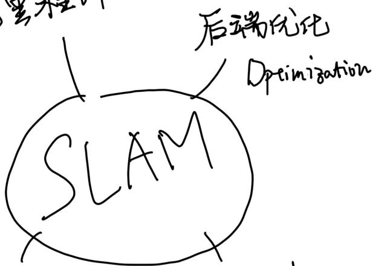

<details>
<summary>text_image</summary>

SLAM
后端优化
Optimization
</details>

回环检测

L cwe地图构建Mmmm

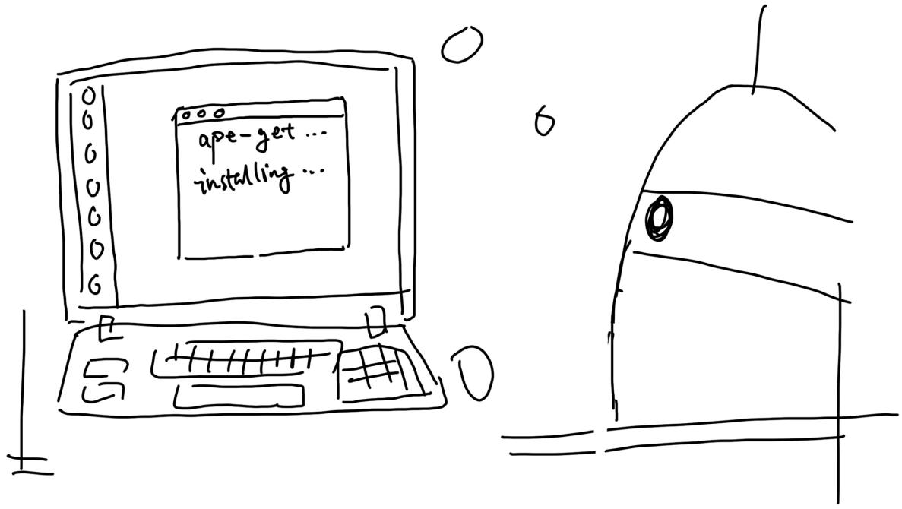

<details>
<summary>text_image</summary>

ape-get ...
installing ...
</details>

## 2.1 引子：小萝卜的例子

我发现上来就给出一列符号，讲“SLAM 的数学定义”这样的方式，会让初学者觉得难以接受。从一个实际的例子谈起会更好一些。假设我们组装了一台叫做“小萝卜”的机器人，大概长的像图 2-1 这个样子。（由于工程制图要求严格一些，所以这张图就不手绘了。）

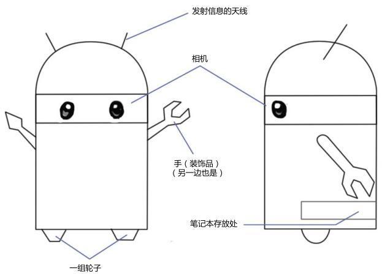

<details>
<summary>text_image</summary>

发射信息的天线
相机
手（装饰品）
（另一边也是）
笔记本存放处
一组轮子
</details>

小萝卜设计图  
图 2-1 左边：正视图；右边：侧视图。设备有相机、轮子、笔记本，手是装饰品。

虽然有点像安卓，但它并不是靠安卓系统来计算的。我们把一台笔记本塞进了它的后备箱内（方便我们随时拿出来调试程序）。它能做点什么呢？

我们希望小萝卜具有自主运动能力。虽然世界上也有放在桌面像摆件一样的机器人，能够和人说话或播放音乐，不过一台平板电脑完全可以胜任这些事情。作为机器人，我们希望小萝卜能够在房间里自由的移动。不管我在哪里招呼一声，它都会嘀溜溜地走过来。

要移动首先得有轮子和电机，所以我们在小萝卜下方安装了轮子（足式机器人步态很复杂我们暂时不考虑）。有了轮子，机器人就能够四处行动了，但不加控制的话，小萝卜不知道行动的目标，只能四处乱走，更糟糕地的情况下会撞上墙损坏自己。为了避免这种情况的发生，我们在它脑袋上安装了一个相机。安装相机的主要动机，是考虑到这样一个机器人和人类非常相似——从画面上一眼就能看出。有眼睛、大脑和四肢的人类，能够在任意环境里轻松自在地行走、探索，我们（天真地）也觉得机器人能够完成这件事。为了使小萝卜能够探索一个房间，它至少需要知道两件事：

1. 我在什么地方？— 定位。  
2. 周围环境是什么样？— 建图。

“定位”和“建图”，可以看成感知的“内外之分”。作为一个“内外兼修”的小萝卜学家，一方面要明白自身的状态（即位置），另一方面也要了解外在的环境（即地图）。当然，解决这两个问题的方法非常之多。比方说，我们可以在房间地板上铺设导引线，在墙壁上贴识别二维码，在桌子上放置无线电定位设备。如果在室外，还可以在小萝卜脑袋上安装 GPS 定位设备（像手机或汽车一样）。有了这些东西之后，定位问题是否已经解决了呢？我们不妨把这些传感器分为两类。


<details>
<summary>text_image</summary>

Hand holding a tablet displaying a QR code and a mobile app interface with the text 'SUFENCO.com' and 'SUPFEN数字地图'
</details>

(a)

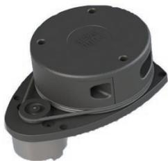

<details>
<summary>natural_image</summary>

3D rendering of a black plastic mechanical component with mounting flanges and central hub (no text or symbols visible)
</details>

(d)

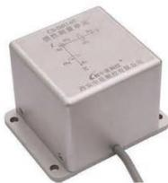

<details>
<summary>text_image</summary>

Circuit
特有测量点
Z=2.5V
Z=1.5V
Z=0.5V
Z=0.25V
Z=0.1V
Z=0.05V
Z=0.025V
Z=0.01V
Z=0.005V
Z=0.0025V
Z=0.001V
Z=0.0005V
Z=0.00025V
Z=0.0001V
Z=0.00005V
Z=0.000025V
Z=0.00001V
Z=0.000005V
Z=0.0000025V
Z=0.000001V
Z=0.0000005V
Z=0.00000025V
Z=0.0000001V
Z=0.00000005V
Z=0.000000025V
Z=0.00000001V
Z=0.000000005V
Z=0.0000000025V
Z=0.000000001V
Z=0.0000000005V
Z=0.00000000025V
Z=0.0000000001V
Z=0.00000000005V
Z=0.000000000025V
Z=0.000000000-
</details>

(e)

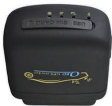

<details>
<summary>text_image</summary>

USB CARD
USB 100000000
USB 125/84/99
72
</details>

(b)

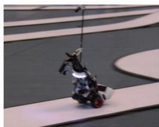

<details>
<summary>natural_image</summary>

Robot on a curved platform with a hanging pole, no visible text or symbols
</details>

(c)

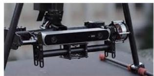

<details>
<summary>natural_image</summary>

Close-up of a black drone with attached mechanical components and control knobs (no visible text or symbols)
</details>

(f)  
图 2-2 一些传感器的图片。(a) 利用二维码进行定位的增强现实软件；(b) GPS 定位装置；(c) 铺设导轨的小车；(d) 激光雷达；(e) IMU 单元；(f) 双目相机。

一类传感器是携带于机器人本体上的，例如机器人的轮式编码器、相机、激光等等。另一类是安装于环境中的，例如前面讲的导轨、二维码标志等等。安装于环境中的传感设备，通常能够直接测量到机器人的位置信息，简单有效地解决定位问题。然而，由于它们必须在环境中设置，在一定程度上限制了机器人的使用范围。比方说，有些地方没有 GPS 信号，有些地方无法铺设导轨，这时怎么做定位呢？

我们看到，这类传感器约束了外部环境。只有在这些约束满足时，基于它们的定位方案才能工作。反之，当约束无法满足时，我们就没法进行定位了。所以说，虽然这类传感器简单可靠，但它们无法提供一个普遍的，通用的解决方案。相对的，那些携带于机器人本体上的传感器，比如激光传感器、相机、轮式编码器、惯性测量单元（Inertial Measurement

Unit, IMU）等等，它们测到的通常都是一些间接的物理量而不是直接的位置数据。例如，轮式编码器会测到轮子转动的角度、IMU 测量运动的角速度和加速度，相机和激光则读取外部环境的某种观测数据。我们只能通过一些间接的手段，从这些数据推算自己的位置。虽然这听上去是一种迂回战术，但更明显的好处是，它没有对环境提出任何要求，使得这种定位方案可适用于未知环境。

回忆前面讨论过的 SLAM 定义，我们在 SLAM 中，非常强调未知环境。在理论上，我们没法限制小萝卜的使用环境①，这意味着我们没法假设像 GPS 这些外部传感器都能顺利工作。因此，使用携带式的传感器来完成 SLAM 是我们重点关心的问题。特别地，当谈论视觉 SLAM 时，我的意思主要是指如何用相机解决定位和建图问题。

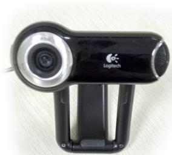

<details>
<summary>natural_image</summary>

Black Logitech camera with silver lens and metallic head (no visible text or symbols)
</details>

啓㩧

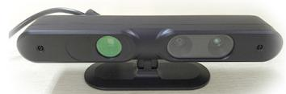

<details>
<summary>natural_image</summary>

Black handheld device with green and blue lenses mounted on a stand (no visible text or symbols)
</details>

Ꙟ㩧  


<details>
<summary>natural_image</summary>

Exterior view of a modern ZEO brand electronic device with adjustable legs (no visible text or symbols)
</details>

챓㩧  
图 2-3 形形色色的相机：单目，双目和深度相机。

视觉 SLAM 是本书的主题，所以我们尤其关心小萝卜的眼睛能够做些什么事。SLAM中使用的相机与我们平时见到的单反摄像头并不是同一个东西。它往往更加简单，不携带昂贵的镜头，以一定速率拍摄周围的环境，形成一个连续的视频流。普通的摄像头能以每秒钟 30 张图片的速度采集图像，高速相机则更快一些。按照相机的工作方式，我们把相机分为单目（Monocular）、双目（Stereo）和深度相机（RGB-D）三个大类，如图 2-3 所示。直观看来，单目相机只有一个摄像头，双目有两个，而 RGB-D 原理较复杂，除了能够采集到彩色图片之外，还能读出每个像素离相机的距离。它通常携带多个摄像头，工作原理和普通相机不尽相同，我们会在第五讲详细介绍它们的工作原理，此处读者只需有一个直观概念即可。此外，SLAM 中还有全景相机 [7]、Event 相机 [8] 等特殊或新兴的种类。虽然偶尔能看到它们在 SLAM 中的应用，不过到目前为止还没有成为主流。从样子上看，小萝卜似乎是使用双目的②。

我们分别来看一看各种相机用来做 SLAM 时会有什么特点。

单目相机 只使用一个摄像头进行 SLAM 的做法称为单目 SLAM（Monocular SLAM）。这种传感器结构特别的简单、成本特别的低，所以单目 SLAM 非常受研究者关注。你肯定见过单目相机的数据：照片。是的，作为一张照片，它有什么特点呢？

照片，本质上是拍照时的场景（Scene），在相机的成像平面上留下的一个投影。它以二维的形式反映了三维的世界。显然，这个过程丢掉了场景的一个维度：也就是所谓的深度（或距离）。在单目相机中，我们无法通过单个图片来计算场景中物体离我们的距离（远近）——之后我们会看到，这个距离将是 SLAM 中非常关键的信息。由于我们人类见过大量的图像，养成了一种天生的直觉，对大部分场景都有一个直观的距离感（空间感），它帮助我们判断图像中物体的远近关系。比如说，我们能够辨认出图像中的物体，并且知道它们大致的大小；比如近处的物体会挡住远处的物体，而太阳、月亮等天体一般在很远的地方；再如物体受光照后会留下影子等等。这些信息可以都帮助我们判断物体的远近，但也存在一些情况，这个距离感会失效，这时我们无法判断物体的远近以及它们的真实大小了。图 2-4 就是这样一个例子。在这张图像中，我们无法仅通过它来判断后面那些小人是真实的人，还是小型模型——除非我们转动视角，观察场景的三维结构。换言之，在单张图像里，你无法确定一个物体的真实大小。它可能是一个很大但很远的物体，也可能是一个很近但很小的物体。由于近大远小的原因，它们可能在图像中变成同样大小的样子。

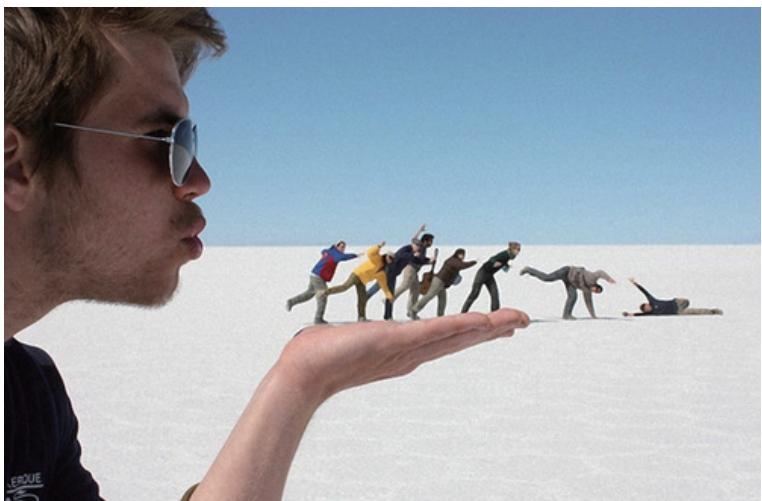

<details>
<summary>natural_image</summary>

Man pointing at a group of people on a snowy landscape under a clear blue sky (no text or symbols visible)
</details>

图 2-4 单目视觉中的尴尬：不知道深度时，手掌上的人是真人还是模型？

由于单目相机只是三维空间的二维投影，所以，如果我们真想恢复三维结构，必须移动相机的视角。在单目 SLAM 中也是同样的原理。我们必须移动相机之后，才能估计它的运动（Motion），同时估计场景中物体的远近和大小，不妨称之为结构（Structure）。那么，怎么估计这些运动和结构呢？从生活经验中我们知道，如果相机往右移动，那么图像里的东西就会往左边移动——这就给我们推测运动带来了信息。另一方面，我们还知道近处的物体移动快，远处的物体则运动缓慢。于是，当相机移动时，这些物体在图像上的运动，形成了视差。通过视差，我们就能定量地判断哪些物体离得远，哪些物体离的近。

然而，即使我们知道了物体远近，它们仍然只是一个相对的值。想象我们在看电影时候，虽然能够知道电影场景中哪些物体比另一些大，但我们无法确定电影里那些物体的“真实尺度”：那些大楼是真实的高楼大厦，还是放在桌上的模型？而摧毁大厦的是真实怪兽，还是穿着特摄服装的演员？直观地说，如果把相机的运动和场景大小同时放大两倍，单目所看到的像是一样的。同样的，把这个大小乘以任意倍数，我们都将看到一样的景象。这说明了单目 SLAM 估计的轨迹和地图，将与真实的轨迹、地图，相差一个因子，也就是所谓的尺度（Scale）①。由于单目 SLAM 无法仅凭图像确定这个真实尺度，所以又称为尺度不确定性。

平移之后才能计算深度，以及无法确定真实尺度，这两件事情给单目 SLAM 的应用造成了很大的麻烦。它们的本质原因是通过单张图像无法确定深度。所以，为了得到这个深度，人们又开始使用双目和深度相机。

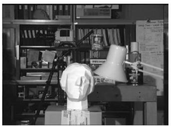

<details>
<summary>natural_image</summary>

Black-and-white photo of a cluttered office workspace with mannequins and bookshelves (no visible text or symbols)
</details>

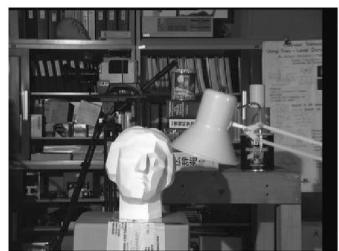

<details>
<summary>natural_image</summary>

Black-and-white photo of a cluttered office workspace with bookshelves, a white sculpture, and shelves (no visible text or symbols)
</details>

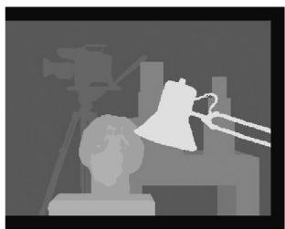

<details>
<summary>natural_image</summary>

Silhouette illustration of a person with a lamp and camera, set against a blurred industrial background (no text or symbols)
</details>

图 2-5 双目相机的数据：左眼图像，右眼图像。通过左右眼的差异，能够判断场景中物体离相机距离。

双目相机 (Stereo) 和深度相机 双目相机和深度相机的目的，在于通过某种手段测量物体离我们的距离，克服单目无法知道距离的缺点。如果知道了距离，场景的三维结构就可以通过单个图像恢复出来，也就消除了尺度不确定性。尽管都是为测量距离，但双目相机与深度相机测量深度的原理是不一样的。双目相机由两个单目相机组成，但这两个相机之间的距离（称为基线（Baseline））是已知的。我们通过这个基线来估计每个像素的空间位置——这和人眼非常相似。我们人类可以通过左右眼图像的差异，判断物体的远近，在计算机上也是同样的道理。如果对双目相机进行拓展，也可以搭建多目相机，不过本质上并没有什么不同。

计算机上的双目相机需要大量的计算才能（不太可靠地）估计每一个像素点的深度，相比于人类真是非常的笨拙。双目相机测量到的深度范围与基线相关。基线距离越大，能够测量到的就越远，所以无人车上搭载的双目通常会是个很大的家伙。双目相机的距离估计是比较左右眼的图像获得的，并不依赖其他传感设备，所以它既可以应用在室内，亦可应用于室外。双目或多目相机的缺点是配置与标定均较为复杂，其深度量程和精度受双目的基线与分辨率限制，而且视差的计算非常消耗计算资源，需要使用 GPU 和 FPGA 设备加速后，才能实时输出整张图像的距离信息。因此在现有的条件下，计算量是双目的主要问题之一。

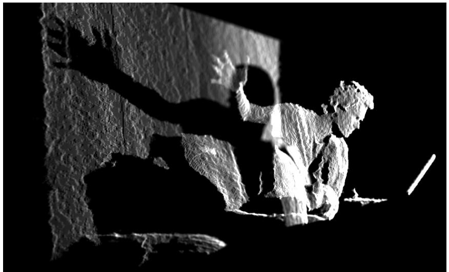

<details>
<summary>natural_image</summary>

Black-and-white photo of a person climbing a rocky cliff with visible cracks and debris (no text or symbols)
</details>

图 2-6 RGB-D 数据：深度相机可以直接测量物体的图像和距离，从而恢复三维结构。

深度相机（又称 RGB-D 相机，在本书中主要使用 RGB-D 这个名称）是 2010 年左右开始兴起的一种相机，它最大的特点是可以通过红外结构光或 Time-of-Flight（ToF）原理，像激光传感器那样，通过主动向物体发射光并接收返回的光，测出物体离相机的距离。这部分并不像双目那样通过软件计算来解决，而是通过物理的测量手段，所以相比于双目可节省大量的计算量。目前常用的 RGB-D 相机包括 Kinect/Kinect V2、Xtion live pro、Realsense 等。不过，现在多数 RGB-D 相机还存在测量范围窄、噪声大、视野小、易受日光干扰、无法测量透射材质等诸多问题，在 SLAM 方面，主要用于室内 SLAM，室外则较难应用。

我们讨论了几种常见的相机，相信通过以上的说明，你应该对它们有了直观的理解。现在，想象相机在场景中运动的过程，我们将得到一系列连续变化图像①。视觉 SLAM 的目标，是通过这样的一些图像，进行定位和地图构建。这件事情并没有我们想象的那么简单。它不是某种算法，只要我们输入数据，就可以往外不断地输出定位和地图信息了。SLAM需要一个完善的算法框架，而经过研究者们长期的研究工作，现有这个框架已经定型了。

## 2.2 经典视觉 SLAM 框架

下面我们来看经典的视觉 SLAM 框架，了解一下视觉 SLAM 究竟有哪几个模块组成，如图 2-7 所示。

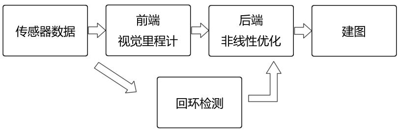

<details>
<summary>flowchart</summary>

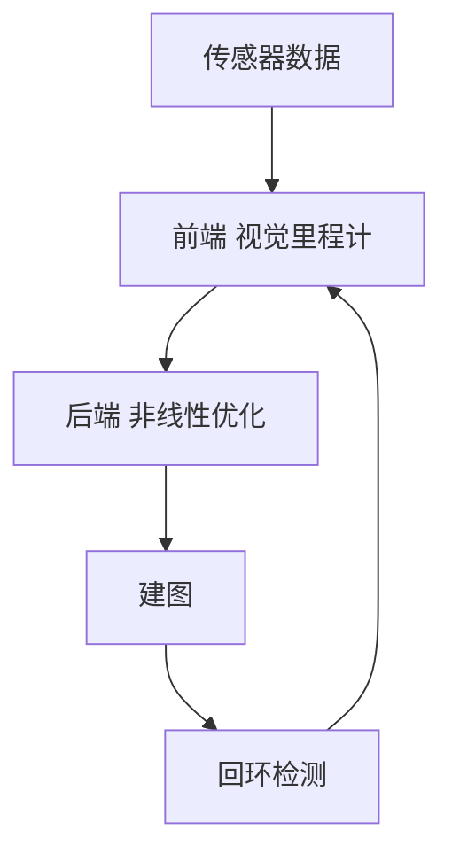
```mermaid
graph TD
  A["传感器数据"] --> B["前端 视觉里程计"]
  B --> C["后端 非线性优化"]
  C --> D["建图"]
  D --> E["回环检测"]
  E --> B
```
</details>

图 2-7 整体视觉 SLAM 流程图。

我们把整个视觉 SLAM 流程分为以下几步：

1. 传感器信息读取。在视觉 SLAM 中主要为相机图像信息的读取和预处理。如果在机器人中，还可能有码盘、惯性传感器等信息的读取和同步。  
2. 视觉里程计 (Visual Odometry, VO)。视觉里程计任务是估算相邻图像间相机的运动，以及局部地图的样子。VO 又称为前端（Front End）。  
3. 后端优化（Optimization）。后端接受不同时刻视觉里程计测量的相机位姿，以及回环检测的信息，对它们进行优化，得到全局一致的轨迹和地图。由于接在 VO 之后，又称为后端（Back End）。  
4. 回环检测（Loop Closing）。回环检测判断机器人是否曾经到达过先前的位置。如果检测到回环，它会把信息提供给后端进行处理。  
5. 建图（Mapping）。它根据估计的轨迹，建立与任务要求对应的地图。

经典的视觉 SLAM 框架是过去十几年内，研究者们总结的成果。这个框架本身，以及它所包含的算法已经基本定型，并且在许多视觉程序库和机器人程序库中已经提供。依靠这些算法，我们能够构建一个视觉 SLAM 系统，使之在正常的工作环境里实时进行定位与建图。因此，我们说，如果把工作环境限定在静态、刚体，光照变化不明显、没有人为干扰的场景，那么，这个 SLAM 系统是相当成熟的了 [9]。

读者可能还没有理解上面几个模块的概念，我们就来详细讲一讲各个模块具体的任务。但是，理性地理解它们的工作原理需要一些数学知识，我们放到本书的第二部分再进行。这里我们希望读者对各模块有一个直观的、定性的理解即可。

## 2.2.1 视觉里程计

视觉里程计关心相邻图像之间的相机运动，最简单的情况当然是两张图像之间的运动关系。例如，当我们看到图 2-8 时，会自然地反应出右图应该是左图向左旋转一定角度的结果（在视频情况下感觉会更加自然）。我们不妨思考一下：我自己是怎么知道“向左旋转”这件事情的呢？人类早已习惯于用眼睛探索世界，估计自己的位置，但又往往难以用理性的语言描述我们的直觉。看到图 2-8 时，我们会自然地看到，这个场景中离我们近的是吧台，远处是墙壁和黑板。当相机往左转动时，吧台离我们近的部分出现在视野中，而右侧远处的柜子则移出了视野。通过这些信息，我们判断相机应该是往左旋转了。

但是，如果我进一步问：能否确定旋转了多少度，平移了多少厘米？我们就很难给出一个确切的答案了。因为我们的直觉对这些具体的数字并不敏感。但是，在计算机中，又必须精确地测量这段运动信息。所以我们要问：计算机是如何通过图像确定相机的运动呢？

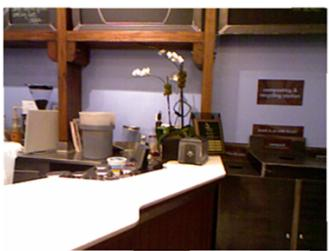

<details>
<summary>natural_image</summary>

Interior view of a minimalist office or study room with wooden furniture, a white counter, and decorative items (no visible text or symbols)
</details>

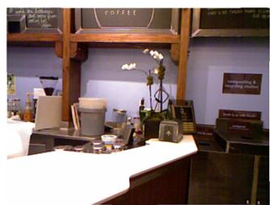

<details>
<summary>natural_image</summary>

Interior view of a coffee shop with wooden shelves, coffee table, and decorative items (no visible text or symbols)
</details>

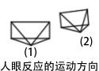  
图 2-8 相机拍摄到的图片与人眼反应的运动方向。

前面也提过，在计算机视觉领域，人类在直觉上看来十分自然的事情，在计算机视觉中却非常的困难。图像在计算机里只是一个数值矩阵。这个矩阵里表达着什么东西，计算机毫无概念（这也正是现在机器学习要解决的问题）。而视觉 SLAM 中，我们只能看到一个个像素，知道它们是某些空间点在相机的成像平面上投影的结果。所以，为了定量地估计相机运动，必须在了解相机与空间点的几何关系之后进行。

要讲清这个几何关系以及 VO 的实现方法，需要铺垫一些背景知识。我们在这里先让读者对 VO 有直观的概念，理性的理解需要在背景知识铺垫完成之后才能深入讨论。所以，现在我们只需知道，VO 能够通过相邻帧间的图像估计相机运动，并恢复场景的空间结构。

叫它为“里程计”是因为它和实际的里程计一样，只计算相邻时刻的运动，而和再往前的过去的信息没有关联。在这一点上，VO 就像一种只有很短时间记忆的物种一样。

现在，假定我们已有了一个视觉里程计，估计了两张图像间的相机运动。那么，只要把相邻时刻的运动“串”起来，就构成了机器人的运动轨迹，从而解决了定位问题。另一方面，我们根据每个时刻的相机位置，计算出各像素对应的空间点的位置，就得到了地图。这么说来，有了 VO，是不是就解决了 SLAM 问题呢？

我们说，视觉里程计确实是 SLAM 的关键问题，我们也会花大量的篇幅来介绍它。然而，仅通过视觉里程计来估计轨迹，将不可避免地出现累计漂移（Accumulating Drift）。这是由于视觉里程计（在最简单的情况下）只估计两个图像间运动造成的。我们知道，每次估计都带有一定的误差，而由于里程计的工作方式，先前时刻的误差将会传递到下一时刻，导致经过一段时间之后，估计的轨迹将不再准确。比方说，机器人先向左转 90 度，再向右转了 90 度。由于误差，我们把第一个 90 度估计成了 89 度。那我们就会尴尬地发现，向右转之后机器人的估计位置并没有回到原点。更糟糕的是，即使之后的估计再准确，与真实值相比，都会带上这-1 度的误差。

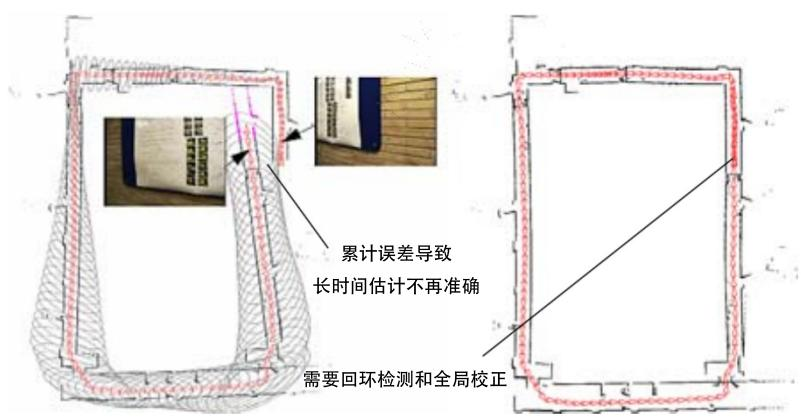

<details>
<summary>text_image</summary>

累计误差导致
长时间估计不再准确
需要回环检测和全局校正
</details>

图 2-9 累计误差与回环检测的校正结果 [10]。

这也就是所谓的漂移（Drift）。它将导致我们无法建立一致的地图。你会发现原本直的走廊变成了斜的，而原本 90 度的直角变成了歪的——这实在是一件很难令人忍受的事情！为了解决漂移问题，我们还需要两种技术：后端优化①和回环检测。回环检测负责把“机器人回到原始位置”的事情检测出来，而后端优化则根据该信息，校正整个轨迹的形状。

## 2.2.2 后端优化

笼统地说，后端优化主要指处理 SLAM 过程中噪声的问题。虽然我们很希望所有的数据都是准确的，然而现实中，再精确的传感器也带有一定的噪声。便宜的传感器测量误差较大，昂贵的则较小，有的传感器还会受磁场、温度的影响。所以，除了解决“如何从图像估计出相机运动”之外，我们还要关心这个估计带有多大的噪声，这些噪声是如何从上一时刻传递到下一时刻的、而我们又对当前的估计有多大的自信。后端优化要考虑的问题，就是如何从这些带有噪声的数据中，估计整个系统的状态，以及这个状态估计的不确定性有多大——这称为最大后验概率估计（Maximum-a-Posteriori，MAP）。这里的状态既包括机器人自身的轨迹，也包含地图。

相对的，视觉里程计部分，有时被称为“前端”。在 SLAM 框架中，前端给后端提供待优化的数据，以及这些数据的初始值。而后端负责整体的优化过程，它往往面对的只有数据，不必关心这些数据到底来自什么传感器。在视觉 SLAM 中，前端和计算机视觉研究领域更为相关，比如图像的特征提取与匹配等，后端则主要是滤波与非线性优化算法。

从历史意义上来说，现在我们称之为后端优化的部分，很长一段时间直接被称为“SLAM 研究”。早期的 SLAM 问题是一个状态估计问题——正是后端优化要解决的东西。在最早提出 SLAM 的一系列论文中，当时的人们称它为“空间状态不确定性的估计”（Spa-tial Uncertainty）[4, 11]。虽然有一些晦涩，但也确实反映出了 SLAM 问题的本质：对运动主体自身和周围环境空间不确定性的估计。为了解决 SLAM，我们需要状态估计理论，把定位和建图的不确定性表达出来，然后采用滤波器或非线性优化，去估计状态的均值和不确定性（方差）。状态估计与非线性优化的具体内容将在第六章和十、十一两章介绍。让我们暂时跳过它的原理，继续往下说明。

## 2.2.3 回环检测

回环检测，又称闭环检测（Loop Closure Detection），主要解决位置估计随时间漂移的问题。怎么解决呢？假设实际情况下，机器人经过一段时间运动后回到了原点，但是由于漂移，它的位置估计值却没有回到原点。怎么办呢？我们想，如果有某种手段，让机器人知道“回到了原点”这件事，或者把“原点”识别出来，我们再把位置估计值“拉”过去，就可以消除漂移了。这就是所谓的回环检测。

回环检测与“定位”和“建图”二者都有密切的关系。事实上，我们认为，地图存在的主要意义，是为了让机器人知晓自己到达过的地方。为了实现回环检测，我们需要让机器人具有识别曾到达过的场景的能力。它的实现手段有很多。例如像前面说的那样，我们可以在机器人下方设置一个标志物（如一张二维码图片）。只要它看到了这个标志，就知道自己回到了原点。但是，该标志物实质上是一种环境中的传感器，对应用环境提出了限制（万一不能贴二维码怎么办呢？）。我们更希望机器人能使用携带的传感器——也就是图像本身，来完成这一任务。例如，我们可以判断图像间的相似性，来完成回环检测。这一点和人是相似的。当我们看到两张相似图片时，容易辨认它们来自同一个地方。如果回环检测成功，可以显著地减小累积误差。所以视觉回环检测，实质上是一种计算图像数据相似性的算法。由于图像的信息非常丰富，使得正确检测回环的难度也降低了不少。

在检测到回环之后，我们会把“A 与 B 是同一个点”这样的信息告诉后端优化算法。然后，后端根据这些新的信息，把轨迹和地图调整到符合回环检测结果的样子。这样，如果我们有充分而且正确的回环检测，就可以消除累积误差，得到全局一致的轨迹和地图。

## 2.2.4 建图

建图（Mapping）是指构建地图的过程。地图是对环境的描述，但这个描述并不是固定的，需要视 SLAM 的应用而定。

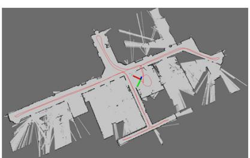

<details>
<summary>natural_image</summary>

Architectural site plan with roads, buildings, and a highlighted route (no text or labels)
</details>

㈀䐀ը㱨し﹖

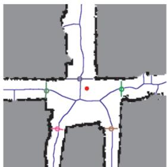

<details>
<summary>natural_image</summary>

Pure electrical circuit lines without any symbols
</details>

㈀䐀퍢兢し﹖

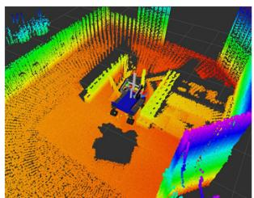

<details>
<summary>natural_image</summary>

3D thermal or simulation visualization of a mechanical or industrial component with color-coded intensity gradients (no text or symbols)
</details>

㌀䐀륰酎し﹖

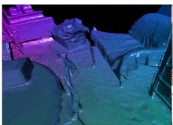

<details>
<summary>natural_image</summary>

Nighttime photo of a damaged vehicle with visible structural damage and debris (no text or symbols)
</details>

3D网格地图  
图 2-10 形形色色的地图：2D 栅格地图、拓扑地图以及 3D 点云地图和网格地图 [12]。

对于家用扫地机器人来说，这种主要在低矮平面里运动的机器人，只需要一个二维的地图，标记哪里可以通过，哪里存在障碍物，就够它在一定范围内导航了。而对于一个相机，它有六自由度的运动，我们至少需要一个三维的地图。有些时候，我们想要一个漂亮的重建结果，不仅是一组空间点，还需要带纹理的三角面片。另一些时候，我们又不关心地图的样子，只需要知道“A 点到 B 点可通过，而 B 到 C 不行”这样的事情。甚至，有时我们不需要地图，或者地图可以由其他人提供，例如行驶的车辆往往可以得到已经绘制好的当地地图。

对于地图，我们有太多的想法和需求。因此，相比于前面提到的视觉里程计、回环检测和后端优化，建图并没有一个固定的形式和算法。一组空间点的集合也可以称为地图，一个漂亮的 3D 模型亦是地图，一个标记着城市、村庄、铁路、河道的图片亦是地图。地图的形式随 SLAM 的应用场合而定。大体上讲，它们可以分为度量地图与拓扑地图两种。

## 度量地图（Metric Map）

度量地图强调精确地表示地图中物体的位置关系，通常我们用稀疏（Sparse）与稠密（Dense）对它们进行分类。稀疏地图进行了一定程度的抽象，并不需要表达所有的物体。例如，我们选择一部分具有代表意义的东西，称之为路标（Landmark），那么一张稀疏地图就是由路标组成的地图，而不是路标的部分就可以忽略掉。相对的，稠密地图着重于建模所有看到的东西。对于定位来说，稀疏路标地图就足够了。而用于导航时，我们往往需要稠密的地图（否则撞上两个路标之间的墙怎么办？）。稠密地图通常按照某种分辨率，由许多个小块组成。二维度量地图是许多个小格子（Grid），三维则是许多小方块（Voxel）。一般地，一个小块含有占据、空闲、未知三种状态，以表达该格内是否有物体。当我们查询某个空间位置时，地图能够给出该位置是否可以通过的信息。这样的地图可以用于各种导航算法，如 A\*,D\*①等等，为机器人研究者们所重视。但是我们也看到，这种地图需要存储每一个格点的状态，耗费大量的存储空间，而且多数情况下地图的许多细节部分是无用的。另一方面，大规模度量地图有时会出现一致性问题。很小的一点转向误差，可能会导致两间屋子的墙出现重叠，使得地图失效。

## 拓扑地图（Topological Map）

相比于度量地图的精确性，拓扑地图则更强调地图元素之间的关系。拓扑地图是一个图（Graph），由节点和边组成，只考虑节点间的连通性，例如 A，B 点是连通的，而不考虑如何从 A 点到达 B 点的过程。它放松了地图对精确位置的需要，去掉地图的细节问题，是一种更为紧凑的表达方式。然而，拓扑地图不擅长表达具有复杂结构的地图。如何对地图进行分割形成结点与边，又如何使用拓扑地图进行导航与路径规划，仍是有待研究的问题。

## 2.3 SLAM 问题的数学表述

通过前面部分的介绍，读者应该对 SLAM 中各个模块的组成和主要功能有了直观上的理解。但仅仅靠直观印象并不能帮助我们写出可以运行的程序。我们要把它上升到理性层次——也就是用数学语言来描述 SLAM 过程。我们会用到一些变量和公式，但请读者放心，我会尽量让它保持足够的清楚。

假设小萝卜正携带着某种传感器在未知环境里运动，怎么用数学语言描述这件事呢？首先，由于相机通常是在某些时刻采集数据的，所以我们也只关心这些时刻的位置和地图。这就把一段连续时间的运动变成了离散时刻 $t = 1 , \ldots , K$ 当中发生的事情。在这些时刻，用 x 表示小萝卜自身的位置。于是各时刻的位置就记为 $\pmb { x } _ { 1 } , \ldots , \pmb { x } _ { K }$ ，它们构成了小萝卜的轨迹。地图方面，我们设地图是由许多个路标（Landmark）组成的，而每个时刻，传感器会测量到一部分路标点，得到它们的观测数据。不妨设路标点一共有 N 个，用 $y _ { 1 } , \ldots , y _ { N }$ 表示它们。

在这样设定中，“小萝卜携带着传感器在环境中运动”，由如下两件事情描述：

1. 什么是运动？我们要考虑从 k −1 时刻到 k 时刻，小萝卜的位置 x 是如何变化的。  
2. 什么是观测？假设小萝卜在 k 时刻，于 $\scriptstyle { \mathbf { { \mathit { x } } } } _ { k }$ 处探测到了某一个路标 ${ \pmb y } _ { j }$ ，我们要考虑这件事情是如何用数学语言来描述的。

先来看运动。通常，机器人会携带一个测量自身运动的传感器，比如说码盘或惯性传感器。这个传感器可以测量有关运动的读数，但不一定直接是位置之差，还可能是加速度、角速度等信息。然而，无论是什么传感器，我们都能使用一个通用的、抽象的数学模型：

$$
\boldsymbol {x} _ {k} = f \left(\boldsymbol {x} _ {k - 1}, \boldsymbol {u} _ {k}, \boldsymbol {w} _ {k}\right). \tag {2.1}
$$

这里 $\mathbf { \pmb { u } } _ { k }$ 是运动传感器的读数（有时也叫输入）， ${ \pmb w } _ { k }$ 为噪声。注意到，我们用一个一般函数 f 来描述这个过程，而不具体指明 f 的作用方式。这使得整个函数可以指代任意的运动传感器，成为一个通用的方程，而不必限定于某个特殊的传感器上。我们把它称为运动方程。

与运动方程相对应，还有一个观测方程。观测方程描述的是，当小萝卜在 $\scriptstyle { \mathbf { { \mathit { x } } } } _ { k }$ 位置上看到某个路标点 $\mathbf { \nabla } _ { \mathbf { \mathcal { Y } } _ { j } }$ ，产生了一个观测数据 $z _ { k , j }$ 。同样，我们用一个抽象的函数 h 来描述这个关系：

$$
\boldsymbol {z} _ {k, j} = h \left(\boldsymbol {y} _ {j}, \boldsymbol {x} _ {k}, \boldsymbol {v} _ {k, j}\right). \tag {2.2}
$$

这里 $_ { v _ { k , j } }$ 是这次观测里的噪声。由于观测所用的传感器形式更多，这里的观测数据 $_ { z }$ 以及观测方程 h 也许多不同的形式。

读者或许会说，我们用的函数 f, h，似乎并没有具体地说明运动和观测是怎么回事？同时，这里的 x,y,z 又是什么东西呢？事实上，根据小萝卜的真实运动和传感器的种类，存在着若干种参数化方式（Parameterization）。什么叫参数化呢？举例来说，假设小萝卜在平面中运动，那么，它的位姿①由两个位置和一个转角来描述，即 $\pmb { x } _ { k } = [ x , y , \theta ] _ { k } ^ { T }$ 。同时，运动传感器能够测量到小萝卜在每两个时间间隔位置和转角的变化量 $\pmb { u } _ { k } = [ \Delta x , \Delta y , \Delta \theta ] _ { k } ^ { T }$ ，那么，此时运动方程就可以具体化为：

$$
\left[ \begin{array}{l} x \\ y \\ \theta \end{array} \right] _ {k} = \left[ \begin{array}{l} x \\ y \\ \theta \end{array} \right] _ {k - 1} + \left[ \begin{array}{l} \Delta x \\ \Delta y \\ \Delta \theta \end{array} \right] _ {k} + \boldsymbol {w} _ {k}. \tag {2.3}
$$

这是简单的线性关系。不过，并不是所有的传感器都直接能测量出位移和角度变化，所以也存在着其他形式更加复杂的运动方程，那时我们可能需要进行动力学分析。关于观测方程，比方说小萝卜携带着一个二维激光传感器。我们知道激光传感器观测一个 2D 路标点时，能够测到两个量：路标点与小萝卜本体之间的距离 r 和夹角 $\phi _ { \sf { c } }$ 。我们记路标点为 $\pmb { y } = [ p _ { x } , p _ { y } ] ^ { T }$ （为保持简洁，省略了下标），观测数据为 $z = [ r , \phi ] ^ { T }$ ，那么观测方程就具体化为：

$$
\left[ \begin{array}{l} r \\ \phi \end{array} \right] = \left[ \begin{array}{l} \sqrt {(p _ {x} - x) ^ {2} + (p _ {y} - y) ^ {2}} \\ \arctan \left(\frac {p _ {y} - y}{p _ {x} - x}\right) \end{array} \right] + \boldsymbol {v}. \tag {2.4}
$$

考虑视觉 SLAM 时，传感器是相机，那么观测方程就是“对路标点拍摄后，得到了图像中的像素”的过程。这个过程牵涉到相机模型的描述，将在第五讲中详细介绍，这里暂时不细谈。

可见，针对不同的传感器，这两个方程有不同的参数化形式。如果我们保持通用性，把它们取成通用的抽象形式，那么 SLAM 过程可总结为两个基本方程：

$$
\left\{ \begin{array}{l} \boldsymbol {x} _ {k} = f \left(\boldsymbol {x} _ {k - 1}, \boldsymbol {u} _ {k}, \boldsymbol {w} _ {k}\right) \\ \boldsymbol {z} _ {k, j} = h \left(\boldsymbol {y} _ {j}, \boldsymbol {x} _ {k}, \boldsymbol {v} _ {k, j}\right) \end{array} . \right. \tag {2.5}
$$

这两个方程描述了最基本的 SLAM 问题：当我们知道运动测量的读数 u，以及传感器的读数 z 时，如何求解定位问题（估计 x）和建图问题（估计 y）？这时，我们把 SLAM问题建模成了一个状态估计问题：如何通过带有噪声的测量数据，估计内部的、隐藏着的状态变量？

状态估计问题的求解，与两个方程的具体形式，以及噪声服从哪种分布有关。我们按照运动和观测方程是否为线性，噪声是否服从高斯分布进行分类，分为线性/非线性和高斯/非高斯系统。其中线性高斯系统（Linear Gaussian, LG 系统）是最简单的，它的无偏的最优估计可以由卡尔曼滤波器（Kalman Filter, KF）给出。而在复杂的非线性非高斯系统（Non-Linear Non-Gaussian，NLNG 系统）中，我们会使用以扩展卡尔曼滤波器（ExtendedKalman Filter, EKF）和非线性优化两大类方法去求解它。直至 21 世纪早期，以 EKF 为主的滤波器方法占据了 SLAM 中的主导地位。我们会在工作点处把系统线性化，并以预测更新两大步骤进行求解（见第九讲）。最早的实时视觉 SLAM 系统即是基于 EKF[2]开发的。随后，为了克服 EKF 的缺点（例如线性化误差和噪声高斯分布假设），人们开始使用粒子滤波器（Particle Filter）等其他滤波器，乃至使用非线性优化的方法。时至今日，主流视觉 SLAM 使用以图优化（Graph Optimization）为代表的优化技术进行状态估计 [13]。我们认为优化技术已经明显优于滤波器技术，只要计算资源允许，我们通常都偏向于使用优化方法（见第十、十一讲）。

相信读者应该对 SLAM 的数学模型有了大致的理解，然而我们仍需澄清一些问题。首先，我们要说明机器人位置 x 是什么。我们方才说位置是有些模糊的。也许读者能够理解在平面中运动的小萝卜，可以用两个坐标加一个转角的形式将位置参数化。然而，虽然我的漫画风格有些二次元，小萝卜更多时候是一个三维空间里的机器人。我们知道三维空间的运动由三个轴构成，所以小萝卜的运动要由三个轴上的平移，以及绕着三个轴的旋转来描述，这一共有六个自由度。那是否意味着我随便用一个 R6 中的向量就能描述它了呢？我们将发现事情并没有那么简单。对六自由度的位姿①，如何表达它，如何优化它，都需要一定篇幅来介绍，这将是第三讲和第四讲的主要内容。随后，我们要说明在视觉 SLAM 中，观测方程如何参数化。换句话说，空间中的路标点是如何投影到一张照片上的。这需要解释相机的成像模型，我们将在第五章介绍。最后，当我们知道了这些信息，怎么求解上述方程？这需要非线性优化的知识，则是第六讲的内容。

这些内容组成了本书数学知识的部分。在对它们进行铺垫之后，我们就能仔细讨论视觉里程计、后端优化等更详细的知识了。可以看到，本讲介绍的内容构成了本书的一个提要。如果读者还没有很好地理解上面的概念，不妨回过头再阅读一遍。下面我们就要开始讲程序啦！

## 2.4 实践：编程基础

## 2.4.1 安装 Linux 操作系统

终于开始令人兴奋的实践环节啦！读者们是否准备好了呢？为了完成本书的实践环节，我们需要准备一台电脑。你可以使用笔记本或台式机，当然最好是你个人的电脑，因为我们需要在上面安装操作系统并进行实验。

我们程序将主要以 Linux 上的 C++ 程序为主。在实验过程中，我们会使用大量程序库。大部分程序库只对 Linux 提供较好的支持，而 Windows 上配置则相对（相当）麻烦。因此我们不得不假定你已经具有 Linux 的基本知识了（请参见上一讲的练习题），包括使用基本的命令，了解软件如何安装。这样我们可以省去讲这些内容的时间。当然，你可以不懂如何在 Linux 下开发 C++ 程序，这正是我们会详细讲解的。

我们先来搭建本书所需的实验环境。作为一本面向初学者的书，我们使用 Ubuntu 作为开发环境。在 Linux 各大发行版中，Ubuntu 及其衍生版本，向来具有对用户友好的美誉。Ubuntu 是一个开源操作系统，它的系统和软件在官方网站（http://cn.ubuntu.com）免费下载，并且提供了详细的安装方式说明。同时，清华、中科大等国内各大高校也提供了Ubuntu 软件源，使我们安装软件十分的快捷。对于初学者，我建议你使用和我一样的环境：Ubuntu 14.04。如果你想试试其他口味，那么 Ubuntu 16.04、Ubuntu Kylin，Debian 7/8和 Linux Mint 17/18 也是不错的选择。我保证所有代码在 Ubuntu 14.04 下经过了良好的测试，但如果你选择其他发行版，我不太确定你是否会遇到问题。你可能需要花费一些解决问题的时间（不过你也可以把它们当作锻炼自己的机会）。大体来说，Ubuntu 对各种库的支持均较为完善，软件也非常丰富。尽管我们不限制你具体使用哪种 Linux 发行版，不过在讲解中，我会以 Ubuntu 14.04 为例，且主要使用 Ubuntu 下的命令（例如 apt-get），就不谈在其他 Linux 下怎么操作了——我总不能把每个发行版的命令都列一遍吧。我相信程序在 Linux 间移植不会非常繁琐。但如果你想在 Windows 或 OSX 下使用本书的程序，需要有一定的移植经验。我个人觉得移植应该会成功，不过也会有一些小事情要解决。

现在，请各位小伙伴在自己的 PC 上安装好 Ubuntu 14.04。Ubuntu 的安装可以在网上搜到大量教程，你只要照着做即可。最简单的方式是使用虚拟机，但它需要大量内存（我的经验是 4G 以上）和 CPU 占用才能保持流畅；你也可以安装双系统，它会快一些，但你需要一个空白的 U 盘来作为启动盘。另外，虚拟机软件对外部硬件支持往往不够好，如果希望使用实际的传感器（双目、Kinect 等），我建议你使用双系统来安装 Linux。由于网络上资料非常丰富，我们这里就略去 Ubuntu 的安装过程。

安装的小提示：

• 安装操作系统时请不要选择“安装中下载更新”，并且断开网络连接，这可以提高安装速度。而更新可以在系统安装完毕后再装。如果你有 SSD 硬盘，这个过程大概用时十五分钟。

• 安装完成后，请务必把软件源设置到离你较近的服务器上，获得更快的下载速度。例如我使用清华的软件源通常能以 10M/s 的速度安装软件①。

现在，假设读者已经成功安装了 Ubuntu，无论是使用虚拟机还是双系统的方式。如果你还不熟悉 Ubuntu，可以试试它的各种软件，体验一下它的界面和交互方式②。不过我必须警告读者们，特别是新手朋友们：不要在 Ubuntu 的用户界面上花费太多时间！Linux有许多可能浪费时间的地方，你可能会找到某些小众的软件、可能会找到一些游戏、甚至会为找一张壁纸花费不少时间。但是，请记住你用 Linux 是用来工作的。特别是在本书内，你是用 Linux 来学习 SLAM 的，所以你要尽量把时间花在学习 SLAM 上。

好了，我们选择一个目录，放置本书 SLAM 程序的代码。例如，你可以将代码放到家目录（/home）的“slambook”下。以后我们把这个目录称为“代码根目录”。同时，你可以另外选择一个目录，把本书的 git 代码拷贝下来，方便你在做实验时随时对照。本书的代码是按章节划分的。比如，本讲的代码将在 slambook/ch2 下，下一讲则在 slambook/ch3下。所以，现在请读者进入 slambook/ch2 下（你应该会新建文件夹并且进入这个文件夹了吧）。

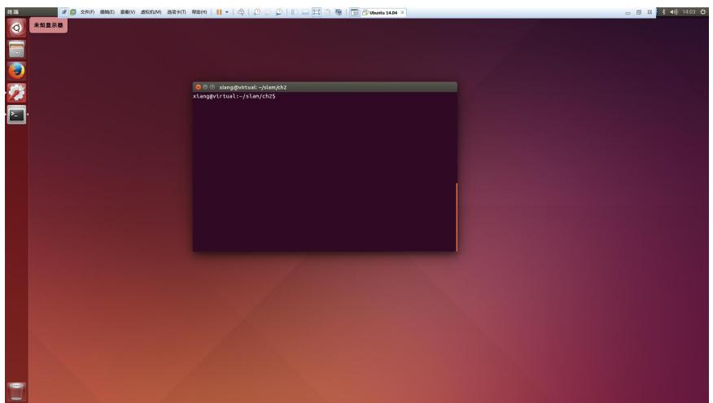

<details>
<summary>text_image</summary>

文件(F)  曲线(E)  影响(V)  虚拟(R)  选项卡(T)  帮助(H)
未知显示器
xiang@virtual: -\nam/ch2
xiang@virtual: -\stan/ch2$
</details>

图 2-11 一个运行在虚拟机中的 ubuntu 14.04。

## 2.4.2 Hello SLAM

我们从最基本的程序开始。与许多计算机类书一样，我们来书写一个 HelloSLAM 程序。不过在做这件事之前，先来聊聊程序是什么。

在 Linux 中，程序是一个具有执行权限的文件。它可以是一个脚本，也可以是一个二进制文件，不过我们不限定它的后缀名（不像 windows 那样需要指定成 exe 文件）。我们常用的 cd、ls 等命令，就是位于/bin 目录下的可执行文件。而对于其他地方的可执行程序，只要它有可执行权限，那么当我们在终端中输入程序名时，它就会运行。在 C++ 编程时，我们用编译器，把一个文本文件编译成可执行程序。例如像下面这样：

slambook/ch2/helloSLAM.cpp：  
```cpp
#include <iostream>
using namespace std;

int main(int argc, char** argv)
{
    cout<<"Hello SLAM!"<<endl;
    return 0;
}
```

这是一个非常简单的程序。你应该能毫不费力地看懂它，所以我不多加解释——如果实际情况不是这样，请你放下书先去补习一下 C++ 的基本知识，我会在这里等你。这个程序只是把一个字符串输出到屏幕上而已。你可以用文本编辑器 gedit（或 vim，如果你在上一节学习了 vim 的话）输入这些代码，并保存在上面列出的路径下。现在，我们用编译器 g++ （g++ 是一个 C++ 编译器）把它编译成一个可执行文件。输入：

```javascript
1 g++ helloSLAM.cpp
```

如果顺利的话，这条命令应该没有任何输出。如果机器上出现“command not found”的错误，说明你可能还没有安装 g++，请用：

```txt
1 sudo apt-get install g++
```

安装它。如果出现别的错误，请再检查一遍刚才的程序是否正确输入了。

刚才这条编译命令把 helloSLAM.cpp 这个文本文件编译成了一个可执行程序。我们检查当前目录，会发现多了一个 a.out 文件，而且它具有执行权限（终端里颜色不同）。我们输入./a.out 即可运行此程序：

```txt
1 % ./a.out
2 Hello SLAM!
```

如我们所想，这个程序输出“Hello SLAM！”，告诉我们它在正确运行。

请回顾一下我们之前做的事情。在这个例子中，我们用编辑器输入了 helloSLAM.cpp的源代码，然后调用 g++ 编译器对它进行编译，得到了可执行文件。g++ 默认把源文件编译成 a.out 这个名字的程序（虽然有些古怪但是可以接受的）。如果我们愿意，也可以指定这个输出的文件名（留作习题）。这是一个极其简单的例子，我们使用了大量的默认参数，几乎省略了所有中间步骤，为的是给读者一个简洁的印象（虽然你可能没体会到）。下面，我们要用 cmake 来编译这个程序。

## 2.4.3 使用 cmake

理论上说，任意一个 C++ 程序都可以用 g++ 来编译。但当程序规模越来越大时，一个工程可能有许多个文件夹和里边的源文件，这时输入的编译命令将越来越长。通常一个小型 c++ 项目含有十几个类，各类间还存在着复杂的依赖关系。其中一部分要编译成可执行文件，另一部分编译成库文件。如果仅靠 g++ 命令，我们需要输入大量的编译指令，整个编译过程会变得异常繁琐。因此，对于 C++ 项目，使用一些工程管理工具会更加高效。在历史上工程师们曾使用 makefile 进行自动编译，但下面要谈的 cmake 比它更加方便。并且，我们会看到后面提到的大多数库都使用 cmake 来管理源代码。

在一个 cmake 工程中，我们会用 cmake 命令生成一个 makefile 文件，然后，用 make命令，根据这个 makefile 文件的内容，编译整个工程。读者可能还不知道 makefile 是什么东西，但没关系，我们通过例子来学习。仍然以上面的 helloSLAM.cpp 为例，这次我们不是直接使用 g++，而是用 cmake 来制作一个工程，然后再编译它。在 slambook/ch2/中新建一个 CMakeLists.txt 文件，输入：

slambook/ch2/CMakeLists.txt  
```cmake
# 声明要求的 cmake 最低版本
cmake_minimum_required( VERSION 2.8 )
# 声明一个 cmake 工程
project( HelloSLAM )
# 添加一个可执行程序
# 语法：add_executable( 程序名 源代码文件 )
add_executable( helloSLAM helloSLAM.cpp )
```

每个 CMakeLists.txt 文件，告诉 cmake 我们要对这个目录下的文件做什么事情。CMakeLists.txt 文件内容需要遵守 cmake 的语法。这个示例中，我们演示了最基本的工程：指定一个工程名和一个可执行程序。根据注释，读者应该理解每句话做了些什么。

现在，在当前目录下（slambook/ch2/），调用 cmake 对该工程进行分析：

```txt
cmake.
```

cmake 会输出一些编译器等信息，然后在当前目录下生成一些中间文件，其中最重要的就是 MakeFile①。由于 MakeFile 是自动生成的，我们不必修改它。现在，用 make 命令对工程进行编译：

```txt
% make
Scanning dependencies of target helloSLAM
[100%] Building CXX object CMakeFiles/helloSLAM.dir/helloSLAM.cpp.o
Linking CXX executable helloSLAM
[100%] Built target helloSLAM
```

编译过程中会输出一个编译进度。如果顺利通过，我们就得到在 CMakeLists.txt 声明的那个可执行程序 helloSLAM。执行它：

```txt
15:14 xiang@virtual /home/xiang/slambook/ch2% ./helloSLAM
Hello SLAM!
```

因为我们并没有修改源代码，得到的结果和之前是一样的。请读者想想这种做法和之前直接使用 g++ 编译的区别。这次我们用 cmake-make 的做法，cmake 过程处理了工程文件之间的关系，而 make 过程实际调用了 g++ 来编译程序。虽然这个过程中多了调用cmake 和 make 的步骤，但我们对项目的编译管理工作，从输入一串 g++ 命令，变成了维护若干个比较直观的 CMakeLists.txt 文件，这将明显降低维护整个工程的难度。比如，当我想新增一个可执行文件时，只需在 CMakeLists.txt 中添加一行“add\_executable”命令即可，而后续的步骤都是不变的。cmake 会帮我们解决代码的依赖关系，无需我们输入一大串 g++ 命令。

现在这个过程中，唯一让我们不满的是，cmake 生成的中间文件还留在我们代码文件当中。当我们想要发布代码时，并不希望把这些中间文件一同发布出去。这时我们还需把它们一个个删除，这十分的不便。一种更好的做法是让这些中间文件都放在一个中间目录中，在编译成功后，把这个中间目录删除即可。所以，更常见的编译 cmake 工程的做法就是这样：

```batch
mkdir build
cd build
cmake ..
make
```

我们新建了一个中间文件夹“build”，然后进入 build 文件夹，通过 cmake .. 命令，对上一层文件夹，也就是代码所在的文件夹进行编译。这样，cmake 产生的中间文件就会生成在 build 文件夹中，与源代码分开。当我们发布源代码时，只要把 build 文件夹删掉即可。请读者自行按照这种方式对 ch2 中的代码进行编译，然后调用生成的可执行程序（请记得把上一步产生的中间文件删掉）。

## 2.4.4 使用库

在一个 C++ 工程中，并不是所有代码都会编译成可执行文件。只有带有 main 函数的文件才会生成可执行程序。而另一些代码，我们只想把它们打包成一个东西，供其他程序调用。这个东西叫做库。

一个库往往是许多算法、程序的集合，我们会在之后的练习中，接触到许多库。例如，OpenCV 库提供了许多计算机视觉相关的算法，而 Eigen 库提供了矩阵代数的计算。因此，我们要学习如何用 cmake 生成库，并且使用库中的函数。现在我们书写一个 libHel-loSLAM.cpp 文件：

slambook/ch2/libHelloSLAM.cpp：  
```cpp
//这是一个库文件
#include <iostream>
using namespace std;
void printHello()
{
    cout<<"Hello SLAM"<<endl;
}
```

这个库提供了一个 printHello 函数，调用此函数将输出一个信息。但是它没有 main函数，这意味着这个库中没有可执行文件。我们在 CMakeLists.txt 里加一句：

```txt
1 add_library( hello libHelloSLAM.cpp )
```

这条命令告诉 cmake，我想把这个文件编译成一个叫做“hello”的库。然后，和上面一样，使用 cmake 编译整个工程：

```txt
1 cd build
2 cmake ..
3 make
```

这时，在 build 文件夹中会生成一个 libhello.a 文件，这就是我们得到的库。

在 Linux 中，库文件分成静态库和共享库两种①。静态库以.a 作为后缀名，共享库以.so结尾。所有库都是一些函数打包后的集合，差别在于静态库每次被调用都会生成一个副本，而共享库则只有一个副本，更省空间。如果我们想生成共享库而不是静态库，只需用：

1

```cmake
add_library( hello_shared SHARED libHelloSLAM.cpp )
```

就可以编译成一个共享库。此时得到的文件是 libhello\_shared.so 了。

库文件是一个压缩包，里头带有编译好的二进制函数。不过，仅有.a 或.so 库文件的话，我们并不知道它里头的函数到底是什么，调用的形式又是什么样的。为了让别人（或者自己）使用这个库，我们需要提供一个头文件，说明这些库里都有些什么。因此，对于库的使用者，只要拿到了头文件和库文件，就可以调用这个库了。下面我们来写 libhello 的头文件。

slambook/ch2/libHelloSLAM.h  
```c
1 #ifndef LIBHELLOSLAM_H_
2 #define LIBHELLOSLAM_H_
3 void printHello();
4 #endif
```

这样，根据这个文件和我们刚才编译得到的库文件，就可以使用这个函数了。下面我们写一个可执行程序，调用这个简单的函数：

slambook/ch2/useHello.cpp  
```c
#include "libHelloSLAM.h"
int main(int argc, char** argv)
{
    printHello();
    return 0;
}
```

然后，在 CMakeLists.txt 中添加一个可执行程序的生成命令，链接到刚才我们使用的库上：

```txt
add_executable( useHello useHello.cpp )
target_link_libraries( useHello hello_shared )
```

通过这两句话，useHello 程序就能顺利使用 hello\_shared 库中的代码了。这个小例子演示了如何生成并调用一个库。请注意对于他人提供的库，我们也可用同样的方式对它们进行调用，整合到自己的程序中。

除了我们演示的功能之外，cmake 还有许多语法和选项，我们不一一列举。习题中包含了一些 cmake 的阅读材料，请感兴趣的读者阅读。现在，闭上眼想想我们之前做了哪些事：

1. 首先，程序代码由头文件和源文件组成；  
2. 带有 main 函数的源文件编译成可执行程序，其他的编译成库文件。  
3. 如果可执行程序想调用库文件中的函数，它需要参考该库提供的头文件，以明白调用的格式。同时，要把可执行程序链接到库文件上。

这几个步骤应该是简单清楚的，但实际操作中你可能会遇上一些问题。比如说，如果代码里引用了库的函数，但我忘了把程序链接到库上，会发生什么呢？请你试试把 CMake-Lists.txt 中的链接部分去掉，看看会发生什么情况。你能看懂 cmake 报告的错误消息吗？

## 2.4.5 使用 IDE

最后，我们来谈谈如何用集成开发环境（Integrated Development Environment，IDE）。前面的编程完全可以用一个简单的文本编辑器来完成。然而，你可能需要在各个文件间跳来跳去，查询每个函数的声明和实现。当文件很多时，这仍然很繁琐。IDE 为开发者提供了跳转、补全、断点调试等很多方便的功能，所以，我们建议读者选择一个 IDE 进行开发。

Linux 下的 IDE 有很多种。虽然与 Windows 下的 Visual Studio 还有一些差距，不过支持 C++ 开发的也有好几种，例如 Eclipse、Qt Creator、Code::Blocks、Clion 等等。同样，我们不强制读者使用某种特定的 IDE，而仅给出我的建议。我使用的是 Kdevelop。它是一个免费软件，在 Ubuntu 的源中提供，这意味着你可以用 apt-get 来安装它。Kdevelop的优点列举如下：

1. 支持 cmake 工程。  
2. 对 c++ 支持较好（包括 11 标准）。有高亮、跳转、补全等功能。能自动排版代码。  
3. 能方便地看到各个文件和目录树。  
4. 有一键编译、断点调试等功能。  
5. 无须付费。

基本上，我们对一个 IDE 的功能要求它都具备，所以读者不妨尝试一下。有时候你会碰到一些问题，例如对某些模板类的解析响应比较缓慢等等，确实它还不够完善。不过相比于其他 IDE，它是不错的。

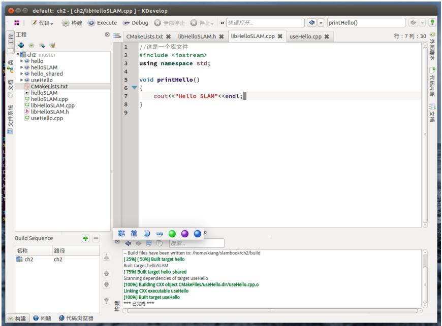

<details>
<summary>text_image</summary>

default: ch2 - [ch2/libHelloSLAM.cpp] - KDevelop
代码 模建 Execute Debug 全部停止 停止 快递打开... printHello()
CMakeLists.txt libHelloSLAM.h libHelloSLAM.cpp useHello.cpp 行：7列：30
ch2 master
hello
helloSLAM
hello_shared
useHello
CMakeLists.txt
helloSLAM
helloSLAM.cpp
libHelloSLAM.cpp
libHelloSLAM.h
useHello.cpp
//这是一个库文件
#include <iostream>
using namespace std;
void printHello()
{
    cout<<"Hello SLAM"<<endl;
}
筑 简
搜索...
Build files have been written to:/home/xiang/slambook/ch2/build
[25%][50%] Built target hello
Built target helloSLAM
[75%] Built target hello_shared
Scanning dependencies of target useHello
[100%] Building CXX object CMakeFiles/useHello.dir/useHello.cpp.o
Linking CXX executable useHello
[100%] Built target useHello
***已完成 ***
构建 问题 代码浏览器
</details>

图 2-12 Kdevelop 界面。

Kdevelop 原生支持 cmake 工程。具体做法是，在终端建立 CMakeLists.txt 后，用Kdevelop 中的“工程-打开/导入工程”打开 CMakeLists.txt。软件会询问你几个问题，并且，默认建立一个 build 文件夹，帮你调用刚才的 cmake 和 make 命令。只要输入快捷键F8，这些都可以自动完成。图 2-12 的下面部分就显示了编译信息。

我们把适应 IDE 的任务交给读者自己来完成，因为我并不希望在书里写 IDE 的说明文档。如果你是从 Windows 过来的，会觉得它的界面与 Visual C++ 或 Visual Studio 还是挺相似的。请用 Kdevelop 打开刚才的工程然后进行编译，看看它输出什么信息。你会觉得比打开终端更方便一些。

不过，本节重点想讲的是如何在 IDE 中进行调试的问题。在 Windows 下编程的同学会有在 Visual Studio 下断点调试的经历。不过在 Linux 中，默认的调试工具 gdb 只提供了文本界面，对新手来讲不太方便。有些 IDE 提供了断点调试功能（底层仍旧是 gdb），Kdevelop 就是其中之一。要使用 Kdevelop 的断点调试功能，你需要完成以下几件事：

1. 在 CMakeLists.txt 中把工程调为 Debug 编译模式。  
2. 告诉 Kdevelop 你想运行哪个程序。如果有参数，也要配置它的参数和工作目录。  
3. 进入断点调试界面，你就可以单步运行，看到中间变量的值了。

第一步，我们在 CMakeLists.txt 中加入下面的命令，来设置编译模式：

```txt
1 set( CMAKE_BUILD_TYPE "Debug" )
```

cmake 自带一些编译相关的内部变量，它们可以对编译过程进行更精细的控制。对于编译类型，通常有调试用的 Debug 模式与发布用的 Release 模式。在 Debug 模式中，程序运行较慢，但可以进行断点调试；相反，Release 模式则速度较快，但没有调试信息。我们把程序设置成 Debug 模式，就能放置断点了。接下来，告诉 Kdevelop 你想启动哪个程序。

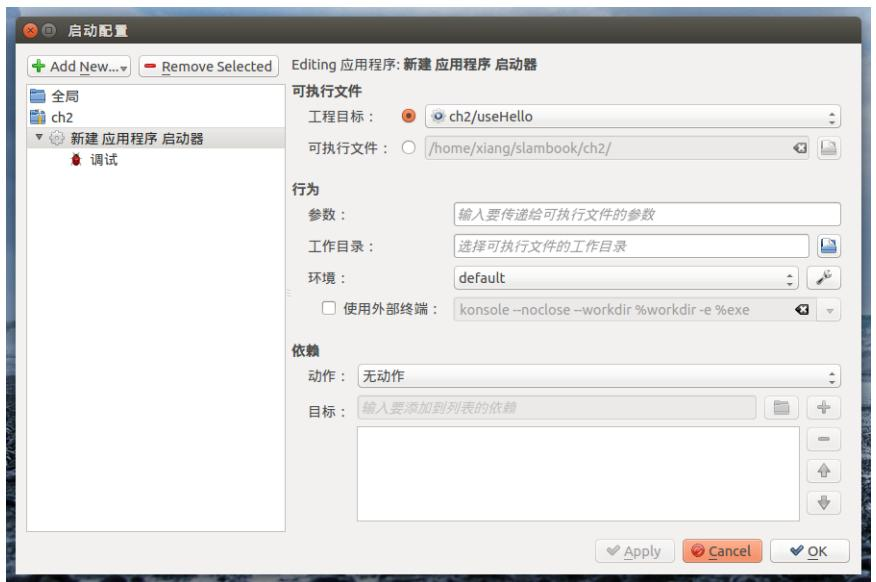

<details>
<summary>text_image</summary>

启动配置
Add New...
Remove Selected
全局
ch2
新建 应用程序 启动器
调试
Editing 应用程序: 新建 应用程序 启动器
可执行文件
工程目标： ch2/useHello
可执行文件： /home/xiang/slambook/ch2/
行为
参数： 输入要传递给可执行文件的参数
工作目录： 选择可执行文件的工作目录
环境： default
使用外部终端： konsole --noclose --workdir %workdir -e %exe
依赖
动作： 无动作
目标： 输入要添加到列表的依赖
Apply Cancel OK
</details>

图 2-13 启动器设置界面。

第二步，我们打开“运行-配置启动器”，然后点击左侧的“Add New-应用程序”。在这一步中，我们的任务是告诉 Kdevelop 想要启动哪一个程序。如图 2-13 所示，你既可以直接选择一个 cmake 的工程目标（也就是我们用 add\_executable 指令构建的可执行程序），也可以直接指向一个二进制文件。我建议你使用第二种方式，根据我的经验，这更少出现问题。

第二栏里，你可以设置程序的运行参数和工作目录。有时我们的程序是有运行参数的，它们会作为 main 函数的参数被传入。如果没有的话可以留空，对于工作目录亦是如此。配置好这两项后，可以点击“OK”按钮保存配置结果。

刚才这几步我们配置了一个应用程序的启动项。对于每一个启动项，我们可以点击“Execute”直接启动这个程序，也可点击“Debug”对它进行断点调试。读者可以试着点击“Execute”按钮，查看输出的结果。现在，为了调试这个程序，我们单击 printHello 那行的左侧，增加一个断点。然后，单击“Debug”按钮，程序就会停留在断点处等待我们，如图 2-14 所示。

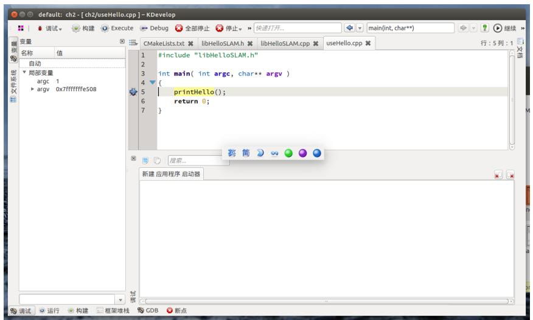

<details>
<summary>text_image</summary>

default: ch2 - [ch2/useHello.cpp] - KDevelop
调试  构建  Execute  Debug  全部停止  停止。快速打开...  main(int, char**)  继续
变量
名称  值
自动
局部变量
    argc 1
    argv  0x7fffffffe508
CMakeLists.txt  libHelloSLAM.h  libHelloSLAM.cpp  useHello.cpp  行：5 列：1
# include "libHelloSLAM.h"
int main( int argc, char** argv )
{
    printHello( );
    return 0;
}
剪 筒
搜索...
新建 应用程序 启动器
调试  运行  构建  框架堆栈  GDB  断点
</details>

图 2-14 调试界面。

调试时，Kdevelop 会切换到调试模式，界面发生了一点变化。在断点处，我们可以用单步运行（F10）、单步跟进（F11）、单步跳出（F12）控制程序的运行。同时，我们可以点开左侧的界面，查看局部变量的值。或者选择“停止”，结束调试。调试结束后，Kdevelop会回到正常的开发界面。

现在读者应该熟悉了整个断点调试的流程。今后，如果读者在程序运行阶段发生了错误，导致程序崩溃的话，就可以用断点调试确定出错的位置，然后加以修正①。那么本讲也就到此为止了。你或许已经觉得我有些话唠了，所以在今后的实践部分中，我们不会再讲述如何新建 build 文件夹，调用 cmake 和 make 命令来编译程序了。我们相信读者应该掌握了这些简单的步骤。同样的，由于本书用到的大多第三方库都是 cmake 工程，所以你会不断熟悉这个编译过程，我们也就不再那么详细地解释了。

##

1. 阅读文献 [1] 和 [14]，你能看懂文献的内容吗？  
2. \* 阅读 SLAM 的综述文献，例如 [9, 15, 16, 17, 18] 等。这些文献关于 SLAM 的看法与本书有何异同？  
3. g++ 命令有哪些参数？怎么填写参数可以更改生成的程序文件名？

4. 使用 build 文件夹来编译你的 cmake 工程，然后在 Kdevelop 中试试。  
5. 刻意在代码中添加一些语法错误，看看编译会生成什么样的信息。你能看懂 g++ 的错误吗？  
6. 如果忘了把库链接到可执行程序上，编译会报错吗？什么样的错？  
7. \* 阅读《cmake 实践》，了解 cmake 的其他语法。  
8. \* 完善 hello SLAM 的小程序，把它做成一个小程序库，安装到本地硬盘中。然后，新建一个工程，使用 find\_package 找这个库并调用它。  
9. \* 寻找其他 cmake 教学材料，深入了解 cmake，例如 https://github.com/TheErk/CMake-tutorial。  
10. 寻找 Kdevelop 的官方网站，看看它还有哪些特性。你都用上了吗？  
11. 如果你在上一讲学习了 vim，请试试 Kdevelop 的 vim 编辑功能。

## 第 3 讲

# 三维空间刚体运动

## 本节目标

1. 理解三维空间的刚体运动描述方式：旋转矩阵、变换矩阵、四元数和欧拉角。  
2. 掌握 Eigen 库的矩阵、几何模块使用方法。

在上讲中，我们讲解了视觉 SLAM 的框架与内容。本讲将介绍视觉 SLAM 的基本问题之一：一个刚体在三维空间中的运动是如何描述的。我们当然知道这由一次旋转加一次平移组成。平移确实没有太大问题，但旋转的处理是件麻烦事。我们将介绍旋转矩阵、四元数、欧拉角的意义，以及它们是如何运算和转换的。在实践部分，我们将介绍线性代数库 Eigen。它提供了 C++ 中的矩阵运算，并且它的 Geometry 模块还提供了四元数等刚体运动的描述。Eigen 的优化非常完善，但是它的使用方法有一些特殊的地方，我们会在程序中介绍。

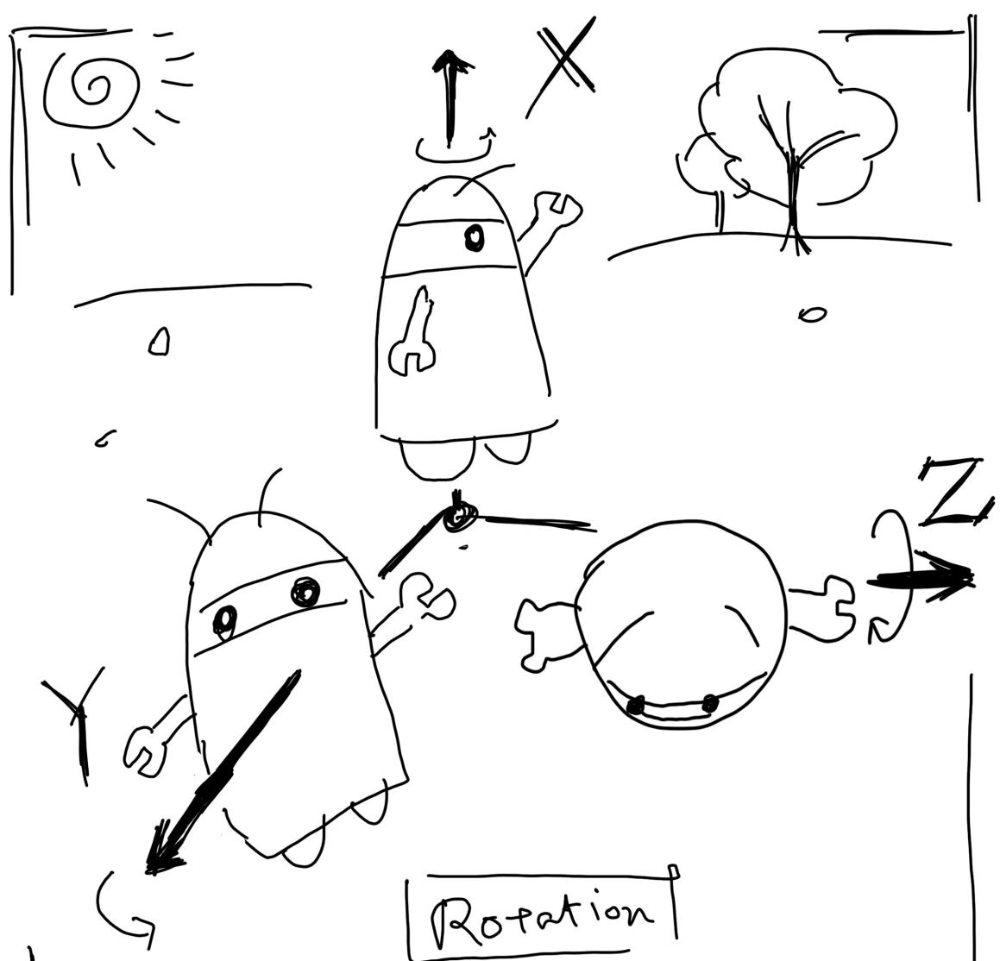

<details>
<summary>text_image</summary>

Rotation
</details>

$$
S O (3) = \{R | R ^ {T} R = I, d e t (R) = 1 \}
$$

$$
\text { roll,pitch,yaw }
$$

$$
q _ {2} = q _ {0} + q _ {1} i + q _ {2} j + q _ {3} k
$$

$$
T = \left[ \begin{array}{l l} R & t \\ 0 ^ {T} & 1 \end{array} \right] \in S E (3)
$$

## 3.1 旋转矩阵

## 3.1.1 点和向量，坐标系

我们日常生活的空间是三维的，因此我们生来就习惯于三维空间的运动。三维空间由三个轴组成，所以一个空间点的位置可以由三个坐标指定。不过，我们现在要考虑刚体，它不光有位置，还有自身的姿态。相机也可以看成三维空间的刚体，于是位置是指相机在空间中的哪个地方，而姿态则是指相机的朝向。结合起来，我们可以说，“相机正处于空间(0, 0, 0) 点处，朝向正前方” 这样的话。但是这种自然语言很繁琐，我们更喜欢用数学语言来描述它。

我们从最基本的开始讲起：点和向量。点的几何意义很容易理解。向量是什么呢？它是线性空间中的一个元素，可以把它想象成从原点指向某处的一个箭头。需要提醒读者的是，请不要把向量与它的坐标两个概念混淆。一个向量是空间当中的一样东西，比如说 a。这里 a 并不是和若干个实数相关联的。只有当我们指定这个三维空间中的某个坐标系时，才可以谈论该向量在此坐标系下的坐标，也就是找到若干个实数对应这个向量。例如，三维空间中的某个向量的坐标可以用 $\mathbb { R } ^ { 3 }$ 当中的三个数来描述。某个点的坐标也可以用 $\mathbb { R } ^ { 3 }$ 来描述。怎么描述的呢？如果我们确定一个坐标系，也就是一个线性空间的基 $( e _ { 1 } , e _ { 2 } , e _ { 3 } )$ ，那就可以谈论向量 a 在这组基下的坐标了：

$$
\boldsymbol {a} = \left[ \boldsymbol {e} _ {1}, \boldsymbol {e} _ {2}, \boldsymbol {e} _ {3} \right] \left[ \begin{array}{l} a _ {1} \\ a _ {2} \\ a _ {3} \end{array} \right] = a _ {1} \boldsymbol {e} _ {1} + a _ {2} \boldsymbol {e} _ {2} + a _ {3} \boldsymbol {e} _ {3}. \tag {3.1}
$$

所以这个坐标的具体取值，一个是和向量本身有关，第二也和坐标系的选取有关。坐标系通常由三个正交的坐标轴组成（尽管也可以有非正交的，但实际中很少见）。例如，我们给定 x 和 y 轴时，z 就可以通过右手（或左手）法则由 $\textbf { \em x } \times \textbf { \em y }$ 定义出来。根据定义方式的不同，坐标系又分为左手系和右手系。左手系的第三个轴与右手系相反。就经验来讲，人们更习惯使用右手系，尽管也有一部分程序库仍使用左手系。

根据基本的线性代数知识，我们可以谈论向量与向量，以及向量与数之间的运算，例如数乘、加法，减法，内积，外积等等。数乘和四则运算都是相当基本的内容，我们就不赘述了。内外积对读者来说可能有些陌生，我们给出它们的运算方式。对于 $a , b \in \mathbb { R } ^ { 3 }$ ，内积可以写成：

$$
\boldsymbol {a} \cdot \boldsymbol {b} = \boldsymbol {a} ^ {T} \boldsymbol {b} = \sum_ {i = 1} ^ {3} a _ {i} b _ {i} = | \boldsymbol {a} | | \boldsymbol {b} | \cos \langle \boldsymbol {a}, \boldsymbol {b} \rangle . \tag {3.2}
$$

内积可以描述向量间的投影关系。而外积呢是这个样子：

$$
\boldsymbol {a} \times \boldsymbol {b} = \left[ \begin{array}{c c c} \boldsymbol {i} & \boldsymbol {j} & \boldsymbol {k} \\ a _ {1} & a _ {2} & a _ {3} \\ b _ {1} & b _ {2} & b _ {3} \end{array} \right] = \left[ \begin{array}{c} a _ {2} b _ {3} - a _ {3} b _ {2} \\ a _ {3} b _ {1} - a _ {1} b _ {3} \\ a _ {1} b _ {2} - a _ {2} b _ {1} \end{array} \right] = \left[ \begin{array}{c c c} 0 & - a _ {3} & a _ {2} \\ a _ {3} & 0 & - a _ {1} \\ - a _ {2} & a _ {1} & 0 \end{array} \right] \boldsymbol {b} \triangleq \boldsymbol {a} ^ {\wedge} \boldsymbol {b}. (3. 3)
$$

外积的方向垂直于这两个向量，大小为 $| a | | b | \sin \langle a , b \rangle$ ，是两个向量张成的四边形的有向面积。对于外积，我们引入了 ∧ 符号，把 a 写成一个矩阵。事实上是一个反对称矩阵（Skew-symmetric），你可以将 ∧ 记成一个反对称符号。这样就把外积 $\mathbf { { a } } \times \mathbf { { b } } $ ，写成了矩阵与向量的乘法 $\mathbf { \Omega } _ { a ^ { \left. \right.} b  }$ ，把它变成了线性运算。这个符号将在后文经常用到，请记住它。外积只对三维向量存在定义，我们还能用外积表示向量的旋转。

为什么外积可以表示旋转呢？

考虑两个不平行的向量 $a , b ,$ ，我们要描述从 a 到 b 之间是如何旋转的，如图 3-1 所示。我们可以用一个向量来描述三维空间中两个向量的旋转关系。在右手法则下，我们用右手的四个指头从 a 转向 b，其大拇指朝向就是旋转向量的方向，事实上也是 $\mathbf { \Omega } _ { a \times b }$ 的方向。它的大小则由 a 和 b 的夹角决定。通过这种方式，我们构造了从 $^ { a }$ 到 b 的一个旋转向量。这个向量同样位于三维空间中，在此坐标系下，可以用三个实数来描述它。

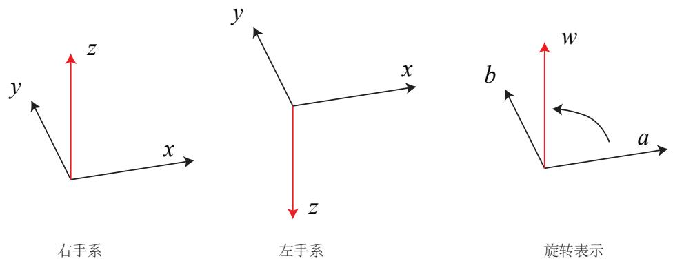  
图 3-1 左右手系的区别与向量间的旋转。a 到 b 的旋转可以由向量 w 来描述。

## 3.1.2 坐标系间的欧氏变换

与向量间的旋转类似，我们同样可以描述两个坐标系之间的旋转关系，再加上平移，统称为坐标系之间的变换关系。在机器人的运动过程中，常见的做法是设定一个惯性坐标系（或者叫世界坐标系），可以认为它是固定不动的，例如图 3-2 中的 xW, yW, zW 定义的坐标系。同时，相机或机器人则是一个移动坐标系，例如 $x _ { C } , y _ { C } , z _ { C }$ 定义的坐标系。我们会问：相机视野中某个向量 $\pmb { p } _ { \mathrm { : } }$ ，它的坐标为 ${ \pmb p } _ { c }$ ，而从世界坐标系下看，它的坐标 $\mathbf { \nabla } _ { \pmb { p } _ { w } }$ 。这两个坐标之间是如何转换的呢？这时，就需要先得到该点针对机器人坐标系坐标值，再根据机器人位姿转换到世界坐标系中，这个转换关系由一个矩阵 T 来描述，如图 3-2 所示。

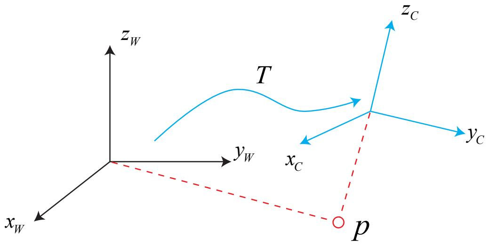

<details>
<summary>text_image</summary>

z_W
T
y_W
x_C
p
z_C
y_C
x_W
</details>

图 3-2 坐标变换。对于同一个向量 $^ { p , }$ ，它在世界坐标系下的坐标 $\mathbf { \Delta } _ { p _ { w } }$ 和在相机坐标系下的 $\pmb { p _ { c } }$ 是不同的。这个变换关系由坐标系间的变换矩阵 $_ { \mathbf { T } }$ 来描述。

相机运动是一个刚体运动，它保证了同一个向量在各个坐标系下的长度和夹角都不会发生变化。这种变换称为欧氏变换。想象你把手机抛到空中，在它落地摔碎之前，只可能有空间位置和姿态的不同，而它自己的长度、各个面的角度等性质不会有任何变化。这样一个欧氏变换由一个旋转和一个平移两部分组成。首先来考虑旋转。我们设某个单位正交基$( e _ { 1 } , e _ { 2 } , e _ { 3 } )$ 经过一次旋转，变成了 $( e _ { 1 } ^ { ' } , e _ { 2 } ^ { ' } , e _ { 3 } ^ { ' } )$ 。那么，对于同一个向量 $\textbf { \em a }$ （注意该向量并没有随着坐标系的旋转而发生运动），它在两个坐标系下的坐标为 $[ a _ { 1 } , a _ { 2 } , a _ { 3 } ] ^ { T }$ 和 $[ a _ { 1 } ^ { ' } , a _ { 2 } ^ { ' } , a _ { 3 } ^ { ' } ] ^ { T }$ 。根据坐标的定义，有：

$$
\left[ \boldsymbol {e} _ {1}, \boldsymbol {e} _ {2}, \boldsymbol {e} _ {3} \right] \left[ \begin{array}{l} a _ {1} \\ a _ {2} \\ a _ {3} \end{array} \right] = \left[ \boldsymbol {e} _ {1} ^ {\prime}, \boldsymbol {e} _ {2} ^ {\prime}, \boldsymbol {e} _ {3} ^ {\prime} \right] \left[ \begin{array}{l} a _ {1} ^ {\prime} \\ a _ {2} ^ {\prime} \\ a _ {3} ^ {\prime} \end{array} \right]. \tag {3.4}
$$

为了描述两个坐标之间的关系，我们对上面等式左右同时左乘 $\left[ \begin{array} { l } { e _ { 1 } ^ { T } } \\ { e _ { 2 } ^ { T } } \\ { e _ { 3 } ^ { T } } \end{array} \right]$ ，那么左边的系数变成了单位矩阵，所以：

$$
\left[ \begin{array}{l} a _ {1} \\ a _ {2} \\ a _ {3} \end{array} \right] = \left[ \begin{array}{c c c} \boldsymbol {e} _ {1} ^ {T} \boldsymbol {e} _ {1} ^ {\prime} & \boldsymbol {e} _ {1} ^ {T} \boldsymbol {e} _ {2} ^ {\prime} & \boldsymbol {e} _ {1} ^ {T} \boldsymbol {e} _ {3} ^ {\prime} \\ \boldsymbol {e} _ {2} ^ {T} \boldsymbol {e} _ {1} ^ {\prime} & \boldsymbol {e} _ {2} ^ {T} \boldsymbol {e} _ {2} ^ {\prime} & \boldsymbol {e} _ {2} ^ {T} \boldsymbol {e} _ {3} ^ {\prime} \\ \boldsymbol {e} _ {3} ^ {T} \boldsymbol {e} _ {1} ^ {\prime} & \boldsymbol {e} _ {3} ^ {T} \boldsymbol {e} _ {2} ^ {\prime} & \boldsymbol {e} _ {3} ^ {T} \boldsymbol {e} _ {3} ^ {\prime} \end{array} \right] \left[ \begin{array}{l} a _ {1} ^ {\prime} \\ a _ {2} ^ {\prime} \\ a _ {3} ^ {\prime} \end{array} \right] \triangleq \boldsymbol {R a ^ {\prime}}. (3. 5)
$$

我们把中间的阵拿出来，定义成一个矩阵 R。这个矩阵由两组基之间的内积组成，刻画了旋转前后同一个向量的坐标变换关系。只要旋转是一样的，那么这个矩阵也是一样的。可以说，矩阵 R 描述了旋转本身。因此它又称为旋转矩阵。

旋转矩阵有一些特别的性质。事实上，它是一个行列式为 1 的正交矩阵①。反之，行列式为 1 的正交矩阵也是一个旋转矩阵。所以，我们可以把旋转矩阵的集合定义如下：

$$
S O (n) = \{\boldsymbol {R} \in \mathbb {R} ^ {n \times n} | \boldsymbol {R} \boldsymbol {R} ^ {T} = \boldsymbol {I}, \det (\boldsymbol {R}) = 1 \}. \tag {3.6}
$$

SO(n) 是特殊正交群（Special Orthogonal Group）的意思。我们把解释“群”的内容留到下一讲。这个集合由 n 维空间的旋转矩阵组成，特别的，SO(3) 就是三维空间的旋转了。通过旋转矩阵，我们可以直接谈论两个坐标系之间的旋转变换，而不用再从基开始谈起了。换句话说，旋转矩阵可以描述相机的旋转。

由于旋转矩阵为正交阵，它的逆（即转置）描述了一个相反的旋转。按照上面的定义方式，有：

$$
\boldsymbol {a} ^ {\prime} = \boldsymbol {R} ^ {- 1} \boldsymbol {a} = \boldsymbol {R} ^ {T} \boldsymbol {a}. \tag {3.7}
$$

显然 $R ^ { T }$ 刻画了一个相反的旋转。

在欧氏变换中，除了旋转之外还有一个平移。考虑世界坐标系中的向量 a，经过一次旋转（用 R 描述）和一次平移 t 后，得到了 $\mathbf { \Delta } \mathbf { a ^ { ' } }$ ，那么把旋转和平移合到一起，有：

$$
\boldsymbol {a} ^ {\prime} = \boldsymbol {R} \boldsymbol {a} + \boldsymbol {t}. \tag {3.8}
$$

其中，t 称为平移向量。相比于旋转，平移部分只需把这个平移量加到旋转之后的坐标上，显得非常简洁。通过上式，我们用一个旋转矩阵 R 和一个平移向量 t 完整地描述了一个

欧氏空间的坐标变换关系。

## 3.1.3 变换矩阵与齐次坐标

式（3.8）完整地表达了欧氏空间的旋转与平移，不过还存在一个小问题：这里的变换关系不是一个线性关系。假设我们进行了两次变换： $R _ { 1 } , t _ { 1 }$ 和 $R _ { 2 } , t _ { 2 }$ ，满足：

$$
\boldsymbol {b} = \boldsymbol {R} _ {1} \boldsymbol {a} + \boldsymbol {t} _ {1}, \quad \boldsymbol {c} = \boldsymbol {R} _ {2} \boldsymbol {b} + \boldsymbol {t} _ {2}.
$$

但是从 a 到 c 的变换为：

$$
\boldsymbol {c} = \boldsymbol {R} _ {2} \left(\boldsymbol {R} _ {1} \boldsymbol {a} + \boldsymbol {t} _ {1}\right) + \boldsymbol {t} _ {2}.
$$

这样的形式在变换多次之后会过于复杂。因此，我们要引入齐次坐标和变换矩阵重写式（3.8）：

$$
\left[ \begin{array}{l} \boldsymbol {a} ^ {\prime} \\ 1 \end{array} \right] = \left[ \begin{array}{c c} \boldsymbol {R} & t \\ \mathbf {0} ^ {T} & 1 \end{array} \right] \left[ \begin{array}{l} \boldsymbol {a} \\ 1 \end{array} \right] \triangleq \boldsymbol {T} \left[ \begin{array}{l} \boldsymbol {a} \\ 1 \end{array} \right]. \tag {3.9}
$$

这是一个数学技巧：我们把一个三维向量的末尾添加 1，变成了四维向量，称为齐次坐标。对于这个四维向量，我们可以把旋转和平移写在一个矩阵里面，使得整个关系变成了线性关系。该式中，矩阵 T 称为变换矩阵（Transform Matrix）。我们暂时用 a˜ 表示 a 的齐次坐标。

稍微来说一下齐次坐标。它是射影几何里的概念。通过添加最后一维，我们用四个实数描述了一个三维向量，这显然多了一个自由度，但允许我们把变换写成线性的形式。在齐次坐标中，某个点 x 的每个分量同乘一个非零常数 k 后，仍然表示的是同一个点。因此，一个点的具体坐标值不是唯一的。如 $[ 1 , 1 , 1 , 1 ] ^ { T }$ 和 $[ 2 , 2 , 2 , 2 ] ^ { T }$ 是同一个点。但当最后一项不为零时，我们总可以把所有坐标除以最后一项，强制最后一项为 1，从而得到一个点唯一的坐标表示（也就是转换成非齐次坐标）：

$$
\tilde {\boldsymbol {x}} = [ x, y, z, w ] ^ {T} = [ x / w, y / w, z / w, 1 ] ^ {T}. \tag {3.10}
$$

这时，忽略掉最后一项，这个点的坐标和欧氏空间就是一样的。依靠齐次坐标和变换矩阵，两次变换的累加就可以有很好的形式：

$$
\tilde {\boldsymbol {b}} = \boldsymbol {T} _ {1} \tilde {\boldsymbol {a}}, \tilde {\boldsymbol {c}} = \boldsymbol {T} _ {2} \tilde {\boldsymbol {b}} \Rightarrow \tilde {\boldsymbol {c}} = \boldsymbol {T} _ {2} \boldsymbol {T} _ {1} \tilde {\boldsymbol {a}}. \tag {3.11}
$$

但是区分齐次和非齐次坐标的符号令我们厌烦。在不引起歧义的情况下，以后我们就

直接把它写成 b = T a 的样子，默认其中是齐次坐标了。

关于变换矩阵 T，它具有比较特别的结构：左上角为旋转矩阵，右侧为平移向量，左下角为 0 向量，右下角为 1。这种矩阵又称为特殊欧氏群（Special Euclidean Group）：

$$
S E (3) = \left\{\boldsymbol {T} = \left[ \begin{array}{c c} \boldsymbol {R} & \boldsymbol {t} \\ \mathbf {0} ^ {T} & 1 \end{array} \right] \in \mathbb {R} ^ {4 \times 4} | \boldsymbol {R} \in S O (3), \boldsymbol {t} \in \mathbb {R} ^ {3} \right\}. \tag {3.12}
$$

与 SO(3) 一样，求解该矩阵的逆表示一个反向的变换：

$$
\boldsymbol {T} ^ {- 1} = \left[ \begin{array}{c c} \boldsymbol {R} ^ {T} & - \boldsymbol {R} ^ {T} \boldsymbol {t} \\ \boldsymbol {0} ^ {T} & 1 \end{array} \right]. \tag {3.13}
$$

最后，为了保持符号的简洁，在不引起歧义的情况下，我们以后不区别齐次坐标与普通的坐标的符号，默认我们使用的是符合运算法则的那一种。例如，当我们写 T a 时，使用的是齐次坐标（不然没法计算）。而写 Ra 时，使用的是非齐次坐标。如果写在一个等式中，我们就假设齐次坐标到普通坐标的转换，是已经做好了的——因为齐次坐标和非齐次坐标之间的转换事实上非常容易。

回顾一下我们介绍的内容：首先，我们说了向量和它的坐标表示，并介绍了向量间的运算；然后，坐标系之间的运动由欧氏变换描述，它由平移和旋转组成。旋转可以由旋转矩阵 SO(3) 描述，而平移直接由一个 R3 向量描述。最后，如果将平移和旋转放在一个矩阵中，就形成了变换矩阵 SE(3)。

## 3.2 实践：Eigen

本讲的实践部分有两节。第一部分中，我们将讲解如何使用 Eigen 来表示矩阵、向量，随后引申至旋转矩阵与变换矩阵的计算。本节的代码在 slambook/ch3/useEigen 中。

Eigen①是一个 C++ 开源线性代数库。它提供了快速的有关矩阵的线性代数运算，还包括解方程等功能。许多上层的软件库也使用 Eigen 进行矩阵运算，包括 g2o、Sophus 等。照应本讲的理论部分，我们来学习一下 Eigen 的编程。

你的 PC 上可能还没有安装 Eigen。请输入以下命令来安装它：

1 sudo apt-get install libeigen3-dev

大部分常用的库都在 Ubuntu 软件源中提供。以后，当你想要安装某个库时，不妨先搜索一下 Ubuntu 的软件源是否提供了这样的库。通过 apt 命令，我们能够方便地安装Eigen。回顾上一讲的知识，我们知道一个库由头文件和库文件组成。Eigen 头文件的默认位置在“/usr/include/eigen3/” 中。如果你不确定，可以输入

```txt
sudo updatedb
locate eigen3
```

来查找它的位置。相比于其他库，Eigen 特殊之处在于，它是一个纯用头文件搭建起来的库（这非常神奇！）。这意味着你只能找到它的头文件，而没有.so 或.a 那样的二进制文件。我们在使用时，只需引入 Eigen 的头文件即可，不需要链接它的库文件（因为它没有库文件）。下面我们写一段代码，来实际练习一下 Eigen 的使用：

slambook/ch3/useEigen/eigenMatrix.cpp  
```cpp
#include <iostream>
#include <ctime>
using namespace std;

// Eigen 部分
#include <Eigen/Core>
// 稠密矩阵的代数运算（逆，特征值等）
#include <Eigen/Dense>

#define MATRIX_SIZE 50

/**********************************************************************
* 本程序演示了 Eigen 基本类型的使用
**********************************************************************/
int main( int argc, char** argv )
{
    // Eigen 以矩阵为基本数据单元。它是一个模板类。它的前三个参数为：数据类型，行，列
    // 声明一个 2*3 的 float 矩阵
    Eigen::Matrix<float, 2, 3> matrix_23;
    // 同时，Eigen 通过 typedef 提供了许多内置类型，不过底层仍是 Eigen::Matrix
    // 例如 Vector3d 实质上是 Eigen::Matrix<double, 3, 1>
    Eigen::Vector3d v_3d;
    // 还有 Matrix3d 实质上是 Eigen::Matrix<double, 3, 3>
    Eigen::Matrix3d matrix_33 = Eigen::Matrix3d::Zero(); // 初始化为零
    // 如果不确定矩阵大小，可以使用动态大小的矩阵
    Eigen::Matrix<double, Eigen::Dynamic, Eigen::Dynamic > matrix_dynamic;
    // 更简单的
    Eigen::MatrixXd matrix_x;
    // 这种类型还有很多，我们不一一列举

    // 下面是对矩阵的操作
    // 输入数据
    matrix_23 << 1, 2, 3, 4, 5, 6;
    // 输出
    cout << matrix_23 << endl;
```

```cpp
// 用()访问矩阵中的元素
for (int i=0; i<1; i++)
    for (int j=0; j<2; j++)
    cout<<matrix_23(i,j)<<endl;

v_3d << 3, 2, 1;
// 矩阵和向量相乘（实际上仍是矩阵和矩阵）
// 但是在这里你不能混合两种不同类型的矩阵，像这样是错的
// Eigen::Matrix<double, 2, 1> result_wrong_type = matrix_23 * v_3d;

// 应该显式转换
Eigen::Matrix<double, 2, 1> result = matrix_23.cast<double>() * v_3d;
cout << result << endl;

// 同样你不能搞错矩阵的维度
// 试着取消下面的注释，看看会报什么错
// Eigen::Matrix<double, 2, 3> result_wrong_dimension = matrix_23.cast<double>() * v_3d;

// 一些矩阵运算
// 四则运算就不演示了，直接用对应的运算符即可。
matrix_33 = Eigen::Matrix3d::Random();
cout << matrix_33 << endl << endl;

cout << matrix_33.transpose() << endl; // 转置
cout << matrix_33.sum() << endl; // 各元素和
cout << matrix_33.trace() << endl; // 遗
cout << 10*matrix_33 << endl; // 数乘
cout << matrix_33.inverse() << endl; // 逆
cout << matrix_33.determinant() << endl; // 行列式

// 特征值
// 实对称矩阵可以保证对角化成功
Eigen::SelfAdjointEigenSolver<Eigen::Matrix3d> eigen_solver ( matrix_33.transpose() * matrix_33 );
cout << "Eigen values = " << eigen_solver.eigenvalues() << endl;
cout << "Eigen vectors = " << eigen_solver.eigenvectors() << endl;

// 解方程
// 我们求解 matrix_NN * x = v_Nd 这个方程
// N 的大小在前边的宏里定义，矩阵由随机数生成
// 直接求逆自然是最直接的，但是求逆运算量大

Eigen::Matrix<double, MATRIX_SIZE, MATRIX_SIZE > matrix_NN;
matrix_NN = Eigen::MatrixXd::Random( MATRIX_SIZE, MATRIX_SIZE );
Eigen::Matrix<double, MATRIX_SIZE, 1> v_Nd;
v_Nd = Eigen::MatrixXd::Random( MATRIX_SIZE, 1 );

clock_t time_stt = clock(); // 计时
// 直接求逆
Eigen::Matrix<double, MATRIX_SIZE, 1> x = matrix_NN.inverse() * v_Nd;
```

```cpp
cout << "time use in normal invers is " << 1000* (clock() - time_stt)/(double)CLOCKS_PER_SEC << "ms"
<< endl;

// 通常用矩阵分解来求，例如 QR 分解，速度会快很多
time_stt = clock();
x = matrix_NN.colPivHouseholderQr().solve(v_Nd);
cout << "time use in Qr composition is " << 1000* (clock() - time_stt)/(double)CLOCKS_PER_SEC << "ms"
<< endl;

return 0;
}
```

这个例程演示了 Eigen 矩阵的基本操作与运算。要编译它，你需要在 CMakeLists.txt里指定 Eigen 的头文件目录：

```cmake
# 添加头文件
include_directories("/usr/include/eigen3")
```

重复一遍，因为 Eigen 库只有头文件，我们不需要再用 tartget\_link\_libraries 语句将程序链接到库上。不过，对于其他大部分库，多数时候需要用到链接命令。这里的做法并不见得是最好的，因为他人可能把 Eigen 安装在了不同位置，就必须手动修改这里的头文件目录。在之后的工作中，我们会使用 find\_package 命令去搜索库，不过在本讲我们暂时保持这个样子。编译好这个程序后，运行它，看到各矩阵的输出结果。

```txt
11:42 xiang@virtual /home/xiang/slambook/ch3/useEigen
% build/eigenMatrix
1 2 3
4 5 6
1
2
10
28
0.680375 0.59688 -0.329554
-0.211234 0.823295 0.536459
0.566198 -0.604897 -0.444451
.....
```

由于我们在代码中给出了详细的注释，在此就不向读者一一解释每行语句了。在书中，我们仅给出几处重要地方的说明（后面的实践部分亦将保持这个风格）。

1. 读者最好亲手输入一遍上面的代码（不包括注释）。至少要编译运行一遍上面的程序。  
2. Kdevelop 可能不会提示 C++ 成员运算，这是它做的不够完善导致的。请你照着上面的内容输入即可，不必理会它是否提示错误。  
3. Eigen 提供的矩阵和 MATLAB 很相似，几乎所有的数据都当作矩阵来处理。但是，为了实现更好的效率，在 Eigen 中你需要指定矩阵的大小和类型。对于在编译时期就

知道大小的矩阵，处理起来会比动态变化大小的矩阵更快一些。因此，像旋转矩阵、变换矩阵这样的数据，完全可在编译时期确定它们的大小和数据类型。

4. Eigen 内部的矩阵实现比较复杂，我们不在这里介绍，我们希望你像使用 float、double那样的内置数据类型那样使用 Eigen 的矩阵。这应该是符合它设计之初衷的。

5. Eigen 矩阵不支持自动类型提升，这和 C++ 的内建数据类型有较大差异。在 C++程序中，我们可以把一个 float 数据和 double 数据相加、相乘，编译器会自动把数据类型转换为最合适的那种。而在 Eigen 中，出于性能的考虑，必须显式地对矩阵类型进行转换。而如果忘了这样做，Eigen 会（不太友好地）提示您一个“YOU MIXEDDIFFERENT NUMERIC TYPES ...”的编译错误。你可以尝试找一下这条信息出现错误提示的哪个部分。如果错误信息太长最好保存到一个文件里再找。

6. 同理，在计算过程中你也需要保证矩阵维数的正确性，否则会出现“YOU MIXEDMATRICES OF DIFFERENT SIZES”。请你不要抱怨这种错误提示方式，对于 C++模板元编程，能够提示出可以阅读的信息已经是很幸运的了。以后，若发现 Eigen 出错，你可以直接寻找大写的部分，推测出了什么问题。

7. 我们的例程只介绍了基本的矩阵运算。你可以阅读 http://eigen.tuxfamily.org/dox-devel/modules.html 学习更多的 Eigen 知识。我只演示了最简单的部分，但看懂演示程序不等于你已经能够熟练操作 Eigen 了。

最后一段中我们比较了求逆与求 QR 分解的运行效率，你可以看看自己机器上的时间差异，两种方法是否有明显的差异？

## 3.3 旋转向量和欧拉角

## 3.3.1 旋转向量

我们重新回到理论部分。有了旋转矩阵来描述旋转，有了变换矩阵描述一个六自由度的三维刚体运动，是不是已经足够了呢？但是，矩阵表示方式至少有以下几个缺点：

1. SO(3) 的旋转矩阵有九个量，但一次旋转只有三个自由度。因此这种表达方式是冗余的。同理，变换矩阵用十六个量表达了六自由度的变换。那么，是否有更紧凑的表示呢？  
2. 旋转矩阵自身带有约束：它必须是个正交矩阵，且行列式为 1。变换矩阵也是如此。当我们想要估计或优化一个旋转矩阵/变换矩阵时，这些约束会使得求解变得更困难。

因此，我们希望有一种方式能够紧凑地描述旋转和平移。例如，用一个三维向量表达旋转，用六维向量表达变换，可行吗？事实上，这件事我们在前面介绍外积的那部分，提到过这件事如何做。我们介绍了如何用外积表达两个向量的旋转关系。对于坐标系的旋转，我们知道，任意旋转都可以用一个旋转轴和一个旋转角来刻画。于是，我们可以使用一个向量，其方向与旋转轴一致，而长度等于旋转角。这种向量，称为旋转向量（或轴角，Axis-Angle）。这种表示法只需一个三维向量即可描述旋转。同样，对于变换矩阵，我们使用一个旋转向量和一个平移向量即可表达一次变换。这时的维数正好是六维。

事实上，旋转向量就是我们下章准备介绍的李代数。所以我们把它的详细内容留到下一章，本章内读者只需知道旋转可以这样表示即可。剩下的问题是，旋转向量和旋转矩阵之间是如何转换的呢？假设有一个旋转轴为 n，角度为 θ 的旋转，显然，它对应的旋转向量为 θn。由旋转向量到旋转矩阵的过程由罗德里格斯公式（Rodrigues’s Formula ）表明，由于推导过程比较复杂，我们不作描述，只给出转换的结果①：

$$
\boldsymbol {R} = \cos \theta \boldsymbol {I} + (1 - \cos \theta) \boldsymbol {n n} ^ {T} + \sin \theta \boldsymbol {n} ^ {\wedge}. \tag {3.14}
$$

符号 ∧ 是向量到反对称的转换符，见式（3.3）。反之，我们也可以计算从一个旋转矩阵到旋转向量的转换。对于转角 θ，有：

$$
\begin{array}{l} \operatorname{tr} (\boldsymbol {R}) = \cos \theta \operatorname{tr} (\boldsymbol {I}) + (1 - \cos \theta) \operatorname{tr} (\boldsymbol {n n} ^ {T}) + \sin \theta \operatorname{tr} (\boldsymbol {n} ^ {\wedge}) \\ = 3 \cos \theta + (1 - \cos \theta) \tag {3.15} \\ = 1 + 2 \cos \theta . \\ \end{array}
$$

因此：

$$
\theta = \arccos (\frac {\operatorname{tr} (\boldsymbol {R}) - 1}{2}). \tag {3.16}
$$

关于转轴 n，由于旋转轴上的向量在旋转后不发生改变，说明

$$
R n = n.
$$

因此，转轴 n 是矩阵 R 特征值 1 对应的特征向量。求解此方程，再归一化，就得到了旋转轴。读者也可以从“旋转轴经过旋转之后不变”的几何角度看待这个方程。仍然剧透几句，这里的两个转换公式在下一章仍将出现，你会发现它们正是 SO(3) 上李群与李代数的对应关系。

## 3.3.2 欧拉角

下面我们来说说欧拉角。

无论是旋转矩阵、旋转向量，虽然它们能描述旋转，但对我们人类是非常不直观的。当我们看到一个旋转矩阵或旋转向量时，很难想象出来这个旋转究竟是什么样的。当它们变换时，我们也不知道物体是向哪个方向在转动。而欧拉角则提供了一种非常直观的方式来描述旋转——它使用了三个分离的转角，把一个旋转分解成三次绕不同轴的旋转。当然，由于分解方式有许多种，所以欧拉角也存在着不同的定义方法。比如说，当我先绕 X 轴旋转，再绕 Y 轴，最后绕 Z 轴，就得到了一个 XY Z 轴的旋转。同理，可以定义 ZY Z、ZY X等等旋转方式。如果讨论更细一些，还需要区分每次旋转是绕固定轴旋转的，还是绕旋转之后的轴旋转的，这也会给出不一样的定义方式。

你或许在航空、航模中听说过“俯仰角”、“偏航角”这些词。欧拉角当中比较常用的一种，便是用“偏航-俯仰-滚转”（yaw-pitch-roll）三个角度来描述一个旋转的。由于它等价于 ZY X 轴的旋转，我们就以 ZY X 为例。假设一个刚体的前方（朝向我们的方向）为X 轴，右侧为 Y 轴，上方为 Z 轴，见图 3-3。那么，ZY X 转角相当于把任意旋转分解成以下三个轴上的转角：

1. 绕物体的 Z 轴旋转，得到偏航角 yaw；  
2. 绕旋转之后的 Y 轴旋转，得到俯仰角 pitch；  
3. 绕旋转之后的 X 轴旋转，得到滚转角 roll。

此时，我们可以使用 [r, p, y]T 这样一个三维的向量描述任意旋转。这个向量十分的直观，我们可以从这个向量想象出旋转的过程。其他的欧拉角亦是通过这种方式，把旋转分解到三个轴上，得到一个三维的向量，只不过选用的轴，以及选用的顺序不一样。这里介绍的 rpy 角是比较常用的一种，只有很少的欧拉角种类会有 rpy 那样脍炙人口的名字。不同的欧拉角是按照旋转轴的顺序来称呼的。例如，rpy 角的旋转顺序是 ZY X。同样，也有XY Z, ZY Z 这样欧拉角——但是它们就没有专门的名字了。值得一提的是，大部分领域在使用欧拉角时有各自的坐标方向和顺序上的习惯，不一定和我们这里说的相同。

欧拉角的一个重大缺点是会碰到著名的万向锁问题（Gimbal Lock①）：在俯仰角为±90◦ 时，第一次旋转与第三次旋转将使用同一个轴，使得系统丢失了一个自由度（由三次旋转变成了两次旋转）。这被称为奇异性问题，在其他形式的欧拉角中也同样存在。理论上可以证明，只要我们想用三个实数来表达三维旋转时，都会不可避免地碰到奇异性问题。由于这种原理，欧拉角不适于插值和迭代，往往只用于人机交互中。我们也很少在 SLAM程序中直接使用欧拉角表达姿态，同样不会在滤波或优化中使用欧拉角表达旋转（因为它具有奇异性）。不过，若你想验证自己算法是否有错时，转换成欧拉角能够快速辨认结果的正确与否。 正确

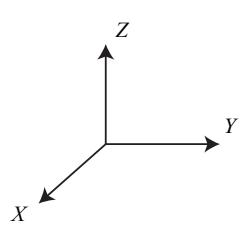

<details>
<summary>natural_image</summary>

3D Cartesian coordinate system with X, Y, Z axes labeled (no numerical data or text beyond axis labels)
</details>

原始坐标系

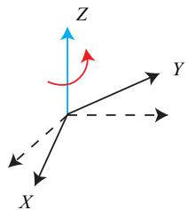

<details>
<summary>text_image</summary>

Z
Y
X
</details>

第一次旋转

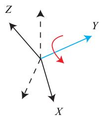

<details>
<summary>text_image</summary>

Z
Y
X
</details>

第二次旋转

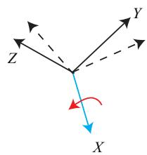

<details>
<summary>text_image</summary>

Z
Y
X
</details>

第三次旋转

万向锁的情况  
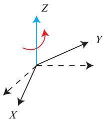

<details>
<summary>text_image</summary>

Z
Y
X
</details>

第一次旋转

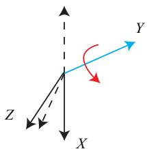

<details>
<summary>text_image</summary>

Z
X
Y
</details>

第二次旋转为90度

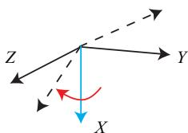

<details>
<summary>text_image</summary>

Z
Y
X
</details>

第三次旋转变成和第一次相同  
图 3-3 欧拉角的旋转示意图。上方为 ZYX 角定义。下方为 pitch=90 度时，第三次旋转与第一次滚转角相同，使得系统丢失了一个自由度。如果你还没有理解万向锁，可以看看相关视频，理解起来会更方便。

## 3.4 四元数

## 3.4.1 四元数的定义

旋转矩阵用九个量描述三自由度的旋转，具有冗余性；欧拉角和旋转向量是紧凑的，但具有奇异性。事实上，我们找不到不带奇异性的三维向量描述方式 [19]。这有点类似于，当我们想用两个坐标表示地球表面时（如经度和纬度），必定存在奇异性（纬度为 ±90◦ 时经度无意义）。三维旋转是一个三维流形，想要无奇异性地表达它，用三个量是不够的。

回忆我们以前学习过的复数。我们用复数集 C 表示复平面上的向量，而复数的乘法则能表示复平面上的旋转：例如，乘上复数 i 相当于逆时针把一个复向量旋转 90 度。类似的，在表达三维空间旋转时，也有一种类似于复数的代数：四元数（Quaternion）。四元数是 Hamilton 找到的一种扩展的复数. 它既是紧凑的，也没有奇异性。如果说缺点的话，四元数不够直观，其运算稍为复杂一些。

一个四元数 q 拥有一个实部和三个虚部。本书把实部写在前面（也有地方把实部写在后面），像这样：

$$
\boldsymbol {q} = q _ {0} + q _ {1} i + q _ {2} j + q _ {3} k, \tag {3.17}
$$

其中 $i , j , k$ 为四元数的三个虚部。这三个虚部满足关系式：

$$
\left\{ \begin{array}{l} i ^ {2} = j ^ {2} = k ^ {2} = - 1 \\ i j = k, j i = - k \\ j k = i, k j = - i \\ k i = j, i k = - j \end{array} . \right. \tag {3.18}
$$

由于它的这种特殊表示形式，有时人们也用一个标量和一个向量来表达四元数：

$$
\pmb {q} = [ s, \pmb {v} ], \quad s = q _ {0} \in \mathbb {R}, \pmb {v} = [ q _ {1}, q _ {2}, q _ {3} ] ^ {T} \in \mathbb {R} ^ {3},
$$

这里，s 称为四元数的实部，而 v 称为它的虚部。如果一个四元数虚部为 0，称之为实四元数。反之，若它的实部为 0，称之为虚四元数。

这和复数非常相似。考虑到三维空间需要三个轴，四元数也有三个虚部，那么，一个虚四元数能不能对应到一个空间点呢？事实上我们就是这样做的。同理，我们知道一个模长为 1 的复数，可以表示复平面上的纯旋转（没有长度的缩放），那么，三维空间中的旋转是否能用单位四元数表达呢？答案也是肯定的。

我们能用单位四元数表示三维空间中任意一个旋转，不过这种表达方式和复数有着微妙的不同。在复数中，乘以 i 意味着旋转 90 度。这是否意味着四元数中，乘 i 就是绕 i 轴旋转 90 度？那么，ij = k 是否意味着，先绕 i 转 90 度，再绕 j 转 90 度，就等于绕 k 转90 度？读者可以找一个手机比划一下——然后你会发现情况并不是这样。正确的事情应该是，乘以 i 应该对应着旋转 180 度，这样才能保证 ij = k 的性质。而 $i ^ { 2 } = - 1$ ，意味着绕i 轴旋转 360 度后，你得到了一个相反的东西。这个东西要旋转两周才会和它原先的样子相等。

这似乎有些玄妙了，完整的解释需要引入太多额外的东西，我们还是冷静一下回到眼前。至少，我们知道单位四元数能够表达三维空间的旋转。这种表达方式和旋转矩阵、旋转向量有什么关系呢？我们不妨先来看旋转向量。假设某个旋转是绕单位向量 $\pmb { n } = \left[ n _ { x } , n _ { y } , n _ { z } \right] ^ { T }$ 进行了角度为 θ 的旋转，那么这个旋转的四元数形式为：

$$
\boldsymbol {q} = \left[ \cos \frac {\theta}{2}, n _ {x} \sin \frac {\theta}{2}, n _ {y} \sin \frac {\theta}{2}, n _ {z} \sin \frac {\theta}{2} \right] ^ {T}. \tag {3.19}
$$

反之，我们亦可从单位四元数中计算出对应旋转轴与夹角：

$$
\left\{ \begin{array}{l} \theta = 2 \arccos q _ {0} \\ \left[ n _ {x}, n _ {y}, n _ {z} \right] ^ {T} = \left[ q _ {1}, q _ {2}, q _ {3} \right] ^ {T} / \sin \frac {\theta}{2} \end{array} \right. \tag {3.20}
$$

这式子给我们一种微妙的“转了一半”的感觉。同样，对式（3.19）的 θ 加上 $2 \pi$ ，我们得到一个相同的旋转，但此时对应的四元数变成了 $- \pmb q \cdot \pmb q$ 。因此，在四元数中，任意的旋转都可以由两个互为相反数的四元数表示。同理，取 θ 为 0，则得到一个没有任何旋转的实四元数：

$$
\boldsymbol {q} _ {0} = [ \pm 1, 0, 0, 0 ] ^ {T}. \tag {3.21}
$$

## 3.4.2 四元数的运算

四元数和通常复数一样，可以进行一系列的运算。常见的有四则运算、数乘、求逆、共轭等等。我们分别来介绍它们。

现有两个四元数 ${ \bf q } _ { a } , { \bf q } _ { b }$ ，它们的向量表示为 $[ s _ { a } , { \pmb v } _ { a } ] , [ s _ { b } , { \pmb v } _ { b } ]$ ，或者原始四元数表示为：

$$
\boldsymbol {q} _ {a} = s _ {a} + x _ {a} i + y _ {a} j + z _ {a} k, \quad \boldsymbol {q} _ {b} = s _ {b} + x _ {b} i + y _ {b} j + z _ {b} k.
$$

那么，它们的运算可表示如下。

## 1. 加法和减法

四元数 ${ \bf q } _ { a } , { \bf q } _ { b }$ 的加减运算为：

$$
\boldsymbol {q} _ {a} \pm \boldsymbol {q} _ {b} = [ s _ {a} \pm s _ {b}, \boldsymbol {v} _ {a} \pm \boldsymbol {v} _ {b} ]. \tag {3.22}
$$

## 2. 乘法

乘法是把 $\pmb q _ { a }$ 的每一项与 $\pmb q _ { b }$ 每项相乘，最后相加，虚部要按照式（3.18）进行。整理可得：

$$
\begin{array}{l} \boldsymbol {q} _ {a} \boldsymbol {q} _ {b} = s _ {a} s _ {b} - x _ {a} x _ {b} - y _ {a} y _ {b} - z _ {a} z _ {b} \\ + \left(s _ {a} x _ {b} + x _ {a} s _ {b} + y _ {a} z _ {b} - z _ {a} y _ {b}\right) i \tag {3.23} \\ + \left(s _ {a} y _ {b} - x _ {a} z _ {b} + y _ {a} s _ {b} + z _ {a} x _ {b}\right) j \\ \left. + \left(s _ {a} z _ {b} + x _ {a} y _ {b} - y _ {b} x _ {a} + z _ {a} s _ {b}\right) k. \right. \\ \end{array}
$$

虽然稍为复杂，但形式上是整齐有序的。如果写成向量形式并利用内外积运算，该表达会更加简洁：

$$
\boldsymbol {q} _ {a} \boldsymbol {q} _ {b} = \left[ s _ {a} s _ {b} - \boldsymbol {v} _ {a} ^ {T} \boldsymbol {v} _ {b}, s _ {a} \boldsymbol {v} _ {b} + s _ {b} \boldsymbol {v} _ {a} + \boldsymbol {v} _ {a} \times \boldsymbol {v} _ {b} \right]. \tag {3.24}
$$

在该乘法定义下，两个实的四元数乘积仍是实的，这与复数也是一致的。然而，注意到，由于最后一项外积的存在，四元数乘法通常是不可交换的，除非 ${ \pmb v } _ { a }$ 和 ${ \pmb v } _ { b }$ 在 R3中共线，那么外积项为零。

## 3. 共轭

四元数的共轭是把虚部取成相反数：

$$
\boldsymbol {q} _ {a} ^ {*} = s _ {a} - x _ {a} i - y _ {a} j - z _ {a} k = [ s _ {a}, - \boldsymbol {v} _ {a} ]. \tag {3.25}
$$

四元数共轭与自己本身相乘，会得到一个实四元数，其实部为模长的平方:

$$
\boldsymbol {q} ^ {*} \boldsymbol {q} = \boldsymbol {q} \boldsymbol {q} ^ {*} = [ s _ {a} ^ {2} + \boldsymbol {v} ^ {T} \boldsymbol {v}, \mathbf {0} ]. \tag {3.26}
$$

## 4. 模长

四元数的模长定义为：

$$
\left\| \boldsymbol {q} _ {a} \right\| = \sqrt {s _ {a} ^ {2} + x _ {a} ^ {2} + y _ {a} ^ {2} + z _ {a} ^ {2}}. \tag {3.27}
$$

可以验证，两个四元数乘积的模即为模的乘积。这保证单位四元数相乘后仍是单位四元数。

$$
\left\| \boldsymbol {q} _ {a} \boldsymbol {q} _ {b} \right\| = \left\| \boldsymbol {q} _ {a} \right\| \left\| \boldsymbol {q} _ {b} \right\|. \tag {3.28}
$$

## 5. 逆

一个四元数的逆为：

$$
\boldsymbol {q} ^ {- 1} = \boldsymbol {q} ^ {*} / \| \boldsymbol {q} \| ^ {2}. \tag {3.29}
$$

按此定义，四元数和自己的逆的乘积为实四元数的 1：

$$
\boldsymbol {q} \boldsymbol {q} ^ {- 1} = \boldsymbol {q} ^ {- 1} \boldsymbol {q} = \mathbf {1}. \tag {3.30}
$$

如果 q 为单位四元数，逆和共轭就是同一个量。同时，乘积的逆有和矩阵相似的性质：

$$
\left(\boldsymbol {q} _ {a} \boldsymbol {q} _ {b}\right) ^ {- 1} = \boldsymbol {q} _ {b} ^ {- 1} \boldsymbol {q} _ {a} ^ {- 1}. \tag {3.31}
$$

## 6. 数乘与点乘

和向量相似，四元数可以与数相乘：

$$
k \boldsymbol {q} = [ k s, k \boldsymbol {v} ]. \tag {3.32}
$$

点乘是指两个四元数每个位置上的数值分别相乘：

$$
\boldsymbol {q} _ {a} \cdot \boldsymbol {q} _ {b} = s _ {a} s _ {b} + x _ {a} x _ {b} i + y _ {a} y _ {b} j + z _ {a} z _ {b} k. \tag {3.33}
$$

## 3.4.3 用四元数表示旋转

我们可以用四元数表达对一个点的旋转。假设一个空间三维点 $\pmb { p } = [ x , y , z ] \in \mathbb { R } ^ { 3 }$ ，以及一个由轴角 $n , \theta$ 指定的旋转。三维点 p 经过旋转之后变成为 $\pmb { p } ^ { \prime }$ 。如果使用矩阵描述，那么有 ${ \pmb p } ^ { \prime } = { \pmb R } { \pmb p }$ 。如果用四元数描述旋转，它们的关系如何来表达呢？

首先，把三维空间点用一个虚四元数来描述：

$$
\boldsymbol {p} = [ 0, x, y, z ] = [ 0, \boldsymbol {v} ].
$$

这相当于我们把四元数的三个虚部与空间中的三个轴相对应。然后，参照式（3.19），用四元数 q 表示这个旋转：

$$
\boldsymbol {q} = [ \cos {\frac {\theta}{2}}, \boldsymbol {n} \sin {\frac {\theta}{2}} ].
$$

那么，旋转后的点 $\pmb { p } ^ { \prime }$ 即可表示为这样的乘积：

$$
\boldsymbol {p} ^ {\prime} = \boldsymbol {q p q} ^ {- 1}. \tag {3.34}
$$

可以验证（留作习题），计算结果的实部为 0，故为纯虚四元数。其虚部的三个分量表示旋转后 3D 点的坐标。

## 3.4.4 四元数到旋转矩阵的转换

任意单位四元数描述了一个旋转，该旋转亦可用旋转矩阵或旋转向量描述。从旋转向量到四元数的转换方式已在式（3.20）中给出。因此现在看来，把四元数转换为矩阵的最直观方法，是先把四元数 q 转换为轴角 θ 和 n，然后再根据 $\mathcal { Y }$ 德里格斯公式转换为矩阵。不过那样要计算一个 arccos 函数，代价较大。实际上这个计算是可以通过一定的技巧绕过的。我们省略过程中的推导，直接给出四元数到旋转矩阵的转换方式。

设四元数 $\pmb q = q _ { 0 } + q _ { 1 } i + q _ { 2 } j + q _ { 3 } k$ ，对应的旋转矩阵 R 为：

$$
\boldsymbol {R} = \left[ \begin{array}{l l l} 1 - 2 q _ {2} ^ {2} - 2 q _ {3} ^ {2} & 2 q _ {1} q _ {2} + 2 q _ {0} q _ {3} & 2 q _ {1} q _ {3} - 2 q _ {0} q _ {2} \\ 2 q _ {1} q _ {2} - 2 q _ {0} q _ {3} & 1 - 2 q _ {1} ^ {2} - 2 q _ {3} ^ {2} & 2 q _ {2} q _ {3} + 2 q _ {0} q _ {1} \\ 2 q _ {1} q _ {3} + 2 q _ {0} q _ {2} & 2 q _ {2} q _ {3} - 2 q _ {0} q _ {1} & 1 - 2 q _ {1} ^ {2} - 2 q _ {2} ^ {2}. \end{array} \right] \tag {3.35}
$$

反之，由旋转矩阵到四元数的转换如下。假设矩阵为 ${ \pmb R } = \{ m _ { i j } \} , i , j \in [ 1 , 2 , 3 ]$ ，其对应的四元数 q 由下式给出：

$$
q _ {0} = \frac {\sqrt {\operatorname{tr} (R) + 1}}{2}, q _ {1} = \frac {m _ {2 3} - m _ {3 2}}{4 q _ {0}}, q _ {2} = \frac {m _ {3 1} - m _ {1 3}}{4 q _ {0}}, q _ {3} = \frac {m _ {1 2} - m _ {2 1}}{4 q _ {0}}. \tag {3.36}
$$

值得一提的是，由于 q 和 q 表示同一个旋转，事实上一个 R 对应的四元数表示并不是惟一的。同时，除了上面给出的转换方式之外，还存在其他几种计算方法，而本书都省略了。实际编程中，当 $q _ { 0 }$ 接近 0 时，其余三个分量会非常大，导致解不稳定，此时我们再考虑使用其他的方式进行转换。

最后，无论是四元数、旋转矩阵还是轴角，它们都可以用来描述同一个旋转。我们应该在实际中选择对我们最为方便的形式，而不必拘泥于某种特定的样子。在随后的实践和习题中，我们会演示各种表达方式之间的转换，加深读者的印象。

## 3.5 \* 相似、仿射、射影变换

3D 空间中的变换，除了欧氏变换之外，还存在其余几种，其中欧氏变换是最简单的。它们一部分和测量几何有关，因为在之后的讲解中可能会提到，所以我们先罗列出来。欧氏变换保持了向量的长度和夹角，相当于我们把一个刚体原封不动地进行了移动或旋转，不改变它自身的样子。而其他几种变换则会改变它的外形。它们都拥有类似的矩阵表示。

## 1. 相似变换

相似变换比欧氏变换多了一个自由度，它允许物体进行均匀的缩放，其矩阵表示为：

$$
\boldsymbol {T} _ {S} = \left[ \begin{array}{l l} s \boldsymbol {R} & \boldsymbol {t} \\ \mathbf {0} ^ {T} & 1 \end{array} \right]. \tag {3.37}
$$

注意到旋转部分多了一个缩放因子 s，表示我们在对向量旋转之后，可以在 $x , y , z \equiv$ 个坐标上进行均匀的缩放。由于含有缩放，相似变换不再保持图形的面积不变。你可以想象一个边长为 1 的立方体通过相似变换后，变成边长为 10 的样子（但仍然是立方体）。

## 2. 仿射变换

仿射变换的矩阵形式如下：

$$
\boldsymbol {T} _ {A} = \left[ \begin{array}{c c} \boldsymbol {A} & \boldsymbol {t} \\ \boldsymbol {0} ^ {T} & 1 \end{array} \right]. \tag {3.38}
$$

与欧氏变换不同的是，仿射变换只要求 A 是一个可逆矩阵，而不必是正交矩阵。仿射变换也叫正交投影。经过仿射变换之后，立方体就不再是方的了，但是各个面仍然是平行四边形。

## 3. 射影变换

射影变换是最一般的变换，它的矩阵形式为:

$$
\boldsymbol {T} _ {P} = \left[ \begin{array}{c c} \boldsymbol {A} & \boldsymbol {t} \\ \boldsymbol {a} ^ {T} & v \end{array} \right]. \tag {3.39}
$$

它左上角为可逆矩阵 A，右上为平移 t，左下缩放 $\pmb { a } ^ { T }$ 。由于采用齐坐标，当 $v \neq 0$ 时，我们可以对整个矩阵除以 v 得到一个右下角为 1 的矩阵；否则，则得到右下角为 0 的矩阵。因此，2D 的射影变换一共有 8 个自由度，3D 则共有 15 个自由度。射影变换是现在讲过的变换中，形式最为一般的。从真实世界到相机照片的变换可以看成一个射影变换。读者可以想象一个原本方形的地板砖，在照片当中是什么样子：首先，它不再是方形的。由于近大远小的关系，它甚至不是平行四边形，而是一个不规则的四边形。

表 3.5 总结了目前讲到的几种变换的性质。注意在“不变性质”中，从上到下是有包含关系的。例如，欧氏变换除了保体积之外，也具有保平行、相交等性质。

我们之后会说到，从真实世界到相机照片的变换是一个射影变换。如果相机的焦距为无穷远，那么这个变换则为仿射变换。不过，在详细讲述相机模型之前，我们只要对它们有个大致的印象即可。

## 3.6 实践：Eigen 几何模块

现在，我们来实际演练一下前面讲到的各种旋转表达方式。我们将在 Eigen 中使用四元数、欧拉角和旋转矩阵，演示它们之间的变换方式。我们还会给出一个可视化程序，帮助读者理解这几个变换的关系。

表 3-1 常见变换性质比较

<table><tr><td>变换名称</td><td>矩阵形式</td><td>自由度</td><td>不变性质</td></tr><tr><td>欧氏变换</td><td> $\begin{bmatrix} R & t \\ 0^T & 1 \end{bmatrix}$ </td><td>6 自由度</td><td>长度、夹角、体积</td></tr><tr><td>相似变换</td><td> $\begin{bmatrix} sR & t \\ 0^T & 1 \end{bmatrix}$ </td><td>7 自由度</td><td>体积比</td></tr><tr><td>仿射变换</td><td> $\begin{bmatrix} A & t \\ 0^T & 1 \end{bmatrix}$ </td><td>12 自由度</td><td>平行性、体积比</td></tr><tr><td>射影变换</td><td> $\begin{bmatrix} A & t \\ a^T & v \end{bmatrix}$ </td><td>15 自由度</td><td>接触平面的相交和相切</td></tr></table>

```cpp
#include <iostream>
#include <cmath>
using namespace std;

#include <Eigen/Core>
// Eigen 几何模块
#include <Eigen/Geometry>

同等效
* 本程序演示了 Eigen 几何模块的使用方法
同等效

int main( int argc, char** argv )
{
    // Eigen/Geometry 模块提供了各种旋转和平移的表示
    // 3D 旋转矩阵直接使用 Matrix3d 或 Matrix3f
    Eigen::Matrix3d rotation_matrix = Eigen::Matrix3d::Identity();
    // 旋转向量使用 AngleAxis，它底层不直接是 Matrix，但运算可以当作矩阵（因为重载了运算符）
    Eigen::AngleAxisd rotation_vector ( M_PI/4, Eigen::Vector3d ( 0,0,1 ) ); // 沿 Z 轴旋转 45 度
    cout .precision(3);
    cout<<"rotation matrix =\n"<<rotation_vector.matrix() <<endl; //用 matrix() 转换成矩阵
    // 也可以直接赋值
    rotation_matrix = rotation_vector.toRotationMatrix();
    // 用 AngleAxis 可以进行坐标变换
    Eigen::Vector3d v ( 1,0,0 );
    Eigen::Vector3d v_rotated = rotation_vector * v;
    cout<<"(1,0,0) after rotation = "<<v_rotated.transpose()<<endl;
    // 或者用旋转矩阵
    v_rotated = rotation_matrix * v;
    cout<<"(1,0,0) after rotation = "<<v_rotated.transpose()<<endl;

    // 欧拉角：可以将旋转矩阵直接转换成欧拉角
```

Eigen::Vector3d eulerAngles = rotation_matrix.eulerAngles (2,1,0); // ZYX 顺序，即 yaw pitch roll 顺序
cout<<"yaw pitch roll = "<<eulerAngles.transpose()<<endl;

// 欧氏变换矩阵使用 Eigen::Isometry
Eigen::Isometry3d T=Eigen::Isometry3d::Identity(); // 虽然称为 3d，实质上是 4*4 的矩阵
T.rotate (rotation_vector); // 按照 rotation_vector 进行旋转
T.pretranslate (Eigen::Vector3d (1,3,4)); // 把平移向量设成 (1,3,4)
cout << "Transform matrix = \n" << T.matrix() <<endl;

// 用变换矩阵进行坐标变换
Eigen::Vector3d v_transformed = T*v; // 相当于 R*v+t
cout<<"v transformed = "<<v_transformed.transpose()<<endl;

// 对于仿射和射影变换，使用 Eigen::Affine3d 和 Eigen::Projective3d 即可，略

// 四元数
// 可以直接把 AngleAxis 赋值给四元数，反之亦然
Eigen::Quaterniond q = Eigen::Quaterniond (rotation_vector);
cout<<"quaternion = \n"<<q.coeffs()<<endl; // 请注意 coeffs 的顺序是 (x,y,z,w)，w 为实部，前三者为虚部
// 也可以把旋转矩阵赋给它
q = Eigen::Quaterniond (rotation_matrix);
cout<<"quaternion = \n"<<q.coeffs()<<endl;
// 使用四元数旋转一个向量，使用重载的乘法即可
v_rotated = q*v; // 注意数学上是 $qvq^{-1}$ cout<<"(1,0,0) after rotation = "<<v_rotated.transpose()<<endl;

return 0;
}

Eigen 中对各种形式的表达方式总结如下。请注意每种类型都有单精度和双精度两种数据类型，而且和之前一样，不能由编译器自动转换。下面以双精度为例，你可以把最后的 d 改成 f，即得到单精度的数据结构。

• 旋转矩阵（3 × 3）：Eigen::Matrix3d。  
• 旋转向量（3 × 1）：Eigen::AngleAxisd。  
• 欧拉角（3 × 1）：Eigen::Vector3d。  
• 四元数（4 × 1）：Eigen::Quaterniond。  
• 欧氏变换矩阵（4 × 4）：Eigen::Isometry3d。  
• 仿射变换（4 × 4）：Eigen::Affine3d。  
• 射影变换（4 × 4）：Eigen::Projective3d。

我们把如何编译此程序的问题交给读者。在这个程序中，我们演示了如何使用 Eigen中的旋转矩阵、旋转向量（AngleAxis）、欧拉角和四元数。我们用这几种旋转方式去旋转一个向量 v，发现结果是一样的（不一样那真是见鬼了）。同时，也演示了如何在程序中转换这几种表达方式。想进一步了解 Eigen 的几何模块的读者可以参考（http://eigen.tuxfamily.org/dox/group\_\_TutorialGeometry.html）。

## 3.7 可视化演示

最后，我们为读者准备了一个小程序，位于在 slambook/ch3/visualizeGeometry 中。它以可视化的形式演示了各种表达方式的异同。读者可以用鼠标操作一下，看看数据是如何变化的。

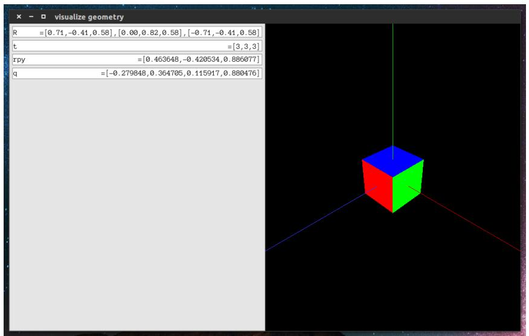

<details>
<summary>text_image</summary>

x - □ visualize geometry
R = [0.71, -0.41, 0.58], [0.00, 0.82, 0.58], [-0.71, -0.41, 0.58]
t = [3, 3, 3]
rpy = [0.463648, -0.420534, 0.886077]
q = [-0.279848, 0.364705, 0.115917, 0.880476]
</details>

图 3-4 旋转矩阵、欧拉角、四元数的可视化程序。

在写这个小程序中，我们在坐标原点放置一个彩色立方体。用鼠标可以平移/旋转相机。你可以实时地看到相机姿态的变化。我们显示了变换矩阵 R,t、欧拉角和四元数的三种姿态，你可以实验体验一下这几个量是如何变化的。然而根据我的经验，除了欧拉角之外，你应该看不出它们直观的含义。

该程序我们就不向读者解释源代码了，如果你感兴趣，可以自行查看。该程序的编译说明请参照它的 Readme.txt，我们在书籍正文中省略了。

值得一提的是，实际当中，我们至少定义两个坐标系：世界坐标系和相机坐标系。在该定义下，设某个点在世界坐标系中坐标为 $\mathbf { \nabla } _ { \pmb { p } _ { w } }$ ，在相机坐标系下为 $\scriptstyle { p _ { c } }$ ，那么：

$$
\boldsymbol {p} _ {c} = \boldsymbol {T} _ {c w} \boldsymbol {p} _ {w}, \tag {3.40}
$$

这里 $\mathbf { \delta } \mathbf { T } _ { c w }$ 表示世界坐标系到相机坐标系间的变换。或者我们可以用反过来的 $\mathbf { { { T } } } _ { w c }$ ：

$$
\boldsymbol {p} _ {w} = \boldsymbol {T} _ {w c} \boldsymbol {p} _ {c} = \boldsymbol {T} _ {c w} ^ {- 1} \boldsymbol {p} _ {c}. \tag {3.41}
$$

原则上， $\mathbf { \delta } \mathbf { T } _ { c w }$ 和 $\mathbf { \delta } \mathbf { T } _ { c w }$ 都可以用来表示相机的位姿，事实上它们也只差一个逆而已。实践当中使用 $\mathbf { \delta } \mathbf { T } _ { c w }$ 更加常见，而 $\mathbf { { { T } } } _ { w c }$ 更为直观。如果把上面两式的 $\pmb { p _ { c } }$ 取成零向量，也就是相机坐标系中的原点，那么，此时的 $\mathbf { \nabla } _ { \pmb { p } _ { w } }$ 就是相机原点在世界坐标系下的坐标：

$$
\boldsymbol {p} _ {w} = \boldsymbol {T} _ {w c} \boldsymbol {0} = \boldsymbol {t} _ {w c}. \tag {3.42}
$$

我们发现这正是 $\mathbf { \mathcal { T } } _ { w c }$ 的平移部分。因此，可以从 $\mathbf { { { T } } } _ { w c }$ 中直接看到相机在何处，这也是我们说 Twc 更为直观的原因。因此，在可视化程序里，我们显示了 $\mathbf { { { T } } } _ { w c }$ 而不是 $\mathbf { \delta } \mathbf { T } _ { c w }$ 。

## 习题

1. 验证旋转矩阵是正交矩阵。  
2. \* 寻找罗德里格斯公式的推导过程并理解它。  
3. 验证四元数旋转某个点后，结果是一个虚四元数（实部为零），所以仍然对应到一个三维空间点（式 3.34）。  
4. 画表总结旋转矩阵、轴角、欧拉角、四元数的转换关系。  
5. 假设我有一个大的 Eigen 矩阵，我想把它的左上角 $3 \times 3$ 的块取出来，然后赋值为$I _ { 3 \times 3 }$ 。请编程实现此事。  
6. \* 一般线程方程 $\boldsymbol { A } \boldsymbol { x } = \boldsymbol { b }$ 有哪几种做法？你能在 Eigen 中实现吗？  
7. 设有小萝卜一号和小萝卜二号位于世界坐标系中。小萝卜一号的位姿为： $\begin{array} { r l } { q _ { 1 } } & { { } = } \end{array}$ [0.35, 0.2, 0.3, 0.1], $t _ { 2 } ~ = ~ [ 0 . 3 , 0 . 1 , 0 . 1 ] ^ { T }$ （q 的第一项为实部。请你把 q 归一化后再进行计算）。这里的 q 和 t 表达的是 $\mathbf { \delta } \mathbf { T } _ { c w }$ ，也就是世界到相机的变换关系。小萝卜二号的位姿为 $\pmb { q } _ { 2 } = [ - 0 . 5 , 0 . 4 , - 0 . 1 , 0 . 2 ] , \pmb { t } = [ - 0 . 1 , 0 . 5 , 0 . 3 ] ^ { T }$ 。现在，小萝卜一号看到某个点在自身的坐标系下，坐标为 $\pmb { p } = [ 0 . 5 , 0 , 0 . 2 ] ^ { T }$ ，求该向量在小萝卜二号坐标系下的坐标。请编程实现此事。

## 第 4 讲

# 李群与李代数

## 本节目标

1. 理解李群与李代数的概念，掌握 SO(3), SE(3) 与对应李代数的表示方式。  
2. 理解 BCH 近似的意义。  
3. 学会在李代数上的扰动模型。  
4. 使用 Sophus 对李代数进行运算。

上一讲，我们介绍了三维世界中刚体运动的描述方式，包括旋转矩阵、旋转向量、欧拉角、四元数等若干种方式。我们重点介绍了旋转的表示，但是在 SLAM 中，除了表示之外，我们还要对它们进行估计和优化。因为在 SLAM 中位姿是未知的，而我们需要解决什么样的相机位姿最符合当前观测数据这样的问题。一种典型的方式是把它构建成一个优化问题，求解最优的 R,t，使得误差最小化。

如前所言，旋转矩阵自身是带有约束的（正交且行列式为 1）。它们作为优化变量时，会引入额外的约束，使优化变得困难。通过李群——李代数间的转换关系，我们希望把位姿估计变成无约束的优化问题，简化求解方式。由于读者可能还没有李群李代数的基本知识，我们将从最基本的开始讲起。

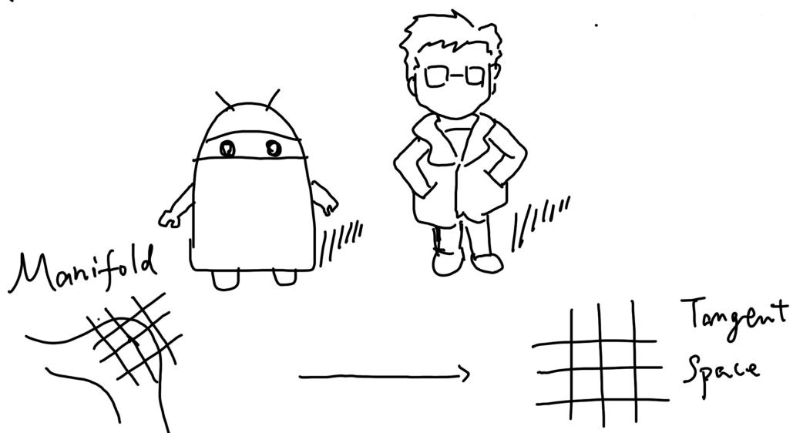

<details>
<summary>text_image</summary>

Manifold
Tangent
Space
</details>

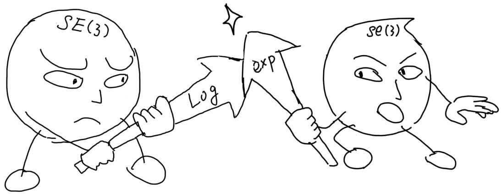

<details>
<summary>text_image</summary>

SE(3)
Log
exp
SE(3)
</details>

$$
T = \left[ \begin{array}{l l} R & t \\ 0 ^ {T} & 1 \end{array} \right] \in S E (3) \quad 3 = [ \rho , \phi ] ^ {\prime} e s e (3)
$$

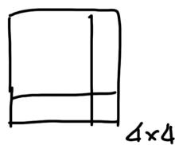

<details>
<summary>text_image</summary>

4×4
</details>

$$
\frac {\log (T) ^ {v} = 3}{\exp (3 ^ {1}) = T}
$$

$$
\left[ \begin{array}{l} 0 \\ 6 \times 1 \end{array} \right]
$$

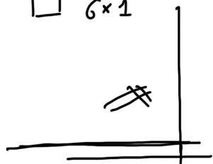

<details>
<summary>text_image</summary>

6×1
*
</details>

## 4.1 李群李代数基础

上一讲，我们介绍了旋转矩阵和变换矩阵的定义。当时，我们说三维旋转矩阵构成了特殊正交群 $S O ( 3 )$ ，而变换矩阵构成了特殊欧氏群 SE(3)：

$$
S O (3) = \{\boldsymbol {R} \in \mathbb {R} ^ {3 \times 3} | \boldsymbol {R} \boldsymbol {R} ^ {T} = \boldsymbol {I}, d e t (\boldsymbol {R}) = 1 \}. \tag {4.1}
$$

$$
S E (3) = \left\{\boldsymbol {T} = \left[ \begin{array}{c c} \boldsymbol {R} & \boldsymbol {t} \\ \boldsymbol {0} ^ {T} & 1 \end{array} \right] \in \mathbb {R} ^ {4 \times 4} | \boldsymbol {R} \in S O (3), \boldsymbol {t} \in \mathbb {R} ^ {3} \right\}. \tag {4.2}
$$

不过，当时我们并未详细解释群的含义。细心的读者会注意到，旋转矩阵也好，变换矩阵也好，它们对加法是不封闭的。换句话说，对于任意两个旋转矩阵 $R _ { 1 } , R _ { 2 }$ ，它们按照矩阵加法的定义，和不再是一个旋转矩阵：

$$
\boldsymbol {R} _ {1} + \boldsymbol {R} _ {2} \notin S O (3). \tag {4.3}
$$

对于变换矩阵亦是如此。我们发现，这两种矩阵并没有良好定义的加法，相对的，它们只有一种较好的运算：乘法。SO(3) 和 $S E ( 3 )$ 关于乘法是封闭的:

$$
\boldsymbol {R} _ {1} \boldsymbol {R} _ {2} \in S O (3), \quad \boldsymbol {T} _ {1} \boldsymbol {T} _ {2} \in S E (3). \tag {4.4}
$$

我们知道乘法对应着旋转或变换的复合——两个旋转矩阵相乘表示做了两次旋转。对于这种只有一个运算的集合，我们把它叫做群。

## 4.1.1 群

群（Group）是一种集合加上一种运算的代数结构。我们把集合记作 A，运算记作 ·，那么群可以记作 $G = ( A , \cdot )$ 。群要求这个运算满足以下几个条件：

1. 封闭性: $\forall a _ { 1 } , a _ { 2 } \in A , \quad a _ { 1 } \cdot a _ { 2 } \in A .$  
2. 结合律: $\forall a _ { 1 } , a _ { 2 } , a _ { 3 } \in A , \quad ( a _ { 1 } \cdot a _ { 2 } ) \cdot a _ { 3 } = a _ { 1 } \cdot ( a _ { 2 } \cdot a _ { 3 } ) .$ .  
3. 幺元: $\exists a _ { 0 } \in A , \quad s . t . \quad \forall a \in A , \quad a _ { 0 } \cdot a = a \cdot a _ { 0 } = a .$  
4. 逆: $\forall a \in A , \quad \exists a ^ { - 1 } \in A , \quad s . t . \quad a \cdot a ^ { - 1 } = a _ { 0 } .$ .

读者可以记作“封结幺逆”①。我们可以验证，旋转矩阵集合和矩阵乘法构成群，同样变换矩阵和矩阵乘法也构成群（因此才能称它们为旋转矩阵群和变换矩阵群）。其他常见的群包括整数的加法 (Z, +)，去掉 0 后的有理数的乘法（幺元为 1）(Q\0, ·) 等等。矩阵中常见的群有：

一般线性群 GL(n) 指 n × n 的可逆矩阵，它们对矩阵乘法成群。

特殊正交群 SO(n) 也就是所谓的旋转矩阵群，其中 $S O ( 2 )$ 和 SO(3) 最为常见。

特殊欧氏群 SE(n) 也就是前面提到的 n 维欧氏变换，如 $S E ( 2 )$ 和 SE(3)。

群结构保证了在群上的运算具有良好的性质，而群论则是研究群的各种结构和性质的理论，但我们在此不多加介绍。感兴趣的读者可以参考任意一本近世代数教材。

李群是指具有连续（光滑）性质的群。像整数群 Z 那样离散的群没有连续性质，所以不是李群。而 $S O ( n )$ 和 $S E ( n )$ ，它们在实数空间上是连续的。我们能够直观地想象一个刚体能够连续地在空间中运动，所以它们都是李群。由于 SO(3) 和 $S E ( 3 )$ 对于相机姿态估计尤其重要，我们主要讨论这两个李群。如果读者对李群的理论性质感兴趣，请参照 [20]。

下面，我们先从较简单的 $S O ( 3 )$ 开始讨论，我们将发现每个李群都有对应的李代数。我们首先引出 $S O ( 3 )$ 上面的李代数 so(3)。

## 4.1.2 李代数的引出

考虑任意旋转矩阵 R，我们知道它满足：

$$
\boldsymbol {R} \boldsymbol {R} ^ {T} = \boldsymbol {I}. \tag {4.5}
$$

现在，我们说，R 是某个相机的旋转，它会随时间连续地变化，即为时间的函数： $\mathbf { } R ( t )$ 。由于它仍是旋转矩阵，有

$$
\pmb {R} (t) \pmb {R} (t) ^ {T} = \pmb {I}.
$$

在等式两边对时间求导，得到：

$$
\dot {\boldsymbol {R}} (t) \boldsymbol {R} (t) ^ {T} + \boldsymbol {R} (t) \dot {\boldsymbol {R}} (t) ^ {T} = 0.
$$

整理得：

$$
\dot {\boldsymbol {R}} (t) \boldsymbol {R} (t) ^ {T} = - \left(\dot {\boldsymbol {R}} (t) \boldsymbol {R} (t) ^ {T}\right) ^ {T}. \tag {4.6}
$$

可以看出 ${ \dot { R } } ( t ) R ( t ) ^ { T }$ 是一个反对称矩阵。回忆之前，我们在式（3.3）介绍叉积时，引入了 ∧ 符号，将一个向量变成了反对称矩阵。同理，对于任意反对称矩阵，我们亦能找到一个与之对应的向量。把这个运算用符号 ∨ 表示：

$$
\boldsymbol {a} ^ {\wedge} = \boldsymbol {A} = \left[ \begin{array}{c c c} 0 & - a _ {3} & a _ {2} \\ a _ {3} & 0 & - a _ {1} \\ - a _ {2} & a _ {1} & 0 \end{array} \right], \quad \boldsymbol {A} ^ {\vee} = \boldsymbol {a}. \tag {4.7}
$$

于是，由于 ${ \dot { R } } ( t ) R ( t ) ^ { T }$ 是一个反对称矩阵，我们可以找到一个三维向量 $\phi ( t ) \in \mathbb { R } ^ { 3 }$ 与之对应。于是有：

$$
\dot {\boldsymbol {R}} (t) \boldsymbol {R} (t) ^ {T} = \phi (t) ^ {\wedge}.
$$

等式两边右乘 $\mathbf { } R ( t )$ ，由于 R 为正交阵，有：

$$
\dot {\boldsymbol {R}} (t) = \boldsymbol {\phi} (t) ^ {\wedge} \boldsymbol {R} (t) = \left[ \begin{array}{c c c} 0 & - \phi_ {3} & \phi_ {2} \\ \phi_ {3} & 0 & - \phi_ {1} \\ - \phi_ {2} & \phi_ {1} & 0 \end{array} \right] \boldsymbol {R} (t). \tag {4.8}
$$

可以看到，每对旋转矩阵求一次导数，只需左乘一个 $\phi ^ { \wedge } ( t )$ 矩阵即可。为方便讨论，我们设 $t _ { 0 } = 0$ ，并设此时旋转矩阵为 $\boldsymbol { R } ( 0 ) = \boldsymbol { I }$ 。按照导数定义，可以把 $\mathbf { } R ( t )$ 在 0 附近进行一阶泰勒展开：

$$
\begin{array}{l} \boldsymbol {R} (t) \approx \boldsymbol {R} \left(t _ {0}\right) + \dot {\boldsymbol {R}} \left(t _ {0}\right) \left(t - t _ {0}\right) \tag {4.9} \\ = \boldsymbol {I} + \phi (t _ {0}) ^ {\wedge} (t). \\ \end{array}
$$

我们看到 $\phi$ 反映了 R 的导数性质，故称它在 $S O ( 3 )$ 原点附近的正切空间 (TangentSpace) 上。同时在 $t _ { 0 }$ 附近，设 $\phi$ 保持为常数 $\phi ( t _ { 0 } ) = \phi _ { 0 }$ 。那么根据式（4.8），有

$$
\dot {\boldsymbol {R}} (t) = \phi (t _ {0}) ^ {\wedge} \boldsymbol {R} (t) = \phi_ {0} ^ {\wedge} \boldsymbol {R} (t).
$$

上式是一个关于 R 的微分方程，而且我们知道初始值 $\boldsymbol { R } ( 0 ) = \boldsymbol { I }$ ，解之，得：

$$
\boldsymbol {R} (t) = \exp \left(\phi_ {0} ^ {\wedge} t\right). \tag {4.10}
$$

读者可以验证上式对微分方程和初始值均成立。不过，由于做了一定的假设，所以它只在 $t = 0$ 附近有效。我们看到，旋转矩阵 R 与另一个反对称矩阵 $\phi _ { 0 }$ 通过指数关系发生了联系。也就是说，当我们知道某个时刻的 R 时，存在一个向量 $\phi$ ，它们满足这个矩阵指数关系。但是矩阵的指数是什么呢？这里我们有两个问题需要澄清：

1. 如果上式成立，那么给定某时刻的 R，我们就能求得一个 $\phi$ ，它描述了 R 在局部的导数关系。与 R 对应的 $\phi$ 有什么含义呢？后面会看到， $\phi$ 正是对应到 $S O ( 3 )$ 上的李代数 $\mathfrak { s o } ( 3 )$ ；

2. 其次，矩阵指数 $\exp ( \phi ^ { \wedge } )$ 如何计算？——事实上，这正是李群与李代数间的指数/对数映射。

下面我们一一加以介绍。

## 4.1.3 李代数的定义

每个李群都有与之对应的李代数。李代数描述了李群的局部性质。通用的李代数的定义如下：

李代数由一个集合 V，一个数域 F 和一个二元运算 [,] 组成。如果它们满足以下几条性质，称 $( \mathbb { V } , \mathbb { F } , [ , ] )$ 为一个李代数，记作 ${ \mathfrak { g } } .$ 。

1. 封闭性 $\forall X , Y \in \mathbb { V } , [ X , Y ] \in \mathbb { V } .$ .

2. 双线性 $\forall X , Y , Z \in \mathbb { V } , a , b \in \mathbb { F }$ , 有：

$$
[ a \boldsymbol {X} + b \boldsymbol {Y}, \boldsymbol {Z} ] = a [ \boldsymbol {X}, \boldsymbol {Z} ] + b [ \boldsymbol {Y}, \boldsymbol {Z} ], \quad [ \boldsymbol {Z}, a \boldsymbol {X} + b \boldsymbol {Y} ] = a [ \boldsymbol {Z}, \boldsymbol {X} ] + b [ \boldsymbol {Z}, \boldsymbol {Y} ].
$$

3. 自反性 ${ \mathfrak { O } } \quad \forall X \in \mathbb { V } , [ X , X ] = \mathbf { 0 } .$

4. 雅可比等价 $\forall X , Y , Z \in \mathbb { V } , [ X , [ Y , Z ] ] + [ Z , [ Y , X ] ] + [ Y , [ Z , X ] ] = \mathbf { 0 } .$

其中二元运算被称为李括号。从表面上来看，李代数所需要的性质还是挺多的。相比于群中的较为简单的二元运算，李括号表达了两个元素的差异。它不要求结合律，而要求元素和自己做李括号之后为零的性质。作为例子，三维向量 $\mathbb { R } ^ { 3 }$ 上定义的叉积 × 是一种李括号，因此 ${ \mathfrak { g } } = ( \mathbb { R } ^ { 3 } , \mathbb { R } , \times )$ 构成了一个李代数。读者可以尝试将叉积的性质代入到上面四条性质中。

## 4.1.4 李代数 so(3)

下面我们说，之前提到的 $\phi ,$ ，事实上是一种李代数。 $S O ( 3 )$ 对应的李代数是定义在 $\mathbb { R } ^ { 3 }$ 上的向量，我们记作 $\phi _ { \circ }$ 。根据前面的推导，每个 $\phi$ 都可以生成一个反对称矩阵：

$$
\boldsymbol {\Phi} = \boldsymbol {\phi} ^ {\wedge} = \left[ \begin{array}{c c c} 0 & - \phi_ {3} & \phi_ {2} \\ \phi_ {3} & 0 & - \phi_ {1} \\ - \phi_ {2} & \phi_ {1} & 0 \end{array} \right] \in \mathbb {R} ^ {3 \times 3}. \tag {4.11}
$$

在此定义下，两个向量 $\phi _ { 1 } , \phi _ { 2 }$ 的李括号为：

$$
\left[ \phi_ {1}, \phi_ {2} \right] = \left(\Phi_ {1} \Phi_ {2} - \Phi_ {2} \Phi_ {1}\right) ^ {\vee}. \tag {4.12}
$$

读者可以去验证该定义下的李括号满足上面的几条性质。由于 $\phi$ 与反对称矩阵关系很紧密，在不引起歧义的情况下，就说 so(3) 的元素是 3 维向量或者 3 维反对称矩阵，不加区别：

$$
\mathfrak {s o} (3) = \left\{\phi \in \mathbb {R} ^ {3}, \Phi = \phi^ {\wedge} \in \mathbb {R} ^ {3 \times 3} \right\}. \tag {4.13}
$$

至此，我们已清楚了 $\mathfrak { s o } ( 3 )$ 的内容。它们是一个由三维向量组成的集合，每个向量对应到一个反对称矩阵，可以表达旋转矩阵的导数。它与 SO(3) 的关系由指数映射给定：

$$
\boldsymbol {R} = \exp (\phi^ {\wedge}). \tag {4.14}
$$

指数映射会在稍后介绍。由于已经介绍了 $\mathfrak { s o } ( 3 )$ ，我们顺带先来看 $S E ( 3 )$ 上对应的李代数。

## 4.1.5 李代数 se(3)

对于 $S E ( 3 )$ ，它也有对应的李代数 $\mathfrak { s e } ( 3 )$ 。为省略篇幅，我们就不描述如何引出 $\mathfrak { s e } ( 3 )$ 号了。与 $\mathfrak { s o } ( 3 )$ 相似， $\mathfrak { s e } ( 3 )$ 位于 $\mathbb { R } ^ { 6 }$ 空间中：

$$
\mathfrak {s e} (3) = \left\{\boldsymbol {\xi} = \left[ \begin{array}{c} \boldsymbol {\rho} \\ \boldsymbol {\phi} \end{array} \right] \in \mathbb {R} ^ {6}, \boldsymbol {\rho} \in \mathbb {R} ^ {3}, \boldsymbol {\phi} \in \mathfrak {s o} (3), \boldsymbol {\xi} ^ {\wedge} = \left[ \begin{array}{c c} \boldsymbol {\phi} ^ {\wedge} & \boldsymbol {\rho} \\ \mathbf {0} ^ {T} & 0 \end{array} \right] \in \mathbb {R} ^ {4 \times 4} \right\}. \tag {4.15}
$$

我们把每个 $\mathfrak { s e } ( 3 )$ 元素记作 $\xi ,$ ，它是一个六维向量。前三维为平移，记作 $\rho ;$ ；后三维为旋转，记作 $\phi ,$ ，实质上是 $\mathfrak { s o } ( 3 )$ 元素①。同时，我们拓展了 ∧ 符号的含义。在 $\mathfrak { s e } ( 3 )$ 中，同样使用 ∧ 符号，将一个六维向量转换成四维矩阵，但这里不再表示反对称：

$$
\boldsymbol {\xi} ^ {\wedge} = \left[ \begin{array}{c c} \boldsymbol {\phi} ^ {\wedge} & \boldsymbol {\rho} \\ \mathbf {0} ^ {T} & 0 \end{array} \right] \in \mathbb {R} ^ {4 \times 4}. \tag {4.16}
$$

我们仍使用 ∧ 和 ∨ 符号来指代“从向量到矩阵”和“从矩阵到向量”的关系，以保持和 so(3) 上的一致性。读者可以简单地把 se(3) 理解成“由一个平移加上一个 so(3) 元素构成的向量”（尽管这里的 $\rho$ 还不直接是平移）。同样，李代数 se(3) 亦有类似于 so(3) 的李括号：

$$
[ \boldsymbol {\xi} _ {1}, \boldsymbol {\xi} _ {2} ] = (\boldsymbol {\xi} _ {1} ^ {\wedge} \boldsymbol {\xi} _ {2} ^ {\wedge} - \boldsymbol {\xi} _ {2} ^ {\wedge} \boldsymbol {\xi} _ {1} ^ {\wedge}) ^ {\vee}. \tag {4.17}
$$

读者可以验证它满足李代数的定义（留作习题）。至此我们已经见过两种重要的李代数 so(3) 和 se(3) 了。

## 4.2 指数与对数映射

## 4.2.1 SO(3) 上的指数映射

现在来考虑第二个问题： $\exp ( \phi ^ { \wedge } )$ 是如何计算的？它是一个矩阵的指数，在李群和李代数中，称为指数映射（Exponential Map）。同样，我们会先讨论 so(3) 的指数映射，再讨论 se(3) 的情形。

任意矩阵的指数映射可以写成一个泰勒展开，但是只有在收敛的情况下才会有结果，其结果仍是一个矩阵。

$$
\exp (\boldsymbol {A}) = \sum_ {n = 0} ^ {\infty} \frac {1}{n !} \boldsymbol {A} ^ {n}. \tag {4.18}
$$

同样地，对 so(3) 中任意一元素 $\phi$ ，我们亦可按此方式定义它的指数映射：

$$
\exp (\phi^ {\wedge}) = \sum_ {n = 0} ^ {\infty} \frac {1}{n !} (\phi^ {\wedge}) ^ {n}. \tag {4.19}
$$

我们来仔细推导一下这个定义。由于 $\phi$ 是三维向量，我们可以定义它的模长和它的方向，分别记作 θ 和 a，于是有 $\boldsymbol { \phi } = \theta \mathbf { a }$ 。这里 a 是一个长度为 1 的方向向量。首先，对于$\pmb { a } ^ { \wedge }$ ，有以下两条性质：

$$
\boldsymbol {a} ^ {\wedge} \boldsymbol {a} ^ {\wedge} = \boldsymbol {a} \boldsymbol {a} ^ {T} - \boldsymbol {I}, \tag {4.20}
$$

以及

$$
\boldsymbol {a} ^ {\wedge} \boldsymbol {a} ^ {\wedge} \boldsymbol {a} ^ {\wedge} = - \boldsymbol {a} ^ {\wedge}. \tag {4.21}
$$

读者可以自行验证上述性质。它们提供了处理 $\pmb { a } ^ { \wedge }$ 高阶项的方法。利用这两个性质，我

们可以把指数映射写成：

$$
\begin{array}{l} \exp \left(\boldsymbol {\phi} ^ {\wedge}\right) = \exp \left(\theta \boldsymbol {a} ^ {\wedge}\right) = \sum_ {n = 0} ^ {\infty} \frac {1}{n !} \left(\theta \boldsymbol {a} ^ {\wedge}\right) ^ {n} \\ = \boldsymbol {I} + \theta \boldsymbol {a} ^ {\wedge} + \frac {1}{2 !} \theta^ {2} \boldsymbol {a} ^ {\wedge} \boldsymbol {a} ^ {\wedge} + \frac {1}{3 !} \theta^ {3} \boldsymbol {a} ^ {\wedge} \boldsymbol {a} ^ {\wedge} \boldsymbol {a} ^ {\wedge} + \frac {1}{4 !} \theta^ {4} (\boldsymbol {a} ^ {\wedge}) ^ {4} + \dots \\ = \boldsymbol {a} \boldsymbol {a} ^ {T} - \boldsymbol {a} ^ {\wedge} \boldsymbol {a} ^ {\wedge} + \theta \boldsymbol {a} ^ {\wedge} + \frac {1}{2 !} \theta^ {2} \boldsymbol {a} ^ {\wedge} \boldsymbol {a} ^ {\wedge} - \frac {1}{3 !} \theta^ {3} \boldsymbol {a} ^ {\wedge} - \frac {1}{4 !} \theta^ {4} (\boldsymbol {a} ^ {\wedge}) ^ {2} + \dots \\ = \boldsymbol {a} \boldsymbol {a} ^ {T} + \left(\theta - \frac {1}{3 !} \theta^ {3} + \frac {1}{5 !} \theta^ {5} - \dots\right) \boldsymbol {a} ^ {\wedge} - \left(1 - \frac {1}{2 !} \theta^ {2} + \frac {1}{4 !} \theta^ {4} - \dots\right) \boldsymbol {a} ^ {\wedge} \boldsymbol {a} ^ {\wedge} \\ = \boldsymbol {a} ^ {\wedge} \boldsymbol {a} ^ {\wedge} + \boldsymbol {I} + \sin \theta \boldsymbol {a} ^ {\wedge} - \cos \theta \boldsymbol {a} ^ {\wedge} \boldsymbol {a} ^ {\wedge} \\ = (1 - \cos \theta) \boldsymbol {a} ^ {\wedge} \boldsymbol {a} ^ {\wedge} + \boldsymbol {I} + \sin \theta \boldsymbol {a} ^ {\wedge} \\ = \cos \theta \boldsymbol {I} + (1 - \cos \theta) \boldsymbol {a} \boldsymbol {a} ^ {T} + \sin \theta \boldsymbol {a} ^ {\wedge}. \\ \end{array}
$$

最后我们得到了一个似曾相识的式子：

$$
\exp (\theta \boldsymbol {a} ^ {\wedge}) = \cos \theta \boldsymbol {I} + (1 - \cos \theta) \boldsymbol {a} \boldsymbol {a} ^ {T} + \sin \theta \boldsymbol {a} ^ {\wedge}. \tag {4.22}
$$

回忆前一讲内容，它和罗德里格斯公式，即式（3.14）如出一辄。这表明，so(3) 实际上就是由所谓的旋转向量组成的空间，而指数映射即罗德里格斯公式。通过它们，我们把so(3) 中任意一个向量对应到了一个位于 SO(3) 中的旋转矩阵。反之，如果定义对数映射，我们也能把 SO(3) 中的元素对应到 so(3) 中：

$$
\boldsymbol {\phi} = \ln (\boldsymbol {R}) ^ {\vee} = \left(\sum_ {n = 0} ^ {\infty} \frac {(- 1) ^ {n}}{n + 1} (\boldsymbol {R} - \boldsymbol {I}) ^ {n + 1}\right) ^ {\vee}. \tag {4.23}
$$

不过我们通常不按照泰勒展开去计算对数映射。在第 3 讲中，我们已经介绍过如何根据旋转矩阵计算对应的李代数，即使用式（3.16），利用迹的性质分别求解转角和转轴，采用那种方式更加省事一些。

现在，我们介绍了指数映射的计算方法。读者可能会问，指数映射性质如何呢？是否对于任意的 R 都能找到一个唯一的 ϕ？很遗憾，指数映射只是一个满射。这意味着每个SO(3) 中的元素，都可以找到一个 so(3) 元素与之对应；但是可能存在多个 so(3) 中的元素，对应到同一个 SO(3)。至少对于旋转角 θ，我们知道多转 360 度和没有转是一样的—它具有周期性。但是，如果我们把旋转角度固定在 ±π 之间，那么李群和李代数元素是一一对应的。

$S O ( 3 )$ 与 so(3) 的结论似乎在我们意料之中。它和我们前面讲的旋转向量与旋转矩阵很相似，而指数映射即是罗德里格斯公式。旋转矩阵的导数可以由旋转向量指定，指导着如何在旋转矩阵中进行微积分运算。

## 4.2.2 SE(3) 上的指数映射

下面我们来介绍 se(3) 上的指数映射。为了节省篇幅，我们不再像 so(3) 那样详细推导指数映射。se(3) 上的指数映射形式如下：

$$
\exp \left(\boldsymbol {\xi} ^ {\wedge}\right) = \left[ \begin{array}{c c} \sum_ {n = 0} ^ {\infty} \frac {1}{n !} (\boldsymbol {\phi} ^ {\wedge}) ^ {n} & \sum_ {n = 0} ^ {\infty} \frac {1}{(n + 1) !} (\boldsymbol {\phi} ^ {\wedge}) ^ {n} \boldsymbol {\rho} \\ \mathbf {0} ^ {T} & 1 \end{array} \right] \tag {4.24}
$$

$$
\triangleq \left[ \begin{array}{c c} \boldsymbol {R} & \boldsymbol {J} \rho \\ \mathbf {0} ^ {T} & 1 \end{array} \right] = \boldsymbol {T}. \tag {4.25}
$$

如果你有耐心，可以照着 $\mathfrak { s o } ( 3 )$ 上的做法推导，把 exp 进行泰勒展开推导此式。从结果上看，ξ 的指数映射左上角的 R 是我们熟知的 $S O ( 3 )$ 中的元素，与 $\mathfrak { s e } ( 3 )$ 当中的旋转部分 $\phi$ 对应。而右上角的 J 则可整理为（设 $\boldsymbol \phi = \boldsymbol \theta \mathbf { a } )$ ）：

$$
\boldsymbol {J} = \frac {\sin \theta}{\theta} \boldsymbol {I} + \left(1 - \frac {\sin \theta}{\theta}\right) \boldsymbol {a} \boldsymbol {a} ^ {T} + \frac {1 - \cos \theta}{\theta} \boldsymbol {a} ^ {\wedge}. \tag {4.26}
$$

该式与罗德里格斯有些相似，但不完全一样。我们看到，平移部分经过指数映射之后，发生了一次以 J 为系数矩阵的线性变换。请读者重视这里的 J，因为我们后面还要用到它。

同样的，虽然我们也可以类比推得对数映射，不过根据变换矩阵 $\mathbf { T }$ 求 $\mathfrak { s o } ( 3 )$ 上的对应向量也有更省事的方式：从左上的 R 计算旋转向量，而右上的 t 满足：

$$
\boldsymbol {t} = \boldsymbol {J} \rho . \tag {4.27}
$$

由于 J 可以由 $\phi$ 得到，所以这里的 $\rho$ 亦可由此线性方程解得。现在，我们已经弄清了李群、李代数的定义与相互的转换关系，总结如图 4-1 所示。如果读者有哪里不明白，可以翻回去几页看看公式推导。

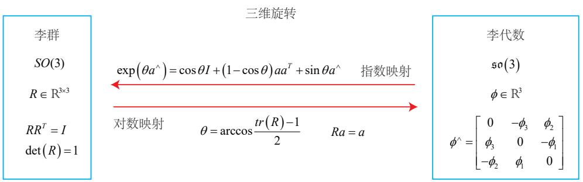

<details>
<summary>text_image</summary>

三维旋转
李群
SO(3)
R ∈ R³×³
RRᵀ = I
det(R) = 1
对数映射
exp(θa^) = cos θI + (1 - cos θ)aa^T + sin θa^
指数映射
θ = arccos tr(R) - 1 / 2
Ra = a
李代数
sσ(3)
φ ∈ R³
φ^ = [0 - φ₃ - φ₂]
φ₃ 0 - φ₁
-φ₂ φ₁ 0]
</details>

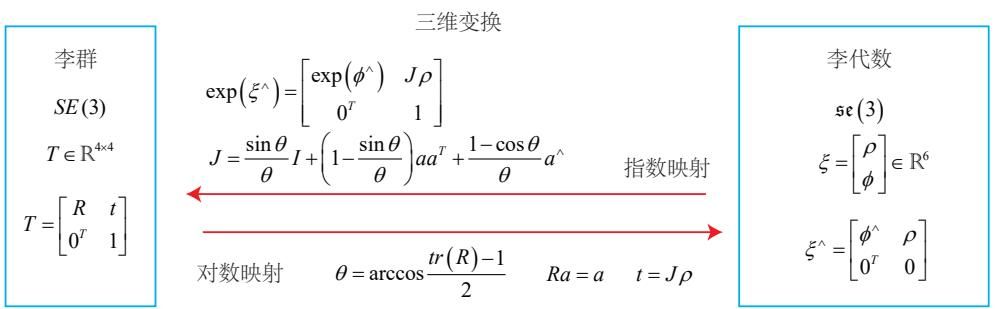

<details>
<summary>text_image</summary>

李群
SE(3)
T∈R⁴×⁴
T=\begin{bmatrix}R & t \\0^T & 1\end{bmatrix}
三维变换
exp(ξ^)=[exp(φ^) Jρ]
J = sinθ/θ I + (1 - sinθ)/θ aa^T + 1 - cosθ/θ a^T 指数映射
对数映射 θ = arccos tr(R)-1 / 2 Ra = a t = Jρ
李代数
se(3)
ξ = [ρ/φ] ∈ R^6
ξ^ = [φ^ ρ/0^T 0]
</details>

图 4-1 SO(3), SE(3), so(3), se(3) 的对应关系。

## 4.3 李代数求导与扰动模型

## 4.3.1 BCH 公式与近似形式

使用李代数的一大动机是为了进行优化，而在优化过程中导数是非常必要的信息（我们会在第六讲详细介绍）。下面我们来考虑一个问题。虽然我们已经清楚了 SO(3) 和 SE(3)上的李群与李代数关系，但是，当我们在 SO(3) 中完成两个矩阵乘法时，李代数中 so(3)上发生了什么改变呢？反过来说，当 so(3) 上做两个李代数的加法时，SO(3) 上是否对应着两个矩阵的乘积？如果成立的话，相当于：

$$
\exp \left(\phi_ {1} ^ {\wedge}\right) \exp \left(\phi_ {2} ^ {\wedge}\right) = \exp \left((\phi_ {1} + \phi_ {2}) ^ {\wedge}\right).
$$

如果 $\phi _ { 1 } , \phi _ { 2 }$ 为标量，那显然该式成立；但此处我们计算的是矩阵的指数函数，而非标量的指数。换言之，我们在研究下式是否成立：

$$
\ln \left(\exp (\boldsymbol {A}) \exp (\boldsymbol {B})\right) = \boldsymbol {A} + \boldsymbol {B}?
$$

很遗憾，该式在矩阵时并不成立。

两个李代数指数映射乘积的完整形式，由 Baker-Campbell-Hausdorff 公式（BCH 公式）①给出。由于它完整的形式较复杂，我们给出它展开式的前几项：

$$
\ln \left(\exp (\boldsymbol {A}) \exp (\boldsymbol {B})\right) = \boldsymbol {A} + \boldsymbol {B} + \frac {1}{2} [ \boldsymbol {A}, \boldsymbol {B} ] + \frac {1}{1 2} [ \boldsymbol {A}, [ \boldsymbol {A}, \boldsymbol {B} ] ] - \frac {1}{1 2} [ \boldsymbol {B}, [ \boldsymbol {A}, \boldsymbol {B} ] ] + \dots \tag {4.28}
$$

其中 [] 为李括号。BCH 公式告诉我们，当处理两个矩阵指数之积时，它们会产生一些由李括号组成的余项。特别地，考虑 SO(3) 上的李代数 $\ln \left( \exp { ( \phi _ { 1 } ^ { \wedge } ) } \exp { ( \phi _ { 2 } ^ { \wedge } ) } \right) ^ { \vee }$ ，当 $\phi _ { 1 }$ 或$\phi _ { 2 }$ 为小量时，小量二次以上的项都可以被忽略掉。此时，BCH 拥有线性近似表达：

$$
\ln \left(\exp \left(\phi_ {1} ^ {\wedge}\right) \exp \left(\phi_ {2} ^ {\wedge}\right)\right) ^ {\vee} \approx \left\{ \begin{array}{l l} J _ {l} (\phi_ {2}) ^ {- 1} \phi_ {1} + \phi_ {2} & \text { if } \phi_ {1} \text { is   small }, \\ J _ {r} (\phi_ {1}) ^ {- 1} \phi_ {2} + \phi_ {1} & \text { if } \phi_ {2} \text { is   small }. \end{array} \right. \tag {4.29}
$$

以第一个近似为例。该式告诉我们，当对一个旋转矩阵 $R _ { 2 }$ （李代数为 $\phi _ { 2 } )$ ）左乘一个微小旋转矩阵 $\scriptstyle { R _ { 1 } }$ （李代数为 $\phi _ { 1 } )$ ）时，可以近似地看作，在原有的李代数 $\phi _ { 2 }$ 上，加上了一项 $J _ { l } ( \phi _ { 2 } ) ^ { - 1 } \phi _ { 1 }$ 。同理，第二个近似描述了右乘一个微小位移的情况。于是，李代数在 BCH近似下，分成了左乘近似和右乘近似两种，在使用时我们须加注意，使用的是左乘模型还是右乘模型。

本书以左乘为例。左乘 BCH 近似雅可比 $J _ { l }$ 事实上就是式（4.26）的内容：

$$
\boldsymbol {J} _ {l} = \boldsymbol {J} = \frac {\sin \theta}{\theta} \boldsymbol {I} + \left(1 - \frac {\sin \theta}{\theta}\right) \boldsymbol {a} \boldsymbol {a} ^ {T} + \frac {1 - \cos \theta}{\theta} \boldsymbol {a} ^ {\wedge}. \tag {4.30}
$$

它的逆为：

$$
\boldsymbol {J} _ {l} ^ {- 1} = \frac {\theta}{2} \cot \frac {\theta}{2} \boldsymbol {I} + \left(1 - \frac {\theta}{2} \cot \frac {\theta}{2}\right) \boldsymbol {a} \boldsymbol {a} ^ {T} - \frac {\theta}{2} \boldsymbol {a} ^ {\wedge}. \tag {4.31}
$$

而右乘雅可比仅需要对自变量取负号即可：

$$
\boldsymbol {J} _ {r} (\phi) = \boldsymbol {J} _ {l} (- \phi). \tag {4.32}
$$

这样，我们就可以谈论李群乘法与李代数加法的关系了。为了方便读者理解，我们重新叙述一下 BCH 近似的意义。

假定对某个旋转 R，对应的李代数为 $\phi .$ 。我们给它左乘一个微小旋转，记作 $\Delta R$ ，对应的李代数为 $\Delta \phi$ 。那么，在李群上，得到的结果就是 $\Delta R \cdot R \cdot$ ，而在李代数上，根据 BCH近似，为： $J _ { l } ^ { - 1 } ( \phi ) \Delta \phi + \phi$ 。合并起来，可以简单地写成：

$$
\exp \left(\Delta \phi^ {\wedge}\right) \exp \left(\phi^ {\wedge}\right) = \exp \left(\left(\phi + \boldsymbol {J} _ {l} ^ {- 1} (\phi) \Delta \phi\right) ^ {\wedge}\right). \tag {4.33}
$$

反之，如果我们在李代数上进行加法，让一个 $\phi$ 加上 $\Delta \phi$ ，那么可以近似为李群上带左右雅可比的乘法：

$$
\exp \left((\phi + \Delta \phi) ^ {\wedge}\right) = \exp \left((J _ {l} \Delta \phi) ^ {\wedge}\right) \exp (\phi^ {\wedge}) = \exp (\phi^ {\wedge}) \exp \left((J _ {r} \Delta \phi) ^ {\wedge}\right). \tag {4.34}
$$

这将为之后李代数上的做微积分提供了理论基础。同样的，对于 $S E ( 3 )$ ，亦有类似的BCH 近似公式：

$$
\exp \left(\Delta \boldsymbol {\xi} ^ {\wedge}\right) \exp \left(\boldsymbol {\xi} ^ {\wedge}\right) \approx \exp \left(\left(\mathcal {J} _ {l} ^ {- 1} \Delta \boldsymbol {\xi} + \boldsymbol {\xi}\right) ^ {\wedge}\right), \tag {4.35}
$$

$$
\exp \left(\boldsymbol {\xi} ^ {\wedge}\right) \exp \left(\Delta \boldsymbol {\xi} ^ {\wedge}\right) \approx \exp \left(\left(\mathcal {J} _ {r} ^ {- 1} \Delta \boldsymbol {\xi} + \boldsymbol {\xi}\right) ^ {\wedge}\right). \tag {4.36}
$$

这里 $\mathcal { T } _ { l }$ 形式比较复杂，它是一个 $6 \times 6$ 的矩阵，读者可以参考 [6] 中式 (7.82) 和(7.83) 内容。由于我们在计算中不用到该雅可比，故这里略去它的实际形式。

## 4.3.2 SO(3) 李代数上的求导

下面我们来讨论一个带有李代数的函数，如何关于该李代数求导的问题。该问题有很强的实际背景。在 SLAM 中，我们要估计一个相机的位置和姿态，该位姿是由 SO(3) 上的旋转矩阵或 $S E ( 3 )$ 上的变换矩阵描述的。不妨设某个时刻小萝卜的位姿为 $\mathbf { T } \mathrm { ~ c ~ }$ 。它观察到了一个世界坐标位于 p 的点，产生了一个观测数据 $\boldsymbol { z } _ { \circ }$ 。那么，由坐标变换关系知：

$$
\boldsymbol {z} = \boldsymbol {T} \boldsymbol {p} + \boldsymbol {w}. \tag {4.37}
$$

然而，由于观测噪声 w 的存在，z 往往不可能精确地满足 $z = T p$ 的关系。所以，我们通常会计算理想的观测与实际数据的误差：

$$
\boldsymbol {e} = \boldsymbol {z} - \boldsymbol {T} \boldsymbol {p}. \tag {4.38}
$$

假设一共有 N 个这样的路标点和观测，于是就有 N 个上式。那么，对小萝卜的位姿

估计，相当于是寻找一个最优的 T，使得整体误差最小化：

$$
\min _ {\boldsymbol {T}} J (\boldsymbol {T}) = \sum_ {i = 1} ^ {N} \| \boldsymbol {z} _ {i} - \boldsymbol {T} \boldsymbol {p} _ {i} \| _ {2} ^ {2}. \tag {4.39}
$$

求解此问题，需要计算目标函数 J 关于变换矩阵 T 的导数。我们把具体的算法留到后面再讲。这里重点要说的是，我们经常会构建与位姿有关的函数，然后讨论该函数关于位姿的导数，以调整当前的估计值。然而，SO(3), SE(3) 上并没有良好定义的加法，它们只是群。如果我们把 T 当成一个普通矩阵来处理优化，那就必须对它加以约束。而从李代数角度来说，由于李代数由向量组成，具有良好的加法运算。因此，使用李代数解决求导问题的思路分为两种：

1. 用李代数表示姿态，然后对根据李代数加法来对李代数求导。

2. 对李群左乘或右乘微小扰动，然后对该扰动求导，称为左扰动和右扰动模型。

第一种方式对应到李代数的求导模型，而第二种则对应到扰动模型。下面我们来讨论这两种思路的异同。

## 4.3.3 李代数求导

首先，考虑 SO(3) 上的情况。假设我们对一个空间点 p 进行了旋转，得到了 Rp。现在，要计算旋转之后点的坐标相对于旋转的导数，我们不严谨地记为①：

$$
\frac {\partial \left(\boldsymbol {R} \boldsymbol {p}\right)}{\partial \boldsymbol {R}}.
$$

由于 SO(3) 没有加法，所以该导数无法按照导数的定义进行计算。设 R 对应的李代数为ϕ，我们转而计算：

$$
\frac {\partial \left(\exp \left(\phi^ {\wedge}\right) \boldsymbol {p}\right)}{\partial \phi}.
$$

按照导数的定义，有：

$$
\begin{array}{l} \frac {\partial \left(\exp \left(\phi^ {\wedge}\right) \boldsymbol {p}\right)}{\partial \phi} = \lim _ {\delta \phi \rightarrow 0} \frac {\exp \left(\left(\phi + \delta \phi\right) ^ {\wedge}\right) \boldsymbol {p} - \exp \left(\phi^ {\wedge}\right) \boldsymbol {p}}{\delta \phi} \\ = \lim _ {\delta \phi \rightarrow 0} \frac {\exp \left(\left(\boldsymbol {J} _ {l} \delta \phi\right) ^ {\wedge}\right) \exp \left(\phi^ {\wedge}\right) \boldsymbol {p} - \exp \left(\phi^ {\wedge}\right) \boldsymbol {p}}{\delta \phi} \\ \approx \lim _ {\delta \phi \rightarrow 0} \frac {\left(\boldsymbol {I} + (\boldsymbol {J} _ {l} \delta \phi) ^ {\wedge}\right) \exp (\phi^ {\wedge}) \boldsymbol {p} - \exp (\phi^ {\wedge}) \boldsymbol {p}}{\delta \phi} \\ = \lim _ {\delta \phi \rightarrow 0} \frac {\left(\boldsymbol {J} _ {l} \delta \phi\right) ^ {\wedge} \exp \left(\phi^ {\wedge}\right) \boldsymbol {p}}{\delta \phi} \\ = \lim _ {\delta \phi \rightarrow 0} \frac {- (\exp (\phi^ {\wedge}) \boldsymbol {p}) ^ {\wedge} \boldsymbol {J} _ {l} \delta \phi}{\delta \phi} = - (\boldsymbol {R p}) ^ {\wedge} \boldsymbol {J} _ {l}. \\ \end{array}
$$

第二行的近似为 BCH 线性近似，第三行为泰勒展开舍去高阶项后近似，第四行至第五行将反对称符号看作叉积，交换之后变号。于是，我们推导了旋转后的点相对于李代数的导数：

$$
\frac {\partial (\boldsymbol {R} \boldsymbol {p})}{\partial \phi} = (- \boldsymbol {R} \boldsymbol {p}) ^ {\wedge} \boldsymbol {J} _ {l}. \tag {4.40}
$$

不过，由于这里仍然含有形式比较复杂的 $J _ { l }$ ，我们不太希望计算它。而下面要讲的扰动模型则提供了更简单的导数计算方式。

## 4.3.4 扰动模型（左乘）

另一种求导方式，是对 R 进行一次扰动 $\Delta R _ { \mathrm { { c } } }$ 。这个扰动可以乘在左边也可以乘在右边，最后结果会有一点儿微小的差异，我们以左扰动为例。设左扰动 $\Delta R$ 对应的李代数为$\varphi _ { \mathrm { c } }$ 。然后，对 $\varphi$ 求导，即：

$$
\frac {\partial (\boldsymbol {R} \boldsymbol {p})}{\partial \varphi} = \lim _ {\varphi \rightarrow 0} \frac {\exp (\varphi^ {\wedge}) \exp (\phi^ {\wedge}) \boldsymbol {p} - \exp (\phi^ {\wedge}) \boldsymbol {p}}{\varphi}. \tag {4.41}
$$

该式的求导比上面更为简单：

$$
\begin{array}{l} \frac {\partial (\boldsymbol {R p})}{\partial \varphi} = \lim _ {\varphi \rightarrow 0} \frac {\exp (\varphi^ {\wedge}) \exp (\phi^ {\wedge}) \boldsymbol {p} - \exp (\phi^ {\wedge}) \boldsymbol {p}}{\varphi} \\ \approx \lim _ {\varphi \to 0} \frac {(1 + \varphi^ {\wedge}) \exp (\phi^ {\wedge}) \boldsymbol {p} - \exp (\phi^ {\wedge}) \boldsymbol {p}}{\varphi} \\ = \lim _ {\varphi \rightarrow 0} \frac {\varphi^ {\wedge} R p}{\varphi} = \lim _ {\varphi \rightarrow 0} \frac {- (R p) ^ {\wedge} \varphi}{\varphi} = - (R p) ^ {\wedge}. \\ \end{array}
$$

可见，扰动模型相比于直接对李代数求导，省去了一个雅可比 $J _ { l }$ 的计算。这使得扰动模型更为实用。请读者务必理解这里的求导运算，这在位姿估计当中具有重要的意义。

## 4.3.5 SE(3) 上的李代数求导

最后，我们给出 SE(3) 上的扰动模型，而直接李代数上的求导就不再介绍了。假设某空间点 p 经过一次变换 T（对应李代数为 ξ），得到 $\pmb { T p } ^ { \textregistered }$ 。现在，给 T 左乘一个扰动$\Delta T = \exp { ( \delta \pmb { \xi } ^ { \wedge } ) }$ ，我们设扰动项的李代数为 $\delta \pmb { \xi } = [ \delta \pmb { \rho } , \delta \phi ] ^ { T }$ ，那么：

$$
\begin{array}{l} \frac {\partial (\boldsymbol {T} \boldsymbol {p})}{\partial \delta \boldsymbol {\xi}} = \lim _ {\delta \boldsymbol {\xi} \rightarrow \mathbf {0}} \frac {\exp (\delta \boldsymbol {\xi} ^ {\wedge}) \exp (\boldsymbol {\xi} ^ {\wedge}) \boldsymbol {p} - \exp (\boldsymbol {\xi} ^ {\wedge}) \boldsymbol {p}}{\delta \boldsymbol {\xi}} \\ \approx \lim _ {\delta \boldsymbol {\xi} \rightarrow \mathbf {0}} \frac {\left(\boldsymbol {I} + \delta \boldsymbol {\xi} ^ {\wedge}\right) \exp \left(\boldsymbol {\xi} ^ {\wedge}\right) \boldsymbol {p} - \exp \left(\boldsymbol {\xi} ^ {\wedge}\right) \boldsymbol {p}}{\delta \boldsymbol {\xi}} \\ = \lim _ {\delta \boldsymbol {\xi} \rightarrow \mathbf {0}} \frac {\delta \boldsymbol {\xi} ^ {\wedge} \exp (\boldsymbol {\xi} ^ {\wedge}) \boldsymbol {p}}{\delta \boldsymbol {\xi}} \\ = \lim _ {\delta \boldsymbol {\xi} \to \mathbf {0}} \frac {\left[ \begin{array}{c c} \delta \phi^ {\wedge} & \delta \boldsymbol {\rho} \\ \mathbf {0} ^ {T} & 0 \end{array} \right] \left[ \begin{array}{c} \boldsymbol {R p} + \boldsymbol {t} \\ 1 \end{array} \right]}{\delta \boldsymbol {\xi}} \\ = \lim _ {\delta \boldsymbol {\xi} \to \mathbf {0}} \frac {\left[ \begin{array}{c} \delta \phi^ {\wedge} (\boldsymbol {R p} + \boldsymbol {t}) + \delta \boldsymbol {\rho} \\ 0 \end{array} \right]}{\delta \boldsymbol {\xi}} = \left[ \begin{array}{c c} \boldsymbol {I} & - (\boldsymbol {R p} + \boldsymbol {t}) ^ {\wedge} \\ \mathbf {0} ^ {T} & \mathbf {0} ^ {T} \end{array} \right] \triangleq (\boldsymbol {T p}) ^ {\odot}. \\ \end{array}
$$

我们把最后的结果定义成一个算符 ⊙②，它把一个齐次坐标的空间点变换成一个 $4 \times 6$ 的矩阵。

至此，我们已经介绍了李群李代数上的微分运算。之后的章节中，我们将应用这些知识去解决实际问题。关于李群李代数的某些重要数学性质，我们作为习题留给读者。

## 4.4 实践：Sophus

我们已经介绍了李代数的入门知识，现在是通过实践演练巩固一下所学知识的机会了。我们来讨论如何在程序中操作李代数。在第三讲中，我们看到 Eigen 提供了几何模块，但没有提供李代数的支持。一个较好的李代数库是 Strasdat 维护的 Sophus 库①。Sophus 库支持本章主要讨论的 SO(3) 和 SE(3)，此外还含有二维运动 SO(2), SE(2) 以及相似变换Sim(3) 的内容。它是直接在 Eigen 基础上开发的，我们不需要要安装额外的依赖库。读者可以直接从 github 上获取 Sophus②，或者，在本书的代码目录 slambook/3rdparty 下也提供了 Sophus 源代码。由于历史原因，Sophus 早期版本只提供了双精度的李群/李代数类。后续版本改写成了模板类。模板类的 Sophus 中可以使用不同精度的李群/李代数，但同时增加了使用难度。本书使用非模板的 Sophus 库。如果读者准备使用 github 上的 Sophus，请确保使用的是非模板的版本。你可以输入以下命令获得非模板类的 Sophus：

```txt
1 git clone https://github.com/strasdat/Sophus.git
2 cd Sophus
3 git checkout a621ff
```

本书的 3rdparty 中提供的 Sophus 也是非模板版本。Sophus 本身亦是一个 cmake 工程。想必你已经了解如何编译 cmake 工程了，我们就不再赘述。Sophus 库只须编译即可，无须安装。

下面我们来演示一下 Sophus 库中的 SO(3) 和 SE(3) 运算：

slambook/ch4/useSophus/useSophus.cpp:  
```cpp
#include <iostream>
#include <cmath>
using namespace std;

#include <Eigen/Core>
#include <Eigen/Geometry>

#include "sophus/so3.h"
#include "sophus/se3.h"

int main(int argc, char** argv)
{
    // 沿 Z 轴转 90 度的旋转矩阵
    Eigen::Matrix3d R = Eigen::AngleAxisd(M_PI/2, Eigen::Vector3d(0,0,1)).toRotationMatrix();
```

①最早提出李代数的是 Sophus Lie，这个库就以他的名字命名了。  
②https://github.com/strasdat/Sophus

```cpp
Sophus::S03 S03_R(R); // Sophus::S0(3)可以直接从旋转矩阵构造
Sophus::S03 S03_v(0, 0, M_PI/2); // 亦可从旋转向量构造
Eigen::Quaterniond q(R); // 或者四元数
Sophus::S03 S03_q(q);
// 上述表达方式都是等价的
// 输出 S0(3) 时，以 so(3) 形式输出
cout<<"S0(3) from matrix: "<<S03_R<<endl;
cout<<"S0(3) from vector: "<<S03_v<<endl;
cout<<"S0(3) from quaternion :"<<S03_q<<endl;

// 使用对数映射获得它的李代数
Eigen::Vector3d so3 = S03_R.log();
cout<<"so3 = "<<so3.transpose()<<endl;
// hat 为向量到反对称矩阵
cout<<"so3 hat="<<Sophus::S03::hat(so3)<<endl;
// 相对的，vee 为反对称到向量
cout<<"so3 hat vee= "<<Sophus::S03::vee(Sophus::S03::hat(so3)).transpose()<<endl;

// 增量扰动模型的更新
Eigen::Vector3d update_so3(1e-4, 0, 0); // 假设更新量有这么多
Sophus::S03 S03_updated = Sophus::S03::exp(update_so3)*S03_R; // 左乘更新
cout<<"S03 updated = "<<S03_updated<<endl;

/****************************** 萌萌的分割线 **************************/
cout<<"****************************** 我是分割线 **************************"<<endl;
// 对 SE(3) 操作大同小异
Eigen::Vector3d t(1,0,0); // 沿 X 轴平移1
Sophus::SE3 SE3_Rt(R, t); // 从 R, t 构造SE(3)
Sophus::SE3 SE3_qt(q,t); // 从 q,t 构造SE(3)
cout<<"SE3 from R,t= "<<endl<<SE3_Rt<<endl;
cout<<"SE3 from q,t= "<<endl<<SE3_qt<<endl;
// 李代数 se(3) 是一个六维向量，方便起见先 typedef 一下
typedef Eigen::Matrix<double,6,1> Vector6d;
Vector6d se3 = SE3_Rt.log();
cout<<"se3 = "<<se3.transpose()<<endl;
// 观察输出，会发现在 Sophus 中，se(3) 平移在前，旋转在后。与我们的书是一致的。
// 同样的，有 hat 和 vee 两个算符
cout<<"se3 hat = "<<endl<<Sophus::SE3::hat(se3)<<endl;
cout<<"se3 hat vee = "<<Sophus::SE3::vee(Sophus::SE3::hat(se3)).transpose()<<endl;

// 最后，演示一下更新
Vector6d update_se3; // 更新量
update_se3.setZero();
update_se3(0,0) = 1e-4d;
Sophus::SE3 SE3_updated = Sophus::SE3::exp(update_se3)*SE3_Rt;
cout<<"SE3 updated = "<<endl<<SE3_updated.matrix()<<endl;

return 0;
}
```

该演示程序为分两部分。前半部分介绍 SO(3) 上的操作，后半部分则为 SE(3)。我们演示了如何构造 SO(3), SE(3) 对象，对它们进行指数、对数映射，以及当知道更新量后，如何对李群元素进行更新。如果读者切实理解了本章内容，那么这个程序对你来说应该没有什么难度。为了编译它，请在 CMakeLists.txt 里添加以下几行：

slambook/ch4/useSophus/CMakeLists.txt  
```cmake
# 为使用 sophus，需要使用 find_package 命令找到它
find_package( Sophus REQUIRED )
include_directories( ${Sophus_INCLUDE_DIRS} )
add_executable( useSophus useSophus.cpp )
target_link_libraries( useSophus ${Sophus_LIBRARIES} )
```

find\_package 命令是 cmake 提供的寻找某个库的头文件与库文件的指令。如果 cmake能够找到它，就会提供头文件和库文件所在的目录的变量。在 Sophus 这个例子中，就是Sophus\_INCLUDE\_DIRS 和 Sophus\_LIBRARIES 这两个变量。根据它们，我们就能将Sophus 库引入自己的 cmake 工程了。请读者自行查看此程序的输出信息，它与我们之前的推导是一致的。，，

## 的推导是一致的。 4.5 \* 相似变换群与李代数

最后，我们要提一下在单目视觉中使用的相似变换群 Sim(3)，以及对应的李代数sim(3)。如果你只对双目 SLAM 或 RGBD SLAM 感兴趣，可以跳过本节。

我们已经介绍过单目的尺度不确定性。如果在单目 SLAM 中使用 SE(3) 表示位姿，那么由于尺度不确定性与尺度漂移，整个 SLAM 过程中的尺度会发生变化，这在 SE(3) 中未能体现出来。因此，在单目情况下我们一般会显式地把尺度因子表达出来。用数学语言来说，对于位于空间的点 p，在相机坐标系下要经过一个相似变换，而非欧氏变换：

$$
\boldsymbol {p} ^ {\prime} = \left[ \begin{array}{l l} s \boldsymbol {R} & \boldsymbol {t} \\ \boldsymbol {0} ^ {T} & 1 \end{array} \right] \boldsymbol {p} = s \boldsymbol {R} \boldsymbol {p} + \boldsymbol {t}. \tag {4.42}
$$

在相似变换中，我们把尺度 s 表达了出来。它同时作用在 p 的三个坐标之上，对 p 进行了一次缩放。与 SO(3)、SE(3) 相似，相似变换亦对矩阵乘法构成群，称为相似变换群 Sim(3)：

$$
\operatorname{Sim} (3) = \left\{\left[ \begin{array}{c c c} \boldsymbol {S} = & s \boldsymbol {R} & \boldsymbol {t} \\ & \boldsymbol {0} ^ {T} & 1 \end{array} \right] \in \mathbb {R} ^ {4 \times 4} \right\}. \tag {4.43}
$$

同样地，Sim(3) 也有对应的李代数、指数映射、对数映射等等。李代数 sim(3) 元素

是一个七维向量 $\zeta _ { \circ }$ 。它的前六维与 $\mathfrak { s e } ( 3 )$ 相同，最后多了一项 $\sigma$ 。

$$
\mathfrak {s i m} (3) = \left\{\boldsymbol {\zeta} | \boldsymbol {\zeta} = \left[ \begin{array}{c} \boldsymbol {\rho} \\ \boldsymbol {\phi} \\ \sigma \end{array} \right] \in \mathbb {R} ^ {7}, \boldsymbol {\zeta} ^ {\wedge} = \left[ \begin{array}{c c} \sigma \boldsymbol {I} + \boldsymbol {\phi} ^ {\wedge} & \boldsymbol {\rho} \\ \boldsymbol {0} ^ {T} & 0 \end{array} \right] \in \mathbb {R} ^ {4 \times 4} \right\}. \tag {4.44}
$$

它比 $\mathfrak { s e } ( 3 )$ 多了一项 $\sigma _ { \circ }$ 。关联 $S i m ( 3 )$ 和 sim(3) 的仍是指数映射和对数映射。指数映射为：

$$
\exp \left(\boldsymbol {\zeta} ^ {\wedge}\right) = \left[ \begin{array}{c c} e ^ {\sigma} \exp \left(\boldsymbol {\phi} ^ {\wedge}\right) & \boldsymbol {J} _ {s} \boldsymbol {\rho} \\ \boldsymbol {0} ^ {T} & 1 \end{array} \right]. \tag {4.45}
$$

其中 $J _ { s }$ 形式为：

$$
\begin{array}{l} \boldsymbol {J} _ {s} = \frac {e ^ {\sigma} - 1}{\sigma} \boldsymbol {I} + \frac {\sigma e ^ {\sigma} \sin \theta + (1 - e ^ {\sigma} \cos \theta) \theta}{\sigma^ {2} + \theta^ {2}} \boldsymbol {a} ^ {\wedge} \\ + \left(\frac {e ^ {\sigma} - 1}{\sigma} - \frac {(e ^ {\sigma} \cos \theta - 1) \sigma + (e ^ {\sigma} \sin \theta) \theta}{\sigma^ {2} + \theta^ {2}}\right) \pmb {a} ^ {\wedge} \pmb {a} ^ {\wedge}. \\ \end{array}
$$

通过指数映射，我们能够找到李代数与李群的关系。对于李代数元素 $\zeta :$ ，它与李群的对应关系为：

$$
s = e ^ {\sigma}, \boldsymbol {R} = \exp (\phi^ {\wedge}), \boldsymbol {t} = \boldsymbol {J} _ {s} \boldsymbol {\rho}. \tag {4.46}
$$

旋转部分和 SO(3) 是一致的。平移部分，在 $\mathfrak { s e } ( 3 )$ 中需要乘一个雅可比 $\mathcal { I }$ ，而相似变换的雅可比更复杂一些。对于尺度因子，可以看到李群中的 s 即为李代数中 $\sigma$ 的指数函数。

$S i m ( 3 )$ 的 BCH 近似与 $S E ( 3 )$ 是类似的。我们可以讨论一个点 $\pmb { p }$ 经过相似变换 $S p$ 后，相对于 $\pmb { S }$ 的导数。同样的，存在微分模型和扰动模型两种方式，而扰动模型较为简单。我们省略推导过程，直接给出扰动模型的结果。设给予 $S p$ 左侧一个小扰动 $\exp ( \xi ^ { \wedge } )$ ，并求 $S p$ 对于扰动的导数。因为 $S p$ 四维的齐次坐标， $\zeta$ 是七维向量，该导数应该是 $4 \times 7$ 的雅可比。为了方便起见，记 $S p$ 的前三维组成向量 $^ { q , }$ ，那么：

$$
\frac {\partial \boldsymbol {S} \boldsymbol {p}}{\partial \boldsymbol {\zeta}} = \left[ \begin{array}{c c c} \boldsymbol {I} & - \boldsymbol {q} ^ {\wedge} & \boldsymbol {q} \\ \mathbf {0} ^ {T} & \mathbf {0} ^ {T} & 0 \end{array} \right]. \tag {4.47}
$$

关于 $S i m ( 3 )$ ，我们就介绍到这里。更详细关于 Sim(3) 的资料，建议读者参见 [21]。

## 4.6 小结

本讲引入了李群 SO(3) 和 SE(3)，以及它们对应的李代数 so(3) 和 se(3)。我们介绍了位姿在它们上面的表达和转换，然后通过 BCH 的线性近似，我们可以对位姿进行求导和扰动了。这给之后讲解位姿的优化打下了理论基础，因为我们需要经常的对某一个位姿的估计值进行调整，使它对应的误差减小。只有在弄清楚如何对位姿进行调整和更新之后，我们才能继续下一步的内容。

可能本讲的内容比较的偏理论化，毕竟它不像计算机视觉那样经常有好看的图片可以展示。相比于讲解李群李代数的数学书，由于我们只关心实用的内容，所以讲的内容非常精简，速度相对快了一些。请读者务必理解本章内容，它是解决后续许多问题的基础，特别是位姿估计部分。

## 习题

1. 验证 SO(3)、SE(3) 和 Sim(3) 关于乘法成群。  
2. 验证 (R3,R,×) 构成李代数。  
3. 验证 so(3) 和 se(3) 满足李代数要求的性质。  
4. 验证性质 (4.20) 和 (4.21)。  
5. 证明：

$$
\boldsymbol {R} \boldsymbol {p} ^ {\wedge} \boldsymbol {R} ^ {T} = (\boldsymbol {R} \boldsymbol {p}) ^ {\wedge}.
$$

6. 证明：

$$
\pmb {R} \exp (\pmb {p} ^ {\wedge}) \pmb {R} ^ {T} = \exp ((\pmb {R p}) ^ {\wedge}).
$$

该式称为 SO(3) 上的伴随性质。同样的，在 SE(3) 上亦有伴随性质：

$$
\boldsymbol {T} \exp (\boldsymbol {\xi} ^ {\wedge}) \boldsymbol {T} ^ {- 1} = \exp \left((\operatorname{Ad} (\boldsymbol {T}) \boldsymbol {\xi}) ^ {\wedge}\right), \tag {4.48}
$$

其中：

$$
\operatorname{Ad} (\boldsymbol {T}) = \left[ \begin{array}{c c} \boldsymbol {R} & \boldsymbol {t} ^ {\wedge} \boldsymbol {R} \\ \boldsymbol {0} & \boldsymbol {R} \end{array} \right]. \tag {4.49}
$$

7. 仿照左扰动的推导，推导 SO(3) 和 SE(3) 在右扰动下的导数。  
8. 搜索 cmake 的 find\_package 指令是如何运作的。它有哪些可选的参数？为了让cmake 找到某个库，需要哪些先决条件？

## 第 5 讲

# 相机与图像

## 本节目标

1. 理解针孔相机的模型、内参与径向畸变参数。  
2. 理解一个空间点是如何投影到相机成像平面的。  
3. 掌握 OpenCV 的图像存储与表达方式。  
4. 学会基本的摄像头标定方法。

前面两讲中，我们介绍了“机器人如何表示自身位姿”的问题，部分地解释了 SLAM经典模型中变量的含义和运动方程部分。本讲，我们要讨论“机器人如何观测外部世界”，也就是观测方程部分。而在以相机为主的视觉 SLAM 中，观测主要是指相机成像的过程。

我们在现实生活中能看到大量的照片。在计算机中，一张照片由很多个像素组成，每个像素记录了色彩或亮度的信息。三维世界中的一个物体反射或发出的光线，穿过相机光心后，投影在相机的成像平面上。相机的感光器件接收到光线后，产生了测量值，就得到了像素，形成了我们见到的照片。这个过程能否用数学原理来描述呢？本讲，我们首先讨论相机模型，说明投影关系具体如何描述，相机的内参是什么。同时，简单介绍双目成像与 RGB-D 相机的原理。然后，介绍二维照片像素的基本操作。最后，我们根据内外参数的含义，演示一个点云拼接的实验。

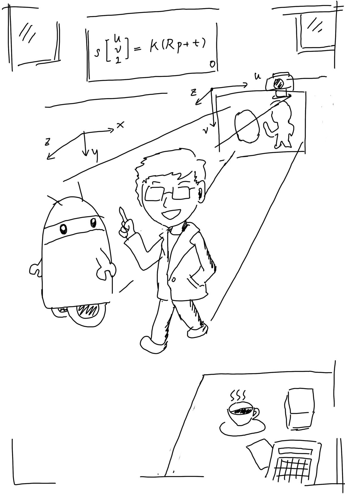

<details>
<summary>text_image</summary>

s[u/v]=K(Rp+t)
z
y
x
u
v
SSS
</details>

## 5.1 相机模型

相机将三维世界中的坐标点（单位为米）映射到二维图像平面（单位为像素）的过程能够用一个几何模型进行描述。这个模型有很多种，其中最简单的称为针孔模型。针孔模型是很常用，而且有效的模型，它描述了一束光线通过针孔之后，在针孔背面投影成像的关系。在本书中我们用一个简单的针孔相机模型来对这种映射关系进行建模。同时，由于相机镜头上的透镜的存在，会使得光线投影到成像平面的过程中会产生畸变。因此，我们使用针孔和畸变两个模型来描述整个投影过程。

在本节我们先给出相机的针孔模型，再对透镜的畸变模型进行讲解。这两个模型能够把外部的三维点投影到相机内部成像平面，构成了相机的内参数。

## 5.1.1 针孔相机模型

在初中物理课堂上，我们可能都见过一个蜡烛投影实验：在一个暗箱的前方放着一支点燃的蜡烛，蜡烛的光透过暗箱上的一个小孔投影在暗箱的后方平面上，并在这个平面上形成了一个倒立的蜡烛图像。在这个过程中，小孔模型能够把三维世界中的蜡烛投影到一个二维成像平面。同理，我们可以用这个简单的模型来解释相机的成像过程。如图 5-1 所示。

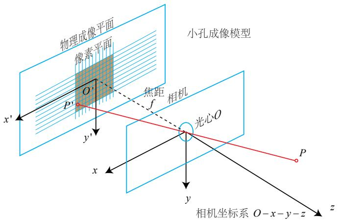

<details>
<summary>text_image</summary>

物理成像平面
像素平面
小孔成像模型
x'
O
P'
y'
相机
f
焦距
光心O
x
y
P
相机坐标系 O-x-y-z
z
</details>

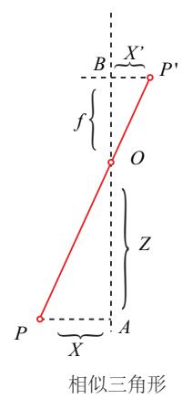

<details>
<summary>text_image</summary>

B
X'
P'
f
O
Z
P
X
A
相似三角形
</details>

图 5-1 针孔相机模型

现在来对这个简单的针孔模型进行几何建模。设 $O - x - y - z$ 为相机坐标系，习惯上我们让 z 轴指向相机前方，x 向右，y 向下。O 为摄像机的光心，也是针孔模型中的针孔。现实世界的空间点 P，经过小孔 O 投影之后，落在物理成像平面 $O ^ { \prime } - x ^ { \prime } - y ^ { \prime }$ 上，成像点为 $P ^ { \prime } _ { \mathrm { ~ \it ~ \it ~ \it ~ \Omega ~ } }$ 。设 P 的坐标为 $[ X , Y , Z ] ^ { T }$ ， $P ^ { \prime }$ 为 $[ X ^ { \prime } , Y ^ { \prime } , Z ^ { \prime } ] ^ { T }$ ，并且设物理成像平面到小孔的距离为 f（焦距）。那么，根据三角形相似关系，有：

$$
\frac {Z}{f} = - \frac {X}{X ^ {\prime}} = - \frac {Y}{Y ^ {\prime}}. \tag {5.1}
$$

其中负号表示成的像是倒立的。为了简化模型，我们把可以成像平面对称到相机前方，和三维空间点一起放在摄像机坐标系的同一侧，如图 5-2 中间的样子所示。这样做可以把公式中的负号去掉，使式子更加简洁：

$$
\frac {Z}{f} = \frac {X}{X ^ {\prime}} = \frac {Y}{Y ^ {\prime}}. \tag {5.2}
$$

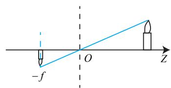

<details>
<summary>text_image</summary>

-f
O
Z
</details>

真实成像平面

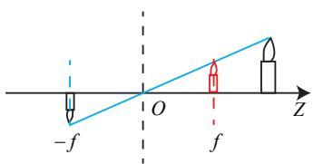

<details>
<summary>text_image</summary>

-f
O
f
Z
</details>

对称的成像平面

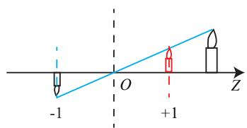

<details>
<summary>text_image</summary>

-1
O
+1
Z
</details>

归一化成像平面  
图 5-2 真实成像平面，对称成像平面，归一化成像平面的图示。

整理得：

$$
X ^ {\prime} = f \frac {X}{Z}. \tag {5.3}
$$

$$
Y ^ {\prime} = f \frac {Y}{Z}
$$

读者可能要问，为什么我们可以看似随意地把成像平面挪到前方呢？这只是我们处理真实世界与相机投影的数学手段，并且，大多数相机输出的图像并不是倒像——相机自身的软件会帮你翻转这张图像，所以你看到的一般是正着的像，也就是对称的成像平面上的像。所以，尽管从物理原理来说，小孔成像应该是倒像，但由于我们对图像作了预处理，所以理解成在对称平面上的像，并不会带来什么坏处。于是，在不引起歧义的情况下，我们也不加限制地称后一种情况为针孔模型。

式（5.3）描述了点 P 和它的像之间的空间关系。不过，在相机中，我们最终获得的是一个个的像素，这需要在成像平面上对像进行采样和量化。为了描述传感器将感受到的光线转换成图像像素的过程，我们设在物理成像平面上固定着一个像素平面 $o - u - v ,$ 。我们在像素平面得到了 $P ^ { \prime }$ 的像素坐标： $[ u , v ] ^ { T }$ 。

像素坐标系①通常的定义方式是：原点 $o ^ { \prime }$ 位于图像的左上角，u 轴向右与 x 轴平行，v轴向下与 $y$ 轴平行。像素坐标系与成像平面之间，相差了一个缩放和一个原点的平移。我们设像素坐标在 u 轴上缩放了 $\alpha$ 倍，在 v 上缩放了 $\beta$ 倍。同时，原点平移了 $[ c _ { x } , c _ { y } ] ^ { T }$ 。那么， $P ^ { \prime }$ 的坐标与像素坐标 $[ u , v ] ^ { T }$ 的关系为：

$$
\left\{ \begin{array}{l} u = \alpha X ^ {\prime} + c _ {x} \\ v = \beta Y ^ {\prime} + c _ {y} \end{array} . \right. \tag {5.4}
$$

代入式（5.3）并把 $\alpha f$ 合并成 $f _ { x }$ ，把 $\beta f$ 合并成 $f _ { y }$ ，得：

$$
\left\{ \begin{array}{l} u = f _ {x} \frac {X}{Z} + c _ {x} \\ v = f _ {y} \frac {Y}{Z} + c _ {y} \end{array} . \right. \tag {5.5}
$$

其中， $f$ 的单位为米， $\alpha , \beta$ 的单位为像素每米，所以 $f _ { x } , f _ { y }$ 的单位为像素。把该式写成矩阵形式，会更加简洁，不过左侧需要用到齐次坐标：

$$
\left( \begin{array}{l} u \\ v \\ 1 \end{array} \right) = \frac {1}{Z} \left( \begin{array}{c c c} f _ {x} & 0 & c _ {x} \\ 0 & f _ {y} & c _ {y} \\ 0 & 0 & 1 \end{array} \right) \left( \begin{array}{l} X \\ Y \\ Z \end{array} \right) \triangleq \frac {1}{Z} K P. \tag {5.6}
$$

我们按照传统的习惯，把 Z 挪到左侧：

$$
Z \left( \begin{array}{l} u \\ v \\ 1 \end{array} \right) = \left( \begin{array}{c c c} f _ {x} & 0 & c _ {x} \\ 0 & f _ {y} & c _ {y} \\ 0 & 0 & 1 \end{array} \right) \left( \begin{array}{l} X \\ Y \\ Z \end{array} \right) \triangleq K P. \tag {5.7}
$$

该式中，我们把中间的量组成的矩阵称为相机的内参数矩阵（Camera Intrinsics）K。通常认为，相机的内参在出厂之后是固定的，不会在使用过程中发生变化。有的相机生产厂商会告诉你相机的内参，而有时需要你自己确定相机的内参，也就是所谓的标定。鉴于标定算法业已成熟，且网络上能找到大量的标定教学，我们在此就不介绍了。

除了内参之外，自然还有相对的外参。考虑到在式（5.6）中，我们使用的是 P 在相机坐标系下的坐标。由于相机在运动，所以 P 的相机坐标应该是它的世界坐标（记为 $P _ { w } )$ ），根据相机的当前位姿，变换到相机坐标系下的结果。相机的位姿由它的旋转矩阵 R 和平

移向量 t 来描述。那么有：

$$
Z \boldsymbol {P} _ {u v} = Z \left[ \begin{array}{l} u \\ v \\ 1 \end{array} \right] = \boldsymbol {K} (\boldsymbol {R P} _ {w} + \boldsymbol {t}) = \boldsymbol {K T P} _ {w}. \tag {5.8}
$$

注意后一个式子隐含了一次齐次坐标到非齐次坐标的转换（你能看出来吗？）。它描述了 P 的世界坐标到像素坐标的投影关系。其中，相机的位姿 R,t 又称为相机的外参数（Camera Extrinsics）。相比于不变的内参，外参会随着相机运动发生改变，同时也是 SLAM中待估计的目标，代表着机器人的轨迹。

上式两侧都是齐次坐标。因为齐次坐标乘上非零常数后表达同样的含义，所以可以简单地把 Z 去掉：

$$
\boldsymbol {P} _ {u v} = \boldsymbol {K T P} _ {w}. \tag {5.9}
$$

但这样等号意义就变了，成为在齐次坐标下相等的概念，相差了一个非零常数。为了避免麻烦，我们还是从传统意义下来定义书写等号。

我们还是提一下隐含着的齐次到非齐次的变换吧。可以看到，右侧的 ${ \bf { \it T P } } _ { w }$ 表示把一个世界坐标系下的齐次坐标，变换到相机坐标系下。为了使它与 K 相乘，需要取它的前三维组成向量——因为 ${ \bf { \it T P } } _ { w }$ 最后一维为 1。此时，对于这个三维向量，我们还可以按照齐次坐标的方式，把最后一维进行归一化处理，得到了 P 在相机归一化平面上的投影：

$$
\tilde {\boldsymbol {P}} _ {c} = \left[ \begin{array}{l} X \\ Y \\ Z \end{array} \right] = (\boldsymbol {T} \boldsymbol {P} _ {w}) _ {(1: 3)}, \quad \boldsymbol {P} _ {c} = \left[ \begin{array}{l} X / Z \\ Y / Z \\ 1 \end{array} \right]. \tag {5.10}
$$

这时 $P _ { c }$ 可以看成一个二维的齐次坐标，称为归一化坐标。它位于相机前方 $z = 1$ 处的平面上。该平面称为归一化平面。由于 $P _ { c }$ 经过内参之后就得到了像素坐标，所以我们可以把像素坐标 $[ u , v ] ^ { T }$ ，看成对归一化平面上的点进行量化测量的结果。

至此，针孔相机的成像模型我们就讲清楚了。

## 5.1.2 畸变

为了获得好的成像效果，我们在相机的前方加了透镜。透镜的加入对成像过程中光线的传播会产生新的影响: 一是透镜自身的形状对光线传播的影响，二是在机械组装过程中，透镜和成像平面不可能完全平行，这也会使得光线穿过透镜投影到成像面时的位置发生变

化。

由透镜形状引起的畸变称之为径向畸变。在针孔模型中，一条直线投影到像素平面上还是一条直线。可是，在实际拍摄的照片中，摄像机的透镜往往使得真实环境中的一条直线在图片中变成了曲线①。越靠近图像的边缘，这种现象越明显。由于实际加工制作的透镜往往是中心对称的，这使得不规则的畸变通常径向对称。它们主要分为两大类，桶形畸变和枕形畸变，如图5-3所示。

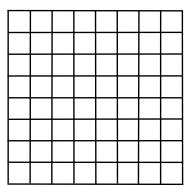

<details>
<summary>natural_image</summary>

Blank grid pattern with uniform squares (no text or symbols)
</details>

正常图像

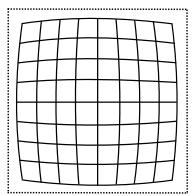

<details>
<summary>natural_image</summary>

Grid pattern with uniform squares, no text or symbols present
</details>

桶形失真

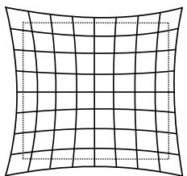

<details>
<summary>natural_image</summary>

Curved grid pattern with dotted lines, no text or symbols present
</details>

枕形失真  
图 5-3 径向畸变的两种类型。

桶形畸变是由于图像放大率随着离光轴的距离增加而减小，而枕形畸变却恰好相反。在这两种畸变中，穿过图像中心和光轴有交点的直线还能保持形状不变。

除了透镜的形状会引入径向畸变外，在相机的组装过程中由于不能使得透镜和成像面严格平行也会引入切向畸变。如图 5-4 所示。

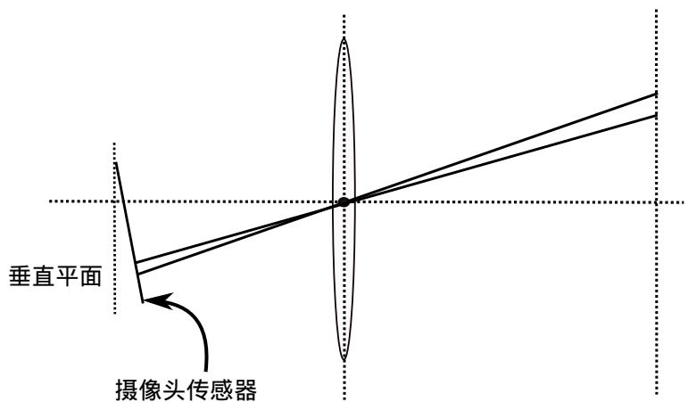

<details>
<summary>text_image</summary>

垂直平面
摄像头传感器
</details>

图 5-4 切向畸变来源示意图。

为更好地理解径向畸变和切向畸变，我们用更严格的数学形式对两者进行描述。我们知道平面上的任意一点 p 可以用笛卡尔坐标表示为 $[ x , y ] ^ { T }$ , 也可以把它写成极坐标的形式$[ r , \theta ] ^ { T }$ ，其中 r 表示点 $p$ 离坐标系原点的距离，θ 表示和水平轴的夹角。径向畸变可看成坐标点沿着长度方向发生了变化 $\delta r .$ 也就是其距离原点的长度发生了变化。切向畸变可以看成坐标点沿着切线方向发生了变化，也就是水平夹角发生了变化 $\delta \theta _ { \mathsf { c } }$ 。

对于径向畸变，无论是桶形畸变还是枕形畸变，由于它们都是随着离中心的距离增加而增加。我们可以用一个多项式函数来描述畸变前后的坐标变化：这类畸变可以用和距中心距离有关的二次及高次多项式函数进行纠正：

$$
x _ {\text { corrected }} = x (1 + k _ {1} r ^ {2} + k _ {2} r ^ {4} + k _ {3} r ^ {6}) \tag {5.11}
$$

$$
y _ {c o r r e c t e d} = y (1 + k _ {1} r ^ {2} + k _ {2} r ^ {4} + k _ {3} r ^ {6})
$$

其中 $[ x , y ] ^ { T }$ 是未纠正的点的坐标， $[ x _ { c o r r e c t e d } , y _ { c o r r e c t e d } ] ^ { T }$ 是纠正后的点的坐标，注意它们都是归一化平面上的点，而不是像素平面上的点。

在式（5.11）描述的纠正模型中，对于畸变较小的图像中心区域，畸变纠正主要是 $k _ { 1 }$ 起作用。而对于畸变较大的边缘区域主要是 $k _ { 2 }$ 起作用。普通摄像头用这两个系数就能很好的纠正径向畸变。对畸变很大的摄像头，比如鱼眼镜头，可以加入 $k _ { 3 }$ 畸变项对畸变进行纠正。

另一方面，对于切向畸变，可以使用另外的两个参数 $p _ { 1 } , p _ { 2 }$ 来进行纠正:

$$
x _ {\text { corrected }} = x + 2 p _ {1} x y + p _ {2} \left(r ^ {2} + 2 x ^ {2}\right). \tag {5.12}
$$

$$
y _ {c o r r e c t e d} = y + p _ {1} (r ^ {2} + 2 y ^ {2}) + 2 p _ {2} x y
$$

因此，联合式（5.11）和式（5.12），对于相机坐标系中的一点 $P ( X , Y , Z )$ ，我们能够通过五个畸变系数找到这个点在像素平面上的正确位置:

1. 将三维空间点投影到归一化图像平面。设它的归一化坐标为 $[ x , y ] ^ { T }$ 。  
2. 对归一化平面上的点进行径向畸变和切向畸变纠正。

$$
\left\{ \begin{array}{l} x _ {\text { corrected }} = x (1 + k _ {1} r ^ {2} + k _ {2} r ^ {4} + k _ {3} r ^ {6}) + 2 p _ {1} x y + p _ {2} (r ^ {2} + 2 x ^ {2}) \\ y _ {\text { corrected }} = y (1 + k _ {1} r ^ {2} + k _ {2} r ^ {4} + k _ {3} r ^ {6}) + p _ {1} (r ^ {2} + 2 y ^ {2}) + 2 p _ {2} x y \end{array} . \right. \tag {5.13}
$$

3. 将纠正后的点通过内参数矩阵投影到像素平面，得到该点在图像上的正确位置。

$$
\left\{ \begin{array}{l} u = f _ {x} x _ {\text { corrected }} + c _ {x} \\ v = f _ {y} y _ {\text { corrected }} + c _ {y} \end{array} . \right. \tag {5.14}
$$

在上面的纠正畸变的过程中，我们使用了五个畸变项。实际应用中，可以灵活选择纠

正模型，比如只选择 $k _ { 1 } , p _ { 1 } , p _ { 2 }$ 这三项等。

在这一节中，我们对相机的成像过程使用针孔模型进行了建模，也对透镜引起的径向畸变和切向畸变进行了描述。实际的图像系统中，学者们提出了有很多其他的模型，比如相机的仿射模型和透视模型等，同时也存在很多其他类型的畸变。考虑到视觉 SLAM 中，一般都使用普通的摄像头，针孔模型以及径向畸变和切向畸变模型已经足够。因此，我们不再对其它模型进行描述。

值得一提的是，存在两种去畸变处理（Undistort，或称畸变校正）做法。我们可以选择先对整张图像进行去畸变，得到去畸变后的图像，然后讨论此图像上的点的空间位置。或者，我们也可以先考虑图像中的某个点，然后按照去畸变方程，讨论它去畸变后的空间位置。二者都是可行的，不过前者在视觉 SLAM 中似乎更加常见一些。所以，当一个图像去畸变之后，我们就可以直接用针孔模型建立投影关系，而不用考虑畸变了。因此，在后文的讨论中，我们可以直接假设图像已经进行了去畸变处理。

最后，我们小结一下单目相机的成像过程：

1. 首先，世界坐标系下有一个固定的点 P，世界坐标为 $P _ { w }$ ；  
2. 由于相机在运动，它的运动由 $R , t$ 或变换矩阵 $\pmb { T } \in S E ( 3 )$ 描述。P 的相机坐标为：  
3. 这时的 $\tilde { P } _ { c }$ 仍有 $X , Y , Z$ 三个量，把它们投影到归一化平面 $Z = 1$ 上，得到 P 的归一化相机坐标： $P _ { c } = [ X / Z , Y / Z , 1 ] ^ { T \mathfrak { D } }$ 。  
4. 最后，P 的归一化坐标经过内参后，对应到它的像素坐标： $P _ { u v } = K P _ { c }$ 。

$$
\tilde {\boldsymbol {P}} _ {c} = \boldsymbol {R} \boldsymbol {P} _ {w} + \boldsymbol {t} _ {\circ}
$$

综上所述，我们一共谈到了四种坐标：世界、相机、归一化相机和像素坐标。请读者理清它们的关系，它反映了整个成像的过程。

## 5.1.3 双目相机模型

针孔相机模型描述了单个相机的成像模型。然而，仅根据一个像素，我们是无法确定这个空间点的具体位置的。这是因为，从相机光心到归一化平面连线上的所有点，都可以投影至该像素上。只有当 P 的深度确定时（比如通过双目或 RGB-D 相机），我们才能确切地知道它的空间位置。

测量像素距离（或深度）的方式有很多种，像人眼就可以根据左右眼看到的景物差异（或称视差）来判断物体与我们的距离。双目相机的原理亦是如此。通过同步采集左右相机的图像，计算图像间视差，来估计每一个像素的深度。下面我们简单讲讲双目相机的成像原理（图 5-6 ）。

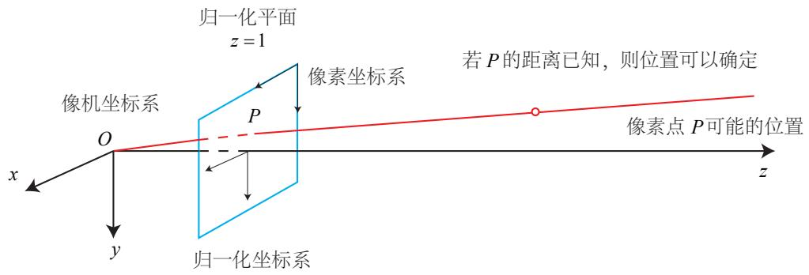

<details>
<summary>text_image</summary>

归一化平面
z = 1
像素坐标系
若 P 的距离已知，则位置可以确定
像素点 P 可能的位置
像机坐标系
O
P
y
归一化坐标系
x
z
</details>

图 5-5 像素点可能存在的位置。

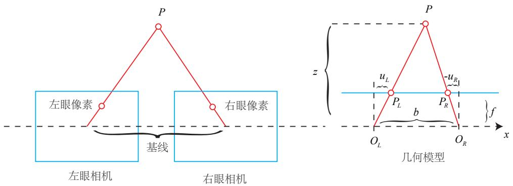

<details>
<summary>text_image</summary>

P
左眼像素
右眼像素
基线
左眼相机
右眼相机
P
z
u_L
u_R
P_L
P_R
b
O_L
O_R
几何模型
x
f
</details>

图 5-6 双目相机的成像模型。 $O _ { L } , O _ { R }$ 为左右光圈中心，蓝色框为成像平面， $f$ 为焦距。$u _ { L }$ 和 $u _ { R }$ 为成像平面的坐标。请注意按照图中坐标定义， $u _ { R }$ 应该是负数，所以图中标出的距离为 $- u _ { R }$ 。

双目相机一般由左眼和右眼两个水平放置的相机组成。当然也可以做成上下两个目①，但我们见到的主流双目都是做成左右的。在左右双目的相机中，我们可以把两个相机都看作针孔相机。它们是水平放置的，意味两个相机的光圈中心都位于 x 轴上。它们的距离称为双目相机的基线（Baseline, 记作 b），是双目的重要参数。

现在，考虑一个空间点 P，它在左眼和右眼各成一像，记作 $P _ { L } , P _ { R }$ 。由于相机基线的存在，这两个成像位置是不同的。理想情况下，由于左右相机只有在 x 轴上有位移，因此P 的像也只在 x 轴（对应图像的 u 轴）上有差异。我们记它在左侧的坐标为 $u _ { L }$ ，右侧坐标为 $u _ { R ^ { \odot } }$ 。那么，它们的几何关系如图5-6右侧所示。根据三角形 $P - P _ { L } - P _ { R }$ 和 $P - O _ { L } - O _ { R }$ 的相似关系，有：

$$
\frac {z - f}{z} = \frac {b - u _ {L} + u _ {R}}{b}. \tag {5.15}
$$

稍加整理，得：

$$
z = \frac {f b}{d}, \quad d = u _ {L} - u _ {R}. \tag {5.16}
$$

这里 d 为左右图的横坐标之差，称为视差（Disparity）。根据视差，我们可以估计一个像素离相机的距离。视差与距离成反比：视差越大，距离越近②。同时，由于视差最小为一个像素，于是双目的深度存在一个理论上的最大值，由 fb 确定。我们看到，当基线越长时，双目最大能测到的距离就会变远；反之，小型双目器件则只能测量很近的距离。

虽然由视差计算深度的公式很简洁，但视差 d 本身的计算却比较困难。我们需要确切地知道左眼图像某个像素出现在右眼图像的哪一个位置（即对应关系），这件事亦属于“人类觉得容易而计算机觉得困难”的事务。当我们想计算每个像素的深度时，其计算量与精度都将成为问题，而且只有在图像纹理变化丰富的地方才能计算视差。由于计算量的原因，双目深度估计仍需要使用 GPU 或 FPGA 来计算。这将在十三章中提到。

## 5.1.4 RGB-D 相机模型

相比于双目相机通过视差计算深度的方式，RGB-D 相机的做法更为“主动”一些，它能够主动测量每个像素的深度。目前的 RGB-D 相机按原理可分为两大类：

1. 通过红外结构光（Structured Light）来测量像素距离的。例子有 Kinect 1 代、ProjectTango 1 代、Intel RealSense 等；

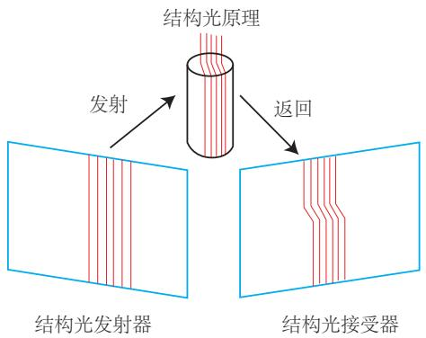

<details>
<summary>text_image</summary>

结构光原理
发射
返回
结构光发射器
结构光接受器
</details>

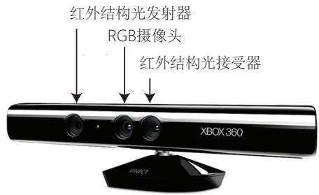

<details>
<summary>text_image</summary>

红外结构光发射器
RGB摄像头
红外结构光接受器
XBOX 360
</details>

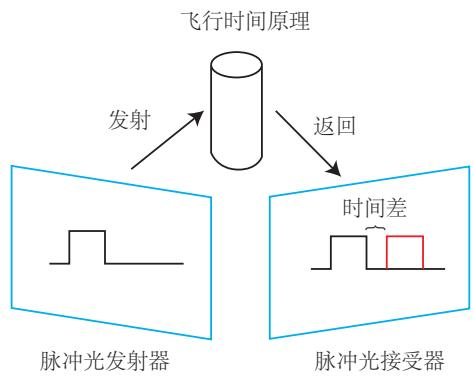

<details>
<summary>flowchart</summary>

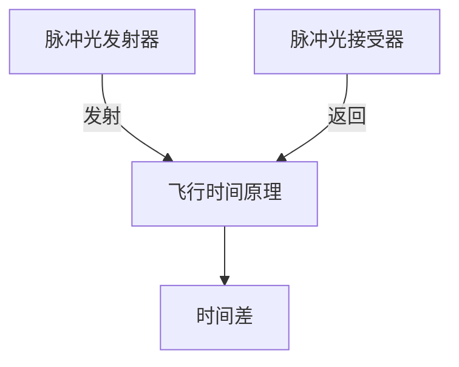
```mermaid
graph TD
  A["脉冲光发射器"] -->|发射| B["飞行时间原理"]
  C["脉冲光接受器"] -->|返回| B
  B --> D["时间差"]
```
</details>


<details>
<summary>natural_image</summary>

Exterior view of a black Xbox gaming console with speaker grille and front panel (no text or symbols visible)
</details>

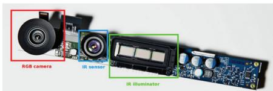

<details>
<summary>text_image</summary>

RGB camera
IR sensor
IR illuminator
</details>

图 5-7 RGB-D 相机原理示意图

2. 通过飞行时间法（Time-of-flight, ToF）原理测量像素距离的。例子有 Kinect 2 代和一些现有的 ToF 传感器等。

无论是结构光还是 ToF，RGB-D 相机都需要向探测目标发射一束光线（通常是红外光）。在结构光原理中，相机根据返回的结构光图案，计算物体离自身的距离。而在 ToF中，相机向目标发射脉冲光，然后根据发送到返回之间的光束飞行时间，确定物体离自身的距离。ToF 原理和激光传感器十分相似，不过激光是通过逐点扫描来获取距离，而 ToF相机则可以获得整个图像的像素深度，这也正是 RGB-D 相机的特点。所以，如果你把一个 RGB-D 相机拆开，通常会发现除了普通的摄像头之外，至少会有一个发射器和一个接收器。

在测量深度之后，RGB-D 相机通常按照生产时的各个相机摆放位置，自己完成深度与彩色图像素之间的配对，输出一一对应的彩色图和深度图。我们可以在同一个图像位置，读取到色彩信息和距离信息，计算像素的 3D 相机坐标，生成点云（Point Cloud）。对

RGB-D 数据，既可以在图像层面进行处理，亦可在点云层面处理。本讲的第二个实验将演示 RGB-D 相机的点云构建过程。

RGB-D 相机能够实时地测量每个像素点的距离。但是，由于这种发射-接受的测量方式，使得它使用范围比较受限。用红外进行深度值测量的 RGB-D 相机，容易受到日光或其他传感器发射的红外光干扰，因此不能在室外使用，同时使用多个时也会相互干扰。对于透射材质的物体，因为接受不到反射光，所以无法测量这些点的位置。此外，RGB-D 相机在成本、功耗方面，都有一些劣势。

## 5.2 图像

相机加上镜头，把三维世界中的信息转换成了一个由像素组成的照片，随后存储在计算机中，作为后续处理的数据来源。在数学中，图像可以用一个矩阵来描述；而在计算机中，它们占据一段连续的磁盘或内存空间，可以用二维数组来表示。这样一来，程序就不必区别它们处理的是一个数值矩阵，还是有实际意义的图像了。

本节，我们将介绍计算机图像处理的一些基本操作。特别地，通过 OpenCV 中图像数据的处理，理解计算机中处理图像的常见步骤，为后续章节打下基础。

## 5.2.1 计算机中图像的表示

我们从最简单的图像——灰度图开始说起。在一张灰度图中，每个像素位置 (x, y) 对应到一个灰度值 I，所以一张宽度为 w，高度为 h 的图像，数学形式可以记成一个矩阵：

$$
\boldsymbol {I} (x, y) \in \mathbb {R} ^ {w \times h}.
$$

然而，计算机并不能表达整个实数空间，所以我们只能在某个范围内，对图像进行量化。例如常见的灰度图中，我们用 0-255 之间整数（即一个 unsigned char，一个字节）来表达图像的灰度大小。那么，一张宽度为 640，高度为 480 分辨率的灰图度就可以这样表示：

```javascript
1 unsigned char image[480][640];
```

为什么这里的二维数组是 480 × 640 呢？因为在程序中，图像以一个二维数组形式存储。它的第一个下标则是指数组的行，而第二个下标是列。在图像中，数组的行数对应图像的高度，而列数对应图像的宽度。

下面我们来考察这个图像的内容。图像自然是由像素组成的。当我们访问某一个像素时，需要指明它所处的坐标，请看图 5-8 。

图 5-8 左边显示了传统像素坐标系的定义方式。一个像素坐标系原点位于图像的左上角，X 轴向右，Y 轴向下（也就是前面所说的 u, v 坐标）。如果它还有第三个轴的话，根据右手法则，Z 轴应该是向前的。这种定义方式是与相机坐标系一致的。我们平时说的图像的宽度和列数，对应着 X 轴；而图像的行数或高度，则对应着它的 Y 轴。

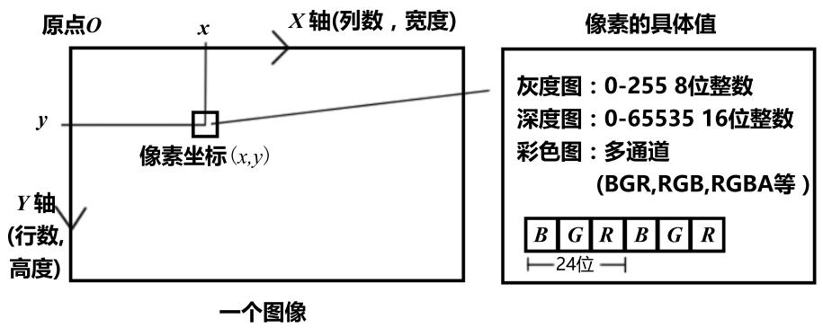

<details>
<summary>text_image</summary>

原点O
x
X轴(列数, 宽度)
y
像素坐标(x,y)
Y轴
(行数,
高度)
一个图像
像素的具体值
灰度图：0-255 8位整数
深度图：0-65535 16位整数
彩色图：多通道
(BGR,RGB,RGBA等)
B G R B G R
—24位 —
</details>

图 5-8 图像坐标示意图。

根据这种定义方式，如果我们讨论一个位于 x, y 处的像素，那么它在程序中的访问方式应该是：

```javascript
1 unsigned char pixel = image[y][x];
```

它对应着灰度值 I(x, y) 的读数。请注意这里的 x 和 y 的顺序。虽然我们有些繁琐地向读者讨论坐标系的问题，但是像这种下标顺序的错误，会是新手在调试过程中经常碰到的，又具有一定隐蔽性的错误之一。如果你在写程序时不慎调换了 x, y 的坐标，编译器无法提供任何信息，而你能看到的只是程序运行中的一个越界错误而已。

一个灰度像素可以用八位整数记录，也就是一个 0-255 之间的值。当我们要记录的信息更多时，一个字节恐怕就不够了。例如，在 RGB-D 相机的深度图中，记录了各个像素离相机的距离。这个距离通常是毫米为单位，而 RGB-D 相机的量程通常在十几米范围左右，超过了 255 的最大值范围。这时，人们会采用十六位整数（C++ 中的 unsigned short）来记录一个深度图的信息，也就是位于 0 至 65536 之间的值。换算成毫米的话，最大可以表示 65 米，足够一个 RGB-D 相机使用了。

彩色图像的表示则需要通道（channel）的概念。在计算机中，我们用红色，绿色和蓝色这三种颜色的组合来表达任意一种色彩。于是对于每一个像素，就要记录它的 R,G,B 三个数值，每一个数值就称为一个通道。例如，最常见的彩色图像有三个通道，每个通道都由 8 位整数表示。在这种规定下，一个像素占据了 24 位空间。

通道的数量，顺序都是可以自由定义的。在 OpenCV 的彩色图像中，通道的默认顺序是 B,G,R。也就是说，当我们得到一个 24 位的像素时，前 8 位表示蓝色数值，中间 8 位为绿色，最后 8 位为红色。同理，亦可使用 R,G,B 的顺序表示一个彩色图。如果我们还想表达图像的透明度时，就使用 R,G,B,A 四个通道来表示它。

## 5.3 实践：图像的存取与访问

下面我们通过一个演示程序，来理解在 OpenCV 中，图像是如何存取，我们又是如何访问其中的像素的。

## 5.3.1 安装 OpenCV

OpenCV①提供了大量的开源图像算法，是计算机视觉中使用极广的图像处理算法库。本书也使用 OpenCV 做基本的图像处理。在使用之前，我建议你从源代码安装它。在ubuntu 下，你可以选择从源代码安装和只安装库文件两种方式：

1. 从源代码安装，是指从 OpenCV 网站下载所有的 OpenCV 源代码。并在你的机器上编译安装，以便使用。好处是可以选择的版本比较丰富，而且能看到源代码，不过需要花费一些编译时间；  
2. 只安装库文件，是指通过 Ubuntu 来安装由 Ubuntu 社区人员已经编译好的库文件，这样你就无需重新编译一遍。

由于我们使用较新版本的 OpenCV，所以你必须从源代码来安装它。一来，你可以调整一些编译选项，来匹配你的编程环境（例如需不需要 GPU 加速等）；再者，源代码安装可以使用一些额外的功能。OpenCV 目前维护了两个主要版本，分为 OpenCV 2.4 系列和OpenCV 3 系列。本书使用 OpenCV 3 系列。

由于 OpenCV 工程比较大，我们就不放在本书的 3rdparty 下了。请读者从 http://opencv.org/downloads.html 中下载，选择 OpenCV for Linux 版本即可。你会获得一个像 opencv-3.1.0.zip 这样的压缩包。将它解压到任意目录下，我们发现 OpenCV 亦是一个 cmake 工程。

在编译之前，先来安装 OpenCV 的依赖项：

1

```batch
sudo apt-get install build-essential libgtk2.0-dev libvtk5-dev libjpeg-dev libtiff4-dev libjasper-dev libopenexr-dev libtbb-dev
```

事实上 OpenCV 的依赖项很多，缺少某些编译项会影响它的部分功能（不过我们也不会用到所有功能）。OpenCV 会在 cmake 阶段检查依赖项是否会安装，并调整自己的功能。如果你的电脑上有 GPU 并且安装了相关依赖项，OpenCV 也会把 GPU 加速打开。不过对于本书，上边那些依赖项就足够了。

随后的编译安装和普通的 cmake 工程一样，请在 make 之后，调用 sudo make install将 OpenCV 安装到你的机器上（而不是仅仅编译它）。视你的机器配置，这个编译过程大概需要二十分钟到一个小时不等。如果你的 CPU 比较强力，可以使用“make -j4”这样的命令，调用多个线程进行编译（-j 后边的参数就是使用的线程数量）。在安装之后，OpenCV默认存储到你的/usr/local 目录下。你可以去寻找 opencv 头文件与库文件的安装位置，看看它们都在哪里。另外，如果你之前已经安装了 OpenCV 2 系列，我建议你把 OpenCV 3安装到不同的地方——想想这应该如何操作。

## 5.3.2 操作 OpenCV 图像

接下来，我们通过一个例程熟悉一下 OpenCV 对图像的操作。

slambook/ch5/imageBasics.cpp :  
```cpp
#include <iostream>
#include <chrono>
using namespace std;

#include <opencv2/core/core.hpp>
#include <opencv2/highgui/highgui.hpp>

int main ( int argc, char** argv )
{
    // 读取 argv[1] 指定的图像
    cv::Mat image;
    image = cv::imread ( argv[1] ); // cv::imread 函数读取指定路径下的图像
    // 判断图像文件是否正确读取
    if ( image.data == nullptr ) // 数据不存在，可能是文件不存在
    {
    cerr<<"文件"<<argv[1]<<"不存在."<<endl;
    return 0;
    }

    // 文件顺利读取，首先输出一些基本信息
    cout<<"图像宽为"<<image.cols<<"，高为"<<image.rows<<"，通道数为"<<image.channels()<<endl;
    cv::imshow ( "image", image ); // 用 cv::imshow 显示图像
    cv::waitFor Key ( 0 ); // 暂停程序，等待一个按键输入
    // 判断 image 的类型
    if ( image.type() != CV_8UC1 && image.type() != CV_8UC3 )
    {
    // 图像类型不符合要求
    cout<<"请输入一张彩色图或灰度图."<<endl;
    return 0;
    }
}
```

```cpp
// 遍历图像，请注意以下遍历方式亦可使用于随机访问
// 使用 std::chrono 来给算法计时
chrono::steady_clock::time_point t1 = chrono::steady_clock::now();
for ( size_t y=0; y<image.rows; y++ )
{
    for ( size_t x=0; x<image.cols; x++ )
    {
    // 访问位于 x,y 处的像素
    // 用 cv::Mat::ptr 获得图像的行指针
    unsigned char* row_ptr = image.ptr<unsigned char> (y); // row_ptr 是第 y 行的头指针
    unsigned char* data_ptr = &row_ptr[ x*image.channels() ]; // data_ptr 指向待访问的像素数据
    // 输出该像素的每个通道，如果是灰度图就只有一个通道
    for ( int c = 0; c != image.channels(); c++ )
    {
    unsigned char data = data_ptr[c]; // data 为 I(x,y) 第 c 个通道的值
    }
    }
}
chrono::steady_clock::time_point t2 = chrono::steady_clock::now();
chrono::duration<double> time_used = chrono::duration_cast<chrono::duration<double>>(t2-t1);
cout<<"遍历图像用时："<<time_used.count()<<" 秒。"<<endl;

// 关于 cu::Mat 的拷贝
// 直接赋值并不会拷贝数据
cv::Mat image_another = image;
// 修改 image_another 会导致 image 发生变化
image_another ( cv::Rect ( 0,0,100,100 ) ).setTo ( 0 ); // 将左上角 100*100 的块置零
cv::imshow ( "image", image );
cv::waitFor Key ( 0 );

// 使用 clone 函数来拷贝数据
cv::Mat image_clone = image.clone();
image_clone ( cv::Rect ( 0,0,100,100 ) ).setTo ( 255 );
cv::imshow ( "image", image );
cv::imshow ( "image_clone", image_clone );
cv::waitFor Key ( 0 );

// 其他图像操作请参见 OpenCV 官方文档，查询每个函数的调用方法。
cv::destroyAllWindows();
return 0;
}
```

在该例程中，我们演示了如下几个操作：图像读取、显示、像素遍历、拷贝、赋值等。大部分的注解已写在代码里面。编译该程序时，你需要在 CMakeLists.txt 添加 OpenCV的头文件，然后把程序链接到库文件上。同时，由于我们使用了 C++ 11 标准（如 nullptr和 chrono），还需要设置一下编译器：

```txt
1 # 添加 c++ 11 标准支持
2 set( CMAKE_CXX_FLAGS "-std=c++11" )
```

```cmake
3
4 # 寻找 OpenCV 库
5 find_package( OpenCV REQUIRED )
6 # 添加头文件
7 include_directories( ${OpenCV_INCLUDE_DIRS} )
8
9 add_executable( imageBasics imageBasics.cpp )
10 # 链接 OpenCV 库
11 target_link_libraries( imageBasics ${OpenCV_LIBS} )
```

关于代码，我们给出几点注解：

1. 程序从 argv[1]，也就是命令行的第一个参数中读取图像位置。我们为读者准备了一张图像（ubuntu.png，一张 ubuntu 的壁纸，希望你喜欢）供测试使用。因此，编译之后，使用如下命令调用此程序：

build/image\_basics ubuntu.png

如果在 Kdevelop 中调用此程序，请务必确保把参数同时给它。这可以在启动项中配置。

2. 程序的 10 到 17 行，使用 cv::imread 函数读取图像，并把图像和基本信息显示出来。

3. 在例程的 32 行至 52 行，我们遍历了程序当中的所有像素，并计算了整个循环的时间。请注意像素的遍历方式并不是唯一的，而且例程给出的方式也不是最高效的。OpenCV 提供了迭代器，你能够通过迭代器遍历图像的像素。或者，cv::Mat::data 提供了指向图像数据开头的指针，你可以直接通过该指针，自行计算偏移量，然后得到像素的实际内存位置。例程给出的方式是为了便于读者理解图像的结构。

在我的机器上（虚拟机），遍历这张图像用时大约 12.74 毫秒左右。你可以对比一下自己机器上的速度。不过，我们使用的是 cmake 默认的 debug 模式，如果使用 release模式会快很多。

4. OpenCV 提供了许多对图像进行操作的函数，我们在此不一一列举，否则本书就会变成 OpenCV 操作手册了。例程给出了较为常见的读取、显示操作以及复制图像中可能陷入的深拷贝误区。在编程过程中，读者还会碰到图像的旋转、插值等操作，这时你应该自行查阅函数对应的文档，以了解它们的原理与使用方式。

应该指出，OpenCV 并不是唯一的图像库，它是许多图像库里，使用范围较广泛之一。不过，多数图像库对图像的表达是大同小异的。我们希望读者了解了 OpenCV 对图像的表示后，能够理解其他库中图像的表达，从而在需要数据格式时，能够自己处理。

另外，由于 cv::Mat 亦是矩阵类，除了表示图像之外，我们也可以用它来存储位姿等矩阵数据。只是一般认为 Eigen 对于固定大小的矩阵，使用起来效率更高一些。

## 5.4 实践：拼接点云

最后，我们来练习一下相机内外参的使用方法。本节程序提供了五张 RGB-D 图像，并且知道了每个图像的内参和外参。根据 RGB-D 图像和相机内参，我们可以计算任何一个像素在相机坐标系下的位置。同时，根据相机位姿，又能计算这些像素在世界坐标系下的位置。如果把所有像素的空间坐标都求出来，相当于构建一张类似于地图的东西。现在我们就来练习一下。

我们准备了五对图像，位于 slambook/ch5/joinMap 中。在 color/下有 1.png 到 5.png五张 RGB 图，而在 depth/下有五张对应的深度图。同时，pose.txt 文件给出了五张图像的相机位姿（以 $\mathbf { { \mathcal { T } } } _ { w c }$ 形式）。位姿记录的形式是平移向量加旋转四元数：

$$
\left[ x, y, z, q _ {x}, q _ {y}, q _ {z}, q _ {w} \right],
$$

其中 $q _ { w }$ 是四元数的实部。例如第一对图的外参为：

$[-0.228993, 0.00645704, 0.0287837, -0.0004327, -0.113131, -0.0326832, 0.993042]$ .

下面我们写一段程序，完成两件事：(1). 根据内参计算一对 RGB-D 图像对应的点云；(2). 根据各张图的相机位姿（也就是外参），把点云加起来，组成地图。

本书的点云库使用 PCL（Point Cloud Library）①。PCL 的安装比较容易，输入以下命令即可②：

```shell
sudo add-apt-repository ppa:v-launchpad-jochen-sprickerhof-de/pcl
sudo apt-get update
sudo apt-get install libpcl-all
```

安装完成后，PCL 的头文件将安装在/usr/include/pcl-1.7 中，库文件位于/usr/lib/中。现在来写拼接部分的程序：

slambook/ch5/joinMap/joinMap.cpp  
```cpp
#include <iostream>
#include <fstream>
using namespace std;
#include <opencv2/core/core.hpp>
#include <opencv2/highgui/highgui.hpp>
#include <Eigen/Geometry>
```

```cpp
#include <boost/format.hpp> // for formatting strings
#include <pcl/point_types.h>
#include <pcl/io/pcd_io.h>
#include <pcl/visualization/pcl_visualizer.h>

int main( int argc, char** argv )
{
    vector<cv::Mat> colorImg s, depthImg s; // 彩色图和深度图
    vector<Eigen::Isometry3d> poses; // 相机位姿

    ifstream fin("./pose.txt");
    if (!fin)
    {
    cerr<<"请在有 pose.txt 的目录下运行此程序"<<endl;
    return 1;
    }

    for ( int i=0; i<5; i++ )
    {
    boost::format fmt( "./%s/%d.%s" ); //图像文件格式
    colorImg s.push_back( cv::imread( (fmt%"color%(i+1)%"png").str() ));
    depthImg s.push_back( cv::imread( (fmt%"depth%(i+1)%"pgm").str(), -1 ) ); // 使用 -1 读取原始图像

    double data[7] = {0};
    for ( auto& d:data )
    fin>>d;
    Eigen::Quaterniond q( data[6], data[3], data[4], data[5] );
    Eigen::Isometry3d T(q);
    T.pretranslate( Eigen::Vector3d( data[0], data[1], data[2] ));
    poses.push_back( T );
    }

    // 计算点云并拼接
    // 相机内参
    double cx = 325.5;
    double cy = 253.5;
    double fx = 518.0;
    double fy = 519.0;
    double depthScale = 1000.0;

    cout<<"正在将图像转换为点云..."<<endl;
    // 定义点云使用的格式：这里用的是 XYZRGB
    typedef pcl::PointXYZRGB PointT;
    typedef pcl::PointCloud<PointT> PointCloud;

    // 新建一个点云
   PointCloud::Ptr pointCloud( new PointCloud );
    for ( int i=0; i<5; i++ )
    {
    cout<<"转换图像中："<<i+1<<endl;
    }
}
```

```cpp
cv::Mat color = colorImgs[i];
cv::Mat depth = depthImgs[i];
Eigen::Isometry3d T = poses[i];
for ( int v=0; v<color.rows; v++)
    for ( int u=0; u<color.cols; u++)
    {
    unsigned int d = depth.ptr<unsigned short>(v)[u]; // 深度值
    if (d==0) continue; // 为0表示没有测量到
    Eigen::Vector3d point;
    point[2] = double(d)/depthScale;
    point[0] = (u-cx)*point[2]/fx;
    point[1] = (v-cy)*point[2]/fy;
    Eigen::Vector3d pointWorld = T*point;

    PointT p;
    p.x = pointWorld[0];
    p.y = pointWorld[1];
    p.z = pointWorld[2];
    p.b = color.data[v*color.step+u*color.channels()];
    p.g = color.data[v*color.step+u*color.channels()+1];
    p.r = color.data[v*color.step+u*color.channels()+2];
    pointCloud->points.push_back(p);
    }
}

pointCloud->is_dense = false;
cout<<"点云共有"<<pointCloud->size()<<"个点."<<endl;
pcl::io::savePCDFileBinary("map.pcd", *pointCloud);
return 0;
}
```

## 一点注解：

1. 14-39 行：读取彩色和深度图像对和位姿信息，并把位姿从四元数与平移向量转换为变换矩阵。注意程序里使用了 boost::format 进行字符串的格式化。  
2. 65-80 行：计算位于 (u, v)，深度为 d 的像素，在相机坐标系下的位置。并根据外参把它们变换到世界坐标。我们知道相机坐标 $\pmb { p _ { c } }$ 到像素坐标 (u, v, d) 的关系为：

$$
d \left[ \begin{array}{l} u \\ v \\ 1 \end{array} \right] = K p _ {c}. \tag {5.17}
$$

反推 $\pmb { p _ { c } }$ 的形式亦非常简单。设 $\pmb { p } _ { c } = [ x , y , z ]$ ，那么：

$$
\begin{array}{l} z = d \\ x = \frac {u - c _ {x}}{f _ {x}} z \\ y = \frac {v - c _ {y}}{f _ {y}} z. \\ \end{array}
$$

3. 为了编译此程序，我们需三个库：Eigen、OpenCV 和 PCL。因此主程序的 CMake-Lists.txt 应该是这样的：

```cmake
# opencv
find_package( OpenCV REQUIRED )
include_directories( ${OpenCV_INCLUDE_DIRS} )

# eigen
include_directories( "/usr/include/eigen3/" )

# pcl
find_package( PCL REQUIRED COMPONENT common io )
include_directories( ${PCL_INCLUDE_DIRS} )
add_definitions( ${PCL_DEFINITIONS} )

add_executable( joinMap joinMap.cpp )
target_link_libraries( joinMap ${OpenCV_LIBS} ${PCL_LIBRARIES} )
```

最后，我们把生成的点云以 pcd 格式存储在 map.pcd 中。用 PCL 提供的可视化程序打开这个文件：

```batch
1 pcl_viewer map.pcd
```

随后就可以看到拼合的点云地图了。你可以拖动鼠标，查看此地图的样子。

在这个例程中，我们使用相机内参和外参，来计算一个像素在世界坐标系中的位置，并把它们合并成一个点云。这是一个综合性的示例，请读者仔细体会并掌握其内容。

## 习题

1. \* 寻找一个相机（你手机或笔记本的摄像头即可），标定它的内参。你可能会用到标定板，或者自己打印一张标定用的棋盘格。  
2. 叙述相机内参的物理意义。如果一个相机的分辨率变成两倍而其他地方不变，它的内参如何变化？  
3. 搜索特殊的相机（鱼眼或全景）相机的标定方法。它们与普通的针孔模型有何不同？

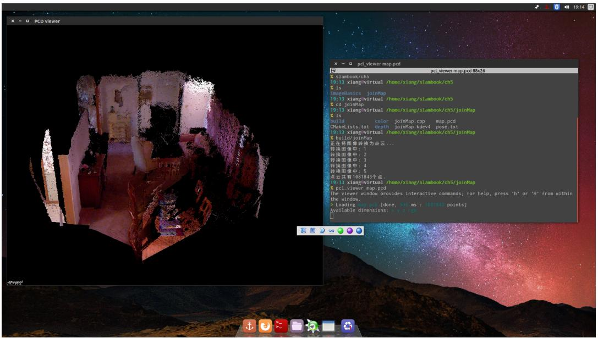

<details>
<summary>text_image</summary>

PCD viewer
pcd_viewer.map.pcd
pcl_viewer.map.pcd 88x26
% slambook/ch5
19:13 xiang/virtual /home/xiang/slambook/ch5
% ls
ImageBasics joinMap
19:13 xiang/virtual /home/xiang/slambook/ch5
% cd joinMap
19:13 xiang/virtual /home/xiang/slambook/ch5/joinMap
% ls
build color joinMap.cpp map.pcd
CMakeLists.txt depth joinMap.kdev4 pose.txt
19:13 xiang-virtual /home/xiang/slambook/ch5/joinMap
% build/joinMap
正在将图像转换为点云...
转换图像中: 1
转换图像中: 2
转换图像中: 3
转换图像中: 4
转换图像中: 5
点云共有1081843个点.
19:13 xiang/virtual /home/xiang/slambook/ch5/joinMap
% pcl_viewer.map.pcd
The View window provides interactive commands; for help, press 'h' or 'H' from within the window.
> Loading up pcs [done, 538 ms : 1081843 points]
Available2E dimensions: x y z F80
新 前
</details>

图 5-9 查看拼合的点云地图。

4. 调研全局快门相机（global shutter）和卷帘快门相机（rolling shutter）的异同。它们在 SLAM 中有何优缺点？  
5. RGB-D 相机是如何标定的？以 Kinect 为例，需要标定哪些参数？（参照https://github.com/code-iai/iai\_kinect2.）  
6. 除了示例程序演示的遍历图像的方式，你还能举出哪些遍历图像的方法？  
7. \* 阅读 OpenCV 官方教程，学习它的基本用法。

## 第 6 讲

# 非线性优化

## 本节目标

1. 理解最小二乘法的含义和处理方式。  
2. 理解 Gauss-Newton, Levenburg-Marquadt 等下降策略。  
3. 学习 Ceres 库和 g2o 库的基本使用方法。

在前面几章，我们介绍了经典 SLAM 模型的运动方程和观测方程。现在我们已经知道，方程中的位姿可以由变换矩阵来描述，然后用李代数进行优化。观测方程由相机成像模型给出，其中内参是随相机固定的，而外参则是相机的位姿。于是，我们已经弄清了经典 SLAM 模型在视觉情况下的具体表达。

然而，由于噪声的存在，运动方程和观测方程的等式必定不是精确成立的。尽管相机可以非常好地符合针孔模型，但遗憾的是，我们得到的数据通常是受各种未知噪声影响的。即使我们有着高精度的相机，运动方程和观测方程也只能近似的成立。所以，与其假设数据必须符合方程，不如来讨论，如何在有噪声的数据中进行准确的状态估计。

大多现代视觉 SLAM 算法都不需要那么高成本的传感器，甚至也不需要那么昂贵的处理器来计算这些数据，这全是算法的功劳。由于在 SLAM 问题中，同一个点往往会被一个相机在不同的时间内多次观测，同一个相机在每个时刻观测到的点也不止一个。这些因素交织在一起，使我们拥有了更多的约束，最终能够较好地从噪声数据中恢复出我们需要的东西。本节就将介绍如何通过优化处理噪声数据，并且由这些表层逐渐深入到图优化本质，提供图优化的解决算法初步介绍并且提供训练实例。

$$
\bar {T} _ \bullet \bullet \bullet \bullet \bullet \bullet \bullet \bullet \bullet \bullet \bullet \bullet \bullet \bullet \bullet \bullet \bullet \bullet \bullet \bullet \bullet \bullet \bullet \bullet \bullet \bullet \bullet \bullet \bullet \bullet \bullet \bullet \bullet \bullet \bullet \bullet \bullet \bullet \bullet \bullet \bullet \bullet \bullet \bullet \bullet \bullet \bullet \bullet \bullet \bullet \bullet
$$

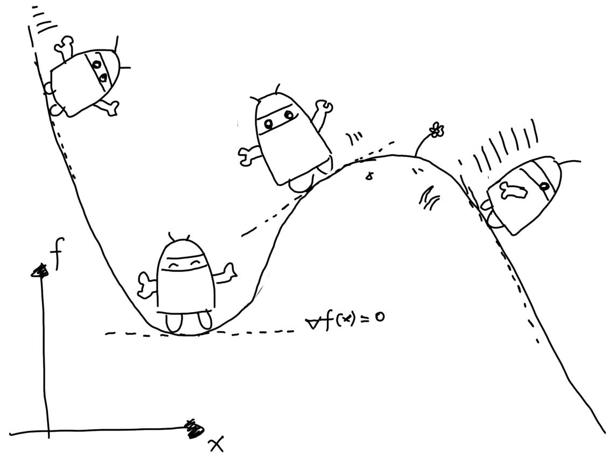

<details>
<summary>text_image</summary>

f
∀f(x) = 0
</details>

$$
f (x + \Delta x) \approx f (x) + \nabla f (x) \Delta x
$$

$$
+ \frac {1}{2} \Delta x ^ {T} H (x) \Delta x
$$

$$
+ \dots
$$

## 6.1 状态估计问题

## 6.1.1 最大后验与最大似然

接着前面几章的内容，我们回顾一下第二讲讨论的经典 SLAM 模型。它由一个状态方程和一个运动方程构成，如式（2.5）所示：

$$
\left\{ \begin{array}{l} \boldsymbol {x} _ {k} = f \left(\boldsymbol {x} _ {k - 1}, \boldsymbol {u} _ {k}\right) + \boldsymbol {w} _ {k} \\ \boldsymbol {z} _ {k, j} = h \left(\boldsymbol {y} _ {j}, \boldsymbol {x} _ {k}\right) + \boldsymbol {v} _ {k, j} \end{array} . \right. \tag {6.1}
$$

通过第四讲的知识，我们了解到这里的 $\scriptstyle { \mathbf { { \mathit { x } } } } _ { k }$ 乃是相机的位姿。我们可以使用变换矩阵或李代数表示它。至于观测方程，第五讲已经说明了它的内容，即针孔相机模型。为了让读者对它们有更深的印象，我们不妨讨论一下它们的具体参数化形式。首先，位姿变量 $\scriptstyle { \mathbf { { \mathit { x } } } } _ { k }$ 可以由 $\mathbfit { T } _ { k }$ 或 $\exp ( \pmb { \xi } _ { k } ^ { \wedge } )$ 表达，二者是等价的。由于运动方程在视觉 SLAM 中没有特殊性，我们暂且不讨论它，主要讨论观测方程。假设在 $\scriptstyle { \mathbf { { \mathit { x } } } } _ { k }$ 处对路标 ${ \bf { \nabla } } _ { \bf { { y } } } \mathrm { ~ _ { \it { j } } ~ }$ 进行了一次观测，对应到图像上的像素位置 $z _ { k , j }$ ，那么，观测方程可以表示成：

$$
s \boldsymbol {z} _ {k, j} = \boldsymbol {K} \exp (\boldsymbol {\xi} ^ {\wedge}) \boldsymbol {y} _ {j}. \tag {6.2}
$$

根据上一讲的内容，读者应该知道这里 K 为相机内参，s 为像素点的距离。同时这里的 $z _ { k , j }$ 和 ${ \bf { \nabla } } _ { \bf { { y } } } \mathrm { { _ { j } } }$ 都必须以齐次坐标来描述，且中间有一次齐次到非齐次的转换。如果你还不熟悉这个过程，请回到上一讲再仔细看一看。

现在，考虑数据受噪声的影响后，会发生什么改变。在运动和观测方程中，我们通常假设两个噪声项 $w _ { k } , v _ { k , j }$ 满足零均值的高斯分布：

$$
\boldsymbol {w} _ {k} \sim N (0, \boldsymbol {R} _ {k}), \boldsymbol {v} _ {k} \sim N (0, \boldsymbol {Q} _ {k, j}). \tag {6.3}
$$

在这些噪声的影响下，我们希望通过带噪声的数据 z 和 u，推断位姿 x 和地图 y（以及它们的概率分布），这构成了一个状态估计问题。由于在 SLAM 过程中，这些数据是随着时间逐渐到来的，所以在历史上很长一段时间内，研究者们使用滤波器，尤其是扩展卡尔曼滤波器（EKF）求解它。卡尔曼滤波器关心当前时刻的状态估计 $\scriptstyle { \mathbf {  { x } } } _ { k }$ ，而对之前的状态则不多考虑；相对的，近年来普遍使用的非线性优化方法，使用所有时刻采集到的数据进行状态估计，并被认为优于传统的滤波器 [13]，成为当前视觉 SLAM 的主流方法。因此，本书重点介绍以非线性优化为主的优化方法，对卡尔曼滤波器则留到第十讲再进行讨论。本讲将介绍非线性优化的基本知识，然后在第十、十一讲中对它们进行更深入的分析。

首先，我们从概率学角度来看一下我们正在讨论什么问题。在非线性优化中，我们把

所有待估计的变量放在一个“状态变量”中：

$$
\boldsymbol {x} = \left\{\boldsymbol {x} _ {1}, \dots , \boldsymbol {x} _ {N}, \boldsymbol {y} _ {1}, \dots , \boldsymbol {y} _ {M} \right\}.
$$

现在，我们说，对机器人状态的估计，就是求已知输入数据 u 和观测数据 z 的条件下，计算状态 x 的条件概率分布：

$$
P (\boldsymbol {x} | \boldsymbol {z}, \boldsymbol {u}). \tag {6.4}
$$

类似于 x，这里 u 和 z 也是对所有数据的统称。特别地，当我们没有测量运动的传感器，只有一张张的图像时，即只考虑观测方程带来的数据时，相当于估计 $P ( { \pmb x } | z )$ 的条件概率分布。如果忽略图像在时间上的联系，把它们看作一堆彼此没有关系的图片，该问题也称为 Structure from Motion（SfM），即如何从许多图像中重建三维空间结构 [22]。在这种情况下，SLAM 可以看作是图像具有时间先后顺序的，需要实时求解一个 SfM 问题。为了估计状态变量的条件分布，利用贝叶斯法则，有：

$$
P (\boldsymbol {x} | \boldsymbol {z}) = \frac {P (\boldsymbol {z} | \boldsymbol {x}) P (\boldsymbol {x})}{P (\boldsymbol {z})} \propto P (\boldsymbol {z} | \boldsymbol {x}) P (\boldsymbol {x}). \tag {6.5}
$$

贝叶斯法则左侧通常称为后验概率。它右侧的 $P ( \boldsymbol { z } | \boldsymbol { x } )$ 称为似然，另一部分 $P ( { \pmb x } )$ 称为先验。直接求后验分布是困难的，但是求一个状态最优估计，使得在该状态下，后验概率最大化（Maximize a Posterior，MAP），则是可行的：

$$
\boldsymbol {x} _ {M A P} ^ {*} = \arg \max P (\boldsymbol {x} | \boldsymbol {z}) = \arg \max P (\boldsymbol {z} | \boldsymbol {x}) P (\boldsymbol {x}). \tag {6.6}
$$

请注意贝叶斯法则的分母部分与待估计的状态 x 无关，因而可以忽略。贝叶斯法则告诉我们，求解最大后验概率，相当于最大化似然和先验的乘积。进一步，我们当然也可以说，对不起，我不知道机器人位姿大概在什么地方，此时就没有了先验。那么，可以求解x 的最大似然估计（Maximize Likelihood Estimation, MLE）：

$$
\boldsymbol {x} _ {M L E} ^ {*} = \arg \max P (\boldsymbol {z} | \boldsymbol {x}). \tag {6.7}
$$

直观地说，似然是指“在现在的位姿下，可能产生怎样的观测数据”。由于我们知道观测数据，所以最大似然估计，可以理解成：“在什么样的状态下，最可能产生现在观测到的数据”。这就是最大似然估计的直观意义。

## 6.1.2 最小二乘的引出

那么如何求最大似然估计呢？我们说，在高斯分布的假设下，最大似然能够有较简单的形式。回顾观测模型，对于某一次观测：

$$
\boldsymbol {z} _ {k, j} = h \left(\boldsymbol {y} _ {j}, \boldsymbol {x} _ {k}\right) + \boldsymbol {v} _ {k, j},
$$

由于我们假设了噪声项 $\pmb { v } _ { k } \sim N \left( 0 , Q _ { k , j } \right)$ ，所以观测数据的条件概率为：

$$
P (\boldsymbol {z} _ {j, k} | \boldsymbol {x} _ {k}, \boldsymbol {y} _ {j}) = N \left(h (\boldsymbol {y} _ {j}, \boldsymbol {x} _ {k}), \boldsymbol {Q} _ {k, j}\right).
$$

它依然是一个高斯分布。为了计算使它最大化的 ${ \mathbfit { x } } _ { k } , { \mathbfit { y } } _ { j }$ ，我们往往使用最小化负对数的方式，来求一个高斯分布的最大似然。

高斯分布在负对数下有较好的数学形式。考虑一个任意的高维高斯分布 $\pmb { x } \sim N ( \pmb { \mu } , \pmb { \Sigma } )$ ，它的概率密度函数展开形式为:

$$
P (\boldsymbol {x}) = \frac {1}{\sqrt {(2 \pi) ^ {N} \det (\boldsymbol {\Sigma})}} \exp \left(- \frac {1}{2} (\boldsymbol {x} - \boldsymbol {\mu}) ^ {T} \boldsymbol {\Sigma} ^ {- 1} (\boldsymbol {x} - \boldsymbol {\mu})\right). \tag {6.8}
$$

取它的负对数，则变为：

$$
- \ln (P (\boldsymbol {x})) = \frac {1}{2} \ln ((2 \pi) ^ {N} \det (\boldsymbol {\Sigma})) + \frac {1}{2} (\boldsymbol {x} - \boldsymbol {\mu}) ^ {T} \boldsymbol {\Sigma} ^ {- 1} (\boldsymbol {x} - \boldsymbol {\mu}). \tag {6.9}
$$

对原分布求最大化相当于对负对数求最小化。在最小化上式的 x 时，第一项与 x 无关，可以略去。于是，只要最小化右侧的二次型项，就得到了对状态的最大似然估计。代入 SLAM 的观测模型，相当于我们在求：

$$
\boldsymbol {x} ^ {*} = \arg \min \left(\left(\boldsymbol {z} _ {k, j} - h \left(\boldsymbol {x} _ {k}, \boldsymbol {y} _ {j}\right)\right) ^ {T} \boldsymbol {Q} _ {k, j} ^ {- 1} \left(\boldsymbol {z} _ {k, j} - h \left(\boldsymbol {x} _ {k}, \boldsymbol {y} _ {j}\right)\right)\right). \tag {6.10}
$$

我们发现，该式等价于最小化噪声项（即误差）的平方（Σ 范数意义下）。因此，对于所有的运动和任意的观测，我们定义数据与估计值之间的误差：

$$
\boldsymbol {e} _ {v, k} = \boldsymbol {x} _ {k} - f \left(\boldsymbol {x} _ {k - 1}, \boldsymbol {u} _ {k}\right) \tag {6.11}
$$

$$
\pmb {e} _ {y, j, k} = \pmb {z} _ {k, j} - h (\pmb {x} _ {k}, \pmb {y} _ {j}),
$$

并求该误差的平方之和：

$$
J (\boldsymbol {x}) = \sum_ {k} \boldsymbol {e} _ {v, k} ^ {T} \boldsymbol {R} _ {k} ^ {- 1} \boldsymbol {e} _ {v, k} + \sum_ {k} \sum_ {j} \boldsymbol {e} _ {y, k, j} ^ {T} \boldsymbol {Q} _ {k, j} ^ {- 1} \boldsymbol {e} _ {y, k, j}. \tag {6.12}
$$

这就得到了一个总体意义下的最小二乘问题（Least Square Problem）。我们明白它的最优解等价于状态的最大似然估计。直观来讲，由于噪声的存在，当我们把估计的轨迹与地图代入 SLAM 的运动、观测方程中时，它们并不会完美的成立。这时候怎么办呢？我们把状态的估计值进行微调，使得整体的误差下降一些。当然这个下降也有限度，它一般会到达一个极小值。这就是一个典型非线性优化的过程。

仔细观察式（6.12），我们发现 SLAM 中的最小二乘问题具有一些特定的结构：

• 首先，整个问题的目标函数由许多个误差的（加权的）平方和组成。虽然总体的状态变量维数很高，但每个误差项都是简单的，仅与一两个状态变量有关。例如运动误差只与 $\pmb { x } _ { k - 1 } , \pmb { x } _ { k }$ 有关，观测误差只与 ${ \boldsymbol { x } } _ { k } , { \boldsymbol { y } } _ { j }$ 有关。每个误差项是一个小规模的约束，我们之后会谈论如何对它们进行线性近似，最后再把这个误差项的小雅可比矩阵块放到整体的雅可比矩阵中。由于这种做法，我们称每个误差项对应的优化变量为参数块（Parameter Block）。  
• 整体误差由很多小型误差项之和组成的问题，其增量方程的求解会具有一定的稀疏性（会在第十讲详细讲解），使得它们在大规模时亦可求解。  
• 其次，如果使用李代数表示，则该问题是无约束的最小二乘问题。但如果用旋转矩阵（变换矩阵）描述位姿，则会引入旋转矩阵自身的约束（旋转矩阵必须是正交阵且行列式为 1）。额外的约束会使优化变得更困难。这体现了李代数的优势。  
• 最后，我们使用了平方形式（二范数）度量误差，它是直观的，相当于欧氏空间中距离的平方。但它也存在着一些问题，并且不是唯一的度量方式。我们亦可使用其他的范数构建优化问题。

现在，我们要介绍如何求解这个最小二乘问题。本章将介绍非线性优化的基本知识，特别地，针对这样一个通用的无约束非线性最小二乘问题，探讨它是如何求解的。在后续几章，我们会大量使用本章的结果，详细讨论它在 SLAM 前端、后端中的应用。

## 6.2 非线性最小二乘

我们先来考虑一个简单的最小二乘问题：

$$
\min _ {x} \frac {1}{2} \| f (\boldsymbol {x}) \| _ {2} ^ {2}. \tag {6.13}
$$

这里自变量 $\pmb { x } \in \mathbb { R } ^ { n }$ ，f 是任意一个非线性函数，我们设它有 m 维： $f ( \pmb { x } ) \in \mathbb { R } ^ { m }$ 。下面讨论如何求解这样一个优化问题。

如果 f 是个数学形式上很简单的函数，那问题也许可以用解析形式来求。令目标函数的导数为零，然后求解 x 的最优值，就和一个求二元函数的极值一样：

$$
\frac {\mathrm{d} f}{\mathrm{d} \boldsymbol {x}} = \mathbf {0}. \tag {6.14}
$$

解此方程，就得到了导数为零处的极值。它们可能是极大、极小或鞍点处的值，只要挨个儿比较它们的函数值大小即可。但是，这个方程是否容易求解呢？这取决于 f 导函数的形式。在 SLAM 中，我们使用李代数来表示机器人的旋转和位移。尽管我们在李代数章节讨论了它的导数形式，但这不代表我们就能够顺利求解上式这样一个复杂的非线性方程。

对于不方便直接求解的最小二乘问题，我们可以用迭代的方式，从一个初始值出发，不断地更新当前的优化变量，使目标函数下降。具体步骤可列写如下：

1. 给定某个初始值 $\scriptstyle { \mathbf { { \vec { x } } } } _ { 0 }$ 。  
2. 对于第 k 次迭代，寻找一个增量 $\Delta \pmb { x } _ { k }$ ，使得 $\left\| \boldsymbol { f } \left( \pmb { x } _ { k } + \Delta \pmb { x } _ { k } \right) \right\| _ { 2 } ^ { 2 }$ 达到极小值。  
3. 若 $\Delta \pmb { x } _ { k }$ 足够小，则停止。  
4. 否则，令 ${ \pmb x } _ { k + 1 } = { \pmb x } _ { k } + \Delta { \pmb x } _ { k }$ ，返回 2.

这让求解导函数为零的问题，变成了一个不断寻找梯度并下降的过程。直到某个时刻增量非常小，无法再使函数下降。此时算法收敛，目标达到了一个极小，我们完成了寻找极小值的过程。在这个过程中，我们只要找到迭代点的梯度方向即可，而无需寻找全局导函数为零的情况。

接下来的问题是，增量 $\Delta \pmb { x } _ { k }$ 如何确定？——实际上，研究者们已经花费了大量精力探索增量的求解方式。我们将介绍两类办法，它们用不同的手段来寻找这个增量。目前这两种方法在视觉 SLAM 的优化问题上也被广泛采用，大多数优化库都可以使用它们。

## 6.2.1 一阶和二阶梯度法

求解增量最直观的方式是将目标函数在 x 附近进行泰勒展开：

$$
\| f (\boldsymbol {x} + \Delta \boldsymbol {x}) \| _ {2} ^ {2} \approx \| f (\boldsymbol {x}) \| _ {2} ^ {2} + \boldsymbol {J} (\boldsymbol {x}) \Delta \boldsymbol {x} + \frac {1}{2} \Delta \boldsymbol {x} ^ {T} \boldsymbol {H} \Delta \boldsymbol {x}. \tag {6.15}
$$

这里 J 是 $\| f ( { \pmb x } ) \| ^ { 2 }$ 关于 x 的导数（雅可比矩阵），而 H 则是二阶导数（海塞（Hessian）矩阵）。我们可以选择保留泰勒展开的一阶或二阶项，对应的求解方法则为一阶梯度或二阶梯度法。如果保留一阶梯度，那么增量的方向为：

$$
\Delta \boldsymbol {x} ^ {*} = - \boldsymbol {J} ^ {T} (\boldsymbol {x}). \tag {6.16}
$$

它的直观意义非常简单，只要我们沿着反向梯度方向前进即可。当然，我们还需要该方向上取一个步长 λ，求得最快的下降方式。这种方法被称为最速下降法。

另一方面，如果保留二阶梯度信息，那么增量方程为：

$$
\Delta \boldsymbol {x} ^ {*} = \arg \min \| f (\boldsymbol {x}) \| _ {2} ^ {2} + \boldsymbol {J} (\boldsymbol {x}) \Delta \boldsymbol {x} + \frac {1}{2} \Delta \boldsymbol {x} ^ {T} \boldsymbol {H} \Delta \boldsymbol {x}. \tag {6.17}
$$

求右侧等式关于 $\Delta x$ 的导数并令它为零，就得到了增量的解：

$$
\boldsymbol {H} \Delta \boldsymbol {x} = - \boldsymbol {J} ^ {T}. \tag {6.18}
$$

该方法称又为牛顿法。我们看到，一阶和二阶梯度法都十分直观，只要把函数在迭代点附近进行泰勒展开，并针对更新量作最小化即可。由于泰勒展开之后函数变成了多项式，所以求解增量时只需解线性方程即可，避免了直接求导函数为零这样的非线性方程的困难。不过，这两种方法也存在它们自身的问题。最速下降法过于贪心，容易走出锯齿路线，反而增加了迭代次数。而牛顿法则需要计算目标函数的 H 矩阵，这在问题规模较大时非常困难，我们通常倾向于避免 H 的计算。所以，接下来我们详细地介绍两类更加实用的方法：高斯牛顿法和列文伯格——马夸尔特方法。

## 6.2.2 Gauss-Newton

Gauss Newton 是最优化算法里面最简单的方法之一。它的思想是将 $f ( { \pmb x } )$ 进行一阶的泰勒展开（请注意不是目标函数 $f ( { \pmb x } ) ^ { 2 } )$ ）：

$$
f (\boldsymbol {x} + \Delta \boldsymbol {x}) \approx f (\boldsymbol {x}) + \boldsymbol {J} (\boldsymbol {x}) \Delta \boldsymbol {x}. \tag {6.19}
$$

这里 $\pmb { J } ( \pmb { x } )$ 为 $f ( { \pmb x } )$ 关于 x 的导数，实际上是一个 $m \times n$ 的矩阵，也是一个雅可比矩阵。根据前面的框架，当前的目标是为了寻找下降矢量 $\Delta \mathbfit { x }$ ，使得 $\| f \left( \pmb { x } + \Delta \pmb { x } \right) \| ^ { 2 }$ 达到最小。为了求 $\Delta \mathbf { x }$ ，我们需要解一个线性的最小二乘问题：

$$
\Delta \boldsymbol {x} ^ {*} = \arg \min _ {\Delta \boldsymbol {x}} \frac {1}{2} \| f (\boldsymbol {x}) + \boldsymbol {J} (\boldsymbol {x}) \Delta \boldsymbol {x} \| ^ {2}. \tag {6.20}
$$

这个方程与之前有什么不一样呢？根据极值条件，将上述目标函数对 $\Delta \mathbfit { x }$ 求导，并令导数为零。由于这里考虑的是 $\Delta { } x$ 的导数（而不是 x），我们最后将得到一个线性的方程。为此，先展开目标函数的平方项：

$$
\begin{array}{l} \frac {1}{2} \| f (\boldsymbol {x}) + \boldsymbol {J} (\boldsymbol {x}) \Delta \boldsymbol {x} \| ^ {2} = \frac {1}{2} (f (\boldsymbol {x}) + \boldsymbol {J} (\boldsymbol {x}) \Delta \boldsymbol {x}) ^ {T} (f (\boldsymbol {x}) + \boldsymbol {J} (\boldsymbol {x}) \Delta \boldsymbol {x}) \\ = \frac {1}{2} \left(\| f (\boldsymbol {x}) \| _ {2} ^ {2} + 2 f (\boldsymbol {x}) ^ {T} \boldsymbol {J} (\boldsymbol {x}) \Delta \boldsymbol {x} + \Delta \boldsymbol {x} ^ {T} \boldsymbol {J} (\boldsymbol {x}) ^ {T} \boldsymbol {J} (\boldsymbol {x}) \Delta \boldsymbol {x}\right). \\ \end{array}
$$

求上式关于 $\Delta { } x$ 的导数，并令其为零：

$$
2 \boldsymbol {J} (\boldsymbol {x}) ^ {T} f (\boldsymbol {x}) + 2 \boldsymbol {J} (\boldsymbol {x}) ^ {T} \boldsymbol {J} (\boldsymbol {x}) \Delta \boldsymbol {x} = \mathbf {0}.
$$

可以得到如下方程组：

$$
\boldsymbol {J} (\boldsymbol {x}) ^ {T} \boldsymbol {J} (\boldsymbol {x}) \Delta \boldsymbol {x} = - \boldsymbol {J} (\boldsymbol {x}) ^ {T} f (\boldsymbol {x}). \tag {6.21}
$$

注意，我们要求解的变量是 $\Delta x$ ，因此这是一个线性方程组，我们称它为增量方程，也可以称为高斯牛顿方程 (Gauss Newton equations) 或者正规方程 (Normal equations)。我们把左边的系数定义为 H，右边定义为 $^ { g , }$ ，那么上式变为：

$$
\boldsymbol {H} \Delta \boldsymbol {x} = \boldsymbol {g}. \tag {6.22}
$$

这里把左侧记作 H 是有意义的。对比牛顿法可见，Gauss-Newton 用 ${ \pmb J } ^ { T } { \pmb J }$ 作为牛顿法中二阶 Hessian 矩阵的近似，从而省略了计算 H 的过程。求解增量方程是整个优化问题的核心所在。如果我们能够顺利解出该方程，那么 Gauss-Newton 的算法步骤可以写成：

1. 给定初始值 $\scriptstyle { \mathbf { { \mathit { x } } } } _ { 0 }$ 。  
2. 对于第 k 次迭代，求出当前的雅可比矩阵 $\pmb { J } ( \pmb { x } _ { k } )$ 和误差 $f ( \pmb { x } _ { k } )$ 。  
3. 求解增量方程：H∆xk = g. $\pmb { H } \Delta \pmb { x } _ { k } = \pmb { g }$  
4. 若 $\Delta \pmb { x } _ { k }$ 足够小，则停止。否则，令 ${ \pmb x } _ { k + 1 } = { \pmb x } _ { k } + \Delta { \pmb x } _ { k }$ ，返回 2.

从算法步骤中可以看到，增量方程的求解占据着主要地位。原则上，它要求我们所用的近似 H 矩阵是可逆的（而且是正定的），但实际数据中计算得到的 ${ \pmb J } ^ { T } { \pmb J }$ 却只有半正定性。也就是说，在使用 Gauss Newton 方法时，可能出现 ${ \pmb J } ^ { T } { \pmb J }$ 为奇异矩阵或者病态 (ill-condition) 的情况，此时增量的稳定性较差，导致算法不收敛。更严重的是，就算我们假设 H 非奇异也非病态，如果我们求出来的步长 $\Delta { } x$ 太大，也会导致我们采用的局部近似(6.19) 不够准确，这样一来我们甚至都无法保证它的迭代收敛，哪怕是让目标函数变得更大都是有可能的。

尽管 Gauss Newton 法有这些缺点，但是它依然值得我们去学习，因为在非线性优化里，相当多的算法都可以归结为 Gauss Newton 法的变种。这些算法都借助了 GaussNewton 法的思想并且通过自己的改进修正 Gauss Newton 法的缺点。例如一些线搜索方法 (line search method)，这类改进就是加入了一个标量 $\alpha$ ，在确定了 $\Delta { } x$ 进一步找到 $\alpha$ 使得 $\| f ( \pmb { x } + \alpha \pmb { \Delta x } ) \| ^ { 2 }$ 达到最小，而不是像 Gauss Newton 法那样简单地令 $\alpha = 1$ 。

Levenberg-Marquadt 方法在一定程度上修正了这些问题，一般认为它比 Gauss New-ton 更为鲁棒。尽管它的收敛速度可能会比 Gauss Newton 更慢，被称之为阻尼牛顿法(Damped Newton Method)，但是在 SLAM 里面却被大量应用。

## 6.2.3 Levenberg-Marquadt

由于 Gauss-Newton 方法中采用的近似二阶泰勒展开只能在展开点附近有较好的近似效果，所以我们很自然地想到应该给 $\Delta \mathbfit { x }$ 添加一个信赖区域（Trust Region），不能让它太大而使得近似不准确。非线性优化种有一系列这类方法，这类方法也被称之为信赖区域方法 (Trust Region Method)。在信赖区域里边，我们认为近似是有效的；出了这个区域，近似可能会出问题。

那么如何确定这个信赖区域的范围呢？一个比较好的方法是根据我们的近似模型跟实际函数之间的差异来确定这个范围：如果差异小，我们就让范围尽可能大；如果差异大，我们就缩小这个近似范围。因此，考虑使用

$$
\rho = \frac {f (\boldsymbol {x} + \Delta \boldsymbol {x}) - f (\boldsymbol {x})}{\boldsymbol {J} (\boldsymbol {x}) \Delta \boldsymbol {x}}. \tag {6.23}
$$

来判断泰勒近似是否够好。 $\rho$ 的分子是实际函数下降的值，分母是近似模型下降的值。如果 $\rho$ 接近于 1，则近似是好的。如果 $\rho$ 太小，说明实际减小的值远少于近似减小的值，则认为近似比较差，需要缩小近似范围。反之，如果 $\rho$ 比较大，则说明实际下降的比预计的更大，我们可以放大近似范围。

于是，我们构建一个改良版的非线性优化框架，该框架会比 Gauss Newton 有更好的效果：

1. 给定初始值 $\scriptstyle { \mathbf { { \mathit { x } } } } _ { 0 }$ ，以及初始优化半径 $\mu \cdot$ 。  
2. 对于第 k 次迭代，求解：

$$
\min _ {\Delta \boldsymbol {x} _ {k}} \frac {1}{2} \| f (\boldsymbol {x} _ {k}) + \boldsymbol {J} (\boldsymbol {x} _ {k}) \Delta \boldsymbol {x} _ {k} \| ^ {2}, \quad s. t. \| \boldsymbol {D} \Delta \boldsymbol {x} _ {k} \| ^ {2} \leq \mu , \tag {6.24}
$$

这里 $\mu$ 是信赖区域的半径，D 将在后文说明。

3. 计算 $\rho _ { \circ }$  
4. 若 $\rho > { \frac { 3 } { 4 } }$ ，则 $\mu = 2 \mu$  
5. 若 $\rho < { \frac { 1 } { 4 } }$ ，则 $\mu = 0 . 5 \mu ;$ ；  
6. 如果 $\rho$ 大于某阈值，认为近似可行。令 ${ \pmb x } _ { k + 1 } = { \pmb x } _ { k } + \Delta { \pmb x } _ { k }$  
7. 判断算法是否收敛。如不收敛则返回 2，否则结束。

这里近似范围扩大的倍数和阈值都是经验值，可以替换成别的数值。在式（6.24）中，我们把增量限定于一个半径为 $\mu$ 的球中，认为只在这个球内才是有效的。带上 D 之后，这个球可以看成一个椭球。在 Levenberg 提出的优化方法中，把 D 取成单位阵 I，相当于直接把 $\Delta { } x$ 约束在一个球中。随后，Marqaurdt 提出将 D 取成非负数对角阵——实际中通常用 ${ \pmb J } ^ { T } { \pmb J }$ 的对角元素平方根，使得在梯度小的维度上约束范围更大一些。

不论如何，在 L-M 优化中，我们都需要解式（6.24）那样一个子问题来获得梯度。这个子问题是带不等式约束的优化问题，我们用 Lagrange 乘子将它转化为一个无约束优化问题：

$$
\min _ {\Delta \boldsymbol {x} _ {k}} \frac {1}{2} \| f (\boldsymbol {x} _ {k}) + \boldsymbol {J} (\boldsymbol {x} _ {k}) \Delta \boldsymbol {x} _ {k} \| ^ {2} + \frac {\lambda}{2} \| \boldsymbol {D} \Delta \boldsymbol {x} \| ^ {2}. \tag {6.25}
$$

这里 λ 为 Lagrange 乘子。类似于 Gauss-Newton 中的做法，把它展开后，我们发现该问题的核心仍是计算增量的线性方程：

$$
\left(\boldsymbol {H} + \lambda \boldsymbol {D} ^ {T} \boldsymbol {D}\right) \Delta \boldsymbol {x} = \boldsymbol {g}. \tag {6.26}
$$

可以看到，增量方程相比于 Gauss-Newton，多了一项 $\lambda D ^ { T } D$ 。如果考虑它的简化形式，即 $D = I$ ，那么相当于求解：

$$
\left(\boldsymbol {H} + \lambda \boldsymbol {I}\right) \Delta \boldsymbol {x} = \boldsymbol {g}.
$$

我们看到，当参数 λ 比较小时，H 占主要地位，这说明二次近似模型在该范围内是比较好的，L-M 方法更接近于 G-N 法。另一方面，当 λ 比较大时，λI 占据主要地位，L-M更接近于一阶梯度下降法（即最速下降），这说明附近的二次近似不够好。L-M 的求解方式，可在一定程度上避免线性方程组的系数矩阵的非奇异和病态问题，提供更稳定更准确的增量 $\Delta x$ 。

在实际中，还存在许多其它的方式来求解函数的增量，例如 Dog-Leg 等方法。我们在这里所介绍的，只是最常见而且最基本的方式，也是视觉 SLAM 中用的最多的方式。总而言之，非线性优化问题的框架，分为 Line Search 和 Trust Region 两类。Line Search 先固定搜索方向，然后在该方向寻找步长，以最速下降法和 Gauss-Newton 法为代表。而 TrustRegion 则先固定搜索区域，再考虑找该区域内的最优点。此类方法以 L-M 为代表。实际问题中，我们通常选择 G-N 或 L-M 之一作为梯度下降策略。

## 6.2.4 小结

由于我不希望这本书变成一本让人觉得头疼的数学书，所以这里只罗列了最常见的两种非线性优化方案，Gauss Newton 和 Levernberg-Marquardt。我们避开了许多数学性质上的讨论。如果读者对优化感兴趣，可以进一步阅读专门介绍数值优化的书籍（这是一个很大的课题），例如 [23]。以 G-N 和 L-M 为代表的优化方法，在很多开源的优化库都已经实现并提供给用户，我们会在下文进行实验。最优化是处理许多实际问题的基本数学工具，不光在视觉 SLAM 起着核心作用，在类似于深度学习等其它领域，它也是求解问题的核心方法之一。我们希望读者能够根据自身能力，去了解更多的最优化算法。

也许你发现了，无论是 G-N 还是 L-M，在做最优化计算的时候，都需要提供变量的初始值。你也许会问到，这个初始值能否随意设置? 当然不是。实际上非线性优化的所有迭代求解方案，都需要用户来提供一个良好的初始值。由于目标函数太复杂，导致在求解空间上的变化难以琢磨，对问题提供不同的初始值往往会导致不同的计算结果。这种情况是非线性优化的通病：大多数算法都容易陷入局部极小值。因此，无论是哪类科学问题，我们提供初始值都应该有科学依据，例如视觉 SLAM 问题中，我们会用 ICP，PnP 之类的算法提供优化初始值。总之，一个良好的初始值对最优化问题非常重要！

也许读者还会对上面提到的最优化产生疑问：如何求解线性增量方程组呢？我们只讲到了增量方程是一个线性方程，但是直接对系数矩阵进行求逆岂不是要进行大量的计算？当然不是。在视觉 SLAM 算法里，经常遇到 $\Delta { } x$ 的维度大到好几百或者上千，如果你是要做大规模的视觉三维重建，就会经常发现这个维度可以轻易达到几十万甚至更高的级别。

要对那么大个矩阵进行求逆是大多数处理器无法负担的，因此存在着许多针对线性方程组的数值求解方法。在不同的领域有不同的求解方式，但几乎没有一种方式是直接求系数矩阵的逆，我们会采用矩阵分解的方法来解线性方程，例如 QR、Cholesky 等分解方法。这些方法通常在矩阵论等教科书中可以找到，我们不多加介绍。

幸运的是，视觉 SLAM 里，这个矩阵往往有特定的稀疏形式，这为实时求解优化问题提供了可能性。我们在第十章中详细介绍它的原理。利用稀疏形式的消元，分解，最后再进行求解增量，会让求解的效率大大提高。在很多开源的优化库上，维度为一万多的变量在一般的 PC 上就可以在几秒甚至更短的时间内就被求解出来，其原因也是因为用了更加高级的数学工具。视觉 SLAM 算法现在能够实时地实现，也是多亏了这系数矩阵是稀疏的，如果是矩阵是稠密的，恐怕优化这类视觉 SLAM 算法就不会被学界广泛采纳了 [24, 25, 26]。

## 6.3 实践：Ceres

我们前面说了很多理论，现在来实践一下前面提到的优化算法。在本章的实践部分中，我们主要向大家介绍两个 C++ 的优化库：来自谷歌的 Ceres 库 [27] 以及基于图优化的$\mathrm { g 2 o }$ 库 [28]。由于 $\mathrm { g 2 o }$ 的使用还需要讲一点图优化的相关知识，所以我们先来介绍 Ceres，然后介绍一些图优化理论，最后来讲 $\mathrm { g 2 o }$ 。由于优化算法在之后的视觉里程计和后端中都会出现，所以请读者务必掌握优化算法的意义，理解程序的内容。

## 6.3.1 Ceres 简介

Ceres 库面向通用的最小二乘问题的求解，作为用户，我们需要做的就是定义优化问题，然后设置一些选项，输入进 Ceres 求解即可。Ceres 求解的最小二乘问题最一般的形式如下（带边界的核函数最小二乘）：

$$
\min _ {x} \quad \frac {1}{2} \sum_ {i} \rho_ {i} \left(\left\| f _ {i} (x _ {i _ {1}}, \dots x _ {i _ {n}}) \right\| ^ {2}\right) \tag {6.27}
$$

$$
s. t. \quad l _ {j} \leq x _ {j} \leq u _ {j}.
$$

可以看到，目标函数由许多平方项，经过一个核函数 $\rho ( \cdot )$ 之后，求和组成①。在最简单的情况下，取 $\rho$ 为恒等函数，则目标函数即为许多项的平方和。在这个问题中，优化变量为 $x _ { 1 } , \ldots , x _ { n } , f _ { i }$ 称为代价函数（Cost function），在 SLAM 中亦可理解为误差项。 $l _ { j }$ 和 $u _ { j }$ 为第 $j$ 个优化变量的上限和下限。在最简单的情况下，取 $l _ { j } = - \infty , u _ { j } = \infty$ （不限制优化变量的边界），并且取 $\rho$ 为恒等函数时，就得到了无约束的最小二乘问题，和我们先前说的是一致的。

在 Ceres 中，我们将定义优化变量 x 和每个代价函数 $f _ { i }$ ，再调用 Ceres 进行求解。我们可以选择使用 G-N 或者 L-M 进行梯度下降，并设定梯度下降的条件，Ceres 会在优化之后，将最优估计值返回给我们。下面，我们通过一个曲线拟合的实验，来实际操作一下Ceres，理解优化的过程。

## 6.3.2 安装 Ceres

为了使用 Ceres，首先要做的就是编译安装它啦！由于某些原因，目前国内下载谷歌资源并不方便，因此我们建议去 github 上下载 Ceres：https://github.com/ceres-solver/ceres-solver。本书的 3rdparty 下也附带了 Ceres 库。

与之前碰到的库一样，Ceres 是一个 cmake 工程。先来安装它的依赖项，在 Ubuntu中都可以用 apt-get 安装，主要是谷歌自己使用的一些日志和测试工具：

```shell
sudo apt-get install liblapack-dev libsuitesparse-dev libcxsparse3.1.2 libgflags-dev libgoogle-glog-dev libgtest-dev
```

然后，进入 Ceres 库，使用 cmake 编译并安装它。这个过程我们已经做过很多遍了，此处就不再赘述。安装完成后，在/usr/local/include/ceres 下找到 Ceres 的头文件，并在/usr/local/lib/下找到名为 libceres.a 的库文件。有了头文件和库文件，就可以使用 Ceres进行优化计算了。

## 6.3.3 使用 Ceres 拟合曲线

我们的演示实验包括使用 Ceres 和接下来的 $\mathrm { g 2 o }$ 进行曲线拟合。假设有一条满足以下方程的曲线：

$$
y = \exp (a x ^ {2} + b x + c) + w,
$$

其中 $a , b , c$ 为曲线的参数，w 为高斯噪声。我们故意选择了这样一个非线性模型，以使问题不至于太简单。现在，假设我们有 N 个关于 x, y 的观测数据点，想根据这些数据点求出曲线的参数。那么，可以求解下面的最小二乘问题以估计曲线参数：

$$
\min _ {a, b, c} \frac {1}{2} \sum_ {i = 1} ^ {N} \left\| y _ {i} - \exp \left(a x _ {i} ^ {2} + b x _ {i} + c\right) \right\| ^ {2}. \tag {6.28}
$$

请注意，在这个问题中，待估计的变量是 a, b, c，而不是 x。我们写一个程序，先根据模型生成 x, y 的真值，然后在真值中添加高斯分布的噪声。随后，使用 Ceres 从带噪声的数据中拟合参数模型。

$\mathrm { s l a m b o o k / c h 6 / c e r e s \_ c u r v e \_ f t t i n g / m a i n . c p p }$

```cpp
#include <iostream>
#include <opencv2/core/core.hpp>
#include <ceres/ceres.h>
#include <chrono>

using namespace std;

// 代价函数的计算模型
struct CURVE_FITTING_COST 
{
    CURVE_FITTING_COST ( double x, double y ) : _x ( x ), _y ( y ) {}
    // 残差的计算
    template <typename T>
    bool operator() (
    const T* const abc, // 模型参数，有 3 维
    T* residual ) const // 残差
    {
    // y-exp(ax^2+bx+c)
    residual[0] = T ( _y ) - ceres::exp ( abc[0]*T ( _x ) *T ( _x ) + abc[1]*T ( _x ) + abc[2] );
    return true;
    }
    const double _x, _y; // x,y 数据
};

int main ( int argc, char** argv )
{
    double a=1.0, b=2.0, c=1.0; // 真实参数值
    int N=100; // 数据点
    double w_sigma=1.0; // 噪声 Sigma 值
    cv::RNG rng; // OpenCV 随机数产生器
    double abc[3] = {0,0,0}; // abc 参数的估计值

    vector<double> x_data, y_data; // 数据

    cout<<"generating data: "<<endl;
    for ( int i=0; i<N; i++ )
    {
    double x = i/100.0;
    x_data.push_back ( x );
    y_data.push_back (
    exp ( a*x*x + b*x + c ) + rng.gaussian ( w_sigma )
    );
    cout<<x_data[i]<<" "<<y_data[i]<<endl;
    }

    // 构建最小二乘问题
    ceres::Problem problem;
    for ( int i=0; i<N; i++ )
    {
    problem.AddResidualBlock ( // 向问题中添加误差项
```

```cpp
// 使用自动求导，模板参数：误差类型，输出维度，输入维度，数值参照前面 struct 中写法
new ceres::AutoDiffCostFunction<CURVE_FITTING_COST, 1, 3> (
    new CURVE_FITTING_COST (x_data[i], y_data[i])
),
    nullptr, // 核函数，这里不使用，为空
    abc // 待估计参数
);
}

// 配置求解器
ceres::Solver::Options options; // 这里有很多配置项可以填
options.linear_solver_type = ceres::DENSE_QR; // 增量方程如何求解
options.minimizer_progress_to_stdout = true; // 输出到cout

ceres::Solver::Summary summary; // 优化信息
chrono::steady_clock::time_point t1 = chrono::steady_clock::now();
ceres::Solve (options, &problem, &summary); // 开始优化
chrono::steady_clock::time_point t2 = chrono::steady_clock::now();
chrono::duration<double> time_used = chrono::duration_cast<chrono::duration<double>>(t2-t1);
cout<<"solve time cost = "<<time_used.count()<<" seconds. "<<endl;

// 输出结果
cout<<summary.BriefReport() <<endl;
cout<<"estimated a,b,c = ";
for (auto a:abc) cout<<a<<" ";
cout<<endl;

return 0;
}
```

程序需要说明的地方均已加注释。可以看到，我们利用 OpenCV 的噪声生成器，生成了 100 个带高斯噪声的数据。随后利用 Ceres 进行拟合。Ceres 的用法是这样的：

1. 定义 Cost Function 模型。方法是书写一个类，并在类中定义带模板参数的 () 运算符，这样该类成为了一个拟函数（Functor，C++ 术语）。这种定义方式使得 Ceres可以像调用函数一样，对该类的某个对象（比如说 a）调用 a<double>() 方法—这使对象具有像函数那样的行为。  
2. 调用 AddResidualBlock 将误差项添加到目标函数中。由于优化需要梯度，我们有若干种选择：（1）使用 Ceres 的自动求导（Auto Diff）；（2）使用数值求导（NumericDiff）；（3）自行推导解析的导数形式，提供给 Ceres。其中自动求导在编码上是最方便的，于是我们就使用自动求导啦！  
3. 自动求导需要指定误差项和优化变量的维度。这里的误差则是标量，维度为 1；优化的是 a, b, c 三个量，维度为 3。于是，在自动求导类的模板参数中设定变量维度为 1,3。

4. 设定好问题后，调用 solve 函数进行求解。你可以在 option 里配置（非常详细的）优化选项。例如，我们可以选择使用 Line Search 还是 Trust Region，迭代次数，步长等等。读者可以查看 Options 的定义，看看有哪些优化方法可选，当然默认的配置已经可以用在很广泛的问题上了。

最后，我们来看看实验结果。调用 build/curve\_fitting 以查看优化结果：

```csv
% build/curve_fitting
generating data:
0 2.71828
0.01 2.93161
0.02 2.12942
0.03 2.46037
......
iter cost cost_change |gradient| |step| tr_ratio tr_radius ls_iter iter_time total_time
0 1.824887e+04 0.00e+00 1.38e+03 0.00e+00 0.00e+00 1.00e+04 0 4.09e-05 1.48e-04
1 2.748700e+39 -2.75e+39 0.00e+00 7.67e+01 -1.52e+35 5.00e+03 1 1.09e-04 3.13e-04
2 2.429783e+39 -2.43e+39 0.00e+00 7.62e+01 -1.35e+35 1.25e+03 1 3.57e-05 3.75e-04
......
18 5.310764e+01 3.42e+00 8.50e+00 2.81e-01 9.89e-01 2.53e+03 1 3.09e-05 1.15e-03
19 5.125939e+01 1.85e+00 2.84e+00 2.98e-01 9.90e-01 7.60e+03 1 2.85e-05 1.19e-03
20 5.097693e+01 2.82e-01 4.34e-01 1.48e-01 9.95e-01 2.28e+04 1 2.82e-05 1.23e-03
21 5.096854e+01 8.39e-03 3.24e-02 2.87e-02 9.96e-01 6.84e+04 1 3.04e-05 1.27e-03
solve time cost = 0.00133349 seconds.
Ceres Solver Report: Iterations: 22, Initial cost: 1.824887e+04, Final cost: 5.096854e+01, Termination: CONVERGENCE
estimated a,b,c = 0.891943 2.17039 0.944142
```

从 Ceres 给出的优化过程中可以看到，整体误差从 18248 左右下降到了 50.9，并且梯度也是越来越小。在迭代 22 次后算法收敛，最后的估计值为：

$$
a = 0. 8 9 1 9 4 3, b = 2. 1 7 0 3 9, c = 0. 9 4 4 1 4 2.
$$

而我们设定的真值为

$$
a = 1, b = 2, c = 1.
$$

它们相差不多。

为了更直观地显示数据，我们可以把它画出来，如图 6-1 所示。这个图显示了带噪声的数据、真实模型和估计模型，可以看到估计模型和真实模型非常接近，几乎重合。我们同时记录了 Ceres 的运行时间，对这样一个 100 个点的优化问题，计算时间约在 1.3 毫秒左右（虚拟机上）。

希望读者通过这个简单的例子，对 Ceres 的使用方法有一个大致的了解。它的优点是提供了自动求导工具，使得我们不必去计算很麻烦的雅可比矩阵。Ceres 的自动求导是通过模板元实现的，在编译时期就可以完成自动求导工作，不过仍然是数值导数。本书大部分时候仍然会介绍雅可比矩阵的计算，因为那样对理解问题更有帮助，而且在优化中更少出现问题。此外，Ceres 的优化过程配置也很丰富，使得它适合很广泛的最小二乘优化问题，包括 SLAM 中的各种问题。

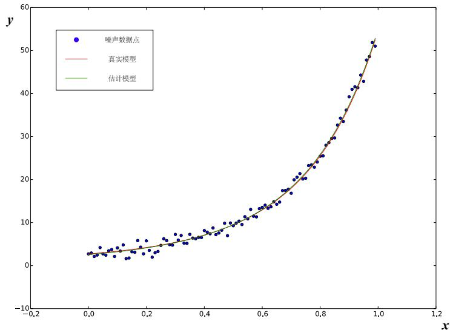

<details>
<summary>scatterplot</summary>

| x     | y (噪声数据点) | y (真实模型) | y (估计模型) |
|-------|----------------|--------------|---------------|
| 0.0   | ~3             | ~3           | ~3            |
| 0.1   | ~4             | ~4           | ~4            |
| 0.2   | ~5             | ~5           | ~5            |
| 0.3   | ~6             | ~6           | ~6            |
| 0.4   | ~7             | ~7           | ~7            |
| 0.5   | ~9             | ~9           | ~9            |
| 0.6   | ~12            | ~12          | ~12           |
| 0.7   | ~16            | ~16          | ~16           |
| 0.8   | ~22            | ~22          | ~22           |
| 0.9   | ~30            | ~30          | ~30           |
| 1.0   | ~52            | ~52          | ~52           |
</details>

图 6-1 使用 Ceres 进行曲线拟合。红线为真实模型，绿线为估计模型，它们非常接近。

## 6.4 实践： $\mathbf { g 2 0 }$

本章的第二个实践部分将介绍另一个（主要在 SLAM 领域）广为使用的优化库： $\mathrm { g 2 o }$ （General Graphic Optimization， $\mathrm { G ^ { 2 } O ) }$ 。它是一个基于图优化的库。图优化是一种将非线性优化与图论结合起来的理论，因此在使用它之前，我们花一点篇幅介绍一个图优化理论。

## 6.4.1 图优化理论简介

我们已经介绍了非线性最小二乘的求解方式。它们是由很多个误差项之和组成的。然而，仅有一组优化变量和许多个误差项，我们并不清楚它们之间的关联。比方说，某一个优化变量 $x _ { j }$ 存在于多少个误差项里呢？我们能保证对它的优化是有意义的吗？进一步，我们希望能够直观地看到该优化问题长什么样。于是，就说到了图优化。

图优化，是把优化问题表现成图（Graph）的一种方式。这里的图是图论意义上的图。一个图由若干个顶点（Vertex），以及连接着这些节点的边（Edge）组成。进而，用顶点表示优化变量，用边表示误差项。于是，对任意一个上述形式的非线性最小二乘问题，我

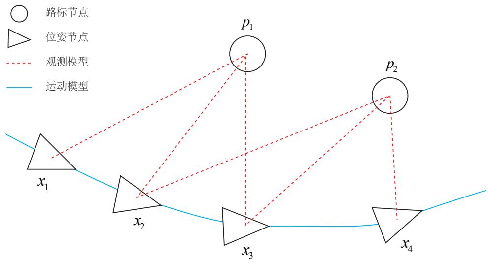

<details>
<summary>flowchart</summary>

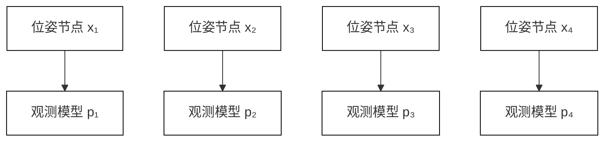
```mermaid
graph TD
  A["位姿节点 x₁"] --> B["观测模型 p₁"]
  C["位姿节点 x₂"] --> D["观测模型 p₂"]
  E["位姿节点 x₃"] --> F["观测模型 p₃"]
  G["位姿节点 x₄"] --> H["观测模型 p₄"]
    style A fill:#fff,stroke:#000
    style C fill:#fff,stroke:#000
    style E fill:#fff,stroke:#000
    style G fill:#fff,stroke:#000
    style B fill:#fff,stroke:#000
    style D fill:#fff,stroke:#000
    style F fill:#fff,stroke:#000
    style H fill:#fff,stroke:#000
```
</details>

图 6-2 图优化的例子。

们可以构建与之对应的一个图。

图 6-2 是一个简单的图优化例子。我们用三角形表示相机位姿节点，用圆形表示路标点，它们构成了图优化的顶点；同时，蓝色线表示相机的运动模型，红色虚线表示观测模型，它们构成了图优化的边。此时，虽然整个问题的数学形式仍是式（6.12）那样，但现在我们可以直观地看到问题的结构了。如果我们希望，也可以做去掉孤立顶点或优先优化边数较多（或按图论的术语，度数较大）的顶点这样的改进。但是最基本的图优化，是用图模型来表达一个非线性最小二乘的优化问题。而我们可以利用图模型的某些性质，做更好的优化。

$\mathrm { g 2 o }$ 为 SLAM 提供了图优化所需的内容。下面我们来演示一下 $\mathrm { g 2 o }$ 的使用方法。

## 6.4.2 g2o 的编译与安装

在使用一个库之前，我们需要对它进行编译和安装。读者应该已经体验很多次这个过程了，它们基本都是大同小异的。关于 $\mathrm { g 2 o }$ ，读者可以从 github 下载它：https://github.com/RainerKuemmerl $\yen 120$ ，或从本书提供的第三方代码库中获得。

解压代码包后，你会看到 $\mathrm { g 2 o }$ 库的所有源码，它也是一个 CMake 工程。我们先来安装它的依赖项（部分依赖项与 Ceres 有重合）：

```txt
1 sudo apt-get install libqt4-dev qt4-qmake libqglviewer-dev libsuitesparse-dev libcxsparse3.1.2 libcholmod-dev
```

然后，按照 cmake 的方式对 g2o 进行编译安装即可，我们略去该过程的说明。安装完成后， $\mathrm { g 2 o }$ 的头文件将在/usr/local/g2o 下，库文件在/usr/local/lib/下。现在，我们重新考虑 Ceres 例程中的曲线拟合实验，在 g2o 中实验一遍。

## 6.4.3 使用 g2o 拟合曲线

为了使用 $\mathrm { { g 2 o } ; }$ ，首先要做的是将曲线拟合问题抽象成图优化。这个过程中，只要记住节点为优化变量，边为误差项即可。因此，曲线拟合的图优化问题可以画成图 6-3 的形式。

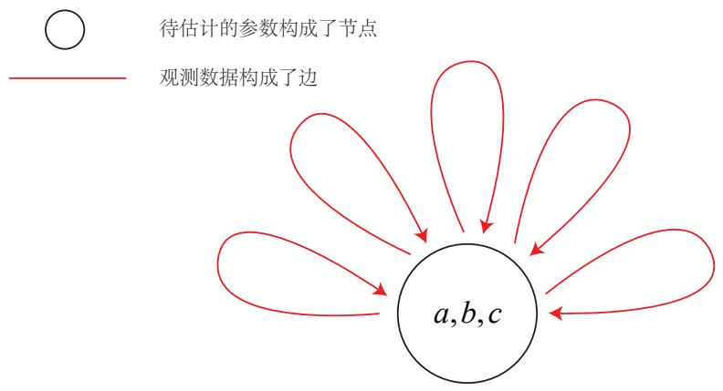

<details>
<summary>flowchart</summary>

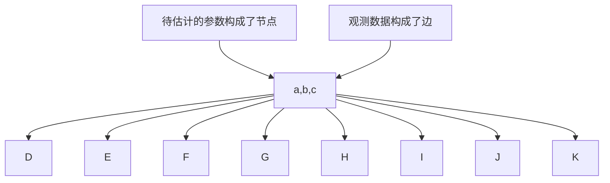
```mermaid
graph TD
  A["待估计的参数构成了节点"] --> B["a,b,c"]
  C["观测数据构成了边"] --> B
  B --> D
  B --> E
  B --> F
  B --> G
  B --> H
  B --> I
  B --> J
  B --> K
```
</details>

图 6-3 曲线拟合对应的图优化模型。（莫明其妙地有些像华为的标志）

在曲线拟合问题中，整个问题只有一个顶点：曲线模型的参数 a, b, c；而每个带噪声的数据点，构成了一个个误差项，也就是图优化的边。但这里的边与我们平时想的边不太一样，它们是一元边（Unary Edge），即只连接一个顶点——因为我们整个图只有一个顶点。所以在图 6-3 中，我们就只能把它画成自己连到自己的样子了。事实上，图优化中一条边可以连接一个、两个或多个顶点，这主要反映在每个误差与多少个优化变量有关。在稍微有些玄妙的说法中，我们把它叫做超边（Hyper Edge），整个图叫做超图（Hyper Graph）①。

弄清了这个图模型之后，接下来就是在 g2o 中建立该模型，进行优化了。作为 g2o 的用户，我们要做的事主要有以下几个步骤：

1. 定义顶点和边的类型；  
2. 构建图；  
3. 选择优化算法；  
4. 调用 g2o 进行优化，返回结果。

下面来演示一下程序。

slambook/ch6/g2o\_curve\_fitting/main.cpp  
```cpp
#include <iostream>
#include <g2o/core/base_vertex.h>
#include <g2o/core/base_unary_edge.h>
#include <g2o/core/block_solver.h>
#include <g2o/core/optimization_algorithm_levenberg.h>
#include <g2o/core/optimization_algorithm_gauss_newton.h>
#include <g2o/core/optimization_algorithm_dogleg.h>
#include <g2oSolvers/dense/linear_solver_dense.h>
#include <Eigen/Core>
#include <opencv2/core/core.hpp>
#include <cmath>
#include <chrono>
using namespace std;

// 曲线模型的顶点，模板参数：优化变量维度和数据类型
class CurveFittingVertex: public g2o::BaseVertex<3, Eigen::Vector3d>
{
public:
    EIGEN_MAKE_ALIGNED_OPERATOR_NEW
    virtual void setOriginImpl() // 重置
    {
    _estimate << 0,0,0;
    }

    virtual void oplusImpl(const double* update) // 更新
    {
    _estimate += Eigen::Vector3d(update);
    }
    // 存盘和读盘：留空
    virtual bool read(istream& in ) {}
    virtual bool write(ostream& out ) const {}
};

// 误差模型 模板参数：观测值维度，类型，连接顶点类型
class CurveFittingEdge: public g2o::BaseUnaryEdge<1,double,CurveFittingVertex>
```

```cpp
public:
    EIGEN_MAKE_ALIGNED_OPERATOR_NEW
    CurveFittingEdge( double x ): BaseUnaryEdge( ), _x(x) {}
    // 计算曲线模型误差
    void computeError()
    {
    const CurveFittingVertex* v = static_cast<const CurveFittingVertex*>(vertices[0]);
    const Eigen::Vector3d abc = v->estimate();
    _error(0,0) = _measurement - std::exp( abc(0,0)*_x*_x + abc(1,0)*_x + abc(2,0) );
    }
    virtual bool read( istream& in ) {}
    virtual bool write( ostream& out ) const {}
public:
    double _x; // x 值，y 值为 _measurement
};

int main( int argc, char** argv )
{
    double a=1.0, b=2.0, c=1.0; // 真实参数值
    int N=100; // 数据点
    double w_sigma=1.0; // 噪声Sigma值
    cv::RNG rng; // OpenCV随机数产生器
    double abc[3] = {0,0,0}; // abc参数的估计值

    vector<double> x_data, y_data; // 数据

    cout<<"generating data: "<<endl;
    for ( int i=0; i<N; i++ )
    {
    double x = i/100.0;
    x_data.push_back ( x );
    y_data.push_back (
    exp ( a*x*x + b*x + c ) + rng.gaussian ( w_sigma )
    );
    cout<<x_data[i]<<" "<<y_data[i]<<endl;
    }

    // 构建图优化，先设定g2o
    // 矩阵块：每个误差项优化变量维度为 3 ，误差值维度为 1
    typedef g2o::BlockSolver< g2o::BlockSolverTraits<3,1> > Block;
    // 线性方程求解器：稠密的增量方程
    Block::LinearSolverType* linearSolver = new g2o::LinearSolverDense<Block::PoseMatrixType>();
    Block* solver_ptr = new Block( linearSolver ); // 矩阵块求解器
    // 梯度下降方法，从GN, LM, DogLeg 中选
    g2o::OptimizationAlgorithmLevenberg* solver = new g2o::OptimizationAlgorithmLevenberg( solver_ptr )
    ; 
    // 取消下面的注释以使用 GN 或 DogLeg
    // g2o::OptimizationAlgorithmGaussNewton* solver = new g2o::OptimizationAlgorithmGaussNewton( solver_ptr );
    // g2o::OptimizationAlgorithmDogleg* solver = new g2o::OptimizationAlgorithmDogleg( solver_ptr );
}
```

```cpp
g2o::SparseOptimizer optimizer; // 图模型
optimizer.setAlgorithm( solver ); // 设置求解器
optimizer.setVerbose( true ); // 打开调试输出

// 往图中增加顶点
CurveFittingVertex* v = new CurveFittingVertex();
v->setEstimate( Eigen::Vector3d(0,0,0) );
v->setId(0);
optimizer.addVertex( v );

// 往图中增加边
for ( int i=0; i<N; i++ )
{
    CurveFittingEdge* edge = new CurveFittingEdge( x_data[i] );
    edge->setId(i);
    edge->setVertex( 0, v ); // 设置连接的顶点
    edge->setMeasurement( y_data[i] ); // 观测数值
    // 信息矩阵：协方差矩阵之逆
    edge->setInformation( Eigen::Matrix<double,1,1>::Identity()*1/(w_sigma*w_sigma) );
    optimizer.addEdge( edge );
}

// 执行优化
cout<<"start optimization"<<endl;
chrono::steady_clock::time_point t1 = chrono::steady_clock::now();
optimizer.initializeOptimization();
optimizer.optimize(100);
chrono::steady_clock::time_point t2 = chrono::steady_clock::now();
chrono::duration<double> time_used = chrono::duration_cast<chrono::duration<double>>( t2-t1 );
cout<<"solve time cost = "<<time_used.count()<<" seconds. "<<endl;

// 输出优化值
Eigen::Vector3d abc_estimate = v->estimate();
cout<<"estimated model: "<<abc_estimate.transpose()<<endl;

return 0;
}
```

在这个程序中，我们从 g2o 派生出了用于曲线拟合的图优化顶点和边：CurveFit-tingVertex 和 CurveFittingEdge，这实质上是扩展了 g2o 的使用方式。在这两个派生类中，我们重写了重要的虚函数：

1. 顶点的更新函数：oplusImpl。我们知道优化过程最重要的是增量 ∆x 的计算，而该函数处理的是 ${ \pmb x } _ { k + 1 } = { \pmb x } _ { k } + \Delta { \pmb x }$ 的过程。

读者会觉得这并不是什么值得一提的事情，因为仅仅是个简单的加法而已，为什么$\mathrm { g 2 o }$ 不帮我们完成呢？在曲线拟合过程中，由于优化变量（曲线参数）本身位于向量空间中，这个更新计算确实就是简单的加法。但是，当优化变量不处于向量空间中时，比方说 x 是相机位姿，它本身不一定有加法运算。这时，就需要重新定义增量如何加到现有的估计上的行为了。按照第四讲的解释，我们可能使用左乘更新或右乘更新，而不是直接的加法。

2. 顶点的重置函数：setToOriginImpl。这是平凡的，我们把估计值置零即可。  
3. 边的误差计算函数：computeError。该函数需要取出边所连接的顶点的当前估计值，根据曲线模型，与它的观测值进行比较。这和最小二乘问题中的误差模型是一致的。  
4. 存盘和读盘函数：read, write。由于我们并不想进行读写操作，就留空了。

定义了顶点和边之后，我们在 main 函数里声明了一个图模型，然后按照生成的噪声数据，往图模型中添加顶点和边，最后调用优化函数进行优化。g2o 会给出优化的结果：

```matlab
% build/curve_fitting
generating data:
0 2.71828
0.01 2.93161
0.02 2.12942
......
iteration= 13 chi2= 101.937020 time= 4.06e-05 cumTime= 0.00048135 edges= 100 schur= 0 lambda= 3678.088107 levenbergIter= 6
iteration= 14 chi2= 101.937020 time= 3.2215e-05 cumTime= 0.000513565 edges= 100 schur= 0 lambda= 19616.469906 levenbergIter= 3
iteration= 15 chi2= 101.937020 time= 0.000108524 cumTime= 0.000622089 edges= 100 schur= 0 lambda= 836969.382664 levenbergIter= 4
iteration= 16 chi2= 101.937020 time= 0.000159817 cumTime= 0.000781906 edges= 100 schur= 0 lambda= 224672257893341.656250 levenbergIter= 7
solve time cost = 0.00173976 seconds.
estimated model: 0.890911 2.1719 0.943629
```

我们使用 L-M 方法进行梯度下降，在迭代了 16 次后，最后优化结果与 Ceres 实验中相差无几。我们亦在程序中提供了使用 G-N 和 DogLeg 下降方式，请读者去掉它们前面的注释符号，自行对比一下各种梯度下降方法的差异。

## 6.5 小结

本节介绍了 SLAM 中经常碰到的一种非线性优化问题：由许多个误差项平方和组成的最小二乘问题。我们介绍了它的定义和求解，并且讨论了两种主要的梯度下降方式：Gauss-Newton 和 Levenberg-Marquardt。在实践部分中，我们分别使用了 Ceres 和 g2o 两种优化库求解同一个曲线拟合问题，发现它们给出了相似的结果。

由于我们还没有详细谈 Bundle Adjustment，所以实践部分选择了曲线拟合这样一个简单但有代表性的例子，以演示一般的非线性最小二乘求解方式。特别地，如果用 g2o 来拟合曲线，我们必须先把问题转换为图优化，定义新的顶点和边，这种做法是有一些迂回的——g2o 的主要目的并不在此。相比之下，Ceres 定义误差项，求曲线拟合问题则自然了很多，因为它本身即是一个优化库。然而，在 SLAM 中，更多的问题是，一个带有许多个相机位姿和许多个空间点的优化问题如何求解。特别地，当相机位姿以李代数表示时，误差项关于相机位姿的导数如何计算，将是一件值得详细讨论的事。我们将在后续的章节中发现， $\mathrm { g 2 o }$ 提供了大量的顶点和边的类型，使得它在相机位姿估计问题中非常方便。而在Ceres 中，我们不得不自己实现每一个 Cost Function，带来了一些不便。

在实践部分的两个程序中，我们没有去计算曲线模型关于三个参数的导数，而是利用了优化库的数值求导，这使得理论和代码都会简洁一些。Ceres 库提供了基于模板元的自动求导和运行时的数值求导，而 $\mathrm { g 2 o }$ 只提供了运行时数值求导这一种方式。但是，对于大多数问题，如果我们能够推导出雅可比矩阵的解析形式并告诉优化库，就可以避免数值求导中的诸多问题。

最后，希望读者能够适应 Ceres 和 $\mathrm { g 2 o }$ 这些大量使用模板编程的方式。也许一开始会看上去比较吓人（特别是 Ceres 设置 Problem 和 $\mathrm { g 2 o }$ 初始化部分的代码），但是一旦熟悉之后，就会觉得这样的方式是自然的，而且容易扩展。我们将在 SLAM 后端章节中，继续讨论稀疏性、核函数、位姿图（Pose Graph）等问题。

## 习题

1. 证明线性方程 Ax = b 当系数矩阵 A 超定时，最小二乘解为 $\pmb { x } = ( \pmb { A } ^ { T } \pmb { A } ) ^ { - 1 } \pmb { A } ^ { T } \pmb { b }$ .  
2. 调研最速下降法、牛顿法、GN 和 LM 各有什么优缺点。除了我们举的 Ceres 库和$\mathrm { g 2 o }$ 库，还有哪些常用的优化库？你可能会找到一些 MATLAB 上的库。  
3. 为什么 GN 的增量方程系数矩阵可能不正定？不正定有什么几何含义？为什么在这种情况下解就不稳定了？  
4. DogLeg 是什么？它与 GN 和 LM 有何异同？请搜索相关的材料，例如①。  
5. 阅读 Ceres 的教学材料以更好地掌握它的用法：http://ceres-solver.org/tutorial.html.  
6. 阅读 $\mathrm { g 2 o }$ 自带的文档，你能看懂它吗？如果还不能完全看懂，请在第十、十一两讲之后回来再看。  
7. \* 请更改曲线拟合实验中的曲线模型，并用 Ceres 和 $\mathrm { g 2 o }$ 进行优化实验。例如，你可以使用更多的参数和更复杂的模型。

## 第 7 讲

## 视觉里程计 1

## 本节目标

1. 理解图像特征点的意义, 并掌握在单幅图像中提取出特征点，及多幅图像中匹配特征点的方法。  
2. 理解对极几何的原理，利用对极几何的约束，恢复出图像之间的摄像机的三维运动。  
3. 理解 PNP 问题，及利用已知三维结构与图像的对应关系，求解摄像机的三维运动。  
4. 理解 ICP 问题，及利用点云的匹配关系，求解摄像机的三维运动。  
5. 理解如何通过三角化，获得二维图像上对应点的三维结构。

本书之前的内容，介绍了运动方程和观测方程的具体形式，并讲解了以非线性优化为主的求解方法。从本讲开始，我们结束了基础知识的铺垫，开始步入正题：按照第二讲的内容，分别介绍视觉里程计、优化后端、回环检测和地图构建四个模块。本讲和下一讲主要介绍作为视觉里程计的主要理论，然后在第九章中进行一次实践。本讲关注基于特征点方式的视觉里程计算法。我们将介绍什么是特征点，如何提取和匹配特征点，以及如何根据配对的特征点估计相机运动。

## 7.1 特征点法

回顾第二讲的内容，我们说过视觉 SLAM 主要分为视觉前端和优化后端。前端也称为视觉里程计（VO）。它根据相邻图像的信息，估计出粗略的相机运动，给后端提供较好的初始值。VO 的实现方法，按是否需要提取特征，分为特征点法的前端以及不提特征的直接法前端。基于特征点法的前端，长久以来（直到现在）被认为是视觉里程计的主流方法。它运行稳定，对光照、动态物体不敏感，是目前比较成熟的解决方案。在本讲中，我们将从特征点法入手，学习如何提取、匹配图像特征点，然后估计两帧之间的相机运动和场景结构，从而实现一个基本的两帧间视觉里程计。

## 7.1.1 特征点

VO 的主要问题是如何根据图像来估计相机运动。然而，图像本身是一个由亮度和色彩组成的矩阵，如果直接从矩阵层面考虑运动估计，将会非常困难。所以，我们习惯于采用这样一种做法：首先，从图像中选取比较有代表性的点。这些点在相机视角发生少量变化后会保持不变，所以我们会在各个图像中找到相同的点。然后，在这些点的基础上，讨论相机位姿估计问题，以及这些点的定位问题。在经典 SLAM 模型中，把它们称为路标。而在视觉 SLAM 中，路标则是指图像特征（Features）。

根据维基百科的定义，图像特征是一组与计算任务相关的信息，计算任务取决于具体的应用 [29]。简而言之，特征是图像信息的另一种数字表达形式。一组好的特征对于在指定任务上的最终表现至关重要，所以多年来研究者们花费了大量的精力对特征进行研究。数字图像在计算机中以灰度值矩阵的方式存储，所以最简单的，单个图像像素也是一种“特征”。但是，在视觉里程计中，我们希望特征点在相机运动之后保持稳定，而灰度值受光照、形变、物体材质的影响严重，在不同图像之间变化非常大，不够稳定。理想的情况是，当场景和相机视角发生少量改变时，我还能从图像中判断哪些地方是同一个点，因此仅凭灰度值是不够的，我们需要对图像提取特征点。

特征点是图像里一些特别的地方。以图 7-1 为例。我们可以把图像中的角点、边缘和区块都当成图像中有代表性的地方。不过，我们更容易精确地指出，某两幅图像当中出现了同一个角点；同一个边缘则稍微困难一些，因为沿着该边缘前进，图像局部是相似的；同一个区块则是最困难的。我们发现，图像中的角点、边缘相比于像素区块而言更加“特别”，它们不同图像之间的辨识度更强。所以，一种直观的提取特征的方式就是在不同图像间辨认角点，确定它们的对应关系。在这种做法中，角点就是所谓的特征。

然而，在大多数应用中，单纯的角点依然不能满足很多我们的需求。例如，从远处看上去是角点的地方，当相机走近之后，可能就不显示为角点了。或者，当我旋转相机时，角点的外观会发生变化，我们也就不容易辨认出那是同一个角点。为此，计算机视觉领域的研究者们在长年的研究中，设计了许多更加稳定的局部图像特征，如著名的 SIFT[30], SURF[31],ORB[32] 等等。相比于朴素的角点，这些人工设计的特征点能够拥有如下的性质：

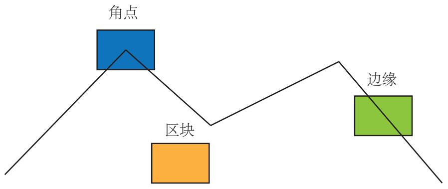

<details>
<summary>flowchart</summary>

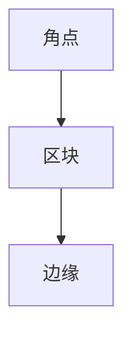
```mermaid
graph TD
  A["角点"] --> B["区块"]
  B --> C["边缘"]
```
</details>

图 7-1 可以作为图像特征的部分：角点、边缘、区块

1. 可重复性（Repeatability）：相同的“区域”可以在不同的图像中被找到。  
2. 可区别性（Distinctiveness）：不同的“区域”有不同的表达。  
3. 高效率（Efficiency）：同一图像中，特征点的数量应远小于像素的数量。  
4. 本地性（Locality）：特征仅与一小片图像区域相关。

特征点由关键点（Key-point）和描述子（Descriptor）两部分组成。比方说，当我们谈论 SIFT 特征时，是指“提取 SIFT 关键点，并计算 SIFT 描述子”两件事情。关键点是指该特征点在图像里的位置，有些特征点还具有朝向、大小等信息。描述子通常是一个向量，按照某种人为设计的方式，描述了该关键点周围像素的信息。描述子是按照“外观相似的特征应该有相似的描述子”的原则设计的。因此，只要两个特征点的描述子在向量空间上的距离相近，就可以认为它们是同样的特征点。

历史上，研究者提出过许多图像特征。它们有些很精确，在相机的运动和光照变化下仍具有相似的表达，但相应地需要较大的计算量。其中，SIFT(尺度不变特征变换，Scale-Invariant Feature Transform) 当属最为经典的一种。它充分考虑了在图像变换过程中出现的光照，尺度，旋转等变化，但随之而来的是极大的计算量。由于整个 SLAM 过程中，图像特征的提取与匹配仅仅是诸多环节中的一个，到目前（2016 年）为止，普通 PC 的 CPU还无法实时地计算 SIFT 特征，进行定位与建图。所以在 SLAM 中我们甚少使用这种“奢侈”的图像特征。

另一些特征，则考虑适当降低精度和鲁棒性，提升计算的速度。例如 FAST 关键点属于计算特别快的一种特征点（注意这里“关键点”的用词，说明它没有描述子）。而 ORB（Oriented FAST and Rotated BRIEF）特征则是目前看来非常具有代表性的实时图像特征。它改进了 FAST 检测子 [33] 不具有方向性的问题，并采用速度极快的二进制描述子BRIEF[34]，使整个图像特征提取的环节大大加速。根据作者在论文中的测试，在同一幅图像中同时提取约 1000 个特征点的情况下，ORB 约要花费 15.3ms，SURF 约花费 217.3ms，SIFT 约花费 5228.7ms。由此可以看出 ORB 在保持了特征子具有旋转，尺度不变性的同时，速度方面提升明显，对于实时性要求很高的 SLAM 来说是一个很好的选择。

大部分特征提取都具有较好的并行性，可以通过 GPU 等设备来加速计算。经过 GPU加速后的 SIFT，就可以满足实时计算要求。但是，引入 GPU 将带来整个 SLAM 成本的提升。由此带来的性能提升，是否足以抵去付出的计算成本，需要系统的设计人员仔细考量。在目前的 SLAM 方案中，ORB 是质量与性能之间较好的折中，因此我们以 ORB 为代表，介绍提取特征的整个过程。

## 7.1.2 ORB 特征

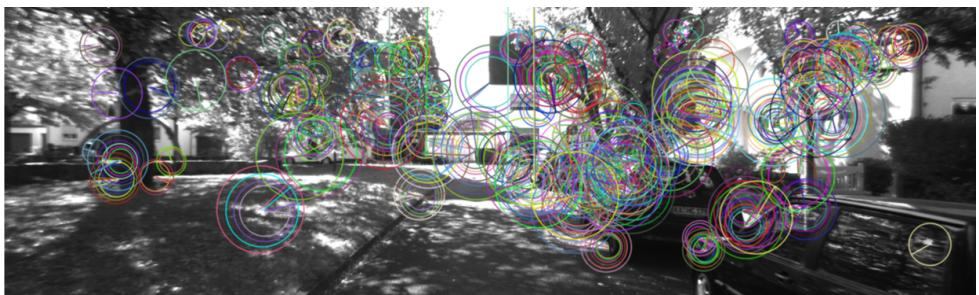

<details>
<summary>natural_image</summary>

Black-and-white outdoor scene with colorful circular overlays and trees, no visible text or symbols
</details>

图 7-2 OpenCV 提供的 ORB 特征点检测结果。

ORB 特征亦由关键点和描述子两部分组成。它的关键点称为“Oriented FAST”，是一种改进的 FAST 角点，什么是 FAST 角点我们将在下文介绍。它的描述子称为 BRIEF（Binary Robust Independent Elementary Features）。因此，提取 ORB 特征分为两个步骤：

1. FAST 角点提取：找出图像中的” 角点”。相较于原版的 FAST, ORB 中计算了特征点的主方向，为后续的 BRIEF 描述子增加了旋转不变特性。  
2. BRIEF 描述子：对前一步提取出特征点的周围图像区域进行描述。

下面我们分别介绍 FAST 和 BRIEF。

## FAST 关键点

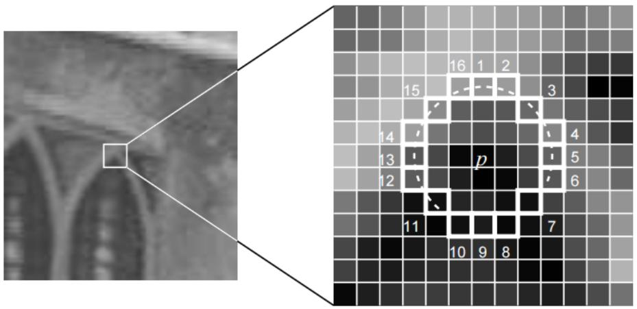

<details>
<summary>text_image</summary>

Diagram showing a pixelated grid with numbered cells and a magnified view of a grayscale image, likely illustrating a pattern or segmentation.
</details>

图 7-3 FAST 特征点 [33]。

FAST 是一种角点，主要检测局部像素灰度变化明显的地方，以速度快著称。它的思想是：如果一个像素与它邻域的像素差别较大（过亮或过暗）, 那它更可能是角点。相比于其他角点检测算法，FAST 只需比较像素亮度的大小，十分快捷。它的检测过程如下（见图 7-3 ）：

1. 在图像中选取像素 $p _ { : }$ ，假设它的亮度为 $I _ { p }$ 。  
2. 设置一个阈值 T(比如 $I _ { p }$ 的 20%)。  
3. 以像素 p 为中心, 选取半径为 3 的圆上的 16 个像素点。  
4. 假如选取的圆上，有连续的 N 个点的亮度大于 $I _ { p } + T$ 或小于 $I _ { p } - T$ ，那么像素 p可以被认为是特征点 (N 通常取 12，即为 FAST-12。其它常用的 N 取值为 9 和 11，他们分别被称为 FAST-9，FAST-11)。  
5. 循环以上四步，对每一个像素执行相同的操作。

在 FAST-12 算法中，为了更高效，可以添加一项预测试操作，以快速地排除绝大多数不是角点的像素。具体操作为，对于每个像素，直接检测邻域圆上的第 1，5，9，13 个像素的亮度。只有当这四个像素中有三个同时大于 $I _ { p } + T$ 或小于 $I _ { p } - T$ 时，当前像素才有可能是一个角点，否则应该直接排除。这样的预测试操作大大加速了角点检测。此外，原始的 FAST 角点经常出现“扎堆”的现象。所以在第一遍检测之后，还需要用非极大值抑制（Non-maximal suppression），在一定区域内仅保留响应极大值的角点，避免角点集中的问题。

FAST 特征点的计算仅仅是比较像素间亮度的差异，速度非常快，但它也有一些问题。首先，FAST 特征点数量很大且不确定，而我们往往希望对图像提取固定数量的特征。因此，在 ORB 中，对原始的 FAST 算法进行了改进。我们可以指定最终要提取的角点数量N，对原始 FAST 角点分别计算 Harris 响应值，然后选取前 N 个具有最大响应值的角点，作为最终的角点集合。

其次，FAST 角点不具有方向信息。而且，由于它固定取半径为 3 的圆，存在尺度问题：远处看着像是角点的地方，接近后看可能就不是角点了。针对 FAST 角点不具有方向性和尺度的弱点，ORB 添加了尺度和旋转的描述。尺度不变性由构建图像金字塔①，并在金字塔的每一层上检测角点来实现。而特征的旋转是由灰度质心法（Intensity Centroid）实现的。我们稍微介绍一下。

质心是指以图像块灰度值作为权重的中心。其具体操作步骤如下 [35]：

1. 在一个小的图像块 B 中，定义图像块的矩为：

$$
m _ {p q} = \sum_ {x, y \in B} x ^ {p} y ^ {q} I (x, y), \quad p, q = \{0, 1 \}.
$$

2. 通过矩可以找到图像块的质心：

$$
C = (\frac {m _ {1 0}}{m _ {0 0}}, \frac {m _ {0 1}}{m _ {0 0}}).
$$

3. 连接图像块的几何中心 O 与质心 C，得到一个方向向量 $\overrightarrow { O C }$ ，于是特征点的方向可以定义为：

$$
\theta = \arctan (m _ {0 1} / m _ {1 0}).
$$

通过以上方法，FAST 角点便具有了尺度与旋转的描述，大大提升了它们在不同图像之间表述的鲁棒性。所以在 ORB 中，把这种改进后的 FAST 称为 Oriented FAST。

## BRIEF 描述子

在提取 Oriented FAST 关键点后，我们对每个点计算其描述子。ORB 使用改进的BRIEF 特征描述。我们先来讲 BRIEF 是什么。

BRIEF 是一种二进制描述子，它的描述向量由许多个 0 和 1 组成，这里的 0 和 1 编码了关键点附近两个像素（比如说 $p$ 和 $q )$ ）的大小关系：如果 $p$ 比 $q$ 大，则取 1，反之就取 $0 _ { \circ }$ 。如果我们取了 128 个这样的 $p , q ,$ ，最后就得到 128 维由 0，1 组成的向量。那么， $p$ 和 $q$ 如何选取呢？在作者原始的论文中给出了若干种挑选方法，大体上都是按照某种概率分布，随机地挑选 $p$ 和 $q$ 的位置，读者可以阅读 BRIEF 论文或 OpenCV 源码以查看它的具体实现 [34]。BRIEF 使用了随机选点的比较，速度非常快，而且由于使用了二进制表达，存储起来也十分方便，适用于实时的图像匹配。原始的 BRIEF 描述子不具有旋转不变性的，因此在图像发生旋转时容易丢失。而 ORB 在 FAST 特征点提取阶段计算了关键点的方向，所以可以利用方向信息，计算了旋转之后的“Steer BRIEF”特征，使 ORB 的描述子具有较好的旋转不变性。

由于考虑到了旋转和缩放，使得 ORB 在平移、旋转、缩放的变换下仍有良好的表现。同时，FAST 和 BRIEF 的组合也非常的高效，使得 ORB 特征在实时 SLAM 中非常受欢迎。我们在图 7-2 中展示了一张图像提取 ORB 之后的结果，下面来介绍如何在不同的图像之间进行特征匹配。

## 7.1.3 特征匹配

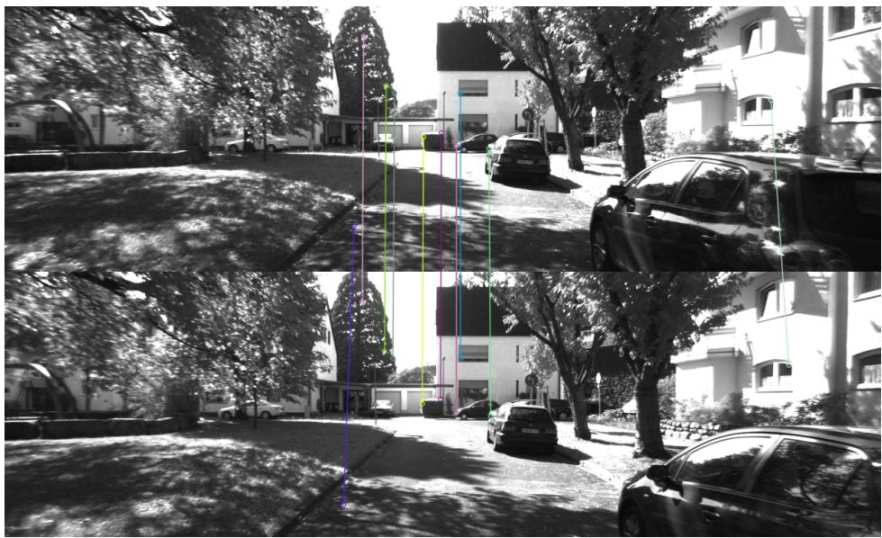

<details>
<summary>natural_image</summary>

Black-and-white street scene with parked cars and residential buildings, no visible text or symbols
</details>

图 7-4 两帧图像间的特征匹配。

特征匹配是视觉 SLAM 中极为关键的一步，宽泛地说，特征匹配解决了 SLAM 中的数据关联问题（data association），即确定当前看到的路标与之前看到的路标之间的对应关系。通过对图像与图像，或者图像与地图之间的描述子进行准确的匹配，我们可以为后续的姿态估计，优化等操作减轻大量负担。然而，由于图像特征的局部特性，误匹配的情况广泛存在，而且长期以来一直没有得到有效解决，目前已经成为视觉 SLAM 中制约性能提升的一大瓶颈。部分原因是因为场景中经常存在大量的重复纹理，使得特征描述非常相似。在这种情况下，仅利用局部特征解决误匹配是非常困难的。

不过，让我们先来看正确匹配的情况，等做完实验再回头去讨论误匹配问题。考虑两个时刻的图像。如果在图像 $I _ { t }$ 中提取到特征点 $x _ { t } ^ { m } , \ m = 1 , 2 , . . . , M$ ，在图像 $I _ { t + 1 }$ 中提取到特征点 $x _ { t + 1 } ^ { n } , \ n = 1 , 2 , . . . , N$ ，如何寻找这两个集合元素的对应关系呢？最简单的特征匹配方法就是暴力匹配（Brute-Force Matcher）。即对每一个特征点 $x _ { t } ^ { m }$ ，与所有的 $x _ { t + 1 } ^ { n }$ 测量描述子的距离，然后排序，取最近的一个作为匹配点。描述子距离表示了两个特征之间的相似程度，不过在实际运用中还可以取不同的距离度量范数。对于浮点类型的描述子，使用欧氏距离进行度量即可。而对于二进制的描述子（比如 BRIEF 这样的），我们往往使用汉明距离（Hamming distance）做为度量——两个二进制串之间的汉明距离，指的是它们不同位数的个数。

然而，当特征点数量很大时，暴力匹配法的运算量将变得很大，特别是当我们想要匹配一个帧和一张地图的时候。这不符合我们在 SLAM 中的实时性需求。此时快速近似最近邻（FLANN）算法更加适合于匹配点数量极多的情况。由于这些匹配算法理论已经成熟，而且实现上也已集成到 OpenCV，所以我们这里就不再描述它的技术细节了。感兴趣的读者，可以阅读 [36] 作为参考。

## 7.2 实践：特征提取和匹配

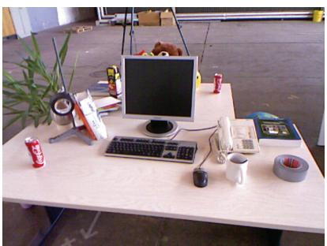

<details>
<summary>natural_image</summary>

Office desk setup with computer, keyboard, mouse, and office supplies (no visible text or symbols)
</details>

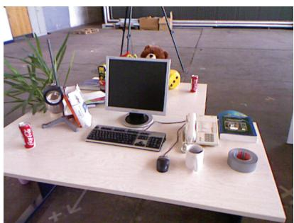

<details>
<summary>natural_image</summary>

Office desk setup with computer, keyboard, mouse, and scattered items (no visible text or symbols)
</details>

图 7-5 实验使用的两帧图像。

目前主流的几种图像特征在 OpenCV 开源图像库中都已经集成完毕，我们可以很方便地进行调用。下面我们来实际练习一下 OpenCV 的图像特征提取、计算和匹配的过程。我们为此实验准备了两张图像，位于 slambook/ch7/下的 1.png 和 2.png，如图 7-5 所示。它们是来自公开数据集 [37] 中的两张图像，我们看到相机发生了微小的运动。本节演示如何提取 ORB 特征，并进行匹配。下个程序将演示如何估计相机运动。

特征提取与匹配代码：

slambook/ch7/feature\_extraction.cpp  
```cpp
#include <iostream>
#include <opencv2/core/core.hpp>
#include <opencv2/features2d/features2d.hpp>
#include <opencv2/highgui/highgui.hpp>

using namespace std;
using namespace cv;

int main ( int argc, char** argv )
{
    if ( argc != 3 )
    {
    cout<<"usage: feature_extraction img1 img2"<<endl;
    return 1;
    }
    //-- 读取图像
    Mat img_1 = imread ( argv[1], CV_LOAD_IMAGE_COLOR );
    Mat img_2 = imread ( argv[2], CV_LOAD_IMAGE_COLOR );

    //-- 初始化
    std::vector<KeyPoint> keypoints_1, keypoints_2;
    Mat descriptors_1, descriptors_2;
    Ptr<ORB> orb = ORB::create ( 500, 1.2f, 8, 31, 0, 2, ORB::HARRIS_SCORE,31,20 );

    //-- 第一步：检测 Oriented FAST 角点位置
    orb->detect ( img_1, keypoints_1 );
    orb->detect ( img_2, keypoints_2 );

    //-- 第二步：根据角点位置计算 BRIEF 描述子
    orb->compute ( img_1, keypoints_1, descriptors_1 );
    orb->compute ( img_2, keypoints_2, descriptors_2 );

    Mat outimg1;
    drawKeypoints( img_1, keypoints_1, outimg1, Scalar::all(-1), DrawMatchesFlags::DEFAULT );
    imshow("ORB特征点",outimg1);

    //-- 第三步：对两幅图像中的BRIEF描述子进行匹配，使用 Hamming 距离
    vector<DMatch> matches;
    BFMatcher matcher ( NORM_HAMMING );
    matcher.match ( descriptors_1, descriptors_2, matches );

    //-- 第四步：匹配点对筛选
    double min_dist=10000, max_dist=0;
```

```txt
// 找出所有匹配之间的最小距离和最大距离，即是最相似的和最不相似的两组点之间的距离
for ( int i = 0; i < descriptors_1.rows; i++ )
{
    double dist = matches[i].distance;
    if ( dist < min_dist ) min_dist = dist;
    if ( dist > max_dist ) max_dist = dist;
}

printf ( "-- Max dist : %f \n", max_dist );
printf ( "-- Min dist : %f \n", min_dist );

// 当描述子之间的距离大于两倍的最小距离时，即认为匹配有误。
// 但有时候最小距离会非常小，设置一个经验值作为下限。
std::vector< DMatch > good_matches;
for ( int i = 0; i < descriptors_1.rows; i++ )
{
    if ( matches[i].distance <= max(2*min_dist, 30.0) )
    {
    good_matches.push_back ( matches[i] );
    }
}

//-- 第五步：绘制匹配结果
Mat img_match;
Mat img_goodmatch;
drawMatches ( img_1, keypoints_1, img_2, keypoints_2, matches, img_match );
drawMatches ( img_1, keypoints_1, img_2, keypoints_2, good_matches, img_goodmatch );
imshow ("所有匹配点对", img_match );
imshow ("优化后匹配点对", img_goodmatch );
waitFor(0);

return 0;
}
```

运行此程序（需要输入两个图像位置），将输出运行结果：

```batch
% build/feature_extraction 1.png 2.png
-- Max dist : 95.000000
-- Min dist : 4.000000
```

图 7-6 显示了例程的运行结果。我们看到未筛选的匹配中带有大量的误匹配。经过一次筛选之后，匹配数量减少了许多，但大多数匹配都是正确的。这里，我们筛选的依据是汉明距离小于最小距离的两倍，这是一种工程上的经验方法，不一定有理论依据。不过，尽管在示例图像中能够筛选出正确的匹配，但我们仍然不能保证在所有其他图像中得到的匹配全是正确的。因此，在后面的运动估计中，还需要使用去除误匹配的算法。

接下来，我们希望根据匹配的点对，估计相机的运动。这里由于相机的原理不同，情况发生了变化：

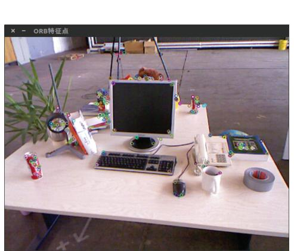

<details>
<summary>natural_image</summary>

Office desk setup with computer, keyboard, phone call, and scattered items (no visible text or symbols)
</details>

ORB关键点

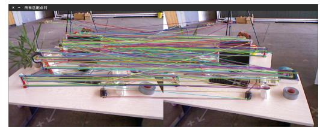

<details>
<summary>natural_image</summary>

Experimental setup with colorful wires and components on a table, no visible text or symbols
</details>

未筛选的匹配

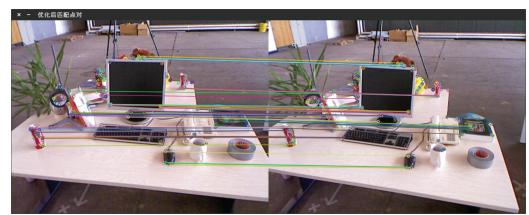

<details>
<summary>natural_image</summary>

Office workspace with two computer monitors and scattered electronic devices (no visible text or symbols)
</details>

筛选后的匹配  
图 7-6 特征提取与匹配结果。

1. 当相机为单目时，我们只知道 2D 的像素坐标，因而问题是根据两组 2D 点估计运动。该问题用对极几何来解决。  
2. 当相机为双目、RGB-D 时，或者我们通过某种方法得到了距离信息，那问题就是根据两组 3D 点估计运动。该问题通常用 ICP 来解决。  
3. 如果我们有 3D 点和它们在相机的投影位置，也能估计相机的运动。该问题通过 $\mathbf { P n P }$ 求解。

因此，下面几节的内容，我们就来介绍这三种情形下的相机运动估计。我们将从最基本的 2D-2D 情形出发，看看它如何求解，求解过程又具有哪些麻烦的问题。

## 7.3 2D-2D: 对极几何

## 7.3.1 对极约束

现在，假设我们从两张图像中，得到了一对配对好的特征点，像图 7-7 里显示的那样。如果我们有若干对这样的匹配点，就可以通过这些二维图像点的对应关系，恢复出在两帧之间摄像机的运动。这里“若干对”具体是多少对呢？我们会在下文介绍。先来看看两个图像当中的匹配点有什么几何关系吧。

以图 7-7 为例，我们希望求取两帧图像 $I _ { 1 } , I _ { 2 }$ 之间的运动，设第一帧到第二帧的运动为R,t。两个相机中心分别为 $O _ { 1 } , O _ { 2 }$ 。现在，考虑 $I _ { 1 }$ 中有一个特征点 $p _ { 1 }$ ，它在 $I _ { 2 }$ 中对应着特征点 $p _ { 2 }$ 。我们晓得这俩是通过特征匹配得到的。如果匹配正确，说明它们确实是同一个空间点在两个成像平面上的投影。这里我们需要一些术语来描述它们之间的几何关系。首先，连线 $\overrightarrow { O _ { 1 } p _ { 1 } }$ 和连线 $\overrightarrow { O _ { 2 } p _ { 2 } }$ 在三维空间中会相交于点 $P _ { \circ }$ 。这时候点 $O _ { 1 } , O _ { 2 } , P$ 三个点可以确定一个平面，称为极平面（Epipolar plane）。 $O _ { 1 } O _ { 2 }$ 连线与像平面 $I _ { 1 } , I _ { 2 }$ 的交点分别为 $e _ { 1 } , e _ { 2 } \circ e _ { 1 } , e _ { 2 }$ ，称为极点（Epipoles）， $O _ { 1 } O _ { 2 }$ 被称为基线（Baseline）。称极平面与两个像平面 $I _ { 1 } , I _ { 2 }$ 之间的相交线 $l _ { 1 } , l _ { 2 }$ 为极线（Epipolar line）。

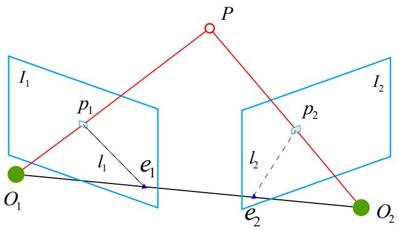

<details>
<summary>text_image</summary>

I₁
P
p₁
l₁
e₁
O₁
I₂
p₂
l₂
e₂
O₂
</details>

图 7-7 对极几何约束。

直观上讲，从第一帧的角度上看，射线 $\overrightarrow { O _ { 1 } p _ { 1 } }$ 是某个像素可能出现的空间位置——因为该射线上的所有点都会投影到同一个像素点。同时，如果不知道 P 的位置，那么当我们在第二个图像上看时，连线 $\overrightarrow { e _ { 2 } p _ { 2 } }$ （也就是第二个图像中的极线）就是 P 可能出现的投影的位置，也就是射线 $\overrightarrow { O _ { 1 } p _ { 1 } }$ 在第二个相机中的投影。现在，由于我们通过特征点匹配，确定了 $p _ { 2 }$ 的像素位置，所以能够推断 P 的空间位置，以及相机的运动。要提醒读者的是，这都是多亏了正确的特征匹配。如果没有特征匹配，我们就没法确定 $p _ { 2 }$ 到底在极线的哪个位置了。那时，就必须在极线上搜索以获得正确的匹配，这将在第 13 讲中提到。

现在，我们从代数角度来看一下这里出现的几何关系。在第一帧的坐标系下，设 P 的空间位置为：

$$
\boldsymbol {P} = [ X, Y, Z ] ^ {T}.
$$

根据第 5 讲介绍的针孔相机模型，我们知道两个像素点 $\mathbf { \boldsymbol { p } } _ { 1 } , \mathbf { \boldsymbol { p } } _ { 2 }$ 的像素位置为：

$$
s _ {1} \boldsymbol {p} _ {1} = \boldsymbol {K} \boldsymbol {P}, \quad s _ {2} \boldsymbol {p} _ {2} = \boldsymbol {K} (\boldsymbol {R} \boldsymbol {P} + t). \tag {7.1}
$$

这里 K 为相机内参矩阵，R,t 为两个坐标系的相机运动（如果我们愿意，也可以写成李代数形式）。如果使用齐次坐标，我们也可以把上式写成在乘以非零常数下成立的（up

to a scale）等式①：

$$
\boldsymbol {p} _ {1} = \boldsymbol {K} \boldsymbol {P}, \quad \boldsymbol {p} _ {2} = \boldsymbol {K} (\boldsymbol {R} \boldsymbol {P} + \boldsymbol {t}). \tag {7.2}
$$

现在，取：

$$
\boldsymbol {x} _ {1} = \boldsymbol {K} ^ {- 1} \boldsymbol {p} _ {1}, \quad \boldsymbol {x} _ {2} = \boldsymbol {K} ^ {- 1} \boldsymbol {p} _ {2}. \tag {7.3}
$$

这里的 $\mathbf { \boldsymbol { x } } _ { 1 } , \mathbf { \boldsymbol { x } } _ { 2 }$ 是两个像素点的归一化平面上的坐标。代入上式，得：

$$
\boldsymbol {x} _ {2} = \boldsymbol {R} \boldsymbol {x} _ {1} + \boldsymbol {t}. \tag {7.4}
$$

两边同时左乘 t∧。回忆 ∧ 的定义，这相当于两侧同时与 t 做外积：

$$
\boldsymbol {t} ^ {\wedge} \boldsymbol {x} _ {2} = \boldsymbol {t} ^ {\wedge} \boldsymbol {R} \boldsymbol {x} _ {1}. \tag {7.5}
$$

然后，两侧同时左乘 $\pmb { x } _ { 2 } ^ { T }$ ：

$$
\boldsymbol {x} _ {2} ^ {T} \boldsymbol {t} ^ {\wedge} \boldsymbol {x} _ {2} = \boldsymbol {x} _ {2} ^ {T} \boldsymbol {t} ^ {\wedge} \boldsymbol {R} \boldsymbol {x} _ {1}. \tag {7.6}
$$

观察等式左侧， $\pmb { t } ^ { \wedge } \pmb { x } _ { 2 }$ 是一个与 t 和 $\mathbf { \delta x } _ { 2 }$ 都垂直的向量。把它再和 $\mathbf { \boldsymbol { x } } _ { 2 }$ 做内积时，将得到 0。因此，我们就得到了一个简洁的式子：

$$
\boldsymbol {x} _ {2} ^ {T} \boldsymbol {t} ^ {\wedge} \boldsymbol {R} \boldsymbol {x} _ {1} = 0. \tag {7.7}
$$

重新代入 $\mathbf { \boldsymbol { p } } _ { 1 } , \mathbf { \boldsymbol { p } } _ { 2 }$ ，有：

$$
\boldsymbol {p} _ {2} ^ {T} \boldsymbol {K} ^ {- T} \boldsymbol {t} ^ {\wedge} \boldsymbol {R} \boldsymbol {K} ^ {- 1} \boldsymbol {p} _ {1} = 0. \tag {7.8}
$$

这两个式子都称为对极约束，它以形式简洁著名。它的几何意义是 $O _ { 1 } , P , O _ { 2 }$ 三者共面。对极约束中同时包含了平移和旋转。我们把中间部分记作两个矩阵：基础矩阵（Fun-damental Matrix）F 和本质矩阵（Essential Matrix）E，可以进一步简化对极约束：

$$
\boldsymbol {E} = \boldsymbol {t} ^ {\wedge} \boldsymbol {R}, \quad \boldsymbol {F} = \boldsymbol {K} ^ {- T} \boldsymbol {E} \boldsymbol {K} ^ {- 1}, \quad \boldsymbol {x} _ {2} ^ {T} \boldsymbol {E} \boldsymbol {x} _ {1} = \boldsymbol {p} _ {2} ^ {T} \boldsymbol {F} \boldsymbol {p} _ {1} = 0. \tag {7.9}
$$

对极约束简洁地给出了两个匹配点的空间位置关系。于是，相机位姿估计问题变为以下两步：

1. 根据配对点的像素位置，求出 E 或者 F；  
2. 根据 E 或者 F，求出 R, t。

由于 E 和 F 只相差了相机内参，而内参在 SLAM 中通常是已知的①，所以实践当中往往使用形式更简单的 E。我们以 E 为例，介绍上面两个问题如何求解。

## 7.3.2 本质矩阵

根据定义，本质矩阵 ${ \pmb E } = { \pmb t } ^ { \wedge } { \pmb R }$ 。它是一个 3×3 的矩阵，内有 9 个未知数。那么，是不是任意一个 3×3 的矩阵都可以被当成本质矩阵呢？从 E 的构造方式上看，有以下值得注意的地方：

• 本质矩阵是由对极约束定义的。由于对极约束是等式为零的约束，所以对 E 乘以任意非零常数后，对极约束依然满足。我们把这件事情称为 E 在不同尺度下是等价的。  
• 根据 ${ \pmb E } = { \pmb t } ^ { \wedge } { \pmb R } .$ ，可以证明 [3]，本质矩阵 E 的奇异值必定是 $[ \sigma , \sigma , 0 ] ^ { T }$ 的形式。这称为本质矩阵的内在性质。  
• 另一方面，由于平移和旋转各有三个自由度，故 t∧R 共有六个自由度。但由于尺度等价性，故 E 实际上有五个自由度。

E 具有五个自由度的事实，表明我们最少可以用五对点来求解 E。但是，E 的内在性质是一种非线性性质，在求解线性方程时会带来麻烦，因此，也可以只考虑它的尺度等价性，使用八对点来估计 E——这就是经典的八点法（Eight-point-algorithm）[38, 39]。八点法只利用了 E 的线性性质，因此可以在线性代数框架下求解。下面我们来看八点法是如何工作的。

考虑一对匹配点，它们的归一化坐标为： $\pmb { x } _ { 1 } = [ u _ { 1 } , v _ { 1 } , 1 ] ^ { T } , \pmb { x } _ { 2 } = [ u _ { 2 } , v _ { 2 } , 1 ] ^ { T }$ 。根据对 极约束，有:

$$
\left(u _ {1}, v _ {1}, 1\right) \left( \begin{array}{c c c} e _ {1} & e _ {2} & e _ {3} \\ e _ {4} & e _ {5} & e _ {6} \\ e _ {7} & e _ {8} & e _ {9} \end{array} \right) \left( \begin{array}{c} u _ {2} \\ v _ {2} \\ 1 \end{array} \right) = 0. \tag {7.10}
$$

我们把矩阵 E 展开，写成向量的形式：

$$
\boldsymbol {e} = \left[ e _ {1}, e _ {2}, e _ {3}, e _ {4}, e _ {5}, e _ {6}, e _ {7}, e _ {8}, e _ {9} \right] ^ {T},
$$

那么对极约束可以写成与 e 有关的线性形式：

$$
\left[ u _ {1} u _ {2}, u _ {1} v _ {2}, u _ {1}, v _ {1} u _ {2}, v _ {1} v _ {2}, v _ {1}, u _ {2}, v _ {2}, 1 \right] \cdot \boldsymbol {e} = 0. \tag {7.11}
$$

同理，对于其它点对也有相同的表示。我们把所有点都放到一个方程中，变成线性方程组 $( u ^ { i } , v ^ { i }$ 表示第 i 个特征点，以此类推）：

$$
\left( \begin{array}{c c c c c c c c c} u _ {1} ^ {1} u _ {2} ^ {1} & u _ {1} ^ {1} v _ {2} ^ {1} & u _ {1} ^ {1} & v _ {1} ^ {1} u _ {2} ^ {1} & v _ {1} ^ {1} v _ {2} ^ {1} & v _ {1} ^ {1} & u _ {2} ^ {1} & v _ {2} ^ {1} & 1 \\ u _ {1} ^ {2} u _ {2} ^ {2} & u _ {1} ^ {2} v _ {2} ^ {2} & u _ {1} ^ {2} & v _ {1} ^ {2} u _ {2} ^ {2} & v _ {1} ^ {2} v _ {2} ^ {2} & v _ {1} ^ {2} & u _ {2} ^ {2} & v _ {2} ^ {2} & 1 \\ \vdots & \vdots & \vdots & \vdots & \vdots & \vdots & \vdots & \vdots \\ u _ {1} ^ {8} u _ {2} ^ {8} & u _ {1} ^ {8} v _ {2} ^ {8} & u _ {1} ^ {8} & v _ {1} ^ {8} u _ {2} ^ {8} & v _ {1} ^ {8} v _ {2} ^ {8} & v _ {1} ^ {8} & u _ {2} ^ {8} & v _ {2} ^ {8} & 1 \end{array} \right) \left( \begin{array}{l} e _ {1} \\ e _ {2} \\ e _ {3} \\ e _ {4} \\ e _ {5} \\ e _ {6} \\ e _ {7} \\ e _ {8} \\ e _ {9} \end{array} \right) = 0. \tag {7.12}
$$

这八个方程构成了一个线性方程组。它的系数矩阵由特征点位置构成，大小为 $8 \times 9$ 。e 位于该矩阵的零空间中。如果系数矩阵是满秩的（即秩为 8），那么它的零空间维数为 1，也就是 e 构成一条线。这与 e 的尺度等价性是一致的。如果八对匹配点组成的矩阵满足秩为 8 的条件，那么 E 的各元素就可由上述方程解得。

接下来的问题是如何根据已经估得的本质矩阵 E，恢复出相机的运动 R,t。这个过程是由奇异值分解（SVD）得到的。设 E 的 SVD 分解为：

$$
\boldsymbol {E} = \boldsymbol {U} \boldsymbol {\Sigma} \boldsymbol {V} ^ {T}, \tag {7.13}
$$

其中 U,V 为正交阵，Σ 为奇异值矩阵。根据 E 的内在性质，我们知道 ${ \pmb { \Sigma } } = d i a g ( { \sigma } , { \sigma } , 0 )$ 。在 SVD 分解中，对于任意一个 E，存在两个可能的 t,R 与它对应：

$$
\boldsymbol {t} _ {1} ^ {\wedge} = \boldsymbol {U} \boldsymbol {R} _ {Z} (\frac {\pi}{2}) \boldsymbol {\Sigma} \boldsymbol {U} ^ {T}, \quad \boldsymbol {R} _ {1} = \boldsymbol {U} \boldsymbol {R} _ {Z} ^ {T} (\frac {\pi}{2}) \boldsymbol {V} ^ {T} \tag {7.14}
$$

$$
\pmb {t} _ {2} ^ {\wedge} = \pmb {U} \pmb {R} _ {Z} (- \frac {\pi}{2}) \pmb {\Sigma} \pmb {U} ^ {T}, \quad \pmb {R} _ {2} = \pmb {U} \pmb {R} _ {Z} ^ {T} (- \frac {\pi}{2}) \pmb {V} ^ {T}.
$$

其中 $\scriptstyle R _ { Z } \left( { \frac { \pi } { 2 } } \right)$ 表示沿 Z 轴旋转 90 度得到的旋转矩阵。同时，由于 −E 和 E 等价，所以对任意一个 t 取负号，也会得到同样的结果。因此，从 E 分解到 ${ \mathbf { } } t , R$ 时，一共存在四

个可能的解。

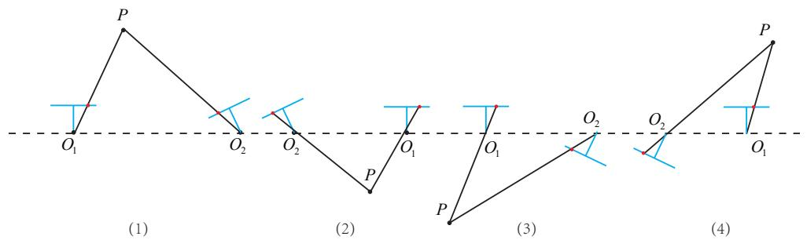  
图 7-8 分解本质矩阵得到的四个解。在保持投影点（红点）不变的情况下，两个相机以及空间点一共有四种可能的情况。

图 7-8 形象地显示了分解本质矩阵得到的四个解。我们已知空间点在相机（蓝色线）上的投影（红点），想要求解相机的运动。在保持红点不变的情况下，可以画出四种可能的情况，不过幸运的是，只有第一种解中，P 在两个相机中都具有正的深度。因此，只要把任意一点代入四种解中，检测该点在两个相机下的深度，就可以确定哪个解是正确的了。

如果利用 E 的内在性质，那么它只有五个自由度。所以最小可以通过五对点来求解相机运动 [40, 41]。然而这种做法形式复杂，从工程实现角度考虑，由于平时通常会有几十对乃至上百对的匹配点，从八对减至五对意义并不明显。为保持简单，我们这里就只介绍基本的八点法了。

剩下的问题还有一个：根据线性方程解出的 E，可能不满足 E 的内在性质——它的奇异值不一定为 σ, σ,0 的形式。这时，在做 SVD 时，我们会刻意地把 Σ 矩阵调整成上面的样子。通常的做法是，对八点法求得的 E 进行 SVD 分解后，会得到奇异值矩阵$\Sigma = \mathrm { d i a g } ( \sigma _ { 1 } , \sigma _ { 2 } , \sigma _ { 3 } )$ ，不妨设 $\sigma _ { 1 } \geq \sigma _ { 2 } \geq \sigma _ { 3 }$ 。取：

$$
\boldsymbol {E} = \boldsymbol {U} \operatorname{diag} (\frac {\sigma_ {1} + \sigma_ {2}}{2}, \frac {\sigma_ {1} + \sigma_ {2}}{2}, 0) \boldsymbol {V} ^ {T}. \tag {7.15}
$$

这相当于是把求出来的矩阵投影到了 E 所在的流形上。当然，更简单的做法是将奇异值矩阵取成 diag(1,1,0)，因为 E 具有尺度等价性，这样做也是合理的。

## 7.3.3 单应矩阵

除了基本矩阵和本质矩阵，我们还有一种称为单应矩阵（Homography）H 的东西，它描述了两个平面之间的映射关系。若场景中的特征点都落在同一平面上（比如墙，地面等），则可以通过单应性来进行运动估计。这种情况在无人机携带的俯视相机，或扫地机携带的顶视相机中比较常见。由于之前没提到过单应，我们稍微介绍一下。

单应矩阵通常描述处于共同平面上的一些点，在两张图像之间的变换关系。考虑在图像 $I _ { 1 }$ 和 $I _ { 2 }$ 有一对匹配好的特征点 $p _ { 1 }$ 和 $p _ { 2 }$ 。这些特征点落在某平面上。设这个平面满足方程：

$$
\boldsymbol {n} ^ {T} \boldsymbol {P} + d = 0. \tag {7.16}
$$

稍加整理，得：

$$
- \frac {\boldsymbol {n} ^ {T} \boldsymbol {P}}{d} = 1. \tag {7.17}
$$

然后，回顾本开头的式 (7.1)，得：

$$
\begin{array}{l} \boldsymbol {p} _ {2} = \boldsymbol {K} (\boldsymbol {R P} + \boldsymbol {t}) \\ = \boldsymbol {K} \left(\boldsymbol {R} \boldsymbol {P} + \boldsymbol {t} \cdot \left(- \frac {\boldsymbol {n} ^ {T} \boldsymbol {P}}{d}\right)\right) \\ = K \left(R - \frac {\boldsymbol {t n} ^ {T}}{d}\right) P \\ = \boldsymbol {K} \left(\boldsymbol {R} - \frac {\boldsymbol {t n} ^ {T}}{d}\right) \boldsymbol {K} ^ {- 1} \boldsymbol {p} _ {1}. \\ \end{array}
$$

于是，我们得到了一个直接描述图像坐标 $\pmb { p } _ { 1 }$ 和 $\mathbf { \mathit { p } } _ { 2 }$ 之间的变换，把中间这部分记为H，于是

$$
\boldsymbol {p} _ {2} = \boldsymbol {H} \boldsymbol {p} _ {1}. \tag {7.18}
$$

它的定义与旋转、平移以及平面的参数有关。与基础矩阵 F 类似，单应矩阵 H 也是一个 3×3 的矩阵，求解时的思路也和 F 类似，同样地可以先根据匹配点计算 H，然后将它分解以计算旋转和平移。把上式展开，得：

$$
\left( \begin{array}{c} u _ {2} \\ v _ {2} \\ 1 \end{array} \right) = \left( \begin{array}{c c c} h _ {1} & h _ {2} & h _ {3} \\ h _ {4} & h _ {5} & h _ {6} \\ h _ {7} & h _ {8} & h _ {9} \end{array} \right) \left( \begin{array}{c} u _ {1} \\ v _ {1} \\ 1 \end{array} \right). \tag {7.19}
$$

请注意这里的等号是在非零因子下成立的。我们在实际处理中，通常乘以一个非零因

子使得 $h _ { 9 } = 1$ （在它取非零值时）。然后根据第三行，去掉这个非零因子，于是有：

$$
u _ {2} = \frac {h _ {1} u _ {1} + h _ {2} v _ {1} + h _ {3}}{h _ {7} u _ {1} + h _ {8} v _ {1} + h _ {9}}
$$

$$
v _ {2} = \frac {h _ {4} u _ {1} + h _ {5} v _ {1} + h _ {6}}{h _ {7} u _ {1} + h _ {8} v _ {1} + h _ {9}}.
$$

整理得：

$$
h _ {1} u _ {1} + h _ {2} v _ {1} + h _ {3} - h _ {7} u _ {1} u _ {2} - h _ {8} v _ {1} u _ {2} = u _ {2}
$$

$$
h _ {4} u _ {1} + h _ {5} v _ {1} + h _ {6} - h _ {7} u _ {1} v _ {2} - h _ {8} v _ {1} v _ {2} = v _ {2}.
$$

这样一组匹配点对就可以构造出两项约束（事实上有三个约束，但是因为线性相关，只取前两个），于是自由度为 8 的单应矩阵可以通过 4 对匹配特征点算出（注意：这些特征点不能有三点共线的情况），即求解以下的线性方程组（当 $h _ { 9 } = 0$ 时，右侧为零）：

$$
\left( \begin{array}{c c c c c c c c} u _ {1} ^ {1} & v _ {1} ^ {1} & 1 & 0 & 0 & 0 & - u _ {1} ^ {1} u _ {2} ^ {1} & - v _ {1} ^ {1} u _ {2} ^ {1} \\ 0 & 0 & 0 & u _ {1} ^ {1} & v _ {1} ^ {1} & 1 & - u _ {1} ^ {1} v _ {2} ^ {1} & - v _ {1} ^ {1} v _ {2} ^ {1} \\ u _ {1} ^ {2} & v _ {1} ^ {2} & 1 & 0 & 0 & 0 & - u _ {1} ^ {2} u _ {2} ^ {2} & - v _ {1} ^ {2} u _ {2} ^ {2} \\ 0 & 0 & 0 & u _ {1} ^ {2} & v _ {1} ^ {2} & 1 & - u _ {1} ^ {2} v _ {2} ^ {2} & - v _ {1} ^ {2} v _ {2} ^ {2} \\ u _ {1} ^ {3} & v _ {1} ^ {3} & 1 & 0 & 0 & 0 & - u _ {1} ^ {3} u _ {2} ^ {3} & - v _ {1} ^ {3} u _ {2} ^ {3} \\ 0 & 0 & 0 & u _ {1} ^ {3} & v _ {1} ^ {3} & 1 & - u _ {1} ^ {3} v _ {2} ^ {3} & - v _ {1} ^ {3} v _ {2} ^ {3} \\ u _ {1} ^ {4} & v _ {1} ^ {4} & 1 & 0 & 0 & 0 & - u _ {1} ^ {4} u _ {2} ^ {4} & - v _ {1} ^ {4} u _ {2} ^ {4} \\ 0 & 0 & 0 & u _ {1} ^ {4} & v _ {1} ^ {4} & 1 & - u _ {1} ^ {4} v _ {2} ^ {4} & - v _ {1} ^ {4} v _ {2} ^ {4} \end{array} \right) \left( \begin{array}{l} h _ {1} \\ h _ {2} \\ h _ {3} \\ h _ {4} \\ h _ {5} \\ h _ {6} \\ h _ {7} \\ h _ {8} \end{array} \right) = \left( \begin{array}{l} u _ {2} ^ {1} \\ v _ {2} ^ {1} \\ u _ {2} ^ {2} \\ v _ {2} ^ {2} \\ u _ {2} ^ {3} \\ v _ {2} ^ {3} \\ u _ {2} ^ {4} \\ v _ {2} ^ {4} \end{array} \right). \tag {7.20}
$$

这种做法把 H 矩阵看成了向量，通过解该向量的线性方程来恢复 H，又称直接线性变换法（Direct Linear Transform）。与本质矩阵相似，求出单应矩阵以后需要对其进行分解，才可以得到相应的旋转矩阵 R 和平移向量 t。分解的方法包括数值法 [42, 43] 与解析法 [44]。与本质矩阵的分解类似，单应矩阵的分解同样会返回四组旋转矩阵与平移向量，并且同时可以计算出它们分别对应的场景点所在平面的法向量。如果已知成像的地图点的深度全为正值（即在相机前方），则又可以排除两组解。最后仅剩两组解，这时需要通过更多的先验信息进行判断。通常我们可以通过假设已知场景平面的法向量来解决，如场景平面与相机平面平行，那么法向量 n 的理论值为 $\mathbf { 1 } ^ { T }$ 。

单应性在 SLAM 中具重要意义。当特征点共面，或者相机发生纯旋转的时候，基础矩阵的自由度下降，这就出现了所谓的退化（degenerate）。现实中的数据总包含一些噪声，这时候如果我们继续使用八点法求解基础矩阵，基础矩阵多余出来的自由度将会主要由噪声决定。为了能够避免退化现象造成的影响，通常我们会同时估计基础矩阵 F 和单应矩阵H，选择重投影误差比较小的那个作为最终的运动估计矩阵。

## 7.4 实践：对极约束求解相机运动

下面，我们来练习一下如何通过 Essential 矩阵求解相机运动。上一节实践部分的程序提供了特征匹配，而这次我们就使用匹配好的特征点来计算 E,F 和 H，进而分解 E 得到 R,t。整个程序使用 OpenCV 提供的算法进行求解。我们把上一节的特征提取封装成函数，以供后面使用。本节只展示位姿估计部分的代码。

slambook/ch7/pose\_estimation\_2d2d.cpp （片段）  
```cpp
void pose_estimation_2d2d (
    std::vector<KeyPoint> keypoints_1,
    std::vector<KeyPoint> keypoints_2,
    std::vector<DMatch > matches,
    Mat& R, Mat& t)
{
    // 相机内参，TUM Freiburg2
    Mat K = (Mat_<double>(3,3) << 520.9, 0, 325.1, 0, 521.0, 249.7, 0, 0, 1);

    //-- 把匹配点转换为 vector<Point2f> 的形式
    vector<Point2f> points1;
    vector<Point2f> points2;

    for (int i = 0; i < (int) matches.size(); i++)
    {
    points1.push_back(keypoints_1[matches[i].queryIdx].pt);
    points2.push_back(keypoints_2[matches[i].trainIdx].pt);
    }

    //-- 计算基础矩阵
    Mat fundamental_matrix;
    fundamental_matrix = findFundamentalMat(points1, points2, CV_FM_8POINT);
    cout<<"fundamental_matrix is "<<endl<< fundamental_matrix<<endl;

    //-- 计算本质矩阵
    Point2d principal_point(325.1, 249.7); // 光心，TUM dataset 标定值
    int focal_length = 521; // 焦距，TUM dataset 标定值
    Mat essential_matrix;
    essential_matrix = findEssentialMat(points1, points2, focal_length, principal_point, RANSAC);
    cout<<"essential_matrix is "<<endl<< essential_matrix<<endl;

    //-- 计算单应矩阵
    Mat homography_matrix;
    homography_matrix = findHomography(points1, points2, RANSAC, 3, noArray(), 2000, 0.99);
```

```txt
cout<<"homography_matrix is "<<endl<<homography_matrix<<endl;

//-- 从本质矩阵中恢复旋转和平移信息.
recoverPose ( essential_matrix, points1, points2, R, t, focal_length, principal_point );
cout<<"R is "<<endl<<R<<endl;
cout<<"t is "<<endl<<t<<endl;
}
```

该函数提供了从特征点求解相机运动的部分，然后，我们在主函数中调用它，就能得到相机的运动：

slambook/ch7/pose\_estimation\_2d2d.cpp （片段）  
```c
int main( int argc, char** argv )
{
    if ( argc != 3 )
    {
    cout<<"usage: feature_extraction img1 img2"<<endl;
    return 1;
    }
    //-- 读取图像
    Mat img_1 = imread ( argv[1], CV_LOAD_IMAGE_COLOR );
    Mat img_2 = imread ( argv[2], CV_LOAD_IMAGE_COLOR );

    vector<KeyPoint> keypoints_1, keypoints_2;
    vector<DMatch> matches;
    find_feature_matches( img_1, img_2, keypoints_1, keypoints_2, matches );
    cout<<"一共找到了"<<matches.size()<<"组匹配点"<<endl;

    //-- 估计两张图像间运动
    Mat R,t;
    pose_estimation_2d2d( keypoints_1, keypoints_2, matches, R, t );

    //-- 验证 E=t^R*scale
    Mat t_x = (Mat_<double>(3,3) <<
    0, -t.at<double>(2,0), t.at<double>(1,0),
    t.at<double>(2,0), 0, -t.at<double>(0,0),
    -t.at<double>(1.0), t.at<double>(0,0), 0);

    cout<<"t^R="<<endl<<t_x*R<<endl;
    //-- 验证对极约束
    Mat K = ( Mat_<double>(3,3) << 520.9, 0, 325.1, 0, 521.0, 249.7, 0, 0, 1 );
    for ( DMatch m: matches )
    {
    Point2d pt1 = pixel2cam( keypoints_1[ m.queryIdx ].pt, K );
    Mat y1 = (Mat_<double>(3,1) << pt1.x, pt1.y, 1);
    Point2d pt2 = pixel2cam( keypoints_2[ m.trainIdx ].pt, K );
    Mat y2 = (Mat_<double>(3,1) << pt2.x, pt2.y, 1);
    Mat d = y2.t() * t_x * R * y1;
```

```txt
cout << "epipolar constraint = " << d << endl;
}
return 0;
}
```

我们在函数中输出了 E,F 和 H 的数值，然后验证对极约束是否成立，以及 $\mathbf { \Delta } _ { t ^ { \wedge } R }$ 和E 在非零数乘下等价的事实。现在，调用此程序即可看到输出结果：

```txt
% build/pose_estimation_2d2d 1.png 2.png
-- Max dist : 95.000000
-- Min dist : 4.000000
一共找到了 79 组匹配点
fundamental_matrix is
[4.844484382466111e-06, 0.0001222601840188731, -0.01786737827487386;
-0.0001174326832719333, 2.122888800459598e-05, -0.01775877156212593;
0.01799658210895528, 0.008143605989020664, 1]
essential_matrix is
[-0.0203618550523477, -0.4007110038118445, -0.03324074249824097;
0.3939270778216369, -0.03506401846698079, 0.5857110303721015;
-0.006788487241438284, -0.5815434272915686, -0.01438258684486258]
homography_matrix is
[0.9497129583105288, -0.143556453147626, 31.20121878625771;
0.04154536627445031, 0.9715568969832015, 5.306887618807696;
-2.81813676978796e-05, 4.353702039810921e-05, 1]
R is
[0.9985961798781875, -0.05169917220143662, 0.01152671359827873;
0.05139607508976055, 0.9983603445075083, 0.02520051547522442;
-0.01281065954813571, -0.02457271064688495, 0.9996159607036126]
t is
[-0.8220841067933337;
-0.03269742706405412;
0.5684264241053522]

t^R=
[0.02879601157010516, 0.5666909361828478, 0.04700950886436416;
-0.5570970160413605, 0.0495880104673049, -0.8283204827837456;
0.009600370724838804, 0.8224266019846683, 0.02034004937801349]
epipolar constraint = [0.002528128704106625]
epipolar constraint = [-0.001663727901710724]
epipolar constraint = [-0.0008009088410884102]
......
```

在程序的输出结果中可以看出，对极约束的满足精度约在 10−3 量级。根据前面的讨论，分解得到的 R,t 一共有四种可能性。不过 OpenCV 替我们使用三角化检测角点的深度是否为正，从而选出正确的解。

需要注意的地方是，我们要弄清程序求解出来的 R,t 是什么意义。按照例程的定义，我们的对极约束是从

$$
\pmb {x} _ {2} = \pmb {R x} _ {1} + \pmb {t}
$$

得到的。这里的 R,t 组成的变换矩阵，是第一个图到第二个图的坐标变换矩阵：

$$
\boldsymbol {x} _ {2} = \boldsymbol {T} _ {2 1} \boldsymbol {x} _ {1}. \tag {7.21}
$$

请读者在实践中务必清楚这里使用的变换顺序（因为有时我们会用 $\mathbf { T } _ { 1 2 } )$ ），它们非常容易搞反。

## 7.4.1 讨论

从演示程序中可以看到，输出的 E 和 F 之差相差了相机内参矩阵。虽然它们在数值上并不直观，但可以验证它们的数学关系。从 E,F 和 H 都可以分解出运动，不过 H 需要假设特征点位于平面上。对于本实验的数据，这个假设是不好的，所以我们这里主要用E 来分解运动。

值得一提的是，由于 E 本身具有尺度等价性，它分解得到的 t,R 也有一个尺度等价性。而 $R \in S O ( 3 )$ 自身具有约束，所以我们认为 t 具有一个尺度。换言之，在分解过程中，对 t 乘以任意非零常数，分解都是成立的。因此，我们通常把 t 进行归一化，让它的长度等于 1。

## 尺度不确定性

对 t 长度的归一化，直接导致了单目视觉的尺度不确定性（Scale Ambiguity）。例如，程序中输出的 t 第一维约 0.822。这个 0.822 究竟是指 0.822 米呢，还是 0.822 厘米呢，我们是没法确定的。因为对 t 乘以任意比例常数后，对极约束依然是成立的。换言之，在单目 SLAM 中，对轨迹和地图同时缩放任意倍数，我们得到的图像依然是一样的。这在第二讲中就已经给读者介绍过了。

在单目视觉中，我们对两张图像的 t 归一化，相当于固定了尺度。虽然我们不知道它的实际长度为多少，但我们以这时的 t 为单位 1，计算相机运动和特征点的 3D 位置。这被称为单目 SLAM 的初始化。在初始化之后，就可以用 3D-2D 来计算相机运动了。初始化之后的轨迹和地图的单位，就是初始化时固定的尺度。因此，单目 SLAM 有一步不可避免的初始化。初始化的两张图像必须有一定程度的平移，而后的轨迹和地图都将以此步的平移为单位。

除了对 t 进行归一化之外，另一种方法是令初始化时所有的特征点平均深度为 1，也可以固定一个尺度。相比于令 t 长度为 1 的做法，把特征点深度归一化可以控制场景的规模大小，使计算在数值上更稳定些。不过这并没有理论上的差别。

## 初始化的纯旋转问题

从 E 分解到 R,t 的过程中，如果相机发生的是纯旋转，导致 t 为零，那么，得到的E 也将为零，这将导致我们无从求解 R。不过，此时我们可以依靠 H 求取旋转，但仅有旋转时，我们无法用三角测量估计特征点的空间位置（这将在下文提到），于是，另一个结论是，单目初始化不能只有纯旋转，必须要有一定程度的平移。如果没有平移，单目将无法初始化。在实践当中，如果初始化时平移太小，会使得位姿求解与三角化结果不稳定，从而导致失败。相对的，如果把相机左右移动而不是原地旋转，就容易让单目 SLAM 初始化。因而有经验的 SLAM 研究人员，在单目 SLAM 情况下，经常选择让相机进行左右平移以顺利地进行初始化。

## 多于八对点的情况

当给定的点数多于八对时（比如例程找到了 79 对匹配），我们可以计算一个最小二乘解。回忆式（7.12）中线性化后的对极约束，我们把左侧的系数矩阵记为 A：

$$
\boldsymbol {A} \boldsymbol {e} = \mathbf {0}. \tag {7.22}
$$

对于八点法，A 的大小为 8 × 9。如果给定的匹配点多于 8，该方程构成一个超定方程，即不一定存在 e 使得上式成立。因此，可以通过最小化一个二次型来求：

$$
\min _ {e} \| \boldsymbol {A e} \| _ {2} ^ {2} = \min _ {e} e ^ {T} \boldsymbol {A} ^ {T} \boldsymbol {A e}. \tag {7.23}
$$

于是就求出了在最小二乘意义下的 E 矩阵。不过，当可能存在误匹配的情况时，我们会更倾向于使用随机采样一致性（Random Sample Concensus, RANSAC）来求，而不是最小二乘。RANSAC 是一种通用的做法，适用于很多带错误数据的情况，可以处理带有错误匹配的数据。

## 7.5 三角测量

之前两节，我们使用对极几何约束估计了相机运动，也讨论这种方法的局限性。在得到运动之后，下一步我们需要用相机的运动估计特征点的空间位置。在单目 SLAM 中，仅通过单张图像无法获得像素的深度信息，我们需要通过三角测量（Triangulation）（或三角化）的方法来估计地图点的深度。

三角测量是指，通过在两处观察同一个点的夹角，确定该点的距离。三角测量最早由高斯提出并应用于测量学中，它在天文学、地理学的测量中都有应用。例如，我们可以通过不同季节观察到星星的角度，估计它离我们的距离。在 SLAM 中，我们主要用三角化来估计像素点的距离。

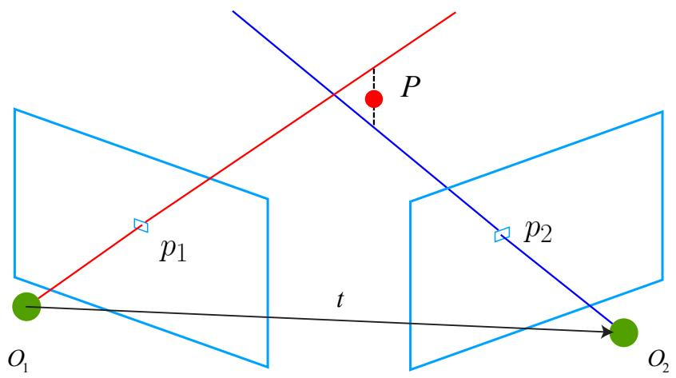

<details>
<summary>text_image</summary>

P
p1
p2
O1
t
O2
</details>

图 7-9 三角化获得地图点深度

和上一节类似，考虑图像 $I _ { 1 }$ 和 $I _ { 2 }$ ，以左图为参考，右图的变换矩阵为 $\mathbf { { T } } _ { \texttt { c } }$ 。相机光心为 $O _ { 1 }$ 和 $O _ { 2 }$ 。在 $I _ { 1 }$ 中有特征点 $p _ { 1 }$ ，对应 $I _ { 2 }$ 中有特征点 $p _ { 2 }$ 。理论上直线 $O _ { 1 } p _ { 1 }$ 与 $O _ { 2 } p _ { 2 }$ 在场景中会相交于一点 P，该点即是两个特征点所对应的地图点在三维场景中的位置。然而由于噪声的影响，这两条直线往往无法相交。因此，（又）可以通过最二小乘去求解。

按照对极几何中的定义，设 $\mathbf { \boldsymbol { x } } _ { 1 } , \mathbf { \boldsymbol { x } } _ { 2 }$ 为两个特征点的归一化坐标，那么它们满足：

$$
s _ {1} \boldsymbol {x} _ {1} = s _ {2} \boldsymbol {R} \boldsymbol {x} _ {2} + \boldsymbol {t}. \tag {7.24}
$$

现在我们已经知道了 R,t，想要求解的是两个特征点的深度 $s _ { 1 } , s _ { 2 }$ 。当然这两个深度是可以分开求的，比方说先来看 $s _ { 2 }$ 。如果我要算 $s _ { 2 }$ ，那么先对上式两侧左乘一个 $\pmb { x } _ { 1 } ^ { \wedge }$ ，得：

$$
s _ {1} \boldsymbol {x} _ {1} ^ {\wedge} \boldsymbol {x} _ {1} = 0 = s _ {2} \boldsymbol {x} _ {1} ^ {\wedge} \boldsymbol {R} \boldsymbol {x} _ {2} + \boldsymbol {x} _ {1} ^ {\wedge} \boldsymbol {t}. \tag {7.25}
$$

该式左侧为零，右侧可看成 $s _ { 2 }$ 的一个方程，可以根据它直接求得 $s _ { 2 }$ 。有了 $s _ { 2 }$ ， $s _ { 1 }$ 也非常容易求出。于是，我们就得到了两个帧下的点的深度，确定了它们的空间坐标。当然，由于噪声的存在，我们估得的 R,t，不一定精确使式（7.24）为零，所以更常见的做法求最小二乘解而不是零解。

## 7.6 实践：三角测量

## 7.6.1 三角测量代码

下面，我们演示如何根据之前根据对极几何求解的相机位姿，通过三角化求出上一节特征点的空间位置。我们调用 OpenCV 提供的 triangulation 函数进行三角化。

slambook/ch7/triangulation.cpp（片断）  
```cpp
void triangulation (
    const vector<KeyPoint>& keypoint_1,
    const vector<KeyPoint>& keypoint_2,
    const std::vector< DMatch >& matches,
    const Mat& R, const Mat& t,
    vector<Point3d>& points
);

void triangulation (
    const vector< KeyPoint >& keypoint_1,
    const vector< KeyPoint >& keypoint_2,
    const std::vector< DMatch >& matches,
    const Mat& R, const Mat& t,
    vector< Point3d >& points )
{
    Mat T1 = (Mat_<double> (3,4) << 1,0,0,0,
    0,1,0,0,
    0,0,1,0);
    Mat T2 = (Mat_<double> (3,4) << R.at<double>(0,0), R.at<double>(0,1), R.at<double>(0,2), t.at<double>(0,0),
    R.at<double>(1,0), R.at<double>(1,1), R.at<double>(1,2), t.at<double>(1,0),
    R.at<double>(2,0), R.at<double>(2,1), R.at<double>(2,2), t.at<double>(2,0)
);

    Mat K = ( Mat_<double> (3,3 ) << 520.9, 0, 325.1, 0, 521.0, 249.7, 0, 0, 1 );
    vector<Point2d> pts_1, pts_2;
    for ( DMatch m:matches )
    {
    // 将像素坐标转换至相机坐标
    pts_1.push_back ( pixel2cam( keypoint_1[m.queryIdx].pt, K) );
    pts_2.push_back ( pixel2cam( keypoint_2[m.trainIdx].pt, K) );
    }

    Mat pts_4d;
    cv::triangulatePoints( T1, T2, pts_1, pts_2, pts_4d );

    // 转换成非齐次坐标
    for ( int i=0; i<pts_4d.cols; i++ )
```

```txt
{
    Mat x = pts_4d.col(i);
    x /= x.at<float>(3,0); // 归一化
    Point3d p (
    x.at<float>(0,0),
    x.at<float>(1,0),
    x.at<float>(2,0)
    );
    points.push_back( p );
}
```

同时，在 main 函数中增加三角测量部分，并验证重投影关系：

```txt
int main (int argc, char** argv)
{
    // ....
    //-- 三角化
    vector<Point3d> points;
    triangulation( keypoints_1, keypoints_2, matches, R, t, points );

    //-- 验证三角化点与特征点的重投影关系
    Mat K = ( Mat_<double>( 3,3 ) << 520.9, 0, 325.1, 0, 521.0, 249.7, 0, 0, 1 );
    for ( int i=0; i<matches.size(); i++ )
    {
    Point2d pt1_cam = pixel2cam( keypoints_1[ matches[i].queryIdx ].pt, K );
    Point2d pt1_cam_3d (
    points[i].x/points[i].z,
    points[i].y/points[i].z
    );

    cout<<"point in the first camera frame: "<<pt1_cam<<endl;
    cout<<"point projected from 3D "<<pt1_cam_3d<<", d="<<points[i].z<<endl;

    // 第二个图
    Point2f pt2_cam = pixel2cam( keypoints_2[ matches[i].trainIdx ].pt, K );
    Mat pt2_trans = R*( Mat_<double>(3,1) << points[i].x, points[i].y, points[i].z ) + t;
    pt2_trans /= pt2_trans.at<double>(2,0);
    cout<<"point in the second camera frame: "<<pt2_cam<<endl;
    cout<<"point reprojected from second frame: "<<pt2_trans.t()<<endl;
    cout<<endl;
    }
    // ...
}
```

我们打印了每个空间点在两个相机坐标系下的投影坐标与像素坐标——相当于 P 的投影位置与看到的特征点位置。由于误差的存在，它们会有一些微小的差异。以下是某一特征点的信息：

```txt
point in the first camera frame: [0.0844072, -0.0734976]
```

```yaml
2 point projected from 3D [0.0843702, -0.0743606], d=14.9895
3 point in the second camera frame: [0.0431343, -0.0459876]
4 point reprojected from second frame: [0.04312769812378599, -0.04515455276163744, 1]
```

可以看到，误差的量级大约在小数点后第三位。可以看到，三角化特征点的距离大约为 15。但由于尺度不确定性，我们并不知道这里的 15 究竟是多少米。

## 7.6.2 讨论

关于三角测量，还有一个必须注意的地方。

三角测量是由平移得到的，有平移才会有对极几何中的三角形，才谈的上三角测量。因此，纯旋转是无法使用三角测量的，因为对极约束将永远满足。在平移存在的情况下，我们还要关心三角测量的不确定性，这会引出一个三角测量的矛盾。

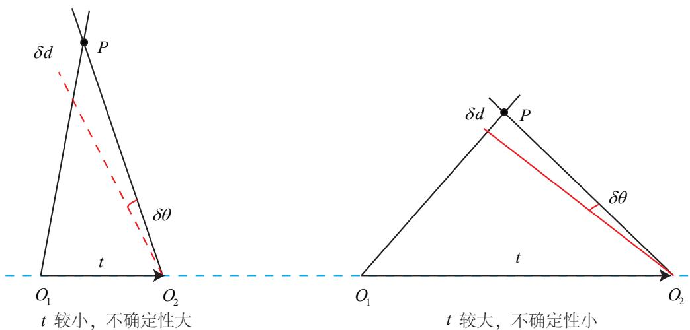

<details>
<summary>text_image</summary>

δd
P
δθ
t
O₁ O₂
t 较小，不确定性大
δd P
δθ
t
O₁ O₂
t 较大，不确定性小
</details>

图 7-10 三角测量的矛盾。

如图 7-10 所示。当平移很小时，像素上的不确定性将导致较大的深度不确定性。也就是说，如果特征点运动一个像素 δx，使得视线角变化了一个角度 δθ，那么测量到深度值将有 δd 的变化。从几何关系可以看到，当 t 较大时，δd 将明显变小，这说明平移较大时，在同样的相机分辨率下，三角化测量将更精确。对该过程的定量分析可以使用正弦定理得到，但我们这里先考虑定性分析。

因此，要增加三角化的精度，其一是提高特征点的提取精度，也就是提高图像分辨率但这会导致图像变大，提高计算成本。另一方式是使平移量增大。但是，平移量增大，会导致图像的外观发生明显的变化，比如箱子原先被挡住的侧面显示出来了，比如反射光发生变化了，等等。外观变化会使得特征提取与匹配变得困难。总而言之，在增大平移，会导致匹配失效；而平移太小，则三角化精度不够——这就是三角化的矛盾。

虽然本节只介绍了三角化的深度估计，但只要我们愿意，也能够定量地计算每个特征点的位置及不确定性。所以，如果假设特征点服从高斯分布，并且对它不断地进行观测，在信息正确的情况下，我们就能够期望它的方差会不断减小乃至收敛。这就得到了一个滤波器，称为深度滤波器（Depth Filter）。不过，由于它的原理较复杂，我们留到第 13 讲再详细讨论它。下面，我们来讨论从 3D-2D 的匹配点来估计相机运动，以及 3D-3D 的估计方法。

## $\mathbf { 7 . 7 ^ { + 2 . 0 } 3 D - 2 D : P n P }$

PnP（Perspective-n-Point）是求解 3D 到 2D 点对运动的方法。它描述了当我们知道n 个 3D 空间点以及它们的投影位置时，如何估计相机所在的位姿。前面已经说了，2D-2D的对极几何方法需要八个或八个以上的点对（以八点法为例），且存在着初始化、纯旋转和尺度的问题。然而，如果两张图像中，其中一张特征点的 3D 位置已知，那么最少只需三个点对（需要至少一个额外点验证结果）就可以估计相机运动。特征点的 3D 位置可以由三角化，或者由 RGB-D 相机的深度图确定。因此，在双目或 RGB-D 的视觉里程计中，我们可以直接使用 $\mathrm { P n P }$ 估计相机运动。而在单目视觉里程计中，必须先进行初始化，然后才能使用 PnP。3D-2D 方法不需要使用对极约束，又可以在很少的匹配点中获得较好的运动估计，是最重要的一种姿态估计方法。

PnP问题有很多种求解方法，例如用三对点估计位姿的P3P[45]，直接线性变换（DLT），EPnP（Efficient PnP）[46]，UPnP[47] 等等）。此外，还能用非线性优化的方式，构建最小二乘问题并迭代求解，也就是万金油式的 Bundle Adjustment。我们先来看 DLT，然后再讲 Bundle Adjustment。

## 7.7.1 直接线性变换

考虑某个空间点 P，它的齐次坐标为 $P = ( X , Y , Z , 1 ) ^ { T }$ 。在图像 $I _ { 1 }$ 中，投影到特征点 $\pmb { x } _ { 1 } = ( u _ { 1 } , v _ { 1 } , 1 ) ^ { T }$ （以归一化平面齐次坐标表示）。此时相机的位姿 R,t 是未知的。与单应矩阵的求解类似，我们定义增广矩阵 $[ R | t ]$ 为一个 3×4 的矩阵，包含了旋转与平移信息①。我们把它的展开形式列写如下：

$$
s \left( \begin{array}{c} u _ {1} \\ v _ {1} \\ 1 \end{array} \right) = \left( \begin{array}{c c c c} t _ {1} & t _ {2} & t _ {3} & t _ {4} \\ t _ {5} & t _ {6} & t _ {7} & t _ {8} \\ t _ {9} & t _ {1 0} & t _ {1 1} & t _ {1 2} \end{array} \right) \left( \begin{array}{c} X \\ Y \\ Z \\ 1 \end{array} \right). \tag {7.26}
$$

用最后一行把 s 消去，得到两个约束：

$$
u _ {1} = \frac {t _ {1} X + t _ {2} Y + t _ {3} Z + t _ {4}}{t _ {9} X + t _ {1 0} Y + t _ {1 1} Z + t _ {1 2}} v _ {1} = \frac {t _ {5} X + t _ {6} Y + t _ {7} Z + t _ {8}}{t _ {9} X + t _ {1 0} Y + t _ {1 1} Z + t _ {1 2}}.
$$

为了简化表示，定义 T 的行向量：

$$
\pmb {t} _ {1} = (t _ {1}, t _ {2}, t _ {3}, t _ {4}) ^ {T}, \pmb {t} _ {2} = (t _ {5}, t _ {6}, t _ {7}, t _ {8}) ^ {T}, \pmb {t} _ {3} = (t _ {9}, t _ {1 0}, t _ {1 1}, t _ {1 2}) ^ {T},
$$

于是有：

$$
\pmb {t} _ {1} ^ {T} \pmb {P} - \pmb {t} _ {3} ^ {T} \pmb {P} u _ {1} = 0,
$$

和

$$
\pmb {t} _ {2} ^ {T} \pmb {P} - \pmb {t} _ {3} ^ {T} \pmb {P} v _ {1} = 0.
$$

请注意 t 是待求的变量，可以看到每个特征点提供了两个关于 t 的线性约束。假设一共有 N 个特征点，可以列出线性方程组：

$$
\left( \begin{array}{c c c} \boldsymbol {P} _ {1} ^ {T} & 0 & - u _ {1} \boldsymbol {P} _ {1} ^ {T} \\ 0 & \boldsymbol {P} _ {1} ^ {T} & - v _ {1} \boldsymbol {P} _ {1} ^ {T} \\ \vdots & \vdots & \vdots \\ \boldsymbol {P} _ {N} ^ {T} & 0 & - u _ {N} \boldsymbol {P} _ {N} ^ {T} \\ 0 & \boldsymbol {P} _ {N} ^ {T} & - v _ {N} \boldsymbol {P} _ {N} ^ {T} \end{array} \right) \left( \begin{array}{l} \boldsymbol {t} _ {1} \\ \boldsymbol {t} _ {2} \\ \boldsymbol {t} _ {3} \end{array} \right) = 0. \tag {7.27}
$$

由于 t 一共有 12 维，因此最少通过六对匹配点，即可实现矩阵 T 的线性求解，这种方法（也）称为直接线性变换（Direct Linear Transform，DLT）。当匹配点大于六对时，（又）可以使用 SVD 等方法对超定方程求最小二乘解。

在 DLT 求解中，我们直接将 T 矩阵看成了 12 个未知数，忽略了它们之间的联系。因为旋转矩阵 $R \in S O ( 3 )$ ，用 DLT 求出的解不一定满足该约束，它是一个一般矩阵。平移向量比较好办，它属于向量空间。对于旋转矩阵 R，我们必须针对 DLT 估计的 T 的左边

$3 \times 3$ 的矩阵块，寻找一个最好的旋转矩阵对它进行近似。这可以由 QR 分解完成 [3, 48]，相当于把结果从矩阵空间重新投影到 SE(3) 流形上，转换成旋转和平移两部分。

需要解释的是，我们这里的 $\scriptstyle { \mathbf { { \vec { x } } } } _ { 1 }$ 使用了归一化平面坐标，去掉了内参矩阵 K 的影响这是因为内参 K 在 SLAM 中通常假设为已知。如果内参未知，那么我们也能用 PnP去估计 $\mathbf { \boldsymbol { K } } , \mathbf { \boldsymbol { R } } , t$ 三个量。然而由于未知量的增多，效果会差一些。

## 7.7.2 P3P

下面讲的 P3P 是另一种解 $\mathrm { P n P }$ 的方法。它仅使用三对匹配点，对数据要求较少，因此这里也简单介绍一下（这部分推导借鉴了 [49]）。

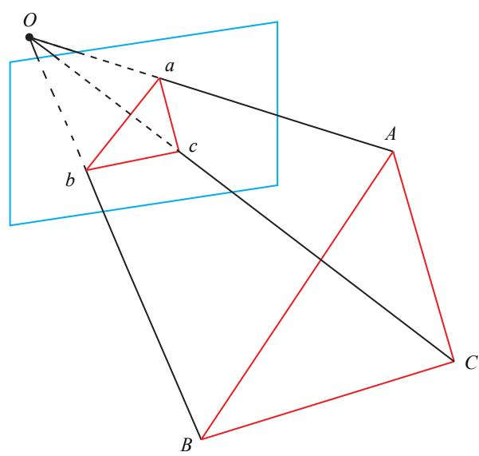

<details>
<summary>text_image</summary>

O
a
b
c
A
B
C
</details>

图 7-11 P3P 问题示意图。

P3P 需要利用给定的三个点的几何关系。它的输入数据为三对 3D-2D 匹配点。记 3D点为 A, B, C，2D 点为 a, b, c，其中小写字母代表的点为大写字母在相机成像平面上的投影，如图 7-11 所示。此外，P3P 还需要使用一对验证点，以从可能的解出选出正确的那一个（类似于对极几何情形）。记验证点对为 D−d，相机光心为 $O _ { \circ }$ 。请注意，我们知道的是A, B, C 在世界坐标系中的坐标，而不是在相机坐标系中的坐标。一旦 3D 点在相机坐标系下的坐标能够算出，我们就得到了 3D-3D 的对应点，把 PnP 问题转换为了 ICP 问题。

首先，显然，三角形之间存在对应关系：

$$
\Delta O a b - \Delta O A B, \quad \Delta O b c - \Delta O B C, \quad \Delta O a c - \Delta O A C. \tag {7.28}
$$

来考虑 Oab 和 OAB 的关系。利用余弦定理，有：

$$
O A ^ {2} + O B ^ {2} - 2 O A \cdot O B \cdot \cos \langle a, b \rangle = A B ^ {2}. \tag {7.29}
$$

对于其他两个三角形亦有类似性质，于是有：

$$
O A ^ {2} + O B ^ {2} - 2 O A \cdot O B \cdot \cos \langle a, b \rangle = A B ^ {2}
$$

$$
O B ^ {2} + O C ^ {2} - 2 O B \cdot O C \cdot \cos \langle b, c \rangle = B C ^ {2} \tag {7.30}
$$

$$
O A ^ {2} + O C ^ {2} - 2 O A \cdot O C \cdot \cos \left\langle a, c \right\rangle = A C ^ {2}.
$$

对上面三式全体除以 $O C ^ { 2 }$ ，并且记 $x = O A / O C , y = O B / O C$ ，得：

$$
x ^ {2} + y ^ {2} - 2 x y \cos \langle a, b \rangle = A B ^ {2} / O C ^ {2}
$$

$$
y ^ {2} + 1 ^ {2} - 2 y \cos \langle b, c \rangle = B C ^ {2} / O C ^ {2} \tag {7.31}
$$

$$
x ^ {2} + 1 ^ {2} - 2 x \cos \langle a, c \rangle = A C ^ {2} / O C ^ {2}.
$$

记 $v = A B ^ { 2 } / O C ^ { 2 } , u v = B C ^ { 2 } / O C ^ { 2 } , w v = A C ^ { 2 } / O C ^ { 2 }$ ，有：

$$
x ^ {2} + y ^ {2} - 2 x y \cos \langle a, b \rangle - v = 0
$$

$$
y ^ {2} + 1 ^ {2} - 2 y \cos \langle b, c \rangle - u v = 0 \tag {7.32}
$$

$$
x ^ {2} + 1 ^ {2} - 2 x \cos \langle a, c \rangle - w v = 0.
$$

我们可以把第一个式子中的 v 放到等式一边，并代入第 2，3 两式，得：

$$
(1 - u) y ^ {2} - u x ^ {2} - \cos \langle b, c \rangle y + 2 u x y \cos \langle a, b \rangle + 1 = 0 \tag {7.33}
$$

$$
(1 - w) x ^ {2} - w y ^ {2} - \cos \langle a, c \rangle x + 2 w x y \cos \langle a, b \rangle + 1 = 0.
$$

注意这些方程中的已知量和未知量。由于我们知道 2D 点的图像位置，三个余弦角$\cos \left. a , b \right. , \cos \left. b , c \right. , \cos \left. a , c \right.$ 是已知的。同时， $u = B C ^ { 2 } / A B ^ { 2 } , w = A C ^ { 2 } / A B ^ { 2 }$ 可以通过A, B, C 在世界坐标系下的坐标算出，变换到相机坐标系下之后，并不改变这个比值。该式中的 x, y 是未知的，随着相机移动会发生变化。因此，该方程组是关于 x, y 的一个二元二次方程（多项式方程）。解析地求解该方程组是一个复杂的过程，需要用吴消元法。这里不展开对该方程解法的介绍，感兴趣的读者请参照 [45]。类似于分解 E 的情况，该方程最多可能得到四个解，但我们可以用验证点来计算最可能的解，得到 A, B, C 在相机坐标系下的 3D 坐标。然后，根据 3D-3D 的点对，计算相机的运动 $R , t _ { \circ }$ 。这部分将在 7.9 小结介绍。

从 P3P 的原理上可以看出，为了求解 $\mathrm { P n P }$ ，我们利用了三角形相似性质，求解投影点 $a , b , c$ 在相机坐标系下的 3D 坐标，最后把问题转换成一个 3D 到 3D 的位姿估计问题。后文将看到，带有匹配信息的 3D-3D 位姿求解非常容易，所以这种思路是非常有效的。其他的一些方法，例如 EPnP，亦采用了这种思路。然而，P3P 也存在着一些问题：

1. P3P 只利用三个点的信息。当给定的配对点多于 3 组时，难以利用更多的信息。  
2. 如果 3D 点或 2D 点受噪声影响，或者存在误匹配，则算法失效。

所以后续人们还提出了许多别的方法，如 $\mathrm { E P n P , ~ U P n P }$ 等。它们利用更多的信息，而且用迭代的方式对相机位姿进行优化，以尽可能地消除噪声的影响。不过，相对于 P3P 来说，原理会更加复杂一些，所以我们建议读者阅读原始的论文，或通过实践来理解 $\mathrm { P n P }$ 过程。在 SLAM 当中，通常的做法是先使用 $\mathrm { P 3 P / E P n P }$ 等方法估计相机位姿，然后构建最小二乘优化问题对估计值进行调整（Bundle Adjustment）。接下来我们从非线性优化角度来看一下 PnP 问题。

## 7.7.3 Bundle Adjustment

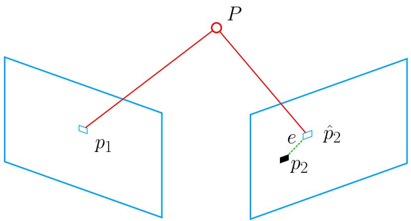

<details>
<summary>text_image</summary>

P
p₁
e
p₂
p̂₂
</details>

图 7-12 重投影误差示意图。

除了使用线性方法之外，我们可以把 $\mathrm { P n P }$ 问题构建成一个定义于李代数上的非线性最小二乘问题。这将用到本书第四章和第五章的知识。前面说的线性方法，往往是先求相机位姿，再求空间点位置，而非线性优化则是把它们都看成优化变量，放在一起优化。这是一种非常通用的求解方式，我们可以用它对 $\mathrm { P n P }$ 或 ICP 给出的结果进行优化。在 $\mathrm { P n P }$ 中，这个 Bundle Adjustment 问题，是一个最小化重投影误差（Reprojection error）的问题。我们在本节给出此问题在两个视图下的基本形式，然后在第十讲讨论较大规模的 BA问题。

考虑 n 个三维空间点 P 和它们的投影 $p$ ，我们希望计算相机的位姿 $R , t ,$ ，它的李代数表示为 $\xi _ { \mathfrak { c } }$ 。假设某空间点坐标为 $P _ { i } = [ X _ { i } , Y _ { i } , Z _ { i } ] ^ { T }$ ，其投影的像素坐标为 $\pmb { u } _ { i } = [ u _ { i } , v _ { i } ] ^ { T }$ 。根据第五章的内容，像素位置与空间点位置的关系如下：

$$
s _ {i} \left[ \begin{array}{l} u _ {i} \\ v _ {i} \\ 1 \end{array} \right] = \boldsymbol {K} \exp \left(\boldsymbol {\xi} ^ {\wedge}\right) \left[ \begin{array}{l} X _ {i} \\ Y _ {i} \\ Z _ {i} \\ 1 \end{array} \right]. \tag {7.34}
$$

除了用 $\boldsymbol { \xi }$ 为李代数表示的相机姿态之外，别的都和前面的定义保持一致。写成矩阵形式就是：

$$
s _ {i} \pmb {u} _ {i} = \pmb {K} \exp (\pmb {\xi} ^ {\wedge}) \pmb {P} _ {i}.
$$

请读者脑补中间隐含着的齐次坐标到非齐次的转换，否则按矩阵的乘法来说，维度是不对的①。现在，由于相机位姿未知以及观测点的噪声，该等式存在一个误差。因此，我们把误差求和，构建最小二乘问题，然后寻找最好的相机位姿，使它最小化：

$$
\boldsymbol {\xi} ^ {*} = \arg \min _ {\boldsymbol {\xi}} \frac {1}{2} \sum_ {i = 1} ^ {n} \left\| \boldsymbol {u} _ {i} - \frac {1}{s _ {i}} \boldsymbol {K} \exp \left(\boldsymbol {\xi} ^ {\wedge}\right) \boldsymbol {P} _ {i} \right\| _ {2} ^ {2}. \tag {7.35}
$$

该问题的误差项，是将像素坐标（观测到的投影位置）与 3D 点按照当前估计的位姿进行投影得到的位置相比较得到的误差，所以称之为重投影误差。使用齐次坐标时，这个误差有 3 维。不过，由于 u 最后一维为 1，该维度的误差一直为零，因而我们更多时候使用非齐次坐标，于是误差就只有 2 维了。如图 7-12 所示，我们通过特征匹配，知道了 $p _ { 1 }$ 和 $p _ { 2 }$ 是同一个空间点 P 的投影，但是我们不知道相机的位姿。在初始值中， $P$ 的投影 $\hat { p } _ { 2 }$ 与实际的 $p _ { 2 }$ 之间有一定的距离。于是我们调整相机的位姿，使得这个距离变小。不过，由于这个调整需要考虑很多个点，所以最后每个点的误差通常都不会精确为零。

最小二乘优化问题已经在第六讲介绍过了。使用李代数，可以构建无约束的优化问题，很方便地通过 G-N, L-M 等优化算法进行求解。不过，在使用 G-N 和 L-M 之前，我们需要知道每个误差项关于优化变量的导数，也就是线性化：

$$
\boldsymbol {e} (\boldsymbol {x} + \Delta \boldsymbol {x}) \approx \boldsymbol {e} (\boldsymbol {x}) + \boldsymbol {J} \Delta \boldsymbol {x}. \tag {7.36}
$$

这里的 J 的形式是值得讨论的，甚至可以说是关键所在。我们固然可以使用数值导数，但如果能够推导解析形式时，我们会优先考虑解析导数。现在，当 e 为像素坐标误差（2 维），x 为相机位姿（6 维）时，J 将是一个 2×6 的矩阵。我们来推导 J 的形式。

回忆李代数的内容，我们介绍了如何使用扰动模型来求李代数的导数。首先，记变换到相机坐标系下的空间点坐标为 P′，并且把它前三维取出来：

$$
\boldsymbol {P} ^ {\prime} = \left(\exp \left(\boldsymbol {\xi} ^ {\wedge}\right) \boldsymbol {P}\right) _ {1: 3} = \left[ X ^ {\prime}, Y ^ {\prime}, Z ^ {\prime} \right] ^ {T}. \tag {7.37}
$$

那么，相机投影模型相对于 $P ^ { \prime }$ 则为：

$$
s \boldsymbol {u} = \boldsymbol {K} \boldsymbol {P} ^ {\prime}. \tag {7.38}
$$

展开之：

$$
\left[ \begin{array}{l} s u \\ s v \\ s \end{array} \right] = \left[ \begin{array}{c c c} f _ {x} & 0 & c _ {x} \\ 0 & f _ {y} & c _ {y} \\ 0 & 0 & 1 \end{array} \right] \left[ \begin{array}{l} X ^ {\prime} \\ Y ^ {\prime} \\ Z ^ {\prime} \end{array} \right]. \tag {7.39}
$$

利用第 3 行消去 s（实际上就是 $P ^ { \prime }$ 的距离），得：

$$
u = f _ {x} \frac {X ^ {\prime}}{Z ^ {\prime}} + c _ {x}, \quad v = f _ {y} \frac {Y ^ {\prime}}{Z ^ {\prime}} + c _ {y}. \tag {7.40}
$$

这与之前讲的相机模型是一致的。当我们求误差时，可以把这里的 u, v 与实际的测量值比较，求差。在定义了中间变量后，我们对 $\xi ^ { \wedge }$ 左乘扰动量 $\delta \xi$ ，然后考虑 e 的变化关于扰动量的导数。利用链式法则，可以列写如下：

$$
\frac {\partial \boldsymbol {e}}{\partial \delta \boldsymbol {\xi}} = \lim _ {\delta \boldsymbol {\xi} \rightarrow 0} \frac {e (\delta \boldsymbol {\xi} \oplus \boldsymbol {\xi})}{\delta \boldsymbol {\xi}} = \frac {\partial \boldsymbol {e}}{\partial \boldsymbol {P} ^ {\prime}} \frac {\partial \boldsymbol {P} ^ {\prime}}{\partial \delta \boldsymbol {\xi}}. \tag {7.41}
$$

这里的 ⊕ 指李代数上的左乘扰动。第一项是误差关于投影点的导数，在式（7.40）已经列出了变量之间的关系，易得：

$$
\frac {\partial \boldsymbol {e}}{\partial \boldsymbol {P} ^ {\prime}} = - \left[ \begin{array}{c c c} \frac {\partial u}{\partial X ^ {\prime}} & \frac {\partial u}{\partial Y ^ {\prime}} & \frac {\partial u}{\partial Z ^ {\prime}} \\ \frac {\partial v}{\partial X ^ {\prime}} & \frac {\partial v}{\partial Y ^ {\prime}} & \frac {\partial v}{\partial Z ^ {\prime}} \end{array} \right] = - \left[ \begin{array}{c c c} \frac {f _ {x}}{Z ^ {\prime}} & 0 & - \frac {f _ {x} X ^ {\prime}}{Z ^ {\prime 2}} \\ 0 & \frac {f _ {y}}{Z ^ {\prime}} & - \frac {f _ {y} Y ^ {\prime}}{Z ^ {\prime 2}} \end{array} \right]. \tag {7.42}
$$

而第二项为变换后的点关于李代数的导数，根据在4.3.5中的推导，得：

$$
\frac {\partial (\boldsymbol {T} \boldsymbol {P})}{\partial \delta \boldsymbol {\xi}} = (\boldsymbol {T} \boldsymbol {P}) ^ {\odot} = \left[ \begin{array}{c c} \boldsymbol {I} & - \boldsymbol {P} ^ {\prime \wedge} \\ \boldsymbol {0} ^ {T} & \boldsymbol {0} ^ {T} \end{array} \right]. \tag {7.43}
$$

而在 P′ 的定义中，我们取出了前三维，于是得：

$$
\frac {\partial \boldsymbol {P} ^ {\prime}}{\partial \delta \boldsymbol {\xi}} = [ \boldsymbol {I}, - \boldsymbol {P} ^ {\prime \wedge} ]. \tag {7.44}
$$

将这两项相乘，就得到了 2×6 的雅可比矩阵：

$$
\frac {\partial \boldsymbol {e}}{\partial \delta \boldsymbol {\xi}} = - \left[ \begin{array}{c c c c c c} \frac {f _ {x}}{Z ^ {\prime}} & 0 & - \frac {f _ {x} X ^ {\prime}}{Z ^ {\prime 2}} & - \frac {f _ {x} X ^ {\prime} Y ^ {\prime}}{Z ^ {\prime 2}} & f _ {x} + \frac {f _ {x} X ^ {2}}{Z ^ {\prime 2}} & - \frac {f _ {x} Y ^ {\prime}}{Z ^ {\prime}} \\ 0 & \frac {f _ {y}}{Z ^ {\prime}} & - \frac {f _ {y} Y ^ {\prime}}{Z ^ {\prime 2}} & - f _ {y} - \frac {f _ {y} Y ^ {\prime 2}}{Z ^ {\prime 2}} & \frac {f _ {y} X ^ {\prime} Y ^ {\prime}}{Z ^ {\prime 2}} & \frac {f _ {y} X ^ {\prime}}{Z ^ {\prime}} \end{array} \right]. \tag {7.45}
$$

这个雅可比矩阵描述了重投影误差关于相机位姿李代数的一阶变化关系。我们保留了前面的负号，因为这是由于误差是由观测值减预测值定义的。它当然也可反过来，定义成“预测减观测”的形式。在那种情况下，只要去掉前面的负号即可。此外，如果 se(3) 的定义方式是旋转在前，平移在后时，只要把这个矩阵的前三列与后三列对调即可。

另一方面，除了优化位姿，我们还希望优化特征点的空间位置。因此，需要讨论 e 关于空间点 P 的导数。所幸这个导数矩阵相对来说容易一些。仍利用链式法则，有：

$$
\frac {\partial \boldsymbol {e}}{\partial \boldsymbol {P}} = \frac {\partial \boldsymbol {e}}{\partial \boldsymbol {P} ^ {\prime}} \frac {\partial \boldsymbol {P} ^ {\prime}}{\partial \boldsymbol {P}}. \tag {7.46}
$$

第一项已在前面推导了，第二项，按照定义

$$
\boldsymbol {P} ^ {\prime} = \exp (\boldsymbol {\xi} ^ {\wedge}) \boldsymbol {P} = \boldsymbol {R} \boldsymbol {P} + \boldsymbol {t}.
$$

我们发现 P′ 对 P 求导后只剩下 R。于是

$$
\frac {\partial \boldsymbol {e}}{\partial \boldsymbol {P}} = - \left[ \begin{array}{c c c} \frac {f _ {x}}{Z ^ {\prime}} & 0 & - \frac {f _ {x} X ^ {\prime}}{Z ^ {\prime 2}} \\ 0 & \frac {f _ {y}}{Z ^ {\prime}} & - \frac {f _ {y} Y ^ {\prime}}{Z ^ {\prime 2}} \end{array} \right] \boldsymbol {R}. \tag {7.47}
$$

于是，我们推导了观测相机方程关于相机位姿与特征点的两个导数矩阵。它们十分重要，能够在优化过程中提供重要的梯度方向，指导优化的迭代。

## 7.8 实践：求解 PnP

## 7.8.1 使用 EPnP 求解位姿

下面，我们通过实验理解一下 PnP 的过程。首先，我们用 OpenCV 提供的 EPnP 求解 PnP 问题，然后通过 g2o 对结果进行优化。由于 PnP 需要使用 3D 点，为了避免初始化带来的麻烦，我们使用了 RGB-D 相机中的深度图（1\_depth.png），作为特征点的 3D位置。首先来看 OpenCV 提供的 PnP 函数：

slambook/ch7/pose\_estimation\_3d2d.cpp（片段）  
```cpp
int main( int argc, char** argv )
{
    ......
    // 建立 3D 点
    Mat d1 = imread( argv[3], CV_LOAD_IMAGE_UNCHANGED ); // 深度图为 16 位无符号数，单通道图像
    Mat K = ( Mat_<double> ( 3,3 ) << 520.9, 0, 325.1, 0, 521.0, 249.7, 0, 0, 1 );
    vector<Point3f> pts_3d;
    vector<Point2f> pts_2d;
    for ( DMatch m:matches )
    {
    ushort d = d1.ptr<unsigned short> ( int(keypoints_1[m.queryIdx].pt.y) )[ int(keypoints_1[m.queryIdx].pt.x) ];
    if ( d == 0 ) // bad depth
    continue;
    float dd = d/1000.0;
    Point2d p1 = pixel2cam( keypoints_1[m.queryIdx].pt, K );
    pts_3d.push_back( Point3f(p1.x*dd, p1.y*dd, dd) );
    pts_2d.push_back( keypoints_2[m.trainIdx].pt );
    }

    cout<<"3d-2d pairs: "<<pts_3d.size()<<endl;

    Mat r, t;
    // 调用 OpenCV 的 PnP 求解，可选择 EPNP ， DLS 等方法
    solvePnP( pts_3d, pts_2d, K, Mat(), r, t, false, cv::SOLVEPNP_EPNP );
    Mat R;
    cv::Rodrigues(r, R); // r 为旋转向量形式，用 Rodrigues 公式转换为矩阵

    cout<<"R="<<endl<<R<<endl;
    cout<<"t="<<endl<<t<<endl;
}
```

在例程中，我们得到配对特征点后，在第一个图的深度图中寻找它们的深度，并求出空间位置。以此空间位置为 3D 点，再以第二个图像的像素位置为 2D 点，调用 EPnP 求解 PnP 问题。程序输出如下：

```matlab
% build/pose_estimation_3d2d 1.png 2.png d1.png d2.png
-- Max dist : 95.000000
-- Min dist : 4.000000
一共找到了79组匹配点
3d-2d pairs: 78
R=
[0.9977970937403702, -0.05195299069131867, 0.04125344205637558;
0.05073872610592159, 0.9982626103770279, 0.02995567385972873;
-0.04273805559942161, -0.02779653722084675, 0.9986995599889442]
t=
[-0.6455324432075111;
-0.05776758294184359;
0.2844565219506077]
```

读者可以对比先前 2D-2D 情况下求解的 R,t 有什么不同。可以看到，在有 3D 信息时，估计的 R 几乎是相同的，而 t 相差的较多。这是由于我们引入了新的深度信息所致。不过，由于 Kinect 采集的深度图本身会有一些误差，所以这里的 3D 点也不是准确的。我们会希望把位姿 ξ 和所有三维特征点 P 同时优化。

## 7.8.2 使用 BA 优化

下面，我们来演示如何进行 Bundle Adjustment。我们将使用前一步的估计值作为初始值。优化可以使用前面讲的 Ceres 或 g2o 库实现，这里采用 g2o 作为例子。

g2o 的基本知识在第六讲中已经介绍过了。在使用 g2o 之前，我们要把问题建模成一个最小二乘的图优化问题，如图 7-13 所示。在这个图优化中，节点和边的选择为：

1. 节点：第二个相机的位姿节点 $\xi \in \mathfrak { s e } ( 3 )$ ，以及所有特征点的空间位置 $\pmb { P } \in \mathbb { R } ^ { 3 }$ 。  
2. 边：每个 3D 点在第二个相机中的投影，以观测方程来描述：

$$
\boldsymbol {z} _ {j} = h (\boldsymbol {\xi}, \boldsymbol {P} _ {j}).
$$

由于第一个相机位姿固定为零，我们没有把它写到优化变量里，但在习题中，我希望你能够把第一个相机的位姿与观测也考虑进来。现在我们根据一组 3D 点和第二个图像中的 2D 投影，估计第二个相机的位姿。所以我们把第一个相机画成虚线，表明我们不希望考虑它。

g2o 提供了许多关于 BA 的节点和边，我们不必自己从头实现所有的计算。在g2o/types/sba/types\_six\_dof\_expmap.h 中则提供了李代数表达的节点和边。请读者打开这个文件，找到 VertexSE3Expmap（李代数位姿）、VertexSBAPointXYZ（空间点位置）和 EdgeProjectXYZ2UV（投影方程边）这三个类。我们来简单看一下它们的类定义，例如 VertexSE3Expmap：

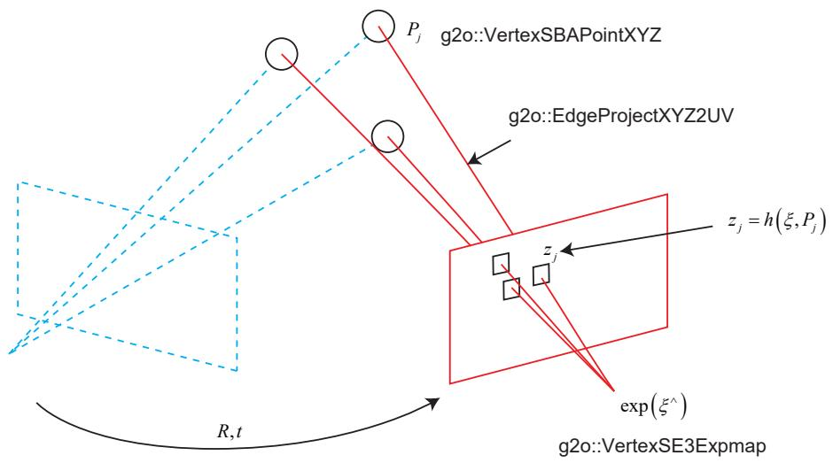

<details>
<summary>text_image</summary>

g2o::VertexSBAPointXYZ
g2o::EdgeProjectXYZ2UV
z_j = h(\xi, P_j)
exp(\xi^)
R,t
g2o::VertexSE3Expmap
</details>

图 7-13 PnP 的 Bundle Adjustment 的图优化表示。

```cpp
class G20_TYPES_SBA_API VertexSE3Expmap : public BaseVertex<6, SE3Quat> {
public:
    EIGEN_MAKE_ALIGNED_OPERATOR_NEW
    VertexSE3Expmap();

    bool read(std::istream& is);

    bool write(std::ostream& os) const;

    virtual void setToOriginImpl() {
    _estimate = SE3Quat();
    }

    virtual void oplusImpl(const double* update_) {
    Eigen::Map<const Vector6d> update(update_);
    setEstimate( SE3Quat::exp(update)*estimate());
    }
};
```

请注意它的模板参数。第一个参数6表示它内部存储的优化变量维度，可以看到这是一个6维的李代数。第二参数是优化变量的类型，这里使用了g2o定义的相机位姿：SE3Quat。这个类内部使用了四元数加位移向量来存储位姿，但同时也支持李代数上的运算，例如对数映射（log 函数）和李代数上增量（update 函数）等操作。我们可以对照它的实现代码，看看 g2o 对李代数是如何操作的：

```cpp
class G20_TYPES_SBA_API VertexSBAPointXYZ : public BaseVertex<3, Vector3D>
{
    ......
};
class G20_TYPES_SBA_API EdgeProjectXYZ2UV : public BaseBinaryEdge<2, Vector2D, VertexSBAPointXYZ, VertexSE3Expmap>
{
    ......
    void computeError() {
    const VertexSE3Expmap* v1 = static_cast<const VertexSE3Expmap*>(vertices[1]);
    const VertexSBAPointXYZ* v2 = static_cast<const VertexSBAPointXYZ*>(vertices[0]);
    const CameraParameters * cam
    = static_cast<const CameraParameters *>(parameter(0));
    Vector2D obs(_measurement);
    _error = obs-cam->cam_map(v1->estimate().map(v2->estimate()));
    }
};
```

我就不把整个类定义都搬过来了。从模板参数可以看到，空间点位置类的维度为 3，类型是 Eigen 的 Vector3D。另一方面，边 EdgeProjectXYZ2UV 连接了两个前面说的两个顶点，它的观测值为 2 维，由 Vector2D 表示，实际上就是空间点的像素坐标。它的误差计算函数表达了投影方程的误差计算方法，也就是我们前面提到的 z −h(ξ,P) 的方式。

现在，进一步观察 EdgeProjectXYZ2UV 的 linearizeOplus 函数的实现。这里用到了我们前面推导的雅可比矩阵：

```cpp
void EdgeProjectXYZ2UV::linearize0plus() {
    VertexSE3Expmap *vj = static_cast<VertexSE3Expmap *>(_vertices[1]);
    SE3Quat T(vj->estimate());
    VertexSBAPointXYZ* vi = static_cast<VertexSBAPointXYZ*>(_vertices[0]);
    Vector3D xyz = vi->estimate();
    Vector3D xyz_trans = T.map(xyz);

    double x = xyz_trans[0];
    double y = xyz_trans[1];
    double z = xyz_trans[2];
    double z_2 = z*z;

    const CameraParameters * cam = static_cast<const CameraParameters *>(parameter(0));

    Matrix<double,2,3,Eigen::ColMajor> tmp;
    tmp(0,0) = cam->focal_length;
    tmp(0,1) = 0;
    tmp(0,2) = -x/z*cam->focal_length;
```

```txt
tmp(1,0) = 0;
tmp(1,1) = cam->focal_length;
tmp(1,2) = -y/z * cam->focal_length;

_jacobianOplusXi = -1./z * tmp * T.rotation().toRotationMatrix();

_jacobianOplusXj(0,0) = x*y/z_2 * cam->focal_length;
_jacobianOplusXj(0,1) = -(1 + (x*x/z_2)) * cam->focal_length;
_jacobianOplusXj(0,2) = y/z * cam->focal_length;
_jacobianOplusXj(0,3) = -1./z * cam->focal_length;
_jacobianOplusXj(0,4) = 0;
_jacobianOplusXj(0,5) = x/z_2 * cam->focal_length;

_jacobianOplusXj(1,0) = (1 + y*y/z_2) * cam->focal_length;
_jacobianOplusXj(1,1) = -x*y/z_2 * cam->focal_length;
_jacobianOplusXj(1,2) = -x/z * cam->focal_length;
_jacobianOplusXj(1,3) = 0;
_jacobianOplusXj(1,4) = -1./z * cam->focal_length;
_jacobianOplusXj(1,5) = y/z_2 * cam->focal_length;
}
```

仔细研究此段代码，我们会发现它与式（7.45）和（7.47）是一致的。成员变量“\_-jacobianOplusXi”是误差到空间点的导数，“\_jacobianOplusXj”是误差到相机位姿的导数，以李代数的左乘扰动表达。稍有差别的是，g2o 的相机里用 f 统一描述 $f _ { x } , f _ { y }$ ，并且李代数定义顺序不同（g2o 是旋转在前，平移在后；我们是平移在前，旋转在后），所以矩阵前三列和后三列与我们的定义是颠倒的。此外都是一致的。

值得一提的是，我们亦可自己实现相机位姿节点，并使用 Sophus::SE3 来表达位姿，提供类似的求导过程。然而，既然 g2o 已经提供了这样的类，在没有额外要求的情况下，自己重新实现就没有必要了。现在，我们在上一个 PnP 例程的基础上，加上 g2o 提供的 BundleAdjustment。

slambook/ch7/pose\_estimation\_3d2d.cpp（片段）  
```cpp
void bundleAdjustment (
    const vector< Point3f > points_3d,
    const vector< Point2f > points_2d,
    const Mat& K,
    Mat& R, Mat& t )
{
    // 初始化g2o
    typedef g2o::BlockSolver< g2o::BlockSolverTraits<6,3> > Block; // pose 维度为 6, landmark 维度为 3
    Block::LinearSolverType* linearSolver = new g2o::LinearSolverCSparse<Block::PoseMatrixType>();
    Block* solver_ptr = new Block( linearSolver );
    g2o::OptimizationAlgorithmLevenberg* solver = new g2o::OptimizationAlgorithmLevenberg( solver_ptr );
};
```

```cpp
g2o::SparseOptimizer optimizer;
optimizer.setAlgorithm( solver );

// vertex
g2o::VertexSE3Expmap* pose = new g2o::VertexSE3Expmap(); // camera pose
Eigen::Matrix3d R_mat;
R_mat <<
    R.at<double>(0,0), R.at<double>(0,1), R.at<double>(0,2),
    R.at<double>(1,0), R.at<double>(1,1), R.at<double>(1,2),
    R.at<double>(2,0), R.at<double>(2,1), R.at<double>(2,2);
pose->setId(0);
pose->setEstimate( g2o::SE3Quat(
    R_mat,
    Eigen::Vector3d( t.at<double>(0,0), t.at<double>(1,0), t.at<double>(2,0)) );
optimizer.addVertex( pose );

int index = 1;
for ( const Point3f p:points_3d ) // landmarks
{
    g2o::VertexSBAPointXYZ* point = new g2o::VertexSBAPointXYZ();
    point->setId( index++ );
    point->setEstimate( Eigen::Vector3d(p.x, p.y, p.z) );
    point->setMarginalized( true );
    optimizer.addVertex( point );
}

// parameter: camera intrinsics
g2o::CameraParameters* camera = new g2o::CameraParameters(
K.at<double>(0,0), Eigen::Vector2d(K.at<double>(0,2), K.at<double>(1,2)), 0
);
camera->setId(0);
optimizer.addParameter( camera );

// edges
index = 1;
for ( const Point2f p:points_2d )
{
    g2o::EdgeProjectXYZ2UV* edge = new g2o::EdgeProjectXYZ2UV();
    edge->setId( index );
    edge->setVertex( 0, dynamic_cast<g2o::VertexSBAPointXYZ*> (optimizer.vertex(index)) );
    edge->setVertex( 1, pose );
    edge->setMeasurement( Eigen::Vector2d( p.x, p.y ) );
    edge->setParameterId(0,0);
    edge->setInformation( Eigen::Matrix2d::Identity() );
    optimizer.addEdge(edge);
    index++;
}

chrono::steady_clock::time_point t1 = chrono::steady_clock::now();
```

```cpp
optimizer.setVerbose( true );
optimizer.initializeOptimization();
optimizer.optimize(100);
chrono::steady_clock::time_point t2 = chrono::steady_clock::now();
chrono::duration<double> time_used = chrono::duration_cast<chrono::duration<double>>(t2-t1);
cout<<"optimization costs time: "<<time_used.count()<<" seconds.""<<endl;
cout<<endl<<"after optimization:"<<endl;
cout<<"T="<<endl<<Eigen::Isometry3d( pose->estimate() ).matrix()<<endl;
}
```

程序大体上和第六章的 g2o 类似。我们首先声明了 g2o 图优化，配置优化求解器和梯度下降方法，然后根据估计到的特征点，将位姿和空间点放到图中。最后调用优化函数进行求解。读者可以看到优化的结果：

```txt
calling bundle adjustment
iteration= 0 chi2= 1.083180 time= 0.000107183 cumTime= 0.000107183 edges= 76 schur= 1 lambda= 78.907222 levenbergIter= 1
iteration= 1 chi2= 0.000798 time= 5.8615e-05 cumTime= 0.000165798 edges= 76 schur= 1 lambda= 26.302407 levenbergIter= 1
iteration= 2 chi2= 0.000000 time= 3.0203e-05 cumTime= 0.000196001 edges= 76 schur= 1 lambda= 17.534938 levenbergIter= 1
...... 中间过程略
iteration= 11 chi2= 0.000000 time= 2.8394e-05 cumTime= 0.000525203 edges= 76 schur= 1 lambda= 11209.703029 levenbergIter= 1
optimization costs time: 0.00132938 seconds.

after optimization:
T=
0.997776 -0.0519476 0.0417755 -0.649778
0.050735 0.998274 0.0295806 -0.0545231
-0.0432401 -0.0273953 0.998689 0.295564
0 0    0    1
```

迭代 11 轮后，LM 发现优化目标函数接近不变，于是停止了优化。我们输出了最后得到位姿变换矩阵 T，对比之前直接做 PnP 的结果，大约在小数点后第三位发生了一些变化。这主要是由于我们同时优化了特征点和相机位姿导致的。

Bundle Adjustment 是一种通用的做法。它可以不限于两个图像。我们完全可以放入多个图像匹配到的位姿和空间点进行迭代优化，甚至可以把整个 SLAM 过程放进来。那种做法规模较大，主要在后端使用，我们会在第十章重新遇到这个问题。在前端，我们通常考虑局部相机位姿和特征点的小型 Bundle Adjustment 问题，希望实时对它进行求解和优化。

## 7.9 3D-3D: ICP

最后，我们来介绍 3D-3D 的位姿估计问题。假设我们有一组配对好的 3D 点（比如我们对两个 RGB-D 图像进行了匹配）：

$$
\boldsymbol {P} = \{\boldsymbol {p} _ {1}, \dots , \boldsymbol {p} _ {n} \}, \quad \boldsymbol {P} ^ {\prime} = \{\boldsymbol {p} _ {1} ^ {\prime}, \dots , \boldsymbol {p} _ {n} ^ {\prime} \},
$$

现在，想要找一个欧氏变换 R,t，使得：

$$
\forall i, \boldsymbol {p} _ {i} = \boldsymbol {R p} _ {i} ^ {\prime} + \boldsymbol {t}.
$$

这个问题可以用迭代最近点（Iterative Closest Point, ICP）求解。读者应该注意到，3D-3D 位姿估计问题中，并没有出现相机模型，也就是说，仅考虑两组 3D 点之间的变换时，和相机并没有关系。因此，在激光 SLAM 中也会碰到 ICP，不过由于激光数据特征不够丰富，我们无从知道两个点集之间的匹配关系，只能认为距离最近的两个点为同一个，所以这个方法称为迭代最近点。而在视觉中，特征点为我们提供了较好的匹配关系，所以整个问题就变得更简单了。在 RGB-D SLAM 中，可以用这种方式估计相机位姿。下文我们用 ICP 指代匹配好的两组点间运动估计问题。

和 PnP 类似，ICP 的求解也分为两种方式：利用线性代数的求解（主要是 SVD），以及利用非线性优化方式的求解（类似于 Bundle Adjustment）。下面分别来介绍它们。

## 7.9.1 SVD 方法

首先我们看以 SVD 为代表的代数方法。根据前面描述的 ICP 问题，我们先定义第 i对点的误差项：

$$
\boldsymbol {e} _ {i} = \boldsymbol {p} _ {i} - (\boldsymbol {R} \boldsymbol {p} _ {i} ^ {\prime} + \boldsymbol {t}). \tag {7.48}
$$

然后，构建最小二乘问题，求使误差平方和达到极小的 R,t：

$$
\min _ {\boldsymbol {R}, \boldsymbol {t}} J = \frac {1}{2} \sum_ {i = 1} ^ {n} \| (\boldsymbol {p} _ {i} - (\boldsymbol {R p} _ {i} ^ {\prime} + \boldsymbol {t})) \| _ {2} ^ {2}. \tag {7.49}
$$

下面我们来推导它的求解方法。首先，定义两组点的质心：

$$
\boldsymbol {p} = \frac {1}{n} \sum_ {i = 1} ^ {n} (\boldsymbol {p} _ {i}), \quad \boldsymbol {p} ^ {\prime} = \frac {1}{n} \sum_ {i = 1} ^ {n} (\boldsymbol {p} _ {i} ^ {\prime}). \tag {7.50}
$$

请注意质心是没有下标的。随后，在误差函数中，我们作如下的处理：

$$
\begin{array}{l} \frac {1}{2} \sum_ {i = 1} ^ {n} \| \boldsymbol {p} _ {i} - (\boldsymbol {R p} _ {i} ^ {\prime} + \boldsymbol {t}) \| ^ {2} = \frac {1}{2} \sum_ {i = 1} ^ {n} \| \boldsymbol {p} _ {i} - \boldsymbol {R p} _ {i} ^ {\prime} - \boldsymbol {t} - \boldsymbol {p} + \boldsymbol {R p} ^ {\prime} + \boldsymbol {p} - \boldsymbol {R p} ^ {\prime} \| ^ {2} \\ = \frac {1}{2} \sum_ {i = 1} ^ {n} \| \left(\boldsymbol {p} _ {i} - \boldsymbol {p} - \boldsymbol {R} \left(\boldsymbol {p} _ {i} ^ {\prime} - \boldsymbol {p} ^ {\prime}\right)\right) + \left(\boldsymbol {p} - \boldsymbol {R} \boldsymbol {p} ^ {\prime} - \boldsymbol {t}\right) \| ^ {2} \\ = \frac {1}{2} \sum_ {i = 1} ^ {n} \left(\| \boldsymbol {p} _ {i} - \boldsymbol {p} - \boldsymbol {R} \left(\boldsymbol {p} _ {i} ^ {\prime} - \boldsymbol {p} ^ {\prime}\right) \| ^ {2} + \| \boldsymbol {p} - \boldsymbol {R p} ^ {\prime} - \boldsymbol {t} \| ^ {2} + \right. \\ 2 (\pmb {p} _ {i} - \pmb {p} - \pmb {R} (\pmb {p} _ {i} ^ {\prime} - \pmb {p} ^ {\prime})) ^ {T} (\pmb {p} - \pmb {R p} ^ {\prime} - \pmb {t})). \\ \end{array}
$$

注意到交叉项部分中， $\left( { { p } _ { i } } - p - R \left( { { p } _ { i } } ^ { \prime } - p ^ { \prime } \right) \right)$ 在求和之后是为零的，因此优化目标函数可以简化为：

$$
\min _ {\boldsymbol {R}, \boldsymbol {t}} J = \frac {1}{2} \sum_ {i = 1} ^ {n} \| \boldsymbol {p} _ {i} - \boldsymbol {p} - \boldsymbol {R} (\boldsymbol {p} _ {i} ^ {\prime} - \boldsymbol {p} ^ {\prime}) \| ^ {2} + \| \boldsymbol {p} - \boldsymbol {R} \boldsymbol {p} ^ {\prime} - \boldsymbol {t} \| ^ {2}. \tag {7.51}
$$

仔细观察左右两项，我们发现左边只和旋转矩阵 R 相关，而右边既有 R 也有 t，但只和质心相关。只要我们获得了 R，令第二项为零就能得到 t。于是， $\mathrm { I C P }$ 可以分为以下三个步骤求解：

1. 计算两组点的质心位置 ${ \pmb p } , { \pmb p } ^ { \prime }$ ，然后计算每个点的去质心坐标：

$$
\boldsymbol {q} _ {i} = \boldsymbol {p} _ {i} - \boldsymbol {p}, \quad \boldsymbol {q} _ {i} ^ {\prime} = \boldsymbol {p} _ {i} ^ {\prime} - \boldsymbol {p} ^ {\prime}.
$$

2. 根据以下优化问题计算旋转矩阵：

$$
\boldsymbol {R} ^ {*} = \arg \min _ {\boldsymbol {R}} \frac {1}{2} \sum_ {i = 1} ^ {n} \| \boldsymbol {q} _ {i} - \boldsymbol {R} \boldsymbol {q} _ {i} ^ {\prime} \| ^ {2}. \tag {7.52}
$$

3. 根据第二步的 R，计算 t：

$$
\boldsymbol {t} ^ {*} = \boldsymbol {p} - \boldsymbol {R p} ^ {\prime}. \tag {7.53}
$$

我们看到，只要求出了两组点之间的旋转，平移量是非常容易得到的。所以我们重点

关注 R 的计算。展开关于 R 的误差项，得：

$$
\frac {1}{2} \sum_ {i = 1} ^ {n} \| \boldsymbol {q} _ {i} - \boldsymbol {R} \boldsymbol {q} _ {i} ^ {\prime} \| ^ {2} = \frac {1}{2} \sum_ {i = 1} ^ {n} \boldsymbol {q} _ {i} ^ {T} \boldsymbol {q} _ {i} + \boldsymbol {q} _ {i} ^ {\prime T} \boldsymbol {R} ^ {T} \boldsymbol {R} \boldsymbol {q} _ {i} ^ {\prime} - 2 \boldsymbol {q} _ {i} ^ {T} \boldsymbol {R} \boldsymbol {q} _ {i} ^ {\prime}. \tag {7.54}
$$

注意到第一项和 R 无关，第二项由于 $\pmb { R } ^ { T } \pmb { R } = \pmb { I }$ ，亦与 R 无关。因此，实际上优化目标函数变为：

$$
\sum_ {i = 1} ^ {n} - \boldsymbol {q} _ {i} ^ {T} \boldsymbol {R} \boldsymbol {q} _ {i} ^ {\prime} = \sum_ {i = 1} ^ {n} - \operatorname{tr} \left(\boldsymbol {R} \boldsymbol {q} _ {i} ^ {\prime} \boldsymbol {q} _ {i} ^ {T}\right) = - \operatorname{tr} \left(\boldsymbol {R} \sum_ {i = 1} ^ {n} \boldsymbol {q} _ {i} ^ {\prime} \boldsymbol {q} _ {i} ^ {T}\right). \tag {7.55}
$$

接下来，我们介绍怎样通过 SVD 解出上述问题中最优的 R，但是关于最优性的证明较为复杂，感兴趣的读者请参考 [50, 51]。为了解 R，先定义矩阵：

$$
\boldsymbol {W} = \sum_ {i = 1} ^ {n} \boldsymbol {q} _ {i} \boldsymbol {q} _ {i} ^ {\prime T}. \tag {7.56}
$$

W 是一个 3×3 的矩阵，对 W 进行 SVD 分解，得：

$$
\boldsymbol {W} = \boldsymbol {U} \boldsymbol {\Sigma} \boldsymbol {V} ^ {T}. \tag {7.57}
$$

其中，Σ 为奇异值组成的对角矩阵，对角线元素从大到小排列，而 U 和 V 为正交矩阵。当 W 满秩时，R 为：

$$
\boldsymbol {R} = \boldsymbol {U V} ^ {T}. \tag {7.58}
$$

解得 R 后，按式（7.53）求解 t 即可。

## 7.9.2 非线性优化方法

求解 ICP 的另一种方式是使用非线性优化，以迭代的方式去找最优值。该方法和我们前面讲述的 PnP 非常相似。以李代数表达位姿时，目标函数可以写成：

$$
\min _ {\boldsymbol {\xi}} = \frac {1}{2} \sum_ {i = 1} ^ {n} \| (\boldsymbol {p} _ {i} - \exp {(\boldsymbol {\xi} ^ {\wedge})} \boldsymbol {p} _ {i} ^ {\prime}) \| _ {2} ^ {2}. \tag {7.59}
$$

单个误差项关于位姿导数已经在前面推导过了，使用李代数扰动模型即可：

$$
\frac {\partial \boldsymbol {e}}{\partial \delta \boldsymbol {\xi}} = - (\exp {(\boldsymbol {\xi} ^ {\wedge})} \boldsymbol {p} _ {i} ^ {\prime}) ^ {\odot}. \tag {7.60}
$$

于是，在非线性优化中只需不断迭代，我们就能找到极小值。而且，可以证明 [6]，ICP问题存在唯一解或无穷多解的情况。在唯一解的情况下，只要我们能找到极小值解，那么这个极小值就是全局最优值——因此不会遇到局部极小而非全局最小的情况。这也意味着ICP 求解可以任意选定初始值。这是已经匹配点时求解 ICP 的一大好处。

需要说明的是，我们这里讲的 ICP，是指已经由图像特征给定了匹配的情况下，进行位姿估计的问题。在匹配已知的情况下，这个最小二乘问题实际上具有解析解 [52, 53, 54]，所以并没有必要进行迭代优化。ICP 的研究者们往往更加关心匹配未知的情况。不过，在RGB-D SLAM 中，由于一个像素的深度数据可能测量不到，所以我们可以混合着使用 PnP和 ICP 优化：对于深度已知的特征点，用建模它们的 3D-3D 误差；对于深度未知的特征点，则建模 3D-2D 的重投影误差。于是，可以将所有的误差放在同一个问题中考虑，使得求解更加方便。

## 7.10 实践：求解 ICP

## 7.10.1 SVD 方法

下面，我们来演示一下如何使用 SVD 以及非线性优化来求解 ICP。本节我们使用两个 RGB-D 图像，通过特征匹配获取两组 3D 点，最后用 ICP 计算它们的位姿变换。由于OpenCV 目前还没有计算两组带匹配点的 ICP 的方法，而且它的原理也并不复杂，所以我们自己来实现一个 ICP。

slambook/ch7/pose\_estimation\_3d3d.cpp（片段）  
```cpp
void pose_estimation_3d3d(
    const vector<Point3f>& pts1,
    const vector<Point3f>& pts2,
    Mat& R, Mat& t
)
{
    Point3f p1, p2; // center of mass
    int N = pts1.size();
    for (int i=0; i<N; i++)
    {
    p1 += pts1[i];
    p2 += pts2[i];
    }
    p1 /= N; p2 /= N;
    vector<Point3f> q1(N), q2(N); // remove the center
    for (int i=0; i<N; i++)
    {
    q1[i] = pts1[i] - p1;
    q2[i] = pts2[i] - p2;
    }
```

```cpp
// compute q1*q2^T
Eigen::Matrix3d W = Eigen::Matrix3d::Zero();
for ( int i=0; i<N; i++ )
{
    W += Eigen::Vector3d( q1[i].x, q1[i].y, q1[i].z ) * Eigen::Vector3d( q2[i].x, q2[i].y, q2[i].z )
    .transpose();
}
cout<<"W="<<W<<endl;

// SVD on W
Eigen::JacobiSVD<Eigen::Matrix3d> svd(W, Eigen::ComputeFullU|Eigen::ComputeFullV);
Eigen::Matrix3d U = svd.matrixU();
Eigen::Matrix3d V = svd.matrixV();
cout<<"U="<<U<<endl;
cout<<"V="<<V<<endl;

Eigen::Matrix3d R_ = U*(V.transpose());
Eigen::Vector3d t_ = Eigen::Vector3d( p1.x, p1.y, p1.z ) - R_ * Eigen::Vector3d( p2.x, p2.y, p2.z )
;

// convert to cv::Mat
R = ( Mat_<double>(3,3) <<
    R_(0,0), R_(0,1), R_(0,2),
    R_(1,0), R_(1,1), R_(1,2),
    R_(2,0), R_(2,1), R_(2,2)
);
t = ( Mat_<double>(3,1) << t_(0,0), t_(1,0), t_(2,0) );
}
```

ICP 的实现方式和前文讲述的是一致的。我们调用 Eigen 进行 SVD，然后计算 R,t矩阵。我们输出了匹配后的结果，不过请注意，由于前面的推导是按照 $p _ { i } = R p _ { i } ^ { \prime } + t$ 进行的，这里的 R,t 是第二帧到第一帧的变换，与前面 PnP 部分是相反的。所以在输出结果中，我们同时打印了逆变换：

```txt
% build/pose_estimation_3d3d 1.png 2.png 1_depth.png 2_depth.png
-- Max dist : 95.000000
-- Min dist : 4.000000
一共找到了 79 组匹配点
3d-3d pairs: 74
W= 298.51 -14.1815 41.0456
-44.8208 107.825 -164.404
78.1978 -163.954 271.439
U= 0.474143 -0.880373 -0.0114952
-0.460275 -0.258979 0.849163
0.750556 0.397334 0.528006
V= 0.535211 -0.844064 -0.0332488
-0.434767 -0.309001 0.84587
0.724242 0.438263 0.532352
```

```matlab
ICP via SVD results:
R = [0.9972395976914055, 0.05617039049497474, -0.04855998381307948;
-0.05598344580804095, 0.9984181433274515, 0.005202390798842771;
0.04877538920134394, -0.002469474885032297, 0.998806719591959]
t = [0.7086246277241892;
-0.2775515782948791;
-0.1559573762377209]
R_inv = [0.9972395976914055, -0.05598344580804095, 0.04877538920134394;
0.05617039049497474, 0.9984181433274515, -0.002469474885032297;
-0.04855998381307948, 0.005202390798842771, 0.998806719591959]
t_inv = [-0.7145999506834847;
0.2369236766013986;
0.1916260075851286]
```

读者可以比较一下 ICP 与 PnP, 对极几何的运动估计结果之间的差异。可以认为，在这个过程中我们使用了越来越多的信息（没有深度——有一个图的深度——有两个图的深度），因此，在深度准确的情况下，得到的估计也将越来越准确。但是，由于 Kinect 的深度图存在噪声，而且有可能存在数据丢失的情况，使得我们不得不丢弃一些没有深度数据的特征点。这可能导致 ICP 的估计不够准确，并且，如果特征点丢弃得太多，可能引起由于特征点太少，无法进行运动估计的情况。

## 7.10.2 非线性优化方法

下面我们考虑用非线性优化来计算 ICP。我们依然使用李代数来表达相机位姿。与SVD 思路不同的地方在于，在优化中我们不仅考虑相机的位姿，同时会优化 3D 点的空间位置。对我们来说，RGB-D 相机每次可以观测到路标点的三维位置，从而产生一个 3D 观测数据。不过，由于 g2o/sba 中没有提供 3D 到 3D 的边，而我们又想使用 $\mathrm { \ g 2 o / s b a }$ 中李代数实现的位姿节点，所以最好的方式是自定义一种这样的边，并向 g2o 提供解析求导方式。

slambook/ch7/pose\_estimation\_3d3d.cpp  
```cpp
class EdgeProjectXYZRGBDPoseOnly : public g2o::BaseUnaryEdge<3, Eigen::Vector3d, g2o::VertexSE3Expmap>
{
public:
    EIGEN_MAKE_ALIGNED_OPERATOR_NEW;
    EdgeProjectXYZRGBDPoseOnly( const Eigen::Vector3d& point ) :
    _point(point) {}
    virtual void computeError()
    {
    const g2o::VertexSE3Expmap* pose = static_cast<const g2o::VertexSE3Expmap*>( _vertices[0] );
    // measurement is p, point is p'
```

```cpp
_error = _measurement - pose->estimate().map(_point);
}

virtual void linearize0plus()
{
    g2o::VertexSE3Expmap* pose = static_cast<g2o::VertexSE3Expmap *>(_vertices[0]);
    g2o::SE3Quat T(pose->estimate());
    Eigen::Vector3d xyz_trans = T.map(_point);
    double x = xyz_trans[0];
    double y = xyz_trans[1];
    double z = xyz_trans[2];

    _jacobian0plusXi(0,0) = 0;
    _jacobian0plusXi(0,1) = -z;
    _jacobian0plusXi(0,2) = y;
    _jacobian0plusXi(0,3) = -1;
    _jacobian0plusXi(0,4) = 0;
    _jacobian0plusXi(0,5) = 0;

    _jacobian0plusXi(1,0) = z;
    _jacobian0plusXi(1,1) = 0;
    _jacobian0plusXi(1,2) = -x;
    _jacobian0plusXi(1,3) = 0;
    _jacobian0plusXi(1,4) = -1;
    _jacobian0plusXi(1,5) = 0;

    _jacobian0plusXi(2,0) = -y;
    _jacobian0plusXi(2,1) = x;
    _jacobian0plusXi(2,2) = 0;
    _jacobian0plusXi(2,3) = 0;
    _jacobian0plusXi(2,4) = 0;
    _jacobian0plusXi(2,5) = -1;
}

bool read ( istream& in ) {}
bool write ( ostream& out ) const {}
protected:
Eigen::Vector3d _point;
};
```

这是一个一元边，写法类似于前面提到的 g2o::EdgeSE3ProjectXYZ，不过观测量从 2维变成了 3 维，内部没有相机模型，并且只关联到一个节点。请读者注意这里雅可比矩阵的书写，它必须与我们前面的推导一致。雅可比矩阵给出了关于相机位姿的导数，是一个3×6 的矩阵。

调用 g2o 进行优化的代码是相似的，我们设定好图优化的节点和边即可。这部分代码请读者查看源文件，我们就不在书中列出了。现在，来看看优化的结果：

calling bundle adjustment

```txt
iteration= 0 chi2= 452884.696837 time= 3.8443e-05 cumTime= 3.8443e-05 edges= 74 schur= 0
iteration= 1 chi2= 452762.638918 time= 1.436e-05 cumTime= 5.2803e-05 edges= 74 schur= 0
iteration= 2 chi2= 452762.618632 time= 1.1943e-05
...... 中间略
iteration= 9 chi2= 452762.618615 time= 1.0772e-05 cumTime= 0.000140108 edges= 74 schur= 0
optimization costs time: 0.000528066 seconds.

after optimization:
T=
0.99724 0.0561704 -0.04856 0.708625
-0.0559834 0.998418 0.00520239 -0.277551
0.0487754 -0.00246948 0.998807 -0.155957
0 0    0    1
```

我们发现只迭代一次后，总体误差就已经稳定不变，说明仅在一次迭代之后算法即已收敛。从位姿求解的结果可以看出，它和前面 SVD 给出的位姿结果几乎一模一样，这说明 SVD 已经给出了优化问题的解析解。所以，本实验中可以认为 SVD 给出的结果是相机位姿的最优值。

需要说明的是，在本例的 ICP 中，我们使用了在两个图都有深度读数的特征点。然而，事实上，只要其中一个图深度确定，我们就能用类似于 PnP 的误差方式，把它们也加到优化中来。同时，除了相机位姿之外，将空间点也作为优化变量考虑，亦是一种解决问题的方式。我们应当清楚，实际的求解是非常灵活的，不必拘泥于某种固定的形式。如果同时考虑点和相机，整个问题就变得更自由了，你可能会得到其他的解。比如，可以让相机少转一些角度，而把点多移动一些。这从另一侧面反映出，在 Bundle Adjustment 里面，我们会希望有尽可能多的约束，因为多次观测会带来更多的信息，使我们能够更准确地估计每个变量。

## 7.11 小结

本节介绍了基于特征点的视觉里程计中的几个重要的问题。包括：

1. 特征点是如何提取并匹配的；  
2. 如何通过 2D-2D 的特征点估计相机运动；  
3. 如何从 2D-2D 的匹配估计一个点的空间位置；  
4. 3D-2D 的 PnP 问题，它的线性解法和 Bundle Adjustment 解法；  
5. 3D-3D 的 ICP 问题，其线性解法和 Bundle Adjustment 解法。

本章内容较为丰富，且结合应用了前几章的基本知识。读者若觉得理解有困难，可以对前面知识稍加回顾。最好亲自做一遍实验，以理解整个运动估计的内容。

需要解释的是，为保证行文流畅，我们省略了大量的，关于某些特殊情况的讨论。例如，如果在对极几何求解过程中，给定的特征点共面，会发生什么情况（这在单应矩阵 H中提到）？共线又会发生什么情况？在 $\mathrm { P n P }$ 和 $\mathrm { I C P }$ 中若给定这样的解，又会导致什么情况？求解算法能否识别这些特殊的情况，并报告所得的解可能不可靠？——尽管它们都是值得研究和探索的，然而对它们的讨论势必让本书变得特别繁琐。而且在工程实现中，这些情况甚少出现，所以本书介绍的方法，是指在实际工程中能够有效运行的方法，我们假定了那些少见的情况并不发生。如果你关心这些少见的情况，可以阅读 [3] 等论文，在文献中我们会经常研究一些特殊情况下的解决方案。

## 习题

1. 除了本书介绍的 ORB 特征点外，你还能找到哪些其他的特征点？请说说 SIFT 或SURF 的原理，对比它们与 ORB 之间的优劣。  
2. 设计程序，调用 OpenCV 中的其他种类特征点。统计在提取 1000 个特征点时，在你的机器上所用的时间。  
3. \* 我们发现 OpenCV 提供的 ORB 特征点，在图像当中分布不够均匀。你是否能够找到或提出让特征点分布更加均匀的方法？  
4. 研究 FLANN 为何能够快速处理匹配问题。除了 FLANN 之外，还能哪些可以加速匹配的手段？  
5. 把演示程序使用的 EPnP 改成其他 PnP 方法，并研究它们的工作原理。  
6. 在 $\mathrm { P n P }$ 优化中，将第一个相机的观测也考虑进来，程序应如何书写？最后结果会有何变化？  
7. 在 ICP 程序中，将空间点也作为优化变量考虑进来，程序应如何书写？最后结果会有何变化？  
8. \* 在特征点匹配过程中，不可避免地会遇到误匹配的情况。如果我们把错误匹配输入到 $\mathrm { P n P }$ 或 $\mathrm { I C P }$ 中，会发生怎样的情况？你能想到哪些避免误匹配的方法？  
9. \* 使用 Sophus 的 SE3 类，自己设计 $\mathrm { g 2 o }$ 的节点与边，实现 $\mathrm { P n P }$ 和 ICP 的优化。  
10. \* 在 Ceres 中实现 PnP 和 ICP 的优化。

## 第 8 讲

## 视觉里程计 2

## 本节目标

1. 理解光流法跟踪特征点的原理。  
2. 理解直接法是如何估计相机位姿的。  
3. 使用 g2o 进行直接法的计算。

直接法是视觉里程计另一主要分支，它与特征点法有很大不同。虽然它还没有成为现在 VO 中的主流，但经过近几年的发展，直接法在一定程度上已经能和特征点法平分秋色。本讲，我们将介绍直接法的原理，并利用 g2o 实现直接法中的一些核心算法。

## 8.1 直接法的引出

上一讲我们介绍了使用特征点估计相机运动的方法。尽管特征点法在视觉里程计中占据主流地位，研究者们认识到它至少有以下几个缺点：

1. 关键点的提取与描述子的计算非常耗时。实践当中，SIFT 目前在 CPU 上是无法实时计算的，而 ORB 也需要近 20 毫秒的计算。如果整个 SLAM 以 30 毫秒/帧的速度运行，那么一大半时间都花在计算特征点上。  
2. 使用特征点时，忽略了除特征点以外的所有信息。一张图像有几十万个像素，而特征点只有几百个。只使用特征点丢弃了大部分可能有用的图像信息。  
3. 相机有时会运动到特征缺失的地方，往往这些地方没有明显的纹理信息。例如，有时我们会面对一堵白墙，或者一个空荡荡的走廓。这些场景下特征点数量会明显减少，我们可能找不到足够的匹配点来计算相机运动。

我们看到使用特征点确实存在一些问题。有没有什么办法能够克服这些缺点呢？我们有以下几种思路：

• 保留特征点，但只计算关键点，不计算描述子。同时，使用光流法（Optical Flow）来跟踪特征点的运动。这样可以回避计算和匹配描述子带来的时间，但光流本身的计算需要一定时间；

• 只计算关键点，不计算描述子。同时，使用直接法（Direct Method）来计算特征点在下一时刻图像的位置。这同样可以跳过描述子的计算过程，而且直接法的计算更加简单。

• 既不计算关键点、也不计算描述子，而是根据像素灰度的差异，直接计算相机运动。

第一种方法仍然使用特征点，只是把匹配描述子替换成了光流跟踪，估计相机运动时仍使用对极几何、PnP 或 ICP 算法。而在后两个方法中，我们会根据图像的像素灰度信息来计算相机运动，它们都称为直接法。

使用特征点法估计相机运动时，我们把特征点看作固定在三维空间的不动点。根据它们在相机中的投影位置，通过最小化重投影误差（Reprojection error）来优化相机运动。在这个过程中，我们需要精确地知道空间点在两个相机中投影后的像素位置——这也就是我们为何要对特征进行匹配或跟踪的理由。同时，我们也知道，计算、匹配特征需要付出大量的计算量。相对的，在直接法中，我们并不需要知道点与点之间之间的对应关系，而是通过最小化光度误差（Photometric error）来求得它们。

直接法是本讲介绍的重点。它是为了克服特征点法的上述缺点而存在的。直接法根据像素的亮度信息，估计相机的运动，可以完全不用计算关键点和描述子，于是，既避免了特征的计算时间，也避免了特征缺失的情况。只要场景中存在明暗变化（可以是渐变，不形成局部的图像梯度），直接法就能工作。根据使用像素的数量，直接法分为稀疏、稠密和半稠密三种。相比于特征点法只能重构稀疏特征点（稀疏地图），直接法还具有恢复稠密或半稠密结构的能力。

历史上，虽然早期也有一些对直接法的使用 [55]，但直到 RGB-D 相机出现后，人们才发现直接法对 RGB-D 相机，进而对于单目相机，都是行之有效的方法。随着一些使用直接法的开源项目的出现（如 SVO[56]、LSD-SLAM[57] 等），它们逐渐地走上主流舞台，成为视觉里程计算法中重要的一部分。

## 8.2 光流（Optical Flow）

直接法是从光流演变而来的。它们非常相似，具有相同的假设条件。光流描述了像素在图像中的运动，而直接法则附带着一个相机运动模型。为了说明直接法，我们先来介绍一下光流。

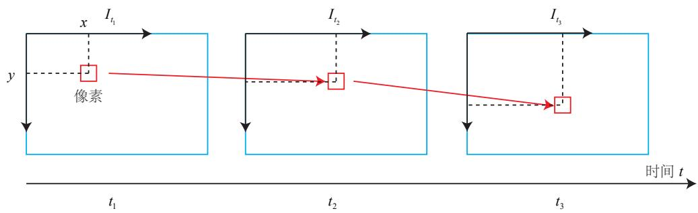

<details>
<summary>flowchart</summary>

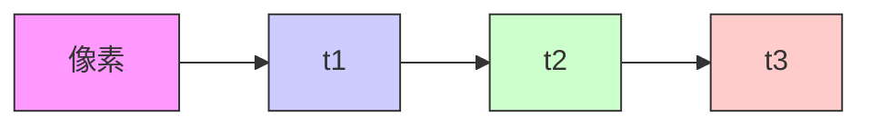
```mermaid
graph LR
  A["像素"] --> B["t1"]
  B --> C["t2"]
  C --> D["t3"]
    style A fill:#f9f,stroke:#333
    style B fill:#ccf,stroke:#333
    style C fill:#cfc,stroke:#333
    style D fill:#fcc,stroke:#333
```
</details>

$\begin{array} { r l } { { \mathcal { J } } _ { \mathcal { K } } \supseteq { \mathcal { J } } _ { \mathcal { K } } \qquad { \overset { \triangledown } { \operatorname { \triangledown } } } \| { \overset { \triangledown } { \operatorname { \triangledown } } } { \overbrace { \operatorname { \triangledown } { \mathcal { K } } } } \langle \frac { \| \Pi } { \operatorname { \bf { \vec { k } } } } { \bf { \vec { k } } } { \bf { \stackrel { \triangledown } { \times } } } : } & { I \left( x _ { 1 } , y _ { 1 } , t _ { 1 } \right) = I \left( x _ { 2 } , y _ { 2 } , t _ { 2 } \right) = I \left( x _ { 3 } , y _ { 3 } , t _ { 3 } \right) } \end{array}$

图 8-1 LK 光流法示意图。

光流是一种描述像素随着时间，在图像之间运动的方法，如图 8-1 所示。随着时间的经过，同一个像素会在图像中运动，而我们希望追踪它的运动过程。计算部分像素运动的称为稀疏光流，计算所有像素的称为稠密光流。稀疏光流以 Lucas-Kanade 光流为代表，并可以在 SLAM 中用于跟踪特征点位置。因此，本节主要介绍 Lucas-Kanade 光流，亦称 LK光流。

## 8.2.1 Lucas-Kanade 光流

在 LK 光流中，我们认为来自相机的图像是随时间变化的。图像可以看作时间的函数：I(t)。那么，一个在 t 时刻，位于 $( x , y )$ 处的像素，它的灰度可以写成

$$
\boldsymbol {I} (x, y, t).
$$

这种方式把图像看成了关于位置与时间的函数，它的值域就是图像中像素的灰度。现在考虑某个固定的空间点，它在 t 时刻的像素坐标为 x, y。由于相机的运动，它的图像坐标将发生变化。我们希望估计这个空间点在其他时刻里图像的位置。怎么估计呢？这里要引入光流法的基本假设：

灰度不变假设：同一个空间点的像素灰度值，在各个图像中是固定不变的。

对于 t 时刻位于 $( x , y )$ 处的像素，我们设 $t + \mathrm { d } t$ 时刻，它运动到 $( x + \mathrm { d } x , y + \mathrm { d } y )$ 处。由于灰度不变，我们有：

$$
\boldsymbol {I} (x + \mathrm{d} x, y + \mathrm{d} y, t + \mathrm{d} t) = \boldsymbol {I} (x, y, t). \tag {8.1}
$$

灰度不变假设是一个很强的假设，实际当中很可能不成立。事实上，由于物体的材质不同，像素会出现高光和阴影部分；有时，相机会自动调整曝光参数，使得图像整体变亮或变暗。这些时候灰度不变假设都是不成立的，因此光流的结果也不一定可靠。然而，从另一方面来说，所有算法都是在一定假设下工作的。如果我们什么假设都不做，就没法设计实用的算法。所以，暂且让我们认为该假设成立，看看如何计算像素的运动。

对左边进行泰勒展开，保留一阶项，得：

$$
\boldsymbol {I} (x + \mathrm{d} x, y + \mathrm{d} y, t + \mathrm{d} t) \approx \boldsymbol {I} (x, y, t) + \frac {\partial \boldsymbol {I}}{\partial x} \mathrm{d} x + \frac {\partial \boldsymbol {I}}{\partial y} \mathrm{d} y + \frac {\partial \boldsymbol {I}}{\partial t} \mathrm{d} t. \tag {8.2}
$$

因为我们假设了灰度不变，于是下一个时刻的灰度等于之前的灰度，从而

$$
\frac {\partial \boldsymbol {I}}{\partial x} \mathrm{d} x + \frac {\partial \boldsymbol {I}}{\partial y} \mathrm{d} y + \frac {\partial \boldsymbol {I}}{\partial t} \mathrm{d} t = 0. \tag {8.3}
$$

两边除以 dt，得：

$$
\frac {\partial \boldsymbol {I}}{\partial x} \frac {\mathrm{d} x}{\mathrm{d} t} + \frac {\partial \boldsymbol {I}}{\partial y} \frac {\mathrm{d} y}{\mathrm{d} t} = - \frac {\partial \boldsymbol {I}}{\partial t}. \tag {8.4}
$$

其中 $\mathrm { d } x / \mathrm { d } t$ 为像素在 x 轴上运动速度，而 $\mathrm { d } y / \mathrm { d } t$ 为 y 轴速度，把它们记为 $u , v \circ$ 。同时 $\partial I / \partial x$ 为图像在该点处 x 方向的梯度，另一项则是在 y 方向的梯度，记为 $I _ { x } , I _ { y }$ 。把图像灰度对时间的变化量记为 $\mathbf { } I _ { t }$ ，写成矩阵形式，有：

$$
\left[ \begin{array}{l l} \boldsymbol {I} _ {x} & \boldsymbol {I} _ {y} \end{array} \right] \left[ \begin{array}{l} u \\ v \end{array} \right] = - \boldsymbol {I} _ {t}. \tag {8.5}
$$

我们想计算的是像素的运动 $u , v$ ，但是该式是带有两个变量的一次方程，仅凭它无法计算出 $u , v { \mathrm { ~ c ~ } }$ 。因此，必须引入额外的约束来计算 $u , v \circ$ 。在 LK 光流中，我们假设某一个窗口内的像素具有相同的运动。

考虑一个大小为 $w \times w$ 大小的窗口，它含有 $w ^ { 2 }$ 数量的像素。由于该窗口内像素具有同样的运动，因此我们共有 $w ^ { 2 }$ 个方程：

$$
\left[ \begin{array}{l l} \boldsymbol {I} _ {x} & \boldsymbol {I} _ {y} \end{array} \right] _ {k} \left[ \begin{array}{l} u \\ v \end{array} \right] = - \boldsymbol {I} _ {t k}, \quad k = 1, \dots , w ^ {2}. \tag {8.6}
$$

记：

$$
\boldsymbol {A} = \left[ \begin{array}{c} {[ \boldsymbol {I} _ {x}, \boldsymbol {I} _ {y} ] _ {1}} \\ \vdots \\ {[ \boldsymbol {I} _ {x}, \boldsymbol {I} _ {y} ] _ {k}} \end{array} \right], \boldsymbol {b} = \left[ \begin{array}{c} {\boldsymbol {I} _ {t 1}} \\ \vdots \\ {\boldsymbol {I} _ {t k}} \end{array} \right]. \tag {8.7}
$$

于是整个方程为：

$$
\boldsymbol {A} \left[ \begin{array}{l} u \\ v \end{array} \right] = - \boldsymbol {b}. \tag {8.8}
$$

这是一个关于 $u , v$ 的超定线性方程，传统解法是求最小二乘解。最小二乘在很多时候都用到过：

$$
\left[ \begin{array}{l} u \\ v \end{array} \right] ^ {*} = - \left(\boldsymbol {A} ^ {T} \boldsymbol {A}\right) ^ {- 1} \boldsymbol {A} ^ {T} \boldsymbol {b}. \tag {8.9}
$$

这样就得到了像素在图像间的运动速度 $u , v \circ$ 。当 t 取离散的时刻而不是连续时间时，我们可以估计某块像素在若干个图像中出现的位置。由于像素梯度仅在局部有效，所以如果一次迭代不够好的话，我们会多迭代几次这个方程。在 SLAM 中，LK 光流常被用来跟踪角点的运动，我们不妨通过程序体会一下。

## 8.3 实践：LK 光流

## 8.3.1 使用 TUM 公开数据集

下面，我们来演示如何用 OpenCV 提供的光流法来跟踪特征点。与上一节一样，我们准备了若干张数据集图像，存放在程序目录中的 data/文件夹下。它们来自于慕尼黑工业大学（TUM）提供的公开 RGB-D 数据集①。以后我们就称之为 TUM 数据集。它含有许多个 RGB-D 视频，可以作为 RGB-D 或单目 SLAM 的实验数据。它还提供了用运动捕捉系统测量的精确轨迹，可以作为标准轨迹以校准 SLAM 系统。由于该数据集比较大，我们没有放到 github 上（否则下载代码的读者要等待很长时间），请读者去数据集主页找到对应的数据。本程序中使用了一部分“freburg1\_desk”数据集中的图像。读者可以在 TUM数据集主页找到它的下载链接。或者，也可以直接使用本书在 github 上提供的部分。

我们的数据位于本章目录的 data/下，以压缩包形式提供（data.tar.gz）。由于 TUM数据集是从实际环境中采集的，需要解释一下它的数据格式（数据集一般都有自己定义的格式）。在解压后，你将看到以下这些文件：

1. rgb.txt 和 depth.txt 记录了各文件的采集时间和对应的文件名。  
2. rgb/ 和 depth/目录存放着采集到的 png 格式图像文件。彩色图像为八位三通道，深度图为 16 位单通道图像。文件名即采集时间。  
3. groundtruth.txt 为外部运动捕捉系统采集到的相机位姿，格式为

$$
(t i m e, t _ {x}, t _ {y}, t _ {z}, q _ {x}, q _ {y}, q _ {z}, q _ {w}),
$$

我们可以把它看成标准轨迹。

请注意彩色图、深度图和标准轨迹的采集都是独立的，轨迹的采集频率比图像高很多。在使用数据之前，需要根据采集时间，对数据进行一次时间上的对齐，以便对彩色图和深度图进行配对。原则上，我们可以把采集时间相近于一个阈值的数据，看成是一对图像。并把相近时间的位姿，看作是该图像的真实采集位置。TUM 提供了一个 python 脚本“asso-ciate.py”（或使用 slambook/tools/associate.py）帮我们完成这件事。请把此文件放到数据集目录下，运行：

1 python associate.py rgb.txt depth.txt > associate.txt

这段脚本会根据输入两个文件中的采集时间进行配对，最后输出到一个文件 asso-ciate.txt。输出文件含有被配对的两个图像的时间、文件名信息，可以作为后续处理的来源。此外，TUM 数据集还提供了比较估计轨迹与标准轨迹的工具，我们将在用到的地方再进行介绍。

## 8.3.2 使用 LK 光流

下面我们来编写程序使用 OpenCV 中的 LK 光流。使用 LK 的目的是跟踪特征点。我们对第一张图像提取 FAST 角点，然后用 LK 光流跟踪它们，并画在图中。

slambook/ch8/useLK/useLK.cpp  
```cpp
#include <iostream>
#include <fstream>
#include <list>
#include <vector>
#include <chrono>
using namespace std;

#include <opencv2/core/core.hpp>
#include <opencv2/highgui/highgui.hpp>
#include <opencv2/features2d/features2d.hpp>
#include <opencv2/video/tracking.hpp>

int main( int argc, char** argv )
{
    if ( argc != 2 )
    {
    cout<<"usage: useLK path_to_dataset"<<endl;
    return 1;
    }

    string path_to_dataset = argv[1];
    string associate_file = path_to_dataset + "/associate.txt";
    ifstream fin( associate_file );
    string rgb_file, depth_file, time_rgb, time_depth;
    list< cv::Point2f > keypoints; // 因为要删除跟踪失败的点，使用 list
    cv::Mat color, depth, last_color;
    for ( int index=0; index<100; index++ )
    {
    fin>>time_rgb>>rgb_file>>time_depth>>depth_file;
    color = cv::imread( path_to_dataset+"/" + rgb_file );
    depth = cv::imread( path_to_dataset+"/" + depth_file, -1 );
    if (index ==0 )
    {
    // 对第一帧提取 FAST 特征点
    vector<cv::KeyPoint> kps;
```

```txt
cv::Ptr<cv::FastFeatureDetector> detector = cv::FastFeatureDetector::create();
detector->detect(color, kps);
for (auto kp:kps)
    keypoints.push_back(kp.pt);
last_color = color;
continue;
}
if (color.data==nullptr || depth.data==nullptr)
    continue;
// 对其他帧用 LK 跟踪特征点
vector<cv::Point2f> next_keypoints;
vector<cv::Point2f> prev_keypoints;
for (auto kp:keypoints)
    prev_keypoints.push_back(kp);
vector<unsigned char> status;
vector<float> error;
chrono::steady_clock::time_point t1 = chrono::steady_clock::now();
cv::calcOpticalFlowPyrLK(last_color, color, prev_keypoints, next_keypoints, status, error);
chrono::steady_clock::time_point t2 = chrono::steady_clock::now();
chrono::duration<double> time_used = chrono::duration_cast<chrono::duration<double>>(t2-t1);
cout<<"LK Flow use time: "<<time_used.count()<<" seconds.""<<endl;
// 把跟丢的点删掉
int i=0;
for (auto iter=keypoints.begin(); iter!=keypoints.end(); i++)
{
    if (status[i] == 0)
    {
    iter = keypoints.erase(iter);
    continue;
    }
    *iter = next_keypoints[i];
    iter++;
}
cout<<"tracked keypoints: "<<keypoints.size()<<endl;
if (keypoints.size() == 0)
{
    cout<<"all keypoints are lost.""<<endl;
    break;
}
// 画出 keypoints
cv::Mat img_show = color.clone();
for (auto kp:keypoints)
    cv::circle(img_show, kp, 10, cv::Scalar(0, 240, 0), 1);
cv::imshow("corners", img_show);
cv::waitFor(0);
last_color = color;
}
return 0;
```

读者应当已经熟悉了 OpenCV 的使用方式，我们就不贴上 CMakeLists.txt 的写法了。该程序的运行参数里需要指定数据集所在的目录，例如：

```txt
./build/useLK ../data
```

我们会在每次循环后暂停程序，按任意键可以继续运行。你会看到图像中大部分特征点能够顺利跟踪到，但也有特征点会丢失。丢失的特征点或是被移出了视野外，或是被其他物体挡住了。如果我们不提取新的特征点，那么光流的跟踪会越来越少：

```txt
1 % build/useLK ../data
2 LK Flow use time: 0.0329535 seconds.
3 tracked keypoints: 1749
4 LK Flow use time: 0.0247758 seconds.
5 tracked keypoints: 1742
6 LK Flow use time: 0.0226143 seconds.
7 tracked keypoints: 1703
8 LK Flow use time: 0.0238692 seconds.
9 tracked keypoints: 1676
10 LK Flow use time: 0.0210466 seconds.
11 tracked keypoints: 1664
12 LK Flow use time: 0.0226533 seconds.
13 tracked keypoints: 1656
14 LK Flow use time: 0.0266527 seconds.
15 tracked keypoints: 1641
16 LK Flow use time: 0.0214207 seconds.
17 tracked keypoints: 1634
```

图 8-2 显示了程序运行过程中若干帧的情况（这里使用了完整的数据集，但本书的 git上只给出了十张图）。最初我们大约有 1700 个特征点。跟踪过程中一部分特征点会丢失，直到 100 帧时我们还有约 178 个特征点，相机视角相对于最初的图像也发生了较大改变。仔细观察特征点的跟踪过程，我们会发现位于物体角点处的特征更加稳定。边缘处的特征会沿着边缘“滑动”，这主要是因为沿着边缘移动时特征块的内容基本不变，因此程序容易认为是同一个地方。而既不在角点，也不在边缘的的特征点则会频繁跳动，位置非常不稳定。这个现象很像围棋中的“金角银边草肚皮”：角点具有更好的辨识度，边缘次之，区块最少。

另一方面，读者可以看到光流法的运行时间。在跟踪 1500 个特征点时，LK 光流法大约需要 20 毫秒左右。如果减小特征点的数量，则会明显减少计算时间。我们看到，LK 光流跟踪法避免了描述子的计算与匹配，但本身也需要一定的计算量。在我们的计算平台上，使用 LK 光流能够节省一定的计算量，但在具体 SLAM 系统中使用光流还是匹配描述子，最好是亲自做实验测试一下。

另外，LK 光流跟踪能够直接得到特征点的对应关系。这个对应关系就像是描述子的匹配，但实际上我们大多数时候只会碰到特征点跟丢的情况，而不太会遇到误匹配，这应该是光流相对于描述子的一点优势。但是，匹配描述子的方法在相机运动较大时仍能成功，而光流必须要求相机运动是微小的。从这方面来说，光流的鲁棒性比描述子差一些。

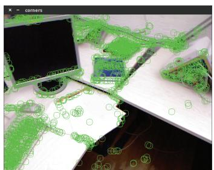

<details>
<summary>text_image</summary>

Screenshot of a computer interface with green circular annotations and a central display showing text and icons.
</details>

t = 0

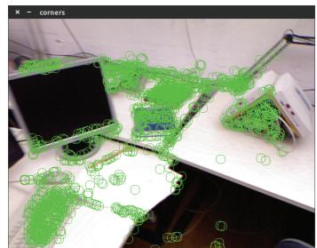

<details>
<summary>text_image</summary>

Street photo with visible store signboards and green circular markers on a map or diagram overlay
</details>

t = 10

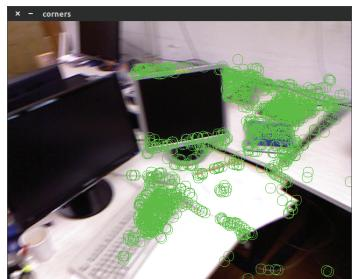

<details>
<summary>natural_image</summary>

Office desk with laptop and computer monitor, overlaid with green circular markers (no readable text or symbols)
</details>

t = 20

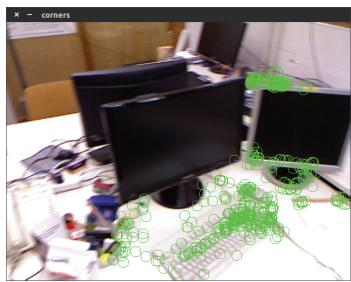

<details>
<summary>natural_image</summary>

Office desk with multiple monitors and green circular overlays on a white surface (no visible text or symbols)
</details>

t = 30

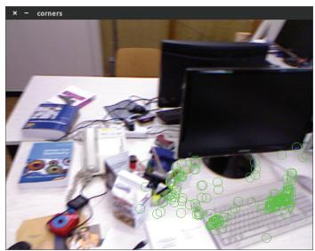

<details>
<summary>natural_image</summary>

Office desk with computer monitor, keyboard, and scattered items (no visible text or symbols)
</details>

t = 40

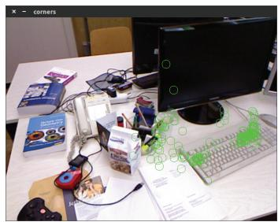

<details>
<summary>natural_image</summary>

Office desk setup with computer monitor, scattered documents, and green circular overlays on a keyboard (no visible text or symbols)
</details>

t = 50  
图 8-2 LK 光流法实验。

最后，我们可以通过光流跟踪的特征点，用 PnP、ICP 或对极几何来估计相机运动，这些方法在上一章中都讲过，我们不再讨论。总而言之，光流法可以加速基于特征点的视觉里程计算法，避免计算和匹配描述子的过程，但要求相机运动较慢（或采集频率较高）。

## 8.4 直接法（Direct Methods）

接下来，我们来讨论与光流有一定相似性的直接法。与前面章节相似，我们先介绍直接法的原理，然后使用 $\mathrm { g 2 o }$ 实现直接法。

## 8.4.1 直接法的推导

如图8-3所示，考虑某个空间点 P 和两个时刻的相机。P 的世界坐标为 $[ X , Y , Z ]$ ，它在两个相机上成像，记非齐次像素坐标为 $\mathbf { \boldsymbol { p } } _ { 1 } , \mathbf { \boldsymbol { p } } _ { 2 }$ 。我们的目标是求第一个相机到第二个相机的相对位姿变换。我们以第一个相机为参照系，设第二个相机旋转和平移为 $R , t$ （对应李代数为 $\pmb { \xi } )$ 。同时，两相机的内参相同，记为 $\kappa ,$ 。为清楚起见，我们列写完整的投影方程：

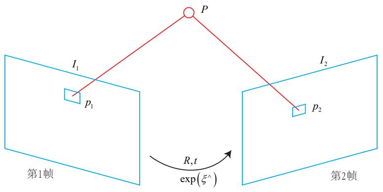

<details>
<summary>text_image</summary>

P
I₁
p₁
I₂
p₂
第1帧
R,t
exp(ξ^)
第2帧
</details>

图 8-3 直接法示意图。

$$
\boldsymbol {p} _ {1} = \left[ \begin{array}{l} u \\ v \\ 1 \end{array} \right] _ {1} = \frac {1}{Z _ {1}} \boldsymbol {K P},
$$

$$
\boldsymbol {p} _ {2} = \left[ \begin{array}{l} u \\ v \\ 1 \end{array} \right] _ {2} = \frac {1}{Z _ {2}} \boldsymbol {K} (\boldsymbol {R P} + \boldsymbol {t}) = \frac {1}{Z _ {2}} \boldsymbol {K} (\exp (\boldsymbol {\xi} ^ {\wedge}) \boldsymbol {P}) _ {1: 3}.
$$

其中 $Z _ { 1 }$ 是 P 的深度， $Z _ { 2 }$ 是 P 在第二个相机坐标系下的深度，也就是 $R P + t$ 的第三个坐标值。由于 $\exp ( \pmb { \xi } ^ { \wedge } )$ 只能和齐次坐标相乘，所以我们乘完之后要取出前三个元素。这和上一讲以及相机模型部分的内容是一致的。

回忆特征点法中，由于我们通过匹配描述子，知道了 $\mathbf { \boldsymbol { p } } _ { 1 } , \mathbf { \boldsymbol { p } } _ { 2 }$ 的像素位置，所以可以计算重投影的位置。但在直接法中，由于没有特征匹配，我们无从知道哪一个 $\mathbf { \mathit { p } } _ { 2 }$ 与 ${ \pmb p } _ { 1 }$ 对应着同一个点。直接法的思路是根据当前相机的位姿估计值，来寻找 $\mathbf { \mathit { p } } _ { 2 }$ 的位置。但若相机位姿不够好， $\mathbf { \mathit { p } } _ { 2 }$ 的外观和 $\pmb { p } _ { 1 }$ 会有明显差别。于是，为了减小这个差别，我们优化相机的位姿，来寻找与 ${ \pmb p } _ { 1 }$ 更相似的 $\mathbf { \mathit { p } } _ { 2 }$ 。这同样可以通过解一个优化问题，但此时最小化的不是重投影误差，而是光度误差（Photometric Error），也就是 P 的两个像的亮度误差：

$$
e = \boldsymbol {I} _ {1} \left(\boldsymbol {p} _ {1}\right) - \boldsymbol {I} _ {2} \left(\boldsymbol {p} _ {2}\right). \tag {8.10}
$$

注意这里 e 是一个标量，所以没有加粗。同样的，优化目标为该误差的二范数，暂时取不加权的形式，为：

$$
\min _ {\boldsymbol {\xi}} J (\boldsymbol {\xi}) = \| e \| ^ {2}. \tag {8.11}
$$

能够做这种优化的理由，仍是基于灰度不变假设。在直接法中，我们假设一个空间点在各个视角下，成像的灰度是不变的。我们有许多个（比如 N 个）空间点 $P _ { i }$ ，那么，整个相机位姿估计问题变为：

$$
\min _ {\boldsymbol {\xi}} J (\boldsymbol {\xi}) = \sum_ {i = 1} ^ {N} e _ {i} ^ {T} e _ {i}, \quad e _ {i} = \boldsymbol {I} _ {1} \left(\boldsymbol {p} _ {1, i}\right) - \boldsymbol {I} _ {2} \left(\boldsymbol {p} _ {2, i}\right). \tag {8.12}
$$

注意这里的优化变量是相机位姿 ξ。为了求解这个优化问题，我们关心误差 e 是如何随着相机位姿 ξ 变化的，需要分析它们的导数关系。因此，使用李代数上的扰动模型。我们给 exp(ξ) 左乘一个小扰动 exp(δξ)，得：①

$$
\begin{array}{l} e \left(\boldsymbol {\xi} \oplus \delta \boldsymbol {\xi}\right) = \boldsymbol {I} _ {1} \left(\frac {1}{Z _ {1}} \boldsymbol {K} \boldsymbol {P}\right) - \boldsymbol {I} _ {2} \left(\frac {1}{Z _ {2}} \boldsymbol {K} \exp \left(\delta \boldsymbol {\xi} ^ {\wedge}\right) \exp \left(\boldsymbol {\xi} ^ {\wedge}\right) \boldsymbol {P}\right) \\ \approx I _ {1} \left(\frac {1}{Z _ {1}} K P\right) - I _ {2} \left(\frac {1}{Z _ {2}} K (1 + \delta \pmb {\xi} ^ {\wedge}) \exp (\pmb {\xi} ^ {\wedge}) P\right) \\ = \boldsymbol {I} _ {1} \left(\frac {1}{Z _ {1}} \boldsymbol {K} \boldsymbol {P}\right) - \boldsymbol {I} _ {2} \left(\frac {1}{Z _ {2}} \boldsymbol {K} \exp (\boldsymbol {\xi} ^ {\wedge}) \boldsymbol {P} + \frac {1}{Z _ {2}} \boldsymbol {K} \delta \boldsymbol {\xi} ^ {\wedge} \exp (\boldsymbol {\xi} ^ {\wedge}) \boldsymbol {P}\right). \\ \end{array}
$$

类似于上一章，记

$$
\begin{array}{l} \boldsymbol {q} = \delta \boldsymbol {\xi} ^ {\wedge} \exp (\boldsymbol {\xi} ^ {\wedge}) \boldsymbol {P}, \\ \boldsymbol {u} = \frac {1}{Z _ {2}} \boldsymbol {K} \boldsymbol {q}. \\ \end{array}
$$

这里的 q 为 P 在扰动之后，位于第二个相机坐标系下的坐标，而 u 为它的像素坐标。

利用一阶泰勒展开，有：

$$
\begin{array}{l} e (\boldsymbol {\xi} \oplus \delta \boldsymbol {\xi}) = \boldsymbol {I} _ {1} \left(\frac {1}{Z _ {1}} \boldsymbol {K} \boldsymbol {P}\right) - \boldsymbol {I} _ {2} \left(\frac {1}{Z _ {2}} \boldsymbol {K} \exp (\boldsymbol {\xi} ^ {\wedge}) \boldsymbol {P} + \boldsymbol {u}\right) \\ \approx I _ {1} \left(\frac {1}{Z _ {1}} K P\right) - I _ {2} \left(\frac {1}{Z _ {2}} K \exp \left(\boldsymbol {\xi} ^ {\wedge}\right) P\right) - \frac {\partial I _ {2}}{\partial \boldsymbol {u}} \frac {\partial \boldsymbol {u}}{\partial \boldsymbol {q}} \frac {\partial \boldsymbol {q}}{\partial \delta \boldsymbol {\xi}} \delta \boldsymbol {\xi} \\ = e (\boldsymbol {\xi}) - \frac {\partial \boldsymbol {I} _ {2}}{\partial \boldsymbol {u}} \frac {\partial \boldsymbol {u}}{\partial \boldsymbol {q}} \frac {\partial \boldsymbol {q}}{\partial \delta \boldsymbol {\xi}} \delta \boldsymbol {\xi}. \\ \end{array}
$$

我们看到，一阶导数由于链式法则分成了三项，而这三项都是容易计算的：

1. $\partial I _ { 2 } / \partial { \boldsymbol u }$ 为 u 处的像素梯度；  
2. ${ \partial \mathbf { } u } / { \partial q }$ 为投影方程关于相机坐标系下的三维点的导数。记 $\pmb { q } = [ X , Y , Z ] ^ { T }$ ，根据上一节的推导，导数为：

$$
\frac {\partial \boldsymbol {u}}{\partial \boldsymbol {q}} = \left[ \begin{array}{c c c} \frac {\partial u}{\partial X} & \frac {\partial u}{\partial Y} & \frac {\partial u}{\partial Z} \\ \frac {\partial v}{\partial X} & \frac {\partial v}{\partial Y} & \frac {\partial v}{\partial Z} \end{array} \right] = \left[ \begin{array}{c c c} \frac {f _ {x}}{Z} & 0 & - \frac {f _ {x} X}{Z ^ {2}} \\ 0 & \frac {f _ {y}}{Z} & - \frac {f _ {y} Y}{Z ^ {2}} \end{array} \right]. \tag {8.13}
$$

3. $\partial \pmb q / \partial \delta \pmb \xi$ 为变换后的三维点对变换的导数，这在李代数章节已经介绍过了：

$$
\frac {\partial \boldsymbol {q}}{\partial \delta \boldsymbol {\xi}} = [ \boldsymbol {I}, - \boldsymbol {q} ^ {\wedge} ]. \tag {8.14}
$$

在实践中，由于后两项只与三维点 q 有关，而与图像无关，我们经常把它合并在一起：

$$
\frac {\partial \boldsymbol {u}}{\partial \delta \boldsymbol {\xi}} = \left[ \begin{array}{c c c c c c} \frac {f _ {x}}{Z} & 0 & - \frac {f _ {x} X}{Z ^ {2}} & - \frac {f _ {x} X Y}{Z ^ {2}} & f _ {x} + \frac {f _ {x} X ^ {2}}{Z ^ {2}} & - \frac {f _ {x} Y}{Z} \\ 0 & \frac {f _ {y}}{Z} & - \frac {f _ {y} Y}{Z ^ {2}} & - f _ {y} - \frac {f _ {y} Y ^ {2}}{Z ^ {2}} & \frac {f _ {y} X Y}{Z ^ {2}} & \frac {f _ {y} X}{Z} \end{array} \right]. \tag {8.15}
$$

这个 $2 \times 6$ 的矩阵在上一讲中也出现过。于是，我们推导了误差相对于李代数的雅可比矩阵：

$$
\boldsymbol {J} = - \frac {\partial \boldsymbol {I} _ {2}}{\partial \boldsymbol {u}} \frac {\partial \boldsymbol {u}}{\partial \delta \boldsymbol {\xi}}. \tag {8.16}
$$

对于 N 个点的问题，我们可以用这种方法计算优化问题的雅可比，然后使用 G-N 或L-M 计算增量，迭代求解。至此，我们推导了直接法估计相机位姿的整个流程，下面我们通过程序来演示一下直接法是如何使用的。

## 8.4.2 直接法的讨论

在我们上面的推导中，P 是一个已知位置的空间点，它是怎么来的呢？在 RGB-D 相机下，我们可以把任意像素反投影到三维空间，然后投影到下一个图像中。如果在单目相机中，这件事情要更为困难，因为我们还需考虑由 P 的深度带来的不确定性。详细的深度估计放到 13 讲中讨论。现在我们先来考虑简单的情况，即 P 深度已知的情况。

根据 P 的来源，我们可以把直接法进行分类：

1. P 来自于稀疏关键点，我们称之为稀疏直接法。通常我们使用数百个至上千个关键点，并且像 L-K 光流那样，假设它周围像素也是不变的。这种稀疏直接法不必计算描述子，并且只使用数百个像素，因此速度最快，但只能计算稀疏的重构。  
2. P 来自部分像素。我们看到式（8.16）中，如果像素梯度为零，整一项雅可比就为零，不会对计算运动增量有任何贡献。因此，可以考虑只使用带有梯度的像素点，舍弃像素梯度不明显的地方。这称之为半稠密（Semi-Dense）的直接法，可以重构一个半稠密结构。  
3. P 为所有像素，称为稠密直接法。稠密重构需要计算所有像素（一般几十万至几百万个），因此多数不能在现有的 CPU 上实时计算，需要 GPU 的加速。但是，如前面所讨论的，梯度不明显的点，在运动估计中不会有太大贡献，在重构时也会难以估计位置。

可以看到，从稀疏到稠密重构，都可以用直接法来计算。它们的计算量是逐渐增长的。稀疏方法可以快速地求解相机位姿，而稠密方法可以建立完整地图。具体使用哪种方法，需要视机器人的应用环境而定。特别地，在低端的计算平台上，稀疏直接法可以做到非常快速的效果，适用于实时性较高且计算资源有限的场合 [58]。

## 8.5 实践：RGB-D 的直接法

## 8.5.1 稀疏直接法

现在，我们来演示如何使用稀疏的直接法。由于本书不涉及 GPU 编程，稠密的直接法就省略掉了。同时，为了保持程序简单，我们使用 RGB-D 数据而非单目数据，这样可以省略掉单目的深度恢复部分。基于特征点的深度恢复已经在上一讲介绍过了，而基于块匹配的深度恢复将在后面章节中介绍。所以本节我们来考虑 RGB-D 上的稀疏直接法 $\mathrm { V O }$ 。

由于求解直接法最后等价于求解一个优化问题，因此我们可以使用 $\mathrm { g 2 o }$ 或 Ceres 这些优化库帮助我们求解。本节以 $\mathrm { g 2 o }$ 为例设计实验，而 Ceres 部分则留作习题。在使用 $\mathrm { g 2 o }$ 之前，需要把直接法抽象成一个图优化问题。显然，直接法是由以下顶点和边组成的：

1. 优化变量为一个相机位姿，因此需要一个位姿顶点。由于我们在推导中使用了李代数，故程序中使用李代数表达的 SE(3) 位姿顶点。与上一章一样，我们将使用“Ver-texSE3Expmap”作为相机位姿。  
2. 误差项为单个像素的光度误差。由于整个优化过程中 ${ \cal I } _ { 1 } ( p _ { 1 } )$ 保持不变，我们可以把它当成一个固定的预设值，然后调整相机位姿，使 $I _ { 2 } ( p _ { 2 } )$ 接近这个值。于是，这种边只连接一个顶点，为一元边。由于 g2o 中本身没有计算光度误差的边，我们需要自己定义一种新的边。

在上述的建模中，直接法图优化问题是由一个相机位姿顶点与许多条一元边组成的。如果使用稀疏的直接法，那我们大约会有几百至几千条这样的边；稠密直接法则会有几十万条边。优化问题对应的线性方程是计算李代数增量，本身规模不大（6×6），所以主要的计算时间会花费在每条边的误差与雅可比的计算上。下面的实验中，我们先来定义一种用于直接法位姿估计的边，然后，使用该边构建图优化问题并求解之。实验工程位于“slam-book/ch8/directMethod”中。

## 8.5.2 定义直接法的边

首先我们来定义计算光度误差的边。按照前面的推导，还需要给出它的雅可比矩阵：

slambook/ch8/directMethod/direct\_sparse.cpp（片段）  
```cpp
// project a 3d point into an image plane, the error is photometric error
// an unary edge with one vertex SE3Expmap (the pose of camera)
class EdgeSE3ProjectDirect: public BaseUnaryEdge< 1, double, VertexSE3Expmap>
{
public:
    EIGEN_MAKE_ALIGNED_OPERATOR_NEW
    EdgeSE3ProjectDirect() {}
    EdgeSE3ProjectDirect ( Eigen::Vector3d point, float fx, float fy, float cx, float cy, cv::Mat* image ) : x_world_ ( point ), fx_ ( fx ), fy_ ( fy ), cx_ ( cx ), cy_ ( cy ), image_ ( image )
    {}
    virtual void computeError()
    {
    const VertexSE3Expmap* v =static_cast<const VertexSE3Expmap*>( _vertices[0] );
    Eigen::Vector3d x_local = v->estimate().map ( x_world_ );
    float x = x_local[0]*fx_/x_local[2] + cx_;
    float y = x_local[1]*fy_/x_local[2] + cy_;
    // check x,y is in the image
    if ( x-4<0 || ( x+4 ) >image_->cols || ( y-4 ) <0 || ( y+4 ) >image_->rows )
```

```cpp
{
    _error (0,0) = 0.0;
    this->setLevel(1);
}
else
{
    _error (0,0) = getPixelValue(x,y) - _measurement;
}
}

// plus in manifold
virtual void linearize0plus()
{
    if (level() == 1)
    {
    _jacobian0plusXi = Eigen::Matrix<double, 1, 6>::Zero();
    return;
    }
    VertexSE3Expmap* vtx = static_cast<VertexSE3Expmap*> (_vertices[0]);
    Eigen::Vector3d xyz_trans = vtx->estimate().map(x_world_); // q in book

    double x = xyz_trans[0];
    double y = xyz_trans[1];
    double invz = 1.0/xyz_trans[2];
    double invz_2 = invz*invz;

    float u = x*fx_*invz + cx_;
    float v = y*fy_*invz + cy_;
    // jacobian from se3 to u,v
    // NOTE that in g2o the Lie algebra is (\omega, \epsilon), where \omega is so(3) and \epsilon the translation
    Eigen::Matrix<double, 2, 6> jacobian_uv_ksai;

    jacobian_uv_ksai (0,0) = -x*y*invz_2 *fx_;
    jacobian_uv_ksai (0,1) = (1+ (x*x*invz_2)) *fx_;
    jacobian_uv_ksai (0,2) = -y*invz *fx_;
    jacobian_uv_ksai (0,3) = invz *fx_;
    jacobian_uv_ksai (0,4) = 0;
    jacobian_uv_ksai (0,5) = -x*invz_2 *fx_;
    jacobian_uv_ksai (1,0) = -(1+y*y*invz_2)*fy_;
    jacobian_uv_ksai (1,1) = x*y*invz_2 *fy_;
    jacobian_uv_ksai (1,2) = x*invz *fy_;
    jacobian_uv_ksai (1,3) = 0;
    jacobian_uv_ksai (1,4) = invz *fy_;
    jacobian_uv_ksai (1,5) = -y*invz_2 *fy_;
    Eigen::Matrix<double, 1, 2> jacobian_pixel_uv;
```

```cpp
jacobian_pixel_uv (0,0) = ( RampValue(u+1,v)- RampValue(u-1,v)) /2;
jacobian_pixel_uv (0,1) = ( RampValue(u,v+1)- RampValue(u,v-1)) /2;

_jacobianOplusXi = jacobian_pixel_uv*jacobian_uv_ksai;
}

// dummy read and write functions because we don't care...
virtual bool read (std::istream& in) {}
virtual bool write (std::ostream& out) const {}

protected:
    // get a gray scale value from reference image (bilinear interpolated)
inline float getPixelValue(float x, float y)
{
    uchar* data = & image_->data[int(y)*image_->step + int(x)];
    float xx = x - floor(x);
    float yy = y - floor(y);
    return float(
    (1-xx)*(1-yy)*data[0] +
    xx*(1-yy)*data[1] +
    (1-xx)*yy*data[image_->step] +
    xx*yy*data[image_->step+1]
    );
}

public:
Eigen::Vector3d x_world_; // 3D point in world frame
float cx_=0, cy_=0, fx_=0, fy_=0; // Camera intrinsics
cv::Mat* image_=nullptr; // reference image
};
```

我们的边继承自 g2o::BaseUnaryEdge。在继承时，需要在模板参数里填入测量值的维度、类型，以及连接此边的顶点，同时，我们把空间点 P、相机内参和图像存储在该边的成员变量中。为了让 g2o 优化该边对应的误差，我们需要覆写两个虚函数：用 computeError()计算误差值，用 linearizeOplus() 计算雅可比。可以看到，这里的雅可比计算与式（8.16）是一致的。注意我们在程序中的误差计算里，使用了 ${ \cal I } _ { 2 } ( p _ { 2 } ) - { \cal I } _ { 1 } ( p _ { 1 } )$ 的形式，因此前面的负号可以省去，只需把像素梯度乘以像素到李代数的梯度即可。

在程序中，相机位姿是用浮点数表示的，投影到像素坐标也是浮点形式。为了更精细地计算像素亮度，我们要对图像进行插值。我们这里采用了简单的双线性插值，也可以使用更复杂的插值方式，但计算代价可能会变高一些。

## 8.5.3 使用直接法估计相机运动

定义了 g2o 边后，我们将节点和边组合成图，就可以调用 g2o 进行优化了。实现代码位于 slambook/ch8/directMethod/direct\_sparse.cpp 中，请读者阅读该部分代码并编译

它。

在这个实验中，我们读取数据集的 RGB-D 图像序列。以第一个图像为参考帧，然后用直接法求解后续图像的位姿。在参考帧中，对第一张图像提取 FAST 关键点（不需要描述子），并使用直接法估计这些关键点在第二个图像中的位置，以及第二个图像的相机位姿。这就构成了一种简单的稀疏直接法。最后，我们画出这些关键点在第二个图像中的投影。

运行：

```txt
1 build/direct_sparse ~/dataset/rgbd_dataset_freiburg1_desk
```

程序会在作图之后暂停，你可以看到特征点的位置关系，终端也会输出迭代误差的下降过程。

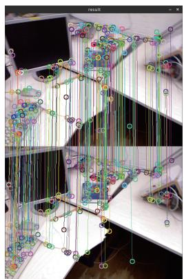

<details>
<summary>flowchart</summary>


```mermaid
graph TD
  A["Node"] --> B["Node"]
  B --> C["Node"]
  C --> D["Node"]
  D --> E["Node"]
  E --> F["Node"]
  F --> G["Node"]
  G --> H["Node"]
  H --> I["Node"]
  I --> J["Node"]
  J --> K["Node"]
  K --> L["Node"]
  L --> M["Node"]
  M --> N["Node"]
  N --> O["Node"]
  O --> P["Node"]
  P --> Q["Node"]
  Q --> R["Node"]
  R --> S["Node"]
  S --> T["Node"]
  T --> U["Node"]
  U --> V["Node"]
  V --> W["Node"]
  W --> X["Node"]
  X --> Y["Node"]
  Y --> Z["Node"]
```
</details>

0-1

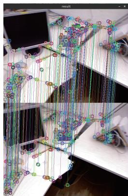

<details>
<summary>natural_image</summary>

Two-panel diagram showing a 3D molecular or network structure with colored nodes and connecting lines, no readable text or symbols present.
</details>

0-3

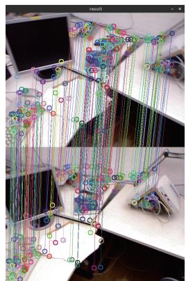

<details>
<summary>text_image</summary>

Screenshot of a robot control system interface with connected robot sensors and a 3D object display showing sensor placement.
</details>

0-9  
图 8-4 稀疏直接法的实验。左：误差随着迭代下降。右：参考帧与后 1 至 9 帧对比（选取部分关键点）。

如图 8-4 所示，我们看到在两个图像相差不多的时候，直接法会调整相机的位姿，使得大部分像素都能够正确跟踪。但是，在稍长一点的时间内，比如说 0-9 帧之间的对比，我们发现由于相机位姿估计不准确，特征点出现了明显的偏移现象。我们会在本讲末尾对它进行分析。

## 8.5.4 半稠密直接法

我们很容易就能把程序拓展成半稠密的直接法形式。对参考帧中，先提取梯度较明显的像素，然后用直接法，以这些像素为图优化边，来估计相机运动。对先前的程序做如下

的修改：

slambook/ch8/direct\_semidense.cpp  
```cpp
// select the pixels with high gradants
for ( int x=10; x<gray.cols-10; x++)
    for ( int y=10; y<gray.rows-10; y++)
    {
    Eigen::Vector2d delta (
    gray.ptr<uchar>(y)[x+1] - gray.ptr<uchar>(y)[x-1],
    gray.ptr<uchar>(y+1)[x] - gray.ptr<uchar>(y-1)[x]
    );
    if ( delta.norm() < 50 )
    continue;
    ushort d = depth.ptr<ushort>(y)[x];
    if ( d==0 )
    continue;
    Eigen::Vector3d p3d = project2Dto3D ( x, y, d, fx, fy, cx, cy, depth_scale );
    float grayscale = float ( gray.ptr<uchar>(y) [x] );
    measurements.push_back ( Measurement ( p3d, grayscale ) );
    }
```

这只是一个很简单的改动。我们把先前的稀疏特征点改成了带有明显梯度的像素。于是在图优化中会增加许多的边。这些边都会参与估计相机位姿的优化问题，利用大量的像素而不单单是稀疏的特征点。由于我们并没有使用所有的像素，所以这种方式又称为半稠密方法（Semi-dense）。我们把参与估计的像素取出来并把它们在图像中显示出来，如图 8-5 所示。

如果读者亲自做了实验，就可以看到参与估计的像素，像是固定在空间中一样。当相机旋转时，它们的位置似乎没有发生变化。这代表了我们估计的相机运动是正确的。同时，你可以检查我们使用的像素数量与优化时间的关系。显然，当像素增多时，优化会更加费时，所以为了实时性，需要考虑使用较好的像素点，或者降低图像的分辨率。不过对于演示实验来说，我认为这样已经能够让读者理解直接法的意义了。

## 8.5.5 直接法的讨论

相比于特征点法，直接法完全依靠优化来求解相机位姿。从式（8.16）中可以看到，像素梯度引导着优化的方向。如果我们想要得到正确的优化结果，就必须保证大部分像素梯度能够把优化引导到正确的方向。

这是什么意思呢？我们不妨设身处地地扮演一下优化算法。假设对于参考图像，我们测量到一个灰度值为 229 的像素。并且，由于我们知道它的深度，可以推断出空间点 P 的位置（图 8-6 中在 $I _ { 1 }$ 中测量到的灰度）。

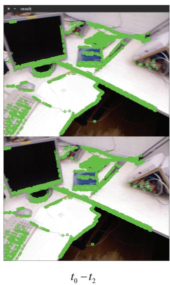

<details>
<summary>text_image</summary>

result
t₀ - t₂
</details>

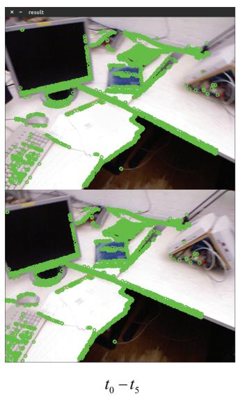

<details>
<summary>text_image</summary>

x = result
t₀ - t₅
</details>

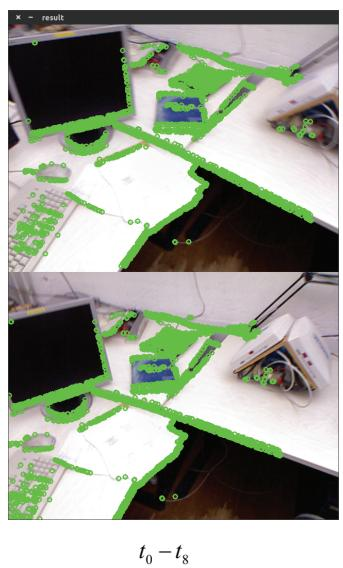

<details>
<summary>text_image</summary>

x = result
t₀ - t₈
</details>

图 8-5 半稠密直接法的实验。参考帧与 2,5,8 帧的对比，绿色为参与优化的像素。

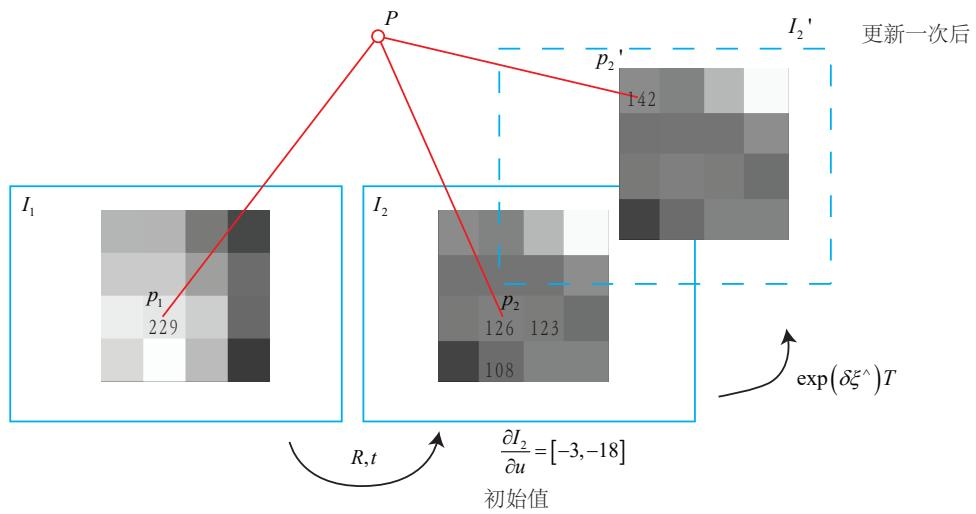

<details>
<summary>text_image</summary>

P
I₁
p₁
229
I₂
p₂
142
I₂′
更新一次后
I₂
p₂
126 123
108
exp(δξ^)T
R,t
∂I₂/∂u = [-3,-18]
初始值
</details>

图 8-6 一次迭代的图形化显示。

此时我们又得到了一张新的图像，需要估计它的相机位姿。这个位姿是由一个初值不断地优化迭代得到的。假设我们的初值比较差，在这个初值下，空间点 P 投影后的像素灰度值是 126。于是，这个像素的误差为 229−126 = 103。为了减小这个误差，我们希望微调相机的位姿，使像素更亮一些。

怎么知道往哪里微调，像素会更亮呢？这就需要用到局部的像素梯度。我们在图像中发现，沿 u 轴往前走一步，该处的灰度值变成了 123，即减去了 3。同样地，沿 v 轴往前走一步，灰度值减 18，变成 108。在这个像素周围，我们看到梯度是 [−3,−18]，为了提高亮度，我们会建议优化算法微调相机，使 P 的像往左上方移动。在这个过程中，我们用像素的局部梯度近似了它附近的灰度分布，不过请注意真实图像并不是光滑的，所以这个梯度在远处就不成立了。

但是，优化算法不能只听这个像素的一面之词，还需要听取其他像素的建议①。综合听取了许多像素的意见之后，优化算法选择了一个和我们建议的方向偏离不远的地方，计算出一个更新量 $\exp ( \pmb { \xi } ^ { \wedge } )$ 。加上更新量后，图像从 $I _ { 2 }$ 移动到 $\textsf { T } I _ { 2 } ^ { \prime }$ ，像素的投影位置也变到了一个更亮的地方。我们看到，通过这次更新，误差变小了。在理想情况下，我们期望误差会不断下降，最后收敛。

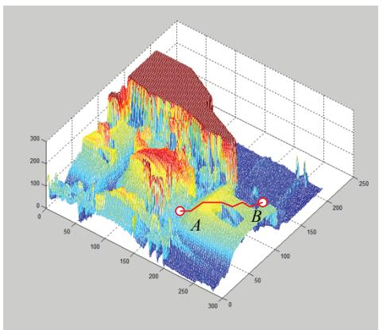

<details>
<summary>text_image</summary>

3D surface plot with color-coded elevation and labeled points A and B, showing spatial distribution across X, Y, Z axes.
</details>

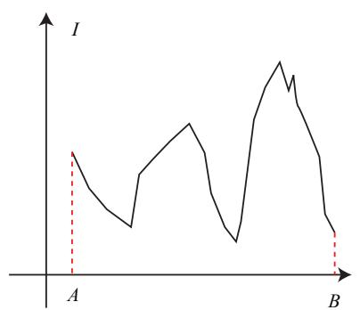

<details>
<summary>line chart</summary>

| Point | Value |
|-------|-------|
| A     | Peak  |
| B     | Low   |
</details>

图 8-7 一张图像的三维化显示。从图像中的一个点运动到另一个点的路径不见得是“笔直的下坡路”，而需要经常的“翻山越岭”。这体现了图像本身的非凸性。

但是实际是不是这样呢？我们是否真的只要沿着梯度方向走，就能走到一个最优值？注意到，直接法的梯度是直接由图像梯度确定的，因此我们必须保证沿着图像梯度走时，灰度误差会不断下降。然而，图像通常是一个很强烈的非凸函数，如图 8-7 所示。实际当中，如果我们沿着图像梯度前进，很容易由于图像本身的非凸性（或噪声）落进一个局部极小值中，无法继续优化。只有当相机运动很小，图像中的梯度不会有很强的非凸性时，直接法才能成立。

在例程中，我们只计算了单个像素的差异，并且这个差异是由灰度直接相减得到的。然而，单个像素没有什么区分性，周围很可能有好多像素和它的亮度差不多。所以，我们有时会使用小的图像块（patch），并且使用更复杂的差异度量方式，例如归一化相关性（Normalized Cross Correlation，NCC）等（见 13 讲）。而例程为了简单起见，使用了误差的平方和，以保持和推导的一致性。

## 8.5.6 直接法优缺点总结

最后，我们总结一下直接法的优缺点。大体来说，它的优点如下：

• 可以省去计算特征点、描述子的时间。  
• 只要求有像素梯度即可，无须特征点。因此，直接法可以在特征缺失的场合下使用。比较极端的例子是只有渐变的一张图像。它可能无法提取角点类特征，但可以用直接法估计它的运动。  
• 可以构建半稠密乃至稠密的地图，这是特征点法无法做到的。

另一方面，它的缺点也很明显：

• 非凸性——直接法完全依靠梯度搜索，降低目标函数来计算相机位姿。其目标函数中需要取像素点的灰度值，而图像是强烈非凸的函数。这使得优化算法容易进入极小，只在运动很小时直接法才能成功。  
• 单个像素没有区分度。找一个和他像的实在太多了！——于是我们要么计算图像块，要么计算复杂的相关性。由于每个像素对改变相机运动的“意见”不一致。只能少数服从多数，以数量代替质量。  
• 灰度值不变是很强的假设。如果相机是自动曝光的，当它调整曝光参数时，会使得图像整体变亮或变暗。光照变化时亦会出现这种情况。特征点法对光照具有一定的容忍性，而直接法由于计算灰度间的差异，整体灰度变化会破坏灰度不变假设，使算法失败。针对这一点，目前的直接法开始使用更细致的光度模型标定相机，以便在曝光时间变化时也能让直接法工作。

## 习题

1. 除了 LK 光流之外，还有哪些光流方法？它们各有什么特点？  
2. 在本节的程序的求图像梯度过程中，我们简单地求了 u+ 1 和 u−1 的灰度之差除 2，作为 u 方向上的梯度值。这种做法有什么缺点？提示：对于距离较近的特征，变化应该较快；而距离较远的特征在图像中变化较慢，求梯度时能否利用此信息？  
3. 在稀疏直接法中，假设单个像素周围小块的光度也不变，是否可以提高算法鲁棒性？请编程实现此事。  
4. \* 使用 Ceres 实现 RGB-D 上的稀疏直接法和半稠密直接法。  
5. 相比于 RGB-D 的直接法，单目直接法往往更加复杂。除了匹配未知之外，像素的距离也是待估计的。我们需要在优化时把像素深度也作为优化变量。阅读 [59, 57]，你能理解它的原理吗？如果不能，请在 13 讲之后再回来阅读。  
6. 由于图像的非凸性，直接法目前还只能用于短距离，非自动曝光的相机。你能否提出增强直接法鲁棒性的方案？阅读 [58, 60] 可能会给你一些灵感。

## 第 9 讲

## 实践章：设计前端

## 本节目标

1. 实际设计一个视觉里程计前端。  
2. 理解 SLAM 软件框架是如何搭建的。  
3. 理解在前端设计中容易出现的问题，以及修补的方式。

本讲是书中比较少见的一个完全由实践部分组成的章节。我们将使用前两节学到的知识，实际来书写一个视觉里程计程序。你会管理局部的机器人轨迹与路标点，并体验一下一个软件框架是如何组成的。在操作过程中，我们会遇到许多问题：相机运动过快、图像模糊、误匹配……都会使算法失效。要让程序稳定运行，我们需要处理以上的种种情况，这将带来许多的工程实现方面的，有益的讨论。

## 9.1 搭建 VO 框架

知晓了砖头和水泥的原理，并不代表能够建造伟大的宫殿。

在作者深爱的“我的世界”游戏中，玩家拥有的只是一些色彩、纹理不同的方块。它们的性质极其简单，而玩家所做的只是把这些方块放在空地上而已。理解一个方块至为简单，但实际拿起他们时，初学者往往只能搭建简单的火柴盒房屋，而有经验、有创造力的玩家则可用这些简单的方块，建造民居、园林、楼台亭榭乃至雄伟的城市（图 9-1 ）①。

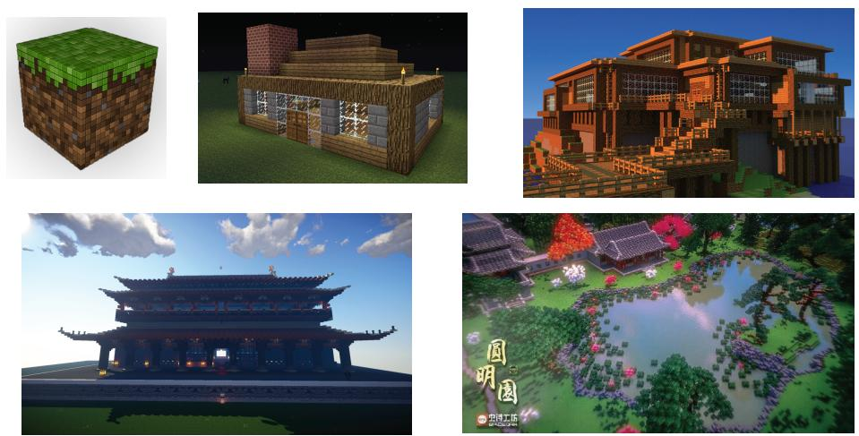  
图 9-1 从简单的事物出发，逐渐搭建越来越复杂，但越来越优秀的作品。

在 SLAM 中，我们应该认为工程实现和理解算法原理至少是同等重要的，甚至更应强调如何书写实际可用的程序。算法的原理，就像一个个方块一样，我们可以清楚明确地讨论它们的原理和性质，但仅仅理解了一个方块并不能使你建造真正的建筑：它们需要大量的尝试、时间和经验，我们鼓励读者往更为实际的方向努力——但它们往往是十分复杂的。就像在《我的世界》里那样，你需要掌握各种立柱、墙面、屋顶的结构，墙面的雕花，几何形体角度的计算，这些远远不像讨论每个方块的性质那样简单。

SLAM 的具体实现亦是如此，一个实用的程序会有很多的工程设计和技巧（Trick），还需讨论每一步出现问题之后将如何处理。原则上说，每个人实现的 SLAM 都会有所不同，多数时候我们并不能说哪种实现方式就一定是最好的。但是，我们通常会遇到一些共同的问题：“怎么管理地图点”、“如何处理误匹配”、“如何选择关键帧”等等。我希望你能对这些可能出现的问题产生一些直观的感觉——我们认为这种感觉是非常重要的。

所以，出于对实践的重视，本章我们将带领读者领略一下搭建 SLAM 框架的过程。就像建筑那样，我们要讨论柱间距、门面宽高比等琐碎但重要的问题。一个 SLAM 工程是复杂的。即使我们只保留核心的部分，也会占据大量的篇幅，导致本书变得过于沉重。不过，请注意到，尽管完成之后的工程是复杂的，但是中间的“由简到繁”的过程，是值得详细讨论，有学习的价值的。所以，我们要从简单的数据结构出发，先来做一个简单的视觉里程计，再慢慢地把一些额外的功能加进来。换言之，我们要把从简单的复杂的过程展现给读者看，这样你才会明白一个库是如何像雪人那样慢慢堆起来的。

实践章的代码放在 slambook/project 中。由于随着开发过程不断前进，我们会对工程做一些删改，因此它的内容也会发生变化。所以我们会把中间的代码也保留在目录中，以版本号命名，以便读者随时查看、模仿。

## 9.1.1 确定程序框架

根据前两章的内容，我们知道视觉里程计分单目、双目、RGB-D 三大类。单目视觉相对复杂，而 RGB-D 最为简单，没有初始化，也没有尺度问题。本着由简入繁的精神，我们先从 RGB-D 做起。为了方便读者做实验，我们将使用数据集而非实际的 RGB-D 相机（因为不能保证读者人手都有一台 RGB-D 相机）。

首先，我们来了解一下 Linux 程序的组织方式。在编写一个小规模的库时，我们通常会建立一些文件夹，把源代码、头文件、文档、测试数据、配置文件、日志等等分类存放，这样会显得很有条理。如果一个库内容很多，我们还会把代码分解各个独立的小模块，以便测试。读者可以参照 OpenCV 或 g2o 的组织方式，看看一个大中型库是如何组织的。例如，OpenCV 有 core、imgproc、features2d 等模块，每个模块分别负责不同的任务。g2o则有 core、solvers、types 等若干种。不过在小型程序里，我们也可以把所有的东西揉在一起，称为 SLAM 库。

现在我们要写的 SLAM 库是一个小型库，目标是帮读者将本书用到的各种算法融会贯通，书写自己的 SLAM 程序。挑选一个工程目录，在它下面建立这些文件夹来组织代码文件：

1. bin 用来存放可执行的二进制；  
2. include/myslam 存放 slam 模块的头文件，主要是.h。这种做法的理由是，当你把包含目录设到 include 时，在引用自己的头文件时，需要写 include ”myslam/xxx.h”，这样不容易和别的库混淆。  
3. src 存放源代码文件，主要是 cpp；  
4. test 存放测试用的文件，也是 cpp；

5. lib 存放编译好的库文件；  
6. config 存放配置文件；  
7. cmake\_modules 第三方库的 cmake 文件，在使用 g2o 之类的库中会用到它。

以上就是我们的目录结构，如图 9-2 所示。相比于我们之前每一章内都零零散散地放着的 main.cpp，这种做法显得更有条理。是不是更加整齐一些呢？接下来，我们会在这些目录里不断地添加新文件，渐渐形成一个完整的程序。

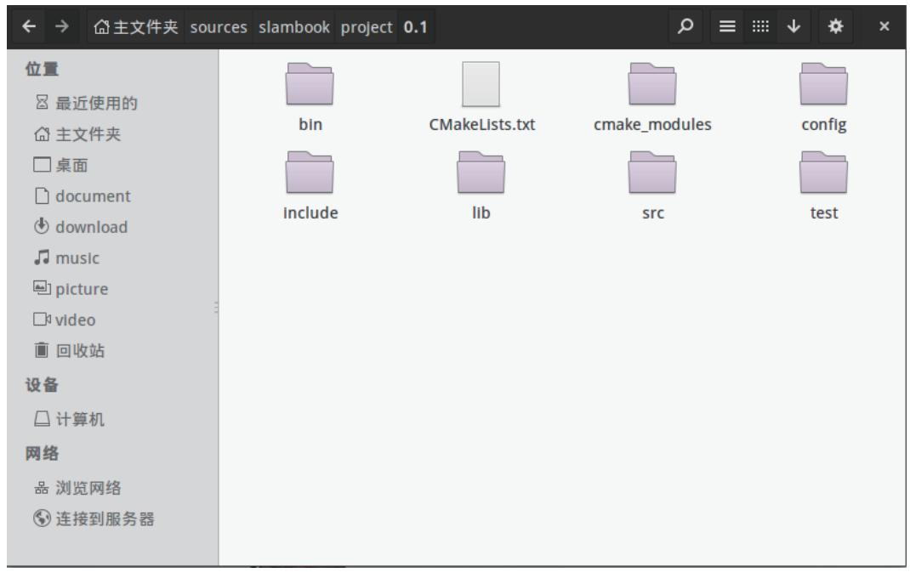

<details>
<summary>text_image</summary>

主文件夹 sources slambook project 0.1
位置
最近使用的
主文件夹
桌面
document
download
music
picture
video
回收站
设备
计算机
网络
浏览网络
连接到服务器
bin	CMakeLists.txt	cmake_modules	config
Include	lib	src/test
</details>

图 9-2 工程项目的目录。

## 9.1.2 确定基本数据结构

为了让程序跑起来，我们要设计好数据单元，以及程序处理的流程。这好比构成房屋的一个个的柱子和砖块。那么，在一个 SLAM 程序中，有哪些结构是最基本的呢？我们抽象出几条基本概念：

1. 帧：一个帧是相机采集到的图像单位。它主要包含一个图像（RGB-D 情形下是一对图像）。此外，还有特征点、位姿、内参等信息。

在视觉 SLAM 中我们会谈论关键帧（Key-frame）。由于相机采集的数据很多，存储所有的数据显然是不现实的。不然的话，如果相机放在桌上不动，程序的内存占用也会越来越高最后导致无法接受。通常的做法是把某些我们认为更重要的帧保存起来，并认为相机轨迹就可以用这些关键帧来描述。关键帧如何选择是一个很大的问题，而且基于工程经验，很少有理论上的指导。在本书中我们也会使用一个关键帧选择方法，但读者亦可考虑自己提出新的方式。

2. 路标：路标点即图像中的特征点。当相机运动之后，我们还能估计它们的 3D 位置。通常，会把路标点放在一个地图当中，并将新来的帧与地图中的路标点进行匹配，估计相机位姿。

帧的位姿与路标的位置估计相当于一个局部的 SLAM 问题。除此之外，我们还需要一些工具，让程序写起来更流畅。例如：

1. 配置文件：在写程序中你会经常遇到各种各样的参数，比如相机的内参、特征点的数量、匹配时选择的比例等等。你可以把这些数写在程序中，但那不是一个好习惯。你会经常修改这些参数，但每次修改后都要重新编译一遍程序。当它们数量越来越多时，修改就变得越来越困难。所以，更好的方式是在外部定义一个配置文件，程序运行时读取该配置文件中的参数值。这样，每次只要修改配置文件内容就行了，不必对程序本身做任何修改。

2. 坐标变换：你会经常需要在坐标系间进行坐标变换。例如世界坐标到相机坐标、相机坐标到归一化相机坐标、归一化相机坐标到像素坐标等等。定义一个类把这些操作都放在一起将更方便些。

所以下面我们就来定义帧、路标这几个概念，在 C++ 中都以类来表示。我们尽量保证一个类有单独的头文件和源文件，避免把许多个类放在同一个文件中。然后，把函数声明放在头文件，实现放在源文件里（除非函数很短，也可以写在头文件中）。我们参照 Google的命名规范，同时考虑尽量以初学者也能看懂的方式来写程序。由于我们的程序是偏向算法而非软件工程的，所以不讨论复杂的类继承关系、接口、模板等等，而更应该关注算法的正确实现，以及是否便于扩展。我们会把数据成员设置为公有，尽管这在 C++ 软件设计中是应该避免的，如果读者愿意，也可以把它们改成 private 或 protected 接口，并添加设置和获取接口。在过程较为复杂的算法中，我们会把它分解成若干步骤，例如特征提取和匹配应该分别在不同的函数中实现，这样，当我们想修改算法流程时，就不需要修改整个运行流程，只需调整局部的处理方式即可。

现在，让我们开始写 VO。我们把这个版本定为 0.1 版，表示这是刚开始的阶段。我们一共写五个类：Frame 为帧，Camera 为相机模型，MapPoint 为特征点/路标点，Map管理特征点，Config 提供配置参数。它们的关系如图 9-3 所示。我们现在只写它们的数据成员和常用方法，而在后面用到更多内容时，再另行添加新的内容。

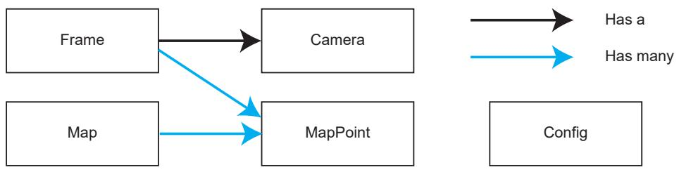

<details>
<summary>flowchart</summary>

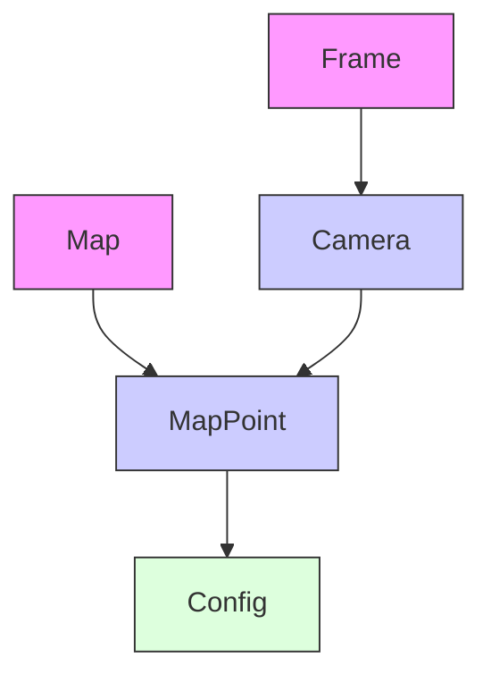
```mermaid
graph TD
  A["Frame"] --> B["Camera"]
  C["Map"] --> D["MapPoint"]
  B --> D
  D --> E["Config"]
    style A fill:#f9f,stroke:#333
    style C fill:#f9f,stroke:#333
    style B fill:#ccf,stroke:#333
    style D fill:#ccf,stroke:#333
    style E fill:#dfd,stroke:#333
```
</details>

图 9-3 基本类的关系示意图。

Camera 类最简单，我们先来实现它。

## 9.1.3 Camera 类

Camera 类存储相机的内参和外参，并完成相机坐标系、像素坐标系、和世界坐标系之间的坐标变换。当然，在世界坐标系中你需要一个相机的（变动的）外参，我们以参数的形式传入。

slambook/project/0.1/include/myslam/camera.h  
```cpp
c
#ifndef CAMERA_H
#define CAMERA_H
#include "myslam/common_include.h"
namespace myslam
{
    // Pinhole RGB-D camera model
class Camera
{
public:
    typedef std::shared_ptr<Camera> Ptr;
    float fx_, fy_, cx_, cy_, depth_scale_; // Camera intrinsics
    Camera();
    Camera ( float fx, float fy, float cx, float cy, float depth_scale=0 ) :
    fx_ ( fx ), fy_ ( fy ), cx_ ( cx ), cy_ ( cy ), depth_scale_ ( depth_scale )
    {}
}
```

```c
// coordinate transform: world, camera, pixel
Vector3d world2camera( const Vector3d& p_w, const SE3& T_c_w );
Vector3d camera2world( const Vector3d& p_c, const SE3& T_c_w );
Vector2d camera2pixel( const Vector3d& p_c );
Vector3d pixel2camera( const Vector2d& p_p, double depth=1 );
Vector3d pixel2world ( const Vector2d& p_p, const SE3& T_c_w, double depth=1 );
Vector2d world2pixel ( const Vector3d& p_w, const SE3& T_c_w );
};
#endif // CAMERA_H
```

注解（由上往下）：

1. 在这个简单的例子里，我们贴上了防止头文件重复引用的 ifndef 宏定义。如果没有这个宏，在两处引用此头文件时将出现类的重复定义。所以，在每个程序头文件里都会定义这样一个宏。  
2. 我们用命名空间 namespace myslam 将类定义包裹起来（因为是我们自己写的 slam，所以命名空间就叫 myslam 了）。命名空间可以防止我们不小心定义出别的库里同名的函数，也是一种比较安全和规范的做法。由于宏定义和命名空间在每个文件中都会写一遍，所以我们只在这里稍加介绍，后面就略去了。  
3. 我们把一些常用的头文件放在一个 common\_include.h 文件中，这样就可以避免每次书写一个很长的一串 include。  
4. 我们把智能指针定义成 Camera 的指针类型，因此以后在传递参数时，只需用 Cam-era::Ptr 类型即可。  
5. 我们用 Sophus::SE3 来表达相机的位姿。Sophus 库在李代数章节已经介绍过了。  
在源文件中，我们给出 Camera 方法的实现：

slambook/project/0.1/src/camera.cpp  
```cpp
#include "myslam/camera.h"
namespace myslam
{
    Camera::Camera()
    {
    }
    Vector3d Camera::world2camera ( const Vector3d& p_w, const SE3& T_c_w )
    {
```

```cpp
return T_c_w*p_w;
}

Vector3d Camera::camera2world ( const Vector3d& p_c, const SE3& T_c_w )
{
    return T_c_w.inverse() *p_c;
}

Vector2d Camera::camera2pixel ( const Vector3d& p_c )
{
    return Vector2d (
    fx_* p_c(0,0) / p_c(2,0) + cx_,
    fy_* p_c(1,0) / p_c(2,0) + cy_ );
}

Vector3d Camera::pixel2camera ( const Vector2d& p_p, double depth )
{
    return Vector3d (
    (p_p(0,0)-cx_) *depth/fx_,
    (p_p(1,0)-cy_) *depth/fy_,
    depth
    );
}

Vector2d Camera::world2pixel ( const Vector3d& p_w, const SE3& T_c_w )
{
    return camera2pixel ( world2camera ( p_w, T_c_w ) );
}

Vector3d Camera::pixel2world ( const Vector2d& p_p, const SE3& T_c_w, double depth )
{
    return camera2world ( pixel2camera ( p_p, depth ), T_c_w );
}
```

读者可以对照一下这些方法是否和第五章讲的内容一致。它们完成了像素坐标系、相机坐标系和世界坐标系间的坐标变换。

## 9.1.4 Frame 类

下面来考虑 Frame 类。由于 Frame 类是基本数据单元，在许多地方会用到它，但现在初期设计阶段，我们还不清楚以后可能新加的内容。所以这里的 Frame 类只提供基本的数据存储和接口。如果之后有新增的内容，我们就继续往里添加。

slambook/project/0.1/include/myslam/frame.h

```cpp
class Frame
{
public:
    typedef std::shared_ptr<Frame> Ptr;
    unsigned long id_; // id of this frame
    double time_stamp_; // when it is recorded
    SE3 T_c_w_; // transform from world to camera
    Camera::Ptr camera_; // Pinhole RGB-D Camera model
    Mat color_, depth_; // color and depth image

public: // data members
    Frame();
    Frame( long id, double time_stamp=0, SE3 T_c_w=SE3(), Camera::Ptr camera=nullptr, Mat color=Mat(),
    Mat depth=Mat() );
    ~Frame();

    // factory function
    static Frame::Ptr createFrame();

    // find the depth in depth map
    double findDepth( const cv::KeyPoint& kp );

    // Get Camera Center
    Vector3d getCamCenter() const;

    // check if a point is in this frame
    bool isInFrame( const Vector3d& pt_world );
};
```

在 Frame 中，我们定义了 ID、时间戳、位姿、相机、图像这几个量，这应该是一个帧当中含有的最重要的信息。在方法中，我们提取了几个重要的方法：创建 Frame、寻找给定点对应的深度、获取相机光心、判断某个点是否在视野内等等。它们的实现是比较平凡的，所以请读者参考 frame.cpp 看看这些函数的具体实现。

## 9.1.5 MapPoint 类

MapPoint 表示路标点。我们将估计它的世界坐标，并且我们会拿当前帧提取到的特征点与地图中的路标点匹配，来估计相机的运动，因此还需要存储它对应的描述子。此外，我们会记录一个点被观测到的次数和被匹配到的次数，作为评价它的好坏程度的指标。

slambook/project/0.1/include/myslam/frame.h  
```txt
1 class MapPoint
2 {
3 public:
```

```cpp
typedef shared_ptr<MapPoint> Ptr;
unsigned long id_; // ID
Vector3d pos_; // Position in world
Vector3d norm_; // Normal of viewing direction
Mat descriptor_; // Descriptor for matching
int observed_times_; // being observed by feature matching algo.
int correct_times_; // being an inliner in pose estimation

MapPoint();
MapPoint( long id, Vector3d position, Vector3d norm );

// factory function
static MapPoint::Ptr createMapPoint();
};
```

同样，读者可以浏览 src/map.cpp 查看它的实现。现在为止我们只需考虑这些数据成员的初始化问题。

## 9.1.6 Map 类

Map 类管理着所有的路标点，并负责添加新路标、删除不好的路标等工作。VO 的匹配过程只需要和 Map 打交道即可。当然 Map 也会有很多操作，但现阶段我们只定义主要的数据结构。

slambook/project/0.1/include/myslam/map.h

```cpp
class Map
{
public:
    typedef shared_ptr<Map> Ptr;
    unordered_map<unsigned long, MapPoint::Ptr > map_points_; // all landmarks
    unordered_map<unsigned long, Frame::Ptr > keyframes_; // all key-frames

    Map() {}

    void insertKeyFrame( Frame::Ptr frame );
    void insertMapPoint( MapPoint::Ptr map_point );
};
```

Map 类中实际存储了各个关键帧和路标点，既需要随机访问，又需要随时插入和删除，因此我们使用散列（Hash）来存储它们。

## 9.1.7 Config 类

Config 类负责参数文件的读取，并在程序任意地方都可随时提供参数的值。所以我们把 Config 写成单件模式（Singleton）。它只有一个全局对象，当我们设置参数文件时，创建该对象并读取参数文件，随后就可以在任意地方访问参数值，最后在程序结束时自动销毁。

slambook/project/0.1/include/myslam/config.h  
```cpp
class Config
{
private:
    static std::shared_ptr<Config> config_;
    cv::FileStorage file_;
    Config () {} // private constructor makes a singleton
public:
    ~Config(); // close the file when deconstructing

    // set a new config file
    static void setParameterFile( const std::string& filename );

    // access the parameter values
    template< typename T >
    static T get( const std::string& key )
    {
    return T( Config::config_->file_[key] );
    }
};
```

注解：

1. 我们把构造函数声明为私有，防止这个类的对象在别处建立，它只能在 setParame-terFile 时构造。实际构造的对象是 Config 的智能指针：static shared\_ptr<Config>config\_。用智能指针的原因是可以自动析构，省得我们再调一个别的函数来做析构。  
2. 在文件读取方面，我们使用 OpenCV 提供的 FileStorage 类。它可以读取一个 YAML文件，且可以访问其中任意一个字段。由于参数实质值可能为整数、浮点数或字符串，所以我们通过一个模板函数 get，来获得任意类型的参数值。

下面是 Config 的实现。注意我们把单例模式的全局指针定义在这个源文件中了：

slambook/project/0.1/src/config.cpp

```cpp
void Config::setParameterFile( const std::string& filename )
{
    if ( config_ == nullptr )
    config_ = shared_ptr<Config>(new Config);
    config_->file_ = cv::FileStorage( filename.c_str(), cv::FileStorage::READ );
    if ( config_->file_.isOpened() == false )
    {
    std::cerr<<"parameter file "<<filename<<" does not exist.""<<std::endl;
    config_->file_.release();
    return ;
    }
}
Config::~Config()
{
    if ( file_.isOpened() )
    file_.release();
}
shared_ptr<Config> Config::config_ = nullptr;
```

在实现中，我们只要判断一下参数文件是否存在即可。定义了这个 Config 类后，我们可以在任何地方获取参数文件里的参数。例如，当我想要定义相机的焦距 $f _ { x }$ 时，按照以下几个操作步骤即可：

1. 在参数文件中加入：“Camera.fx: 500”。  
2. 在代码中使用：

```rust
1    myslam::Config::setParameterFile("parameter.yaml");
2    double fx = myslam::Config::get<double> ("Camera.fx");
```

就能获得 $f _ { x }$ 的值了。

当然，参数文件的实现方法绝对不止这一种。我们主要考虑从程序开发上的便利性角度来考虑这个实现，读者当然也可以用更简单的方式来实现参数的配置。

至此，我们定义了 SLAM 程序的基本数据结构，书写了若干个基本类。这好比是造房子的砖头和水泥。你可以调用 cmake 编译这个 0.1 版，尽管它还没有实质性的功能。接下来我们来考虑把前面讲过的 VO 算法加到工程中，并做一些测试来调整各算法的性能。注意，我会刻意地暴露某些设计的问题，所以你看到的实现不见得就是最好的（或者足够好的）。

## 9.2 基本的 VO：特征提取和匹配

下面我们来实现 VO，先来考虑特征点法。它 VO 任务是，根据输入的图像，计算相机运动和特征点位置。前面我们都讨论的是在两两帧间的位姿估计，然而我们将发现仅凭两帧的估计是不够的。我们会把特征点缓存成一个小地图，计算当前帧与地图之间的位置关系。但那样程序会复杂一些，所以，让我们先订个小目标，暂时从两两帧间的运动估计出发。

## 9.2.1 两两帧的视觉里程计

如果像前面两章一样，只关心两个帧之间的运动估计，并且不优化特征点的位置。然而把估得的位姿“串”起来，也能得到一条运动轨迹。这种方式可以看成两两帧间的（Pair-wise），无结构（Structureless）的 VO，实现起来最为简单，但是效果不佳。为什么不佳呢？我们带着读者来体验一下。记该工程为 0.2 版本。

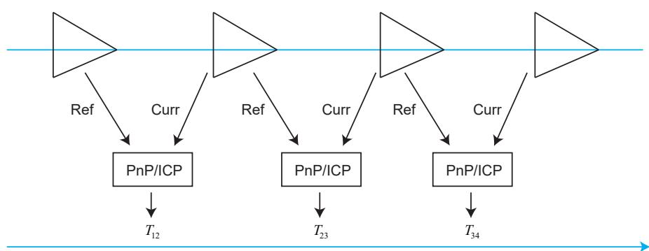

<details>
<summary>flowchart</summary>

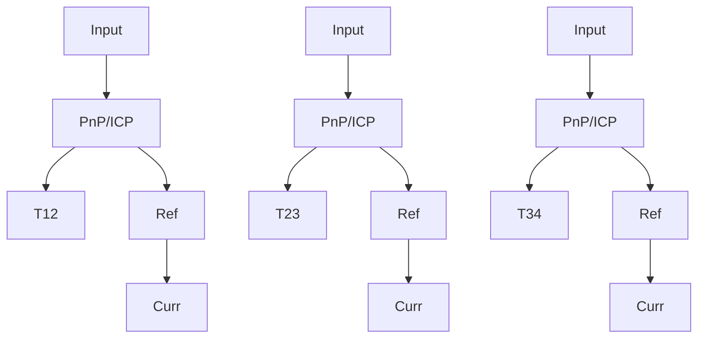
```mermaid
graph TD
  A["Input"] --> B["PnP/ICP"]
  B --> C["T12"]
  D["Input"] --> E["PnP/ICP"]
  E --> F["T23"]
  G["Input"] --> H["PnP/ICP"]
  H --> I["T34"]
  B --> J["Ref"]
  E --> K["Ref"]
  H --> L["Ref"]
  J --> M["Curr"]
  K --> N["Curr"]
  L --> O["Curr"]
```
</details>

图 9-4 两两帧的 VO 示意图。

两两帧之间的 VO 工作示意图如图 9-4 所示。在这种 VO 里，我们定义了参考帧（Ref-erence）和当前帧（Current）这两个概念。以参考帧为坐标系，我们把当前帧与它进行特征匹配，并估计运动关系。假设参考帧相对世界坐标的变换矩阵为 $\mathbf { \delta } _ { \mathbf { \mathcal { T } } \nu _ { w } }$ ，当前帧与世界坐标系间为 $\mathbf { \delta } \mathbf { T } _ { c w }$ ，则待估计的运动与这两个帧的变换矩阵构成左乘关系：

$$
\boldsymbol {T} _ {c r}, \quad s. t. \quad \boldsymbol {T} _ {c w} = \boldsymbol {T} _ {c r} \boldsymbol {T} _ {r w}.
$$

在 t−1 到 t 时刻，我们以 t−1 为参考，求取 t 时刻的运动。这可以通过特征点匹配、光流或直接法得到，但这里我们只关心运动，不关心结构。换句话说，只要通过特征点成功求出了运动，我们就不再需要这帧的特征点了。这种做法当然会有缺陷，但是忽略掉数量庞大的特征点可以节省许多的计算量。然后，在 t 到 t+ 1 时刻，我们又以 t 时刻为参考帧，考虑 t 到 t+ 1 间的运动关系。如此往复，就得到了一条运动轨迹。

这种 VO 的工作方式是简单的，不过实现也可以有若干种。我们以传统的匹配特征点——求 PnP 的方法为例实现一遍。希望读者能够结合之前章的知识，自己实现一下光流/直接法或 ICP 求运动的 VO。在匹配特征点的方式中，最重要的参考帧与当前帧之间的特征匹配关系，它的流程可归纳如下：

1. 对新来的当前帧，提取关键点和描述子。  
2. 如果系统未初始化，以该帧为参考帧，根据深度图计算关键点的 3D 位置，返回1。  
3. 估计参考帧与当前帧间的运动。  
4. 判断上述估计是否成功。  
5. 若成功，把当前帧作为新的参考帧，回 1。  
6. 若失败，计连续丢失帧数。当连续丢失超过一定帧数，置 VO 状态为丢失，算法结束。若未超过，返回 1。

VisualOdometry 类给出了上述算法的实现。

slambook/project/0.2/include/myslam/visual\_odometry.h  
```cpp
class VisualOdometry
{
public:
    typedef shared_ptr<VisualOdometry> Ptr;
    enum VOState {
    INITIALIZING=-1,
    OK=0,
    LOST
    };

    VOState state_; // current VO status
    Map::Ptr map_; // map with all frames and map points
    Frame::Ptr ref_; // reference frame
    Frame::Ptr curr_; // current frame

    cv::Ptr<cv::ORB> orb_; // orb detector and computer
    vector<cv::Point3f> pts_3d_ref_; // 3d points in reference frame
    vector<cv::KeyPoint> keypoints_curr_; // keypoints in current frame
    Mat descriptors_curr_; // descriptor in current frame
    Mat descriptors_ref_; // descriptor in reference frame
```

```cpp
vector<cv::DMatch> feature_matches_;
SE3 T_c_r_estimated_; // the estimated pose of current frame
int num_inliers_; // number of inlier features in icp
int num_lost_; // number of lost times

// parameters
int num_of_features_; // number of features
double scale_factor_; // scale in image pyramid
int level_pyramid_; // number of pyramid levels
float match_ratio_; // ratio for selecting good matches
int max_num_lost_; // max number of continuous lost times
int min_inliers_; // minimum inliers

double key_frame_min_rot; // minimal rotation of two key-frames
double key_frame_min_trans; // minimal translation of two key-frames

public: // functions
VisualOdometry();
~VisualOdometry();

bool addFrame( Frame::Ptr frame ); // add a new frame

protected:
// inner operation
void extractKeyPoints();
void computeDescriptors();
void featureMatching();
void poseEstimationPnP();
void setRef3DPoints();

void addKeyFrame();
bool checkEstimatedPose();
bool checkKeyFrame();
};
```

关心这个 VisualOdometry 类，有几点需要解释：

1. VO 本身有若干种状态：设定第一帧、顺利跟踪或丢失，你可以把它看成一个有限状态机（Finite State Machine, FSM）。当然状态也可以有更多种，例如单目 VO 至少还有一个初始化状态。在我们的实现中，考虑最简单的三个状态：初始化、正常、丢失。  
2. 我们把一些中间变量定义在类中，这样可省去复杂的参数传递。因为它们都是定义在类内部的，所以各个函数都可以访问它们。  
3. 特征提取和匹配当中的参数，从参数文件中读取。例如：

```cpp
VisualOdometry::VisualOdometry() :
state_ ( INITIALIZING ), ref_ ( nullptr ), curr_ ( nullptr ), map_ ( new Map ), num_lost_ ( 0 ), num_inliers_ ( 0 )
{
    num_of_features_ = Config::get<int> ("number_of_features");
    scale_factor_ = Config::get<double> ("scale_factor");
    level_pyramid_ = Config::get<int> ("level_pyramid");
    match_ratio_ = Config::get<float> ("match_ratio");
    ...
}
```

4. addFrame 函数是外部调用的接口。使用 VO 时，将图像数据装入 Frame 类后，调用 addFrame 估计其位姿。该函数根据 VO 所处的状态实现不同的操作：

```cpp
bool VisualOdometry::addFrame ( Frame::Ptr frame )
{
    switch ( state_ )
    {
    case INITIALIZING:
    {
    state_ = OK;
    curr_ = ref_ = frame;
    map_->insertKeyFrame ( frame );
    // extract features from first frame
    extractKeyPoints();
    computeDescriptors();
    // compute the 3d position of features in ref frame
    setRef3DPoints();
    break;
    }
    case OK:
    {
    curr_ = frame;
    extractKeyPoints();
    computeDescriptors();
    featureMatching();
    poseEstimationPnP();
    if ( checkEstimatedPose() == true ) // a good estimation
    {
    curr_->T_c_w_ = T_c_r_estimated_* ref_->T_c_w_; // T_c_w = T_c_r*T_r_w
    ref_ = curr_;
    setRef3DPoints();
    num_lost_ = 0;
    if ( checkKeyFrame() == true ) // is a key-frame
    {
    addKeyFrame();
    }
    }
    else // bad estimation due to various reasons
```

```txt
{
    num_lost_++;
    if (num_lost_ > max_num_lost_)
    {
    state_ = LOST;
    }
    return false;
    }
    break;
}
case LOST:
{
    cout<<"vo has lost.""<<endl;
    break;
}
return true;
}
```

值得一提的是，由于各种原因，我们设计的上述 VO 算法，每一步都有可能失败。例如图片中不易提特征、特征点缺少深度值、误匹配、运动估计出错等等。因此，要设计一个鲁棒的 VO，必须（最好是显式地）考虑到上述所有可能出错的地方——那自然会使程序变得非常复杂。我们在 checkEstimatedPose 中，根据内点（inlier）的数量以及运动的大小做一个简单的检测：认为内点不可太少，而运动不可能过大。当然，读者也可以思考其他检测问题的手段，尝试一下效果。

我们略去 VisualOdometry 类其余的实现，读者可在 github 上找到所有的源代码。最后，我们在 test 中加入该 VO 的测试程序，使用数据集观察估计的运动效果：

slambook/project/0.2/test/run\_vo.cpp  
```cpp
int main ( int argc, char** argv )
{
    if ( argc != 2 )
    {
    cout<<"usage: run_vo parameter_file"<<endl;
    return 1;
    }
    
    myslam::Config::setParameterFile ( argv[1] );
    myslam::VisualOdometry::Ptr vo ( new myslam::VisualOdometry );

    string dataset_dir = myslam::Config::get<string> ( "dataset_dir" );
    cout<<"dataset: "<<dataset_dir<<endl;
    ifstream fin ( dataset_dir +/-associate.txt" );
    if ( !fin )
```

```cpp
{
    cout<<"please generate the associate file called associate.txt!"<<endl;
    return 1;
}

vector<string> rgb_files, depth_files;
vector<double> rgb_times, depth_times;
while (!fin.eof())
{
    string rgb_time, rgb_file, depth_time, depth_file;
    fin>>rgb_time>>rgb_file>>depth_time>>depth_file;
    rgb_times.push_back ( atof ( rgb_time.c_str() ) );
    depth_times.push_back ( atof ( depth_time.c_str() ) );
    rgb_files.push_back ( dataset_dir+"/" + rgb_file );
    depth_files.push_back ( dataset_dir+"/" + depth_file );

    if ( fin.good() == false )
    break;
}

myslam::Camera::Ptr camera ( new myslam::Camera );

// visualization
cv::viz::Viz3d vis("Visual Odometry");
cv::viz::WCoordinateSystem world_coor(1.0), camera_coor(0.5);
cv::Point3d cam_pos( 0, -1.0, -1.0 ), cam_focal_point(0,0,0), cam_y_dir(0,1,0);
cv::Affine3d cam_pose = cv::viz::makeCameraPose( cam_pos, cam_focal_point, cam_y_dir );
vis.setViewerPose( cam_pose );

world_coor.setRenderingProperty(cv::viz::LINE_WIDTH, 2.0);
camera_coor.setRenderingProperty(cv::viz::LINE_WIDTH, 1.0);
vis.showWidget( "World", world_coor );
vis.showWidget( "Camera", camera_coor );

cout<<"read total "<<rgb_files.size() <>" entries"<<endl;
for ( int i=0; i<rgb_files.size(); i++ )
{
    Mat color = cv::imread ( rgb_files[i] );
    Mat depth = cv::imread ( depth_files[i], -1 );
    if ( color.data==nullptr || depth.data==nullptr )
    break;
    myslam::Frame::Ptr pFrame = myslam::Frame::createFrame();
    pFrame->camera_ = camera;
    pFrame->color_ = color;
    pFrame->depth_ = depth;
    pFrame->time_stamp_ = rgb_times[i];

    boost::timer timer;
    vo->addFrame ( pFrame );
    cout<<"VO costs time: "<<timer. elapsed()<<endl;
```

```cpp
if ( vo->state_ == myslam::VisualOdometry::LOST )
    break;
SE3 Tcw = pFrame->T_c_w_.inverse();

// show the map and the camera pose
cv::Affine3d M(
    cv::Affine3d::Mat3(
    Tcw.rotation_matrix()(0,0), Tcw.rotation_matrix()(0,1), Tcw.rotation_matrix()(0,2),
    Tcw.rotation_matrix()(1,0), Tcw.rotation_matrix()(1,1), Tcw.rotation_matrix()(1,2),
    Tcw.rotation_matrix()(2,0), Tcw.rotation_matrix()(2,1), Tcw.rotation_matrix()(2,2)
),
cv::Affine3d::Vec3(
    Tcw.translation()(0,0), Tcw.translation()(1,0), Tcw.translation()(2,0)
);
);
cv::imshow("image", color );
cv::waitFor(1);
visrahamWidgetPose("Camera", M);
vis.dsnOnce(1, false);
}
return 0;
```

为了运行这个程序，你需要做几件事：

1. 因为我们用 OpenCV3 的 viz 模块显示估计位姿，请确保你安装的是 OpenCV3，并且 viz 模块也编译安装了。  
2. 准备 tum 数据集中的其中一个。简单起见，我推荐 fr1\_xyz 那一个。请使用 asso-ciate.py 生成一个配对文件 associate.txt。关于 tum 数据集格式我们已经在8.3节中介绍过了。

3. 在 config/default.yaml 中填写你的数据集所在路径，参照我的写法即可。然后，用

```gitattributes
1 bin/run_vo config/default.yaml
```

执行程序，就可以看到实时的演示了，如图 9-5 所示。

在演示程序中，你可以看到当前帧的图像与它的估计位置。我们画出了世界坐标系的坐标轴（大）与当前帧的坐标轴（小），颜色与轴的对应关系为：蓝色-Z，红色-X，绿色-Y。你可以直观地感受到相机的运动，它大致与我们人类的感觉是相符的，尽管效果离预想还有一定的差距。我还输出了 VO 单次计算的用时，在我的机器上，大约能够以 30 多毫秒左右的速度运行。减少特征点数量可以提高运算速度。读者可以修改运行参数和数据集，看看它在各种情况下的表现。

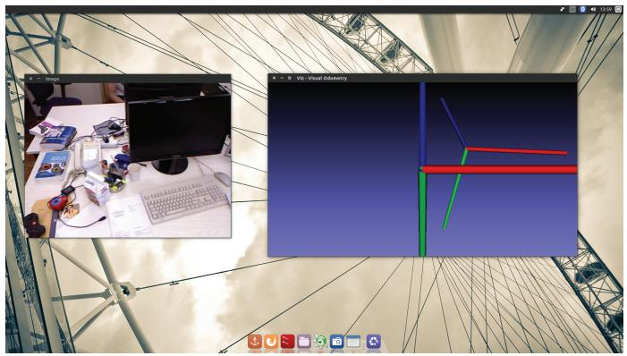

<details>
<summary>natural_image</summary>

Computer setup with a desktop computer and a 3D wireframe display showing colored lines and a monitor (no readable text or symbols)
</details>

图 9-5 0.2 版本的 VO 演示。

## 9.2.2 讨论

本节，我们实现了一个简单的两两帧间的视觉里程计，然而不管从速度还是精度上来说，它的效果都不理想。似乎这种看似简单的思路并不能得到很好的结果。我们来考虑一下有哪几种可能的原因：

1. 在位姿估计时，我们使用了 RANSAC 求出的 PnP 解。由于 RANSAC 只采用少数几个随机点来计算 PnP，虽然能够确定 inlier，但该方法容易受噪声影响。在 3D-2D点存在噪声的情形下，我们要用 RANSAC 的解作为初值，再用非线性优化求一个最优值。下一节将说明这种做法是优于现在的做法的。  
2. 由于现在的 VO 是无结构的，特征点的 3D 位置被当作真值来估计运动。但实际上，RGB-D 的深度图必定带有一定的误差，特别是那些深度过近或过远的地方。并且，由于特征点往往位于物体的边缘处，那些地方的深度测量值通常是不准确的。所以现在的做法不够精确，我们需要把特征点也放在一起优化。  
3. 只考虑参考帧/当前帧的方式，一方面使得位姿估计过于依赖参考帧。如果参考帧质量太差，比如出现严重遮挡、光照变化的情况下，跟踪容易会丢失。并且，当参考帧位姿估计不准时，还会出现明显的漂移。另一方面，仅使用两帧数据显然没有充分地利用所有的信息。更自然的方式是比较当前帧和地图，而不是比较当前帧和参考帧。于是，我们要关心如何把当前帧与地图进行匹配，以及如何优化地图点的问题。

4. 由于输出了各步骤的运行时间，我们可以对计算量有一个大概的了解（表4）。

可以看到，特征点的提取和匹配占据了绝大多数的计算时间，而看似复杂的 PnP 优化，计算量与之相比基本可以忽略。因此，如何提高特征提取、匹配算法的速度，将是特征点方法的一个重要的主题。一种可预见的方式是使用直接法/光流，可有效地避开繁重的特征计算工作。之前的章节已经讨论过直接法和光流法，读者不妨自行尝试一下。

表 9-1 某一次循环的各步骤用时

<table><tr><td>项目时间</td><td>特征提取0.0102</td><td>描述子计算0.0087</td><td>特征匹配0.0118</td><td>PnP 求解0.0011</td><td>其他0.0001</td><td>总计0.0319</td></tr></table>

## 9.3 改进：优化 PnP 的结果

接下来，我们沿着之前的内容，尝试一些改进 VO 的方法。本节中，我们来尝试RANSAC PnP 加上迭代优化的方式估计相机位姿，看看是否对前一节的效果有所改进。

非线性优化问题的求解，已经在第六、七讲介绍过了。由于本节的目标是估计位姿而非结构，我们以相机位姿 ξ 为优化变量，通过最小化重投影误差，来构建优化问题。与之前一样，我们自定义一个 g2o 中的优化边。它只优化一个位姿，因此是一个一元边。

slambook/project/0.3/include/myslam/g2o\_types.h  
```cpp
class EdgeProjectXYZ2UVPoseOnly: public g2o::BaseUnaryEdge<2, Eigen::Vector2d, g2o::VertexSE3Expmap > {
public:
    EIGEN_MAKE_ALIGNED_OPERATOR_NEW
    virtual void computeError();
    virtual void linearizeOplus();

    virtual bool read( std::istream& in ){} 
    virtual bool write(std::ostream& os) const {}; 

    Vector3d point_;
    Camera* camera_;
};
```

把三维点和相机模型放入它的成员变量中，方便计算重投影误差和雅可比：

slambook/project/0.3/src/g2o\_types.cpp  
```cpp
void EdgeProjectXYZ2UVPoseOnly::computeError()
{
    const g2o::VertexSE3Expmap* pose = static_cast<const g2o::VertexSE3Expmap*>( _vertices[0] );
    _error = _measurement - camera_->camera2pixel (
    pose->estimate().map(point_)
```

```cpp
);
}
void EdgeProjectXYZ2UVPoseOnly::linearizeOplus()
{
    g2o::VertexSE3Expmap* pose = static_cast<g2o::VertexSE3Expmap*>( _vertices[0] );
    g2o::SE3Quat T ( pose->estimate() );
    Vector3d xyz_trans = T.map ( point_ );
    double x = xyz_trans[0];
    double y = xyz_trans[1];
    double z = xyz_trans[2];
    double z_2 = z*z;

    _jacobianOplusXi ( 0,0 ) = x*y/z_2 *camera_->fx_;
    _jacobianOplusXi ( 0,1 ) = - ( 1+ ( x*x/z_2 ) ) *camera_->fx_;
    _jacobianOplusXi ( 0,2 ) = y/z * camera_->fx_;
    _jacobianOplusXi ( 0,3 ) = -1./z * camera_->fx_;
    _jacobianOplusXi ( 0,4 ) = 0;
    _jacobianOplusXi ( 0,5 ) = x/z_2 * camera_->fx_;
    _jacobianOplusXi ( 1,0 ) = ( 1+y*y/z_2 ) *camera_->fy_;
    _jacobianOplusXi ( 1,1 ) = -x*y/z_2 *camera_->fy_;
    _jacobianOplusXi ( 1,2 ) = -x/z *camera_->fy_;
    _jacobianOplusXi ( 1,3 ) = 0;
    _jacobianOplusXi ( 1,4 ) = -1./z *camera_->fy_;
    _jacobianOplusXi ( 1,5 ) = y/z_2 *camera_->fy_;
}
```

然后，在之前的 PoseEstimationPnP 函数中，修改成以 RANSAC PnP 结果为初值，再调用 g2o 进行优化的形式：

slambook/project/0.3/src/visual\_odometry.cpp  
```cpp
void VisualOdometry::poseEstimationPnP()
{
    ...
    // using bundle adjustment to optimize the pose
    typedef g2o::BlockSolver<g2o::BlockSolverTraits<6,2>> Block;
    Block::LinearSolverType* linearSolver = new g2o::LinearSolverDense<Block::PoseMatrixType>();
    Block* solver_ptr = new Block( linearSolver );
    g2o::OptimizationAlgorithmLevenberg* solver = new g2o::OptimizationAlgorithmLevenberg ( solver_ptr );
    g2o::SparseOptimizer optimizer;
    optimizer.setAlgorithm ( solver );

    g2o::VertexSE3Expmap* pose = new g2o::VertexSE3Expmap();
    pose->setId ( 0 );
    pose->setEstimate ( g2o::SE3Quat (
    T_c_r_estimated_.rotation_matrix(), T_c_r_estimated_.translation()
```

```cpp
);   
optimizer.addVertex (pose);   
// edges   
for (int i=0; i<inliers.rows; i++)   
{ int index = inliers.at<int>(i,0); // 3D -> 2D projection EdgeProjectXYZ2UVPoseOnly* edge = new EdgeProjectXYZ2UVPoseOnly(); edge->setId(i); edge->setVertex(0, pose); edge->camera_ = curr->camera_.get(); edge->point_ = Vector3d( pts3d[index].x, pts3d[index].y, pts3d[index].z ); edge->setMeasurement( Vector2d(pts2d[index].x, pts2d[index].y) ); edge->setInformation( Eigen::Matrix2d::Identity() ); optimizer.addEdge( edge );   
}   
optimizer.initializeOptimization();   
optimizer.optimize(10);   
T_c_r_estimated_ = SE3 ( pose->estimate().rotation(), pose->estimate().translation();
```

请读者运行此程序，对比之前的结果。你将发现估计的运动明显稳定了很多。同时，由于新增的优化仍是无结构的，规模很小，对计算时间的影响基本可以忽略不计。整体的视觉里程计计算时间仍在 30 毫秒左右。

## 9.3.1 讨论

我们发现，引入迭代优化方法之后，估计结果的质量比纯粹 RANSAC PnP 有明显的提高。尽管我们依然仅使用两两帧间的信息，但得到的运动却更加准确、平稳。从这次改进中，我们看到了优化的重要性。不过，0.3 版本的 VO 仍受两两帧间匹配的局限性影响。一旦视频序列当中某个帧丢失，就会导致后续的帧也无法和上一帧匹配。下面，我们把地

图引入到 VO 中来。

## 9.4 改进：局部地图

本节，我们将 VO 匹配到的特征点放到地图中，并将当前帧与地图点进行匹配，计算位姿。这种做法与之前的差异可见图 9-6 。

在两两帧间比较时，我们只计算参考帧与当前帧之间的特征匹配和运动关系，在计算之后把当前帧设为新的参考帧。而在使用地图的 VO 中，每个帧为地图贡献一些信息，比方说添加新的特征点或更新旧特征点的位置估计。地图中的特征点位置往往是使用世界坐标的。因此，当前帧到来时，我们求它和地图之间的特征匹配与运动关系，即直接计算了$\mathbf { \delta } \mathbf { T } _ { c w }$ 。

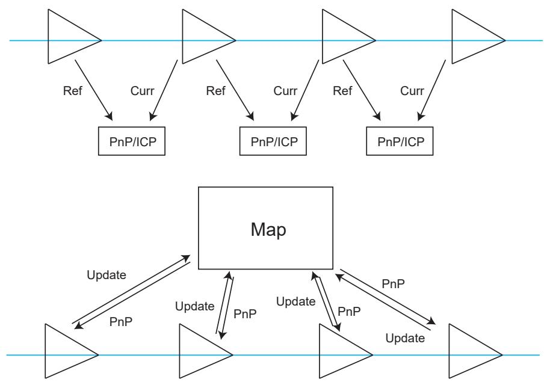

<details>
<summary>flowchart</summary>


```mermaid
graph TD
  A["Ref"] --> B["PnP/ICP"]
  C["Curr"] --> B
  D["Ref"] --> E["PnP/ICP"]
  F["Curr"] --> E
  G["Ref"] --> H["PnP/ICP"]
  I["Curr"] --> H
  J["Ref"] --> K["PnP/ICP"]
  L["Curr"] --> K
  M["Ref"] --> N["PnP/ICP"]
  O["Ref"] --> N
  P["Ref"] --> Q["PnP/ICP"]
  R["Ref"] --> Q
  S["Ref"] --> T["PnP/ICP"]
  U["Ref"] --> V["PnP/ICP"]
  W["Ref"] --> X["PnP/ICP"]
  Y["Ref"] --> Z["PnP/ICP"]
  AA["Ref"] --> AB["PnP/ICP"]
  AC["Ref"] --> AD["PnP/ICP"]
  AE["Ref"] --> AF["PnP/ICP"]
  AG["Ref"] --> AH["PnP/ICP"]
  AI["Ref"] --> AJ["PnP/ICP"]
  AK["Ref"] --> AL["PnP/ICP"]
  AM["Ref"] --> AN["PnP/ICP"]
  AO["Ref"] --> AP["PnP/ICP"]
  AQ["Ref"] --> AR["PnP/ICP"]
  AS["Ref"] --> AT["PnP/ICP"]
  AU["Ref"] --> AV["PnP/ICP"]
  AW["Ref"] --> AX["PnP/ICP"]
  AY["Update"] --> AZ["PnP"]
  BA["Update"] --> BB["PnP"]
  BC["Update"] --> BD["PnP"]
  BE["Update"] --> BF["PnP"]
  BG["Update"] --> BH["PnP"]
```
</details>

图 9-6 两两帧 VO 与地图 VO 工作原理的差异。

这样做的好处是，我们能够维护一个不断更新的地图。只要地图是正确的，即使中间某帧出了差错，仍有希望求出之后那些帧的正确位置。请注意，我们现在还没有详细地讨论 SLAM 的建图问题，所以这里的地图仅是一个临时性的概念，指的是把各帧特征点缓存到一个地方，构成了特征点的集合，我们称它为地图。

地图又可以分为局部（Local）地图和全局（Global）地图两种，由于用途不同，往往分开讨论。顾名思义，局部地图描述了附近的特征点信息——我们只保留离相机当前位置较近的特征点，而把远的或视野外的特征点丢掉。这些特征点是用来和当前帧匹配来求相机位置的，所以我们希望它能够做的比较快。另一方面，全局地图则记录了从 SLAM 运行以来的所有特征点。它显然规模要大一些，主要用来表达整个环境，但是直接在全局地图上定位，对计算机的负担就太大了。它主要用于回环检测和地图表达。

在视觉里程计中，我们更关心可以直接用于定位的局部地图（如果决心要用地图的话）。所以本讲我们来维护一个局部地图。随着相机运动，我们往地图里添加新的特征点，并去掉之前，我们仍然要提醒读者：是否使用地图取决你对精度——效率这个矛盾的把握。我们完全可以出于效率的考量，使用两两无结构式的 VO；也可以为了更好的精度，构建局

部地图乃至考虑地图的优化。

局部地图的一件麻烦事是维护它的规模。为了保证实时性，我们需要保证地图规模不至于太大（否则匹配会消耗大量的时间）。此外，单个帧与地图的特征匹配存在着一些加速手段，但由于它们技术上比较复杂，我们的例程中就不给出了。

现在，来实现地图点类吧。我们稍加完善之前没有用到的 MapPoint 类，主要是它的构造函数和生成函数。

slambook/project/0.4/include/myslam/mappoint.h  
```cpp
class MapPoint
{
    public:
    typedef shared_ptr<MapPoint> Ptr;
    unsigned long id_;    // ID
    static unsigned long factory_id_;    // factory id
    bool good_;    // whether a good point
    Vector3d pos_;    // Position in world
    Vector3d norm_;    // Normal of viewing direction
    Mat descriptor_;    // Descriptor for matching

    list<Frame*> observed_frames_;    // key-frames that can observe this point

    int matched_times_;    // being an inliner in pose estimation
    int visible_times_;    // being visible in current frame

    MapPoint();
    MapPoint (
    unsigned long id,
    const Vector3d& position,
    const Vector3d& norm,
    Frame* frame=nullptr,
    const Mat& descriptor=Mat()
    );

    inline cv::Point3f getStatusCV() const {
    return cv::Point3f(pos_(0,0), pos_(1,0), pos_(2,0));
    }

    static MapPoint::Ptr createMapPoint();
    static MapPoint::Ptr createMapPoint(
    const Vector3d& pos_world,
    const Vector3d& norm_,
    const Mat& descriptor,
    Frame* frame
);
```

主要的修改在 VisualOdometry 类上。由于工作流程的改变，我们修改了它的几个主要函数，例如每次循环中要对地图进行增删、统计每个地图点被观测到的次数等等①。这些事情是比较琐碎的，所以我们还是建议读者仔细看看 github 提供的源代码。重点观察以下几项：

1. 在提取第一帧的特征点之后，将第一帧的所有特征点全部放入地图中：

```cpp
void VisualOdometry::addKeyFrame()
{
    if (map_->keyframes_.empty())
    {
    // first key-frame, add all 3d points into map
    for (size_t i=0; i<keypoints_curr_.size(); i++)
    {
    double d = curr_->findDepth (keypoints_curr_[i]);
    if (d < 0)
    continue;
    Vector3d p_world = ref_->camera_->pixel2world (
    Vector2d (keypoints_curr_[i].pt.x, keypoints_curr_[i].pt.y), curr_->T_c_w_, d
    );
    Vector3d n = p_world - ref_->getCamCenter();
    n.normalize();
    MapPoint::Ptr map_point = MapPoint::createMapPoint(
    p_world, n, descriptors_curr_.row(i).clone(), curr_.get()
    );
    map_->insertMapPoint(map_point);
    }
    }
    map_->insertKeyFrame (curr_);
    ref_ = curr_;
}
```

2. 后续的帧中，使用 OptimizeMap 函数对地图进行优化。包括删除不在视野内的点，在匹配数量减少时添加新点等等。

```cpp
void VisualOdometry::optimizeMap()
{
    // remove the hardly seen and no visible points
    for (auto iter = map_->map_points_.begin();iter != map_->map_points_.end();)
    {
    if (!curr_->isInFrame(iter->second->pos_)
    {
    iter = map_->map_points_.erase(iter);
    continue;
    }
    float match_ratio = float(iter->second->matched_times_)/iter->second->visible_times_;
}
```

```c
if ( match_ratio < map_point_erase_ratio_ )
{
    iter = map_->map_points_.erase(iter);
    continue;
}
double angle = getViewAngle( curr_, iter->second );
if ( angle > M_PI/6. )
{
    iter = map_->map_points_.erase(iter);
    continue;
}
if ( iter->second->good_ == false )
{
    // TODO try triangulate this map point
}
iter++;
}

if ( match_2dkp_index_.size()<100 )
addMapPoints();
if ( map_->map_points_.size() > 1000 )
{
    // TODO map is too large, remove some one
    map_point_erase_ratio_ += 0.05;
}
else
    map_point_erase_ratio_ = 0.1;
cout<<"map points: "<<map_->map_points_.size()<<endl;
}
```

我们刻意留空了一些地方，请感兴趣的读者自行完成。例如，你可以使用三角化来更新特征点的世界坐标，或者考虑更好地动态管理地图规模的策略。这些问题都是开放性的。

3. 特征匹配代码。匹配之前，我们从地图中拿出一些候选点（出现在视野内的点），然后将它们与当前帧的特征描述子进行匹配。

```cpp
void VisualOdometry::featureMatching()
{
    boost::timer timer;
    vector<cv::DMatch> matches;
    // select the candidates in map
    Mat desp_map;
    vector<MapPoint::Ptr> candidate;
    for (auto& allpoints: map_->map_points_) {
    MapPoint::Ptr& p = allpoints.second;
    // check if p in curr frame image
    if (curr_->isInFrame(p->pos_) )
```

```cpp
{
    // add to candidate
    p->visible_times_++;
    candidate.push_back( p );
    desp_map.push_back( p->descriptor_ );
}
}

matcher_flann_.match ( desp_map, descriptors_curr_, matches );
// select the best matches
float min_dis = std::min_element (
    matches.begin(), matches.end(),
    [] ( const cv::DMatch& m1, const cv::DMatch& m2 )
    {
    return m1.distance < m2.distance;
    })->distance;

match_3dpts_.clear();
match_2dkp_index_.clear();
for ( cv::DMatch& m : matches )
{
    if ( m.distance < max<float> ( min_dis*match_ratio_, 30.0 ) )
    {
    match_3dpts_.push_back( candidate[m.queryIdx] );
    match_2dkp_index_.push_back( m.trainIdx );
    }
}
cout<<"good matches: "<<match_3dpts_.size() <<endl;
cout<<"match cost time: "<<timer. elapsed() <<endl;
}
```

除了现有的地图之外，我们还引入了“关键帧”（Key-frame）的概念。关键帧在许多视觉 SLAM 中都会用到，不过这个概念主要是给后端用的，所以我们下几讲再讨论对关键帧的详细处理。在实践中，我们肯定不希望对每个图像都做详细的优化和回环检测，那样毕竟太耗费资源。至少相机搁在原地不动时，我们不希望整个模型（地图也好、轨迹也好）变得越来越大。因此，后端优化的主要对象就是关键帧。

关键帧是相机运动过程当中某几个特殊的帧，这里“特殊”的意义是可以由我们自己指定的。常见的做法时，每当相机运动经过一定间隔，就取一个新的关键帧并保存起来①。这些关键帧的位姿将被仔细优化，而位于两个关键帧之间的那些东西，除了对地图贡献一些地图点外，就被理所当然地忽略掉了。

本节的实现也会提取一些关键帧，为后端的优化作一些数据上的准备。现在，读者可以编译这个工程，看看它的运行结果。本节的例程会把局部地图的点投影到图像平面并显示出来。如果位姿估计正确的话，它们看起来应该像是固定在空间中一样。反之，如果你感觉到某个特征点不自然地运动，那可能是相机位姿估计不够准确，或特征点的位置不够准确。

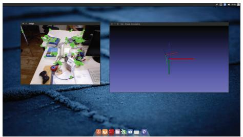

<details>
<summary>natural_image</summary>

Computer desktop with a photo of a green robotic arm and a 3D coordinate system on a blue textured background (no readable text or symbols)
</details>

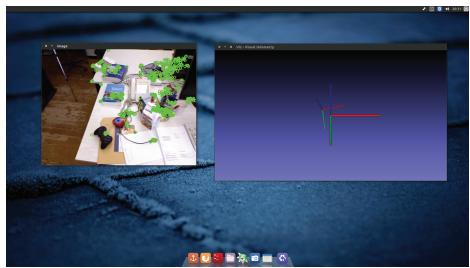

<details>
<summary>natural_image</summary>

Computer desktop interface showing a 3D model of a green plant on a desk with a software window and a coordinate system (no readable text or symbols)
</details>

图 9-7 0.4 版 VO 的运行截图，在两个不同时刻标记了路标投影点。

我们在 0.4 版没有提供对地图的优化，建议读者自行尝试一下。用到的原理主要是最小二乘和三角化，在前两节都已经介绍过，不会太困难。

## 9.5 小结

作为实践章，本节带领读者从零开始实现了一个简单的视觉里程计，为的是让读者对前面两节讲到的算法有一个经验上的认识。如果没有本节，你很难亲身领会到例如“特征点的 VO 大约能够实时处理多少个 ORB 特征点”这样的问题①。我们看到，视觉里程计能够估算局部时间内的相机运动以及特征点的位置，但是这种局部的方式有明显的缺点：

1. 容易丢失。一旦丢失，我们要么“等待相机转回来”（保存参考帧并与新的帧比较），要么重置整个 VO 以跟踪新的图像数据。  
2. 轨迹漂移。主要原因是每次估计的误差会累计至下一次估计，导致长时间轨迹不准确。大一点儿的局部地图可以缓解这种现象，但它始终是存在的。

值得一提的是，如果只关心短时间内的运动，或者 VO 的精度已经满足应用需求，那么有时候你可能需要的仅仅就是一个视觉里程计，而不用完全的 SLAM。比如某些无人机控制或 AR 游戏的应用中，用户并不需要一个全局一致的地图，那么轻便的 VO 可能是更好的选择。不过，本书的目标是介绍整个 SLAM，所以我们还要走得更远一些，看看后端和回环检测是如何工作的。

## 习题

1. 本书使用的 C++ 技巧你都看懂了吗？如果有不明白的地方，使用搜索引擎补习相关的知识，包括：基于范围的 for 循环、lambda 表达式、智能指针，设计模式中的单例模式等等。

2. 在 0.3 版或 0.4 版的基础上，添加对地图进行优化的代码。或者，也可以根据 PnP结果做一下三角化，消除 RGB-D 深度值的误差。  
3. 观察本节代码是如何处理误匹配的。什么是 RANSAC？阅读 [61] 或搜索相关资料来了解它。

## 第 10 讲

## 后端 1

## 本节目标

1. 理解后端的概念。  
2. 理解以 EKF 为代表的滤波器后端工作原理。  
3. 理解非线性优化的后端，明白稀疏性是如何被利用的。  
4. 使用 g2o 和 Ceres 实际操作后端优化。

本讲开始，我们转入 SLAM 系统的另一个重要模块：后端优化。

我们看到，前端视觉里程计能给出一个短时间内的轨迹和地图，但由于不可避免的误差累积，这个地图在长时间内是不准确的。所以，在视觉里程计的基础上，我们还希望构建一个尺度、规模更大的优化问题，以考虑长时间内的最优轨迹和地图。不过，考虑到精度与性能的平衡，实际当中存在着许多不同的做法。

## 10.1 概述

## 10.1.1 状态估计的概率解释

第二讲中已经说到，视觉里程计只有短暂的记忆，而我们希望整个运动轨迹在较长时间内都能保持最优的状态。我们可能会用最新的知识，更新较久远之前的状态——站在“久远的状态”的角度上看，仿佛是未来的信息告诉它“你应该在哪里”。所以，在后端优化中，我们通常考虑一个更长时间内（或所有时间内）的状态估计问题，而且不仅使用过去的信息更新自己的状态，也会用未来的信息来更新自己，这种处理方式不妨称为“批量的”（Batch）。否则，如果当前的状态只由过去的时刻决定，甚至只由前一个时刻决定，那不妨称为“渐进的”（Incremental）。

我们已经知道 SLAM 过程可以由运动方程和观测方程来描述。那么，假设在 $t = 0$ 到$t = N$ 的时间内，我们有 $\scriptstyle { \mathbf { { \vec { x } } } } _ { 0 }$ 到 $\mathbf { \mathcal { x } } _ { N }$ 那么多个位姿，并且有 $y _ { 1 } , \ldots , y _ { M }$ 那么多个路标。按照之前的写法，运动和观测方程为：

$$
\left\{ \begin{array}{l l} \boldsymbol {x} _ {k} = f \left(\boldsymbol {x} _ {k - 1}, \boldsymbol {u} _ {k}\right) + \boldsymbol {w} _ {k} & k = 1, \dots , N, j = 1, \dots , M. \\ \boldsymbol {z} _ {k, j} = h \left(\boldsymbol {y} _ {j}, \boldsymbol {x} _ {k}\right) + \boldsymbol {v} _ {k, j} \end{array} \right. \tag {10.1}
$$

像素误差

注意以下几点：

1. 观测方程中，只有当 $\scriptstyle { \mathbf { { \mathit { x } } } } _ { k }$ 看到了 ${ \bf { \nabla } } _ { \bf { { y } } } \mathrm { ~ _ { \it { j } } ~ }$ 时，才会产生观测数据，否则就没有。事实上，在一个位置通常只能看到一小部分路标。而且，由于视觉 SLAM 特征点数量众多，所以实际当中观测方程数量会远远大于运动方程的数量。  
2. 我们可能没有测量运动的装置，所以也可能没有运动方程。在这个情况下，有若干种处理方式：认为确实没有运动方程，或假设相机不动，或假设相机匀速运动。这几种方式都是可行的。在没有运动方程的情况下，整个优化问题就只由许多个观测方程组成。这就非常类似于 SfM（Structure from Motion）问题，相当于我们通过一组图像来恢复运动和结构。与 SfM 中不同的是，SLAM 中的图像有时间上的先后顺序，而SfM 中允许使用完全无关的图像。

我们知道每个方程都受噪声影响，所以要把这里的位姿 x 和路标 y 看成服从某种概率分布的随机变量，而不是单独的一个数。因此，我们关心的问题就变成了：当我拥有某些运动数据 u 和观测数据 z 时，如何来确定状态量 $\mathbf { \nabla } _ { \mathbf { x } , \mathbf { y } }$ 的分布？进而，如果得到了新来时刻的数据之后，那么它们的分布又将发生怎样的变化？在比较常见且合理的情况下，我们假设状态量和噪声项服从高斯分布——意味着在程序中，只需要储存它们的均值和协方差矩阵即可。均值可看作是对变量最优值的估计，而协方差矩阵则度量了它的不确定性。那么，问题转变为：当存在一些运动数据和观测数据时，我们如何去估计状态量的高斯分布？

我们依然设身处地地扮演一下小萝卜。只有运动方程时，相当于我们蒙着眼睛在一个未知的地方走路。尽管我们知道自己每一步走了多远，但是随着时间增长，我们将对自己的位置越来越不确定——内心也就越加不安。这说明在输入数据受噪声影响时，我们对位置方差的估计将越来越大。但是，当我们睁开眼睛时，由于能够不断地观测到外部场景，使得位置估计的不确定性变小了，我们就会越来越自信。如果用椭圆或椭球直观地表达协方差阵，那么这个过程有点像是在手机地图软件中走路的感觉。以图 10-1 为例，读者可以想象，当没有观测数据时，这个圆会随着运动越来越大；而如果有正确观测的话，圆就会缩小至一定的大小，保持稳定。

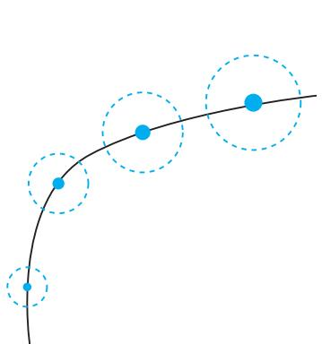

<details>
<summary>natural_image</summary>

Simple curved line with blue dots and dashed circles, no text or symbols present
</details>

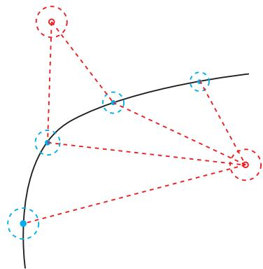

<details>
<summary>natural_image</summary>

Geometric diagram showing a curved line with intersecting dashed and solid lines, marked with blue circles and red circles (no text or symbols)
</details>

图 10-1 不确定性的直观描述。左侧：只有运动方程时，由于下一个时刻的位姿是在上一个时刻基础上添加了噪声，所以不确定性越来越大。右侧：存在路标点（红色）时，不确定性会明显减小。不过请注意这只是一个直观的示意图，并非实际数据。

上面的过程以比喻的形式解释了状态估计中的问题，下面我们要以定量的方式来看待它。在第六讲中，我们介绍了最大似然估计，提到把状态估计转换为最小二乘的做法。在本讲我们要更仔细地讨论这个问题。首先，由于位姿和路标点都是待估计的变量，我们改变一下记号，令 $\scriptstyle { \mathbf { { \mathit { x } } } } _ { k }$ 为 k 时刻的所有未知量。它包含了当前时刻的相机位姿与 m 个路标点。在这种记号的意义下（虽然与之前稍有不同，但含义是清楚的），写成：

$$
\boldsymbol {x} _ {k} \triangleq \{\boldsymbol {x} _ {k}, \boldsymbol {y} _ {1}, \dots , \boldsymbol {y} _ {m} \}. \tag {10.2}
$$

同时，把 k 时刻的所有观测记作 $z _ { k }$ 。于是，运动方程与观测方程的形式可写得更加简

洁。这里不会出现 y，但我们心里要明白这时 x 中已经包含了之前的 y 了：

$$
\left\{ \begin{array}{l l} \boldsymbol {x} _ {k} = f \left(\boldsymbol {x} _ {k - 1}, \boldsymbol {u} _ {k}\right) + \boldsymbol {w} _ {k} & k = 1, \dots , N. \\ \boldsymbol {z} _ {k} = h \left(\boldsymbol {x} _ {k}\right) + \boldsymbol {v} _ {k} \end{array} \right. \tag {10.3}
$$

现在考虑第 k 时刻的情况。我们希望用过去 0 到 k 中的数据，来估计现在的状态分布：

$$
P (\boldsymbol {x} _ {k} | \boldsymbol {x} _ {0}, \boldsymbol {u} _ {1: k}, \boldsymbol {z} _ {1: k}). \tag {10.4}
$$

下标 0 : k 表示从 0 时刻到 k 时刻的所有数据。请注意 $z _ { k }$ 来表达所有在 k 时刻的观测数据，注意它可能不止一个，只是这种记法更加方便。

下面我们来看如何对状态进行估计。按照 Bayes 法则，把 $z _ { k }$ 与 $\scriptstyle { \mathbf { { \mathit { x } } } } _ { k }$ 交换位置，有：

$$
P \left(\boldsymbol {x} _ {k} | \boldsymbol {x} _ {0}, \boldsymbol {u} _ {1: k}, \boldsymbol {z} _ {1: k}\right) \propto P \left(\boldsymbol {z} _ {k} | \boldsymbol {x} _ {k}\right) P \left(\boldsymbol {x} _ {k} | \boldsymbol {x} _ {0}, \boldsymbol {u} _ {1: k}, \boldsymbol {z} _ {1: k - 1}\right). \tag {10.5}
$$

读者应该不会感到陌生。这里第一项称为似然，第二项称为先验。似然由观测方程给定，而先验部分，我们要明白当前状态 $\scriptstyle { \mathbf { { \mathit { x } } } } _ { k }$ 是基于过去所有的状态估计得来的。至少，它会受 ${ \bf { \mathcal { x } } } _ { k - 1 }$ 影响，于是按照 $\mathbf { \Delta x } _ { k - 1 }$ 时刻为条件概率展开：

$$
P \left(\boldsymbol {x} _ {k} \mid \boldsymbol {x} _ {0}, \boldsymbol {u} _ {1: k}, \boldsymbol {z} _ {1: k - 1}\right) = \int P \left(\boldsymbol {x} _ {k} \mid \boldsymbol {x} _ {k - 1}, \boldsymbol {x} _ {0}, \boldsymbol {u} _ {1: k}, \boldsymbol {z} _ {1: k - 1}\right) P \left(\boldsymbol {x} _ {k - 1} \mid \boldsymbol {x} _ {0}, \boldsymbol {u} _ {1: k}, \boldsymbol {z} _ {1: k - 1}\right) \mathrm{d} \boldsymbol {x} _ {k - 1}. \tag {10.6}
$$

如果我们考虑更久之前的状态，也可以继续对此式进行展开，但现在我们只关心 k 时刻和 k −1 时刻的情况。至此，我们给出了贝叶斯估计，虽然上式还没有具体的概率分布形式，所以我还没法实际地操作它。对这一步的后续处理，方法上产生了一些分歧。大体来说，存在若干种选择：其一是假设马尔可夫性，简单的一阶马氏性认为，k 时刻状态只与 k−1 时刻状态有关，而与再之前的无关。如果做出这样的假设，我们就会得到以扩展卡尔曼滤波（EKF）为代表的滤波器方法。在滤波方法中，我们会从某时刻的状态估计，推导到下一个时刻。另外一种方法是依然考虑 k 时刻状态与之前所有状态的关系，此时将得到非线性优化为主体的优化框架。非线性优化的基本知识已经在前文介绍过了。目前视觉SLAM 主流为非线性优化方法。不过为了让本书更全面，我们要先介绍一下卡尔曼滤波器和 EKF 的原理。

## 10.1.2 线性系统和 KF

我们首先来看滤波器模型。当我们假设了马尔可夫性，从数学角度会发生哪些变化呢？首先，当前时刻状态只和上一个时刻有关，式（10.6）中等式右侧第一部分可进一步简化：

$$
P \left(\boldsymbol {x} _ {k} | \boldsymbol {x} _ {k - 1}, \boldsymbol {x} _ {0}, \boldsymbol {u} _ {1: k}, \boldsymbol {z} _ {1: k - 1}\right) = P \left(\boldsymbol {x} _ {k} | \boldsymbol {x} _ {k - 1}, \boldsymbol {u} _ {k}\right). \tag {10.7}
$$

这里，由于 k 时刻状态与 k − 1 之前的无关，所以就简化成只与 ${ \bf { \mathcal { x } } } _ { k - 1 }$ 和 $\mathbf { \Delta } \mathbf { u } _ { k }$ 有关的形式，与 k 时刻的运动方程对应。第二部分可简化为：

$$
P \left(\boldsymbol {x} _ {k - 1} | \boldsymbol {x} _ {0}, \boldsymbol {u} _ {1: k}, \boldsymbol {z} _ {1: k - 1}\right) = P \left(\boldsymbol {x} _ {k - 1} | \boldsymbol {x} _ {0}, \boldsymbol {u} _ {1: k - 1}, \boldsymbol {z} _ {1: k - 1}\right). \tag {10.8}
$$

这是考虑到 k 时刻的输入量 $\mathbf { \Delta } \mathbf { u } _ { k }$ 与 k −1 时刻的状态无关，所以我们把 $\mathbf { \Delta } \mathbf { u } _ { k }$ 拿掉。可以看到，这一项实际是 k −1 时刻的状态分布。于是，这一系列方程说明了，我们实际在做的是“如何把 k−1 时刻的状态分布推导至 k 时刻”这样一件事。也就是说，在程序运行期间，我们只要维护一个状态量，对它进行不断地迭代和更新即可。进一步，如果假设状态量服从高斯分布，那我们只需考虑维护状态量的均值和协方差即可。

我们从形式最简单的线性高斯系统开始，最后会得到卡尔曼滤波器。线性高斯系统是说，运动方程和观测方程可以由线性方程来描述：

$$
\left\{ \begin{array}{l l} \boldsymbol {x} _ {k} = \boldsymbol {A} _ {k} \boldsymbol {x} _ {k - 1} + \boldsymbol {u} _ {k} + \boldsymbol {w} _ {k} & k = 1, \dots , N. \\ \boldsymbol {z} _ {k} = \boldsymbol {C} _ {k} \boldsymbol {x} _ {k} + \boldsymbol {v} _ {k} \end{array} \right. \tag {10.9}
$$

并假设所有的状态和噪声均满足高斯分布。记这里的噪声服从零均值高斯分布：

$$
\boldsymbol {w} _ {k} \sim N (\boldsymbol {0}, \boldsymbol {R}). \quad \boldsymbol {v} _ {k} \sim N (\boldsymbol {0}, \boldsymbol {Q}). \tag {10.10}
$$

为了简洁我省略了 R 和 Q 的下标。现在，利用马尔可夫性，假设我们知道了 k −1时刻的后验（在 k − 1 时刻看来）状态估计： $\hat { \pmb x } _ { k - 1 }$ 和它的协方差 $\hat { P } _ { k - 1 }$ ，现在要根据 k 时刻的输入和观测数据，确定 $\scriptstyle { \mathbf { { \mathit { x } } } } _ { k }$ 的后验分布。为区分推导中的先验和后验，我们在记号上作一点区别：以尖帽子 $\scriptstyle { \hat { \mathbf { x } } } _ { k }$ 表示后验，以横线 x¯ 表示先验分布，请读者不要混淆。

卡尔曼滤波器的第一步，通过运动方程确定 $\scriptstyle { \mathbf { { \mathit { x } } } } _ { k }$ 的先验分布。根据高斯分布的性质，显然有：

$$
P \left(\boldsymbol {x} _ {k} | \boldsymbol {x} _ {0}, \boldsymbol {u} _ {1: k}, \boldsymbol {z} _ {1: k - 1}\right) = N \left(\boldsymbol {A} _ {k} \hat {\boldsymbol {x}} _ {k - 1} + \boldsymbol {u} _ {k}, \boldsymbol {A} _ {k} \hat {\boldsymbol {P}} _ {k - 1} \boldsymbol {A} _ {k} ^ {T} + \boldsymbol {R}\right). \tag {10.11}
$$

这一步称为预测，原理见附录（A.3）。它显示了如何从上一个时刻的状态，根据输入

信息（但是有噪声），推断当前时刻的状态分布。这个分布也就是先验。记这里的：

$$
\bar {\boldsymbol {x}} _ {k} = \boldsymbol {A} _ {k} \hat {\boldsymbol {x}} _ {k - 1} + \boldsymbol {u} _ {k}, \quad \bar {\boldsymbol {P}} _ {k} = \boldsymbol {A} _ {k} \hat {\boldsymbol {P}} _ {k - 1} \boldsymbol {A} _ {k} ^ {T} + \boldsymbol {R}. \tag {10.12}
$$

这非常自然。另一方面，由观测方程，我们可以计算在某个状态下，应该产生怎样的观测数据：

$$
P \left(\boldsymbol {z} _ {k} | \boldsymbol {x} _ {k}\right) = N \left(\boldsymbol {C} _ {k} \boldsymbol {x} _ {k}, \boldsymbol {Q}\right). \tag {10.13}
$$

为了得到后验概率，我们想要计算它们的乘积，也就是由式（10.5）给出的贝叶斯公式。然而，虽然我们知道最后会得到一个关于 $\scriptstyle { \mathbf { { \mathit { x } } } } _ { k }$ 的高斯分布，但计算上是有一丁点儿麻烦的，我们先把结果设为 $\pmb { x } _ { k } \sim N ( \hat { \pmb { x } } _ { k } , \hat { \pmb { P } } _ { k } )$ ，那么：

$$
N (\hat {\boldsymbol {x}} _ {k}, \hat {\boldsymbol {P}} _ {k}) = N \left(\boldsymbol {C} _ {k} \boldsymbol {x} _ {k}, \boldsymbol {Q}\right) \cdot N (\bar {\boldsymbol {x}} _ {k}, \bar {\boldsymbol {P}} _ {k}). \tag {10.14}
$$

这里我们稍微用点讨巧的方法。既然我们已经知道等式两侧都是高斯分布，那就只需比较指数部分即可，而无须理会高斯分布前面的因子部分。指数部分很像是一个二次型的配方，我们来推导一下。首先把指数部分展开，有①：

$$
\left(\boldsymbol {x} _ {k} - \hat {\boldsymbol {x}} _ {k}\right) ^ {T} \hat {\boldsymbol {P}} _ {k} ^ {- 1} \left(\boldsymbol {x} _ {k} - \hat {\boldsymbol {x}} _ {k}\right) = \left(\boldsymbol {z} _ {k} - \boldsymbol {C} _ {k} \boldsymbol {x} _ {k}\right) ^ {T} \boldsymbol {Q} ^ {- 1} \left(\boldsymbol {z} _ {k} - \boldsymbol {C} _ {k} \boldsymbol {x} _ {k}\right) + \left(\boldsymbol {x} _ {k} - \bar {\boldsymbol {x}} _ {k}\right) ^ {T} \bar {\boldsymbol {P}} _ {k} ^ {- 1} \left(\boldsymbol {x} _ {k} - \bar {\boldsymbol {x}} _ {k}\right). \tag {10.15}
$$

为了求左侧的 $\hat { \pmb x } _ { k }$ 和 $\hat { P } _ { k }$ ，我们把两边展开，并比较 $\scriptstyle { \mathbf { { \mathit { x } } } } _ { k }$ 的二次和一次系数。对于二次系数，有：

$$
\hat {\boldsymbol {P}} _ {k} ^ {- 1} = \boldsymbol {C} _ {k} ^ {T} \boldsymbol {Q} ^ {- 1} \boldsymbol {C} _ {k} + \bar {\boldsymbol {P}} _ {k} ^ {- 1}. \tag {10.16}
$$

该式给出了协方差的计算过程。为了便于后边列写式子，定义一个中间变量：

$$
\boldsymbol {K} = \hat {\boldsymbol {P}} _ {k} \boldsymbol {C} _ {k} ^ {T} \boldsymbol {Q} ^ {- 1}. \tag {10.17}
$$

根据此定义，在式（10.16）左右各乘 $\hat { P } _ { k }$ ，有：

$$
\boldsymbol {I} = \hat {\boldsymbol {P}} _ {k} \boldsymbol {C} _ {k} ^ {T} \boldsymbol {Q} ^ {- 1} \boldsymbol {C} _ {k} + \hat {\boldsymbol {P}} _ {k} \bar {\boldsymbol {P}} _ {k} ^ {- 1} = \boldsymbol {K} \boldsymbol {C} _ {k} + \hat {\boldsymbol {P}} _ {k} \bar {\boldsymbol {P}} _ {k} ^ {- 1}. \tag {10.18}
$$

于是有②：

$$
\hat {\boldsymbol {P}} _ {k} = (\boldsymbol {I} - \boldsymbol {K} \boldsymbol {C} _ {k}) \bar {\boldsymbol {P}} _ {k}. \tag {10.19}
$$

然后再比较一次项的系数，有：

$$
- 2 \hat {\boldsymbol {x}} _ {k} ^ {T} \hat {\boldsymbol {P}} _ {k} ^ {- 1} \boldsymbol {x} _ {k} = - 2 \boldsymbol {z} _ {k} ^ {T} \boldsymbol {Q} ^ {- 1} \boldsymbol {C} _ {k} \boldsymbol {x} _ {k} - 2 \bar {\boldsymbol {x}} _ {k} ^ {T} \bar {\boldsymbol {P}} _ {k} ^ {- 1} \boldsymbol {x} _ {k}. \tag {10.20}
$$

整理（取系数并转置）得：

$$
\hat {\boldsymbol {P}} _ {k} ^ {- 1} \hat {\boldsymbol {x}} _ {k} = \boldsymbol {C} _ {k} ^ {T} \boldsymbol {Q} ^ {- 1} \boldsymbol {z} _ {k} + \bar {\boldsymbol {P}} _ {k} ^ {- 1} \bar {\boldsymbol {x}} _ {k}. \tag {10.21}
$$

两侧乘以 $\hat { P } _ { k }$ 并代入式（10.17），得：

$$
\hat {\boldsymbol {x}} _ {k} = \hat {\boldsymbol {P}} _ {k} \boldsymbol {C} _ {k} ^ {T} \boldsymbol {Q} ^ {- 1} \boldsymbol {z} _ {k} + \hat {\boldsymbol {P}} _ {k} \bar {\boldsymbol {P}} _ {k} ^ {- 1} \bar {\boldsymbol {x}} _ {k} \tag {10.22}
$$

$$
= \boldsymbol {K} \boldsymbol {z} _ {k} + (\boldsymbol {I} - \boldsymbol {K} \boldsymbol {C} _ {k}) \bar {\boldsymbol {x}} _ {k} = \bar {\boldsymbol {x}} _ {k} + \boldsymbol {K} \left(\boldsymbol {z} _ {k} - \boldsymbol {C} _ {k} \bar {\boldsymbol {x}} _ {k}\right). \tag {10.23}
$$

于是我们又得到了后验均值的表达。总而言之，上面的两个步骤可以归纳为“预测”（Predict）和“更新”（Update）两个步骤：

1. 预测：

$$
\bar {\boldsymbol {x}} _ {k} = \boldsymbol {A} _ {k} \hat {\boldsymbol {x}} _ {k - 1} + \boldsymbol {u} _ {k}, \quad \bar {\boldsymbol {P}} _ {k} = \boldsymbol {A} _ {k} \hat {\boldsymbol {P}} _ {k - 1} \boldsymbol {A} _ {k} ^ {T} + \boldsymbol {R}. \tag {10.24}
$$

2. 更新：先计算 K，它又称为卡尔曼增益：

$$
\boldsymbol {K} = \bar {\boldsymbol {P}} _ {k} \boldsymbol {C} _ {k} ^ {T} \left(\boldsymbol {C} _ {k} \bar {\boldsymbol {P}} _ {k} \boldsymbol {C} _ {k} ^ {T} + \boldsymbol {Q}\right) ^ {- 1}. \tag {10.25}
$$

然后计算后验概率的分布：

$$
\hat {\boldsymbol {x}} _ {k} = \bar {\boldsymbol {x}} _ {k} + \boldsymbol {K} \left(\boldsymbol {z} _ {k} - \boldsymbol {C} _ {k} \bar {\boldsymbol {x}} _ {k}\right) \tag {10.26}
$$

$$
\hat {\boldsymbol {P}} _ {k} = \left(\boldsymbol {I} - \boldsymbol {K} \boldsymbol {C} _ {k}\right) \bar {\boldsymbol {P}} _ {k}.
$$

至此，我们推导了经典的卡尔曼滤波器的整个过程。事实上卡尔曼滤波器有若干种推导方式，而我们使用的是从概率角度出发的最大后验概率估计的形式。我们看到，在线性高斯系统中，卡尔曼滤波器构成了该系统中的最大后验概率估计。而且，由于高斯分布经过线性变换后仍服从高斯分布，所以整个过程中我们没有进行任何的近似。可以说，卡尔曼滤波器构成了线性系统的最优无偏估计。

## 10.1.3 非线性系统和 EKF

在理解卡尔曼滤波之后，我们必须要澄清一点：SLAM 中的运动方程和观测方程通常是非线性函数，尤其是视觉 SLAM 中的相机模型，需要使用相机内参模型以及李代数表示的位姿，更不可能是一个线性系统。一个高斯分布，经过非线性变换后，往往不再是高斯分布，所以在非线性系统中，我们必须取一定的近似，将一个非高斯的分布近似成一个高斯分布。

我们希望把卡尔曼滤波器的结果拓展到非线性系统中来，称为扩展卡尔曼滤波器（Ex-tended Kalman Filter，EKF）。通常的做法是，在某个点附近考虑运动方程以及观测方程的一阶泰勒展开，只保留一阶项，即线性的部分，然后按照线性系统进行推导。令 k−1 时刻的均值与协方差矩阵为 $\hat { \pmb { x } } _ { k - 1 } , \hat { P } _ { k - 1 }$ 。在 k 时刻，我们把运动方程和观测方程，在 $\hat { \pmb { x } } _ { k - 1 } , \hat { P } _ { k - 1 }$ 处进行线性化（相当于一阶泰勒展开），有：

$$
\boldsymbol {x} _ {k} \approx f (\hat {\boldsymbol {x}} _ {k - 1}, \boldsymbol {u} _ {k}) + \left. \frac {\partial f}{\partial \boldsymbol {x} _ {k - 1}} \right| _ {\hat {\boldsymbol {x}} _ {k - 1}} (\boldsymbol {x} _ {k - 1} - \hat {\boldsymbol {x}} _ {k - 1}) + \boldsymbol {w} _ {k}. \tag {10.27}
$$

记这里的偏导数为：

$$
\boldsymbol {F} = \left. \frac {\partial f}{\partial \boldsymbol {x} _ {k - 1}} \right| _ {\hat {\boldsymbol {x}} _ {k - 1}}. \tag {10.28}
$$

同样的，对于观测方程，亦有：

$$
\boldsymbol {z} _ {k} \approx h (\bar {\boldsymbol {x}} _ {k}) + \left. \frac {\partial h}{\partial \boldsymbol {x} _ {k}} \right| _ {\bar {\boldsymbol {x}} _ {k}} (\boldsymbol {x} _ {k} - \hat {\boldsymbol {x}} _ {k}) + \boldsymbol {n} _ {k}. \tag {10.29}
$$

记这里的偏导数为：

$$
\boldsymbol {H} = \left. \frac {\partial h}{\partial \boldsymbol {x} _ {k}} \right| _ {\bar {\boldsymbol {x}} _ {k}}. \tag {10.30}
$$

那么，在预测步骤中，根据运动方程有：

$$
P \left(\boldsymbol {x} _ {k} | \boldsymbol {x} _ {0}, \boldsymbol {u} _ {1: k}, \boldsymbol {z} _ {0: k - 1}\right) = N (f (\hat {\boldsymbol {x}} _ {k - 1}, \boldsymbol {u} _ {k}), \boldsymbol {F} \hat {\boldsymbol {P}} _ {k - 1} \boldsymbol {F} ^ {\mathrm{T}} + \boldsymbol {R} _ {k}). \tag {10.31}
$$

这些推导和卡尔曼滤波是十分相似的。为方便表述，记这里先验和协方差的均值为

$$
\bar {\boldsymbol {x}} _ {k} = f \left(\hat {\boldsymbol {x}} _ {k - 1}, \boldsymbol {u} _ {k}\right), \quad \bar {\boldsymbol {P}} _ {k} = \boldsymbol {F} \hat {\boldsymbol {P}} _ {k} \boldsymbol {F} ^ {T} + \boldsymbol {R} _ {k}. \tag {10.32}
$$

然后，考虑在观测中，我们有：

$$
P \left(\boldsymbol {z} _ {k} | \boldsymbol {x} _ {k}\right) = N (h \left(\bar {\boldsymbol {x}} _ {k}\right) + \boldsymbol {H} \left(\boldsymbol {x} _ {k} - \bar {\boldsymbol {x}} _ {k}\right), \boldsymbol {Q} _ {k}). \tag {10.33}
$$

最后，根据最开始的 Bayes 展开式，可以推导出 $\scriptstyle { \mathbf { { \mathit { x } } } } _ { k }$ 的后验概率形式。我们略去中间的推导过程，只介绍其结果。读者可以仿照着卡尔曼滤波器的方式，推导 EKF 的预测与更新方程。简而言之，我们会先定义一个卡尔曼增益 $\pmb { K } _ { k }$ ：

$$
\boldsymbol {K} _ {k} = \bar {\boldsymbol {P}} _ {k} \boldsymbol {H} ^ {\mathrm{T}} \left(\boldsymbol {H} \bar {\boldsymbol {P}} _ {k} \boldsymbol {H} ^ {\mathrm{T}} + \boldsymbol {Q} _ {k}\right) ^ {- 1}. \tag {10.34}
$$

在卡尔曼增益的基础上，后验概率的形式为：

$$
\hat {\boldsymbol {x}} _ {k} = \bar {\boldsymbol {x}} _ {k} + \boldsymbol {K} _ {k} \left(\boldsymbol {z} _ {k} - h (\bar {\boldsymbol {x}} _ {k})\right), \hat {\boldsymbol {P}} _ {k} = \left(\boldsymbol {I} - \boldsymbol {K} _ {k} \boldsymbol {H}\right) \bar {\boldsymbol {P}} _ {k}. \tag {10.35}
$$

卡尔曼滤波器给出了在线性化之后，状态变量分布的变化过程。在线性系统和高斯噪声下，卡尔曼滤波器给出了无偏最优估计。而在 SLAM 这种非线性的情况下，它给出了单次线性近似下最大后验估计（MAP）。

## 10.1.4 EKF 的讨论

EKF 以形式简洁、应用广泛著称。当我们想要在某段时间内估计某个不确定量时，首先想到的就是 EKF。在早期的 SLAM 中，EKF 占据了很长一段时间的主导地位，研究者们讨论了各种各样滤波器在 SLAM 中的应用，如 IF（信息滤波器）[62]、IEKF[63]（IteratedKF）、UKF[64]（Unscented KF）和粒子滤波器 [65, 66, 67]，SWF（Sliding Window Filter）[68] 等等 [17]①，或者用分治法等思路改进 EKF 的效率 [69, 70]。直至今日，尽管我们认识到非线性优化比滤波器占有明显的优势，但是在计算资源受限，或待估计量比较简单的场合，EKF 仍不失为一种有效的方式。

EKF 有哪些局限呢？

1. 首先，滤波器方法在一定程度上假设了马尔可夫性，也就是 k 时刻的状态只与 k−1时刻相关，而与 k − 1 之前的状态和观测都无关（或者和前几个有限时间的状态相关）。这有点像是在视觉里程计中，只考虑相邻两帧关系一样。如果当前帧确实与很久之前的数据有关（例如回环），那么滤波器就会难以处理这种情况。

而非线性优化方法则倾向于使用所有的历史数据。它不光考虑邻近时刻的特征点与轨迹关系，更会把考虑很久之前的状态也考虑进来，称为全体时间上的 SLAM（Full-SLAM）。在这种意义下，非线性优化方法使用了更多信息，当然也需要更多的计算。

2. 与第六章介绍的优化方法相比，EKF 滤波器仅在 $\hat { \pmb x } _ { k - 1 }$ 处做了一次线性化，然后就直接根据这次线性化结果，把后验概率给算了出来。这相当于在说，我们认为该点处的线性化近似，在后验概率处仍然是有效的。而实际上，当我们离开工作点较远的时候，一阶泰勒展开并不一定能够近似整个函数，这取决于运动模型和观测模型的非线性情况。如果它们有强烈的非线性，那线性近似就只在很小范围内成立，不能认为在很远的地方仍能用线性来近似。这就是 EKF 的非线性误差，是它的主要问题所在。

在优化问题中，尽管我们也做一阶（最速下降）或二阶（G-N 或 L-M）的近似，但每迭代一次，状态估计发生改变之后，我们会重新对新的估计点做泰勒展开，而不像EKF 那样只在固定点上做一次泰勒展开。这就导致优化方法适用范围更广，则在状态变化较大时亦能适用。

3. 从程序实现上来说，EKF 需要存储状态量的均值和方差，并对它们进行维护和更新。如果把路标也放进状态的话，由于视觉 SLAM 中路标数量很大，这个存储量是相当可观的，且与状态量呈平方增长（因为要存储协方差矩阵）。因此，EKF SLAM 普遍被认为不可适用于大型场景。

由于 EKF 存在这些明显的缺点，我们通常认为，在同等计算量的情况下，非线性优化能取得更好的效果 [13]。下面我们来讨论以非线性优化为主的后端。我们将主要介绍图优化，并且用 g2o 和 Ceres 体验一下后端的例子。

## 10.2 BA 与图优化

如果你做过视觉三维重建，那么你应该对这个概念再也熟悉不过了。所谓的 BundleAdjustment①，是指从视觉重建中提炼出最优的 3D 模型和相机参数（内参数和外参数）。从每一个特征点反射出来的几束光线（bundles of light rays），在我们把相机姿态和特征点空间位置做出最优的调整 (adjustment) 之后，最后收束到相机光心的这个过程 [26]，简称为 BA。

在以图优化框架的视觉 SLAM 算法里，BA 起到了核心作用。它类似于求解只有观测方程的 SLAM 问题。在最近几年视觉 SLAM 理论的研究中，BA 算法不仅具有很高的精度，也开始具备良好的实时性，能够应用于在线计算的 SLAM 场景中。而在 21 世纪早期，虽然计算机视觉领域的研究者已经开始利用 BA 进行重构，但 SLAM 的研究者通常认为包含大量特征点和相机位姿的 BA 计算量过大，不适合实时计算。直到近十年来，人们逐渐认识到 SLAM 问题中 BA 的稀疏特性，才使它能够在实时的场景中使用 [9, 24]。因此，掌握好 Bundle Adjustment，深入研究其中的理论和实践细节，是做好视觉 SLAM 的关键。

本节结合第五讲和第六讲的内容，介绍 Bundle Adjustment 的模型，并且和读者逐步探讨求解过程，特别要探讨它的稀疏性，然后介绍一种通用的快速求解方法。

## 10.2.1 投影模型和 BA 代价函数

在第五讲里，我们曾介绍了投影模型和畸变，让我们复习一下整个投影的过程。从一个世界坐标系中的点 p 出发，把相机的内外参数和畸变都考虑进来，最后投影成像素坐标，一共需要如下几个步骤：

1. 首先，把世界坐标转换到相机坐标，这里将用到相机外参数 (R, t)：

$$
\boldsymbol {P} ^ {\prime} = \boldsymbol {R} \boldsymbol {p} + \boldsymbol {t} = [ X ^ {\prime}, Y ^ {\prime}, Z ^ {\prime} ] ^ {T}. \tag {10.36}
$$

2. 然后，将 $P ^ { \prime }$ 投至归一化平面，得到归一化坐标：

$$
\boldsymbol {P} _ {c} = [ u _ {c}, v _ {c}, 1 ] ^ {T} = [ X ^ {\prime} / Z ^ {\prime}, Y ^ {\prime} / Z ^ {\prime}, 1 ] ^ {T}. \tag {10.37}
$$

3. 对归一化坐标去畸变，得到去畸变后的坐标。这里暂时只考虑径向畸变：

$$
\left\{ \begin{array}{l} u _ {c} ^ {\prime} = u _ {c} \left(1 + k _ {1} r _ {c} ^ {2} + k _ {2} r _ {c} ^ {4}\right) \\ v _ {c} ^ {\prime} = v _ {c} \left(1 + k _ {1} r _ {c} ^ {2} + k _ {2} r _ {c} ^ {4}\right) \end{array} . \right. \tag {10.38}
$$

4. 最后，根据内参模型，计算像素坐标：

$$
\left\{ \begin{array}{l} u _ {s} = f _ {x} u _ {c} ^ {\prime} + c _ {x} \\ v _ {s} = f _ {y} v _ {c} ^ {\prime} + c _ {y} \end{array} . \right. \tag {10.39}
$$

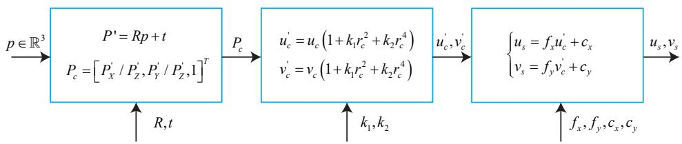

<details>
<summary>flowchart</summary>

```mermaid
graph LR
  A["p ∈ ℝ³"] --> B["P' = Rp + t\nP_c = [P_X'/P_Z', P_Y'/P_Z', 1"]^T]
  B --> C["P_c"]
  C --> D["u'_c = u_c(1 + k_1r_c^2 + k_2r_c^4)\nv'_c = v_c(1 + k_1r_c^2 + k_2r_c^4)"]
  D --> E["u'_c, v'_c"]
  E --> F["{u_s = f_x u'_c + c_x\nv_s = f_y v'_c + c_y}"]
  F --> G["u_s, v_s"]
  H["R, t"] --> B
  I["k_1, k_2"] --> D
  J["f_x, f_y, c_x, c_y"] --> F
```
</details>

图 10-2 计算流程示意图。左侧的 p 是全局坐标系下的三维坐标点，右侧的 $u _ { s } , v _ { s }$ 是该点在图像平面上的最终像素坐标。中间畸变模块中的 $r _ { c } ^ { 2 } = u _ { c } ^ { 2 } + v _ { c } ^ { 2 }$

这一系列计算流程看似有些复杂。我们用流程图 10-2 形象化地表示整个过程，以帮助读者理解。读者应该能领会到，这个过程也就是前面讲的观测方程，之前我们把它抽象地

记成：

$$
\boldsymbol {z} = h (\boldsymbol {x}, \boldsymbol {y}). \tag {10.40}
$$

现在，我们给出了它的详细参数化过程。具体地说，这里的 x 指代此时相机的位姿，即外参 $R , t ,$ ，它对应的李代数为 $\xi _ { \cdot }$ 。路标 y 即这里的三维点 ${ \pmb p } ;$ ，而观测数据则是像素坐标$\boldsymbol { z } \triangleq [ u _ { s } , v _ { s } ] ^ { T }$ 。以最小二乘的角度来考虑，那么可以列写关于此次观测的误差：

$$
\boldsymbol {e} = \boldsymbol {z} - h (\boldsymbol {\xi}, \boldsymbol {p}). \tag {10.41}
$$

然后，把其他时刻的观测量也考虑进来，我们可以给误差添加一个下标。设 $z _ { i j }$ 为在位姿 $\pmb { \xi } _ { i }$ 处观察路标 $p _ { j }$ 产生的数据，那么整体的代价函数（Cost Function）为：

$$
\frac {1}{2} \sum_ {i = 1} ^ {m} \sum_ {j = 1} ^ {n} \| e _ {i j} \| ^ {2} = \frac {1}{2} \sum_ {i = 1} ^ {m} \sum_ {j = 1} ^ {n} \| z _ {i j} - h (\boldsymbol {\xi} _ {i}, \boldsymbol {p} _ {j}) \| ^ {2}. \tag {10.42}
$$

对这个最小二乘进行求解，相当于对位姿和路标同时作了调整，也就是所谓的 BA。接下来，我们会根据该目标函数和第六章介绍的非线性优化内容，逐步深入探讨该模型的求解。

## 10.2.2 BA 的求解

观察在上一节中的观测模型 $h ( \pmb { \xi } , \pmb { p } )$ ，很容易判断该函数不是线性函数。所以我们希望使用 6.2 节介绍的一些非线性优化手段来优化它。根据非线性优化的思想，我们应该从某个的初始值开始，不断地寻找下降方向 $\Delta \mathbf { x }$ 来找到目标函数的最优解，即不断地求解增量方程（6.22）中的增量 $\Delta { } x$ 。尽管误差项都是针对单个位姿和路标点的，但在整体 BA 目标函数上，我们必须把自变量定义成所有待优化的变量：

$$
\boldsymbol {x} = [ \boldsymbol {\xi} _ {1}, \dots , \boldsymbol {\xi} _ {m}, \boldsymbol {p} _ {1}, \dots , \boldsymbol {p} _ {n} ] ^ {T}. \tag {10.43}
$$

相应的，增量方程中的 $\Delta { } x$ 则是对整体自变量的增量。在这个意义下，当我们给自变量一个增量时，目标函数变为：

$$
\frac {1}{2} \left\| f (\boldsymbol {x} + \Delta \boldsymbol {x}) \right\| ^ {2} \approx \frac {1}{2} \sum_ {i = 1} ^ {m} \sum_ {j = 1} ^ {n} \left\| e _ {i j} + \boldsymbol {F} _ {i j} \Delta \boldsymbol {\xi} _ {i} + \boldsymbol {E} _ {i j} \Delta \boldsymbol {p} _ {j} \right\| ^ {2}. \tag {10.44}
$$

其中 $ { \boldsymbol { F } } _ { i j }$ 表示整个儿代价函数在当前状态下对相机姿态的偏导数，而 $\mathbf { \mathcal { E } } _ { i j }$ 表示该函数对路标点位置的偏导。我们曾在 7.7.3 节中介绍了它们的具体形式，所以这里就不再展开它们的推导了。现在，把相机位姿变量放在一起：

$$
\boldsymbol {x} _ {c} = [ \boldsymbol {\xi} _ {1}, \boldsymbol {\xi} _ {2}, \dots , \boldsymbol {\xi} _ {m} ] ^ {T} \in \mathbb {R} ^ {6 m}, \tag {10.45}
$$

并把空间点的变量也放在一起：

$$
\boldsymbol {x} _ {p} = [ \boldsymbol {p} _ {1}, \boldsymbol {p} _ {2}, \dots , \boldsymbol {p} _ {n} ] ^ {T} \in \mathbb {R} ^ {3 n}, \tag {10.46}
$$

那么，式（10.44）可以简化表达为如下：

$$
\frac {1}{2} \left\| f (\boldsymbol {x} + \Delta \boldsymbol {x}) \right\| ^ {2} = \frac {1}{2} \left\| \boldsymbol {e} + \boldsymbol {F} \Delta \boldsymbol {x} _ {c} + \boldsymbol {E} \Delta \boldsymbol {x} _ {p} \right\| ^ {2}. \tag {10.47}
$$

需要注意的是，该式从一个由很多个小型二次项之和，变成了一个更整体的样子。这里的雅可比矩阵 E 和 F 必须是整体目标函数对整体变量的导数，它将是一个很大块的矩阵，而里头每个小分块，需要由每个误差项的导数 $\boldsymbol { F } _ { i j }$ 和 $\pmb { { E } } _ { i j }$ “拼凑”起来。然后，无论我们使用 G-N 还是 L-M 方法，最后都将面对增量线性方程：

$$
\boldsymbol {H} \Delta \boldsymbol {x} = \boldsymbol {g}. \tag {10.48}
$$

根据第六章的知识，我们知道 G-N 和 L-M 的主要差别在于，这里的 H 是取 ${ \pmb J } ^ { T } { \pmb J }$ 还是 $J ^ { T } J + \lambda I$ 的形式。由于我们把变量归类成了位姿和空间点两种，所以雅可比矩阵可以分块为：

$$
\boldsymbol {J} = \left[ \begin{array}{l l} \boldsymbol {F} & \boldsymbol {E} \end{array} \right]. \tag {10.49}
$$

那么，以 G-N 为例，则 H 矩阵为：

$$
\boldsymbol {H} = \boldsymbol {J} ^ {T} \boldsymbol {J} = \left[ \begin{array}{l l} \boldsymbol {F} ^ {T} \boldsymbol {F} & \boldsymbol {F} ^ {T} \boldsymbol {E} \\ \boldsymbol {E} ^ {T} \boldsymbol {F} & \boldsymbol {E} ^ {T} \boldsymbol {E} \end{array} \right]. \tag {10.50}
$$

当然在 L-M 中我们也需要计算这个矩阵。不难发现，因为考虑了所有的优化变量，这个线性方程的维度将非常大，包含了所有的相机位姿和路标点。尤其是在视觉 SLAM 中，一个图像就会提出数百个特征点，大大增加了这个线性方程的规模。如果直接对 H 求逆来计算增量方程，由于矩阵求逆是复杂度为 $O ( n ^ { 3 } )$ 的操作 [71]，这是非常消耗计算资源的。幸运地是，这里的 H 矩阵是有一定的特殊结构的。利用这个特殊结构，我们可以加速求解过程。

## 10.2.3 稀疏性和边缘化

21 世纪视觉 SLAM 的一个重要进展是认识到了矩阵 H 的稀疏结构，并发现该结构可以自然、显式地用图优化来表示 [28, 72]。本节将详细讨论一下该矩阵稀疏结构。

H 矩阵的稀疏性是由雅可比 $\pmb { J } ( \pmb { x } )$ 引起的。考虑这些代价函数当中的其中一个 $e _ { i j }$ 。注意到，这个误差项只描述了在 $\pmb { \xi } _ { i }$ 看到 $p _ { j }$ 这件事，只涉及到第 i 个相机位姿和第 j 个路标点，对其余部分的变量的导数都为 0。所以该误差项对应的雅可比矩阵有下面的形式：

$$
\boldsymbol {J} _ {i j} (\boldsymbol {x}) = \left(\mathbf {0} _ {2 \times 6}, \dots \mathbf {0} _ {2 \times 6}, \frac {\partial \boldsymbol {e} _ {i j}}{\partial \boldsymbol {\xi} _ {i}}, \mathbf {0} _ {2 \times 6}, \dots \mathbf {0} _ {2 \times 3}, \dots \mathbf {0} _ {2 \times 3}, \frac {\partial \boldsymbol {e} _ {i j}}{\partial \boldsymbol {p} _ {j}}, \mathbf {0} _ {2 \times 3}, \dots \mathbf {0} _ {2 \times 3}\right). \tag {10.51}
$$

其中 $\mathbf { 0 } _ { 2 \times 6 }$ 表示维度为 $2 \times 6$ 的 0 矩阵，同理 $\mathbf { 0 } _ { 2 \times 3 }$ 也是一样。该误差项对相机姿态的偏导 $\partial e _ { i j } / \partial \pmb { \xi } _ { i }$ 的维度为 $2 \times 6$ ，对路标点的偏导 $\partial e _ { i j } / \partial p _ { j }$ 维度是 $2 \times 3$ 。这个误差项的雅可比矩阵，除了这两处为非零块之外，其余地方都为零。这体现了该误差项与其他路标和轨迹无关的特性。那么，它对增量方程有何影响呢？H 矩阵为什么会产生稀疏性呢？

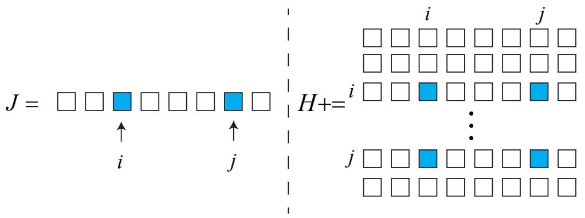

<details>
<summary>text_image</summary>

J = □ □ ■ □ □ □ ■ □
↑
i
j
H+=
i
j
...
□ □ □ □ □ □ □ □
□ □ □ □ □ □ □ □
□ □ ■ □ □ □ ■ □
⋮
□ □ ■ □ □ □ ■ □
□ □ □ □ □ □ □ □
</details>

图 10-3 当某个误差项 J 具有稀疏性时，它对 H 的贡献也具有稀疏形式。

以图 10-3 为例，我们设 $J _ { i j }$ 只在 $i , j$ 处有非零块，那么它对 H 的贡献为 $J _ { i j } ^ { T } J _ { i j }$ ，具有示意图上所画的稀疏形式。这个 $J _ { i j } ^ { T } J _ { i j }$ 矩阵也仅有四个非零块，位于 (i, i)，(i, j)，(j, i)，$( j , j )$ 。对于整体的 H，由于：

$$
\boldsymbol {H} = \sum_ {i, j} \boldsymbol {J} _ {i j} ^ {T} \boldsymbol {J} _ {i j}, \tag {10.52}
$$

请注意 i 在所有相机位姿中取值，j 在所有路标点中取值。我们把 H 进行分块：

$$
\boldsymbol {H} = \left[ \begin{array}{l l} \boldsymbol {H} _ {1 1} & \boldsymbol {H} _ {1 2} \\ \boldsymbol {H} _ {2 1} & \boldsymbol {H} _ {2 2} \end{array} \right]. \tag {10.53}
$$

这里 ${ \cal { H } } _ { 1 1 }$ 只和相机位姿有关，而 $H _ { 2 2 }$ 只和路标点有关。当我们遍历 $i , j$ 时，以下事实总是成立的：

1. 不管 $i , j$ 怎么变， ${ \cal { H } } _ { 1 1 }$ 都是对角阵，只在 $H _ { i , i }$ 处有非零块；  
2. 同理， $H _ { 2 2 }$ 也是对角阵，只在 $H _ { j , j }$ 处有非零块；

3. 对于 $H _ { 1 2 }$ 和 $H _ { 2 1 }$ ，它们可能是稀疏的，也可能是稠密的，视具体的观测数据而定。

这显示了 H 的稀疏结构。之后对线性方程的求解中，也正需要利用它的稀疏结构。也许读者还没有很好地领会这里的意思，我们举一个实例来直观说明它的情况。假设一个场景内有 2 个相机位姿 $( C _ { 1 } , C _ { 2 } )$ 和 6 个路标 $( P _ { 1 } , P _ { 2 } , P _ { 3 } , P _ { 4 } , P _ { 5 } , P _ { 6 } )$ 。这些相机和点云所对应的变量为 $\xi _ { i } , i = 1 , 2$ 以及 $p _ { j } , j = 1 , \ldots , 6 ,$ 。相机 $C _ { 1 }$ 观测到路标 $P _ { 1 } , P _ { 2 } , P _ { 3 } , P _ { 4 }$ ，相机 $C _ { 2 }$ 观测到了路标 $P _ { 3 } , P _ { 4 } , P _ { 5 } , P _ { 6 }$ 。我们把这个过程画成示意图 10-4 。相机和路标以圆形节点表示。如果 i 相机能够观测到 $j$ 点云，我们就在它们对应的节点连上一条边。

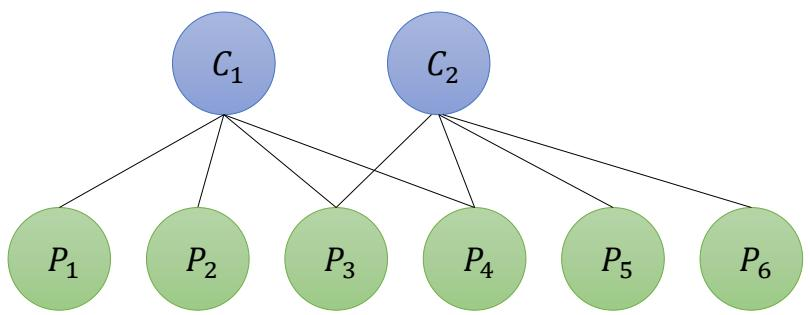

<details>
<summary>flowchart</summary>

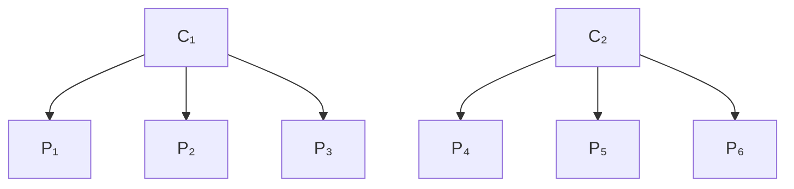
```mermaid
graph TD
  C1["C₁"] --> P1["P₁"]
  C1["C₁"] --> P2["P₂"]
  C1["C₁"] --> P3["P₃"]
  C2["C₂"] --> P4["P₄"]
  C2["C₂"] --> P5["P₅"]
  C2["C₂"] --> P6["P₆"]
```
</details>

图 10-4 点和边组成的示意图。该图显示相机 $C _ { 1 }$ 观测到了路标点 $P _ { 1 } , P _ { 2 } , P _ { 3 } , P _ { 4 }$ ，相机$C _ { 2 }$ 看到了 $P _ { 3 }$ 到 $P _ { 6 }$ 。

可以推出该场景下的 BA 目标函数应该是：

$$
\frac {1}{2} \left(\| \boldsymbol {e} _ {1 1} \| ^ {2} + \| \boldsymbol {e} _ {1 2} \| ^ {2} + \| \boldsymbol {e} _ {1 3} \| ^ {2} + \| \boldsymbol {e} _ {1 4} \| ^ {2} + \| \boldsymbol {e} _ {2 3} \| ^ {2} + \| \boldsymbol {e} _ {2 4} \| ^ {2} + \| \boldsymbol {e} _ {2 5} \| ^ {2} + \| \boldsymbol {e} _ {2 6} \| ^ {2}\right). \tag {10.54}
$$

这里的 $e _ { i j }$ 使用之前定义过的代价函数，即式（10.42）。以 $e _ { 1 1 }$ 为例，它描述了在$C _ { 1 }$ 看到了 $P _ { 1 }$ 这件事，与其他的相机位姿和路标无关。令 $J _ { 1 1 }$ 为 $e _ { 1 1 }$ 所对应的雅可比矩阵，不难看出 $e _ { 1 1 }$ 对相机变量 $\xi _ { 2 }$ 和路标点 $p _ { 2 } , \ldots , p _ { 6 }$ 的偏导都为 0。我们把所有变量以$\pmb { x } = \left( \pmb { \xi } _ { 1 } , \pmb { \xi } _ { 2 } , \pmb { p } _ { 1 } , \dots , \pmb { p } _ { 2 } \right) ^ { T }$ 的顺序摆放，则有：

$$
\boldsymbol {J} _ {1 1} = \frac {\partial \boldsymbol {e} _ {1 1}}{\partial \boldsymbol {x}} = \left(\frac {\partial \boldsymbol {e} _ {1 1}}{\partial \boldsymbol {\xi} _ {1}}, \mathbf {0} _ {2 \times 6}, \frac {\partial \boldsymbol {e} _ {1 1}}{\partial \boldsymbol {p} _ {1}}, \mathbf {0} _ {2 \times 3}, \mathbf {0} _ {2 \times 3}, \mathbf {0} _ {2 \times 3}, \mathbf {0} _ {2 \times 3}, \mathbf {0} _ {2 \times 3}\right). \tag {10.55}
$$

为了方便表示稀疏性，我们用带有颜色的方块表示矩阵在该方块内有数值，其余没有颜色的区域表示矩阵在该处数值都为 0。那么上面的 $J _ { 1 { \cdot } }$ 则可以表示成图 10-5 的图案。同理，其他的雅可比矩阵也会有类似的稀疏图案。

$$
J _ {1 1} = \left[ \begin{array}{c c c c c c c c} C _ {1} & C _ {2} & P _ {1} & P _ {2} & P _ {3} & P _ {4} & P _ {5} & P _ {6} \\ \framebox {\text {blue}} & & \framebox {\text {blue}} & & & & & \end{array} \right]
$$

图 10-5 $J _ { 1 1 }$ 矩阵的非零块分布图。上方的标记表示矩阵该列所对应的变量。由于相机参数维数比点云参数维数要大，所以 $C _ { 1 }$ 对应的矩阵块要比 $P _ { 1 }$ 对应的矩阵块要宽一些。

为了得到该目标函数对应的雅可比矩阵，我们可以将这些 $J _ { i j }$ 按照一定顺序列为向量，那么整体雅可比矩阵以及相应的 H 矩阵的稀疏情况就是图 10-6 中所展示的那样。

$$
J = \left[ \begin{array}{c} J _ {1 1} \\ J _ {1 2} \\ J _ {1 3} \\ J _ {1 4} \\ J _ {2 3} \\ J _ {2 4} \\ J _ {2 5} \\ J _ {2 6} \end{array} \right] = \left[ \begin{array}{c c c c c c c c c} C _ {1} & C _ {2} & P _ {1} & P _ {2} & P _ {3} & P _ {4} & P _ {5} & P _ {6} \\ \framebox {\text {   }} & & \framebox {\text {   }} & & & & & \\ \framebox {\text {   }} & & & & \framebox {\text {   }} & & & \\ \framebox {\text {   }} & & & & & \framebox {\text {   }} & & \\ & \framebox {\text {   }} & & & & \framebox {\text {   }} & & \\ & \framebox {\text {   }} & & & & & \framebox {\text {   }} & \\ & \framebox {\text {   }} & & & & & & \framebox {\text {   }} \end{array} \right]
$$

$$
H = J ^ {T} J = \left[ \begin{array}{c c c c c c c c} \square & & \square & \square & \square & \square & \\ & \square & & & \square & \square & \square \\ \square & & \square & & \\ \square & & & \square & & \\ \square & \square & & & \square & \\ \square & \square & & & & \square \\ & \square & & & & \square \\ & \square & & & & \end{array} \right]
$$

图 10-6 Jacobian 矩阵的稀疏性 (左) 和 H 矩阵的稀疏性 (右)，蓝色的方块表示矩阵在对应的矩阵块处有数值，其余没有颜色的部分表示矩阵在该处的数值始终为 0。

也许你已经注意到了，图 10-4 对应的邻接矩阵（Adjacency Matrix）①和上图中的 H矩阵，除了对角元素以外的其余部分有着完全一致的结构。事实上的确如此。上面的 H 矩阵一共有 $8 \times 8$ 个矩阵块，对于 H 矩阵当中处于非对角线的矩阵块来说，如果该矩阵块非零，则其位置所对应的变量之间会在图中存在一条边，我们可以从图 10-7 中清晰地看到这一点。所以，H 矩阵当中的非对角部分的非零矩阵块可以理解为它对应的两个变量之间存在联系，或者可以称之为约束。于是，我们发现图优化结构与增量方程的稀疏性存在着明显的联系。

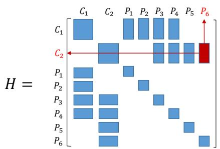

<details>
<summary>heatmap</summary>

| | C1 | C2 | P1 | P2 | P3 | P4 | P5 | P6 |
|---|---|---|---|---|---|---|---|---|
| C1 | 1 | 0 | 0 | 0 | 0 | 0 | 0 | 0 |
| C2 | 0 | 1 | 0 | 0 | 0 | 0 | 0 | 1 |
| P1 | 0 | 0 | 1 | 0 | 0 | 0 | 0 | 0 |
| P2 | 0 | 0 | 0 | 1 | 0 | 0 | 0 | 0 |
| P3 | 0 | 1 | 0 | 0 | 1 | 0 | 0 | 0 |
| P4 | 0 | 1 | 0 | 0 | 1 | 1 | 0 | 0 |
| P5 | 0 | 1 | 0 | 0 | 0 | 0 | 1 | 0 |
| P6 | 0 | 1 | 0 | 0 | 0 | 0 | 1 | 1 |
The image displays a heatmap with a red arrow pointing to the right edge of the cell. The text 'H =' appears below the image.
</details>

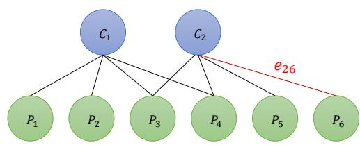

<details>
<summary>flowchart</summary>

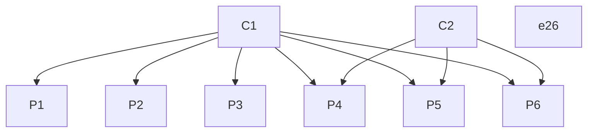
```mermaid
graph TD
  C1["C1"] --> P1["P1"]
  C1["C1"] --> P2["P2"]
  C1["C1"] --> P3["P3"]
  C1["C1"] --> P4["P4"]
  C1["C1"] --> P5["P5"]
  C1["C1"] --> P6["P6"]
  C2["C2"] --> P4["P4"]
  C2["C2"] --> P5["P5"]
  C2["C2"] --> P6["P6"]
    e26["e26"]
```
</details>

图 10-7 H 矩阵中非零矩阵块和图中边的对应关系。如左图当中的 H 矩阵当中红色的矩阵块，表示在右图中其对应的变量 $C _ { 2 }$ 和 $P _ { 6 }$ 之间存在一条边 $e _ { 2 6 }$ 。

现在考虑更一般的情况，假如我们有 m 个相机位姿，n 个路标点。由于通常路标数量远远会比相机多，于是有 $n \gg m .$ 。由上面推理可知，实际当中的 H 矩阵会像图 10-8 所示的那样。它的左上角块显得非常小，而右下角的对角块占据了大量地方。除此之外，非对角部分则分布着散乱的观测数据。由于它的形状很像箭头，又称为箭头形（Arrow-like）矩阵 [6]。同时它又很像一把镐子，所以也叫镐形矩阵①。

对于具有这种稀疏结构的 H，线性方程 $\pmb { H } \Delta \pmb { x } = \pmb { g }$ 的求解会有什么不同呢？现实当中存在着若干种利用 H 的稀疏性加速计算的方法，而本节介绍视觉 SLAM 里一种最常用的手段：Schur 消元 (Schur trick)。在 SLAM 研究中亦称为 Marginalization（边缘化）。

仔细观察一下图 10-8 ，我们不难发现这个矩阵可以分成 4 个块，和式（10.53）一致。左上角为对角块矩阵，每个对角块元素的维度与相机位姿的维度相等，且是一个对角块矩阵。右下角也是对角块矩阵，每个对角块的维度是路标的维度。非对角块的结构与具体观测数据相关。我们首先将这个矩阵按照图10-9中所示的方式来划分区域，读者不难发现，这四个区域正是对应了公式 (10.50) 中的四个矩阵块。为了后续分析地方便，我们称这四个块为 B，E，C。

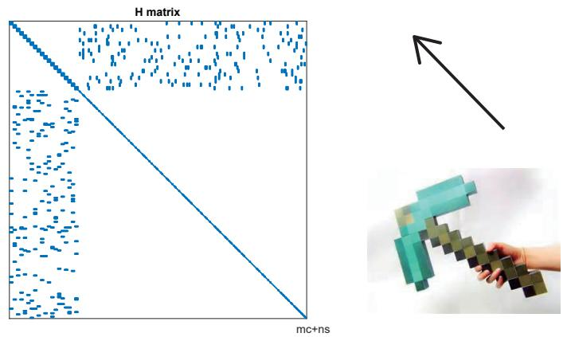

<details>
<summary>text_image</summary>

H matrix
mc+ns
</details>

图 10-8 一般情况下的 H 矩阵。

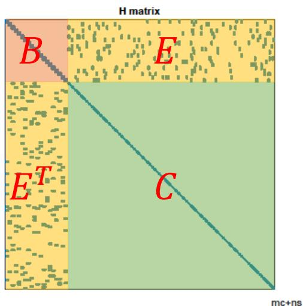

<details>
<summary>text_image</summary>

H matrix
B	E
E^T	C
mc+ns
</details>

图 10-9 H 矩阵的区域划分。

于是，对应的线性方程组也可以由 $\pmb { H } \pmb { \Delta x } = \pmb { g }$ 变为如下形式：

$$
\left[ \begin{array}{l l} \boldsymbol {B} & \boldsymbol {E} \\ \boldsymbol {E} ^ {\boldsymbol {T}} & \boldsymbol {C} \end{array} \right] \left[ \begin{array}{l} \Delta \boldsymbol {x} _ {c c} \\ \Delta \boldsymbol {x} _ {p} \end{array} \right] = \left[ \begin{array}{l} \boldsymbol {v} \\ \boldsymbol {w} \end{array} \right]. \tag {10.56}
$$

其中 B 是对角块矩阵，每个对角块的维度和相机参数的维度相同，对角块的个数是相机变量的个数。由于路标数量会远远大于相机变量个数，所以 C 往往也远大于 B。三维空间中每个路标点为三维，于是 C 矩阵为对角块矩阵，每个块为 3×3 维矩阵。对角块矩阵逆的难度远小于对一般矩阵的求逆难度，因为我们只需要对那些对角线矩阵块分别求逆即可。考虑到这个特性，我们线性方程组进行高斯消元，目标是消去右上角的非对角部分 E，得：

$$
\left[ \begin{array}{c c} \boldsymbol {I} & - \boldsymbol {E C} ^ {- 1} \\ \boldsymbol {0} & \boldsymbol {I} \end{array} \right] \left[ \begin{array}{c c} \boldsymbol {B} & \boldsymbol {E} \\ \boldsymbol {E ^ {T}} & \boldsymbol {C} \end{array} \right] \left[ \begin{array}{l} \Delta \boldsymbol {x} _ {c c} \\ \Delta \boldsymbol {x} _ {p c c} \end{array} \right] = \left[ \begin{array}{c c} \boldsymbol {I} & - \boldsymbol {E C} ^ {- 1} \\ \boldsymbol {0} & \boldsymbol {I} \end{array} \right] \left[ \begin{array}{l} \boldsymbol {v} \\ \boldsymbol {w} \end{array} \right]. \tag {10.57}
$$

整理，得：

$$
\left[ \begin{array}{c c} \boldsymbol {B} - \boldsymbol {E} \boldsymbol {C} ^ {- 1} \boldsymbol {E} ^ {T} & \boldsymbol {0} \\ \boldsymbol {E} ^ {T} & \boldsymbol {C} \end{array} \right] \left[ \begin{array}{l} \Delta \boldsymbol {x} _ {c c} \\ \Delta \boldsymbol {x} _ {p c c} \end{array} \right] = \left[ \begin{array}{l} \boldsymbol {v} - \boldsymbol {E} \boldsymbol {C} ^ {- 1} \boldsymbol {w} \\ \boldsymbol {w} \end{array} \right]. \tag {10.58}
$$

经过消元之后，第一行方程组变成和 $\Delta \pmb { x } _ { p }$ 无关的项。单独把它拿出来，得到关于位姿部分的增量方程：

$$
\left[ \boldsymbol {B} - \boldsymbol {E} \boldsymbol {C} ^ {- 1} \boldsymbol {E} ^ {T} \right] \Delta \boldsymbol {x} _ {c} = \boldsymbol {v} - \boldsymbol {E} \boldsymbol {C} ^ {- 1} \boldsymbol {w}. \tag {10.59}
$$

这个线性方程组的维度和 B 矩阵一样。我们的做法是先求解这个方程，然后把解得的 $\Delta { \pmb x } _ { c }$ 代入到原方程，然后求解 $\Delta \pmb { x } _ { p }$ 。这个过程称为 Marginalization[68]，或者 Schur消元 (Schur Elimination)。相比于直接解线性方程的做法，它的优势在于：

1. 在消元过程中，由于 C 为对角块，所以 $C ^ { - 1 }$ 容易解得。  
2. 求解了 $\Delta { \pmb x } _ { c }$ 之后，路标部分的增量方程由 $\Delta \pmb { x } _ { p } = \pmb { C } ^ { - 1 } ( \pmb { w } - \pmb { E } ^ { T } \Delta \pmb { x } _ { c } )$ 给出。这依然用到了 $C ^ { - 1 }$ 易于求解的特性。

于是，边缘化的主要的计算量在于求解式（10.59）。关于这个方程，我们能说的就不多了。它仅是一个普通的线性方程，没有特殊的结构可以利用。我们将此方程的系数记为S，它的稀疏性如何呢？图（10-10）显示了进行 Schur 消元之后的一个 S 实例，可以看到它的稀疏性是不规则的。

前面说到，H 矩阵的非对角块处的非零元素对应着相机和路标的关联。那么，进行了Schur 消元后 S 的稀疏性是否具有物理意义呢？答案是有的。此处我们不加以证明地说，S 矩阵的非对角线上的非零矩阵块，表示了该处对应的两个相机变量之间存在着共同观测的路标点，有时候称为共视（Co-visibility）。反之，如果该块为零，则表示这两个相机没有共同观测。例如图 10-10 所示的稀疏矩阵，左上角前 $4 \times 4$ 个矩阵块可以表示对应的相机变量 $C _ { 1 } , C _ { 2 } , C _ { 3 } , C _ { 4 }$ 之间有共同观测。

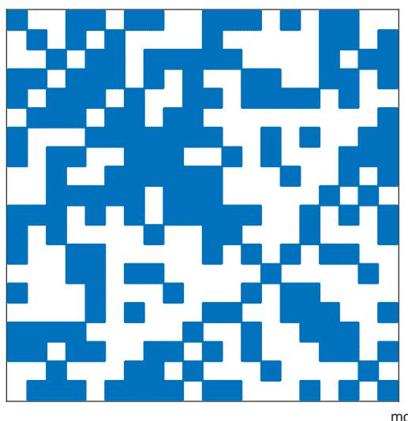

<details>
<summary>natural_image</summary>

Abstract blue pixelated pattern on white background (no text or symbols)
</details>

图 10-10 对 H 矩阵进行 Schur 消元后 S 矩阵的稀疏状态。

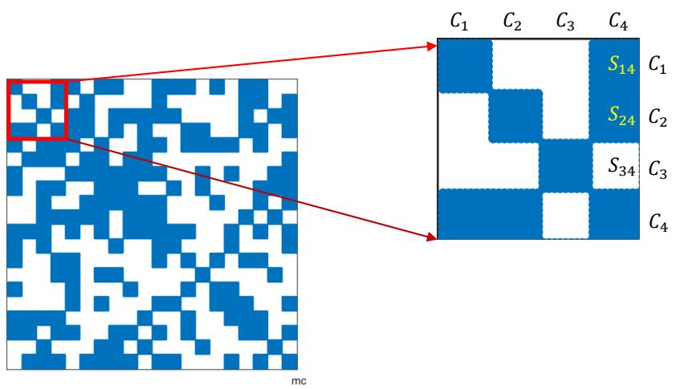

<details>
<summary>text_image</summary>

C₁ C₂ C₃ C₄
S₁₄ C₁
S₂₄ C₂
S₃₄ C₃
C₄
mc
</details>

图 10-11 以 S 矩阵中前 $4 \times 4$ 个矩阵块为例，这区域当中的矩阵块 $S _ { 1 4 } , S _ { 2 4 }$ 不为零，表示相机 $C _ { 4 }$ 和相机 $C _ { 1 }$ 和 $C _ { 2 }$ 之间有共同观测的点。而 $S _ { 3 4 }$ 为零则表示 $C _ { 3 }$ 和 $C _ { 4 }$ 之间没有共同观测的路标。

于是，S 矩阵的稀疏性结构当取决于实际观测的结果，我们无法提前预知。在实践当中，例如 ORB\_SLAM[73] 中的 Local Mapping 环节，在做 BA 的时候刻意选择那些具有共同观测的帧作为关键帧，在这种情况下 Schur 消元后得到的 S 就是稠密矩阵。不过，由于这个模块并不是实时执行，所以这种做法也是可以接受的。但是在另一些方法里面，例如 DSO[58]，OKVIS[74] 等，它们采用了滑动窗口方法（Sliding Window）。这类方法对每一帧都要求做一次 BA 来防止误差的累积，因此它们也必须采用一些技巧来保持 S 矩阵的稀疏性。读者如果希望能够更加深入这一块，可以参考它们的论文。我们这里就不谈这些过于细节的事情了。

从概率角度来看，我们称这一步为边缘化，是因为我们实际上把求 $( \Delta \pmb { x } _ { c } , \Delta \pmb { x } _ { p } )$ 的 问题，转化成先求 $\Delta { \pmb x } _ { c }$ ，再求 $\Delta \pmb { x } _ { p }$ 的过程。这一步相当于做了条件概率展开：

$$
P (\boldsymbol {x} _ {c}, \boldsymbol {x} _ {p}) = P (\boldsymbol {x} _ {c}) \cdot P (\boldsymbol {x} _ {p} | \boldsymbol {x} _ {c}). \tag {10.60}
$$

结果是求出了关于 $\mathbf { \delta _ { x } } _ { c }$ 的边缘分布，故称边缘化。在上边讲的边缘化过程中，我们实际把所有的路标点都给边缘化了。根据实际情况，我们也能选择一部分进行边缘化。同时，Schur 消元只是实现边缘化的其中一种方式，同样可以使用 Cholesky 分解进行边缘化。

读者可能会继续问，在进行了 Schur 消元后，我们还需要求解线性方程组 (10.59)。对它的求解是否还有什么技巧呢？很遗憾地说，这部分就属于传统的矩阵数值求解的部分了，通常是用分解来计算的。不管采用哪种求解办法，我们都建议利用 H 的稀疏性进行 Schur消元。不光是因为这样可以提高速度，也同时是因为消元后的 S 矩阵的条件数往往比之前的 H 矩阵的条件数要小。Schur 消元也并不是意味将所有路标消元，将相机变量消元也是SLAM 当中采用的手段。

## 10.2.4 鲁棒核函数

在前面的 BA 问题中，我们最小化误差项的二范数平方和，作为目标函数。这种做法虽然很直观，但存在一个严重的问题：如果出于误匹配等原因，某个误差项给的数据是错误的，会发生什么呢？我们把一条原本不应该加到图中的边给加进去了，然而优化算法并不能辨别出这是个错误数据，它会把所有的数据都当作误差来处理。这时，算法会看到一条误差很大的边，它的梯度也很大，意味着调整与它相关的变量会使目标函数下降更多。所以，算法将试图调整这条边所连接的节点的估计值，使它们顺应这条边的无理要求。由于这个边的误差真的很大，往往会抹平了其他正确边的影响，使优化算法专注于调整一个错误的值。这显然不是我们希望看到的。

出现这种问题的原因是，当误差很大时，二范数增长得太快了。于是就有了核函数的存在。核函数保证每条边的误差不会大的没边，掩盖掉其他的边。具体的方式是，把原先误差的二范数度量，替换成一个增长没有那么快的函数，同时保证自己的光滑性质（不然没法求导啊！）。因为它们使得整个优化结果更为鲁棒，所以又叫它们为鲁棒核函数（RobustKernel）。

鲁棒核函数有许多种，例如最常用的 Huber 核：

$$
H (e) = \left\{ \begin{array}{l l} \frac {1}{2} e ^ {2} & \text { if   } | e | \leq \delta , \\ \delta \left(| e | - \frac {1}{2} \delta\right) & \text { otherwise. } \end{array} \right. \tag {10.61}
$$

我们看到，当误差 e 大于某个阈值 δ 后，函数增长由二次形式变成了一次形式，相当于限制了梯度的最大值。同时，Huber 核函数又是光滑的，可以很方便地求导。图 10-12 显示了 Huber 核函数与二次函数的对比，可见在误差较大时 Huber 核函数增长明显低于二次函数。

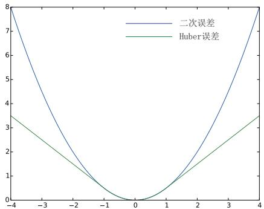

<details>
<summary>line chart</summary>

| x   | 二次误差 | Huber误差 |
| --- | ------- | --------- |
| -4  | 8       | 3.5       |
| -3  | 6       | 2.5       |
| -2  | 4       | 1.5       |
| -1  | 2       | 0.5       |
| 0   | 0       | 0         |
| 1   | 2       | 1.5       |
| 2   | 4       | 2.5       |
| 3   | 6       | 3.5       |
| 4   | 8       | 3.5       |
</details>

图 10-12 Huber 核函数。

除了 Huber 核之外，还有 Cauchy 核，Tukey 核等等，读者可以看看 $\mathrm { g 2 o }$ 和 Ceres 都提供了哪些核函数。

## 10.2.5 小结

本节我们重点介绍了 BA 中的稀疏性问题。不过，实践当中，有许多软件库为我们提供了细节操作，而我们需要做的主要是构造 Bundle Adjustment 问题，设置 Schur 消元，然后调用稠密或者稀疏矩阵求解器对变量进行优化即可。如果读者希望更深入地了解 BA，可以在阅读完本章节的基础上，进一步参考 [26] 学习。

下面的两个小节，我们将使用 $\mathrm { g 2 o }$ 和 Ceres 两个库来做 Bundle Adjustment。为了体现出它们的区别，我们会让这个程序共用很多代码。共用的代码主要都在 common 文件夹下，其他的文件则不同。我们将使用公开的数据库 [75] 当中的文件来进行编程练习。

## 10.3 实践： $\mathbf { \dot { g } 2 0 }$

## 10.3.1 BA 数据集

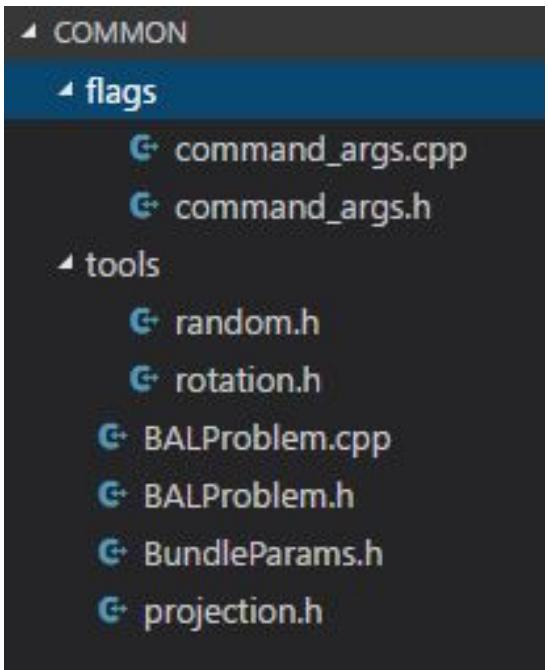

<details>
<summary>text_image</summary>

COMMON
flags
  command_args.cpp
  command_args.h
tools
  random.h
  rotation.h
  BALProblem.cpp
  BALProblem.h
  BundleParams.h
  projection.h
</details>

图 10-13 common 文件夹目录结构。

在本讲代码目录下的 common 文件夹是两个实验共有的数据集部分。它的布局如图 10-13 所示。其中，flags 文件夹下的两个文件定义了 CommandArgs 这个类，该类是用来解析用户输入的参数，同时也对程序需要的参数提供默认值以及文档说明。BundleParams这个类定义了 Bundle Adjustment 使用的所有参数，也调用了 CommandArgs 类型的变量。由于 CommandArgs 这个类的存在，我们可以直接对程序后面使用 -help 来查看程序所有的参数含义，使用的方式可以参考该程序中 BundleParams 类型的写法。

tools 是一些数学工具函数，读者可自行查看。我们的相机和路标参数和前面提到的代价函数，即式（10.42）保持一致，不过在实验中我们要把相机内参也当作优化变量考虑进行。我们用 $f , k _ { 1 } , k _ { 2 }$ 来表示焦距和畸变，三个参数表示平移，三个参数表示旋转（于是相机一共 9 个未知量），路标也使用三维坐标来表示。projection.h 是前面提到的投影计算流程图 10-2 的代码实现。由于 $\mathrm { g 2 o }$ 和 ceres 都会用到这个投影模型，这个文件也将被两个工程所共享。

除此之外，BALProblem 这个类将保存我们的 Bundle Adjustment 所需要的所有数据，其中就包括了相机和路标之间的关联以及相机变量和路标变量的初始值，这些数据的原始信息都保存在 data 文件夹下的 txt 文件当中。我们可以打开 data/problem-16-22106-pre.txt 查看文件信息：

```txt
1 16 22106 83718
2 0 0 -3.859900e+02 3.871200e+02
3 1 0 -3.844000e+01 4.921200e+02
4 2 0 -6.679200e+02 1.231100e+02
5 7 0 -5.991800e+02 4.079300e+02
```

它的第一行记录了相机数量、路标数量和总的观测数量。从第二行起，分别记录第 i个相机观测第 j 个路标所看到的像素坐标。这就构成了一个 BA 问题，亦可看成由纯观测方程组成的 SLAM 问题。除此之外，BALProblem 也提供了将数据导出到 PLY 文件这样的功能，方便用户通过 Meshlab 软件查看点云的三维信息。

## 10.3.2 g2o 求解 BA

下面来考虑如何使用 g2o 求解这个 BA 问题。和以前一样，g2o 使用图模型来描述问题的结构，所以我们要用节点来表示相机和路标，然后用边来表示它们之间的观测。我们仍然使用自定义的点和边，只需覆盖一些关键函数即可。针对相机和路标，我们可以定义如下继承，使用 override 关键字来表示对基类虚函数的覆盖：

slambook/ch10/g2o\_custombundle/g2o\_bal\_class.h  
```cpp
#include "g2o/core/base_vertex.h"
#include "g2o/core/base_binary_edge.h"

#include <Eigen/Core>
#include "ceres/autodiff.h"

#include "tools/rotation.h"
#include "common/projection.h"

// 节点没什么好说的，直接把更新量看作向量求加法即可
class VertexCameraBAL : public g2o::BaseVertex<9, Eigen::VectorXd> {
public:
    EIGEN_MAKE_ALIGNED_OPERATOR_NEW;
    VertexCameraBAL() {}
    virtual bool read(std::istream& is) {return false;}
    virtual bool write ( std::ostream& os ) const {return false;}
    virtual void setToOriginImpl() {}
```

```cpp
virtual void oplusImpl(const double* update) override {
    Eigen::VectorXd::ConstMapType v(update, VertexCameraBAL::Dimension);
    _estimate += v;
}
class VertexPointBAL : public g2o::BaseVertex<3, Eigen::Vector3d>
{
public:
    EIGEN_MAKE_ALIGNED_OPERATOR_NEW;
    VertexPointBAL() {}
    virtual bool read( std::istream& is) {return false;}
    virtual bool write(std::ostream& os) const {return false;}
    virtual void setOriginImpl() {}
    virtual void oplusImpl(const double* update) override {
    Eigen::Vector3d::ConstMapType v(update);
    _estimate += v;
    }
};
```

定义了节点以后，也还需要定义边来表示节点之间的联系。每一条边都对应了一个代价函数 (10.42)，同时为了避免复杂的求导运算，我们借助 ceres 库当中的 Autodiff(即自动求导) 功能。该功能需要类型将需要求导的公式实现在括号运算符 operator() 里，所以我们的代码写成如下的样子：

slambook/ch10/g2o\_custombundle/g2o\_bal\_class.h  
```cpp
class EdgeObservationBAL : public g2o::BaseBinaryEdge<2, Eigen::Vector2d,VertexCameraBAL, VertexPointBAL> {
public:
    EIGEN_MAKE_ALIGNED_OPERATOR_NEW;
    EdgeObservationBAL() {}
    virtual bool read(std::istream& /*is*/){ return false;}
    virtual bool write(std::ostream& /*os*/)const { return false;}
    virtual void computeError() override // 覆盖基类函数，使用 operator() 计算代价函数
    {
    const VertexCameraBAL* cam = static_cast<const VertexCameraBAL*>(vertex(0));
    const VertexPointBAL* point = static_cast<const VertexPointBAL*>(vertex(1));
    (*this)(cam->estimate().data(), point->estimate().data(), _error.data());
    }

    // 为了使用 Ceres 求导功能而定义的函数，让本类成为拟函数类
    template<typename T>
    bool operator()( const T* camera, const T* point, T* residuals )const
```

```cpp
{
    T predictions[2];
    CamProjectionWithDistortion(camera, point, predictions);
    residuals[0] = predictions[0] - T(measurement()(0));
    residuals[1] = predictions[1] - T(measurement()(1));
    return true;
}

virtual void linearizeOplus() override
{
    const VertexCameraBAL* cam = static_cast<const VertexCameraBAL*>(vertex(0));
    const VertexPointBAL* point = static_cast<const VertexPointBAL*>(vertex(1));
    typedef ceres::internal::AutoDiff<EdgeObservationBAL, double, VertexCameraBAL::Dimension, VertexPointBAL::Dimension> BalAutoDiff;

    Eigen::Matrix<double, Dimension, VertexCameraBAL::Dimension, Eigen::RowMajor> dError_dCamera;
    Eigen::Matrix<double, Dimension, VertexPointBAL::Dimension, Eigen::RowMajor> dError_dPoint;
    double *parameters[] = { const_cast<double*>(cam->estimate().data()), const_cast<double*>(point->estimate().data()) };
    double *jacobians[] = { dError_dCamera.data(), dError_dPoint.data() };
    double value[Dimension];

    // Ceres 中的自动求导函数用法，需要提供 operator() 函数成员
    bool diffState = BalAutoDiff::Differentiate(*this, parameters, Dimension, value, jacobians);

    // copy over the Jacobians (convert row-major -> column-major)
    if (diffState) {
    _jacobianOplusXi = dError_dCamera;
    _jacobianOplusXj = dError_dPoint;
    } else {
    assert(0 && "Error while differentiating");
    _jacobianOplusXi.setZero();
    _jacobianOplusXi.setZero();
    }
}
```

以上定义了本问题中使用的节点和边。下面我们就需要根据 BALProblem 类当中的实际数据来生成一些节点和边，交给 g2o 进行优化。值得注意的是，为了充分利用 BA 中的稀疏性，需要在这里将路标中的 setMarginalized 属性设置为 true。下面是代码的主要片段：

slambook/ch10/g2o\_custombundle/g2o\_bundle.cpp（片段）  
```cpp
void BuildProblem(const BALProblem* bal_problem, g2o::SparseOptimizer* optimizer, const BundleParams&params)
{
    const int num_points = bal_problem->num_points();
    const int num_cameras = bal_problem->num_cameras();
```

```cpp
const int camera_block_size = bal_problem->camera_block_size();
const int point_block_size = bal_problem->point_block_size();

// 添加相机和对应的初始值.
const double* raw_cameras = bal_problem->cameras();
for(int i = 0; i < num_cameras; ++i)
{
    ConstVectorRef temVecCamera(raw_cameras + camera_block_size * i, camera_block_size);
    VertexCameraBAL* pCamera = new VertexCameraBAL();
    pCamera->setEstimate(temVecCamera); // 初始值
    pCamera->setId(i);
    optimizer->addVertex(pCamera);
}

// Set point vertex with initial value in the dataset.
const double* raw_points = bal_problem->points();
// const int point_block_size = bal_problem->point_block_size();
for(int j = 0; j < num_points; ++j)
{
    ConstVectorRef temVecPoint(raw_points + point_block_size * j, point_block_size);
    VertexPointBAL* pPoint = new VertexPointBAL();
    pPoint->setEstimate(temVecPoint); // 点云的初始值
    pPoint->setId(j + num_cameras); // 为了不和相机冲突，加上相机的 id

    // 设置该点在解方程时进行 Schur 消元。
    pPoint->setMarginalized(true);
    optimizer->addVertex(pPoint);
}

// 为图添加边
const int num_observations = bal_problem->num_observations();
const double* observations = bal_problem->observations();

for(int i = 0; i < num_observations; ++i)
{
    EdgeObservationBAL* bal_edge = new EdgeObservationBAL();
    const int camera_id = bal_problem->camera_index()[i]; // 使用前面的 id 获取相机
    const int point_id = bal_problem->point_index()[i] + num_cameras; // 使用前面的 id 获得点
    // Huber loss 函数（默认为不用设置）
    if(params.robustify)
    {
    g2o::RobustKernelHuber* rk = new g2o::RobustKernelHuber;
    rk->setDelta(1.0);
    bal_edge->setRobustKernel(rk);
    }
    // 设置边所对应的两个节点
    bal_edge->setVertex(0, dynamic_cast<VertexCameraBAL*>(optimizer->vertex(camera_id)));
    bal_edge->setVertex(1, dynamic_cast<VertexPointBAL*>(optimizer->vertex(point_id)));
    // 设置其协方差矩阵(在此处为单位矩阵)
    bal_edge->setInformation(Eigen::Matrix2d::Identity());
```

```cpp
// 设置边所对应的观测值
bal_edge->setMeasurement(Eigen::Vector2d(observations[2*i+0], observations[2*i + 1]));
optimizer->addEdge(bal_edge);
}
```

## 10.3.3 求解

在使用 g2o 时，求解的设置无非在于这几种：1. 使用何种方法（LM, DogLeg）等来定义非线性优化的下降策略；2. 使用哪类线性求解器。注意到这里需要使用到稀疏性，所以必须选用稀疏的求解器。

slambook/ch10/g2o\_custombundle/g2o\_bundle.cpp（片段）  
```cpp
typedef g2o::BlockSolver<g2o::BlockSolverTraits<9,3> > BalBlockSolver;

void SetSolverOptionsFromFlags(BALProblem* bal_problem, const BundleParams& params, g2o::SparseOptimizer* optimizer)
{
    BalBlockSolver* solver_ptr;

    g2o::LinearSolver<BalBlockSolver::PoseMatrixType>* linearSolver = 0;

    // 使用稠密计算方法
    if (params.linear_solver == "dense_schur") {
    linearSolver = new g2o::LinearSolverDense<BalBlockSolver::PoseMatrixType>();
    }
    // 使用稀疏计算方法
    else if (params.linear_solver == "sparse_schur") {
    linearSolver = new g2o::LinearSolverCholmod<BalBlockSolver::PoseMatrixType>();
    // 让 solver 对矩阵进行排序保持稀疏性
    dynamic_cast<g2o::LinearSolverCholmod<BalBlockSolver::PoseMatrixType>* >(linearSolver) ->
    setBlockOrdering(true);
    }

    solver_ptr = new BalBlockSolver(linearSolver);

    g2o::OptimizationAlgorithmWithHessian* solver;
    if (params.trust_region_strategy == "levenberg_marquardt") {
    solver = new g2o::OptimizationAlgorithmLevenberg(solver_ptr); // 使用 LM 下降法
    }
    else if (params.trust_region_strategy == "dogleg") {
    solver = new g2o::OptimizationAlgorithmDogleg(solver_ptr); // 使用 DogLeg 下降法
    }
    else
```

```cpp
{
    std::cout << "Please check your trust_region_strategy parameter again.."<< std::endl;
    exit(EXIT_FAILURE);
}

optimizer->setAlgorithm(solver);
}
```

现在问题基本上搭建好了。我们通过 BuildProblem 函数完成了对目标函数的构造，也通过 SetSolverOptionsFromFlags 函数通过用户的输入参数来设置优化求解。剩下需要做的就是思考该如何求解这个问题了。有了 $\mathrm { g 2 o }$ 这样的优化库，求解基本上可以一步完成，这点跟前面介绍的 g2o 用法几乎是一样的：

slambook/ch10/g2o\_custombundle/g2o\_bundle.cpp（片段）  
```javascript
1 optimizer.initializeOptimization();  
2 optimizer.setVerbose(true);  
3 optimizer.optimize(params.num_iterations);
```

使用 Meshlab 分别打开 g2o 执行文件夹下的 initial.ply 和 final.ply 两个文件，优化前后的效果如图 10-14 所示。

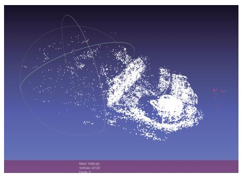

<details>
<summary>text_image</summary>

Mesh initial py
surface 20.32
</details>

初始值

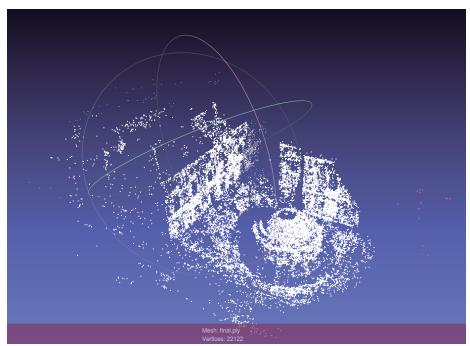

<details>
<summary>natural_image</summary>

Abstract digital artwork with a globe and orbiting lines, no visible text or symbols
</details>

优化值  
图 10-14 $\mathrm { g 2 o }$ 优化结果。左侧为优化前初始值，右侧为优化后。

由于 g2o 库本身公开 API 说明也少，我们通常只能通过网上的一些开源项目和它本身的源代码来了解它。我们这里需要提醒读者的是，g2o 在做 Bundle Adjust-ment 的优化时必须要将其所有点云全部 Schur 掉，否则会出错！其原因在于我们使用了g2o::LinearSolver<BalBlockSolver::PoseMatrixType> 这个类型来指定 linearsolver，其中模板参数当中的 PoseMatrixType 在程序中为相机姿态参数的维度，那么 Bundle Adjust-ment 当中 Schur 消元后解的线性方程组必须时只含有相机姿态变量①。

Ceres 库则没有 g2o 这样的限制。Ceres 给了开发者很大的空间去操作自己的优化策略，它在 Schur 消元操作时，完全不需要把所有点云都消元掉，用户可以自己编写函数选择消元哪些点云。接下来我们也会给出 Ceres 的 BA 示例。

## 10.4 实践：Ceres

现在我们再来看看换成 Ceres 来实现同样的效果该如何来做。就如前面介绍的那样，ceres 是针对一般优化问题产生的库，因此它并没有像 g2o 那样提供一些 Vertex 或者 Edge这类友好的接口。不过这也给 Ceres 带来极大的灵活性。我们接下来可以看到，Ceres 可以在原始数组上进行直接的优化操作，而 g2o 通过复制的手段将数据通过 Vertex 或者 Edge结构复制到 optimizer 里面。相比之下，Ceres 对“优化”显得更贴近一些。

## 10.4.1 Ceres 求解 BA

g2o 用 Edges 来保存每一个代价函数，但 Ceres 却是用 Problem 类型来构建最终的目标函数。和我们在第六讲介绍的一致。我们使用 AddResidualBlock 来添加代价函数，最后组成整个目标函数。为了简化整个过程，我们首先定义代价函数类型，并且定义 Create成员来使用 Ceres 当中的 AutoDiff 特性：

slambook/ch10/ceres\_custombundle/SnavelyReprojectionError.h  
```cpp
class SnavelyReprojectionError
{
public:
    SnavelyReprojectionError(double observation_x, double observation_y):observed_x(observation_x),
    observed_y(observation_y) {}
template<typename T>
bool operator()(const T* const camera, const T* const point, T* residuals)const
{
    // camera[0,1,2] are the angle-axis rotation
    T predictions[2];
    CamProjectionWithDistortion(camera, point, predictions);
    residuals[0] = predictions[0] - T(observed_x);
    residuals[1] = predictions[1] - T(observed_y);

    return true;
}
```

```cpp
static ceres::CostFunction* Create(const double observed_x, const double observed_y){
    return (new ceres::AutoDiffCostFunction<SnavelyReprojectionError,2,9,3>(
    new SnavelyReprojectionError(observed_x,observed_y)));
}

private:
    double observed_x;
    double observed_y;
};
```

定义好之后，我们就可以使用 SnavelyReprojectionError::Create 函数来轻松地构建这个目标函数：

slambook/ch10/ceres\_custombundle/ceresBundle.cpp（片段）  
```cpp
void BuildProblem(BALProblem* bal_problem, Problem* problem, const BundleParams& params)
{
    const int point_block_size = bal_problem->point_block_size();
    const int camera_block_size = bal_problem->camera_block_size();
    double* points = bal_problem->mutable_points();
    double* cameras = bal_problem->mutable_cameras();

    // Observations is 2 * num_observations long array observations
    // [u_1, u_2, ... u_n], where each u_i is two dimensional, the x
    // and y position of the observation.
    const double* observations = bal_problem->observations();

    for (int i = 0; i < bal_problem->num_observations(); ++i){
    CostFunction* cost_function;

    // Each Residual block takes a point and a camera as input
    // and outputs a 2 dimensional Residual

    cost_function = SnavelyReprojectionError::Create(observations[2*i + 0], observations[2*i + 1]);

    // If enabled use Huber's loss function.
    LossFunction* loss_function = params.robustify ? new HuberLoss(1.0) : NULL;

    // Each observatoin corresponds to a pair of a camera and a point
    // which are identified by camera_index()[i] and point_index()[i]
    // respectively.
    double* camera = cameras + camera_block_size * bal_problem->camera_index()[i];
    double* point = points + point_block_size * bal_problem->point_index()[i];

    problem->AddResidualBlock(cost_function, loss_function, camera, point);
}
```

值得一提的是，为了使用 Schur 消元，Ceres 采取的策略和 g2o 有很大的不同。Ceres采用额外的类型 ParameterBlockOrdering 来管理 schur 消元顺序，并且使用 AddElement-ToGroup 来对变量进行编号从而定义消元顺序。例如下面设置点云变量为 0，相机变量为1 就可以让点云变量先进行消元（优先消元编号最小的变量）：

slambook/ch10/ceres\_custombundle/ceresBundle.cpp  
```cpp
void SetOrdering(BALProblem* bal_problem, ceres::Solver::Options* options, const BundleParams& params)
{
    const int num_points = bal_problem->num_points();
    const int point_block_size = bal_problem->point_block_size();
    double* points = bal_problem->mutable_points();

    const int num_cameras = bal_problem->num_cameras();
    const int camera_block_size = bal_problem->camera_block_size();
    double* cameras = bal_problem->mutable_cameras();

    if (params.ordering == "automatic")
    return;

    ceres::ParameterBlockOrdering* ordering = new ceres::ParameterBlockOrdering;

    // The points come before the cameras
    for(int i = 0; i < num_points; ++i)
    ordering->AddElementToGroup(points + point_block_size * i, 0);

    for(int i = 0; i < num_cameras; ++i)
    ordering->AddElementToGroup(cameras + camera_block_size * i, 1);

    options->linear_solver_ordering.reset(ordering);
}
```

## 10.4.2 求解

Ceres 除了能够在原始数组上操作以外，另一大优势在于它的优化设置非常便捷。g2o的设置全靠变量类型来选择不同的下降策略，以及选择稠密或者稀疏的线性方程组解法，然而 ceres 全靠给 Solver::Options 的类型成员变量进行赋值来调整，这种方式比 g2o 快捷便利很多。Options 类型几乎集成了 Ceres 的所有求解方法设置和管理，包括我们上面提到的 Schur 消元顺序（注意上面函数当中的最后一行）。

slambook/ch10/ceres\_custombundle/ceresBundle.cpp（片段）

```cpp
void SetSolverOptionsFromFlags(BALProblem* bal_problem, const BundleParams& params, Solver::Options* options) {
    options->max_num_iterations = params.num_iterations;
    options->minimizer_progress_to_stdout = true;
    options->num_threads = params.num_threads; // 用于计算的线程数目，可以加速 Jacobian 矩阵的计算。
    // 下降策略的选取
    CHECK(StringToTrustRegionStrategyType(params.trust_region_strategy, &options->trust_region_strategy_type));
    // linear solver 的选取
    CHECK(ceres::StringToLinearSolverType(params.linear_solver, &options->linear_solver_type));
    CHECK(ceres::StringToSparseLinearAlgebraLibraryType(params.sparse_linear_algebra_library, &options->sparse_linear_algebra_library_type));
    CHECK(ceres::StringToDenseLinearAlgebraLibraryType(params.dense_linear_algebra_library, &options->dense_linear_algebra_library_type));
    // 变量排序的设置
    SetOrdering(bal_problem, options, params);
}
```

Ceres 的求解也很简单。和前面提到的曲线拟合的例子一样，只需要简单地设置一下关于梯度和相邻两次迭代之间目标函数之差的相关阈值就可以。Solve 函数负责 Ceres 的求解功能，只需要传给它对应的选项，目标函数即可。Summary 类型用来负责函数求解每一次迭代的统计结果。

slambook/ch10/ceres\_custombundle/ceresBundle.cpp（片段）

```txt
options.gradient_tolerance = 1e-16;
options.function_tolerance = 1e-16;
Solver::Summary summary;
Solve(options, &problem, &summary);
```

和 g2o 示例一样，该程序在运行后也可以在执行文件目录下找到 final.ply 文件和 ini-tial.ply，由于该程序和g2o程序中采用一致的数据，initial.ply具有相同的图案。使用Mesh-Lab 软件打开 final.ply 可以看到如图 10-15 所示的结果，通过对比也可以发现优化结果和g2o 完全一样。

Ceres 库公开的 API 说明详细，同时源代码可读性也高，推荐读者多多阅读 Ceres 源代码，并且自己尝试在 Schur 消元操作中只消去部分点云变量，或者夹杂着消去一些相机变量。这只需要操作 ceres::ParameterBlockOrdering::AddElementToGroup 函数，在对应变量地址上，用序号指定顺序即可。相比 g2o 这样公开文档太少的库，我们也更加推荐读者更多地使用 Ceres 这样的库来做 SLAM。

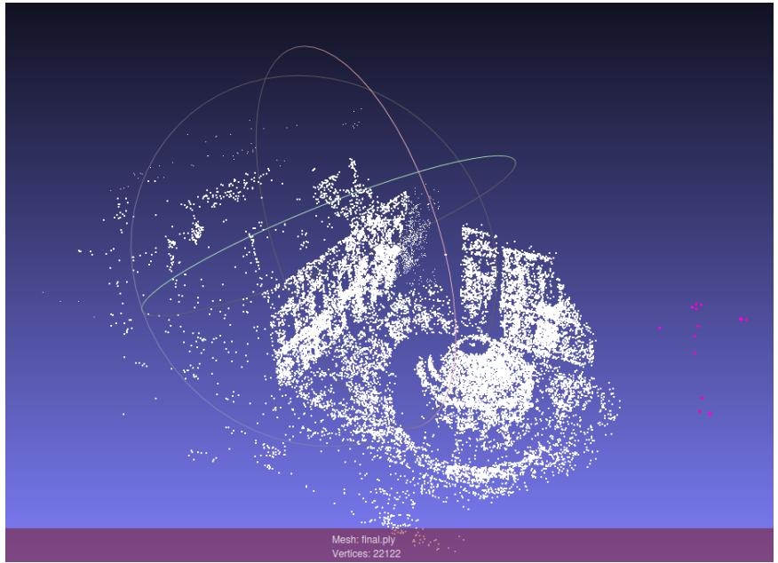

<details>
<summary>natural_image</summary>

Abstract geometric pattern with white dots on a blue gradient background, overlaid with a globe and intersecting lines (no text or symbols)
</details>

图 10-15 Ceres 的优化结果。

## 10.5 小结

本讲比较深入地探讨了状态估计问题与图优化的求解。我们看到在经典模型中，SLAM可以看成状态估计问题。如果我们假设马尔可夫性，只考虑当前状态的话，则得到以 EKF为代表的滤波器模型。如若不然，我们也可以选择考虑所有的运动和观测，它们构成一个最小二乘问题。在只有观测方程的情况下，这个问题称为 BA，并可利用非线性优化方法求解。我们仔细讨论了求解过程中的稀疏性问题，指出了该问题与图优化之间的联系。最后，我们演示了如何使用 $\mathrm { g 2 o }$ 和 Ceres 库求解同一个优化问题，让读者对 BA 有一个直观的认识。

## 习题

1. 证明式（10.25）成立。提示：你可能会用到 SMW（Sherman-Morrison-Woodbury）公式，参考 [76, 6]。  
2. 对比 $\mathrm { g 2 o }$ 和 Ceres 的优化后目标函数的数值。指出为什么两者在 Meshlab 中效果一样但为何数值却不同。  
3. 给 Ceres 当中的部分点云进行 Schur 消元，看看结果会有什么区别。  
4. 证明 S 矩阵为半正定矩阵。

5. 阅读 [28]，看看 $\mathrm { g 2 o }$ 对核函数是如何处理的。与 Ceres 中的 Loss function 有何联系？  
6. \* 在两个示例中，我们优化了相机位姿、以 $f , k _ { 1 } , k _ { 2 }$ 为参数的相机内参以及路标点。请考虑使用第五章介绍的完整的相机模型进行优化，即，至少考虑 $f _ { x } , f _ { y } , p _ { 1 } , p _ { 2 } , k _ { 1 } , k _ { 2 }$ 这些量。修改现在的 Ceres 和 $\mathrm { g 2 o }$ 程序以完成实验。

## 第 11 讲

## 后端 2

## 本节目标

1. 理解 Pose Graph 优化。  
2. 理解因子图优化。  
3. 理解增量式图优化的工作原理。  
4. 通过实验掌握 g2o 的 Pose Graph 优化与 gtsam 的因子图优化。

上讲我们重点介绍了以 BA 为主的图优化。BA 能精确地优化每个相机位姿与特征点位置。不过在更大的场景中，大量特征点的存在会严重降低计算效率，导致计算量越来越大以至于无法实时化。本讲介绍两种在更大场景下使用的后端优化方法：位姿图。

## 11.1 位姿图（Pose Graph）

## 11.1.1 Pose Graph 的意义

带有相机位姿和空间点的图优化称为 BA，能够有效地求解大规模的定位与建图问题。但是，随着时间的流逝，机器人的运动轨迹将越来越长，地图规模也将不断增长。像 BA这样的方法，计算效率就会（令人担忧地）不断下降。根据前面的讨论，我们发现特征点在优化问题中占据了绝大多数部分。而实际上，经过若干次观测之后，那些收敛的特征点，空间位置估计就会收敛至一个值保持不动，而发散的外点则通常看不到了。对收敛点再进行优化，似乎是有些费力不讨好的。因此，我们更倾向于在优化几次之后就把特征点固定住，只把它们看作位姿估计的约束，而不再实际地优化它们的位置估计。

沿着这个思路往下走，我们会发现：是否能够完全不管路标，而只管轨迹呢？我们完全可以构建一个只有轨迹的图优化，而位姿节点之间的边，可以由两个关键帧之间通过特征匹配之后得到的运动估计来给定初始值。不同的是，一旦初始估计完成，我们就不再优化那些路标点的位置，而只关心所有的相机位姿之间的联系了。通过这种方式，我们省去了大量的特征点优化的计算，只保留了关键帧的轨迹，从而构建了所谓的位姿图（Pose Graph），如图 11-1 所示。

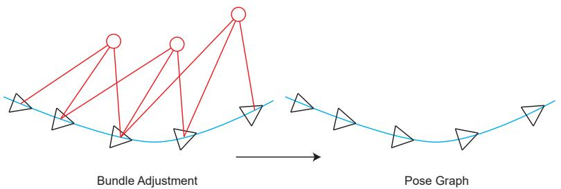

<details>
<summary>flowchart</summary>


```mermaid
graph TD
  A["Node"] --> B["Node"]
  B --> C["Node"]
  C --> D["Node"]
  D --> E["Node"]
  E --> F["Node"]
  F --> G["Node"]
  G --> H["Node"]
  H --> I["Node"]
  I --> J["Node"]
  J --> K["Node"]
  K --> L["Node"]
  L --> M["Node"]
  M --> N["Node"]
  N --> O["Node"]
  O --> P["Node"]
  P --> Q["Node"]
  Q --> R["Node"]
  R --> S["Node"]
  S --> T["Node"]
  T --> U["Node"]
  U --> V["Node"]
  V --> W["Node"]
  W --> X["Node"]
  X --> Y["Node"]
  Y --> Z["Node"]
```
</details>

图 11-1 Pose Graph 示意图。当我们不再优化 Bundle Adjustment 中的路标点，仅把它们看成对姿态节点的约束时，就得到了一个计算规模减小很多的 Pose Graph。

我们知道在 BA 中，特征点数量远大于位姿节点的数量。一个关键帧往往关联了数百个关键点，而实时 BA 的最大计算规模，即使利用稀疏性，在当前的主流 CPU 上一般也就是几万个点左右。这就限制了 SLAM 应用场景。所以，当机器人在更长的时间和空间中运动时，必须考虑一些解决方式：要么像滑动窗口法那样，丢弃一些历史数据 [77]；要么像Pose Graph 的做法那样，舍弃对路标点的优化，只保留 Pose 之间的边，使用 Pose Graph[78, 79, 80]。

## 11.1.2 Pose Graph 的优化

那么，Pose Graph 图优化中的节点和边都是什么意思呢？这里的节点表示相机位姿，以 $\xi _ { 1 } , \ldots , \xi _ { n }$ 来表达。而边，则是两个位姿节点之间相对运动的估计，该估计可能来自于特征点法或直接法，但不管如何，我们估计了，比如说 $\pmb { \xi } _ { i }$ 和 $\xi _ { j }$ 之间的一个运动 $\Delta \xi _ { i j }$ 。该运动可以有若干种表达方式，我们取比较自然的一种：

$$
\Delta \boldsymbol {\xi} _ {i j} = \boldsymbol {\xi} _ {i} ^ {- 1} \circ \boldsymbol {\xi} _ {j} = \ln \left(\exp \left((- \boldsymbol {\xi} _ {i}) ^ {\wedge}\right) \exp \left(\boldsymbol {\xi} _ {j} ^ {\wedge}\right)\right) ^ {\vee}, \tag {11.1}
$$

或按李群的写法：

$$
\boldsymbol {\Delta} \boldsymbol {T} _ {i j} = \boldsymbol {T} _ {i} ^ {- 1} \boldsymbol {T} _ {j}. \tag {11.2}
$$

按照图优化的思路来看，实际当中该等式不会精确地成立，因此我们设立最小二乘误差，然后和以往一样，讨论误差关于优化变量的导数。这里，我们把上式的 $\Delta \pmb { T } _ { i j }$ 移至等式右侧，构建误差 $e _ { i j }$ ：

$$
\begin{array}{l} \boldsymbol {e} _ {i j} = \ln \left(\Delta \boldsymbol {T} _ {i j} ^ {- 1} \boldsymbol {T} _ {i} ^ {- 1} \boldsymbol {T} _ {j}\right) ^ {\vee} \tag {11.3} \\ = \ln \left(\exp ((- \boldsymbol {\xi} _ {i j}) ^ {\wedge}) \exp ((- \boldsymbol {\xi} _ {i}) ^ {\wedge}) \exp (\boldsymbol {\xi} _ {j} ^ {\wedge})\right) ^ {\vee}. \\ \end{array}
$$

注意优化变量有两个： $\pmb { \xi } _ { i }$ 和 $\xi _ { j }$ ，因此我们求 $e _ { i j }$ 关于这两个变量的导数。按照李代数的求导方式，给 $\pmb { \xi } _ { i }$ 和 $\xi _ { j }$ 各一个左扰动： $\delta \xi _ { i }$ 和 $\delta \xi _ { j }$ 。于是误差变为：

$$
\hat {\boldsymbol {e}} _ {i j} = \ln \left(\boldsymbol {T} _ {i j} ^ {- 1} \boldsymbol {T} _ {i} ^ {- 1} \exp ((- \delta \boldsymbol {\xi} _ {i}) ^ {\wedge}) \exp (\delta \boldsymbol {\xi} _ {j} ^ {\wedge}) \boldsymbol {T} _ {j}\right) ^ {\vee}. \tag {11.4}
$$

该式中，两个扰动项被夹在了中间。为了利用 BCH 近似，我们希望把扰动项移至式子左侧或右侧。回忆第四讲习题中的伴随性质，即式（4.49）。如果你没有做过这个习题，暂时把它当作想当然的东西：

$$
\exp \left((\mathrm{Ad} (\boldsymbol {T}) \boldsymbol {\xi}) ^ {\wedge}\right) = \boldsymbol {T} \exp (\boldsymbol {\xi} ^ {\wedge}) \boldsymbol {T} ^ {- 1}. \tag {11.5}
$$

稍加改变，有：

$$
\exp (\boldsymbol {\xi} ^ {\wedge}) \boldsymbol {T} = \boldsymbol {T} \exp \left(\left(\mathrm{Ad} (\boldsymbol {T} ^ {- 1}) \boldsymbol {\xi}\right) ^ {\wedge}\right). \tag {11.6}
$$

该式表明，通过引入一个伴随项，我们能够“交换”扰动项左右侧的 $_ { \mathbf { T } }$ 。利用它，可以将扰动挪到最右（当然最左亦可），导出右乘形式的雅可比矩阵（挪到左边时形成左乘）：

$$
\begin{array}{l} \hat {\boldsymbol {e}} _ {i j} = \ln \left(\boldsymbol {T} _ {i j} ^ {- 1} \boldsymbol {T} _ {i} ^ {- 1} \exp ((- \delta \boldsymbol {\xi} _ {i}) ^ {\wedge}) \exp (\delta \boldsymbol {\xi} _ {j} ^ {\wedge}) \boldsymbol {T} _ {j}\right) ^ {\vee} \\ = \ln \left(\boldsymbol {T} _ {i j} ^ {- 1} \boldsymbol {T} _ {i} ^ {- 1} \boldsymbol {T} _ {j} \exp \left(\left(- \operatorname{Ad} \left(\boldsymbol {T} _ {j} ^ {- 1}\right) \boldsymbol {\delta} \boldsymbol {\xi} _ {i}\right) ^ {\wedge}\right) \exp \left(\left(\operatorname{Ad} \left(\boldsymbol {T} _ {j} ^ {- 1}\right) \boldsymbol {\delta} \boldsymbol {\xi} _ {j}\right) ^ {\wedge}\right) ^ {\vee}\right). \tag {11.7} \\ \approx \ln \left(\boldsymbol {T} _ {i j} ^ {- 1} \boldsymbol {T} _ {i} ^ {- 1} \boldsymbol {T} _ {j} \left[ \boldsymbol {I} - (\mathrm{Ad} (\boldsymbol {T} _ {j} ^ {- 1}) \boldsymbol {\delta} \boldsymbol {\xi} _ {i}) ^ {\wedge} + (\mathrm{Ad} (\boldsymbol {T} _ {j} ^ {- 1}) \boldsymbol {\delta} \boldsymbol {\xi} _ {j}) ^ {\wedge} \right]\right) ^ {\vee} \\ \approx \boldsymbol {e} _ {i j} + \frac {\partial \boldsymbol {e} _ {i j}}{\partial \delta \boldsymbol {\xi} _ {i}} \delta \boldsymbol {\xi} _ {i} + \frac {\partial \boldsymbol {e} _ {i j}}{\partial \delta \boldsymbol {\xi} _ {j}} \delta \boldsymbol {\xi} _ {j} \\ \end{array}
$$

因此，按照李代数上的求导法则，我们求出了误差关于两个位姿的雅可比矩阵。关于$\mathbf { \delta } _ { \mathbf { \mathcal { T } } _ { i } }$ 的：

$$
\frac {\partial \boldsymbol {e} _ {i j}}{\partial \boldsymbol {\delta} \boldsymbol {\xi} _ {i}} = - \mathcal {J} _ {r} ^ {- 1} (\boldsymbol {e} _ {i j}) \mathrm{Ad} (\boldsymbol {T} _ {j} ^ {- 1}). \tag {11.8}
$$

以及关于 $\mathbf { \delta } _ { T _ { j } }$ 的：

$$
\frac {\partial \boldsymbol {e} _ {i j}}{\partial \boldsymbol {\delta} \boldsymbol {\xi} _ {j}} = \boldsymbol {\mathcal {J}} _ {r} ^ {- 1} (\boldsymbol {e} _ {i j}) \mathrm{Ad} (\boldsymbol {T} _ {j} ^ {- 1}). \tag {11.9}
$$

如果读者觉得这部分求导理解起来有困难，可以回到第四讲温习一下李代数部分的内容。不过，前面也说过，由于 $\mathfrak { s e } ( 3 )$ 上的左右雅可比 $\mathcal { I } _ { r }$ 形式过于复杂，我们通常取它们的近似。如果误差接近于零，我们就可以设它们近似为 I 或：

$$
\boldsymbol {\mathcal {J}} _ {r} ^ {- 1} (\boldsymbol {e} _ {i j}) \approx \boldsymbol {I} + \frac {1}{2} \left[ \begin{array}{c c} \phi_ {\boldsymbol {e}} ^ {\wedge} & \rho_ {\boldsymbol {e}} ^ {\wedge} \\ \boldsymbol {0} & \phi_ {\boldsymbol {e}} ^ {\wedge} \end{array} \right]. \tag {11.10}
$$

理论上来说，即使在优化之后，由于每条边给定的观测数据并不一致，误差通常也不见得近似于零，所以简单地把这里的 $\mathcal { T } _ { \tau }$ 设置为 I 会有一定的损失。稍后我们将通过实践来看看理论上的区别是否明显。

了解雅可比求导后，剩下的部分就和普通的图优化一样了。简而言之，所有的位姿顶点和位姿——位姿边构成了一个图优化，本质上是一个最小二乘问题，优化变量为各个顶点的位姿，边来自于位姿观测约束。记 E 为所有边的集合，那么总体目标函数为：

$$
\min _ {\boldsymbol {\xi}} \frac {1}{2} \sum_ {i, j \in \mathcal {E}} \boldsymbol {e} _ {i j} ^ {T} \boldsymbol {\Sigma} _ {i j} ^ {- 1} \boldsymbol {e} _ {i j}. \tag {11.11}
$$

我们依然可以用 Gauss-Newton、Levenberg-Marquardt 等方法求解此问题，除了用李代数表示优化位姿以外，别的都是相似的。根据先前的经验，这自然可以用 Ceres 或 g2o进行求解。我们不再讨论优化的详细过程，上一讲已经讲得够多了。

## 11.2 实践：位姿图优化

## 11.2.1 g2o 原生位姿图

下面来演示使用 $\mathrm { g 2 o }$ 进行位姿图优化。首先，请读者用 g2o\_viewer 打开我们预先生成的仿真位姿图，位于 slambook/ch11/sphere.g2o 中，如图 11-2 所示。

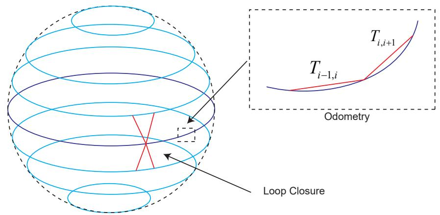

<details>
<summary>text_image</summary>

T_{i-1,i}
T_{i,i+1}
Odometry
Loop Closure
</details>

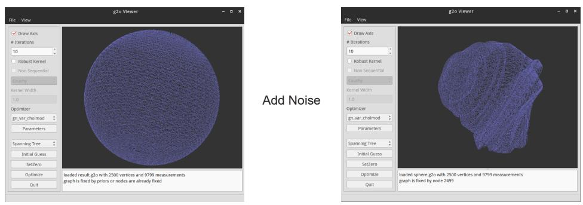

<details>
<summary>text_image</summary>

g2o Viewer
File View
Draw Axis
# Iterations
10
Robust Kernel
Non Sequential
Couchy
Kernel Width
1.0
Optimizer
gn_var_cholmod
Parameters
Spanning Tree
Initial Guess
SetZero
Optimize
Quit
loaded result.g2o with 2500 vertices and 9799 measurements
graph is fixed by priors or nodes are already fixed
Add Noise
g2o Viewer
File View
Draw Axis
# Iterations
10
Robust Kernel
Non Sequential
Couchy
Kernel Width
1.0
Optimizer
gn_var_cholmod
Parameters
Spanning Tree
Initial Guess
SetZero
Optimize
Quit
loaded sphere.g2o with 2500 vertices and 9799 measurements
graph is fixed by node 2499
</details>

图 11-2 g2o 仿真产生的位姿图。真值是完整的球形，在真值上添加噪声后得到带累计误差的仿真数据。

该位姿图是由 g2o 自带的 create sphere 程序仿真生成的。它的真实轨迹为一个球，由从下往上的多个层组成。每层为一个正圆形，很多个大小不一的圆形层组成了一个完整的球体，共包含 2500 个位姿节点（图 11-2 左上），可以看成一个转圈上升的过程。然后，仿真程序生成了 t−1 到 t 时刻的边，称为 odometry 边（里程计）。此外，又生成层与层之间的边，称为 loop closure（回环，将在下章详细介绍）。随后，在每条边上添加观测噪声，并根据里程计边的噪声，重新设置节点的初始值。这样，就得到了带累计误差的位姿图数据（图 11-2 右下）。它局部看起来像球体的一部分，但整体形状与球体相差甚远。现在我们从这些带噪声的边和节点初始值出发，尝试优化整个位姿图，得到近似真值的数据。

当然，实际当中的机器人肯定不会出现这样正球形的运动轨迹，以及如此完整的里程计与回环观测数据。仿真成正球的好处，是我们能够直观地看到优化结果是否正确（只要看它各个角度圆不圆就行了）。读者可以点击 g2o\_viewer 中的 optimize 函数，可以看到每步的优化结果和收敛的过程。另一方面，sphere.g2o 也是一个文本文件，可以用文本编辑器打开，查看它里面的内容。文件前半部分由节点组成，后半部分则是边：

```txt
1 VERTEX_SE3:QUAT 0 -0.125664 -1.53894e-17 99.9999 0.706662 4.32706e-17 0.707551 -4.3325e-17
2 ......
3 EDGE_SE3:QUAT 1524 1574 -0.210399 -0.0101193 -6.28806 -0.00122939 0.0375067 -2.85291e-05 0.999296 10000
    0 0 0 0 0 10000 0 0 0 0 10000 0 0 0 40000 0 0 40000 0 40000
```

可以看到，节点类型是VERTEX\_SE3，表达一个相机位姿。 $\mathrm { g 2 o }$ 默认使用四元数和平移向量表达位姿，所以后面的字段意义为：ID， $t _ { x } , t _ { y } , t _ { z } , q _ { x } , q _ { y } , q _ { z } , q _ { w } \circ$ 。前三个为平移向量元素，后四个为表示旋转的单位四元数。同样，边的信息为：两个节点的 ID， $t _ { x } , t _ { y } , t _ { z } , q _ { x } , q _ { y } , q _ { z } , q _ { w } ,$ ，信息矩阵的右上角（由于信息矩阵为对称阵，只需保存一半即可）。可以看到这里把信息矩阵设成了对角阵。

为了优化该位姿图，我们可以使用 $\mathrm { g 2 o }$ 默认的顶点和边，它们是由四元数表示的。由于仿真数据也是 $\mathrm { g 2 o }$ 生成的，所以用 $\mathrm { g 2 o }$ 本身优化就无需我们多做什么工作了，只需配置一下优化参数即可。程序 slambook/ch11/pose\_graph\_g2o\_SE3.cpp 演示了如何使用 L-M算法对该位姿图进行优化，并把结果存储至 result.g2o 文件中。

slambook/ch11/pose\_graph\_g2o\_SE3.cpp  
```cpp
#include <iostream>
#include <fstream>
#include <string>

#include <g2o/types/slam3d/types_slam3d.h>
#include <g2o/core/block_solver.h>
#include <g2o/core/optimization_algorithm_levenberg.h>
#include <g2o/core/optimization_algorithm_gauss_newton.h>
#include <g2o/solvers/dense/linear_solver_dense.h>
#include <g2o/solvers/cholmod/linear_solver_cholmod.h>
using namespace std;

/**************************
* 本程序演示如何用 g2o solver 进行位姿图优化
* sphere.g2o 是人工生成的一个 Pose graph，我们来优化它。
* 尽管可以直接通过 load 函数读取整个图，但我们还是自己来实现读取代码，以期获得更深刻的理解
* 这里使用 g2o/types/slam3d/ 中的 SE3 表示位姿，它实质上是四元数而非李代数。
```

```cpp
* ******************************/
int main( int argc, char** argv )
{
    if ( argc != 2 )
    {
    cout<<"Usage: pose_graph_g2o_SE3 sphere.g2o"<<endl;
    return 1;
    }
    ifstream fin( argv[1] );
    if ( !fin )
    {
    cout<<"file "<<argv[1]<<" does not exist."<<endl;
    return 1;
    }

    typedef g2o::BlockSolver<g2o::BlockSolverTraits<6,6>> Block; // 6x6 BlockSolver
    Block::LinearSolverType* linearSolver = new g2o::LinearSolverCholmod<Block::PoseMatrixType>();
    Block* solver_ptr = new Block( linearSolver ); // 矩阵块求解器
    g2o::OptimizationAlgorithmLevenberg* solver=new g2o::OptimizationAlgorithmLevenberg(solver_ptr);
    g2o::SparseOptimizer optimizer; // 图模型
    optimizer.setAlgorithm( solver ); // 设置求解器

    int vertexCnt = 0, edgeCnt = 0; // 顶点和边的数量
    while ( !fin.eof() )
    {
    string name;
    fin>>name;
    if ( name == "VERTEX_SE3:QUAT" )
    {
    // SE3 顶点
    g2o::VertexSE3* v = new g2o::VertexSE3();
    int index = 0;
    fin>>index;
    v->setId( index );
    v->read(fin);
    optimizer.addVertex(v);
    vertexCnt++;
    if ( index==0 )
    v->setFixed(true);
    }
    else if ( name=="EDGE_SE3:QUAT" )
    {
    // SE3-SE3 边
    g2o::EdgeSE3* e = new g2o::EdgeSE3();
    int idx1, idx2; // 关联的两个顶点
    fin>>idx1>>idx2;
    e->setId( edgeCnt++ );
    e->setVertex( 0, optimizer.vertices()[idx1] );
    e->setVertex( 1, optimizer.vertices()[idx2] );
```

```txt
e->read(fin);
optimizer.addEdge(e);
}
if (!fin.good()) break;
}

cout<<"read total "<<vertexCnt<<" vertices, "<<edgeCnt<<" edges.""endl;

cout<<"prepare optimizing ..."<<endl;
optimizer.setVerbose(true);
optimizer.initializeOptimization();
cout<<"calling optimizing ..."<<endl;
optimizer.optimize(30);

cout<<"saving optimization results ..."<<endl;
optimizer.save("result.g2o");

return 0;
}
```

我们选择了 6×6 的块求解器，使用 L-M 下降方式，迭代次数选择 30 次。调用此程序对位姿图进行优化：

$build/pose_graph_g2o_SE3 sphere.g2o$ read total 2500 vertices, 9799 edges.
prepare optimizing ...
calling optimizing ...
iteration= 0 chi2= 1023011093.967638 time= 0.851879 cumTime= 0.851879 edges= 9799 schur= 0 lambda= 805.622433 levenbergIter= 1
iteration= 1 chi2= 385118688.233188 time= 0.863567 cumTime= 1.71545 edges= 9799 schur= 0 lambda= 537.081622 levenbergIter= 1
iteration= 2 chi2= 166223726.693659 time= 0.861235 cumTime= 2.57668 edges= 9799 schur= 0 lambda= 358.054415 levenbergIter= 1
iteration= 3 chi2= 86610874.269316 time= 0.844105 cumTime= 3.42079 edges= 9799 schur= 0 lambda= 238.702943 levenbergIter= 1
iteration= 4 chi2= 40582782.710190 time= 0.862221 cumTime= 4.28301 edges= 9799 schur= 0 lambda= 159.135295 levenbergIter= 1
......
iteration= 28 chi2= 45095.174398 time= 0.869451 cumTime= 30.0809 edges= 9799 schur= 0 lambda= 0.003127 levenbergIter= 1
iteration= 29 chi2= 44811.248504 time= 1.76326 cumTime= 31.8442 edges= 9799 schur= 0 lambda= 0.003785 levenbergIter= 2
saving optimization results ...

然后，用 g2o\_viewer 打开 result.g2o 查看结果，如图 11-3 所示。

结果从一个不规则的形状优化成了一个看起来完整的球。这件事情过程实质上和我们点击 g2o\_viewer 上的 Optimize 按钮没有区别。下面，我们根据前面的李代数推导，来实现一下李代数上的优化。

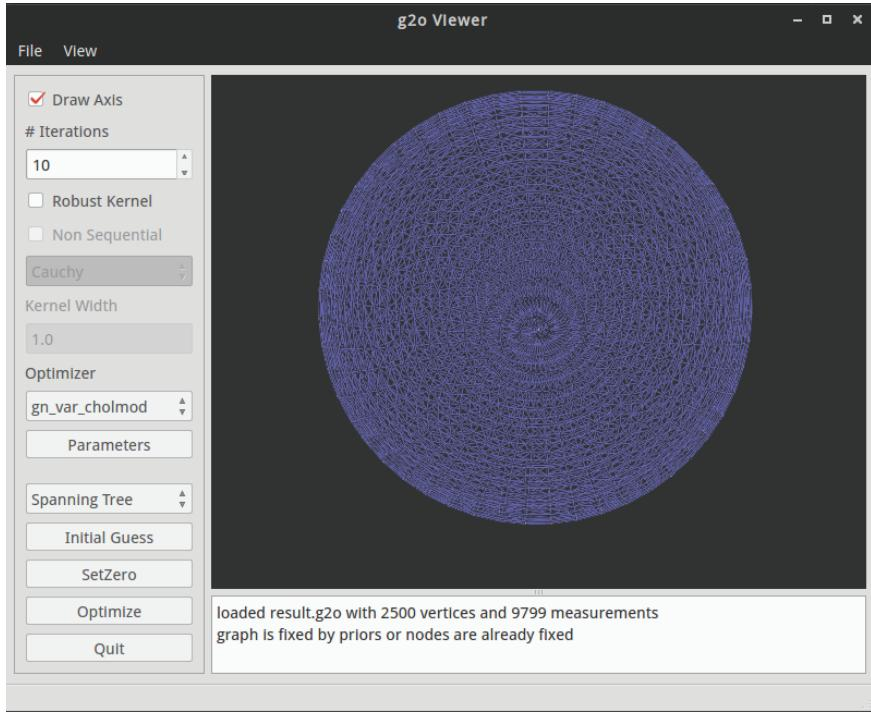

<details>
<summary>text_image</summary>

g2o Viewer
File View
Draw Axis
# Iterations
10
Robust Kernel
Non Sequential
Cauchy
Kernel Width
1.0
Optimizer
gn_var_cholmod
Parameters
Spanning Tree
Initial Guess
SetZero
Optimize
Quit
loaded result.g2o with 2500 vertices and 9799 measurements
graph is fixed by priors or nodes are already fixed
</details>

图 11-3 使用 $\mathrm { g 2 o }$ 自带的顶点与边求解的结果。

## 11.2.2 李代数上的位姿图优化

还记得我们用 Sophus 来表达李代数的事情吗？我们来试试把 Sophus 用到 $\mathrm { g 2 o }$ 中，定义自己的顶点和边吧。

slambook/ch11/pose\_graph\_g2o\_lie\_algebra.cpp（片段）  
```c
#include <iostream>
#include <fstream>
#include <string>
#include <Eigen/Core>

#include <g2o/core/base_vertex.h>
#include <g2o/core/base_binary_edge.h>
#include <g2o/core/block_solver.h>
#include <g2o/core/optimization_algorithm_levenberg.h>
#include <g2o/core/optimization_algorithm_gauss_newton.h>
#include <g2o/core/optimization_algorithm_dogleg.h>
#include <g2o/solvers/dense/linear_solver_dense.h>
#include <g2o/solvers/cholmod/linear_solver_cholmod.h>
```

```cpp
#include <sophus/se3.h>
#include <sophus/so3.h>

using namespace std;
using Sophus::SE3;
using Sophus::SO3;

/**********************************************************************
* 本程序演示如何用 g2o solver 进行位姿图优化
* sphere.g2o 是人工生成的一个 Pose graph，我们来优化它。
* 尽管可以直接通过 load 函数读取整个图，但我们还是自己来实现读取代码，以期获得更深刻的理解
* 本节使用李代数表达位姿图，节点和边的方式为自定义
* ******************************/
typedef Eigen::Matrix<double,6,6> Matrix6d;

// 给定误差求 J_R^{-1} 的近似
Matrix6d JRInv(SE3 e)
{
    Matrix6d J;
    J.block(0,0,3,3) = SO3::hat(e.so3().log());
    J.block(0,3,3,3) = SO3::hat(e.translation());
    J.block(3,0,3,3) = Eigen::Matrix3d::Zero(3,3);
    J.block(3,3,3,3) = SO3::hat(e.so3().log());
    J = J*0.5 + Matrix6d::Identity();
    return J;
}

// 李代数顶点
typedef Eigen::Matrix<double, 6, 1> Vector6d;
class VertexSE3LieAlgebra: public g2o::BaseVertex<6, SE3>
{
public:
    EIGEN_MAKE_ALIGNED_OPERATOR_NEW
    bool read (istream& is)
    {
    double data[7];
    for (int i=0; i<7; i++)
    is>>data[i];
    setEstimate (SE3 (
    Eigen::Quaterniond (data[6],data[3], data[4], data[5]),
    Eigen::Vector3d (data[0], data[1], data[2])
    ));
    }

    bool write (ostream& os) const
    {
    os<<id()<<" ";
    Eigen::Quaterniond q = _estimate.unit_quaternion();
    os<<_estimate.translation().transpose()<<" ";
    os<<q.coeffs()[0]<<" "<<q.coeffs()[1]<<" "<<q.coeffs()[2]<<" "<<q.coeffs()[3]<<endl;
    return true;
    }
}
```

```cpp
}
virtual void setToOriginImpl()
{
    _estimate = Sophus::SE3();
}
// 左乘更新
virtual void oplusImpl (const double* update)
{
    Sophus::SE3 up (
    Sophus::S03 (update[3], update[4], update[5]),
    Eigen::Vector3d (update[0], update[1], update[2])
    );
    _estimate = up*_estimate;
}
};

// 两个李代数节点之边
class EdgeSE3LieAlgebra: public g2o::BaseBinaryEdge<6, SE3, VertexSE3LieAlgebra, VertexSE3LieAlgebra>
{
public:
    EIGEN_MAKE_ALIGNED_OPERATOR_NEW
    bool read (istream& is)
    {
    double data[7];
    for (int i=0; i<7; i++)
    is>>data[i];
    Eigen::Quaterniond q (data[6], data[3], data[4], data[5]);
    q.normalize();
    setMeasurement (
    Sophus::SE3 (q, Eigen::Vector3d (data[0], data[1], data[2]))
    );
    for (int i=0; i<information().rows() && is.good(); i++)
    for (int j=i; j<information().cols() && is.good(); j++)
    {
    is >> information() (i,j);
    if (i!=j)
    information() (j,i) = information() (i,j);
    }
    return true;
}
bool write (ostream& os) const
{
    VertexSE3LieAlgebra* v1 = static_cast<VertexSE3LieAlgebra*> (_vertices[0]);
    VertexSE3LieAlgebra* v2 = static_cast<VertexSE3LieAlgebra*> (_vertices[1]);
    os<<v1->id()<<" "<<v2->id()<<" ";
    SE3 m = _measurement;
    Eigen::Quaterniond q = m.unit_quaternion();
    os<<m.translation().transpose()<<" ";
    os<<q.coeffs()[0]<<" "<<q.coeffs()[1]<<" "<<q.coeffs()[2]<<" "<<q.coeffs()[3]<<" ";
```

```cpp
// information matrix
for ( int i=0; i<information().rows(); i++ )
    for ( int j=i; j<information().cols(); j++ )
    {
    os << information() ( i,j ) << " ";
    }
    os<<endl;
    return true;
}

// 误差计算与书中推导一致
virtual void computeError()
{
    Sophus::SE3 v1 = (static_cast<VertexSE3LieAlgebra*> (_vertices[0]))->estimate();
    Sophus::SE3 v2 = (static_cast<VertexSE3LieAlgebra*> (_vertices[1]))->estimate();
    _error = (_measurement.inverse()*v1.inverse()*v2).log();
}

// 雅可比计算
virtual void linearizeOplus()
{
    Sophus::SE3 v1 = (static_cast<VertexSE3LieAlgebra*> (_vertices[0]))->estimate();
    Sophus::SE3 v2 = (static_cast<VertexSE3LieAlgebra*> (_vertices[1]))->estimate();
    Matrix6d J = JRInv(SE3::exp(_error));
    // 尝试把J近似为I?
    _jacobianOplusXi = - J* v2.inverse().Adj();
    _jacobianOplusXj = J*v2.inverse().Adj();
}
};
```

为了实现从 g2o 文件的存储和读取，本节例程实现了 read 和 write 函数，并且“伪装”成 g2o 内置的 SE3 顶点，使得 g2o\_viewer 能够认识并渲染它。事实上，除了内部使用 Sophus 的李代数表示之外，从外部看起来没有什么区别。

值得注意的是这里雅可比的计算过程。我们有若干种选择：一是不提供雅可比计算函数，让 g2o 自动计算数值雅可比。二是提供完整或近似的雅可比计算过程。这里我们用JRInv() 函数提供近似的 $\boldsymbol { \mathcal { I } } _ { r } ^ { - 1 }$ 。读者可以尝试把它近似为 I，或者干脆注释掉 oplusImpl函数，看看结果会有什么区别。

之后调用 g2o 进行优化问题：

$build/pose_graph_g2o_lie sphere.g2o$ read total 2500 vertices, 9799 edges.
prepare optimizing ...
calling optimizing ...
iteration= 0 chi2= 781963143.389706 time= 1.9322 cumTime= 1.9322 edges= 9799 schur= 0 lambda= 6706.585223 levenbergIter= 1
iteration= 1 chi2= 236521032.458035 time= 1.91309 cumTime= 3.84529 edges= 9799 schur= 0 lambda= 2235.528408 levenbergIter= 1

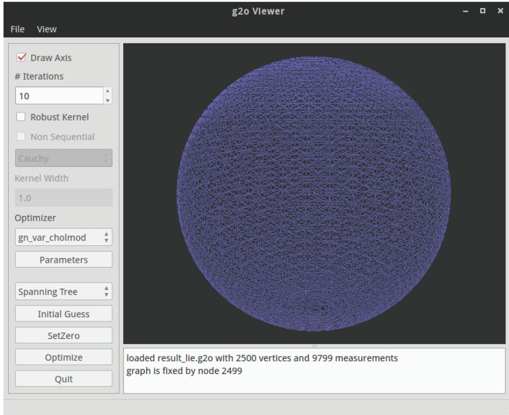

<details>
<summary>text_image</summary>

g2o Viewer
File View
Draw Axis
# Iterations
10
Robust Kernel
Non Sequential
Cauchy
Kernel Width
1.0
Optimizer
gn_var_cholmod
Parameters
Spanning Tree
Initial Guess
SetZero
Optimize
Quit
loaded result lle.g2o with 2500 vertices and 9799 measurements
graph is fixed by node 2499
</details>

图 11-4 使用李代数自定义节点与边优化后的结果。

```txt
7 iteration= 2 chi2= 142934798.398778 time= 1.9792 cumTime= 5.8245 edges= 9799 schur= 0 lambda= 745.176136 levenbergIter= 1
8 iteration= 3 chi2= 84490229.050137 time= 2.03394 cumTime= 7.85844 edges= 9799 schur= 0 lambda= 248.392045 levenbergIter= 1
9 iteration= 4 chi2= 42690811.624643 time= 2.05149 cumTime= 9.90993 edges= 9799 schur= 0 lambda= 82.797348 levenbergIter= 1
10 .....
11 iteration= 21 chi2= 127607.121623 time= 1.9686 cumTime= 43.526 edges= 9799 schur= 0 lambda= 0.000712 levenbergIter= 1
12 iteration= 22 chi2= 127578.889888 time= 1.94773 cumTime= 45.4737 edges= 9799 schur= 0 lambda= 0.000237 levenbergIter= 1
13 iteration= 23 chi2= 127578.158794 time= 1.98009 cumTime= 47.4538 edges= 9799 schur= 0 lambda= 0.000079 levenbergIter= 1
14 iteration= 24 chi2= 127578.157859 time= 2.04546 cumTime= 49.4993 edges= 9799 schur= 0 lambda= 0.000053 levenbergIter= 1
15 iteration= 25 chi2= 127578.157859 time= 1.96722 cumTime= 51.4665 edges= 9799 schur= 0 lambda= 0.000035 levenbergIter= 1
16 iteration= 26 chi2= 127578.157859 time= 2.11235 cumTime= 53.5789 edges= 9799 schur= 0 lambda= 0.000023 levenbergIter= 1
17 iteration= 27 chi2= 127578.157859 time= 3.29151 cumTime= 56.8704 edges= 9799 schur= 0 lambda= 0.000031 levenbergIter= 2
18 iteration= 28 chi2= 127578.157859 time= 3.20302 cumTime= 60.0734 edges= 9799 schur= 0 lambda= 0.000042 levenbergIter= 2
```

```txt
iteration= 29 chi2= 127578.157859 time= 5.56337 cumTime= 65.6368 edges= 9799 schur= 0 lambda= 0.001779 levenbergIter= 4
saving optimization results ...
```

我们发现，迭代 23 次后，总体误差保持不变，事实上可以让优化算法停止了。而上一个实验中用满了 30 次迭代后误差仍在下降①。在调用优化后，查看 result\_lie.g2o 观察它的结果，如图 11-4 所示。从肉眼上看不出任何区别。

如果你在这个 g2o\_viewer 界面按下 Optimize 按钮，g2o 将使用它自带的 SE3 顶点进行优化，你可以在下方文本框中看到：

```txt
loaded result_lie.g2o with 2500 vertices and 9799 measurements
graph is fixed by node 2499
# Using CHOLMOD poseDim -1 landMarkDim -1 blockordering 0
Preparing (no marginalization of Landmarks)
iteration= 0 chi2= 44360.509723 time= 0.567504 cumTime= 0.567504 edges= 9799 schur= 0
iteration= 1 chi2= 44360.471110 time= 0.595993 cumTime= 1.1635 edges= 9799 schur= 0
iteration= 2 chi2= 44360.471110 time= 0.582909 cumTime= 1.74641 edges= 9799 schur= 0
```

整体误差在 SE3 边的度量下为 44360，略小于之前 30 次迭代时的 44811。这说明使用李代数进行优化后，我们在更少的迭代次数下得到了更好的结果②。

## 11.2.3 小结

球的例子是一个比较有代表性的案例。它具有和实际中相似的里程计边（Odometry）和回环边（Loop Closure），这也正是实际 SLAM 中，一个位姿图中可能有的东西。同时，“球”也具有一定的计算规模：它总共有 2,500 个位姿节点和近 10,000 条边，我们发现优化它费了不少时间（相对于实时性要求很强的前端来说）。另一方面，一般认为位姿图是结构最简单的图之一。在我们不假设机器人如何运动的前提下，很难再进一步讨论它的稀疏性了——因为机器人可能会直线往前运动，形成带状的位姿图，是稀疏的；也可能是“左手右手一个慢动作”，形成了大量的小型回环需要优化（Loopy motion），从而变成像“球”那样比较稠密的位姿图。无论如何，在没有进一步的信息之前，我们似乎无法再利用位姿图的求解结构了。

自从 PTAM[81] 提出以来，人们就已经意识到，后端的优化没必要实时地响应前端的图像数据。人们倾向于把前端和后端分开，运行于两个独立线程之中，历史上称为跟踪（Tracking）和建图（Mapping）——虽然如此叫，建图部分主要是指后端的优化内容。通俗地说，前端需要实时响应视频的速度，例如每秒 30Hz；而优化可以慢悠悠地运行，只要在优化完成时把结果返回给前端即可。所以我们通常不会对后端优化提出很高的速度要求。

## 11.3 \* 因子图优化初步

## 11.3.1 贝叶斯网络

下面，我们从另一个角度来看后端优化：所谓的因子图（Factor Graph）优化。由于这部分内容牵涉到概率图理论，超出了本书范围，所以我们只能大概地介绍如何从概率图角度来看待这个问题。如果读者对概率图模型感兴趣，建议阅读 [82]。或者，如果对用如何使用因子图实现 SLAM 后端优化的细节感兴趣，可以阅读 [83, 84, 85, 86] 这几篇文章。

从贝叶斯网络（Bayes Network）的角度来看，SLAM 可以自然地表达成一个动态贝叶斯网络（Dynamic Bayes Network, DBN）。与图优化类似，贝叶斯网络是一种概率图，由随机变量的节点和表达随机变量条件独立性的边组成，形成一个有向无环图（DirectedAcyclic Graph）。在 SLAM 中，由于我们有运动方程和观测方程，它们恰好表示了状态变量之间的条件概率，如图 11-5 所示。

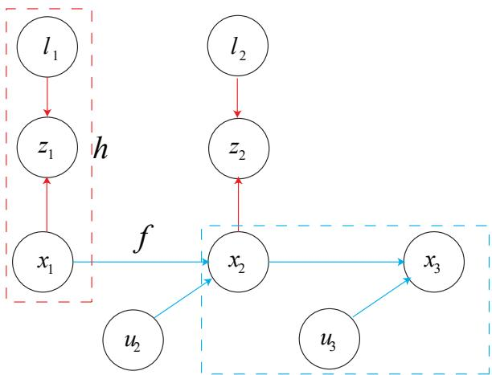

<details>
<summary>flowchart</summary>

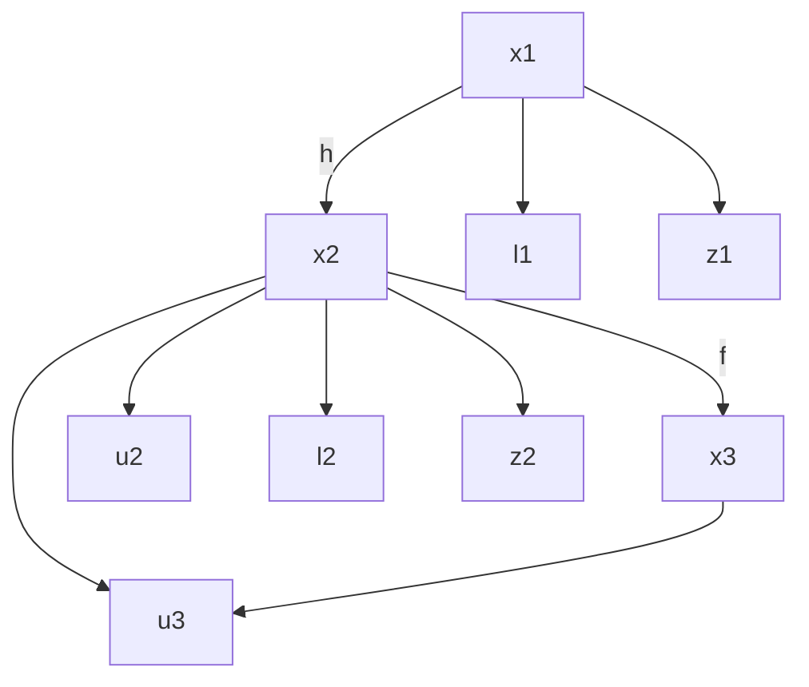
```mermaid
graph TD
  x1 -->|h| x2
  x2 -->|f| x3
  x2 --> u2
  x2 --> u3
  x1 --> l1
  x1 --> z1
  x2 --> l2
  x2 --> z2
  x3 --> u3
```
</details>

图 11-5 以贝叶斯网络形式表达的 SLAM 过程示意图。蓝色线为运动方程，红色线为观测方程。红框表示一次观测，蓝框表示一次运动。

图 11-5 中的圆圈表示了贝叶斯网络的节点，也就是与图相关的随机变量，包括：

1. 相机位姿形成的节点： ${ \pmb x } _ { 1 } , { \pmb x } _ { 2 } \ldots { } .$  
2. 输入量节点：u；  
3. 路标节点：l；  
4. 观测数据节点：z；

这组成了所有与 SLAM 过程相关的信息。另一方面，红色和蓝色线表示了它们之间的关系，箭头表示依赖关系。例如，从 $\scriptstyle { \mathbf { { \vec { x } } } } _ { 1 }$ 指向 $\mathbf { \boldsymbol { x } } _ { 2 }$ 的箭头，说明 $\mathbf { \boldsymbol { x } } _ { 2 }$ 依赖于 $\scriptstyle { \mathbf { { \vec { x } } } } _ { 1 }$ ，此边表示的概率是 $P ( \pmb { x } _ { 2 } | \pmb { x } _ { 1 } )$ ——事实上，运动方程指出了从 $\scriptstyle { \mathbf { { \vec { x } } } } _ { 1 }$ 到 $\mathbf { \boldsymbol { x } } _ { 2 }$ 的运动关系。我们观察蓝色框。这个框中，变量 $\mathbf { x } _ { 3 }$ 依赖于 $\mathbf { \delta x } _ { 2 } , \mathbf { \delta u } _ { 3 }$ 。回忆运动方程：

$$
\boldsymbol {x} _ {3} = f (\boldsymbol {x} _ {2}, \boldsymbol {u} _ {3}) + \boldsymbol {w} _ {3}. \tag {11.12}
$$

它实际上给出了这几个变量的条件概率的度量：

$$
P (\boldsymbol {x} _ {3} | \boldsymbol {x} _ {2}, \boldsymbol {u} _ {3}). \tag {11.13}
$$

同样的，红色框中的一次观测，亦说明观测方程给出了变量间的条件概率关系：

$$
P (\boldsymbol {z} _ {1} | \boldsymbol {x} _ {1}, \boldsymbol {l} _ {1}). \tag {11.14}
$$

通过这种方式，我们构建了一个贝叶斯网络，它表达了所有变量，以及各个方程给出的变量之间的条件概率关系。请注意这只是说贝叶斯网络表达了它们，还没有说到贝叶斯网络的求解。事实上，后端优化的目标，就是在这些既有的约束之上，通过调整贝叶斯网络中随机变量的取值，使整个后验概率达到最大：

$$
\{\boldsymbol {x}, \boldsymbol {l} \} ^ {*} = \arg \max (\boldsymbol {x} _ {0}) \prod P (\boldsymbol {x} _ {k} | \boldsymbol {x} _ {k - 1}, \boldsymbol {u} _ {k}) \prod P (\boldsymbol {z} _ {k} | \boldsymbol {x} _ {i}, \boldsymbol {l} _ {j}). \tag {11.15}
$$

直到现在为止，这和我们在图优化中谈论的东西并没有太大区别，我们只是把变量间的关系显式地用有向图给表达出来而已。这样一个由条件概率描述的贝叶斯网络，已经可以使用概率图模型中的算法进行求解了。不过，进一步观察，我们发现最大后验概率由许多项因子乘积而成，因此该贝叶斯网络又可以转化成一个因子图（Factor Graph）。

## 11.3.2 因子图

因子图是一种无向图，由两种节点组成：表示优化变量的变量节点，以及表示因子的因子节点。如果我们把图 11-5 表示成因子图，就可画成如图 11-6 所示的样子。

在图11-6中，我们用圆圈表示变量节点。注意与贝叶斯网络不同，这里的变量是SLAM中待优化的部分，即相机位姿 x 和路标 l，而没有观测 z 和输入 ${ \pmb u } ^ { - }$ ——因为这几个量是给定的而不是待优化的。相对的，因子节点包含了待优化变量之间的关系，它们来自运动方程和观测方程。

对因子图的优化，就是调整各变量的值，使它们的因子之乘积最大化——它依然对应着一个优化问题。在通常的做法中，我们把各因子的条件概率取高斯分布的形式。考虑到运动方程为：

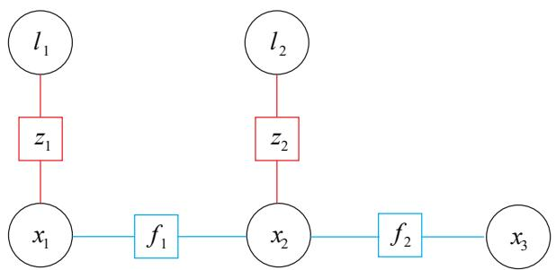

<details>
<summary>flowchart</summary>

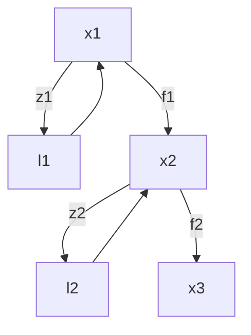
```mermaid
graph TD
  x1 -->|z1| l1
  x1 -->|f1| x2
  x2 -->|z2| l2
  x2 -->|f2| x3
  l1 --> x1
  l2 --> x2
```
</details>

图 11-6 以因子图形式表达的 SLAM 过程示意图。圆圈为变量节点，方块为因子节点。

$$
\boldsymbol {x} _ {k} = f \left(\boldsymbol {x} _ {k - 1}, \boldsymbol {u} _ {k}\right) + \boldsymbol {w} _ {k}. \tag {11.16}
$$

其中 ${ \pmb w } _ { k } \sim N ( { \bf 0 } , { \pmb R } _ { k } )$ 。如果 ${ \bf { \mathcal { x } } } _ { k - 1 }$ （实际上 ${ \bf { \mathcal { x } } } _ { k - 1 }$ 的取值还受其他因素影响）已知，那么：

$$
P \left(\boldsymbol {x} _ {k} | \boldsymbol {x} _ {k - 1}\right) = N \left(f \left(\boldsymbol {x} _ {k - 1}, \boldsymbol {u} _ {k}\right), \boldsymbol {R} _ {k}\right). \tag {11.17}
$$

同理，对于观测数据，有：

$$
P \left(\boldsymbol {z} _ {k j} | \boldsymbol {x} _ {k}, \boldsymbol {l} _ {j}\right) = N \left(h \left(\boldsymbol {x} _ {k}, \boldsymbol {l} _ {j}\right), \boldsymbol {Q} _ {k j}\right), \tag {11.18}
$$

其中 $Q _ { k j }$ 为观测方程噪声项的协方差。

通过假设高斯分布，我们显式地表达了因子图优化的目标函数。和图优化一样，由于取最大的后验概率相当于取负对数的最小化，所以因子图优化也对应着一个和第六章介绍的相似的最小二乘问题，我们可以用 GN 或 LM 求解一个因子图优化问题。类似于图优化，我们还可以使用单元的、二元的或多元的因子。这主要看它和几个变量节点有关。

图 11-7 是一个更实际的因子图的例子。运动方程和观测方程作为因子存在于图中。此外，我们可能对某些相机位姿具有先验信息——例如一辆在室外行驶的无人车，我们可能通过 GPS 信号，确定了轨迹当中某些节点的位姿，那么就可以对这些位姿添加先验因子。因为可能表达成概率分布的信息有许多种，于是因子图也可以定义许多不同的因子，比如轮式编码器的测量、IMU 的测量等等，使之成为一种非常通用的优化方式。

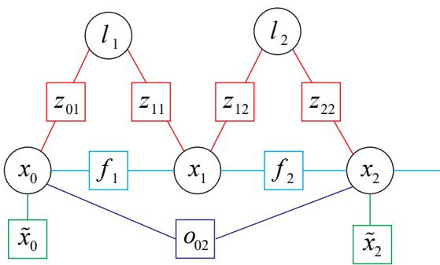

<details>
<summary>flowchart</summary>

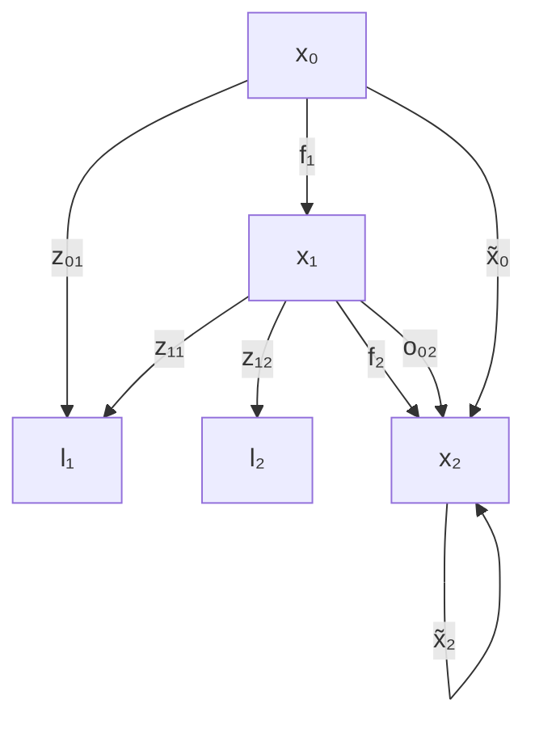
```mermaid
graph TD
  x0["x₀"] -->|z₀₁| l1["l₁"]
  x0 -->|f₁| x1["x₁"]
  x0 -->|x̃₀| x2["x₂"]
  x1 -->|z₁₁| l1
  x1 -->|z₁₂| l2["l₂"]
  x1 -->|f₂| x2
  x1 -->|o₀₂| x2
  x2 -->|x̃₂| x2
```
</details>

图 11-7 更加实际的一个因子图。我们添加了回环因子（深蓝色）和先验因子（绿色）。

## 11.3.3 增量特性

然而，到现在为止，从优化角度来看，优化一个因子图和普通的图优化并没有太大的区别——因为我们最后面对的都是一个最小二乘问题，不断地寻找梯度，使目标函数下降。因子图优化的稀疏性也与图优化类似，我们可以通过稀疏 QR 分解、Schur 补或 Cholesky分解，加速对因子图优化的求解。所以我们不禁疑惑：因子图优化是否就是普通图优化换了种说法呢？事情并不完全是这样。

Kaess 等人提出的 iSAM（inremental Smooth and Mapping）[83] 中，对因子图进行更加精细的处理，使得它可以增量式地处理后端优化。回忆第六章的内容，我们知道，在普通的图优化中，最终要计算的是一个增量式方程。即如何调整目标函数：

$$
J (\boldsymbol {x}) = \sum_ {k} \boldsymbol {e} _ {v, k} ^ {T} \boldsymbol {R} _ {k} ^ {- 1} \boldsymbol {e} _ {v, k} + \sum_ {k} \sum_ {j} \boldsymbol {e} _ {y, k, j} ^ {T} \boldsymbol {Q} _ {k, j} ^ {- 1} \boldsymbol {e} _ {y, k, j}. \tag {11.19}
$$

中的优化变量，使目标函数下降。无论采用哪种梯度下降策略，最后我们将碰到一个形如

$$
\boldsymbol {H} \Delta \boldsymbol {x} = \boldsymbol {g}. \tag {11.20}
$$

的线性方程需要求解。上一讲，我们介绍了利用该方程中的稀疏性，加速它的求解过程。然而，考虑到图优化并不是固定的，当机器人运动时，新的节点和边将被加入图中，使得它的规模不断增长。那么问题来了：是否每次新加一个节点，我们就要重新计算一遍所有节点的更新量呢？——包括雅可比的求取（或称线性化）和更新方程的计算。

显然，这样做是不经济的，我们以图 11-8 为例来解释增量更新的情况。这是一个位姿图。当我们按照里程计方式往里面添加节点时，受影响的节点可以近似地看成只有最后一个与之相连的节点，而早先节点的估计值，可以近似地看成没有发生变化。因此就没必要对它们进行优化。为什么要说近似呢？因为实际上新增节点还是会对之前的估计产生影响的，只是对最近的数据影响最大，对较远的数据影响很小，可以忽略掉。如果认为增量特性可行，那么这件事情可以为我们省掉大量的计算——至少我们不必在每次新增节点时，对整个图进行优化。不过，如果按照回环检测的方式添加节点，那么受影响的范围，应该是回环开始到当前帧这一段中的所有节点，也就是整段轨迹都可能被重新调整。这虽然加大了计算量，然而我们依然无需优化整张图，因为回环之外的节点是不受影响的。综上所述，我们发现，在往图中添加节点时，通过分析受影响的区域，可以（直观上）减少一些没必要的计算，加速后端优化流程。

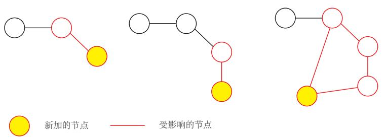

<details>
<summary>flowchart</summary>


```mermaid
graph TD
  A["○"] --> B["○"]
  B --> C["●"]
  C --> D["○"]
  D --> E["○"]
  E --> F["●"]
  F --> G["○"]
  G --> H["○"]
  H --> I["●"]
  I --> J["○"]
  J --> K["○"]
  K --> L["●"]
  L --> M["○"]
  M --> N["○"]
  N --> O["●"]
  O --> P["○"]
  P --> Q["○"]
  Q --> R["●"]
  R --> S["○"]
  S --> T["○"]
  T --> U["●"]
  U --> V["○"]
  V --> W["○"]
  W --> X["●"]
  X --> Y["○"]
  Y --> Z["○"]
  Z --> AA["●"]
  AA --> AB["○"]
  AB --> AC["○"]
  AC --> AD["●"]
  AD --> AE["○"]
  AE --> AF["○"]
  AF --> AG["●"]
  AG --> AH["○"]
```
</details>

图 11-8 增量更新示意图。黄色节点为每次新加入的节点，红色为受影响的节点。

在此思想的基础上，Kaess 等人提出的增量式因子图优化，一定程度上解决了上面的问题。从技术层面上来看，我们希望在每次优化中，保存一些中间结果；而当新的变量和因子加入时，首先分析它们因子图之间的连接和影响关系，考虑之前存储的信息有哪些可以继续利用，哪些必须重新计算，最后处理对增量的优化。话虽如此，由于具体的操作步骤需要介绍大量的技术细节，且牵涉到了概率图理论的知识，超出了本书的讨论范围。所以本节就作为可选阅读材料，提供给读者。有兴趣的读者可以阅读 iSAM，iSAM2 等原始论文来了解它的细节处理。最后，尽管有增量分析，但我们必须清楚这里的受影响节点亦是近似的，所以在实际操作中，当图的规模发生一定程度的改变时，我们需要再做一次全图优化。

## 11.4 \* 实践：gtsam

## 11.4.1 安装 gtsam 4.0

下面，我们演示一个用因子图进行位姿图优化的例子。我们仍使用前面“球”的数据，不同的是，这次用因子图来优化它，而不是 g2o 中的位姿图。我们将使用 Gtsam[87]，它是一个基于因子图优化的 SLAM 后端库，理论来自 [83, 84]。我们将在它的基础上，对上节“球”的例子进行优化。

gtsam 最新版本为 4.0，位于 https://bitbucket.org/gtborg/gtsam。你可以输入

以下命令下载它：

```txt
git clone https://bitbucket.org/gtborg/gtsam.git
```

由于 gtsam 比较大，我们没有在 3rdparty 文件夹中提供。与以往遇到的库一样，gtsam 亦是一个 cmake 工程，我们按照 cmake 的方式来编译安装它。gtsam 的依赖项比较少，主要是 Eigen 和 tbb 库。如果读者跟着本书一路走来，那么大多数库应该已经安装好了，只需安装 tbb 库即可：

```txt
sudo apt-get install libtbb-dev
```

然后，使用 cmake 命令对 gtsam 进行编译安装，这里不再赘述。gtsam 库比较大，集成了许多与因子图相关的内容，甚至底层的矩阵、李代数运算，所以编译安装会比较费时，请读者耐心等待。安装完成后，可以在/usr/local/include 中找到头文件，在/usr/local/lib下找到它的库文件。gtsam 的库文件比较简单，仅由一个 libgtsam.so 组成——所以你应该知道如何在自己的工程中书写 CMakeLists.txt 来调用 gtsam 了吧？

## 11.4.2 位姿图优化

下面我们来演示“球”的例子。与前面的实验一样，我们从 sphere.g2o 文件中读取节点和边的信息，转换为因子图交给 gtsam 处理，然后，把优化结果重新写到 g2o 文件，并“伪装”成 g2o 的节点和边以便显示。虽然这似乎没有体现出 gtsam 的“增量”特性，但至少我们可以通过这个例子体验一下它的用法。

slambook/ch11/pose\_graph\_gtsam.cpp  
```cpp
#include <iostream>
#include <fstream>
#include <string>
#include <Eigen/Core>

#include <sophus/se3.h>
#include <sophus/so3.h>

#include <gtsam/slam/dataset.h>
#include <gtsam/slam/BetweenFactor.h>
#include <gtsam/slam/PriorFactor.h>
#include <gtsam/nonlinear/GaussNewtonOptimizer.h>
#include <gtsam/nonlinear/LevenbergMarquardtOptimizer.h>

using namespace std;
using Sophus::SE3;
using Sophus::S03;
```

```cpp
c
/**********************************************************************
* 本程序演示如何用 gtsam 进行位姿图优化
* sphere.g2o 是人工生成的一个 Pose graph，我们来优化它。
* 与 g2o 相似，在 gtsam 中添加的是因子，相当于误差
* ******************************/
int main ( int argc, char** argv )
{
    if ( argc != 2 )
    {
    cout<<"Usage: pose_graph_gtsam sphere.g2o"<<endl;
    return 1;
    }
    ifstream fin ( argv[1] );
    if ( !fin )
    {
    cout<<"file "<<argv[1]<<" does not exist."<<endl;
    return 1;
    }

    gtsam::NonlinearFactorGraph::shared_ptr graph ( new gtsam::NonlinearFactorGraph ); // gtsam的因子图
    gtsam::Values::shared_ptr initial ( new gtsam::Values ); // 初始值
    // 从g2o文件中读取节点和边的信息
    int cntVertex=0, cntEdge = 0;
    cout<<"reading from g2o file"<<endl;

    while ( !fin.eof() )
    {
    string tag;
    fin>>tag;
    if ( tag == "VERTEX_SE3:QUAT" )
    {
    // 顶点
    gtsam::Key id;
    fin>>id;
    double data[7];
    for ( int i=0; i<7; i++ ) fin>>data[i];
    // 转换至gtsam的Pose3
    gtsam::Rot3 R = gtsam::Rot3::Quaternion ( data[6], data[3], data[4], data[5] );
    gtsam::Point3 t ( data[0], data[1], data[2] );
    initial->insert ( id, gtsam::Pose3 ( R,t ) ); // 添加初始值
    cntVertex++;
    }
    else if ( tag == "EDGE_SE3:QUAT" )
    {
    // 边，对应到因子图中的因子
    gtsam::Matrix m = gtsam::I_6x6; // 信息矩阵
    gtsam::Key id1, id2;
    fin>>id1>>id2;
    }
}
```

```cpp
double data[7];
for ( int i=0; i<7; i++) fin>>data[i];
gtsam::Rot3 R = gtsam::Rot3::Quaternion ( data[6], data[3], data[4], data[5] );
gtsam::Point3 t ( data[0], data[1], data[2] );
for ( int i=0; i<6; i++)
    for ( int j=i; j<6; j++)
    {
    double mij;
    fin>>mij;
    m ( i,j ) = mij;
    m ( j,i ) = mij;
    }

// g2o 的信息矩阵定义方式与 gtsam 不同，这里对它进行修改
gtsam::Matrix mgtsam = gtsam::I_6x6;
mgtsam.block<3,3> ( 0,0 ) = m.block<3,3> ( 3,3 ); // cov rotation
mgtsam.block<3,3> ( 3,3 ) = m.block<3,3> ( 0,0 ); // cov translation
mgtsam.block<3,3> ( 0,3 ) = m.block<3,3> ( 0,3 ); // off diagonal
mgtsam.block<3,3> ( 3,0 ) = m.block<3,3> ( 3,0 ); // off diagonal

// 高斯噪声模型
gtsam::SharedNoiseModel model = gtsam::noiseModel::Gaussian::Information ( mgtsam );
gtsam::NonlinearFactor::shared_ptr factor (
    new gtsam::BetweenFactor<gtsam::Pose3> ( id1, id2, gtsam::Pose3 ( R,t ), model ) // 添加一个因子
);
graph->push_back ( factor );
cntEdge++;
}
if ( !fin.good() )
break;
}

cout<<"read total "<<cntVertex<<" vertices, "<<cntEdge<<" edges.""<<endl;
// 固定第一个顶点，在 gtsam 中相当于添加一个先验因子
gtsam::NonlinearFactorGraph graphWithPrior = *graph;
gtsam::noiseModel::Diagonal::shared_ptr priorModel =
gtsam::noiseModel::Diagonal::Variances (
    ( gtsam::Vector ( 6 ) <<1e-6, 1e-6, 1e-6, 1e-6, 1e-6, 1e-6 ).finished( )
);
gtsam::Key firstKey = 0;
for ( const gtsam::Values::ConstKeyValuePair& key_value: *initial )
{
    cout<<"Adding prior to g2o file "<<endl;
    graphWithPrior.add ( gtsam::PriorFactor<gtsam::Pose3> (
    key_value.key, key_value.value.cast<gtsam::Pose3>( ), priorModel )
);
    break;
}
```

```cpp
// 开始因子图优化，配置优化选项
cout<<"optimizing the factor graph"<<endl;
// 我们使用 LM 优化
gtsam::LevenbergMarquardtParams params_lm;
params_lm.setVerbosity("ERROR");
params_lmsetMaxMaxIterations(20);
params_lm.setLinearSolverType("MULTIFRONTAL_QR");
gtsam::LevenbergMarquardtOptimizer optimizer_LM( graphWithPrior, *initial, params_lm );

// 你可以尝试下 GN
// gtsam::GaussNewtonParams params_gn;
// params_gn.setVerbosity("ERROR");
// params_gnsetMaxMaxIterations(20);
// params_gn.setLinearSolverType("MULTIFRONTAL_QR");
// gtsam::GaussNewtonOptimizer optimizer ( graphWithPrior, *initial, params_gn );

gtsam::Values result = optimizer_LM.optimize();
cout<<"Optimization complete"<<endl;
cout<<"initial error: "<<graph->error (*initial) <<endl;
cout<<"final error: "<<graph->error ( result ) <<endl;

cout<<"done. write to g2o ... "<<endl;
// 写入 g2o 文件，同样伪装成 g2o 中的顶点和边，以便用 g2o_viewer 查看。
// 顶点咯
ofstream fout ( "result_gtsam.g2o" );
for ( const gtsam::Values::ConstKeyValuePair& key_value: result )
{
    gtsam::Pose3 pose = key_value.value.cast<gtsam::Pose3>();
    gtsam::Point3 p = pose.translation();
    gtsam::Quaternion q = pose.rotation().toQuaternion();
    fout<<"VERTEX_SE3:QUAT "<<key_value.key<<" "
    <p.x()<<" "<<p.y()<<" "<<p.z()<<" "
    <q.x()<<" "<<q.y()<<" "<<q.z()<<" "<<q.w()<<" "<<endl;
}
// 边咯
for ( gtsam::NonlinearFactor::shared_ptr factor: *graph )
{
    gtsam::BetweenFactor<gtsam::Pose3>::shared_ptr f = dynamic_pointer_cast<gtsam::BetweenFactor<gtsam::Pose3>>( factor );
    if ( f )
    {
    gtsam::SharedNoiseModel model = f->noiseModel();
    gtsam::noiseModel::Gaussian::shared_ptr gaussianModel = dynamic_pointer_cast<gtsam::noiseModel::Gaussian>( model );
    if ( gaussianModel )
    {
    // write the edge information
    gtsam::Matrix info = gaussianModel->R().transpose() * gaussianModel->R();
    gtsam::Pose3 pose = f->measured();
    gtsam::Point3 p = pose.translation();
```

```cpp
gtsam::Quaternion q = pose.rotation().toQuaternion();
fout<<"EDGE_SE3:QUAT "<<f->key1()<<" "<<f->key2()<<" "
    <<p.x() <<" "<<p.y() <<" "<<p.z() <<" "
    <<q.x() <<" "<<q.y() <<" "<<q.z() <<" "<<q.w() <<" ";
gtsam::Matrix infoG2o = gtsam::I_6x6;
infoG2o.block(0,0,3,3) = info.block(3,3,3,3); // cov translation
infoG2o.block(3,3,3,3) = info.block(0,0,3,3); // cov rotation
infoG2o.block(0,3,3,3) = info.block(0,3,3,3); // off diagonal
infoG2o.block(3,0,3,3) = info.block(3,0,3,3); // off diagonal
for ( int i=0; i<6; i++ )
for ( int j=i; j<6; j++ )
{
    fout<<infoG2o(i,j)<<" ";
}
fout<<endl;
}
}
}
fout.close();
cout<<"done."<<endl;
}
```

在演示程序中，我们以文本方式读取一个 g2o 文件，并完成了向 gtsam 接口的转换。请留意代码中 g2o 与 gtsam 的异同点。比如说相同的地方：

1. 由于它们本质上都是同一个最小二乘优化问题，所以我们要设置的东西也是类似的。简而言之，即顶点（对应到因子图中的变量）的初值，以及边（对应到因子）的观测值，还有噪声大小。  
2. 在优化设置方面，同样你可以使用 G-N 或 L-M，并配置详细的参数，只不过接口略有不同。g2o 通过构建优化算法对象来实现，而 gtsam 则是传入优化参数。

相异的地方：

1. g2o 的噪声模型和 gtsam 稍有不同，我们在代码中作了一下转换。

2. 在稀疏化的处理方面，gtsam 可选择使用 QR 分解或 Cholesky 分解，尽管我们没有详细解释这方面的具体过程。读者可以追踪参数的配置方式，看看 gtsam 提供哪些求解方法。由于单纯的 Pose Graph 没有太多稀疏性可以利用，所以这里区别不大。

最后，我们把 gtsam 的优化结果转换为 g2o 的输出文件，同样可以用 g2o\_viewer 查看此结果，如图11-9所示。下面是终端输出的优化信息：

```shell
1 $ build/pose_graph_gtsam sphere.g2o
2 reading from g2o file
```

```txt
3 read total 2500 vertices, 9799 edges.
4 Adding prior to g2o file
5 optimizing the factor graph
6 Initial error: 4.7724e+09
7 newError: 6.07118e+08
8 errorThreshold: 6.07118e+08 > 0
9 absoluteDecrease: 4165284178.46 >= 1e-05
10 relativeDecrease: 0.872785675288 >= 1e-05
11 // 中间略
12 newError: 63793.9289983
13 errorThreshold: 63793.9289983 > 0
14 absoluteDecrease: 0.279685092828 >= 1e-05
15 relativeDecrease: 4.38417684928e-06 < 1e-05
16 converged
17 errorThreshold: 63793.9289983 <? 0
18 absoluteDecrease: 0.279685092828 <? 1e-05
19 relativeDecrease: 4.38417684928e-06 <? 1e-05
20 iterations: 5 <? 20
21 Optimization complete
22 initial error: 4772402087.24
23 final error: 63793.9289982
24 done. write to g2o ...
25 done.
```

我们发现，虽然设置了最大迭代次数为 20 次，但 gtsam 只迭代了 5 次后，算法就收敛了。同样，由于 gtsam 的误差定义方式与 g2o 不同，所以这里直接比较误差大小没有太大意义。如果用 g2o\_viewer 打开 result\_gtsam.g2o 文件并选择优化，就会发现在 g2o 度量下的误差大约为 44360 左右，和我们上一节使用李代数优化结果一致，但 gtsam 的迭代次数更少一些。

有点遗憾的是，本例没有体现 gtsam 的增量特性。如果我们把 g2o 文件中的节点和边按照时间排序，然后一个一个的放入 gtsam 中，可能对它的增量特征会有更好的表述。我们把这个实验留作习题，交给读者来完成。

## 习题

1. 如果将位姿图中的误差定义为： $\Delta \pmb { \xi } _ { i j } = \pmb { \xi } _ { i } \circ \pmb { \xi } _ { j } ^ { - 1 }$ ，推导按照此定义下的左乘扰动雅可比矩阵。  
2. 参照 $\mathrm { g 2 o }$ 的程序，在 Ceres 中实现对“球”位姿图的优化。  
3. 对“球”中的信息按照时间排序，分别喂给 g2o 和 gtsam 优化，比较它们的性能差异。  
4. \* 阅读 isam 相关论文，理解它是如何实现增量式优化的。

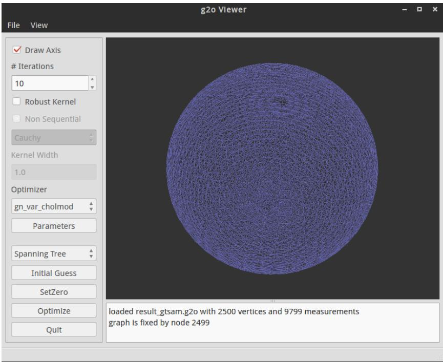

<details>
<summary>text_image</summary>

g2o Viewer
File View
✓ Draw Axls
# Iterations
10
□ Robust Kernel
□ Non Sequential
Cauchy
Kernel Width
1.0
Optimizer
gn_var_cholmod
Parameters
Spanning Tree
Initial Guess
SetZero
Optimize
Quit
loaded result_gtsam.g2o with 2500 vertices and 9799 measurements
graph is fixed by node 2499
</details>

图 11-9 gtsam 的优化结果。

## 第 12 讲

# 回环检测

## 本节目标

1. 理解回环检测的必要性。  
2. 掌握基于词袋的外观式回环检测。  
3. 通过 DBoW3 的实验，学习词袋模型的实际用途。

本讲中，我们来介绍 SLAM 中另一个主要模块：回环检测。我们知道 SLAM 主体（前端、后端）主要的目的在于估计相机运动，而回环检测模块，无论是目标上还是方法上，都与前面讲的内容相差较大，所以通常被认为是一个独立的模块。我们将介绍主流视觉 SLAM中检测回环的方式：词袋模型，并通过 DBoW 库上的程序实验，使读者得到更加直观的理解。

## 12.1 回环检测概述

## 12.1.1 回环检测的意义

我们已然介绍了前端和后端：前端提供特征点的提取和轨迹、地图的初值，而后端负责对这所有的数据进行优化。然而，如果像 VO 那样仅考虑相邻时间上的关联，那么，之前产生的误差将不可避免地累计到下一个时刻，使得整个 SLAM 会出现累积误差。长期估计的结果将不可靠，或者说，我们无法构建全局一致的轨迹和地图。

举例来说，假设我们在前端提取了特征，然后忽略掉特征点，在后端使用 Pose Graph优化整个轨迹，如图 12-1(a) 所示。由于前端给出的只是局部的位姿间约束，比方说，可能是 ${ \pmb x } _ { 1 } - { \pmb x } _ { 2 } , { \pmb x } _ { 2 } - { \pmb x } _ { 3 }$ 等等。但是，由于 $\scriptstyle { \mathbf { { \mathscr { x } } } } _ { 1 }$ 的估计存在误差，而 $\mathbf { x } _ { 2 }$ 是根据 $\scriptstyle { \mathbf { { \vec { x } } } } _ { 1 }$ 决定的， $\mathbf { x } _ { 3 }$ 又是由 $\mathbf { x } _ { 2 }$ 决定的。以此类推，误差就会被累积起来，使得后端优化的结果如图 12-1 (b)所示，慢慢地趋向不准确。

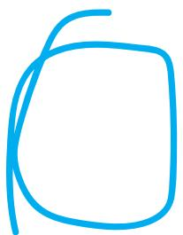

<details>
<summary>natural_image</summary>

Simple blue line drawing of a square with an extended top edge (no text or symbols)
</details>

(a)

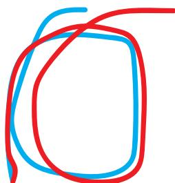

<details>
<summary>natural_image</summary>

Abstract line drawing with red and blue curved strokes on white background (no text or symbols)
</details>

(b)

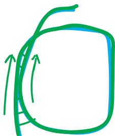

<details>
<summary>natural_image</summary>

Simple green line drawing of a square with upward arrows, no text or symbols present
</details>

图 12-1 漂移示意图。（a）真实轨迹；（b）由于前端只给出相邻帧间的估计，优化后的Pose Graph 出现漂移；（c）添加回环检测后的 Pose Graph 可以消除累积误差。

虽然后端能够估计最大后验误差，但所谓“好模型架不住烂数据”，只有相邻关键帧数据时，我们能做的事情并不很多，也无从消除累积误差。但是，回环检测模块，能够给出除了相邻帧之外的，一些时隔更加久远的约束：例如 ${ \pmb x } _ { 1 } - { \pmb x } _ { 1 0 0 }$ 之间的位姿变换。为什么它们之间会有约束呢？这是因为我们察觉到相机经过了同一个地方，采集到了相似的数据。而回环检测的关键，就是如何有效地检测出相机经过同一个地方这件事。如果我们能够成功地检测这件事，就可以为后端的 Pose Graph 提供更多的有效数据，使之得到更好的估计，特别是得到一个全局一致（Global Consistent）的估计。由于 Pose Graph 可以看成一个质点——弹簧系统，所以回环检测相当于在图像中加入了额外的弹簧，提高了系统稳定性。读者亦可直观地想象成回环边把带有累计误差的边“拉”到了正确的位置——如果回环本身是正确的话。

回环检测对于 SLAM 系统意义重大。它关系到我们估计的轨迹和地图在长时间下的正确性。另一方面，由于回环检测提供了当前数据与所有历史数据的关联，在跟踪算法丢失之后，我们还可以利用回环检测进行重定位。因此，回环检测对整个 SLAM 系统精度与鲁棒性的提升，是非常明显的。甚至在某些时候，我们把仅有前端和局部后端的系统称为VO，而把带有回环检测和全局后端的称为 SLAM。

## 12.1.2 方法

下面我们来考虑回环检测如何实现的问题。

最简单的方式就是对任意两张图像都做一遍特征匹配，根据正确匹配的数量确定哪两个图像存在关联——这确实是一种朴素且有效的思想。缺点在于，我们盲目地假设了“任意两个图像都可能存在回环”，使得要检测的数量实在太大：对于 N 个可能的回环，我们要检测 $C _ { N } ^ { 2 }$ 那么多次，这是 $O ( N ^ { 2 } )$ 的复杂度，随着轨迹变长增长太快，在大多数实时系统当中是不实用的。另一种朴素的方式是，随机抽取历史数据并进行回环检测，比如说在n 帧当中随机抽 5 帧与当前帧比较。这种做法能够维持常数时间的运算量，但是这种盲目试探方法在帧数 N 增长时，抽到回环的几率又大幅下降，使得检测效率不高。

上面说的朴素思路都过于粗糙。尽管随机检测在有些实现中确实有用 [88]，但我们至少希望有一个“哪处可能出现回环”的预计，才好不那么盲目地去检测。这样的方式大体分为两种思路：基于里程计的几何关系（Odometry based），或基于外观（Appearance based）。基于几何关系是说，当我们发现当前相机运动到了之前的某个位置附近时，检测它们有没有回环关系 [89]——这自然是一种直观的想法，但是由于累积误差的存在，我们往往没法正确地发现“运动到了之前的某个位置附近”这件事实，回环检测也无从谈起。因此，这种做法在逻辑上存在一点问题，因为回环检测的目标在于发现“相机回到之前位置”的事实，从而消除累计误差。而基于几何关系的做法假设了“相机回到之前位置附近”，才能检测回环。这是有倒果为因的嫌疑的，因而也无法在累计误差较大时工作 [12]。

另一种方法是基于外观的。它和前端后端的估计都无关，仅根据两张图像的相似性确定回环检测关系。这种做法摆脱了累计误差，使回环检测模块成为 SLAM 系统中一个相对独立的模块（当然前端可以为它提供特征点）。自 21 世纪初被提出以来，基于外观的回环检测方式能够有效地在不同场景下工作，成为了视觉 SLAM 中主流的做法，并被应用于实际的系统中去 [90, 80, 73]。

在基于外观的回环检测算法中，核心问题是如何计算图像间的相似性。比如对于图像A 和图像 B，我们要设计一种方法，计算它们之间的相似性评分： $s ( A , B )$ 。当然这个评分会在某个区间内取值，当它大于一定量后我们认为出现了一个回环。读者可能会有疑问：计算两个图像之间的相似性很困难吗？例如直观上看，图像能够表示成矩阵，那么直接让两个图像相减，然后取某种范数行不行呢：

$$
s (\boldsymbol {A}, \boldsymbol {B}) = \| \boldsymbol {A} - \boldsymbol {B} \|. \tag {12.1}
$$

为什么我们不这样做？

1. 首先，前面也说过，像素灰度是一种不稳定的测量值，它严重受环境光照和相机曝光的影响。假设相机未动，我们打开了一支电灯，那么图像会整体变亮一些。这样，即使对于同样的数据，我们都会得到一个很大的差异值。  
2. 另一方面，当相机视角发生少量变化时，即使每个物体的光度不变，它们的像素也会在图像中发生位移，造成一个很大的差异值。

由于这两种情况的存在，实际当中，即使对于非常相似的图像，A−B 也会经常得到一个（不符合实际的）很大的值。所以我们说，这个函数不能很好的反映图像间的相似关系。这里牵涉到一个“好”和“不好”的定义问题。我们要问，怎样的函数能够更好地反映相似关系，而怎样的函数不够好呢？——从这里可以引出感知偏差（Perceptual Aliasing）和感知变异（Perceptual Variability）两个概念。现在我们来更详细地讨论一下。

## 12.1.3 准确率和召回率

从人类的角度看，（至少我们自认为）我们能够以很高的精确度，感觉到“两张图像是否相似”或“这两张照片是从同一个地方拍摄的”这件事实，但由于目前尚未知道人脑的工作原理，我们无法清楚地描述自己是如何完成这件事的。从程序角度看，我们希望程序算法能够得出和人类，或者和事实一致的判断。当我们觉得，或者事实上就是，两张图像从同一个地方拍摄，那么回环检测算法也应该给出“这是回环”的结果。反之，如果我们觉得，或事实上是，两张图像是从不同地方拍摄的，那么程序也应该给出“这不是回环”的判断。①当然，程序的判断并不总是与我们人类想法一致，所以可能出现表 12.1.3 中的四种情况：

表 12-1 回环检测的结果分类

<table><tr><td>算法\事实</td><td>是回环</td><td>不是回环</td></tr><tr><td>是回环</td><td>真阳性(True Positive)</td><td>假阳性(False Positive)</td></tr><tr><td>不是回环</td><td>假阴性(False Negative)</td><td>真阴性(True Negative)</td></tr></table>

这里阴性/阳性的说法是借用了医学上的说法。假阳性（False Positive）又称为感知偏差，而假阴性（False Negative）称为感知变异。为方便书写，记缩写 TP 为 True Positive，其余类推。由于我们希望算法和人类的判断一致，所以希望 TP 和 TN 要尽量的高，而 FP和 FN 要尽可能的低。所以，对于某种特定算法，我们可以统计它在某个数据集上的 TP、TN、FP、FN 的出现次数，并计算两个统计量：准确率和召回率（Precision & Recall）。

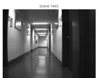

<details>
<summary>natural_image</summary>

Black-and-white photo of a long, empty corridor with no visible text or symbols
</details>

䘀愀氀猀攀倀漀猀椀琀椀瘀攀

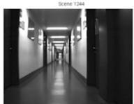

<details>
<summary>natural_image</summary>

Black-and-white photo of a long, empty corridor with no visible text or symbols
</details>

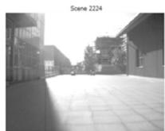

<details>
<summary>natural_image</summary>

Black-and-white photo of a paved walkway with tiled pavement and buildings in the background (no visible text or symbols)
</details>

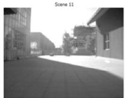

<details>
<summary>natural_image</summary>

Black-and-white street scene with paved pavement and buildings, no visible text or symbols
</details>

䘀愀氀猀攀一攀最愀琀椀瘀攀  
图 12-2 假阳性与假阴性的例子。左侧为假阳性，两个图像看起来很像，但并非同一个走廊；右侧为假阴性，由于光照变化，同一个地方不同时刻的照片看起来很不一样。

$$
\text { Precision } = T P / (T P + F P), \quad \text { Recall } = T P / (T P + F N). \tag {12.2}
$$

从公式字面意义上来看，准确率描述的是，算法提取的所有回环中，确实是真实回环的概率。而召回率则是说，在所有真实回环中，被正确检测出来的概率。为什么取这两个统计量呢？因为它们有一定的代表性，并且通常来说是一个矛盾。

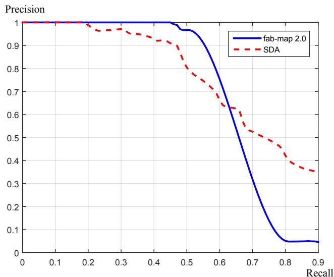

<details>
<summary>line chart</summary>

| Recall | fab-map 2.0 | SDA    |
| ------ | ----------- | ------ |
| 0.0    | 1.0         | 1.0    |
| 0.1    | 1.0         | 1.0    |
| 0.2    | 1.0         | 1.0    |
| 0.3    | 1.0         | 0.98   |
| 0.4    | 1.0         | 0.95   |
| 0.5    | 0.98        | 0.92   |
| 0.6    | 0.75        | 0.65   |
| 0.7    | 0.45        | 0.55   |
| 0.8    | 0.05        | 0.40   |
| 0.9    | 0.05        | 0.35   |
</details>

图 12-3 准确率-召回率曲线的例子 [91]。随着召回率的上升，检测条件变得宽松，准确率随之下降。好的算法在较高召回率情况下仍能保证较好的准确率。

一个算法往往有许多的设置参数。比方说，当我们提高某个阈值时，算法可能变得更加“严格”——它检出更少的回环，使准确率得以提高。但同时，由于检出的数量变少了，许多原本是回环的地方就可能被漏掉了，导致召回率的下降。反之，如果我们选择更加宽松的配置，那么检出的回环数量将增加，得到更高的召回率，但其中可能混杂了一些不是回环的情况，于是准确率下降了。

为了评价算法的好坏，我们会测试它在各种配置下的 P 和 R 值，然后做出一条Precision-Recall 曲线。当用召回率为横轴，用准确率为纵轴时，我们会关心整条曲线偏向右上方的程度、100% 准确率下的召回率，或者 50% 召回率时候的准确率，作为评价算法的指标。不过请注意，除去一些“天壤之别”的算法，我们通常不能一概而论算法 A 就是优于算法 B 的。我们可能说 A 在准确率较高时还有很好的召回率，而 B 在 70% 召回率的情况下还能保证较好的准确率，诸如此类的评价。

值得一提的是，在 SLAM 中，我们对准确率要求更高，而对召回率则相对宽容一些。由于假阳性的（检测结果是而实际不是的）回环将在后端的 Pose Graph 中添加根本错误的边，有些时候会导致优化算法给出完全错误的结果。想象一下，如果 SLAM 程序错误地将所有的办公桌当成了同一张，那建出来的图会怎么样呢？——你可能会看到走廓不直了，墙壁被交错在一起了，最后整个地图都失效了。而相比之下，召回率低一些，则顶多有部分的回环没有被检测到，地图可能受一些累积误差的影响——然而仅需一两次回环就可以完全消除它们了。所以说在选择回环检测算法时，我们更倾向于把参数设置地更严格一些，或者在检测之后再加上回环验证的步骤。

那么，回到之前的问题，为什么不用 A − B 来计算相似性呢？我们会发现它的准确率和召回率都很差，可能出现大量的 False Positive 或 False Negative 的情况，所以说这样做“不好”。那么，什么方法更好一些呢？

## 12.2 词袋模型

既然直接用两张图像相减的方式不够好，那么我们需要一种更加可靠的方式。结合前面几章的内容，一种直观的思路是：为何不像 VO 那样特征点来做回环检测呢？和 VO 一样，我们对两个图像的特征点进行匹配，只要匹配数量大于一定值，就认为出现了回环。进一步，根据特征点匹配，我们还能计算出这两张图像之间的运动关系。当然这种做法会存在一些问题，例如特征的匹配会比较费时、当光照变化时特征描述可能不稳定等，但离我们要介绍的词袋模型已经很相近了。我们先来讲词袋的做法，再来讨论数据结构之类的实现细节。

词袋，也就是 Bag-of-Words（BoW），目的是用“图像上有哪几种特征”来描述一个图像。例如，如果某个照片，我们说里面有一个人、一辆车；而另一张则有两个人、一只狗。根据这样的描述，可以度量这两个图像的相似性。再具体一些，我们要做以下几件事：

1. 确定“人、车、狗”等概念——对应于 BoW 中的“单词”（Word），许多单词放在

一起，组成了“字典”（Dictionary）。

2. 确定一张图像中，出现了哪些在字典中定义的概念——我们用单词出现的情况（或直方图）描述整张图像。这就把一个图像转换成了一个向量的描述。  
3. 比较上一步中的描述的相似程度。

以上面举的例子来说，首先我们通过某种方式，得到了一本“字典”。字典上记录了许多单词，每个单词都有一定意义，例如“人”、“车”、“狗”都是记录在字典中的单词，我们不妨记为 $w _ { 1 } , w _ { 2 } , w _ { 3 }$ 。然后，对于任意图像 A，根据它们含有的单词，可记为：

$$
A = 1 \cdot w _ {1} + 1 \cdot w _ {2} + 0 \cdot w _ {3}. \tag {12.3}
$$

字典是固定的，所以只要用 $[ 1 , 1 , 0 ] ^ { T }$ 这个向量就可以表达 A 的意义。通过字典和单词，只需一个向量就可以描述整张图像了。该向量描述的是“图像是否含有某类特征”的信息，比单纯的灰度值更加稳定。又因为描述向量说的是“是否出现”，而不管它们“在哪儿出现”，所以与物体的空间位置和排列顺序无关，因此在相机发生少量运动时，只要物体仍在视野中出现，我们就仍然保证描述向量不发生变化。① 基于这种特性，我们称它为Bag-of-Words 而不是什么 List-of-Words，强调的是 Words 的有无，而无关其顺序。因此，可以说字典类似于单词的一个集合。

回到上面的例子，同理，用 $[ 2 , 0 , 1 ] ^ { T }$ 可以描述图像 B。如果只考虑“是否出现”而不考虑数量的话，也可以是 $[ 1 , 0 , 1 ] ^ { T }$ ，这时候这个向量就是二值的。于是，根据这两个向量，设计一定的计算方式，就能确定图像间的相似性了。当然如果对两个向量求差仍然有一些不同的做法，比如说对于 $\mathbf { \boldsymbol { a } } , \mathbf { \boldsymbol { b } } \in \mathbb { R } ^ { W }$ ，可以计算：

$$
s \left(\boldsymbol {a}, \boldsymbol {b}\right) = 1 - \frac {1}{W} \left\| \boldsymbol {a} - \boldsymbol {b} \right\| _ {1}. \tag {12.4}
$$

其中范数取 $L _ { 1 }$ 范数，即各元素绝对值之和。请注意在两个向量完全一样时，我们将得到 1；完全相反时（a 为 0 的地方 b 为 1）得到 0。这样就定义了两个描述向量的相似性，也就定义了图像之间的相似程度。

接下来的问题是什么呢？

1. 首先，我们虽然清楚了字典的定义方式，但它到底是怎么来的呢？  
2. 如果我们能够计算两个图像间的相似程度评分，是否就足够判断回环了呢？

所以接下来，我们首先介绍字典的生成方式，然后介绍如何利用字典，实际地计算两个图像间的相似性。

## 12.3 字典

## 12.3.1 字典的结构

按照前面的介绍，字典由很多单词组成，而每一个单词代表了一个概念。一个单词与一个单独的特征点不同，它不是从单个图像上提取出来的，而是某一类特征的组合。所以，字典生成问题类似于一个聚类（Clustering）问题。

聚类问题是无监督机器学习（Unsupervised ML）中一个特别常见的问题，用于让机器自行寻找数据中的规律的问题。BoW 的字典生成问题亦属于其中之一。首先，假设我们对大量的图像提取了特征点，比如说有 N 个。现在，我们想找一个有 k 个单词的字典，每个单词可以看作局部相邻特征点的集合，应该怎么做呢？这可以用经典的 K-means（K 均值）算法 [92] 解决。

K-means 是一个非常简单有效的方法，因此在无监督学习中广为使用，我们稍加介绍它的原理。简单来说，当我们有 N 个数据，想要归成 k 个类，那么用 K-means 来做，主要有以下几个步骤：

1. 随机选取 k 个中心点： $c _ { 1 } , \ldots , c _ { k } ;$  
2. 对每一个样本，计算与每个中心点之间的距离，取最小的作为它的归类；  
3. 重新计算每个类的中心点。  
4. 如果每个中心点都变化很小，则算法收敛，退出；否则返回 1。

K-means 的做法是朴素且简单有效的，不过也存在一些问题，例如需要指定聚类数量、随机选取中心点使得每次聚类结果都不相同以及一些效率上的问题。随后研究者们亦开发出层次聚类法、K-means++[93] 等算法以弥补它的不足，不过这都是后话，我们就不详细讨论了。总之，根据 K-means，我们可以把已经提取的大量特征点聚类成一个含有 k 个单词的字典了。现在的问题，变为如何根据图像中某个特征点，查找字典中相应的单词？

仍然有朴素的思想：只要和每个单词进行比对，取最相似的那个就可以了嘛——这当然是简单有效的做法。然而，考虑到字典的通用性①，我们通常会使用一个较大规模的字典，以保证当前使用环境中的图像特征都曾在字典里出现过，或至少有相近的表达。如果你觉得对 10 个单词一一比较不是什么麻烦事，但对于一万个呢？十万个呢？

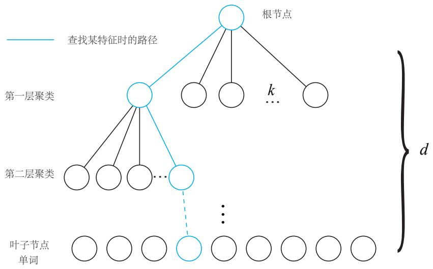

<details>
<summary>flowchart</summary>


```mermaid
graph TD
  A["根节点"] --> B["第一层聚类"]
  A --> C["第二层聚类"]
  A --> D["叶子节点单词"]
  B --> E[" "]
  B --> F[" "]
  B --> G[" "]
  B --> H["..."]
  B --> I[" "]
  C --> J[" "]
  C --> K[" "]
  C --> L[" "]
  C --> M[" "]
  C --> N[" "]
  C --> O[" "]
  C --> P[" "]
  C --> Q[" "]
  C --> R[" "]
  C --> S[" "]
  C --> T[" "]
  C --> U[" "]
  C --> V[" "]
  C --> W[" "]
  C --> X[" "]
  C --> Y[" "]
  C --> Z[" "]
  C --> AA[" "]
  C --> AB[" "]
  C --> AC[" "]
  C --> AD[" "]
  C --> AE[" "]
  C --> AF[" "]
  C --> AG[" "]
  C --> AH[" "]
  C --> AI[" "]
  C --> AJ[" "]
  C --> AK[" "]
  C --> AL[" "]
  C --> AM[" "]
  C --> AN[" "]
  C --> AO[" "]
  C --> AP[" "]
  C --> AQ[" "]
  C --> AR[" "]
  C --> AS[" "]
  C --> AT[" "]
  C --> AU[" "]
  C --> AV[" "]
  C --> AW[" "]
  C --> AX[" "]
  C --> AY[" "]
```
</details>

图 12-4 K 叉树字典示意图。训练字典时，逐层使用 K-means 聚类。根据已知特征查找单词时，亦可逐层比对，找到对应的单词。

也许读者学过数据结构，这种 O(n) 的查找算法显然不是我们想要的。如果字典排过序，那么二分查找显然可以提升查找效率，达到对数级别的复杂度。而实践当中，我们可能会用更复杂的数据结构，例如 Fabmap[94, 95, 96] 中的 Chou-Liu tree[97] 等等。但我们不想把本书写成复杂细节的集合，所以介绍另一种较为简单实用的树结构 [98]。

在 [98] 中，使用一种 k 叉树来表达字典。它的思路很简单，类似于层次聚类，是 k-means 的直接扩展。假定我们有 N 个特征点，希望构建一个深度为 d，每次分叉为 k 的树，那么做法如下（见图 12.3.1 ）①：

1. 在根节点，用 k-means 把所有样本聚成 k 类（实际中为保证聚类均匀性会使用k-means++）。这样得到了第一层。  
2. 对第一层的每个节点，把属于该节点的样本再聚成 k 类，得到下一层。  
3. 依此类推，最后得到叶子层。叶子层即为所谓的 Words。

实际上，最终我们仍在叶子层构建了单词，而树结构中的中间节点仅供快速查找时使用。这样一个 k 分支，深度为 d 的树，可以容纳 kd 个单词。另一方面，在查找某个给定特征对应的单词时，只需将它与每个中间结点的聚类中心比较（一共 d 次），即可找到最后的单词，保证了对数级别的查找效率。

## 12.3.2 实践：创建字典

既然讲到了字典生成，我们就来实际演示一下吧。前面的 VO 部分大量使用了 ORB特征描述，所以这里就来演示一下如何生成，以及如何使用 ORB 字典。

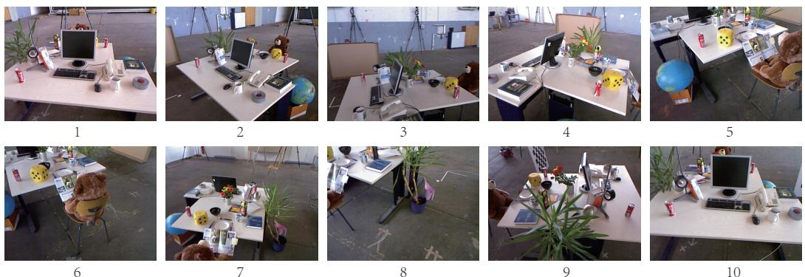  
图 12-5 演示实验中使用的十个图像，采集自不同时刻的轨迹。

本实验中，我们选取 TUM 数据集中的 10 张图像（位于 slambook/ch9/data 中，图 12.3.2 ），它们来自一次实际的相机运动轨迹。可以看出，第 1 张图像与最后一张图像明显采自同一个地方，现在我们要看程序能否检测到这件事情。根据词袋模型，我们先来生成这十张图像对应的字典。

需要声明的是，实际 BoW 使用时，字典往往是从更大的数据集中生成的，而且最好是来自目标应该环境类似的地方。我们通常使用较大规模的字典——越大代表字典单词量越丰富，容易找到与当前图像对应的单词，但也不能大到超过我们计算能力和内存。由于我不想在 github 上面存放一个很大的字典文件，所以我们暂时从十张图像训练一个小的字典。如果读者想进一步追求更好的效果，你应该下载更多的数据，训练更大的字典，程序才会实用，或者使用别人训练好的字典，但请注意字典使用的特征类型是否一致。

下面开始训练字典。首先，请安装本程序使用的 BoW 库，我们使用了 DBoW3①：https://github.com/rmsalinas/DBow3。读者也可从本书代码的 3rdparty 文件夹中找到它。它是一个 cmake 工程。鉴于我们已经编译过很多 cmake 工程了，请读者自行对它进行编译安装。

接下来考虑训练字典：

slambook/ch9/feature\_training.cpp  
```cpp
int main( int argc, char** argv )
{
    // read the image
    cout<<"reading images... "<<endl;
    vector(Mat> images;
    for ( int i=0; i<10; i++ )
    {
    string path = "./data/" + to_string(i+1) + ".png";
    images.push_back( imread(path) );
    }

    // detect ORB features
    cout<<"detecting ORB features ... "<<endl;
    Ptr< Feature2D > detector = ORB::create();
    vector(Mat> descriptors;
    for ( Mat& image:images )
    {
    vector<KeyPoint> keypoints;
    Mat descriptor;
    detector->detectAndCompute( image, Mat(), keypoints, descriptor );
    descriptors.push_back( descriptor );
    }

    // create vocabulary
    cout<<"creating vocabulary ... "<<endl;
    DBoW3::Vocabulary vocab;
    vocab.create( descriptors );
    cout<<"vocabulary info: "<<vocab<<endl;
    vocab.save( "vocabulary.yml.gz" );
    cout<<"done"<<endl;

    return 0;
}
```

DBoW3 的使用方式非常容易。我们对十张目标图像提取 ORB 特征并存放至 vector容器中，然后调用 DBoW3 的字典生成接口即可。在 DBoW3::Vocabulary 对象的构造函数中，我们能够指定树的分叉数量以及深度，不过这里使用了默认构造函数，也就是 k =10, d = 5。这是一个小规模的字典，最大能容纳 10000 个单词。对于图像特征，我们亦使用默认参数，即每张图像 500 个特征点。最后我们把字典存储为一个压缩文件。

运行此程序，你将看到输出的字典信息：

```txt
$ build/feature_training
reading images...
detecting ORB features ...
creating vocabulary ...
vocabulary info: Vocabulary: k = 10, L = 5, Weighting = tf-idf, Scoring = L1-norm, Number of words = 4983
done
```

我们看到输出的字典的信息：分支数量 k 为 10，深度 L 为 $5 ^ { \textregistered }$ ，单词数量为 4983，没有充满最大容量。但是，剩下的 Weighting 和 Scoring 是什么呢？从字面上看，Weighting是权重，Scoring 似乎指的是评分，但评分是如何计算的呢？

## 12.4 相似度计算

## 12.4.1 理论部分

下面我们来讨论相似度计算的问题。有了字典之后，给定任意特征 $f _ { i }$ ，只要在字典树中逐层查找，最后都能找到与之对应的单词 $w _ { j }$ ——当字典足够大时，我们可以认为 $f _ { i }$ 和$w _ { j }$ 来自同一类物体（尽管没有理论上的保证，仅是在聚类意义下这样说）。那么，假设一张图像中提取了 N 个特征，找到这 N 个特征对应的单词之后，我们相当于拥有了该图像在单词列表中的分布，或者直方图。直观上说（或理想情况下），相当于是说“这张图里有一个人和一辆汽车”这样的意思了。根据 Bag-of-Words 的说法，不妨认为这是一个 Bag。

注意到这种做法中，我们对所有单词都是“一视同仁”的——有就是有，没有就是没有。这样做好不好呢？考虑到，不同的单词在区分性上的重要性并不相同。例如“的”、“是”这样的字可能在许许多多的句子中出现，我们无法根据它们判别句子的类型；但如果有“文档”、“足球”这样的单词，对判别句子的作用就更大一些，可以说它们提供了更多信息。所以概括的话，我们希望对单词的区分性或重要性加以评估，给它们不同的权值以起到更好的效果。

在文本检索中，常用的一种做法称为 TF-IDF（Term Frequency–Inverse DocumentFrequency）[100, 101]，或译频率-逆文档频率②。TF 部分的思想是，某单词在一个图像中经常出现，它的区分度就高。另一方面，IDF 的思想是，某单词在字典中出现的频率越低，则分类图像时区分度越高。

在词袋模型中，在建立字典时可以考虑 IDF 部分。我们统计某个叶子节点 $w _ { i }$ 中的特征数量相对于所有特征数量的比例，作为 IDF 部分。假设所有特征数量为 $n$ ， $w _ { i }$ 数量为$n _ { i }$ ，那么该单词的 IDF 为：

$$
\mathrm{IDF} _ {i} = \log \frac {n}{n _ {i}}. \tag {12.5}
$$

另一方面，TF 部分则是指某个特征在单个图像中出现的频率。假设图像 A 中，单词$w _ { i }$ 出现了 $n _ { i }$ 次，而一共出现的单词次数为 n，那么 TF 为：

$$
\mathrm{TF} _ {i} = \frac {n _ {i}}{n}. \tag {12.6}
$$

于是 $w _ { i }$ 的权重等于 TF 乘 IDF 之积：

$$
\eta_ {i} = \mathrm{TF} _ {i} \times \mathrm{IDF} _ {i}. \tag {12.7}
$$

考虑权重以后，对于某个图像 A，它的特征点可对应到许多个单词，组成它的 Bag-of-Words：

$$
A = \{(w _ {1}, \eta_ {1}), (w _ {2}, \eta_ {2}), \dots , (w _ {N}, \eta_ {N}) \} \triangleq \boldsymbol {v} _ {A}. \tag {12.8}
$$

由于相似的特征可能落到同一个类中，因此实际的 ${ \pmb v } _ { A }$ 中会存在大量的零。无论如何，通过词袋，我们用单个向量 ${ \pmb v } _ { A }$ 描述了一个图像 A。这个向量 ${ \pmb v } _ { A }$ 是一个稀疏的向量，它的非零部分指示出图像 A 中含有哪些单词，而这些部分的值为 TF-IDF 的值。

接下来的问题是：给定 ${ \pmb v } _ { A }$ 和 ${ \pmb v } _ { B }$ ，如何计算它们的差异呢？这个问题和范数定义的方式一样，存在若干种解决方式，比如 [102] 中提到的 $L _ { 1 }$ 范数形式：

$$
s \left(\boldsymbol {v} _ {A} - \boldsymbol {v} _ {B}\right) = 2 \sum_ {i = 1} ^ {N} \left| \boldsymbol {v} _ {A i} \right| + \left| \boldsymbol {v} _ {B i} \right| - \left| \boldsymbol {v} _ {A i} - \boldsymbol {v} _ {B i} \right|. \tag {12.9}
$$

当然也有很多种别的方式等你来探索啦，不过在这里我们仅举一例作为演示。至此，我们已说明了如何通过词袋模型来计算任意图像间的相似度了。现在我们通过程序实际演练一下。

## 12.4.2 实践：相似度的计算

上节的实践部分中，我们已对十张图像生成了字典。这次我们使用此字典，生成 Bag-of-Words 并比较它们的差异，看看与实际有什么不同。

## slambook/ch9/loop\_closure.cpp

```txt
int main(int argc, char** argv)
{
```

```cpp
// read the images and database
cout<<"reading database"<<endl;
DBoW3::Vocabulary vocab("./vocabulary.yml.gz");
if ( vocab.empty() )
{
    cerr<<"Vocabulary does not exist.""<<endl;
    return 1;
}
cout<<"reading images... "<<endl;
vector(Mat> images;
for ( int i=0; i<10; i++ )
{
    string path = "./data/" + to_string(i+1) + ".png";
    images.push_back( imread(path) );
}

// NOTE: in this case we are comparing images with a vocabulary generated by themselves, this may
leed to overfitting.
// detect ORB features
cout<<"detecting ORB features ... "<<endl;
Ptr< Feature2D > detector = ORB::create();
vector(Mat> descriptors;
for ( Mat& image:images )
{
    vector<KeyPoint> keypoints;
    Mat descriptor;
    detector->detectAndCompute( image, Mat(), keypoints, descriptor );
    descriptors.push_back( descriptor );
}

// we can compare the images directly or we can compare one image to a database
// images
cout<<"comparing images with images "<<endl;
for ( int i=0; i<images.size(); i++ )
{
    DBoW3::BowVector v1;
    vocab.transform( descriptors[i], v1 );
    for ( int j=i; j<images.size(); j++ )
    {
    DBoW3::BowVector v2;
    vocab.transform( descriptors[j], v2 );
    double score = vocab.score(v1, v2);
    cout<<"image "<<i<<" vs image "<<j<<" : "<<score<<endl;
    }
    cout<<endl;
}

// or with database
cout<<"comparing images with database "<<endl;
DBoW3::Database db( vocab, false, 0);
```

```cpp
for ( int i=0; i<descriptors.size(); i++ )
db.add(descriptors[i]);
cout<<"database info: "<<db<<endl;
for ( int i=0; i<descriptors.size(); i++ )
{
    DBoW3::QueryResults ret;
    db.query( descriptors[i], ret, 4); // max result=4
    cout<<"searching for image "<<i<<" returns "<<ret<<endl<<endl;
}
cout<<"done.""<<endl;
}
```

本程序演示了两种比对方式：图像之间的直接比较以及图像与数据库之间的比较—尽管它们是大同小异的。此外，我们输出了每个图像对应的 Bag-of-Words 描述向量，读者可以从输出数据中看到它们。

```txt
$ build/feature_training
reading database
reading images...
detecting ORB features ...
comparing images with images
desp 0 size: 500
transform image 0 into BoW vector: size = 455
key value pair = <1, 0.00155622>, <3, 0.00222645>, <12, 0.00222645>, <13, 0.00222645>, <14, 0.00222645>, <22, 0.00222645>, <33, 0.00222645>, <37, 0.00155622>, <38, 0.00222645>, <39, 0.00222645>, <43, 0.00222645>, <57, 0.00155622> .....
```

可以看到，BoW 描述向量中含有每个单词的 id 和权重，它们构成了整个稀疏的向量。当我们比较两个向量时，DBoW3 为我们计算一个分数，计算的方式由之前构造字典时定义：

```txt
1 image 0 vs image 0 : 1
2 image 0 vs image 1 : 0.0234552
3 image 0 vs image 2 : 0.0225237
4 image 0 vs image 3 : 0.0254611
5 image 0 vs image 4 : 0.0253451
6 image 0 vs image 5 : 0.0272257
7 image 0 vs image 6 : 0.0217745
8 image 0 vs image 7 : 0.0231948
9 image 0 vs image 8 : 0.0311284
10 image 0 vs image 9 : 0.0525447
```

在数据库查询时，DBoW 对上面的分数进行排序，给出最相似的结果：

```txt
searching for image 0 returns 4 results:
<EntryId: 0, Score: 1>
<EntryId: 9, Score: 0.0525447>
<EntryId: 8, Score: 0.0311284>
<EntryId: 5, Score: 0.0272257>
```

```txt
searching for image 1 returns 4 results:
<EntryId: 1, Score: 1>
<EntryId: 2, Score: 0.0339641>
<EntryId: 8, Score: 0.0299387>
<EntryId: 3, Score: 0.0256668>
```

```txt
searching for image 2 returns 4 results:
<EntryId: 2, Score: 1>
<EntryId: 7, Score: 0.036092>
<EntryId: 9, Score: 0.0348702>
<EntryId: 1, Score: 0.0339641>
```

```txt
searching for image 3 returns 4 results:
<EntryId: 3, Score: 1>
<EntryId: 9, Score: 0.0357317>
<EntryId: 8, Score: 0.0278496>
<EntryId: 5, Score: 0.0270168>
```

```txt
searching for image 4 returns 4 results:
<EntryId: 4, Score: 1>
<EntryId: 5, Score: 0.0493492>
<EntryId: 0, Score: 0.0253451>
<EntryId: 6, Score: 0.0253017>
```

```txt
searching for image 5 returns 4 results:
<EntryId: 5, Score: 1>
<EntryId: 4, Score: 0.0493492>
<EntryId: 9, Score: 0.028996>
<EntryId: 6, Score: 0.0277584>
```

```txt
searching for image 6 returns 4 results:
<EntryId: 6, Score: 1>
<EntryId: 8, Score: 0.0306241>
<EntryId: 5, Score: 0.0277584>
<EntryId: 3, Score: 0.0267135>
```

```txt
searching for image 7 returns 4 results:
<EntryId: 7, Score: 1>
<EntryId: 2, Score: 0.036092>
<EntryId: 1, Score: 0.0239091>
<EntryId: 0, Score: 0.0231948>
```

```txt
searching for image 8 returns 4 results:
<EntryId: 8, Score: 1>
<EntryId: 9, Score: 0.0329149>
<EntryId: 0, Score: 0.0311284>
<EntryId: 6, Score: 0.0306241>
```

```txt
searching for image 9 returns 4 results:
```

```txt
56 <EntryId: 9, Score: 1>
57 <EntryId: 0, Score: 0.0525447>
58 <EntryId: 3, Score: 0.0357317>
59 <EntryId: 2, Score: 0.0348702>
```

读者可以查看所有的输出，看看不同图像与相似图像评分有多少差异。我们看到明显相似的图 1 和图 10（在 c++ 中下标为 0 和 9），相似度评分约 0.0525。而其他图像约在0.02 左右。

在本节的演示实验中，我们看到相似图像 1 和 10 的评分明显高于其他图像对，然而就数值上看并没有我们想象的那么明显。按说，如果自己和自己比较相似度为 100%，那么我们（从人类角度）认为图 1 和图 10 至少也有百分之七八十的相似度，而其他图可能为百分之二三十。然而实验结果却是无关图像约 2%，相似图像约 5%，似乎没有我们想象的那么明显。这是否是我们想要看到的结果呢？

## 12.5 实验分析与评述

## 12.5.1 增加字典规模

在机器学习领域，如果代码没出错而结果不满意时，我们首先怀疑“网络结构是否够大，层数是否足够深，数据样本是否够多”之类的问题，这依然是出于“好模型敌不过烂数据”的大原则（一方面也是因为缺乏更深层次的理论分析）。尽管我们现在是在研究 SLAM，但出现这种情况，我们首先会怀疑：是不是字典选的太小了？毕竟我们从十张图中生成了字典，然后又根据这个字典里计算图像相似性。

slambook/ch9/vocab\_larger.yml.gz 是我们生成的一个稍微大一点儿的字典——事实上是对同一个数据序列的所有图像生成的，大约有 2,900 张图像。字典的规模仍然取 k =10, d = 5，即最多一万个单词。读者可以使用同目录下的 gen\_vocab\_large.cpp 文件自行训练字典。请注意若要训练大型字典，可能需要一台内存较大的机器，并且耐心等上一段时间。我们对上节的程序稍加修改，使用更大的字典去检测图像相似性：

```txt
comparing images with database
database info: Database: Entries = 10, Using direct index = no. Vocabulary: k = 10, L = 5, Weighting = tf-idf, Scoring = L1-norm, Number of words = 99566
searching for image 0 returns 4 results:
<EntryId: 0, Score: 1>
<EntryId: 9, Score: 0.0320906>
<EntryId: 8, Score: 0.0103268>
<EntryId: 4, Score: 0.0066729>
searching for image 1 returns 4 results:
<EntryId: 1, Score: 1>
<EntryId: 2, Score: 0.0238409>
<EntryId: 8, Score: 0.00814409>
<EntryId: 3, Score: 0.00697527>
```

```txt
searching for image 2 returns 4 results:
<EntryId: 2, Score: 1>
<EntryId: 1, Score: 0.0238409>
<EntryId: 5, Score: 0.00897928>
<EntryId: 8, Score: 0.00893477>
```

```txt
searching for image 3 returns 4 results:
<EntryId: 3, Score: 1>
<EntryId: 5, Score: 0.0107005>
<EntryId: 8, Score: 0.00870392>
<EntryId: 6, Score: 0.00720695>
```

```txt
searching for image 4 returns 4 results:
<EntryId: 4, Score: 1>
<EntryId: 6, Score: 0.0069998>
<EntryId: 0, Score: 0.0066729>
<EntryId: 5, Score: 0.0062834>
```

```txt
searching for image 5 returns 4 results:
<EntryId: 5, Score: 1>
<EntryId: 3, Score: 0.0107005>
<EntryId: 2, Score: 0.00897928>
<EntryId: 4, Score: 0.0062834>
```

```yaml
searching for image 6 returns 4 results:
<EntryId: 6, Score: 1>
<EntryId: 7, Score: 0.00915307>
<EntryId: 3, Score: 0.00720695>
<EntryId: 4, Score: 0.0069998>
```

```txt
searching for image 7 returns 4 results:
<EntryId: 7, Score: 1>
<EntryId: 6, Score: 0.00915307>
<EntryId: 8, Score: 0.00814517>
<EntryId: 1, Score: 0.00538609>
```

```txt
searching for image 8 returns 4 results:
<EntryId: 8, Score: 1>
<EntryId: 0, Score: 0.0103268>
<EntryId: 2, Score: 0.00893477>
<EntryId: 3, Score: 0.00870392>
```

```txt
searching for image 9 returns 4 results:
<EntryId: 9, Score: 1>
<EntryId: 0, Score: 0.0320906>
<EntryId: 8, Score: 0.00636511>
<EntryId: 1, Score: 0.00587605>
```

可以看到，当字典规模增加时，无关图像的相似性明显变小了。而相似的图像，例如图像 1 和 10，虽然分值也略微下降，但相对于其他图像的评分，却变得更为显著了。这说明增加字典训练样本是有益的。同理，读者可以尝试使用更大规模的字典，看看结果会发生怎样的变化。

## 12.5.2 相似性评分的处理

对任意两个图像，我们都能给出一个相似性评分，但是只利用这个分值的绝对大小，并不一定有很好的帮助。譬如说，有些环境的外观本来就很相似，像办公室往往有很多同款式的桌椅；另一些环境则各个地方都有很大的不同。考虑到这种情况，我们会取一个先验相似度 $s \left( \boldsymbol { v } _ { t } , \boldsymbol { v } _ { t - \Delta t } \right)$ ，它表示某时刻关键帧图像与上一时刻的关键帧的相似性。然后，其他的分值都参照这个值进行归一化：

$$
s \left(\boldsymbol {v} _ {t}, \boldsymbol {v} _ {t _ {j}}\right) ^ {\prime} = s \left(\boldsymbol {v} _ {t}, \boldsymbol {v} _ {t _ {j}}\right) / s \left(\boldsymbol {v} _ {t}, \boldsymbol {v} _ {t - \Delta t}\right). \tag {12.10}
$$

站在这个角度上，我们说：如果当前帧与之前某关键帧的相似度，超过当前帧与上一个关键帧相似度的 3 倍，就认为可能存在回环。这个步骤避免了引入绝对的相似性阈值，使得算法能够适应更多的环境。

## 12.5.3 关键帧的处理

在检测回环时，我们必须考虑到关键帧的选取。如果关键帧选得太近，那么导致两个关键帧之间的相似性过高，相比之下不容易检测出历史数据中的回环。比如检测结果经常是第 n 帧和第 n−2 帧、n−3 帧最为相似，这种结果似乎太平凡了，意义不大。所以从实践上说，用于回环检测的帧最好是稀疏一些，彼此之间不太相同，又能涵盖整个环境。

另一方面，如果成功检测到了回环，比如说出现在第 1 帧和第 n 帧。那么很可能第$n + 1$ 帧，n+ 2 帧都会和第 1 帧构成回环。但是，确认第 1 帧和第 n 帧之间存在回环，对轨迹优化是有帮助的，但再接下去的第 n+ 1 帧，n+ 2 帧都会和第 1 帧构成回环，产生的帮助就没那么大了，因为我们已经用之前的信息消除了累计误差，更多的回环并不会带来更多的信息。所以，我们会把“相近”的回环聚成一类，使算法不要反复地检测同一类的回环。

## 12.5.4 检测之后的验证

词袋的回环检测算法完全依赖于外观而没有利用任何的几何信息，这导致外观相似的图像容易被当成回环。并且，由于词袋不在乎单词顺序，只在意单词有无的表达方式，更容易引发感知偏差。所以，在回环检测之后，我们通常还会有一个验证步骤 [80, 103]。

验证的方法有很多。其一是设立回环的缓存机制，认为单次检测到的回环并不足以构成良好的约束，而在一段时间中一直检测到的回环，才认为是正确的回环。这可以看成时间上的一致性检测。另一方法是空间上的一致性检测，即是对回环检测到的两个帧进行特征匹配，估计相机的运动。然后，再把运动放到之前的 Pose Graph 中，检查与之前的估计是否有很大的出入。总之，验证部分通常是必须的，但如何实现却是见仁见智的问题。

## 12.5.5 与机器学习的关系

从前边的论述中可以看出，回环检测与机器学习有着千丝万缕的关联。回环检测本身非常像是一个分类问题。与传统模式识别的区别在于，回环中的类别数量很大，而每类的样本很少——极端情况下，当机器人发生运动后，图像发生变化，就产生了新的类别，我们甚至可以把类别当成连续变量而非离散变量；而回环检测，相当于两个图像落入同一类，则是很少出现的。从另一个角度，回环检测也相当于对“图像间相似性”概念的一个学习。既然人类能够掌握图像是否相似的判断，让机器学习到这样的概念也是非常有可能的。

从词袋模型来说，它本身是一个非监督的机器学习过程——构建词典相当于对特征描述子进行聚类，而树只是对所聚的类的一个快速查找的数据结构而已。既然是聚类，结合机器学习里的知识，我们至少可以问：

1. 是否能对机器学习的图像特征进行聚类，而不是 SURF、ORB 这样的人工设计特征进行聚类？  
2. 是否有更好的方式进行聚类，而不是用树结构加上 K-means 这些较朴素的方式？

结合目前机器学习的发展，二进制描述子的学习和无监督的聚类，都是很有望在深度学习框架中得以解决的问题。我们也陆续看到利用机器学习进行回环检测的工作。尽管目前词袋方法仍是主流，但我个人是相信未来深度学习方法很有希望打败这些人工设计特征的，“传统”的机器学习方法 [104, 105]。毕竟词袋方法在物体识别问题上已经明显不如神经网络了，而回环检测又是非常相似的一个问题。

## 习题

1. 请书写计算 PR 曲线的小程序。用 MATLAB 或 Python 可能更加简便一些，因为它们擅长作图。  
2. 验证回环检测算法，需要有人工标记回环的数据集，例如 [94]。然而人工标记回环是很不方便的，我们会考虑根据标准轨迹计算回环。即，如果轨迹中有两个帧的位姿非常相近，就认为它们是回环。请你根据 TUM 数据集给出的标准轨迹，计算出一个数据集中的回环。这些回环的图像真的相似吗？

3. 学习 DBoW3 或 DBoW2 库，自己寻找几张图片，看能否从中正确检测出回环。  
4. 调研相似性评分的常用度量方式，哪些比较常用？  
5. Chow-Liu 树是什么原理？它是如何被用于构建字典和回环检测的？  
6. 阅读 [106]，除了词袋模型，还有哪些用于回环检测的方法？

## 第 13 讲建图

## 本节目标

1. 理解单目 SLAM 中稠密深度估计的原理。  
2. 通过实验了解单目稠密重建的过程。  
3. 了解几种 RGB-D 重建中的地图形式。

本讲我们开始介绍建图部分的算法。在前端和后端中，我们重点关注同时估计相机运动轨迹与特征点空间位置的问题。然而，在实际使用 SLAM 时，除了对相机本体进行定位之外，还存在许多其他的需求。例如，考虑放在机器人上的 SLAM，那么我们会希望地图能够用于定位、导航、避障和交互，特征点地图显然不能满足所有的这些需求。所以，本章我们将更详细地讨论各种形式的地图，并指出目前视觉 SLAM 地图中存在着的缺陷。

## 13.1 概述

建图（Mapping），本应该是 SLAM 的两大目标之一——因为 SLAM 被称为同时定位与建图。但是直到现在，我们讨论的都是定位问题，包括通过特征点的定位、直接法的定位，以及后端优化。那么，这是否暗示着建图在 SLAM 里没有那么重要，所以我们直到本章才开始讨论呢？

答案是否定的。事实上，在经典的 SLAM 模型中，我们所谓的地图，即所有路标点的集合。一旦我们确定了路标点的位置，那就可以说我们完成了建图。于是，前面说的视觉里程计也好，Bundle Adjustment 也好，事实上都建模了路标点的位置，并对它们进行优化。在这个角度上说，我们已经探讨了建图问题。那么为何我们还要单独列一章建图呢？

这是因为人们对建图的需求不同。SLAM 作为一种底层技术，往往是用来为上层应用提供信息的。如果上层是机器人，那么应用层的开发者可能希望使用 SLAM 来做全局的定位，并且让机器人在地图中导航——例如扫地机需要完成扫地工作，希望计算一条能够覆盖整张地图的路径。或者，如果上层是一个增强现实设备，那么开发者可能希望将虚拟物体叠加在现实物体之中，特别地，还可能需要处理虚拟物体和真实物体的遮挡关系。

我们发现，应用层面对于“定位”的需求是相似的，他们希望 SLAM 提供相机或搭载相机的主体的空间位姿信息。而对于地图，则存在着许多不同的需求。在视觉 SLAM 看来，“建图”是服务于“定位”的；但是在应用层面看来，“建图”明显还带有许多其他的需求。关于地图的用处，我们大致归纳如下（图 13-1 ）：

1. 定位。定位是地图的一个基本功能。在前面的视觉里程计章节，我们讨论了如何利用局部地图来实现定位。或者，在回环检测章节，我们也看到，只要有全局的描述子信息，我们也能通过回环检测确定机器人的位置。更进一步，我们还希望能够把地图保存下来，让机器人在下次开机后依然能在地图中定位，这样只需对地图进行一次建模，而不是每次启动机器人都重新做一次完整的 SLAM。  
2. 导航。导航是指机器人能够在地图中进行路径规划，从任意两个地图点间寻找路径，然后控制自己运动到目标点的过程。该过程中，我们至少需要知道地图中哪些地方不可通过，而哪些地方是可以通过的。这就超出了稀疏特征点地图的能力范围，我们必须有另外的地图形式。稍后我们会说，这至少得是一种稠密的地图。  
3. 避障。避障也是机器人经常碰到的一个问题。它与导航类似，但更注重局部的、动态的障碍物的处理。同样的，仅有特征点，我们无法判断某个特征点是否为障碍物，所以我们将需要稠密地图。  
4. 重建。有时候，我们希望利用 SLAM 获得周围环境的重建效果，并把它展示给其他人看。这种地图主要用于向人展示，所以我们希望它看上去比较舒服、美观。或者，

我们也可以把该地图用于通讯，使其他人能够远程地观看我们重建得到的三维物体或场景——例如三维的视频通话或者网上购物等等。这种地图亦是稠密的，并且我们还对它的外观有一些要求。我们可能不满足于稠密点云重建，更希望能够构建带纹理的平面，就像电子游戏中的三维场景那样。

5. 交互。交互主要指人与地图之间的互动。例如，在增强现实中，我们会在房间里放置虚拟的物体，并与这些虚拟物体之间有一些互动——比方说我会点击墙面上放着的虚拟网页浏览器来观看视频，或者向墙面投掷物体，希望它们有（虚拟的）物理碰撞。另一方面，机器人应用中也会有与人、与地图之间的交互。例如机器人可能会收到命令“取桌子上的报纸”，那么，除了有环境地图之外，机器人还需要知道哪一块地图是“桌子”，什么叫做“之上”，什么又叫做“报纸”。这需要机器人对地图有更高级层面的认知——亦称为语义地图。

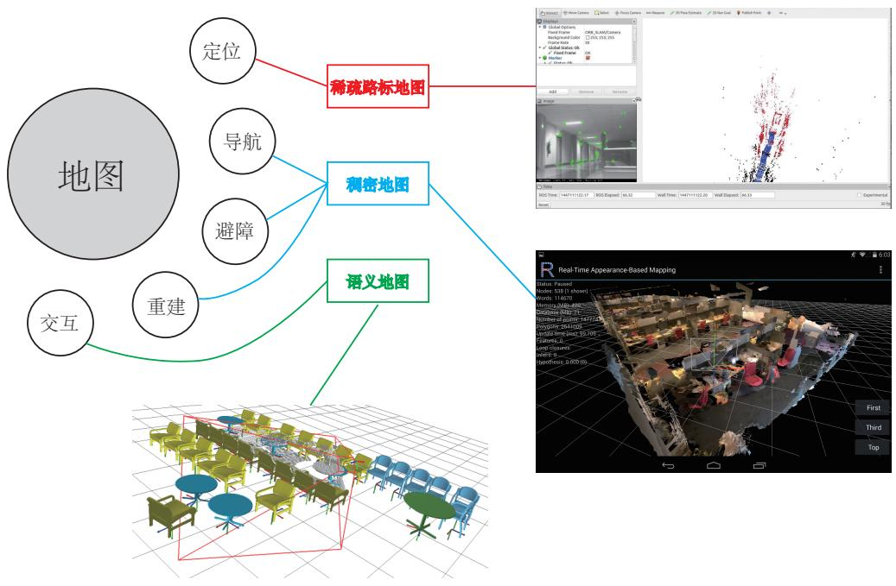

<details>
<summary>flowchart</summary>

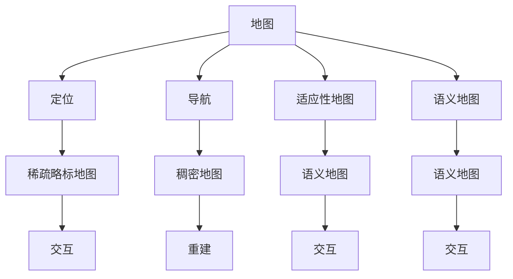
```mermaid
graph TD
  A["地图"] --> B["定位"]
  A --> C["导航"]
  A --> D["适应性地图"]
  A --> E["语义地图"]
  B --> F["稀疏略标地图"]
  C --> G["稠密地图"]
  D --> H["语义地图"]
  E --> I["语义地图"]
  F --> J["交互"]
  G --> K["重建"]
  H --> L["交互"]
  I --> M["交互"]
```
</details>

图 13-1 各种地图的示意图。三种例子的地图分别来自 [73, 107, 108]。

图 13-1 形象地解释了上面讨论的各种地图类型与用途之间的关系。我们之前的讨论，基本集中于“稀疏路标地图”的部分，还没有探讨稠密地图。所谓稠密地图是相对于稀疏地图而言的——稀疏地图只建模感兴趣的部分，也就是前面说了很久的特征点（路标点）。

而稠密地图是指，建模所有看到过的部分。对于同一个桌子，稀疏地图可能只建模了桌子的四个角，而稠密地图则会建模整个桌面。虽然从定位角度看，只有四个角的地图也可以用于对相机进行定位，但由于我们无法从四个角推断这几个点之间的空间结构，所以无法仅用四个角来完成导航、避障等需要稠密地图才能完成的工作。

从上面的讨论中可以看出，稠密地图占据着一个非常重要的位置。于是，剩下来的问题是：通过视觉 SLAM 能建立稠密地图吗？如果能，怎么建呢？

## 13.2 单目稠密重建

## 13.2.1 立体视觉

视觉 SLAM 的稠密重建问题将是本章的第一个重要话题。相机，很久以来被认为是只有角度的传感器（Bearing only）。单个图像中的像素，只能提供物体与相机成像平面的角度以及物体采集到的亮度，而无法提供物体的距离（Range）。而在稠密重建，我们需要知道每一个像素点（或大部分像素点）的距离，那么大致上有以下几种解决方案：

1. 使用单目相机，利用移动相机之后进行三角化，测量像素的距离。  
2. 使用双目相机，利用左右目的视差计算像素的距离（多目原理相同）。  
3. 使用 RGB-D 相机直接获得像素距离。

前两种方式称为立体视觉（Stereo Vision），其中移动单目的又称为移动视角的立体视觉（Moving View Stereo）。相比于 RGB-D 直接测量的深度，单目和双目对深度的获取往往是“费力不讨好”的——我们需要花费大量的计算，最后得到一些不怎么可靠的①深度估计。当然，RGB-D 也有一些量程、应用范围和光照的限制，不过相比于单目和双目的结果，使用 RGB-D 进行稠密重建往往是更常见的选择。而单目双目的好处，是在目前 RGB-D还无法很好应用的室外、大场景场合中，仍能通过立体视觉估计深度信息。

话虽如此，本节我们将带领读者实现一遍单目的稠密估计，体验为何我们说它是费力不讨好的。我们从最简单的情况开始说起：在给定相机轨迹的基础上，如何根据一段时间的视频序列，来估计某张图像的深度。换言之，我们不考虑 SLAM，先来考虑稍为简单的建图问题。

假定有某一段视频序列，我们通过某种魔法得到了每一帧对应的轨迹（当然也很可能是由视觉里程计前端估计所得）。现在我们以第一张图像为参考帧，计算参考帧中每一个像素的深度（或者说距离）。首先，请回忆在特征点部分我们是如何完成该过程的：

1. 首先，我们对图像提取特征，并根据描述子计算了特征之间的匹配。换言之，通过特征，我们对某一个空间点进行了跟踪，知道了它在各个图像之间的位置。

2. 然后，由于我们无法仅用一张图像确定特征点的位置，所以必须通过不同视角下的观测，估计它的深度，原理即前面讲过的三角测量。

那么，在稠密深度图估计中，不同之处在于，我们无法把每个像素都当作特征点，计算描述子。因此，稠密深度估计问题中，匹配就成为很重要的一环：如何确定第一张图的某像素，出现在其他图里的位置呢？这需要用到极线搜索和块匹配技术 [109]。然后，当我们知道了某个像素在各个图中的位置，就能像特征点那样，利用三角测量确定它的深度。不过不同的是，在这里我们要使用很多次三角测量让深度估计收敛，而不仅是一次。我们希望深度估计，能够随着测量的增加，从一个非常不确定的量，逐渐收敛到一个稳定值。这就是深度滤波器技术。所以，下面的内容将主要围绕这个主题展开。

## 13.2.2 极线搜索与块匹配

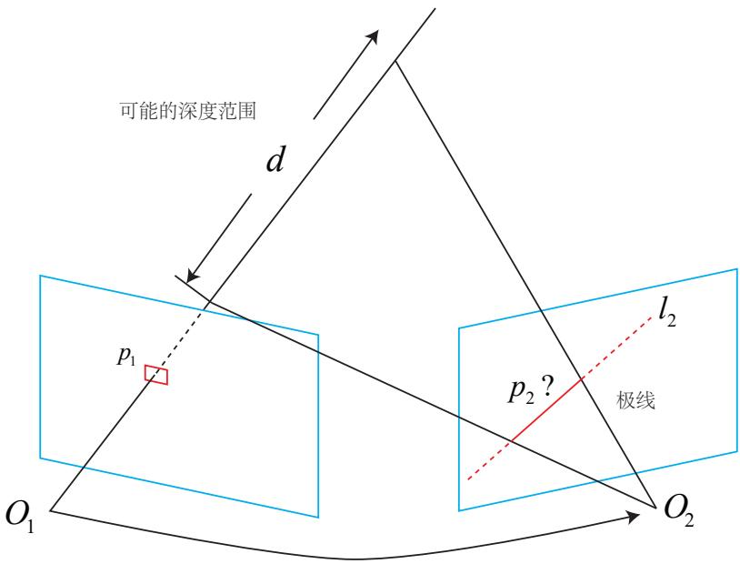

<details>
<summary>text_image</summary>

可能的深度范围
d
p₁
O₁
p₂ ?
极线
l₂
O₂
</details>

图 13-2 极线搜索的示意图。

我们先来探讨不同视角下观察同一个点，产生的几何关系。这非常像在第 7.3 节讨论的对极几何关系。请看图 13-2 。左边的相机观测到了某个像素 $\pmb { p } _ { 1 }$ 。由于这是一个单目相机，我们无从知道它的深度，所以假设这个深度可能在某个区域之内，不妨说是某最小值到无穷远之间： $( d _ { m i n } , + \infty )$ 。因此，该像素对应的空间点就分布在某条线段（本例中是射线）上。在另一个视角（右侧相机）看来，这条线段的投影也形成图像平面上的一条线，我们知道这称为极线。当我们知道两个相机间的运动时，这条极线也是能够确定的①。那么问题就是：极线上的哪一个点，是我们刚才看到的 ${ \pmb p } _ { 1 }$ 点呢？

重复一遍，在特征点方法中，我们通过特征匹配找到了 $\mathbf { \mathit { p } } _ { 2 }$ 的位置。然而现在我们没有描述子，所以只能在极线上搜索和 ${ \pmb p } _ { 1 }$ 长的比较相似的点。再具体地说，我们可能沿着第二张图像中的极线的某一头，走到另一头，逐个儿比较每个像素与 ${ \pmb p } _ { 1 }$ 的相似程度。从直接比较像素的角度上来看，这种做法倒是和直接法是异曲同工的。

在直接法的讨论中我们也知道，比较单个像素的亮度值并不一定稳定可靠。一件很明显的事情就是：万一极线上有很多和 $\pmb { p } _ { 1 }$ 相似的点，我们怎么确定哪一个是真实的呢？这似乎回到了我们在回环检测当中说到的问题：如何确定两个图像（或两个点）的相似性？回环检测是通过词袋来解决的，但这里由于没有特征，所以我们只好寻求另外的途径。

一种直观的想法是：既然单个像素的亮度没有区分性，那是否可以比较像素块呢？我们在 $\pmb { p } _ { 1 }$ 周围取一个大小为 $w \times w$ 的小块，然后在极线上也取很多同样大小的小块进行比较，就可以一定程度上提高区分性。这就是所谓的块匹配。注意到在这个过程中，只有我们的假设在不同图像间整个小块的灰度值不变，这种比较才有意义。所以算法的假设，从像素的灰度不变性，变成了图像块的灰度不变性——在一定程度上变得更强了。

好了，现在我们取了 ${ \pmb p } _ { 1 }$ 周围的小块，并且在极线上也取了很多个小块。不妨把 $\pmb { p } _ { 1 }$ 周围的小块记成 $\ b { A } \in \mathbb { R } ^ { w \times w }$ ，把极线上的 n 个小块记成 $B _ { i } , i = 1 , \ldots , n .$ 。那么，如何计算小块与小块间的差异呢？存在若干种不同的计算方法：

1. SAD(Sum of Absolute Difference)。顾名思义，即取两个小块的差的绝对值之和：

$$
S (\boldsymbol {A}, \boldsymbol {B}) _ {S A D} = \sum_ {i, j} | \boldsymbol {A} (i, j) - \boldsymbol {B} (i, j) |. \tag {13.1}
$$

2. SSD。SSD 并不是说大家喜欢的固态硬盘，而是 Sum of Squared Distance(SSD)（平方和）的意思：

$$
S (\boldsymbol {A}, \boldsymbol {B}) _ {S S D} = \sum_ {i, j} \left(\boldsymbol {A} (i, j) - \boldsymbol {B} (i, j)\right) ^ {2}. \tag {13.2}
$$

3. NCC(Normalized Cross Correlation)（归一化互相关）。这种方式比前两者要复杂一

些，它计算的是两个小块的相关性：

$$
S (\boldsymbol {A}, \boldsymbol {B}) _ {N C C} = \frac {\sum_ {i , j} \boldsymbol {A} (i , j) \boldsymbol {B} (i , j)}{\sqrt {\sum_ {i , j} \boldsymbol {A} (i , j) ^ {2} \sum_ {i , j} \boldsymbol {B} (i , j) ^ {2}}}. \tag {13.3}
$$

请注意，由于这里用的是相关性，所以相关性接近 0 表示两个图像不相似，而接近 1才表示相似。前面两种距离则是反过来的，接近 0 表示相似，而大的数值表示不相似。

和我们遇到过的许多情形一样，这些计算方式往往存在一个精度——效率之间的矛盾。精度好的方法往往需要复杂的计算，而简单的快速算法又往往效果不佳。这需要我们在实际工程中进行取舍。另外，除了这些简单版本之外，我们可以先把每个小块的均值去掉，称为去均值的 SSD、去均值的 NCC 等等。去掉均值之后，我们允许像“小块 B 比 A 整体上亮一些，但仍然很相似”这样的情况①，因此比之前的更加可靠一些。如果读者对更多的块匹配度量方法感兴趣，建议阅读 [110, 111] 作为补充材料。

现在，我们在极线上，计算了 A 与每一个 $\mathbf { \delta } _ { B _ { i } }$ 的相似性度量。为了方便叙述，假设我们用了 NCC，那么，我们将得到一个沿着极线的 NCC 分布。这个分布的形状严重取决于图像本身的样子，例如图 13-3 那样。在搜索距离较长的情况下，我们通常会得到一个非凸函数：这个分布存在着许多峰值，然而真实的对应点必定只有一个。在这种情况下，我们会倾向于使用概率分布来描述深度值，而非用某个单一个的数值来描述深度。于是，我们的问题就转到了，在不断对不同图像进行极线搜索时，我们估计的深度分布将发生怎样的变化——这就是所谓的深度滤波器。

## 13.2.3 高斯分布的深度滤波器

对像素点深度的估计，本身亦可建模为一个状态估计问题，于是就自然存在滤波器与非线性优化两种求解思路。虽然非线性优化效果较好，但是在 SLAM 这种实时性要求较强的场合，考虑到前端已经占据了不少的计算量，建图方面则通常采用计算量较少的滤波器方式了。这也是本节讨论深度滤波器的目的。

对深度的分布假设存在着若干种不同的做法。首先，在比较简单的假设条件下，我们可以假设深度值服从高斯分布，得到一种类卡尔曼式的方法（我们稍后会看到）。而另一方面，在 [112, 56] 等工作中，亦采用了均匀——高斯混合分布的假设，推导了另一种形式更为复杂的深度滤波器。本着简单易用的原则，我们先来介绍并演示高斯分布假设下的深度滤波器，然后把均匀——高斯混合分布的滤波器作为习题。

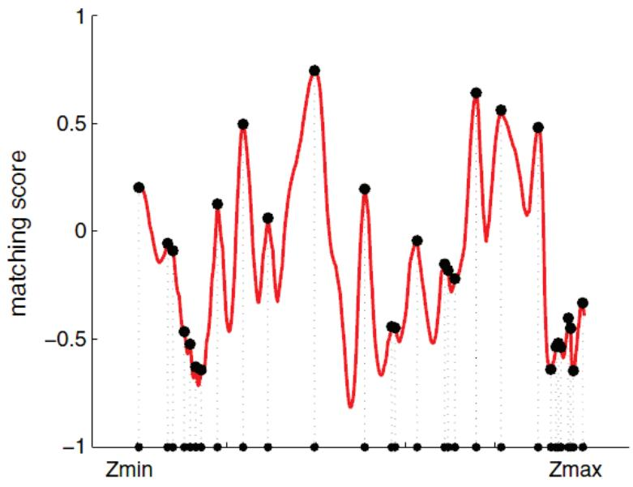

<details>
<summary>line chart</summary>

| Zmin | Zmax |
|------|------|
| 0.0  | 0.2  |
| 0.1  | -0.1 |
| 0.2  | -0.3 |
| 0.3  | -0.5 |
| 0.4  | -0.7 |
| 0.5  | -0.6 |
| 0.6  | -0.4 |
| 0.7  | 0.1  |
| 0.8  | 0.5  |
| 0.9  | 0.0  |
| 1.0  | -0.3 |
| 1.1  | 0.7  |
| 1.2  | -0.8 |
| 1.3  | 0.2  |
| 1.4  | -0.5 |
| 1.5  | -0.4 |
| 1.6  | -0.2 |
| 1.7  | -0.1 |
| 1.8  | -0.3 |
| 1.9  | -0.2 |
| 2.0  | -0.1 |
| 2.1  | 0.6  |
| 2.2  | -0.1 |
| 2.3  | 0.5  |
| 2.4  | -0.1 |
| 2.5  | -0.3 |
| 2.6  | -0.5 |
| 2.7  | -0.6 |
| 2.8  | -0.7 |
| 2.9  | -0.5 |
| 3.0  | -0.4 |
| 3.1  | -0.3 |
| 3.2  | -0.2 |
| 3.3  | -0.1 |
| 3.4  | -0.1 |
| 3.5  | -0.1 |
| 3.6  | -0.1 |
| 3.7  | -0.1 |
| 3.8  | -0.1 |
| 3.9  | -0.1 |
| 4.0  | -0.1 |
| 4.1  | -0.1 |
| 4.2  | -0.1 |
| 4.3  | -0.1 |
| 4.4  | -0.1 |
| 4.5  | -0.1 |
| 4.6  | -0.1 |
| 4.7  | -0.1 |
| 4.8  | -0.1 |
| 4.9  | -0.1 |
| 5.0  | -0.1 |
| 5.1  | -0.1 |
| 5.2  | -0.1 |
| 5.3  | -0.1 |
| 5.4  | -0.1 |
| 5.5  | -0.1 |
| 5.6  | -0.1 |
| 5.7  | -0.1 |
| 5.8  | -0.1 |
| 5.9  | -0.1 |
| 6.0  | -0.1 |
| 6.1  | -0.1 |
| 6.2  | -0.1 |
| 6.3  | -0.1 |
| 6.4  | -0.1 |
| 6.5  | -0.1 |
| 6.6  | -0.1 |
| 6.7  | -0.1 |
| 6.8  | -0.1 |
| 6.9  | -0.1 |
| 7.0  | -0.1 |
| 7.1  | -0.1 |
| 7.2  | -0.1 |
| 7.3  | -0.1 |
| 7.4  | -0.1 |
| 7.5  | -0.1 |
| 7.6  | -0.1 |
| 7.7  | -0.1 |
| 7.8  | -0.1 |
| 7.9  | -0.1 |
| 8.0  | -0.1 |
| Zmin | -0.9 |
| Zmax | -0.9 |
</details>

图 13-3 匹配得分沿距离的分布，图像来自 [112]。

设某个像素点的深度 d 服从：

$$
P (d) = N (\mu , \sigma^ {2}). \tag {13.4}
$$

而每当新的数据到来，我们都会观测到它的深度。同样的，假设这次观测亦是一个高斯分布：

$$
P (d _ {o b s}) = N (\mu_ {o b s}, \sigma_ {o b s} ^ {2}). \tag {13.5}
$$

于是，我们的问题是，如何使用观测的信息，更新原先 d 的分布。这正是一个信息融合问题。根据附录 A，我们明白两个高斯分布的乘积依然是一个高斯分布。设融合后的 d的分布为 $N ( \mu _ { f u s e } , \sigma _ { f u s e } ^ { 2 } )$ ，那么根据高斯分布的乘积，有：

$$
\mu_ {f u s e} = \frac {\sigma_ {o b s} ^ {2} \mu + \sigma^ {2} \mu_ {o b s}}{\sigma^ {2} + \sigma_ {o b s} ^ {2}}, \quad \sigma_ {f u s e} ^ {2} = \frac {\sigma^ {2} \sigma_ {o b s} ^ {2}}{\sigma^ {2} + \sigma_ {o b s} ^ {2}}. (1 3. 6)
$$

由于我们仅有观测方程而没有运动方程，所以这里深度仅用到了信息融合部分，而无须像完整的卡尔曼那样进行预测和更新。可以看到融合的方程确实比较浅显易懂，不过问题仍然存在：如何确定我们观测到深度的分布呢？即，如何计算 $\mu _ { o b s } , \sigma _ { o b s }$ 呢？

关于 $\mu _ { o b s } , \sigma _ { o b s }$ ，亦存在一些不同的处理方式。例如，文献 [59] 考虑了几何不确定性和光度不确定性二者之和，而 [112] 则仅考虑几何不确定性。我们暂时只考虑由几何关系带来的不确定性。现在，假设我们通过极线搜索和块匹配，确定了参考帧某个像素在当前帧的投影位置。那么，这个位置对深度的不确定性有多大呢？

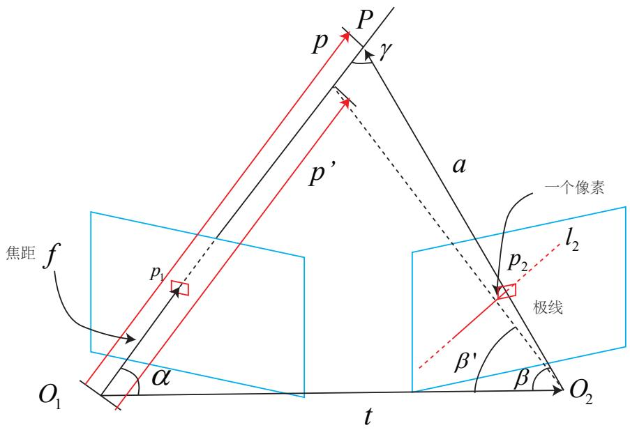

<details>
<summary>text_image</summary>

P
γ
p
a
一个像素
l₂
p₁
极线
β′
β
O₁
α
t
O₂
p′
f
焦距
</details>

图 13-4 不确定性分析。

以图 13-4 为例。考虑某次极线搜索，我们找到了 ${ \pmb p } _ { 1 }$ 对应的 $\mathbf { \mathit { p } } _ { 2 }$ 点，从而观测到了 ${ \pmb p } _ { 1 }$ 的深度值，认为 ${ \pmb p } _ { 1 }$ 对应的三维点为 $\pmb { P } _ { \circ }$ 。从而，可记 $O _ { 1 } P$ 为 ${ \bf \it { p } } , \mathrm { ~ } O _ { 1 } O _ { 2 }$ 为相机的平移 t，$O _ { 2 } P$ 记为 $\mathbf { \delta } _ { \mathbf { \delta } } \mathbf { \delta } _ { \mathbf { \delta } \mathbf { \delta } }$ 。并且，把这个三角形的下面两个角记作 $\alpha , \beta ,$ 。现在，考虑极线 $l _ { 2 }$ 上存在着一个像素大小的误差，使得 $\beta$ 角变成了 $\beta ^ { \prime }$ ，而 $\pmb { p }$ 也变成了 $\pmb { p } ^ { \prime }$ ，并记上面那个角为 $\gamma _ { \circ }$ 。我们要问的是，这一个像素的误差，会导致 $\pmb { p } ^ { \prime }$ 与 $\pmb { p }$ 产生多大的差距呢？

这是一个典型的几何问题。我们来列写这个量之间的几何关系。显然有：

$$
\boldsymbol {a} = \boldsymbol {p} - t
$$

$$
\alpha = \arccos \left\langle \boldsymbol {p}, \boldsymbol {t} \right\rangle \tag {13.7}
$$

$$
\beta = \arccos \left\langle \boldsymbol {a}, - \boldsymbol {t} \right\rangle .
$$

对 $\mathbf { \mathit { p } } _ { 2 }$ 扰动一个像素，将使得 $\beta$ 产生一个变化量 $\delta \beta$ ，由于相机焦距为 f，于是：

$$
\delta \beta = \arctan \frac {1}{f}. \tag {13.8}
$$

所以

$$
\beta^ {\prime} = \beta + \delta \beta \tag {13.9}
$$

$$
\gamma = \pi - \alpha - \beta^ {\prime}.
$$

于是，由正弦定理， $\pmb { p } ^ { \prime }$ 的大小可以求得：

$$
\| \boldsymbol {p} ^ {\prime} \| = \| \boldsymbol {t} \| \frac {\sin \beta^ {\prime}}{\sin \gamma}. \tag {13.10}
$$

由此，我们确定了由单个像素的不确定引起的深度不确定性。如果认为极线搜索的块匹配仅有一个像素的误差，那么就可以设：

$$
\sigma_ {o b s} = \| \boldsymbol {p} \| - \| \boldsymbol {p} ^ {\prime} \|. \tag {13.11}
$$

当然，如果极线搜索的不确定性大于一个像素，我们亦可按照此推导来放大这个不确定性。按下来的深度数据融合，已经在前面介绍过了。在实际工程中，当不确定性小于一定阈值之后，就可以认为深度数据已经收敛了。

综上所述，我们给出了估计稠密深度的一个完整的过程：

1. 假设所有像素的深度满足某个初始的高斯分布；  
2. 当新数据产生时，通过极线搜索和块匹配确定投影点位置；  
3. 根据几何关系计算三角化后的深度以及不确定性；  
4. 将当前观测融合进上一次的估计中。若收敛则停止计算，否则返回 2。

这些步骤组成了一套可行的深度估计方式。它的实际结果如何，我们将在实践部分进行演示。

## 13.3 实践：单目稠密重建

本节的示例程序将使用 REMODE[113, 109] 的测试数据集。它提供了一架无人机采集的单目俯视图像，共有 200 张，同时提供了每张图像的真实位姿。下面我们来考虑在这些数据的基础上，估算第一帧图像每个像素对应的深度值，即进行单目稠密重建。

首先，请读者从 http://rpg.ifi.uzh.ch/datasets/remode\_test\_data.zip 处下载示例程序所用的数据。你可以使用网页浏览器或下载工具进行下载。解压后，将在 test\_-data/Images 中发现从 0 至 200 的所有图像，并在 test\_data 目录下看到一个文本文件，它记录了每张图像对应的位姿：

```batch
scene_000.png 1.086410 4.766730 -1.449960 0.789455 0.051299 -0.000779 0.611661
scene_001.png 1.086390 4.766370 -1.449530 0.789180 0.051881 -0.001131 0.611966
scene_002.png 1.086120 4.765520 -1.449090 0.788982 0.052159 -0.000735 0.612198
.....
```

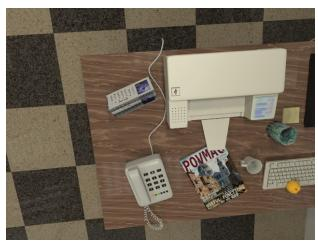

<details>
<summary>natural_image</summary>

Top-down view of a desktop computer setup with monitor, keyboard, and talking app (no visible text or symbols)
</details>

t = 0

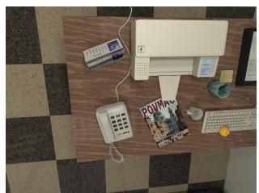

<details>
<summary>natural_image</summary>

Top-down view of a desktop desk with computer, keyboard, and office items (no visible text or symbols)
</details>

t = 50

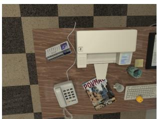

<details>
<summary>natural_image</summary>

Top-down view of a computer desk with monitor, keyboard, calculator, and scattered electronic devices (no visible text or symbols)
</details>

t = 100

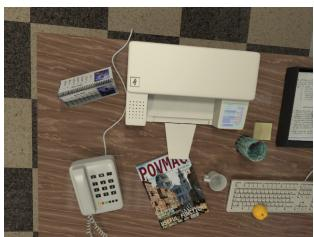

<details>
<summary>natural_image</summary>

Top-down view of a cluttered desk setup with computer, calculator, and scattered items (no visible text or symbols)
</details>

t = 150

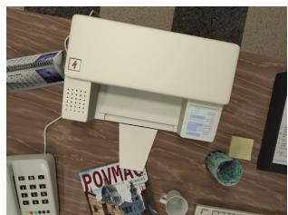

<details>
<summary>natural_image</summary>

Top-down view of a desk setup with a white electronic device, calculator, and scattered items on a wooden surface (no visible text or symbols)
</details>

t = 200  
图 13-5 数据集图示。

图 13-5 展示了若干时刻的图像。可以看到场景主要由地面、桌子以及桌子上的杂物组成。如果深度估计大致正确，那么我们至少可以看出桌子与地面的深度值不同之处。下面，我们按照之前的讲解，书写稠密深度估计程序。为了方便理解，我把程序书写成了 C 语言风格，放在单个文件中。程序稍微有点长，在书里我们重点讲解几个重要函数，其余内容请读者对照 github 的源码进行阅读。

slambook/ch13/dense\_monocular/dense\_mapping.cpp（片段）

```cpp
1 #include <iostream>
2 #include <vector>
```

```cpp
#include <fstream>
using namespace std;
#include <boost/timer.hpp>

// for sophus
#include <sophus/se3.h>
using Sophus::SE3;

// for eigen
#include <Eigen/Core>
#include <Eigen/Geometry>
using namespace Eigen;

#include <opencv2/core/core.hpp>
#include <opencv2/highgui/highgui.hpp>
#include <opencv2/imgproc/imgproc.hpp>

using namespace cv;

/**********************************************************************
* 本程序演示了单目相机在已知轨迹下的稠密深度估计
* 使用极线搜索 + NCC 匹配的方式，与书本的 13.2 节对应
* 请注意本程序并不完美，你完全可以改进它。
**********************************************************************/
// ----
// parameters
const int boarder = 20;    // 边缘宽度
const int width = 640;    // 宽度
const int height = 480;    // 高度
const double fx = 481.2f;    // 相机内参
const double fy = -480.0f;
const double cx = 319.5f;
const double cy = 239.5f;
const int ncc_window_size = 2;    // NCC 取的窗口半宽度
const int ncc_area = (2*ncc_window_size+1)*(2*ncc_window_size+1);    // NCC窗口面积
const double min_cov = 0.1;    // 收敛判定：最小方差
const double max_cov = 10;    // 发散判定：最大方差

// ----
// 重要的函数
// 从 REMODE 数据集读取数据
bool readDatasetFiles(
    const string& path,
    vector<string>& color_image_files,
    vector<SE3>& poses
);

// 根据新的图像更新深度估计
bool update(
```

```txt
const Mat& ref,
const Mat& curr,
const SE3& T_C_R,
Mat& depth,
Mat& depth_cov
);

// 极线搜索
bool epipolarSearch(
    const Mat& ref,
    const Mat& curr,
    const SE3& T_C_R,
    const Vector2d& pt_ref,
    const double& depth_mu,
    const double& depth_cov,
    Vector2d& pt_curr
);

// 更新深度滤波器
bool updateDepthFilter(
    const Vector2d& pt_ref,
    const Vector2d& pt_curr,
    const SE3& T_C_R,
    Mat& depth,
    Mat& depth_cov
);

// 计算 NCC 评分
double NCC( const Mat& ref, const Mat& curr, const Vector2d& pt_ref, const Vector2d& pt_curr );

// 双线性灰度插值
inline double getBilinearInterpolatedValue( const Mat& img, const Vector2d& pt ) {
    uchar* d = & img.data[ int(pt(1,0))*img.step+int(pt(0,0)) ];
    double xx = pt(0,0) - floor(pt(0,0));
    double yy = pt(1,0) - floor(pt(1,0));
    return (( 1-xx ) * ( 1-yy ) * double(d[0]) +
    xx* ( 1-yy ) * double(d[1]) +
    ( 1-xx ) *yy* double(d[img.step]) +
    xx*yy*double(d[img.step+1]))/255.0;
}

// ———————
// 一些小工具
// 显示估计的深度图
bool plotDepth( const Mat& depth );
// 像素到相机坐标系
inline Vector3d px2cam ( const Vector2d px ) {
    return Vector3d (
    (px(0,0) - cx)/fx,
```

```cpp
(px(1,0) - cy)/fy,
    1
);
}

// 相机坐标系到像素
inline Vector2d cam2px ( const Vector3d p_cam ) {
    return Vector2d (
    p_cam(0,0)*fx/p_cam(2,0) + cx,
    p_cam(1,0)*fy/p_cam(2,0) + cy
    );
}

// 检测一个点是否在图像边框内
inline bool inside( const Vector2d& pt ) {
    return pt(0,0) >= boarder && pt(1,0)>=boarder
    && pt(0,0)+boarder<width && pt(1,0)+boarder<=height;
}

int main( int argc, char** argv )
{
    if ( argc != 2 )
    {
    cout<<"Usage: dense_mapping path_to_test_dataset"<<endl;
    return -1;
    }

    // 从数据集读取数据
    vector<string> color_image_files;
    vector<SE3> poses_TWC;
    bool ret = readDatasetFiles( argv[1], color_image_files, poses_TWC );
    if ( ret==false )
    {
    cout<<"Reading image files failed!"<<endl;
    return -1;
    }
    cout<<"read total "<<color_image_files.size()<<" files.""<<endl;

    // 第一张图
    Mat ref = imread( color_image_files[0], 0 ); // gray-scale image
    SE3 pose_ref_TWC = poses_TWC[0];
    double init_depth = 3.0; // 深度初始值
    double init_cov2 = 3.0; // 方差初始值
    Mat depth( height, width, CV_64F, init_depth ); // 深度图
    Mat depth_cov( height, width, CV_64F, init_cov2 ); // 深度图方差

    for ( int index=1; index<color_image_files.size(); index++ )
    {
    cout<<"*** loop "<<index<<" ***"<<endl;
    Mat curr = imread( color_image_files[index], 0 );
```

```txt
if (curr.data == nullptr) continue;
    SE3 pose_curr_TWC = poses_TWC[index];
    SE3 pose_T_C_R = pose_curr_TWC.inverse() * pose_ref_TWC; // 坐标转换关系：T_C_W * T_W_R = T_C_R
    update(ref, curr, pose_T_C_R, depth, depth_cov);
    plotDepth(depth);
    imshow("image", curr);
    waitKey(1);
}

return 0;
}

// 对整个深度图进行更新
bool update(const Mat& ref, const Mat& curr, const SE3& T_C_R, Mat& depth, Mat& depth_cov)
{
    #pragma omp parallel for
    for (int x=boarder; x<width-boarder; x++)
    #pragma omp parallel for
    for (int y=boarder; y<height-boarder; y++)
    {
    // 遍历每个像素
    if (depth_cov.ptr<double>(y)[x] < min_cov
    || depth_cov.ptr<double>(y)[x] > max_cov) // 深度已收敛或发散
    continue;
    // 在极线上搜索 (x,y) 的匹配
    Vector2d pt_curr;
    bool ret = epipolarSearch (
    ref,
    curr,
    T_C_R,
    Vector2d(x,y),
    depth.ptr<double>(y)[x],
    sqrt(depth_cov.ptr<double>(y)[x]),
    pt_curr
    );

    if (ret == false) // 匹配失败
    continue;

    // 取消该注释以显示匹配
    // showEpipolarMatch(ref, curr, Vector2d(x,y), pt_curr);

    // 匹配成功，更新深度图
    updateDepthFilter(Vector2d(x,y), pt_curr, T_C_R, depth, depth_cov);
    }
}

// 极线搜索
// 方法见书 13.2 13.3 两节
```

```c
bool epipolarSearch(
    const Mat& ref, const Mat& curr,
    const SE3& T_C_R, const Vector2d& pt_ref,
    const double& depth_mu, const double& depth_cov,
    Vector2d& pt_curr
)
{
    Vector3d f_ref = px2cam(pt_ref);
    f_ref.normalize();
    Vector3d P_ref = f_ref*depth_mu; // 参考帧的 P 向量

    Vector2d px_mean_curr = cam2px(T_C_R*P_ref); // 按深度均值投影的像素
    double d_min = depth_mu-3*depth_cov, d_max = depth_mu+3*depth_cov;
    if (d_min<0.1) d_min = 0.1;
    Vector2d px_min_curr = cam2px(T_C_R*(f_ref*d_min)); // 按最小深度投影的像素
    Vector2d px_max_curr = cam2px(T_C_R*(f_ref*d_max)); // 按最大深度投影的像素

    Vector2d epipolar_line = px_max_curr - px_min_curr; // 极线（线段形式）
    Vector2d epipolar_direction = epipolar_line; // 极线方向
    epipolar_direction.normalize();
    double half_length = 0.5*epipolar_line.norm(); // 极线线段的半长度
    if (half_length>100) half_length = 100; // 我们不希望搜索太多东西

    // 取消此句注释以显示极线（线段）
    // showEpipolarLine(ref, curr, pt_ref, px_min_curr, px_max_curr);

    // 在极线上搜索，以深度均值点为中心，左右各取半长度
    double best_ncc = -1.0;
    Vector2d best_px_curr;
    for (double l=-half_length; l<=half_length; l+=0.7) // l+=sqrt(2)
    {
    Vector2d px_curr = px_mean_curr + l*epipolar_direction; // 待匹配点
    if (!inside(px_curr)
    continue;
    // 计算待匹配点与参考帧的 NCC
    double ncc = NCC(ref, curr, pt_ref, px_curr);
    if (ncc>best_ncc)
    {
    best_ncc = ncc;
    best_px_curr = px_curr;
    }
    }
    if (best_ncc < 0.85f) // 只相信 NCC 很高的匹配
    return false;
    pt_curr = best_px_curr;
    return true;
}

double NCC (
    const Mat& ref, const Mat& curr,
```

```txt
const Vector2d& pt_ref, const Vector2d& pt_curr
{
    // 零均值-归一化互相关
    // 先算均值
    double mean_ref = 0, mean_curr = 0;
    vector<double> values_ref, values_curr; // 参考帧和当前帧的均值
    for (int x=-ncc_window_size; x<=ncc_window_size; x++)
    for (int y=-ncc_window_size; y<=ncc_window_size; y++)
    {
    double value_ref = double(ref.ptr<uchar>(int(y+pt_ref(1,0)))[int(x+pt_ref(0,0))])/255.0;
    mean_ref += value_ref;

    double value_curr = getBilinearInterpolatedValue(curr, pt_curr+Vector2d(x,y));
    mean_curr += value_curr;

    values_ref.push_back(value_ref);
    values_curr.push_back(value_curr);
    }

    mean_ref /= ncc_area;
    mean_curr /= ncc_area;

    // 计算 Zero mean NCC
    double numerator = 0, demoniator1 = 0, demoniator2 = 0;
    for (int i=0; i<values_ref.size(); i++)
    {
    double n = (values_ref[i]-mean_ref) * (values_curr[i]-mean_curr);
    numerator += n;
    demoniator1 += (values_ref[i]-mean_ref)*(values_ref[i]-mean_ref);
    demoniator2 += (values_curr[i]-mean_curr)*(values_curr[i]-mean_curr);
    }
    return numerator / sqrt(demoniator1*demoniator2+1e-10); // 防止分母出现零
}

bool updateDepthFilter(
    const Vector2d& pt_ref,
    const Vector2d& pt_curr,
    const SE3& T_C_R,
    Mat& depth,
    Mat& depth_cov
)
{
    // 用三角化计算深度
    SE3 T_R_C = T_C_R.inverse();
    Vector3d f_ref = px2cam(pt_ref);
    f_ref.normalize();
    Vector3d f_curr = px2cam(pt_curr);
    f_curr.normalize();
```

```txt
// 方程参照本书第 7 讲三角化一节
Vector3d t = T_R_C.translation();
Vector3d f2 = T_R_C.rotation_matrix() * f_curr;
Vector2d b = Vector2d (t.dot(f_ref), t.dot(f2));
double A[4];
A[0] = f_ref.dot(f_ref);
A[2] = f_ref.dot(f2);
A[1] = -A[2];
A[3] = -f2.dot(f2);
double d = A[0]*A[3]-A[1]*A[2];
Vector2d lambdavec =
    Vector2d(A[3]*b(0,0)-A[1]*b(1,0),
    -A[2]*b(0,0)+A[0]*b(1,0))/d;
Vector3d xm = lambdavec(0,0)*f_ref;
Vector3d xn = t + lambdavec(1,0)*f2;
Vector3d d_esti=(xm+xn)/2.0; // 三角化算得的深度向量
double depth_estimation=d_esti.norm(); // 深度值

// 计算不确定性（以一个像素为误差）
Vector3d p = f_ref*depth_estimation;
Vector3d a = p - t;
double t_norm = t_norm();
double a_norm = a_norm();
double alpha = acos(f_ref.dot(t)/t_norm);
double beta = acos(-a.dot(t)/(a_norm*t_norm));
double beta_prime = beta + atan(1/fx);
double gamma = M_PI - alpha - beta_prime;
double p_prime = t_norm * sin(beta_prime) / sin(gamma);
double d_cov = p_prime - depth_estimation;
double d_cov2 = d_cov*d_cov;

// 高斯融合
double mu = depth.ptr<double>(int(pt_ref(1,0)))[int(pt_ref(0,0))];
double sigma2 = depth_cov.ptr<double>(int(pt_ref(1,0)))[int(pt_ref(0,0))];

double mu_fuse=(d_cov2*mu+sigma2*depth_estimation)/(sigma2+d_cov2);
double sigma_fuse2=(sigma2*d_cov2)/(sigma2+d_cov2);

depth.ptr<double>(int(pt_ref(1,0)))[int(pt_ref(0,0))]=mu_fuse;
depth_cov.ptr<double>(int(pt_ref(1,0)))[int(pt_ref(0,0))]=sigma_fuse2;

return true;
}

// 其他次要的函数略
}
```

如果读者理解了上一节内容，相信读懂此处源代码亦不是难事。尽管如此，我们对几个关键函数稍作注解：

1. main 函数非常简单。它只负责从数据集中读取图像，然后交给 update 函数，对深度图进行更新。  
2. update 函数中，我们遍历了参考帧的每个像素，先在当前帧中寻找极线匹配，若能匹配上，则利用极线匹配的结果更新深度图的估计。  
3. 极线搜索原理大致和上节介绍的相同，但实现上添加了一些细节：因为假设深度值服从高斯分布，我们就以均值为中心，左右各取 ±3σ 作为半径，然后在当前帧中寻找极线的投影。然后，遍历此极线上的像素（步长取 2/2 的近似值 0.7），寻找 NCC最高的点，作为匹配点。如果最高的 NCC 也低于阈值（这里取 0.85），则认为匹配失败。  
4. NCC 的计算使用了去均值化后的做法，即对于图像块 A, B，取：

$$
N C C _ {z} (\boldsymbol {A}, \boldsymbol {B}) = \frac {\sum_ {i , j} \left(\boldsymbol {A} (i , j) - \bar {\boldsymbol {A}} (i , j)\right) \left(\boldsymbol {B} (i , j) - \bar {\boldsymbol {B}} (i , j)\right)}{\sqrt {\sum_ {i , j} \left(\boldsymbol {A} (i , j) - \bar {\boldsymbol {A}} (i , j)\right) ^ {2} \sum_ {i , j} \left(\boldsymbol {B} (i , j) - \bar {\boldsymbol {B}} (i , j)\right) ^ {2}}}. \tag {13.12}
$$

5. 三角化的计算方式与 7.5 一致，不确定性的计算与高斯融合方法和上一节一致。

虽然程序有些长，相信读者根据上面的提示，应该能读懂程序的写法。下面我们来看它的实际运行效果。

## 13.3.1 实验结果

编译此程序后，以数据集目录作为参数，运行之①：

```txt
$ build/dense_mapping ~/dataset/test_data
read total 202 files.
*** loop 1 ***
*** loop 2 ***
......
```

程序输出的信息比较简洁，仅显示了迭代次数、当前图像和深度图。关于深度图，我们显示的是深度值乘以 0.4 后的结果——也就是纯白点（数值为 1.0）的深度约 2.5 米，颜色越深表示深度值越小，也就是物体离我们越近。如果实际运行了程序，应该会发现深度估计是一个动态的过程——从一个不怎么确定的初始值逐渐收敛到稳定值的过程。我们的初始值使用了均值和方差均为 3.0 的分布。当然你也可以修改初始分布，看看对结果会产生怎样的影响。

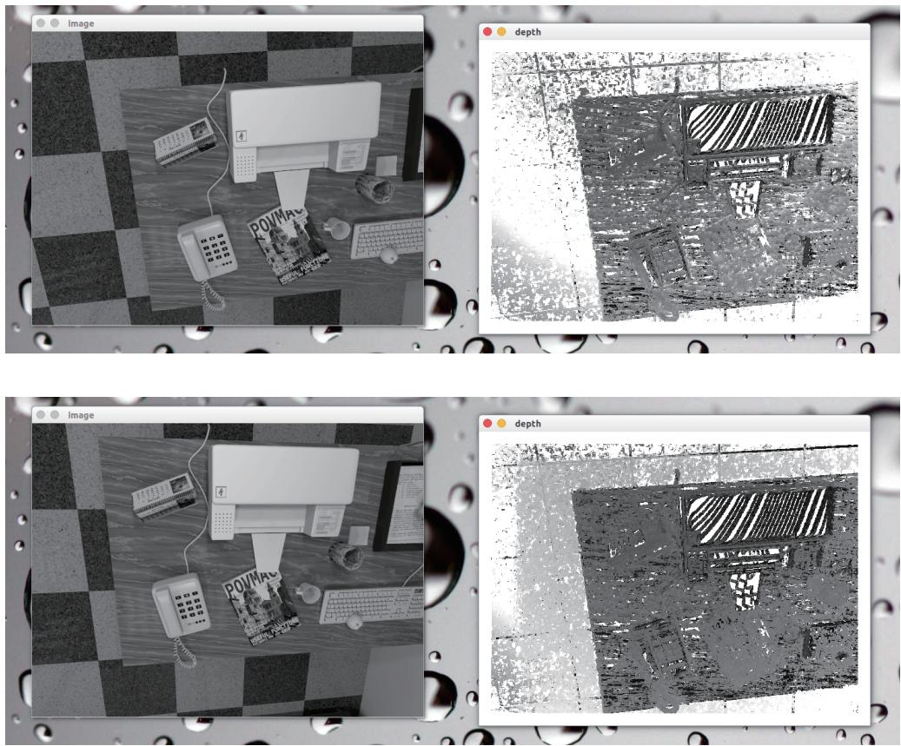  
图 13-6 演示程序运行时截图。两图分别是迭代 10 次和 30 次的结果。

从截图可以发现，当迭代次数超过一定次之后，深度图趋于稳定，不再对新的数据产生改变。观察稳定之后的深度图，我们发现大致可以看出地板和桌子的区别，而桌上的物体深度则接近于桌子。整个估计大部分是正确的，但也存在着大量错误估计。它们表现为深度图中，与周围数据不一致的地方，为过大或过小的估计。此外，位于边缘处的地方，由于运动过程中看到的次数较少，所以亦没有得到正确的估计。综上所述，我们认为这个深度图的大部分是正确的，但没有达到预想的效果。我们将在下一节分析这些情况的出现原因，并讨论有哪些可以改进的地方。

## 13.4 实验分析与讨论

上一节我们演示了移动单目相机的稠密建图，估计了参考帧的每个像素深度。我们的代码是相对简单直接的，没有使用许多的技巧（trick），因此出现了实际工程中常见的情形简单的往往并不是最有效的。

由于真实数据的复杂性，能够在实际环境下工作的程序，往往需要周密的考虑和大量的工程技巧，这使得每种实际可行的代码都极其复杂——它们很难向初学者解释清楚，所以我们只好使用不那么有效，但相对易读易写的实现方式。我们当然可以提出若干种对演示程序加以改进的意见，但我不想把已经改好的（非常复杂的）程序直接呈现给读者。

下面我们对上节实验的结果进行初步分析。我们将从计算机视觉和滤波器两个角度来分析演示实验的结果。

## 13.4.1 像素梯度的问题

对深度图像进行观察，我们会发现一件明显的事实。块匹配的正确与否，依赖于图像块是否具有区分度。显然，如果图像块仅是一片黑或者一片白，缺少有效的信息，那么在NCC 计算中，我们就很可能错误地将它与周围的某块像素给匹配起来。请读者观察演示程序中的打印机表面。由于它是均匀的白色，非常容易引起误匹配，因此打印机表面的深度信息，多半是不正确的——示例程序的空间表面出现了明显不该有的条纹状深度估计，而根据我们直观想象，打印机表面肯定是光滑的。

这里牵涉到了一个问题，该问题在直接法中我们已经见过一次。在进行块匹配（和NCC的计算）时，我们必须假设小块不变，然后将该小块与其他小块进行对比。这时，有明显梯度的小块将具有良好的区分度，不易引起误匹配。对于梯度不明显的像素，由于在块匹配时没有区分性，所以我们将难以有效地估计其深度。反之，像素梯度比较明显的地方，我们得到的深度信息也相对准确，例如桌面上的杂志、电话等具有明显纹理的物体。因此，演示程序反映了立体视觉中一个非常常见的问题：对物体纹理的依赖性。该问题在双目视觉中也极其常见，体现了立体视觉的重建质量，十分依赖于环境纹理。

我们的演示程序刻意使用了纹理较好的环境：例如像棋盘格一般的地板，带有木纹的桌面等等，因此能得到一个看似不错的结果。然而在实际中，像墙面、光滑物体表面等亮度均匀的地方将经常出现，影响我们对它的深度估计。从某种角度来说，该问题是无法在现有的算法流程上加以改进并解决的——如果我们依然只关心某个像素周围的邻域（小块）的话。

进一步讨论像素梯度问题的话，我们还会发现像素梯度和极线之间的联系。文章 [59]详细讨论过它们的关系，不过在我们的演示程序里也有直观的体现。

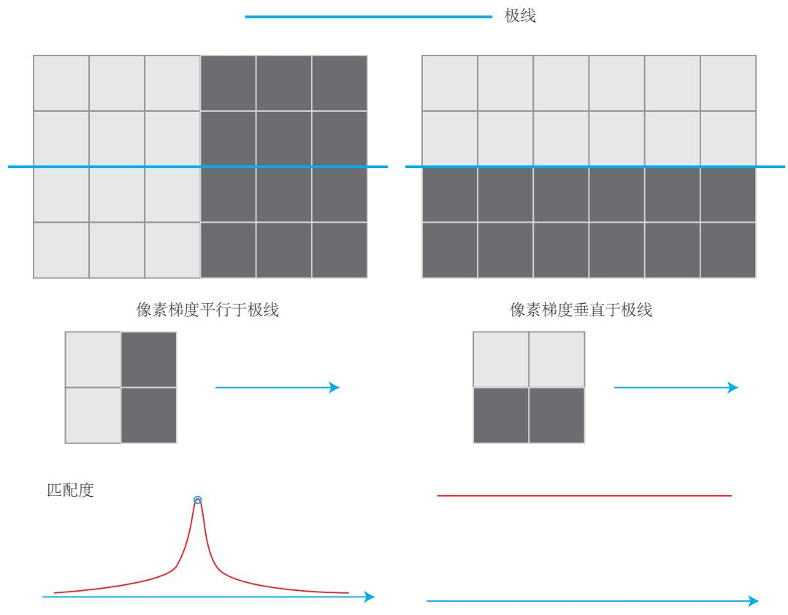

<details>
<summary>text_image</summary>

极线
像素梯度平行于极线
像素梯度垂直于极线
匹配度
</details>

图 13-7 像素梯度与极线之关系（示意图）。

以图 13-7 为例，我们举两种比较极端的情况：像素梯度垂直于极线方向，以及平行于极线方向。先来看平行的情况。在平行的例子里，即使小块有明显梯度，但是当我们沿着极线去做块匹配时，会发现匹配程度都是一样的，因此得不到有效的匹配。反之，在垂直的例子里，我们能够精确地确定匹配度最高点出现在何处。而实际当中，梯度与极线的情况很可能位于二者之间：既不是完全垂直亦不是完全平行。这时，我们说，当像素梯度与极线夹角较小时，极线匹配的不确定性大；而当夹角较大时，匹配的不确定性变小。而在演示程序中，我们统一地把这些情况都当成一个像素的误差，实质是不够精细的。考虑到极线与像素梯度的关系后，应该使用更精确的不确定性模型。具体的调整和改进留作习题。

## 13.4.2 逆深度

从另一个角度来看，我们不妨可以问：把像素深度假设成高斯分布，是否合适呢？这里关系到一个参数化的问题（Parameterization）。

在前面的章节中，我们经常用一个点的世界坐标 $x , y , z$ 三个量来描述它，这是一种参数化形式。我们认为 $x , y , z$ 三个量都是随机的，它们服从（三维的）高斯分布。然而，本章使用了图像坐标 $u , v$ 和深度值 d 来描述某个空间点（即稠密建图）。我们认为 $u , v$ 不动，而 d 服从（一维的）高斯分布，这是另一种参数化形式。那么我们要问：这两种参数化形式有什么不同吗？我们是否也能假设 $u , v$ 服从高斯分布，从而形成另一种参数化形式呢？

不同的参数化形式，实际都描述了同一个量，也就是某个三维空间点。考虑到当我们在相机看到某个点时，它的图像坐标 $u , v$ ，是比较确定的①，而深度值 d 则是非常不确定的。此时，若用世界坐标 $x , y , z$ 描述这个点，那么根据相机当前的位姿， $x , y , z$ 三个量之间可能存在明显的相关性。反映在协方差矩阵中，表现为非对角元素不为零。而如果用 $u , v , d$ 参数化一个点，那么它的 $u , v$ 和 d 至少是近似独立的，甚至我们亦能认为 $u , v$ 也是独立的——从而它的协方差矩阵近似为对角阵，更为简洁。

逆深度（Inverse depth）是近年 SLAM 研究中，出现的一种广泛使用的参数化技巧[114, 115]。在演示程序中，我们假设深度值满足高斯分布： $d \sim N ( \mu , \sigma ^ { 2 } )$ 。然而这样做合不合理呢？深度真的近似于一个高斯分布吗？仔细想想，深度的正态分布确实存在一些问题：

1. 我们实际想表达的是：这个场景深度大概是 5-10 米，可能有一些更远的点，但近处肯定不会小于相机焦距（或认为深度不会小于 0）。这个分布并不是像高斯分布那样，形成一个对称的形状。它的尾部可能稍长，而负数区域则为零。  
2. 在一些室外应用中，可能存在距离非常远，乃至无穷远处的点。我们的初始值中难以涵盖这些点，并且用高斯分布描述它们会有一些数值计算上的困难。

于是，逆深度应运而生。人们在仿真中发现，假设深度的倒数，也就是逆深度，为高斯分布是比较有效的 [115]。随后，在实际应用中，逆深度也具有更好的数值稳定性，从而逐渐成为一种通用的技巧，存在于现有 SLAM 方案中的标准做法中 [56, 57, 73]。

把演示程序从正深度改成逆深度亦不复杂。只要在前面出现深度的推导中，将 d 改成逆深度 $d ^ { - 1 }$ 即可。我们亦把这个改动留作习题，交给读者完成。

## 13.4.3 图像间的变换

在块匹配之前，做一次图像到图像间的变换亦是一种常见的预处理方式。这是因为，我们假设了图像小块在相机运动时保持不变，而这个假设在相机平移时（示例数据集基本都是这样的例子）能够保持成立，但当相机发生明显的旋转时，就难以继续保持了。特别地，当相机绕光心旋转时，一个下黑上白的图像可能会变成一个上黑下白的图像块，导致相关性直接变成了负数（尽管仍然是同样一个块）。

为了防止这种情况的出现，我们通常需要在块匹配之前，把参考帧与当前帧之间的运动考虑进来。根据相机模型，参考帧上的一个像素 $P _ { R }$ 与真实的三维点世界坐标 $P _ { W }$ 有以下关系：

$$
d _ {R} \boldsymbol {P} _ {R} = \boldsymbol {K} \left(\boldsymbol {R} _ {R W} \boldsymbol {P} _ {W} + \boldsymbol {t} _ {R W}\right). \tag {13.13}
$$

类似的，对于当前帧，它亦有 $P _ { W }$ 在它上边的投影，记作 $P _ { C }$ ：

$$
d _ {C} \boldsymbol {P} _ {C} = \boldsymbol {K} \left(\boldsymbol {R} _ {C W} \boldsymbol {P} _ {W} + \boldsymbol {t} _ {C W}\right). \tag {13.14}
$$

代入并消去 $P _ { W }$ ，即得两个图像之间的像素关系：

$$
d _ {C} \boldsymbol {P} _ {C} = d _ {R} \boldsymbol {K} \boldsymbol {R} _ {C W} \boldsymbol {R} _ {R W} ^ {T} \boldsymbol {K} ^ {- 1} \boldsymbol {P} _ {R} + \boldsymbol {K} \boldsymbol {t} _ {C W} - \boldsymbol {K} \boldsymbol {R} _ {C W} \boldsymbol {R} _ {R W} ^ {T} \boldsymbol {K} \boldsymbol {t} _ {R W}. \tag {13.15}
$$

当知道 $d _ { R } , P _ { R }$ 时，可以计算出 $P _ { C }$ 的投影位置。此时，再给 $P _ { R }$ 两个分量各一个增量 $d u , d v$ ，就可以求得 $P _ { C }$ 的增量 $d u _ { c } , d v _ { c }$ 。通过这种方式，算出在局部范围内，参考帧和当前帧图像坐标变换的一个线性关系，构成仿射变换：

$$
\left[ \begin{array}{l} d u _ {c} \\ d v _ {c} \end{array} \right] = \left[ \begin{array}{l l} \frac {d u _ {c}}{d u} & \frac {d u _ {c}}{d v} \\ \frac {d v _ {c}}{d u} & \frac {d v _ {c}}{d v} \end{array} \right] \left[ \begin{array}{l} d u \\ d v \end{array} \right] \tag {13.16}
$$

根据仿射变换矩阵，我们可以把当前帧（或参考帧）的像素进行变换后，再进行块匹配，以期获得对旋转更好的效果。

## 13.4.4 并行化：效率的问题

在实验当中我们也看到，稠密深度图的估计非常费时，这是因为我们要估计的点从原先的数百个特征点，一下子变成了几十万个像素点，即使现在主流的 CPU 无法实时地计算那样庞大的数量。不过，该问题亦有另一个性质：这几十万个像素点的深度估计是彼此无关的！这使并行化有了用武之地。

在示例程序中，我们在一个二重循环里遍历了所有像素，并逐个对它们进行极线搜索。当我们使用 CPU 时，这个过程是串行进行的：必须是上一个像素计算完毕后，再计算下一个像素。然而实际上，下一个像素完全没有必要等待上一个像素的计算结束，因为它们之间并没有明显的联系，所以我们可以用多个线程，分别计算每个像素，然后将结果统一起来。理论上，如果我们有 30 万个线程，那么该问题的计算时间和计算一个像素的时间是一样的。

GPU 的并行计算架构非常适合这样的问题，因此，在单双和双目的稠密重建中，经常看到利用 GPU 进行并行加速的方式。当然，本书不准备涉及 GPU 编程，所以我们在这里指出利用 GPU 加速的可能性，具体实践留给读者作为验证。根据一些类似的工作，利用 GPU 的稠密深度估计是可以在主流 GPU 上实时化的。

## 13.4.5 其他的改进

事实上，我们还能提出许多对本例程进行改进的方案，例如：

1. 现在各像素完全是独立计算的，可能存在这个像素深度很小，边上一个又很大的情况。我们可以假设深度图中相邻的深度变化不会太大，从而给深度估计加上了空间正则项。这种做法会使得到的深度图更加平滑。  
2. 我们没有显式地处理外点（Outlier）的情况。事实上，由于遮挡、光照、运动模糊等各种因素的影响，不可能对每个像素都能保持成功的匹配。而演示程序的做法中，只要 NCC 大于一定值，就认为出现了成功的匹配，没有考虑到错误匹配的情况。  
处理错误匹配亦有若干种方式。例如，[112] 提出的均匀——高斯混合分布下的深度滤波器，显式地将内点与外点进行区别并进行概率建模，能够较好的处理外点数据。然而这种类型的滤波器理论较为复杂，本书不想过多涉及，读者可以阅读原始论文。

从上面的讨论可以看出，存在着许多可能的改进方案。如果我们细致地改进每一步的做法，最后是有希望得到一个良好的稠密建图的方案的。然而，正如我们所讨论的，有一些问题存在理论上的困难，例如对环境纹理的依赖，例如像素梯度与极线方向的关联（以及平行的情况）。这些问题很难通过调整代码实现来解决。所以，直到目前为止，尽管双目和移动单目能够建立稠密的地图，我们通常认为它们过于依赖于环境纹理和光照，不够可靠。

## 13.5 RGB-D 稠密建图

除了使用单目和双目进行稠密重建之外，在适用范围内，RGB-D 相机是一种更好的选择。在上一章中详细讨论的深度估计问题，在 RGB-D 相机中可以完全通过传感器中硬件测量得到，无需消耗大量的计算资源来估计它们。并且，RGB-D 的结构光或飞时原理，保证了深度数据对纹理的无关性。即使面对纯色的物体，只要它能够反射光，我们就能测量到它的深度。这亦是 RGB-D 传感器的一大优势。

利用 RGB-D 进行稠密建图是相对容易的。不过，根据地图形式不同，也存在着若干种不同的主流建图方式。最直观最简单的方法，就是根据估算的相机位姿，将 RGB-D 数据转化为点云（Point Cloud），然后进行拼接，最后得到一个由离散的点组成的点云地图（Point Cloud Map）。在此基础上，如果我们对外观有进一步的要求，希望估计物体的表面，可以使用三角网格（Mesh），面片（Surfel）进行建图。另一方面，如果希望知道地图的障碍物信息并在地图上导航，亦可通过体素（Voxel）建立占据网格地图（Occupancy Map）。

似乎我们引入了很多新概念。请读者不要着急，我们将慢慢地逐一加以介绍。对于部分适合进行实验的，我们亦会像往常一样，提供若干个演示程序来查看地图。由于 RGB-D建图牵涉到的理论知识并不很多，所以下面几节就直接以实践部分来介绍了。GPU 建图超出了本书的范围，我们就简单讲解其原理，不再演示效果。

## 13.5.1 实践：点云地图

首先，我们来讲最简单的点云地图。所谓点云，就是由一组离散的点表示的地图。最基本的点包含 x, y, z 三维坐标，也可以带有 r, g, b 的彩色信息。由于 RGB-D 相机提供了彩色图和深度图，很容易根据相机内参来计算 RGB-D 点云。如果通过某种手段，得到了相机的位姿，那么只要直接把点云进行加和，就可以获得全局的点云。在本书的第5.4节，曾给出了一个通过相机内外参拼接点云的例子。不过，那个例子主要是为了让读者理解相机的内外参，而在实际建图当中，我们还会对点云加一些滤波处理，获得更好的视觉效果。在本程序中，我们主要使用两种滤波器：外点去除滤波器以及降采样滤波器。示例程序的代码如下。由于部分代码与之前的相同，我们主要看改变的部分：

slambook/ch13/dense\_RGBD/pointcloud\_mapping.cpp（片段）

```c
int main( int argc, char** argv )
{
    // 图像读取部分略
    // 定义点云使用的格式：这里用的是XYZRGB
```

```cpp
typedef pcl::PointXYZRGB PointT;
typedef pcl::PointCloud<PointT> PointCloud;

// 新建一个点云
PointCloud::Ptr pointCloud( new PointCloud );
for ( int i=0; i<5; i++ )
{
    PointCloud::Ptr current( new PointCloud );
    cout<<"转换图像中："<<i+1<<endl;
    cv::Mat color = colorImgs[i];
    cv::Mat depth = depthImgs[i];
    Eigen::Isometry3d T = poses[i];
    for ( int v=0; v<color.rows; v++ )
    for ( int u=0; u<color.cols; u++ )
    {
    unsigned int d = depth.ptr<unsigned short>( v )[u]; // 深度值
    if ( d==0 ) continue; // 为 0 表示没有测量到
    if ( d >= 7000 ) continue; // 深度太大时不稳定，去掉
    Eigen::Vector3d point;
    point[2] = double(d)/depthScale;
    point[0] = (u-cx)*point[2]/fx;
    point[1] = (v-cy)*point[2]/fy;
    Eigen::Vector3d pointWorld = T*point;

    PointT p ;
    p.x = pointWorld[0];
    p.y = pointWorld[1];
    p.z = pointWorld[2];
    p.b = color.data[ v*color.step+u*color.channels() ];
    p.g = color.data[ v*color.step+u*color.channels()+1 ];
    p.r = color.data[ v*color.step+u*color.channels()+2 ];
    current->points.push_back( p );
    }
    // depth filter and statistical removal
   PointCloud::Ptr tmp( new PointCloud );
    pcl::StatisticalOutlierRemoval<PointT> statistical_filter;
    statistical_filter.setMeanK(50);
    statistical_filter.setStddevMulThresh(1.0);
    statistical_filter.setInputCloud(current);
    statistical_filter.filter( *tmp );
    (*pointCloud) += *tmp;
}

pointCloud->is_dense = false;
cout<<"点云共有"<<pointCloud->size()<<"个点."<<endl;

// voxel filter
pcl::VoxelGrid<PointT> voxel_filter;
voxel_filter.setLeafSize( 0.01, 0.01, 0.01 ); // resolution
PointCloud::Ptr tmp( new PointCloud );
```

```cpp
voxel_filter.setInputCloud(pointCloud);
voxel_filter.filter(*tmp);
tmp->swap(*pointCloud);

cout<<"滤波之后，点云共有"<<pointCloud->size()<<"个点."<<endl;

pcl::io::savePCDFileBinary("map.pcd", *pointCloud);
return 0;
}
```

我们的思路没有太大变化，主要不同之处在于：

1. 在生成每帧点云时，去掉深度值太大或无效的点。这主要是考虑到 Kinect 的有效量程，超过量程之后的深度值会有较大误差。  
2. 利用统计滤波器方法去除孤立点。该滤波器统计每个点与它最近 N 个点的距离值的分布，去除距离均值过大的点。这样，我们保留了那些“粘在一起”的点，去掉了孤立的噪声点。  
3. 最后，利用体素滤波器（Voxel Filter）进行降采样。由于多个视角存在视野重叠，在重叠区域会存在大量的位置十分相近的点。这会无益地占用许多内存空间。体素滤波保证在某个一定大小的立方体（或称体素）内仅有一个点，相当于对三维空间进行了降采样，从而节省了很多存储空间。

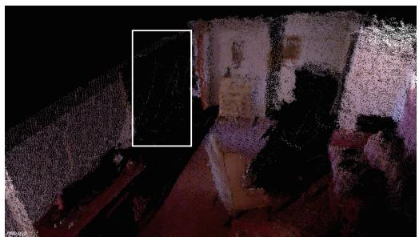

<details>
<summary>natural_image</summary>

Interior view of a dimly lit room with dark furniture and a large wall plaque (no visible text or symbols)
</details>

滤波前

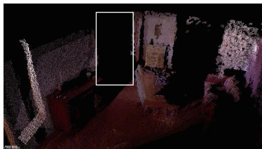

<details>
<summary>natural_image</summary>

Interior view of a dimly lit room with dark walls and minimal lighting (no visible text or symbols)
</details>

滤波后  
图 13-8 滤波前后的对比图（你可能需要放大才能看清，或者自己在电脑上尝试一下）。

图 13-8 显示了滤波前后的对比图。左侧是第五讲程序生成的点云地图，而右侧是经过滤波后的点云地图。观察白色框中部分，可以看到在滤波前存在着由噪声产生的许多孤立的点。经过统计外点去除之后，我们消去了这些噪声，使得整个地图变得更干净。另一方面，我们在体素滤波器中，把分辨率调至 0.01，表示每立方厘米有一个点。这是一个比较高的分辨率，所以在截图中我们感觉不出地图的差异，然而程序输出中可以看到点数明显减少了许多（从 90 万个点减到了 44 万个点，去除了一半左右）。

点云地图为我们提供了比较基本的可视化地图，让我们能够大致了解环境的样子。它以三维方式存储，使得我们能够快速地浏览场景的各个角落，乃至在场景中进行漫游。点云的一大优势是可以直接由 RGB-D 图像高效地生成，不需要额外的处理。它的滤波操作也非常直观，且处理效率尚能接受。

不过，使用点云表达地图仍然是十分初级的，我们不妨按照之前提的对地图的需求，看看点云地图是否能满足：

1. 定位需求：取决于前端视觉里程计的处理方式。如果是基于特征点的视觉里程计，由于点云中没有存储特征点信息，所以无法用于基于特征点的定位方法。如果前端是点云的 ICP，那么可以考虑将局部点云对全局点云进行 ICP 以估计位姿。然而，这要求全局点云具有较好的精度。在我们这种处理点云的方式中，并没有对点云本身进行优化，所以是不够的。  
2. 导航与避障的需求：无法直接用于导航和避障。纯粹的点云无法表示“是否有障碍物”的信息，我们也无法在点云中做“任意空间点是否被占据”这样的查询，而这是导航和避障的基本需要。不过，可以在点云基础上进行加工，得到更适合导航与避障的地图形式。  
3. 可视化和交互：具有基本的可视化与交互能力。我们能够看到场景的外观，也能在场景里漫游。从可视化角度来说，由于点云只含有离散的点，而没有物体表面信息（例如法线），所以不太符合人们对可视化习惯。例如，点云地图的物体从正面看和背面看是一样的，而且还能透过物体看到它背后的东西：这些都不符合我们日常的经验，因为我们没有物体表面的信息。

综上所述，我们说点云地图是“基础”的或“初级的”，是指它更接近于传感器读取的原始数据。它具有一些基本的功能，但通常用于调试和基本的显示，不便直接用于应用程序。如果我们希望地图有更高级的功能，点云地图是一个不错的出发点。例如，针对导航功能，我们可以从点云出发，构建占据网格地图（Occupancy Grid），以供导航算法查询某点是否可以通过。再如，SfM 中常用的泊松重建 [116] 方法，就能通过基本的点云重建物体网格地图，得到物体的表面信息。除泊松重建之外，Surfel 亦是一种表达物体表面的方式，以面元作为地图的基本单位，能够建立漂亮的可视化地图 [117]。

图 13-9 显示了泊松重建和 surfel 的一个样例，可以看成它们的视觉效果明显优于纯粹点云建图，而它们都可以通过点云进行构建。大部分由点云转换得到的地图形式都在 PCL库中提供，感兴趣的读者可以进一步探索 PCL 库内容。而本书作为入门材料，就不详尽地介绍每一种地图形式了。

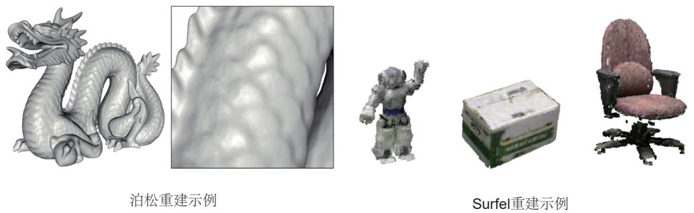  
图 13-9 泊松重建与 surfel 的示意图

## 13.5.2 八叉树地图

下面我们介绍一种在导航中比较常用的，本身有较好的压缩性能的地图形式：八叉树地图。

在点云地图中，我们虽然有了三维结构，亦进行了体素滤波以调整分辨率，但是点云有几个明显的缺陷：

• 点云地图通常规模很大，所以一个 pcd 文件也会很大。一张 640×480 的图像，会产生 30 万个空间点，需要大量的存储空间。即使经过一些滤波之后，pcd 文件也是很大的。而且讨厌之处在于，它的“大”并不是必需的。点云地图提供了很多不必要的细节。对于地毯上的褶皱、阴暗处的影子，我们并不特别关心这些东西。把它们放在地图里是浪费空间。由于这些空间的占用，除非我们降低分辨率，否则在有限的内存中，无法建模较大的环境。然而降低分辨率会导致地图质量下降。有没有什么方式对地图进行压缩地存储，舍弃一些重复的信息呢？  
• 点云地图无法处理运动物体。因为我们的做法里只有“添加点”，而没有“当点消失时把它移除”的做法。而在实际环境中，运动物体的普遍存在，使得点云地图变得不够实用。

而我们接来下要介绍的地图形式，就是一种灵活的、压缩的、又能随时更新的地图形式：八叉树①（Octo-map）[118]。

我们知道，把三维空间建模为许多个小方块（或体素），是一种常见的做法。如果我们把一个小方块的每个面平均切成两片，那么这个小方块就会变成同样大小的八个小方块。这个步骤可以不断的重复，直到最后的方块大小达到建模的最高精度。在这个过程中，把“将一个小方块分成同样大小的八个”这件事，看成“从一个节点展开成八个子节点”，那么，整个从最大空间细分到最小空间的过程，就是一棵八叉树（Octo-tree）。

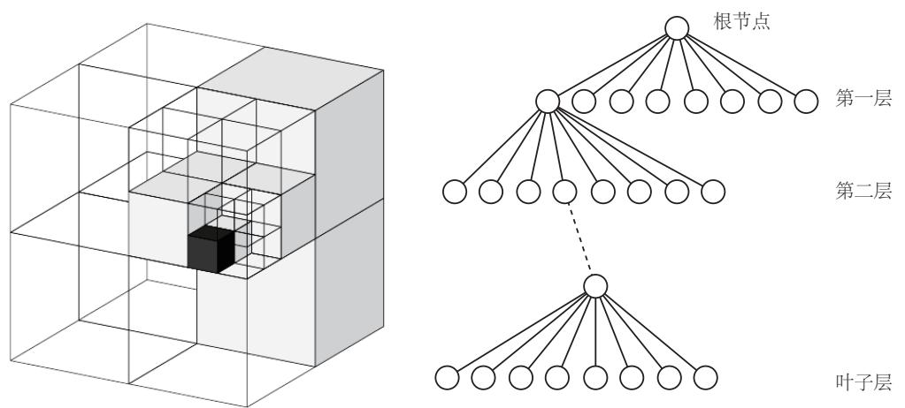

<details>
<summary>flowchart</summary>

```mermaid
graph TD
  A["根节点"] --> B["第一层"]
  A --> C["第二层"]
  A --> D["叶子层"]
    style A fill:#f9f,stroke:#333
    style B fill:#ccf,stroke:#333
    style C fill:#ccf,stroke:#333
    style D fill:#ccf,stroke:#333
```
</details>

图 13-10 八叉树示意图

图 13-10 是八叉树示意图。左侧显示了一个大立方体不断地均匀分成八块，直到变成最小的方块为止。于是，整个大方块可以看成是根节点，而最小的块可以看作是“叶子节点”。于是，在八叉树中，当我们由下一层节点往上走一层时，地图的体积就能扩大八倍。我们不妨做一点简单的计算：如果叶子节点的方块大小为 $\mathrm { 1 ~ c m ^ { 3 } }$ ，那么当我们限制八叉树为 10 层时，总共能建模的体积大约为 $8 ^ { 1 0 } = 1 , 0 7 3 ~ \mathrm { m ^ { 3 } }$ ，这足够建模一间屋子。由于体积与深度成指数关系，所以当我们用更大的深度时，建模的体积会增长的非常快。

读者可能会疑惑，在点云的体素滤波器中，我们不是也限制了一个体素中只有一个点吗？为何我们说点云占体积，而八叉树比较节省空间呢？这是因为，在八叉树中，我们在节点中存储它是否被占据的信息。然而，不一样之处，在于当某个方块的所有子节点都被占据或都不被占据时，就没必要展开这个节点。例如，一开始地图为空白时，我们就只需一个根节点，而不需要完整的树。当在地图中添加信息时，由于实际的物体经常连在一起，空白的地方也会常常连在一起，所以大多数八叉树节点都无需展开到叶子层面。所以说，八叉树比点云节省了大量的存储空间。

前面说八叉树的节点存储了它是否被占据的信息。从点云层面来讲，我们自然可以用

0 表示空白，1 表示被占据。这种 0-1 的表示可以用一个比特来存储，节省空间，不过显得有些过于简单了。由于噪声的影响，我们可能会看到某个点一会为 0，一会儿为 1；或者大部分时刻为 0，小部分时刻为 1；或者除了“是、否”两种情况之外，还有一个“未知”的状态。能否更精细地描述这件事呢？我们会选择用概率形式表达某节点是否被占据的事情。比方说，用一个浮点数 $x \in [ 0 , 1 ]$ 来表达。这个 x 一开始取 0.5。如果不断观测到它被占据，那么让这个值不断增加；反之，如果不断观测到它是空白，那就让它不断减小即可。

通过这种方式，我们动态地建模了地图中的障碍物信息。不过，现在的方式有一点小问题：如果让 x 不断增加或减小，它可能跑到 [0,1] 区间之外，带来处理上的不便。所以我们不是直接用概率来描述某节点被占据，而是用概率对数值（Log-odds）来描述。设 $y \in \mathbb { R }$ 为概率对数值，x 为 0 到 1 之间的概率，那么它们之间的变换由 logit 变换描述：

$$
y = \operatorname{logit} (x) = \log \left(\frac {x}{1 - x}\right). \tag {13.17}
$$

其反变换为：

$$
x = \operatorname{logit} ^ {- 1} (y) = \frac {\exp (y)}{\exp (y) + 1}. \tag {13.18}
$$

可以看到，当 y 从 −∞ 变到 +∞ 时，x 相应地从 0 变到了 1。而当 y 取 0 时，x 取到 0.5。因此，我们不妨存储 y 来表达节点是否被占据。当不断观测到“占据”时，让 y增加一个值；否则就让 y 减小一个值。当查询概率时，再用逆 logit 变换，将 y 转换至概率即可。用数学形式来说，设某节点为 n，观测数据为 z。那么从开始到 t 时刻某节点的概率对数值为 $L ( n | z _ { 1 : t } )$ ，那么 t+ 1 时刻为：

$$
L (n | z _ {1: t + 1}) = L (n | z _ {1: t - 1}) + L (n | z _ {t}). \tag {13.19}
$$

如果写成概率形式而不是概率对数形式，就会有一点复杂①：

$$
P (n | z _ {1: T}) = \left[ 1 + \frac {1 - P (n | z _ {T})}{P (n | z _ {T})} \frac {1 - P (n | z _ {1 : T - 1})}{P (n | z _ {1 : T - 1})} \frac {P (n)}{1 - P (n)} \right] ^ {- 1}. \tag {13.20}
$$

有了对数概率，我们就可以根据 RGB-D 数据，更新整个八叉树地图了。假设我们在RGB-D 图像中观测到某个像素带有深度 d，这说明了一件事：我们在深度值对应的空间点上观察到了一个占据数据，并且，从相机光心出发，到这个点的线段上，应该是没有物体的（否则会被遮挡）。利用这个信息，可以很好地对八叉树地图进行更新，并且能处理运动的结构。

## 13.5.3 实践：八叉树地图

下面，我们通过程序演示一下 octomap 的建图过程。首先，请读者安装 octomap 库：https://github.com/OctoMap/octomap。Octomap 库主要包含 octomap 地图与 octovis（一个可视化程序），二者都是 cmake 工程。请读者自行对它们进行编译和安装。主要依赖项是 doxygen：

```txt
sudo apt-get install doxygen
```

考虑到已经介绍过许多有关 cmake 工程的编译安装了，这里就不详细展开。我们直接来演示如何通过前面的五张图像生成八叉树地图，然后将它画出来。代码中，我们省略掉图像读取的部分，因为这和前面的内容相同。

slambook/ch13/dense\_RGBD/octomap\_mapping.cpp（片段）  
```cpp
#include <iostream>
#include <fstream>
using namespace std;

#include <opencv2/core/core.hpp>
#include <opencv2/highgui/highgui.hpp>

#include <octomap/octetmap.h> // for octomap

#include <Eigen/Geometry>
#include <boost/format.hpp> // for formatting strings

int main(int argc, char** argv)
{
    // 图像和位姿读取部分略
    cout<<"正在将图像转换为 Octomap ..."<<endl;

    // octomap tree
    octomap::OcTree tree(0.05); // 参数为分辨率

    for (int i=0; i<5; i++)
    {
    cout<<"转换图像中："<<i+1<<endl;
    cv::Mat color = colorImgs[i];
    cv::Mat depth = depthImgs[i];
    Eigen::Isometry3d T = poses[i];

    octomap::Pointcloud cloud; // the point cloud in octomap

    for (int v=0; v<color.rows; v++)
    for (int u=0; u<color.cols; u++)
    {
```

```cpp
unsigned int d = depth.ptr<unsigned short> ( v ) [u]; // 深度值
if ( d == 0 ) continue; // 为0表示没有测量到
if ( d >= 7000 ) continue; // 深度太大时不稳定，去掉
Eigen::Vector3d point;
point[2] = double(d)/depthScale;
point[0] = (u-cx)*point[2]/fx;
point[1] = (v-cy)*point[2]/fy;
Eigen::Vector3d pointWorld = T*point;
// 将世界坐标系的点放入点云
cloud.push_back( pointWorld[0], pointWorld[1], pointWorld[2] );
}

// 将点云存入八叉树地图，给定原点，这样可以计算投射线
tree.insertPointCloud( cloud, octomap::point3d( T(0,3), T(1,3), T(2,3) ) );
}

// 更新中间节点的占据信息并写入磁盘
tree.updateInnerOccupancy();
cout<<"saving octomap ... "<<endl;
tree.writeBinary( "octomap.bt" );
return 0;
}
```

我们使用了 octomap::OcTree 来构建整张地图。实际上 octomap 提供了许多种八叉树：有带地图的，有带占据信息的，你也可以自己定义每个节点需要携带哪些变量。简单起见，我们使用了不带颜色信息的，最基本的八叉树地图。

ocotmap 内部提供了一个点云结构。它比 PCL 的点云稍微简单一些，只携带点的空间位置信息。我们根据 RGB-D 图像和相机位姿信息，先将点的坐标转至世界坐标，然后放入octomap 的点云，最后交给八叉树地图。之后，octomap 会根据之前介绍的投影信息，更新内部的占据概率，最后保存成压缩后的八叉树地图。我们把生成的地图存成 octomap.bt文件。在之前编译 octovis 时，我们实际上安装了一个可视化程序，即 octovis。现在，调用它打开地图文件，就能看到地图的实际样子了。

图13-11显示了我们构建的地图结果。由于我们没有在地图中加入颜色信息，所以一开始打开地图时将是灰色的，按 1 键可以根据高度信息进行染色。读者可以熟悉一下 octovis的操作界面，包括地图的查看、旋转、缩放等等。

在右侧有八叉树地深度限制条，这里可以调节地图的分辨率。由于我们构造时使用的默认深度是 16 层，所以这里显示 16 层的话即最高分辨率，也就是每个小块的边长为 0.05米。当我们将深度减少一层时，八叉树的叶子节点往上提了一层，每个小块的边长就增加两倍，变成 0.1 米。可以看到，我们能够很容易地调节地图分辨率以适应不同的场合。

Octomap 还有一些可以探索的地方，例如，我们可以方便地查询任意点的占据概率，以此设计在地图中进行导航的方法 [119]。读者亦可比较点云地图与八叉树地图的文件大小。上一节生成的点云地图的磁盘文件大约为 6.9M，而 octomap 只有 56K，连点云地图的百分之一都不到，可以有效地建模较大的场景。

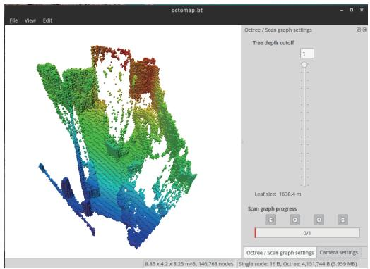

<details>
<summary>text_image</summary>

octomap.bt
File View Edit
Octree / Scan graph settings
Tree depth cutoff
1
Leaf size: 1638.4 m
Scan graph progress
0/1
Octree / Scan graph settings Camera settings
8.85 x 4.2 x 8.25 m^3: 146,768 nodes Single node: 16 B; Octree: 4,151,744 B (3,959 MB)
</details>

八叉树地图（0.05米分辨率）

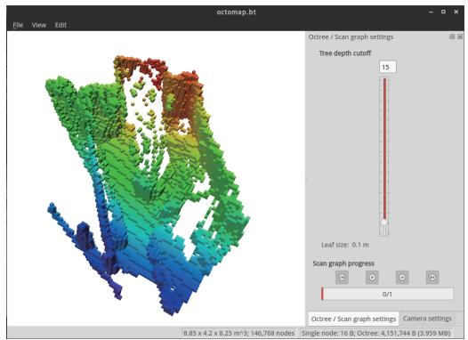

<details>
<summary>text_image</summary>

File View Edit
octomap.bt
Octree / Scan graph settings
Tree depth cutoff
15
Leaf size: 0.1 m
Scan graph progress
0/1
Octree / Scan graph settings Camera settings
8.85 x 4.2 x 8.25 m^3; 146,768 nodes Single node: 16 B; Octree: 4,151,744 B (3.959 MB)
</details>

八叉树地图（0.1米分辨率）  
图 13-11 八叉树地图在不同分辨率下的显示结果

## 13.6 \*TSDF 地图和 Fusion 系列

在本章的最后，我们介绍与 SLAM 非常相似但又有稍许不同的一个研究方向：实时三维重建。本节内容牵涉到 GPU 编程，没有提供参考例子，所以作为可选的阅读材料。

在前面的地图模型中，我们的做法以定位为主体。地图的拼接，是作为后续加工步骤，放在 SLAM 框架中的。这种框架成为主流的原因，是因为定位算法可以满足实时性的需求，而地图的加工可以在关键帧处进行处理，无需实时响应。定位通常是轻量级的，特别是当我们使用稀疏特征或稀疏直接法的时候；相应的，地图的表达与存储则是重量级的。它们的规模和计算需求较大，不利于实时处理。特别是稠密地图，往往只能在关键帧层面进行计算。

但是，现有做法中，我们并没有对稠密地图进行优化。比方说，当两张图像都观察到同一把椅子时，我们只根据了两张图像的位姿，把两处的点云进行叠加，生成了地图。由于位姿估计通常是带有误差的，这种直接拼接往往不够准确，比如同一把椅子的点云无法完美地叠加在一起。这时候，地图中会出现这把椅子的两个重影——这种形象有时候被形象地称为“鬼影”。

这种现象显然不是我们想要的，我们希望重建结果是光滑的、完整的，符合我们对地图的认识的。在这种思想下，出现了一种以“建图”为主体，而定位居于次要地位的做法，也就是本节想介绍的实时三维重建。由于三维重建把重建准确地图作为主要目标，所以基本都需要利用 GPU 进行加速，甚至需要非常高级的 GPU 或多个 GPU 进行并行加速，通常需要较重的计算设备。而相反的，SLAM 则是往轻量级、小型化方向发展，有些方案甚至放弃了建图和回环检测部分，只保留了视觉里程计。而实时重建的研究方向正在往大规模、大型动态场景的重建方向发展。

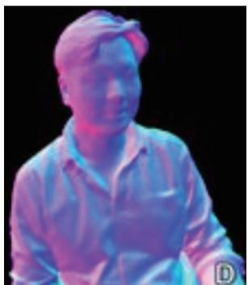

<details>
<summary>natural_image</summary>

Portrait of a man in a light-colored shirt against a dark background (no visible text or symbols)
</details>

(a)

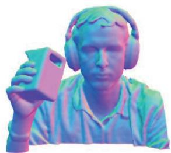

<details>
<summary>natural_image</summary>

Stylized portrait of a person wearing headphones and holding a smartphone (no text or symbols visible)
</details>

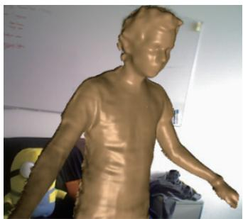

<details>
<summary>natural_image</summary>

3D rendered human figure in a clinical setting, no visible text or symbols
</details>

(c)

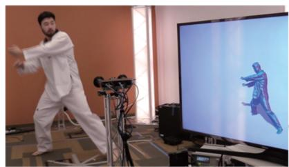

<details>
<summary>natural_image</summary>

Person performing a martial arts stance on a screen with a 3D human figure, no visible text or symbols
</details>

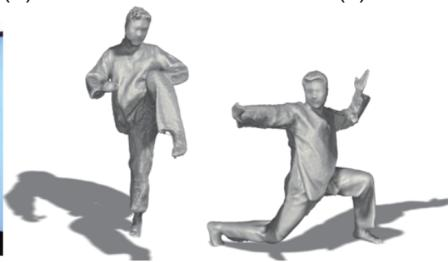

<details>
<summary>natural_image</summary>

Two 3D figurines in dynamic poses, one performing a high kick and the other kneeling with arms raised (no text or symbols)
</details>

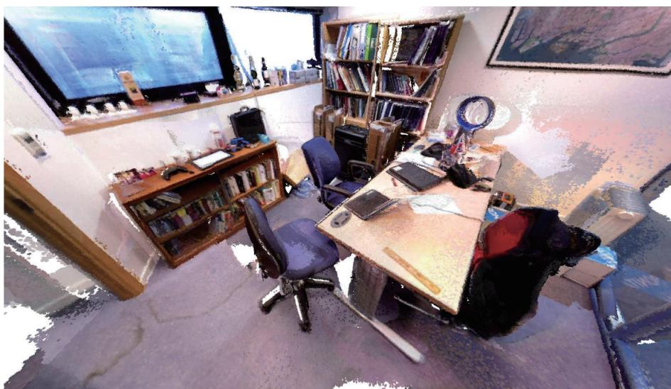

<details>
<summary>natural_image</summary>

Interior of a cluttered study room with a desk, bookshelves, and a large window (no visible text or symbols)
</details>

(e)  
图 13-12 各种实时三维重建的模型。(a) Kinect Fusion. (b) Dynamic Fusion. (c) Volumn Deform. (d) Fusion4D. (e) Elastic Fusion.

自从 RGB-D 传感器出现以来，利用 RGB-D 图像进行实时重建形成了一个重要的发展方向，陆续出现了 Kinect Fusion [120]，Dynamic Fusion [121]，Elastic Fusion [122]，Fusion4D [123]，Volumn Deform [124] 等等工作。其中，Kinect Fusion 完成了基本的模型重建，但仅限于小型场景；后续的工作则是将它往大型的、运动的甚至变形场景下拓展。我们把它们看成实时重建一个大类的工作，但由于种类繁多，不可能详细讨论每一种的工作原理。图 13-12 展示了一部分重建结果，可以看到这些建模结果非常的精细，比单纯拼接点云要细腻很多。

我们就以经典的 TSDF 地图为代表进行介绍。TSDF 是 Truncated Signed DistanceFunction 的缩写，不妨译作截断符号距离函数。虽然把“函数”称为“地图”似乎不太妥当，然而在没有更好的翻译之前，我们还是暂时称它为 TSDF 地图、TSDF 重建等等，只要不产生理解上的偏差即可。

与八叉树相似，TSDF 地图也是一种网格式（或直观地说，方块式）的地图，如图13-13所示。先选定要建模的三维空间，比如 $3 { \times } 3 { \times } 3 ~ \mathrm { m } ^ { 3 }$ 那么大，按照一定分辨率，将这个空间分成许多小块，存储每个小块内部的信息。不同的是，TSDF 地图整个儿存储在 GPU显存当中而不是内存中。利用 GPU 的并行特性，我们可以并行地对对每个体素进行计算和更新，而不像 CPU 遍历内存区域那样，不得不串行地进行。

每个 TSDF 体素内，存储了该小块与最近的物体表面的距离。如果小块在最近物体表面的前方，它就有一个正的值；反之，如果该小块位于表面之后，那么这个值就为负。由于物体表面通常是很薄的一层，所以就把值太大的和太小的都取成 1 和-1，这就得到了截断之后距离，也就是所谓的 TSDF。那么按照定义，TSDF 为 0 的地方就是表面本身—或者，由于数值误差的存在，TSDF 由负号变成正号的地方就是表面本身。在图13-13下面部分中，我们看到一个类似于人脸的表面，出现在 TSDF 改变符号的地方。

TSDF 亦有“定位”与“建图”两个问题，与 SLAM 非常的相似，不过具体的形式与本书前面几章介绍的稍有不同。在这里，定位问题主要指如何把当前的 RGB-D 图像与GPU 中的 TSDF 地图进行比较，估计相机位姿。而建图问题，就是如何根据估计的相机位姿，对 TSDF 地图进行更新。传统做法中，我们还会对 RGB-D 图像进行一次双边贝叶斯滤波，以去除深度图中的噪声。

TSDF 的定位类似于前面介绍的 ICP，不过由于 GPU 的并行化，我们可以对整张深度图和 TSDF 地图进行 ICP 的计算，而不必像传统视觉里程计那样必须先计算特征点。同时，由于 TSDF 没有颜色信息，意味着我们可以只使用深度图，不使用彩色图，就能完成位姿估计，这在一定程度上摆脱了视觉里程计算法对光照和纹理的依赖性，使得 RGB-D重建更加鲁棒①。另一方面，建图部分亦是一种并行地对 TSDF 中的数值进行更新的过程，使得所估计的表面更加平滑可靠。由于我们并不过多介绍 GPU 相关的内容，所以具体的方法就不展开细说了，请感兴趣读者参照阅读相关文献。

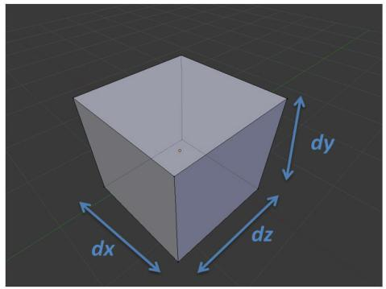

<details>
<summary>natural_image</summary>

3D cube diagram with labeled dimensions dx, dz, and dy on a grid background (no text or symbols beyond labels)
</details>

$d x = d y = d z = 3 [ m e t e r s ]$

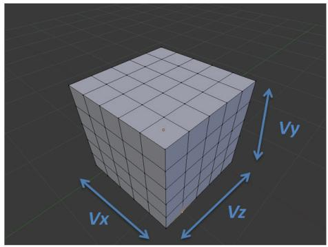

<details>
<summary>natural_image</summary>

3D wireframe cube with labeled axes Vx, Vy, Vz (no text or symbols on the cube itself)
</details>

Vx=Vy=Vz={32,64,128,256,512}[vxels]

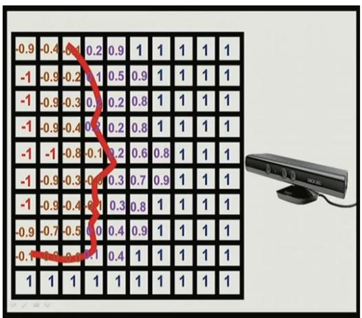

<details>
<summary>text_image</summary>

-0.9 -0.4 -0.1 0.2 0.9 1 1 1 1 1
-1 -0.9 -0.2 0.1 0.5 0.9 1 1 1 1 1
-1 -0.9 -0.3 0.2 0.2 0.8 1 1 1 1 1
-1 -0.9 -0.4 0.3 0.2 0.8 1 1 1 1 1
-1 -1 -0.8 -0.1 0.2 0.6 0.8 1 1 1 1
-1 -0.9 -0.3 -0.6 0.3 0.7 0.9 1 1 1 1
-1 -0.9 -0.4 -0.1 0.3 0.8 1 1 1 1 1
-0.9 -0.7 -0.5 0.0 0.4 0.9 1 1 1 1 1
-0.7 -0.9 -0.2 -0.1 0.4 1 1 1 1 1 1
1 1 1 1 1 1 1 1 1 1 1
</details>

相机观察到物体表面时形成的截断距离值  
图 13-13 TSDF 示意图。

## 13.7 小结

本讲介绍了一些常见类型的地图，尤其是稠密地图形式。我们看到根据单目或双目可以构建稠密地图，而 RGB-D 地图则往往更加容易、稳定一些。本讲的地图偏重于度量地图，而拓扑地图形式，因为它和 SLAM 研究差别比较大，我们没有详细地展开探讨。习题

1. 推导式（13.6）。  
2. 把本讲的稠密深度估计改成半稠密，你可以先把梯度明显的地方筛选出来。  
3. \* 把本讲演示的单目稠密重建代码，从正深度改成逆深度，并添加仿射变换。你的实验效果是否有改进？  
4. 你能论证如何在八叉树中进行导航或路径规划吗？  
5. 研究 [120]，探讨 TSDF 地图是如何进行位姿估计和更新的。它和我们之前讲过的定位建图算法有何异同？  
6. \* 研究均匀——高斯混合滤波器的原理与实现。

## 第 14 讲

## SLAM：现在与未来

## 本节目标

1. 了解经典的 SLAM 实现方案。  
2. 通过实验，比较各种 SLAM 方案的异同。  
3. 探讨 SLAM 的未来的发展方向。

终于到本书最后一章了。我们前面的内容介绍了一个 SLAM 系统中的各个模块的工作原理，这是研究者们多年的工作的结晶。目前，除了这些理论框架之外，我们也积累了许多优秀的开源 SLAM 方案。不过，由于它们大部分实现都比较复杂，不适合初学者做为上手的材料，所以我们放到了本书的最后加以介绍。相信读者通过阅读之前的章节，应该能明白它们的基本原理。

## 14.1 当前的开源方案

本讲是全书的总结章，名为“SLAM 的现在与未来”。我们将带领读者，看看现有的SLAM 方案能做到怎样的程度。特别地，我们重点关注那些提供开源实现的方案。在 SLAM研究领域，能见到开源方案是很不容易的。往往论文中介绍理论只占百分之二十的内容，其他百分之八十都写在代码中，是论文里没有提到的。正是靠着这些研究者的无私奉献，推动了整个 SLAM 行业的快速前进，使后续研究人员有了更高的起步点。在我们开始自己做SLAM 之前，应该对相似的方案有深入的了解，然后再进行自己的研究，会更有意义。

本讲的前半部分将带领读者参观一下当前的视觉 SLAM 方案，评述一下它们的历史地位和优缺点。在这个过程中，读者可以保持一种参观博物馆的轻松心态，如果对某样文物特别感兴趣，也不妨到网络中下载它，自己动手做一番实验。鉴于篇幅，我们只选了有代表性的一部分方案，这肯定是不全面的。表 14-1 列举了一些常见的开源 SLAM 方案，读者可以选择感兴趣的方案，进行研究和实验。在后半部分，我们将探讨未来可能的一些发展方向，并给出一些工作。虽然这种做法会使本书有一点时效性，因为未来肯定会出现更优秀的方案，更好的研究方向，不过我觉得这可以切实地帮助到读者们。

表 14-1 常用开源 SLAM 方案

<table><tr><td>方案名称</td><td>传感器形式</td><td>地址</td></tr><tr><td>MonoSLAM</td><td>单目</td><td>https://github.com/hanmekim/SceneLib2</td></tr><tr><td>PTAM</td><td>单目</td><td>http://www.robots.ox.ac.uk/~gk/PTAM/</td></tr><tr><td>ORB-SLAM</td><td>单目为主</td><td>http://webdiis.unizar.es/~raulmur/orbslam/</td></tr><tr><td>LSD-SLAM</td><td>单目为主</td><td>http://vision.in.tum.de/research/vslam/lsdslam</td></tr><tr><td>SVO</td><td>单目</td><td>https://github.com/uzh-rpg/rpg_svo</td></tr><tr><td>DTAM</td><td>RGB-D</td><td>https://github.com/anuranbaka/OpenDTAM</td></tr><tr><td>DVO</td><td>RGB-D</td><td>https://github.com/tum-vision/dvo_slam</td></tr><tr><td>DSO</td><td>单目</td><td>https://github.com/JakobEngel/dso</td></tr><tr><td>RTAB-MAP</td><td>双目/RGB-D</td><td>https://github.com/introlab/rtabmap</td></tr><tr><td>RGBD-SLAM-V2</td><td>RGB-D</td><td>https://github.com/felixendres/rgbdslam_v2</td></tr><tr><td>Elastic Fusion</td><td>RGB-D</td><td>https://github.com/mp3guy/ElasticFusion</td></tr><tr><td>Hector SLAM</td><td>激光</td><td>http://wiki.ros.org/hector_slam</td></tr><tr><td>GMapping</td><td>激光</td><td>http://wiki.ros.org/gmapping</td></tr><tr><td>OKVIS</td><td>多目+IMU</td><td>https://github.com/ethz-asl/okvis</td></tr><tr><td>ROVIO</td><td>单目+IMU</td><td>https://github.com/ethz-asl/rovio</td></tr></table>

## 14.1.1 MonoSLAM

说到视觉 SLAM，很多研究者第一个想到的是 A. J. Davison 的单目 SLAM 工作 [2,125]。Davison 教授是视觉 SLAM 研究领域的先驱，他在 2007 年提出的 MonoSLAM 是第一个实时的单目视觉 SLAM 系统 [2]，被认为是许多工作的发源地①。MonoSLAM 以扩展卡尔曼滤波为后端，追踪前端非常稀疏的特征点。由于 EKF 在早期 SLAM 中占据着明显主导地位，所以 MonoSLAM 亦是建立在 EKF 的基础之上，以相机的当前状态和所有路标点为状态量，更新其均值和协方差。

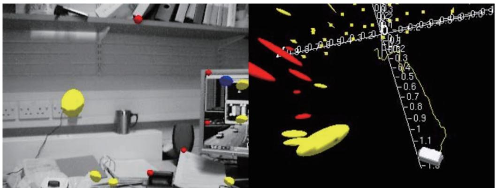

<details>
<summary>natural_image</summary>

Interior of a lab with 3D-rendered equipment and a 3D thermal or simulation visualization (no text or symbols)
</details>

图 14-1 MonoSLAM 的运行时截图。左侧：追踪特征点在图像中的表示；右侧：特征点在三维空间中的表示。

图 14-1 是 MonoSLAM 在运行时的图片。可以看到，单目相机在一张图像当中追踪了非常稀疏的特征点（且用到了主动追踪技术）。在 EKF 中，每个特征点的位置服从高斯分布，所以我们能够以一个椭球的形式表达它的均值和不确定性。在该图的右半部分，我们可以找到一些在空间中分布着的小球。它们在某个方向上显得越长，说明在该方向的位置就越不确定。我们可以想象，如果一个特征点收敛，我们应该能看到它从一个很长的椭球（相机 Z 方向上非常不确定）最后变成一个小点的样子。

这种做法，在今天看来固然存在许多弊端，但在当时已经是里程碑式的工作了，因为在此之前的视觉 SLAM 系统，基本不能在线运行，只能靠机器人携带相机采集数据，再离线地进行定位与建图。计算机性能的进步，以及用稀疏的方式处理图像，加在一起才使得一个 SLAM 系统能够在线地运行。从现代的角度来看，MonoSLAM 存在诸如应用场景很窄，路标数量有限，稀疏特征点非常容易丢失的情况，对它的开发也已经停止，取而代之的是更先进的理论和编程工具。不过这并不妨碍我们对前人工作的理解和尊敬。

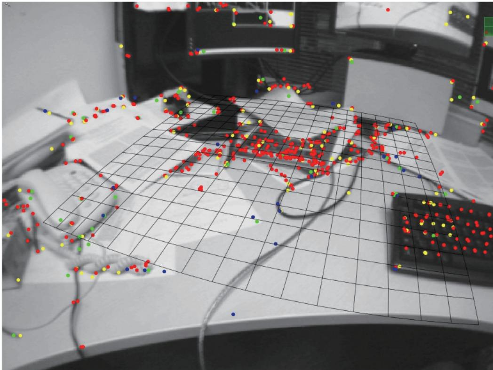

<details>
<summary>natural_image</summary>

Black-and-white photo of a person using a computer with a grid overlay and scattered colored dots (no text or symbols visible)
</details>

图 14-2 PTAM 的演示截图。它既可以提供实时的定位和建图，还可以在虚拟平面上叠加虚拟物体。

## 14.1.2 PTAM

2007 年，Klein 等人提出了 PTAM（Parallel Tracking and Mapping）[81]，亦是视觉SLAM 发展过程中的重要事件。PTAM 的重要意义在于以下两处：

1. PTAM 提出并实现了跟踪与建图过程的并行化。我们现在已然清楚，跟踪部分需要实时响应图像数据，而对地图的优化则没必要实时地计算。后端优化可以在后台慢慢进行，然后在必要的时刻进行线程同步即可。这是视觉 SLAM 中首次区分出前后端的概念，引领了后来许多视觉 SLAM 系统的设计（我们现在看到的 SLAM 多半都分前后端）。  
2. 除此之外，PTAM 是第一个使用非线性优化，而不是使用传统的滤波器作为后端的方案。它引入了关键帧机制：我们不必精细地处理每一个图像，而是把几个关键图像

串起来，然后优化其轨迹和地图。早期的 SLAM 大多数使用 EKF 滤波器或它的变种，以及粒子滤波器等等；在 PTAM 之后，视觉 SLAM 研究逐渐转向了以非线性优化为主导的后端。由于之前人们未认识到后端优化的稀疏性，所以觉得优化后端无法实时处理那样大规模的数据，而 PTAM 则是一个显著的反例。

3. PTAM 同时是一个增强现实软件，演示了酷炫的 AR 效果。根据 PTAM 估计的相机位姿，我们可以在一个虚拟的平面上放置虚拟物体，看起来就像在真实的场景中一样。

不过，从现代的眼光看来，PTAM 也算是早期的结合 AR 的 SLAM 工作之一。与许多早期工作相似，存在着明显的缺陷：场景小，跟踪容易丢失等等。这些又在后续的方案中得以修正。

## 14.1.3 ORB-SLAM

介绍了几种历史上的方案之后，我们来看现代的一些 SLAM 系统。ORB-SLAM 是PTAM 的继承者们中非常有名的一位 [73]。它提出于 2015 年，是现代 SLAM 系统中做的非常完善，非常易用的系统之一（如果不是最完善和易用的话）。ORB-SLAM 代表着主流的特征点 SLAM 的一个高峰。相比于之前的工作，ORB-SLAM 具有以下几条明显的优势：

1. 支持单目、双目、RGB-D 三种模式。这使得无论我们拿到了任何一种常见的传感器，都可以先放到 ORB-SLAM 上测试一下，它具有良好的泛用性。  
2. 整个系统围绕 ORB 特征进行计算，包括视觉里程计与回环检测的 ORB 字典。它体现出 ORB 特征是现阶段计算平台的一种优秀的效率与精度之间的折衷方式。ORB不像 SIFT 或 SURF 那样费时，在 CPU 上面即可实时计算；相比 Harris 角点等简单角点特征，又具有良好的旋转和缩放不变性。并且，ORB 提供描述子，使我们在大范围运动时能够进行回环检测和重定位。  
3. ORB 的回环检测是它的亮点。优秀的回环检测算法保证了 ORB-SLAM 有效地防止累计误差，并且在丢失之后还能迅速找回，这在许多现有的 SLAM 系统中都不够完善。为此，ORB-SLAM 在运行之前必须加载一个很大的 ORB 字典文件①。  
4. ORB-SLAM 创新式地使用了三个线程完成 SLAM：实时跟踪特征点的 Tracking 线程，局部 Bundle Adjustment 的优化线程（Co-visibility Graph，俗称小图），以及全局 Pose Graph 的回环检测与优化线程（Essential Graph 俗称大图）。其中，Tracking

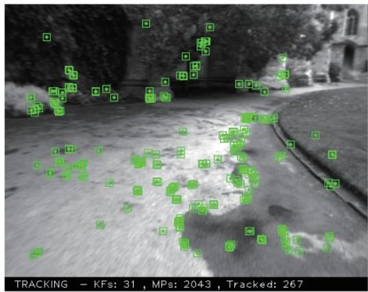

<details>
<summary>text_image</summary>

TRACKING - KFs: 31, MPs: 2043, Tracked: 267
</details>

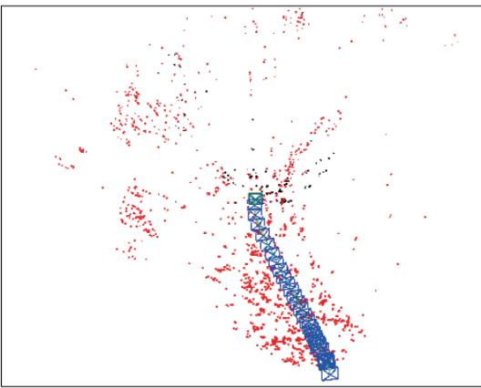

<details>
<summary>scatterplot</summary>

| x | y | category |
| --- | --- | --- |
| 0.1 | 0.95 | red |
| 0.2 | 0.88 | red |
| 0.3 | 0.75 | red |
| 0.4 | 0.62 | red |
| 0.5 | 0.55 | red |
| 0.6 | 0.48 | red |
| 0.7 | 0.42 | red |
| 0.8 | 0.38 | red |
| 0.9 | 0.35 | red |
| 1.0 | 0.32 | red |
| 1.1 | 0.30 | red |
| 1.2 | 0.28 | red |
| 1.3 | 0.25 | red |
| 1.4 | 0.23 | red |
| 1.5 | 0.22 | red |
| 1.6 | 0.21 | red |
| 1.7 | 0.20 | red |
| 1.8 | 0.19 | red |
| 1.9 | 0.18 | red |
| 2.0 | 0.17 | red |
| 2.1 | 0.16 | red |
| 2.2 | 0.15 | red |
| 2.3 | 0.14 | red |
| 2.4 | 0.13 | red |
| 2.5 | 0.12 | red |
| 2.6 | 0.11 | red |
| 2.7 | 0.10 | red |
| 2.8 | 0.09 | red |
| 2.9 | 0.08 | red |
| 3.0 | 0.07 | red |
| 3.1 | 0.06 | red |
| 3.2 | 0.05 | red |
| 3.3 | 0.04 | red |
| 3.4 | 0.03 | red |
| 3.5 | 0.02 | red |
| 3.6 | 0.01 | red |
| 3.7 | 0.005 | red |
| 3.8 | 0.0025 | red |
| 3.9 | 0.00125 | red |
| 4.0 | 0.000625 | red |
| 4.1 | 0.0003125 | red |
| 4.2 | 0.00015625 | red |
| 4.3 | 0.000078125 | red |
| 4.4 | 0.0000390625 | red |
| 4.5 | 0.00001953125 | red |
| 4.6 | 0.000009765625 | red |
| 4.7 | 0.0000048828125 | red |
| 4.8 | 0.00000244145625 | red |
| 4.9 | 0.0000012207125 | red |
| 5.0 | 0.00000061035625 | red |
| 5.1 | 0.000000305178125 | red |
| 5.2 | 0.0000001525890625 | red |
| 5.3 | 0.00000007629453125 | red |
| 5.4 | 0.000000038147765625 | red |
| 5.5 | 0.0000000195788828125 | red |
| 5.6 | 0.00000001483944145625 | red |
| 5.7 | 0.000000012469777778125 | red |
| 5.8 | 0.000000011223438389125 | red |
| 5.9 | 0.0000000131161969945625 | red |
| 6.0 | 0.00000001459889844778125 | red |
| 6.1 | 0.000000016384447778933125 | red |
| 6.2 | 0.00000001814273838436468125 | red |
| 6.3 | 0.00000002497639747748633125 | red |
| 6.4 | 0.0000000324637483877744136468125 | red |
</details>

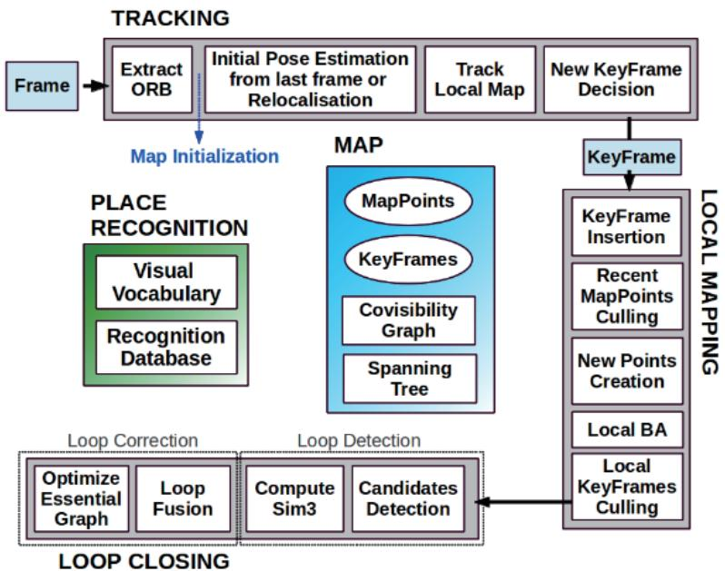

<details>
<summary>flowchart</summary>

```mermaid
graph TD
  A["Frame"] --> B["Extract ORB"]
  B --> C["Initial Pose Estimation from last frame or Relocalisation"]
  C --> D["Track Local Map"]
  D --> E["New KeyFrame Decision"]
  E --> F["KeyFrame"]
  F --> G["KeyFrame Insertion"]
  G --> H["Recent MapPoints Culling"]
  H --> I["New Points Creation"]
  I --> J["Local BA"]
  J --> K["Local KeyFrames Culling"]
  K --> L["Compute Sim3"]
  L --> M["Compute Essential Graph"]
  M --> N["Loop Fusion"]
  N --> O["Loop Correction"]
  O --> P["LOOP CLOSING"]
  P --> Q["MAP"]
  Q --> R["MapPoints"]
  Q --> S["KeyFrames"]
  Q --> T["Covisibility Graph"]
  Q --> U["Spanning Tree"]
  R --> V["KeyFrame"]
  S --> V
  T --> V
  U --> V
  V --> W["LOCAL MAPPING"]
    style A fill:#f9f,stroke:#333
    style E fill:#ccf,stroke:#333
    style F fill:#cfc,stroke:#333
    style G fill:#fcc,stroke:#333
    style H fill:#cff,stroke:#333
    style I fill:#ffc,stroke:#333
    style J fill:#fcc,stroke:#333
    style K fill:#fcc,stroke:#333
    style L fill:#ffc,stroke:#333
    style M fill:#cfc,stroke:#333
    style N fill:#cfc,stroke:#333
    style O fill:#cfc,stroke:#333
    style P fill:#cfc,stroke:#333
    style Q fill:#cfc,stroke:#333
    style R fill:#cfc,stroke:#333
    style S fill:#cfc,stroke:#333
    style T fill:#cfc,stroke:#333
    style U fill:#cfc,stroke:#333
    style V fill:#cfc,stroke:#333
```
</details>

图 14-3 ORB-SLAM 运行截图。左侧为图像与追踪到的特征点，右侧为相机轨迹与建模的特征点地图。下方为它标志性的三线程结构。

线程负责对每张新来的图像提取 ORB 特征点，并与最近的关键帧进行比较，计算特征点的位置并粗略估计相机位姿。小图线程求解一个 Bundle Adjustment 问题，它包括局部空间内的特征点与相机位姿。这个线程负责求解更精细的相机位姿与特征点空间位置。不过，仅有前两个线程，只完成了一个比较好的视觉里程计。第三个线程，也就是大图线程，对全局的地图与关键帧进行回环检测，消除累积误差。由于全局地图中的地图点太多，所以这个线程的优化不包括地图点，而只有相机位姿组成的位姿图。

继 PTAM 的双线程结构之后，ORB-SLAM 的三线程结构取得了非常好的跟踪和建图效果，能够保证轨迹与地图的全局一致性。这种三线程结构亦将被后续的研究者认同和采用。

5. ORB-SLAM 围绕特征点进行了不少的优化。例如，在 OpenCV 的特征提取基础上保证了特征点的均匀分布；在优化位姿时使用了一种循环优化四遍以得到更多正确匹配的方法；比 PTAM 更为宽松的关键帧选取策略等等。这些细小的改进使得 ORB-SLAM 具有远超其他方案的鲁棒性：即使对于较差的场景，较差的标定内参，ORB-SLAM 都能够顺利地工作。

上述这些优势使得 ORB-SLAM 在特征点 SLAM 中成为顶峰，许多研究工作都以ORB-SLAM 作为标准，或者在它基础上进行后续的开发。它的代码以清晰易读著称，有着完善的注释，供后来的研究者们进一步理解。

当然，ORB-SLAM 也存在一些不足之处。首先，由于整个 SLAM 系统都采用特征点进行计算，我们必须对每张图像都计算一遍 ORB 特征，这是非常耗时的。ORB-SLAM 的三线程结构也对 CPU 带来了较重的负担，使得它只有在当前 PC 架构的 CPU 上才能实时运算，移植到嵌入式端则有一定困难。其次，ORB-SLAM 的建图为稀疏特征点，目前还没有开放存储和读取地图后重新定位的功能（虽然从实现上来讲并不困难）。根据我们在建图章节的分析，稀疏特征点地图只能满足我们对定位的需求，而无法提供导航、避障、交互等诸多功能。然而，如果我们仅用 ORB-SLAM 处理定位问题，似乎又嫌它有些过于重量级了。相比之下，另外一些方案提供了更为轻量级的定位，使我们能够在低端的处理器上运行 SLAM，或者让 CPU 有余力处理其他的事务。

## 14.1.4 LSD-SLAM

LSD-SLAM（Large Scale Direct monocular SLAM）是 J. Engle 等人于 2014 年提出的 SLAM 工作 [59, 57]。类比于 ORB-SLAM 之于特征点，LSD-SLAM 则标志着单目直接法在 SLAM 中的成功应用。LSD-SLAM 的核心贡献，是将直接法应用到了半稠密的单目SLAM 中。它不仅不需要计算特征点，还能构建半稠密的地图——这里半稠密的意思主要是指估计梯度明显的像素位置。它的主要优点有：

1. LSD-SLAM 的直接法是针对像素进行的。作者有创见地提出了像素梯度与直接法的关系，以及像素梯度与极线方向在稠密重建中的角度关系。这些在本书的第 8 讲和

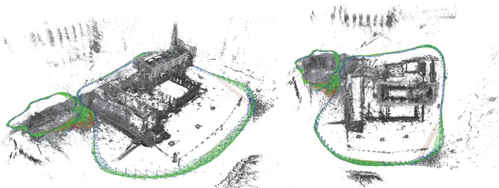

<details>
<summary>natural_image</summary>

Two hand-drawn architectural site plan sketches with green outlines and annotations, no readable text or symbols
</details>

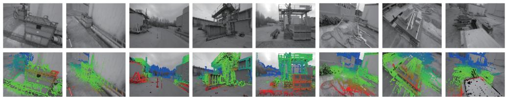

<details>
<summary>natural_image</summary>

Grid of grayscale industrial and transportation scenes with overlaid 3D bounding boxes (no visible text or symbols)
</details>

图 14-4 LSD-SLAM 运行图片。上半部分为估计的轨迹与地图，下半部分为图像中被建模的部分，即具有较好的像素梯度的部分。

13 讲均有讨论。不过，LSD-SLAM 是在单目图像进行半稠密的跟踪，实现原理要比本书的例程更加复杂。

2. LSD-SLAM 在 CPU 上实现了半稠密场景的重建，这在之前的方案中是很少见到的。基于特征点的方法只能是稀疏的，而进行稠密重建的方案大多要使用 RGB-D 传感器，或者使用 GPU 构建稠密地图 [126]。TUM 计算机视觉组在多年对直接法的研究基础上，实现了这种 CPU 上的实时半稠密 SLAM。  
3. 之前也说过，LSD-SLAM 的半稠密追踪使用了一些精妙的手段，来保证追踪的实时性与稳定性。例如，LSD-SLAM 既不是利用单个像素，也不是利用图像块，而是在极线上等距离取五个点，度量其 SSD；在深度估计时，LSD-SLAM 首先用随机数初始化深度，在估计完之后又把深度均值归一化，以调整尺度；在度量深度不确定性时，不仅考虑三角化的几何关系，而且考虑了极线与深度的夹角，归纳成一个光度不确定性项；关键帧之间的约束使用了相似变换群以及与之对应的李代数 $\zeta \in \mathfrak { s i m } ( 3 )$ ，显式地表达出尺度，在后端优化中就可以将不同尺度的场景考虑进来，减小了尺度飘移现象。

图 14-4 显示了 LSD 的运行情况。我们可以观察一下这种微妙的半稠密地图是一种如何介于稀疏地图与稠密地图之间的形式。半稠密地图建模了灰度图中梯度有明显梯度的部分，显示在地图中，很大一部分都是物体的边缘或表面上带纹理的部分。LSD-SLAM 对它们进行跟踪并建立关键帧，最后优化得到这样的地图。看起来比稀疏的地图具有更多的信息，但又不像稠密地图那样拥有完整的表面（稠密地图一般认为无法仅用 CPU 实现实时性）。

由于 LSD-SLAM 使用了直接法进行跟踪，所以它既有直接法的优点（对特征缺失区域不敏感），也继承了直接法的缺点。例如，LSD-SLAM 对相机内参和曝光非常敏感，并且在相机快速运动时容易丢失。另外，在回环检测部分，由于目前并没有在直接法基础实现的回环检测方式，LSD-SLAM 必须依赖于特征点方法进行回环检测，尚未完全摆脱特征点的计算。

## 14.1.5 SVO

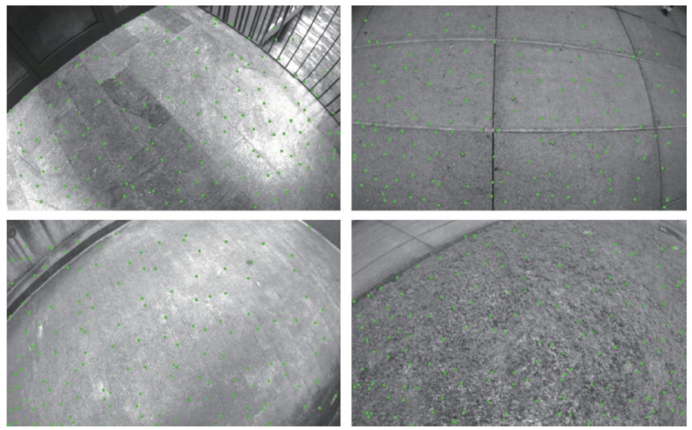  
图 14-5 SVO 跟踪关键点的图片。

SVO 是 Semi-direct Visual Odoemtry 的缩写 [56]。它是由 Forster 等人于 14 年提出的一种基于稀疏直接法的视觉里程计。按作者的称呼应该叫“半直接”法，然而按照本书的理念框架，称为“稀疏直接法”可能更好一些。半直接在原文的意思，是指特征点与直接法的混合使用：SVO 跟踪了一些关键点（角点，没有描述子），然后像直接法那样，根据这些关键点周围的信息，估计相机运动以及它们的位置。在实现中，SVO 使用了关键点周围的 4×4 的小块进行块匹配，估计相机自身的运动。

相比于其他方案，SVO 的最大优势是速度极快。由于使用稀疏的直接法，它既不必费力去计算描述子，也不必处理像稠密和半稠密那么多的信息，因此即使在低端计算平台上也能达到实时性，而在 PC 平台上则可以达到 100 多帧每秒的速度。在作者后续工作 SVO2.0 中，速度更达到了惊人的 400 帧每秒。这使得 SVO 非常适用于计算平台受限的场合，例如无人机、手持 AR/VR 设备的定位。无人机也是作者开发 SVO 的目标应用平台。

SVO 的另一创新之处是提出了深度滤波器的概念，并推导了基于均匀——高斯混合分布的深度滤波器。这在本书的 13 讲有所提及，但由于原理较为复杂我们没有详细解释。SVO 将这种滤波器用于关键点的位置估计，并使用了逆深度作为参数化形式，使之能够更好地计算特征点位置。

开源版的 SVO 代码清晰易读，十分适合读者作为第一个 SLAM 实例进行分析。不过，开源版 SVO 也存在一些问题：

1. 由于目标应用平台为无人机的俯视相机，考虑到视野内的物体主要是地面，而且相机的运动主要为水平和上下的移动，SVO 的许多细节是围绕这个应用设计的，使得它在平视相机中表现不佳。例如，SVO 在单目初始化时，使用了分解 H 矩阵而不是传统的 F 或 E 矩阵的方式，这需要假设特征点位于平面上。该假设对俯视相机是成立的，但对平视相机通常是不成立的，可能导致初始化失败。再如，SVO 在关键帧选择时，使用了平移量作为确定新的关键帧的策略，而没有考虑旋转量。这同样在无人机俯视配置下是有效的，但在平视相机中则会容易丢失。所以，如果读者想要在平视相机中使用 SVO，必须自己加以修改。

2. SVO 为了速度和轻量化，舍弃了后端优化和回环检测部分，也基本没有建图功能。这意味着 SVO 的位姿估计必然存在累计误差，而且丢失后不太容易进行重定位（因为没有描述子用来回环检测）。所以，我们称它为一个 VO，而不是称它为完整的 SLAM。

## 14.1.6 RTAB-MAP

介绍完了几款单目 SLAM 方案后，我们再来看看一些 RGB-D 传感器上的 SLAM 方案。相比于单目和双目，RGB-D SLAM 的原理要简单很多（尽管实现上不一定），而且能够在 CPU 上实时建立稠密的地图。

RTAB-MAP（Real Time Appearance-Based Mapping）[107] 是 RGB-D SLAM 中比较经典的一个方案。它实现了 RGB-D SLAM 中所有应该有的东西：基于特征的视觉里程计、基于词袋的回环检测、后端的位姿图优化以及点云和三角网格地图。因此，RTAB-MAP给出了一套完整的（但有些庞大的）RGB-D SLAM 方案。目前我们已经可以直接从 ROS中获得它二进制程序，此外，在 Google Project Tango 上也可以获取它的 app，愉快地玩耍了。

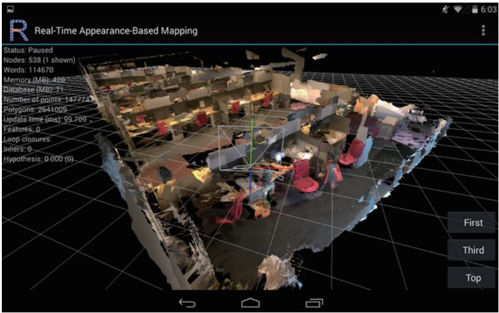

<details>
<summary>text_image</summary>

Real-Time Appearance-Based Mapping
Status: Paused
Nodes: 538 (1 shown)
Words: 114670
Memory (MB): 420
Database (MB): 71
Number of points: 1477743
Polygons: 2641009
Update time (ms): 99.709
Features: 0
Loop closures
Unliers: 0
Hypothesis: 0.000 (0)
First
Third
Top
</details>

图 14-6 RTAB-MAP 在 Google Project Tango 上的运行样例。

RTAB-MAP 支持一些常见的 RGB-D 和双目传感器，像 Kinect、Xtion 等等，且提供实时的定位和建图功能。不过由于集成度较高，使得其他开发者在它基础上进行二次开发变得困难，所以 RTAB-MAP 更适合作为 SLAM 应用而非研究使用。

## 14.1.7 其他

除了这些开源方案之外，读者还能在openslam.org之类的网站上找到许多其他的工作，例如 DVO-SLAM[127]，RGBD-SLAM-V2[88]，DSO[58] 以及一些 Kinect Fusion 相关的工作等等。随着时代发展，更新颖，更优秀的开源 SLAM 工作亦将出现在人们的视野中，但限于篇幅我们就不逐一介绍了。

## 14.2 未来的 SLAM 话题

看过了一些现有的方案，我们再来讨论一些未来的发展方向①。大体来说，SLAM 将来的发展趋势一共有两个大类：一是往轻量级、小型化方向发展，让 SLAM 能够在嵌入式或手机等小型设备上良好的运行，然后考虑以它为底层功能的应用。毕竟大部分场合中，我们的真正目的都是实现机器人、AR/VR 设备的功能，比如说运动、导航、教学、娱乐，而 SLAM 是为上层应用提供自身的一个位姿估计。在这些应用中，我们不希望 SLAM 占据所有计算资源，所以对 SLAM 的小型化和轻量化有非常强烈的要求。另一个方面，则是利用高性能计算设备，实现精密的三维重建、场景理解等功能。在这些应用中，我们的目的是完美地重建场景，而对于计算资源和设备的便携性则没有多大限制。由于可以利用GPU，这个方向和深度学习亦有结合点。

## 14.2.1 视觉 + 惯导 SLAM

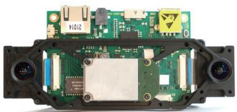

<details>
<summary>natural_image</summary>

Close-up of an electronic device showing internal components including a green circuit board, ports, and connectors (no visible text or symbols)
</details>

VI-Sensor

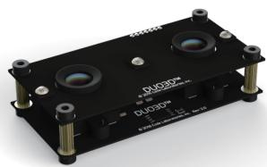

<details>
<summary>natural_image</summary>

3D rendering of a black electronic device with multiple ports and mounting feet (no visible text or symbols)
</details>

DUO 3D  
图 14-7 越来越多的相机开始集成 IMU 设备。

首先，我们要谈一个有很强应用背景的方向：视觉——惯导融合 SLAM 方案。实际的机器人也好，硬件设备也好，通常都不会只携带一种传感器，往往是多种传感器的融合。学术界的研究人员喜爱“大而且干净的问题”（Big Clean Problem），比如说仅用单个摄像头实现视觉 SLAM。但产业界的朋友们则更注重于让算法更加实用，不得不面对一些复杂而且琐碎的场景。在这种应用背景下，用视觉与惯导融合进行 SLAM 成为了一个关注热点。

惯性传感器（IMU）能够测量传感器本体的角速度和加速度，被认为与相机传感器具有明显的互补性，而且十分有潜力在融合之后得到更完善的 SLAM 系统 [128]。为什么这么说呢？

1. IMU 虽然可以测得角速度和加速度，但这些量都存在明显的漂移（Drift），使得积分两次得到的位姿数据非常不可靠。好比说，我们将 IMU 放在桌上不动，用它的读数积分得到的位姿也会漂出十万八千里。但是，对于短时间内的快速运动，IMU 能够提供一些较好的估计。这正是相机的弱点。

当运动过快时，（卷帘快门的）相机会出现运动模糊，或者两帧之间重叠区域太少以至于无法进行特征匹配，所以纯视觉 SLAM 非常害怕快速的运动。而有了 IMU，即使在相机数据无效的那段时间内，我们还能保持一个较好的位姿估计，这是纯视觉SLAM 无法做到的。

2. 相比于 IMU，相机数据基本不会有漂移。如果相机放在原地固定不动，那么（在静态场景下）视觉 SLAM 的位姿估计也是固定不动的。所以，相机数据可以有效地估计并修正 IMU 读数中的漂移，使得在慢速运动后的位姿估计依然有效。  
3. 当图像发生变化时，本质上我们没法知道是相机自身发生了运动，还是外界条件发生了变化，所以纯视觉 SLAM 难以处理动态的障碍物。而 IMU 能够感受到自己的运动信息，从某种程度上减轻动态物体的影响。

总而言之，我们看到 IMU 为快速运动提供了较好的解决方式，而相机又能在慢速运动下解决 IMU 的漂移问题——在这个意义下，它们二者是互补的。

当然，虽然说的很好听，不管是理论还是实践，VIO（Visual Inertial Odometry）都是相当复杂的。其复杂性主要来源于 IMU 测量加速度和角速度这两个量的事实，所以不得不引入运动学计算。目前 VIO 的框架已经定型为两大类：松耦合（Loosely Coupled）和紧耦合（Tightly Coupled）[129]。松耦合是指，IMU 和相机分别进行自身的运动估计，然后对它们的位姿估计结果进行融合。紧耦合是指，把 IMU 的状态与相机的状态合并在一起，共同构建运动方程和观测方程，然后进行状态估计——这和我们之前介绍的理论非常相似。我们可以预见到，紧耦合理论也必将分为基于滤波和基于优化的两个方向。在滤波方面，传统的 EKF[130] 以及改进的 MSCKF（Multi-State Constraint KF）[131] 都取得了一定的成果，研究者们对 EKF 也进行了深入的讨论（例如能观性 [132]）；优化方面亦有相应的方案 [74, 133]。值得一提的是，尽管在纯视觉 SLAM 中，优化方法已经占了主流，但在 VIO 中，由于 IMU 的数据频率非常高，对状态进行优化需要的计算量就更大，因此VIO 领域目前仍处于滤波与优化并存的阶段 [134, 60]。由于过于复杂，为了避免使得本书太厚重，我们这里就只能大概地介绍一下这个方向了。

VIO 为将来 SLAM 的小型化与低成本化提供了一个非常有效的方向。而且结合稀疏直接法，我们有望在低端硬件上取得良好的 SLAM 或 VO 效果，是非常有前景的。

## 14.2.2 语义 SLAM

SLAM 另一个大方向就是和深度学习技术进行结合。到目前为止，SLAM 的方案都处于特征点或者像素的层级。关于这些特征点或像素到底来自于什么东西，我们一无所知。这使得计算机视觉中的 SLAM 与我们人类的做法很不相似，至少我们自己从来看不到特征点，也不会去根据特征点判断自身的运动方向。我们看到的是一个个物体，通过左右眼判断它们的远近，然后基于它们在图像当中的运动，推测相机的移动。

很久之前，研究者们就试图将物体信息结合到 SLAM 中。例如 [135, 136, 137, 138] 就曾把物体识别与视觉 SLAM 结合起来，构建带物体标签的地图。另一方面，把标签信息引入到 BA 或优化端的目标函数和约束中，我们可以结合特征点的位置与标签信息，进行优化 [139]。这些工作都可以称为语义 SLAM。综合来说，SLAM 和语义的结合点主要有两个方面 [9]：

1. 语义帮助 SLAM。传统的物体识别、分割算法往往只考虑一个图，而在 SLAM 中我们拥有一台移动的相机。如果我们把运动过程中的图片都带上物体标签，就能得到一个带有标签的地图。另外，物体信息亦可为回环检测、BA 优化带来更多的条件。  
2. SLAM 帮助语义。物体识别和分割都需要大量的训练数据。要让分类器识别各个角度的物体，需要从不同视角采集该物体的数据，然后进行人工标定，非常辛苦。而SLAM 中，由于我们可以估计相机的运动，可以自动地计算物体在图像中的位置，节省人工标志的成本。如果有自动生成的带高质量标注的样本数据，能够很大程度上加速分类器的训练过程。

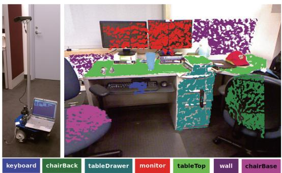

<details>
<summary>text_image</summary>

keyboard chairBack tableDrawer monitor tableTop wall chairBase
</details>

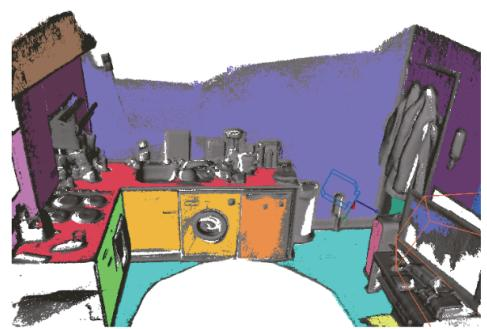

<details>
<summary>natural_image</summary>

Illustration of a kitchen appliance with washing machine and kitchen equipment (no text or symbols)
</details>

图 14-8 语义 SLAM 的一些结果，左图和右图分别来自 [138, 140]。

在深度学习广泛应用之前，我们只能利用支持向量机、条件随机场等传统工具对物体或场景进行分割和识别，或者直接将观测数据与数据库中的样本进行比较 [108, 140]，尝试构建语义地图 [138, 141, 142, 143]。由于这些工具本身在分类正确率上存在限制，所以效果也往往不尽如人意。随着深度学习的发展，我们开始使用网络，越来越准确地对图像进行识别、检测和分割 [144, 145, 146, 147, 148, 149]。这为构建准确的语义地图打下了更好的基础 [150]。我们正看到，逐渐开始有学者将神经网络方法引入到 SLAM 中的物体识别和分割，甚至 SLAM 本身的位姿估计与回环检测中 [151, 152, 153]。虽然这些方法目前还没有成为主流，但将 SLAM 与深度学习结合来处理图像，亦是一个很有前景的研究方向。

## 14.2.3 SLAM 的未来

除了这两个大方向之外，基于线/面特征的 SLAM[154, 155, 156]、动态场景下的SLAM[157, 158, 159]、多机器人的 SLAM[160, 67, 161] 等等，都是研究者们感兴趣并发力的地方。按照 [9] 的观点，视觉 SLAM 经过了三个大时代：提出问题、寻找算法、完善算法。而我们目前正处于第三个时代，面对着如何在已有的框架中进一步改善，使视觉 SLAM 系统能够在各种干扰的条件下，稳定地运行。这一步需要许多研究者们的不懈努力。

当然，没有人能够预测未来，我们也说不准会不会突然有一天，整个框架都会被新的技术推倒重写。不过即使是那样，今天我们的付出仍将是有意义的。没有今天的研究，也就不会有将来的发展。最后，希望读者能在读完本书之后，对现有的整个 SLAM 系统有了充分的认识。我们也期待你能够为 SLAM 研究做出贡献！

## 习题

1. 选择本讲提到的任意一个开源 SLAM 系统，在你的机器上编译运行它，直观体验一下它的过程。  
2. 你应该已经能够看懂绝大多数 SLAM 相关论文了。拿起纸和笔，开始你的研究吧！

本节总结一下常见的高斯分布的性质，它在本书的很多地方都用到。

## A.1 高斯分布

我们说一个随机变量 x 服从高斯分布 $N ( \mu , \sigma )$ ，那么它的概率密度函数为：

$$
p (x) = \frac {1}{\sqrt {2 \pi} \sigma} \exp \left(- \frac {1}{2} \frac {(x - \mu) ^ {2}}{\sigma^ {2}}\right). \tag {A.1}
$$

它的高维形式为：

$$
p (x) = \frac {1}{\sqrt {(2 \pi) ^ {N} \det (\boldsymbol {\Sigma})}} \exp \left(- \frac {1}{2} (\boldsymbol {x} - \boldsymbol {\mu}) ^ {T} \boldsymbol {\Sigma} ^ {- 1} (\boldsymbol {x} - \boldsymbol {\mu})\right). \tag {A.2}
$$

## A.2 高斯分布的运算

## A.2.1 线性运算

设两个独立的高斯分布：

$$
\boldsymbol {x} \sim N (\boldsymbol {\mu} _ {x}, \boldsymbol {\Sigma} _ {x x}), \quad \boldsymbol {y} \sim N (\boldsymbol {\mu} _ {y}, \boldsymbol {\Sigma} _ {y y}),
$$

那么，它们的和仍是高斯分布：

$$
\boldsymbol {x} + \boldsymbol {y} \sim N (\boldsymbol {\mu} _ {x} + \boldsymbol {\mu} _ {y}, \boldsymbol {\Sigma} _ {x x} + \boldsymbol {\Sigma} _ {y y}). \tag {A.3}
$$

如果以常数 a 乘以 x，那么 ax 满足：

$$
a \boldsymbol {x} \sim N (a \boldsymbol {\mu} _ {x}, a ^ {2} \boldsymbol {\Sigma} _ {x x}). \tag {A.4}
$$

如果取 $y = A x$ ，那么 y 满足：

$$
\boldsymbol {y} \sim N (\boldsymbol {A} \boldsymbol {\mu} _ {x}, \boldsymbol {A} \boldsymbol {\Sigma} _ {x x} \boldsymbol {A} ^ {T}). \tag {A.5}
$$

## A.2.2 乘积

设两个高斯分布的乘积满足 $p \left( \pmb { x } \pmb { y } \right) = N \left( \pmb { \mu } , \pmb { \Sigma } \right)$ ，那么：

$$
\boldsymbol {\Sigma} ^ {- 1} = \boldsymbol {\Sigma} _ {x x} ^ {- 1} + \boldsymbol {\Sigma} _ {y y} ^ {- 1} \tag {A.6}
$$

$$
\pmb {\Sigma} \pmb {\mu} = \pmb {\Sigma} _ {x x} ^ {- 1} \pmb {\mu} _ {x} + \pmb {\Sigma} _ {y y} ^ {- 1} \pmb {\mu} _ {y}.
$$

该公式可以推广到任意多个高斯分布之乘积。

## A.2.3 复合运算

同样考虑 x 和 y，当它们不独立时，其复合分布为：

$$
p (\boldsymbol {x}, \boldsymbol {y}) = N \left(\left[ \begin{array}{l} \boldsymbol {\mu} _ {x} \\ \boldsymbol {\mu} _ {y} \end{array} \right], \left[ \begin{array}{l l} \boldsymbol {\Sigma} _ {x x} & \boldsymbol {\Sigma} _ {x y} \\ \boldsymbol {\Sigma} _ {y x} & \boldsymbol {\Sigma} _ {y y} \end{array} \right]\right). \tag {A.7}
$$

由条件分布展开式 $p \left( \pmb { x } , \pmb { y } \right) = p \left( \pmb { x } | \pmb { y } \right) p \left( \pmb { y } \right)$ 推出可以推出，条件概率 $p ( { \pmb x } | { \pmb y } )$ 满足：

$$
p (\boldsymbol {x} | \boldsymbol {y}) = N \left(\boldsymbol {\mu} _ {x} + \boldsymbol {\Sigma} _ {x y} \boldsymbol {\Sigma} _ {y y} ^ {- 1} (\boldsymbol {y} - \boldsymbol {\mu} _ {y}), \boldsymbol {\Sigma} _ {x x} - \boldsymbol {\Sigma} _ {x y} \boldsymbol {\Sigma} _ {y y} ^ {- 1} \boldsymbol {\Sigma} _ {y x}\right). \tag {A.8}
$$

## A.3 复合的例子

下面我们举一个和卡尔曼滤波器相关的例子。考虑随机变量 $\pmb { x } \sim N ( \pmb { \mu _ { x } } , \pmb { \Sigma _ { x x } } )$ ，另一变量 y 满足：

$$
\boldsymbol {y} = \boldsymbol {A} \boldsymbol {x} + \boldsymbol {b} + \boldsymbol {w} \tag {A.9}
$$

其中 A,b 为线性变量的系数矩阵和偏移量，w 为噪声项，为零均值的高斯分布： $\pmb { w } \sim$ $N ( \mathbf { 0 } , R )$ 。我们来看 y 的分布。根据前面的介绍，可以推出：

$$
p \left(\boldsymbol {y}\right) = N \left(\boldsymbol {A} \boldsymbol {\mu} _ {x} + \boldsymbol {b}, \boldsymbol {A} \boldsymbol {\Sigma} _ {x x} \boldsymbol {A} ^ {\mathrm{T}} + \boldsymbol {R}\right). \tag {A.10}
$$

这为卡尔曼滤波器的预测部分提供了理论基础。

## 附录 B

## ROS 入门

ROS 是机器人研究领域一个被广为探讨的主题。为了避免使本书阅读门槛太高，我们没有在正文和例程中提到它。但是近年来，ROS 正逐步在各大高校的学生中间推广，渐渐被人们熟知和接受，所以我们也在本书的附录里介绍一下 ROS，希望对读者能有些帮助。

## B.1 ROS 是什么

ROS（Robot Operating System）是 Willow Garage 公司于 2007 年发布的一个开源机器人操作系统，它为软件开发人员开发机器人应用程序提供了许多优秀的工具和库。同时，还有优秀的开发者不断地为它贡献代码。从本质上讲，ROS 并不是一个真正意义上的操作系统，而更像是一个基于操作系统之上的一个软件包。它提供了众多在实际机器人中可能遇到的算法：导航、通讯、路径规划等等。

ROS 的版本号是按照字母顺序来排列的，并随着 Ubuntu 系统发布更新。通常一个ROS 版本会支持两到三个 Ubuntu 系统版本。ROS 从 Box Turtle 开始，截止至本书写作时间（2016 年）为止，已经更新到了 Kinetic Kame。同时，ROS 也已经彻底重构，推出了实时性更强的 2.0 版本。

ROS 支持很多操作系统，支持的最完善的为 Ubuntu 及其衍生版本（Kubuntu，LinuxMint, Ubuntu GNOME 等），对其他 Linux、Windows 等支持虽有但没有那么完善。我们推荐读者使用 Ubuntu 操作系统来进行开发和研究。

ROS 支持目前被广泛使用的面向对象的编程语言 C++，以及脚本语言 Python。你可以选择自己喜欢的语言进行开发。

## B.2 ROS 的特点

ROS 从开始设计之初，就是为了能够使机器人开发能够像计算机一样，屏蔽底层硬件及其接口的不一致性，最终使得软件可以复用。

而软件复用也正是软件工程优美性最集中的体现之一，ROS 能够以统一消息的格式来使得大家只需要关注算法层面的设计，而底层硬件的根本目的是接收各种各样的消息，如图像、数据等。各个硬件厂商将接收到的数据都统一到 ROS 所规定的统一消息格式下，即可让用户方便地使用各种开源的机器人相关算法。

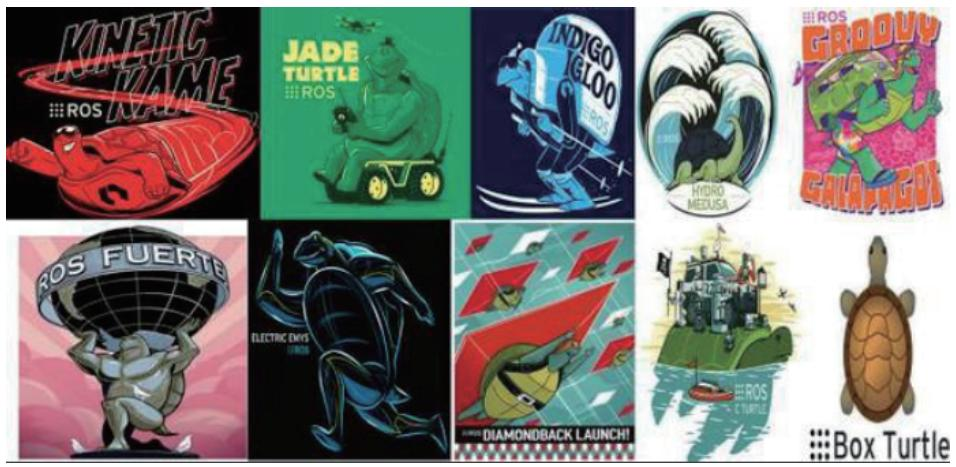

<details>
<summary>text_image</summary>

KINETIC KANE
ROS
JADE TURTLE
ROS
INDIGO IGLOO
GRODOS
HYDRO MEDUSA
ROS GROOVY
GALAGOGS
ROS FUERTI
ELECTRIC EMYS
DIAMONDBACK LAUNCH!
ROS TURTLE
Box Turtle
</details>

图 B-1 ROS 各版本命名方式

我们在第 14 讲中提到的常见开源的 SLAM 方案中，ORB-SLAM、ORB-SLAM2、LSD-SLAM、SVO、DVO、RTAB-MAP、RGBD-SLAM-V2、Hector SLAM、Gmapping、ROVIO等均有 ROS 版本的开源代码，你可以很方便地在 ROS 中运行、调试和修改它们。

在调试 SLAM 程序时，数据的来源通常有 3 种：传感器、数据集，以及 bag 文件。当我们手头没有相应的传感器时，通常就需要利用虚拟的数据来跑 SLAM 程序。其中，最方便的方式当属利用 ROS 下的 bag 文件发布 topic，然后 SLAM 程序可以监视 topic 发出的数据，就像使用真实的传感器采集数据一样。后面我们会简单介绍一下如何利用 bag 文件来模拟真实的传感器数据。

## B.3 如何快速上手 ROS？

ROS 有完善的维基系统，首先按照官网的介绍在你的机器上安装对应版本的 ROS：http://wiki.ros.org/ROS/Installation。然后，阅读 ROS 自带的教学程序即可。你会学习到 ROS 的基本概念，主题的发布和订阅，并学习用 Python 和 C++ 控制它们。如果你觉得麻烦，也可以使用定制的 Ubuntu for ROS：http://www.aicrobo.com/ubuntu\_for\_ros.html。

除了基本知识之外，你还可以学习一些 ROS 的常用工具，例如：

1. rqt。rqt 是 ROS 下的一个软件框架，它以插件的方式提供了各种各样方便好用的GUI（用户图形界面）。rqt 的功能非常强大，可以实时地查看 ROS 中流动的消息。  
2. rosbag。rosbag 是 ROS 提供的一个非常好用的录制以及播放 Topic 数据的工具。当你想实际跑一下 SLAM 程序，又困惑于手头没有实际的传感器时，可以考虑使用公

开提供的 bag 文件来进行图像或者数据的模拟，这种方式与使用一个真实的传感器感觉上并无不同。rosbag 的使用方式请参考 ROS 的 wiki 页面。此外，许多公开数据集也会提供 bag 格式的数据文件。

3. rviz。Rviz 是 ROS 提供的可视化模块，你可以实时地查看 ROS 中的图像、点云、地图、规划的路径等等，从而更方便地调试程序。

我们相信，机器人硬件层面和软件层面一定都会向着统一架构的方向前行，ROS 正是软件架构层面标准化一个重要的里程碑。而 ROS1.x 在之前大量被用于实验室的研究，或者公司产品 demo 的研发阶段，而 ROS2 解决了 ROS 实时性的问题，未来很有可能被直接用于实际产品的研发，为推进工业级机器人以及服务机器人的应用做出重要的贡献。

在此附录中，我们概述性地介绍了有关 ROS 的历史、优点，以及如何利用 ROS 中的一些可视化工具来辅助 SLAM 程序开发等。我们希望读者系统地学习 ROS，并使用 ROS开发你的 SLAM 程序。

## 参考文献

[1] L. Haomin, Z. Guofeng, and B. Hujun, “A survey of monocular simultaneous localization and mapping,” Journal of Computer-Aided Design and Compute Graphics, vol. 28, no. 6, pp. 855–868, 2016. in Chinese.  
[2] A. Davison, I. Reid, N. Molton, and O. Stasse, “Monoslam: Real-time single camera SLAM,” IEEE Transactions on Pattern Analysis and Machine Intelligence, vol. 29, no. 6, pp. 1052–1067, 2007.  
[3] R. Hartley and A. Zisserman, Multiple View Geometry in Computer Vision. Cambridge university press, 2003.  
[4] R. C. Smith and P. Cheeseman, “On the representation and estimation of spatial uncertainty,” International Journal of Robotics Research, vol. 5, no. 4, pp. 56–68, 1986.  
[5] S. Thrun, W. Burgard, and D. Fox, Probabilistic robotics. MIT Press, 2005.  
[6] T. Barfoot, “State estimation for robotics: A matrix lie group approach,” 2016.  
[7] A. Pretto, E. Menegatti, and E. Pagello, “Omnidirectional dense large-scale mapping and navigation based on meaningful triangulation,” 2011 IEEE International Conference on Robotics and Automation (ICRA 2011), pp. 3289–96, 2011.  
[8] B. Rueckauer and T. Delbruck, “Evaluation of event-based algorithms for optical flow with ground-truth from inertial measurement sensor,” Frontiers in neuroscience, vol. 10, 2016.  
[9] C. Cesar, L. Carlone, H. C., Y. Latif, D. Scaramuzza, J. Neira, I. D. Reid, and L. John J., “Past, present, and future of simultaneous localization and mapping: Towards the robustperception age,” arXiv preprint arXiv:1606.05830, 2016.  
[10] P. Newman and K. Ho, “Slam-loop closing with visually salient features,” in proceedings of the 2005 IEEE International Conference on Robotics and Automation, pp. 635–642, IEEE, 2005.  
[11] R. Smith, M. Self, and P. Cheeseman, “Estimating uncertain spatial relationships in robotics,” in Autonomous robot vehicles, pp. 167–193, Springer, 1990.  
[12] P. Beeson, J. Modayil, and B. Kuipers, “Factoring the mapping problem: Mobile robot map-building in the hybrid spatial semantic hierarchy,” International Journal of Robotics Research, vol. 29, no. 4, pp. 428–459, 2010.  
[13] H. Strasdat, J. M. Montiel, and A. J. Davison, “Visual slam: Why filter?,” Image and Vision Computing, vol. 30, no. 2, pp. 65–77, 2012.  
[14] M. Liang, H. Min, and R. Luo, “Graph-based slam: A survey,” ROBOT, vol. 35, no. 4, pp. 500–512, 2013. in Chinese.  
[15] J. Fuentes-Pacheco, J. Ruiz-Ascencio, and J. M. Rendón-Mancha, “Visual simultaneous localization and mapping: a survey,” Artificial Intelligence Review, vol. 43, no. 1, pp. 55– 81, 2015.  
[16] J. Boal, Á. Sánchez-Miralles, and Á. Arranz, “Topological simultaneous localization and mapping: a survey,” Robotica, vol. 32, pp. 803–821, 2014.  
[17] S. Y. Chen, “Kalman filter for robot vision: A survey,” IEEE Transactions on Industrial Electronics, vol. 59, no. 11, pp. 4409–4420, 2012.  
[18] Z. Chen, J. Samarabandu, and R. Rodrigo, “Recent advances in simultaneous localization and map-building using computer vision,” Advanced Robotics, vol. 21, no. 3-4, pp. 233–265, 2007.  
[19] J. Stuelpnagel, “On the parametrization of the three-dimensional rotation group,” SIAM Review, vol. 6, no. 4, pp. 422–430, 1964.  
[20] V. S. Varadarajan, Lie groups, Lie algebras, and their representations, vol. 102. Springer Science & Business Media, 2013.  
[21] H. Strasdat, Local accuracy and global consistency for efficient visual slam. PhD thesis, Citeseer, 2012.  
[22] S. Agarwal, N. Snavely, I. Simon, S. M. Seitz, and R. Szeliski, “Building rome in a day,” in 2009 IEEE 12th international conference on computer vision, pp. 72–79, IEEE, 2009.  
[23] J. Nocedal and S. Wright, Numerical Optimization. Springer Science & Business Media, 2006.  
[24] M. I. Lourakis and A. A. Argyros, “Sba: A software package for generic sparse bundle adjustment,” ACM Transactions on Mathematical Software (TOMS), vol. 36, no. 1, p. 2, 2009.  
[25] G. Sibley, “Relative bundle adjustment,” Department of Engineering Science, Oxford University, Tech. Rep, vol. 2307, no. 09, 2009.  
[26] B. Triggs, P. F. McLauchlan, R. I. Hartley, and A. W. Fitzgibbon, “Bundle adjustment: a modern synthesis,” in Vision algorithms: theory and practice, pp. 298–372, Springer, 2000.  
[27] S. Agarwal, K. Mierle, and Others, “Ceres solver.” http://ceres-solver.org.  
[28] R. Kummerle, G. Grisetti, H. Strasdat, K. Konolige, and W. Burgard, “G2o: a general framework for graph optimization,” in IEEE International Conference on Robotics and Automation (ICRA), pp. 3607–3613, IEEE, 2011.  
[29] Wikipedia, “Feature (computer vision).” "https://en.wikipedia.org/wiki/Feature\_ (computer\_vision)", 2016. [Online; accessed 09-July-2016].  
[30] D. G. Lowe, “Distinctive image features from scale-invariant keypoints,” International Journal of Computer Vision, vol. 60, no. 2, pp. 91–110, 2004.  
[31] H. Bay, T. Tuytelaars, and L. Van Gool, “Surf: Speeded up robust features,” in Computer Vision–ECCV 2006, pp. 404–417, Springer, 2006.  
[32] E. Rublee, V. Rabaud, K. Konolige, and G. Bradski, “Orb: an efficient alternative to sift or surf,” in 2011 IEEE International Conference on Computer Vision (ICCV), pp. 2564–2571, IEEE, 2011.  
[33] E. Rosten and T. Drummond, “Machine learning for high-speed corner detection,” in European conference on computer vision, pp. 430–443, Springer, 2006.  
[34] M. Calonder, V. Lepetit, C. Strecha, and P. Fua, “Brief: Binary robust independent elementary features,” in European conference on computer vision, pp. 778–792, Springer, 2010.  
[35] P. L. Rosin, “Measuring corner properties,” Computer Vision and Image Understanding, vol. 73, no. 2, pp. 291–307, 1999.  
[36] M. Muja and D. G. Lowe, “Fast approximate nearest neighbors with automatic algorithm configuration.,” in VISAPP (1), pp. 331–340, 2009.  
[37] J. Sturm, N. Engelhard, F. Endres, W. Burgard, and D. Cremers, “A benchmark for the evaluation of rgb-d SLAM systems,” in 2012 IEEE/RSJ International Conference on Intelligent Robots and Systems (IROS), pp. 573–580, IEEE, 2012.  
[38] R. I. Hartley, “In defense of the eight-point algorithm,” IEEE Transactions on pattern analysis and machine intelligence, vol. 19, no. 6, pp. 580–593, 1997.  
[39] H. C. Longuet-Higgins, “A computer algorithm for reconstructing a scene from two projections,” Readings in Computer Vision: Issues, Problems, Principles, and Paradigms, MA Fischler and O. Firschein, eds, pp. 61–62, 1987.  
[40] H. Li and R. Hartley, “Five-point motion estimation made easy,” in 18th International Conference on Pattern Recognition (ICPR’06), vol. 1, pp. 630–633, IEEE, 2006.  
[41] D. Nistér, “An efficient solution to the five-point relative pose problem,” IEEE Transactions on Pattern Analysis and Machine Intelligence, vol. 26, no. 6, pp. 756–770, 2004.  
[42] O. D. Faugeras and F. Lustman, “Motion and structure from motion in a piecewise planar environment,” International Journal of Pattern Recognition and Artificial Intelligence, vol. 2, no. 03, pp. 485–508, 1988.  
[43] Z. Zhang and A. R. Hanson, “3d reconstruction based on homography mapping,” ARPA Image Understanding Workshop, pp. 1007–1012, 1996.  
[44] E. Malis and M. Vargas, Deeper understanding of the homography decomposition for visionbased control. PhD thesis, INRIA, 2007.  
[45] X.-S. Gao, X.-R. Hou, J. Tang, and H.-F. Cheng, “Complete solution classification for the perspective-three-point problem,” IEEE Transactions on Pattern Analysis and Machine Intelligence, vol. 25, pp. 930–943, Aug 2003.  
[46] V. Lepetit, F. Moreno-Noguer, and P. Fua, “Epnp: An accurate o(n) solution to the pnp problem,” International Journal of Computer Vision, vol. 81, no. 2, pp. 155–166, 2008.  
[47] A. Penate-Sanchez, J. Andrade-Cetto, and F. Moreno-Noguer, “Exhaustive linearization for robust camera pose and focal length estimation,” IEEE Transactions on Pattern Analysis and Machine Intelligence, vol. 35, no. 10, pp. 2387–2400, 2013.  
[48] L. Chen, C. W. Armstrong, and D. D. Raftopoulos, “An investigation on the accuracy of three-dimensional space reconstruction using the direct linear transformation technique,” Journal of Biomechanics, vol. 27, no. 4, pp. 493–500, 1994.  
[49] iplimage, “P3p(blog).” "http://iplimage.com/blog/p3p-perspective-point-overview/ ", 2016.  
[50] K. S. Arun, T. S. Huang, and S. D. Blostein, “Least-squares fitting of two 3-d point sets,” Pattern Analysis and Machine Intelligence, IEEE Transactions on, no. 5, pp. 698–700, 1987.  
[51] F. Pomerleau, F. Colas, and R. Siegwart, “A review of point cloud registration algorithms for mobile robotics,” Foundations and Trends in Robotics (FnTROB), vol. 4, no. 1, pp. 1– 104, 2015.  
[52] O. D. Faugeras and M. Hebert, “The representation, recognition, and locating of 3-d objects,” The International Journal of Robotics Research, vol. 5, no. 3, pp. 27–52, 1986.  
[53] B. K. Horn, “Closed-form solution of absolute orientation using unit quaternions,” JOSA A, vol. 4, no. 4, pp. 629–642, 1987.  
[54] G. C. Sharp, S. W. Lee, and D. K. Wehe, “Icp registration using invariant features,” IEEE Transactions on Pattern Analysis and Machine Intelligence, vol. 24, no. 1, pp. 90–102, 2002.  
[55] G. Silveira, E. Malis, and P. Rives, “An efficient direct approach to visual slam,” IEEE Transactions on Robotics, vol. 24, no. 5, pp. 969–979, 2008.  
[56] C. Forster, M. Pizzoli, and D. Scaramuzza, “Svo: Fast semi-direct monocular visual odometry,” in Robotics and Automation (ICRA), 2014 IEEE International Conference on (rs, ed.), pp. 15–22, IEEE, 2014.  
[57] J. Engel, T. Schöps, and D. Cremers, “Lsd-slam: Large-scale direct monocular slam,” in Computer Vision–ECCV 2014, pp. 834–849, Springer, 2014.  
[58] J. Engel, V. Koltun, and D. Cremers, “Direct sparse odometry,” arXiv preprint arXiv:1607.02565, 2016.  
[59] J. Engel, J. Sturm, and D. Cremers, “Semi-dense visual odometry for a monocular camera,” in Proceedings of the IEEE International Conference on Computer Vision, pp. 1449–1456, 2013.  
[60] V. Usenko, J. Engel, J. Stueckler, and D. Cremers, “Direct visual-inertial odometry with stereo cameras,” in IEEE International Conference on Robotics and Automation (ICRA), May 2016.  
[61] Wikipedia, “Random sample consensus.” "https://en.wikipedia.org/wiki/Random\_ sample\_consensus", 2016. [Online; accessed 09-July-2016].  
[62] V. Sujan and S. Dubowsky, “Efficient information-based visual robotic mapping in unstructured environments,” International Journal of Robotics Research, vol. 24, no. 4, pp. 275–293, 2005.  
[63] F. Janabi-Sharifi and M. Marey, “A kalman-filter-based method for pose estimation in visual servoing,” IEEE Transactions on Robotics, vol. 26, no. 5, pp. 939–947, 2010.  
[64] S. Li and P. Ni, “Square-root unscented kalman filter based simultaneous localization and mapping,” in Information and Automation (ICIA), 2010 IEEE International Conference on, pp. 2384–2388, IEEE, 2010.  
[65] R. Sim, P. Elinas, and J. Little, “A study of the rao-blackwellised particle filter for efficient and accurate vision-based slam,” International Journal of Computer Vision, vol. 74, no. 3, pp. 303–318, 2007.  
[66] J. S. Lee, S. Y. Nam, and W. K. Chung, “Robust rbpf-slam for indoor mobile robots using sonar sensors in non-static environments,” Advanced Robotics, vol. 25, no. 9-10, pp. 1227– 1248, 2011.  
[67] A. Gil, O. Reinoso, M. Ballesta, and M. Julia, “Multi-robot visual slam using a raoblackwellized particle filter,” Robotics and Autonomous Systems, vol. 58, no. 1, pp. 68–80, 2010.  
[68] G. Sibley, L. Matthies, and G. Sukhatme, “Sliding window filter with application to planetary landing,” Journal of Field Robotics, vol. 27, no. 5, pp. 587–608, 2010.  
[69] L. M. Paz, J. D. Tardós, and J. Neira, “Divide and conquer: Ekf slam in o(n),” IEEE Transactions on Robotics, vol. 24, no. 5, pp. 1107–1120, 2008.  
[70] O. G. Grasa, J. Civera, and J. Montiel, “Ekf monocular slam with relocalization for laparoscopic sequences,” in Robotics and Automation (ICRA), 2011 IEEE International Conference on, pp. 4816–4821, IEEE, 2011.  
[71] E. Süli and D. F. Mayers, An Introduction to Numerical Analysis. Cambridge university press, 2003.  
[72] L. Polok, V. Ila, M. Solony, P. Smrz, and P. Zemcik, “Incremental block cholesky factorization for nonlinear least squares in robotics.,” in Robotics: Science and Systems, 2013.  
[73] R. Mur-Artal, J. Montiel, and J. D. Tardos, “Orb-slam: a versatile and accurate monocular slam system,” arXiv preprint arXiv:1502.00956, 2015.  
[74] S. Leutenegger, S. Lynen, M. Bosse, R. Siegwart, and P. Furgale, “Keyframe-based visual– inertial odometry using nonlinear optimization,” The International Journal of Robotics Research, vol. 34, no. 3, pp. 314–334, 2015.  
[75] “Bundle adjustment in the large.” http://grail.cs.washington.edu/projects/bal/.  
[76] J. Sherman and W. J. Morrison, “Adjustment of an inverse matrix corresponding to a change in one element of a given matrix,” The Annals of Mathematical Statistics, vol. 21, no. 1, pp. 124–127, 1950.  
[77] H. Strasdat, A. J. Davison, J. M. M. Montiel, and K. Konolige, “Double window optimisation for constant time visual SLAM,” 2011 IEEE International Conference On Computer Vision (ICCV), pp. 2352–2359, 2011.  
[78] G. Dubbelman and B. Browning, “Cop-slam: Closed-form online pose-chain optimization for visual slam,” Robotics, IEEE Transactions on, vol. 31, pp. 1194–1213, Oct 2015.  
[79] D. Lee and H. Myung, “Solution to the slam problem in low dynamic environments using a pose graph and an rgb-d sensor,” Sensors, vol. 14, no. 7, pp. 12467–12496, 2014.  
[80] Y. Latif, C. Cadena, and J. Neira, “Robust loop closing over time for pose graph slam,” The International Journal of Robotics Research, vol. 32, no. 14, pp. 1611–1626, 2013.  
[81] G. Klein and D. Murray, “Parallel tracking and mapping for small ar workspaces,” in Mixed and Augmented Reality, 2007. ISMAR 2007. 6th IEEE and ACM International Symposium on, pp. 225–234, IEEE, 2007.  
[82] D. Koller and N. Friedman, Probabilistic graphical models: principles and techniques. MIT press, 2009.  
[83] M. Kaess, A. Ranganathan, and F. Dellaert, “isam: Incremental smoothing and mapping,” IEEE Transactions on Robotics, vol. 24, no. 6, pp. 1365–1378, 2008.  
[84] M. Kaess, H. Johannsson, R. Roberts, V. Ila, J. J. Leonard, and F. Dellaert, “isam2: Incremental smoothing and mapping using the bayes tree,” The International Journal of Robotics Research, p. 0278364911430419, 2011.  
[85] D. M. Rosen, M. Kaess, and J. J. Leonard, “Rise: An incremental trust-region method for robust online sparse least-squares estimation,” IEEE Transactions on Robotics, vol. 30, no. 5, pp. 1091–1108, 2014.  
[86] J. Sola, “Course on slam.” https://github.com/joansola/slamtb/raw/graph/ courseSLAM.pdf, 2016.  
[87] F. Dellaert, “Factor graphs and gtsam: A hands-on introduction,” 2012.  
[88] F. Endres, J. Hess, J. Sturm, D. Cremers, and W. Burgard, “3-d mapping with an rgb-d camera,” IEEE Transactions on Robotics, vol. 30, no. 1, pp. 177–187, 2014.  
[89] D. Hahnel, W. Burgard, D. Fox, and S. Thrun, “An efficient fastslam algorithm for generating maps of large-scale cyclic environments from raw laser range measurements,” in Intelligent Robots and Systems, 2003.(IROS 2003). Proceedings. 2003 IEEE/RSJ International Conference on, vol. 1, pp. 206–211, IEEE, 2003.  
[90] I. Ulrich and I. Nourbakhsh, “Appearance-based place recognition for topological localization,” in Robotics and Automation, 2000. Proceedings. ICRA’00. IEEE International Conference on, vol. 2, pp. 1023–1029, Ieee, 2000.  
[91] X. Gao and T. Zhang, “Robust rgb-d simultaneous localization and mapping using planar point features,” Robotics and Autonomous Systems, vol. 72, pp. 1–14, 2015.  
[92] S. Lloyd, “Least squares quantization in pcm,” IEEE transactions on information theory, vol. 28, no. 2, pp. 129–137, 1982.  
[93] D. Arthur and S. Vassilvitskii, “K-means++: The advantages of careful seeding,” in Proceedings of the eighteenth annual ACM-SIAM symposium on Discrete algorithms, pp. 1027– 1035, Society for Industrial and Applied Mathematics, 2007.  
[94] M. Cummins and P. Newman, “Fab-map: Probabilistic localization and mapping in the space of appearance,” The International Journal of Robotics Research, vol. 27, no. 6, pp. 647–665, 2008.  
[95] M. Cummins and P. Newman, “Accelerating fab-MAP with concentration inequalities,” IEEE Transactions On Robotics, vol. 26, no. 6, pp. 1042–1050, 2010.  
[96] M. Cummins and P. Newman, “Appearance-only slam at large scale with fab-map 2.0,” International Journal of Robotics Research, vol. 30, no. 9, pp. 1100–1123, 2011.  
[97] C. Chow and C. Liu, “Approximating discrete probability distributions with dependence trees,” IEEE transactions on Information Theory, vol. 14, no. 3, pp. 462–467, 1968.  
[98] D. Galvez-Lopez and J. D. Tardos, “Bags of binary words for fast place recognition in image sequences,” IEEE Transactions On Robotics, vol. 28, no. 5, pp. 1188–1197, 2012.  
[99] J. L. Bentley, “Multidimensional binary search trees used for associative searching,” Communications of the ACM, vol. 18, no. 9, pp. 509–517, 1975.  
[100] J. Sivic and A. Zisserman, “Video google: A text retrieval approach to object matching in videos,” in Computer Vision, 2003. Proceedings. Ninth IEEE International Conference on, pp. 1470–1477, IEEE, 2003.  
[101] S. Robertson, “Understanding inverse document frequency: on theoretical arguments for idf,” Journal of documentation, vol. 60, no. 5, pp. 503–520, 2004.  
[102] D. Nister and H. Stewenius, “Scalable recognition with a vocabulary tree,” in 2006 IEEE Computer Society Conference on Computer Vision and Pattern Recognition (CVPR’06), vol. 2, pp. 2161–2168, IEEE, 2006.  
[103] C. Cadena, D. Galvez-Lopez, J. D. Tardos, and J. Neira, “Robust place recognition with stereo sequences,” IEEE Transactions on Robotics, vol. 28, no. 4, pp. 871–885, 2012.  
[104] X. Gao and T. Zhang, “Loop closure detection for visual slam systems using deep neural networks,” in Control Conference (CCC), 2015 34th Chinese, pp. 5851–5856, IEEE, 2015.  
[105] X. Gao and T. Zhang, “Unsupervised learning to detect loops using deep neural networks for visual slam system,” Autonomous Robots, pp. 1–18, 2015.  
[106] B. Williams, M. Cummins, J. Neira, P. Newman, I. Reid, and J. Tardós, “A comparison of loop closing techniques in monocular slam,” Robotics and Autonomous Systems, vol. 57, no. 12, pp. 1188–1197, 2009.  
[107] M. Labbé and F. Michaud, “Online global loop closure detection for large-scale multi-session graph-based slam,” in 2014 IEEE/RSJ International Conference on Intelligent Robots and Systems, pp. 2661–2666, IEEE, 2014.  
[108] R. F. Salas-Moreno, R. A. Newcombe, H. Strasdat, P. H. J. Kelly, and A. J. Davison, “Slam++: Simultaneous localisation and mapping at the level of objects,” 2013 IEEE Conference on Computer Vision and Pattern Recognition (CVPR), pp. 1352–9, 2013.  
[109] M. Pizzoli, C. Forster, and D. Scaramuzza, “Remode: Probabilistic, monocular dense reconstruction in real time,” in 2014 IEEE International Conference on Robotics and Automation (ICRA), pp. 2609–2616, IEEE, 2014.  
[110] “Correlation based similarity measure-summary.” https://siddhantahuja.wordpress. com/tag/stereo-matching/.  
[111] H. Hirschmuller and D. Scharstein, “Evaluation of cost functions for stereo matching,” in 2007 IEEE Conference on Computer Vision and Pattern Recognition, pp. 1–8, IEEE, 2007.  
[112] G. Vogiatzis and C. Hernández, “Video-based, real-time multi-view stereo,” Image and Vision Computing, vol. 29, no. 7, pp. 434–441, 2011.  
[113] A. Handa, R. A. Newcombe, A. Angeli, and A. J. Davison, “Real-time camera tracking: When is high frame-rate best?,” in European Conference on Computer Vision, pp. 222–235, Springer, 2012.  
[114] J. Montiel, J. Civera, and A. J. Davison, “Unified inverse depth parametrization for monocular slam,” analysis, vol. 9, p. 1, 2006.  
[115] J. Civera, A. J. Davison, and J. M. Montiel, “Inverse depth parametrization for monocular slam,” IEEE transactions on robotics, vol. 24, no. 5, pp. 932–945, 2008.  
[116] M. Kazhdan, M. Bolitho, and H. Hoppe, “Poisson surface reconstruction,” in Proceedings of the fourth Eurographics symposium on Geometry processing, vol. 7, 2006.  
[117] J. Stuckler and S. Behnke, “Multi-resolution surfel maps for efficient dense 3d modeling and tracking,” Journal of Visual Communication and Image Representation, vol. 25, no. 1, pp. 137–147, 2014.  
[118] A. Hornung, K. M. Wurm, M. Bennewitz, C. Stachniss, and W. Burgard, “Octomap: An efficient probabilistic 3d mapping framework based on octrees,” Autonomous Robots, vol. 34, no. 3, pp. 189–206, 2013.  
[119] M. Burri, H. Oleynikova, M. W. Achtelik, and R. Siegwart, “Real-time visual-inertial mapping, re-localization and planning onboard mavs in unknown environments,” in Intelligent Robots and Systems (IROS), 2015 IEEE/RSJ International Conference on, pp. 1872–1878, IEEE, 2015.  
[120] R. A. Newcombe, A. J. Davison, S. Izadi, P. Kohli, O. Hilliges, J. Shotton, D. Molyneaux, S. Hodges, D. Kim, and A. Fitzgibbon, “Kinectfusion: Real-time dense surface mapping and tracking,” in 2011 10th IEEE international symposium on Mixed and augmented reality (ISMAR), pp. 127–136, IEEE, 2011.  
[121] R. A. Newcombe, D. Fox, and S. M. Seitz, “Dynamicfusion: Reconstruction and tracking of non-rigid scenes in real-time,” in Proceedings of the IEEE conference on computer vision and pattern recognition, pp. 343–352, 2015.  
[122] T. Whelan, S. Leutenegger, R. F. Salas-Moreno, B. Glocker, and A. J. Davison, “Elasticfusion: Dense slam without a pose graph,” Proc. Robotics: Science and Systems, Rome, Italy, 2015.  
[123] M. Dou, S. Khamis, Y. Degtyarev, P. Davidson, S. R. Fanello, A. Kowdle, S. O. Escolano, C. Rhemann, D. Kim, J. Taylor, et al., “Fusion4d: Real-time performance capture of challenging scenes,” ACM Transactions on Graphics (TOG), vol. 35, no. 4, p. 114, 2016.  
[124] M. Innmann, M. Zollhöfer, M. Nießner, C. Theobalt, and M. Stamminger, “Volumedeform: Real-time volumetric non-rigid reconstruction,” arXiv preprint arXiv:1603.08161, 2016.  
[125] A. J. Davison, “Real-time simultaneous localisation and mapping with a single camera,” in Computer Vision, 2003. Proceedings. Ninth IEEE International Conference on, pp. 1403– 1410, IEEE, 2003.  
[126] C. Kerl, J. Sturm, and D. Cremers, “Robust odometry estimation for rgb-d cameras,” in Robotics and Automation (ICRA), 2013 IEEE International Conference on, pp. 3748–3754, IEEE, 2013.  
[127] C. Kerl, J. Sturm, and D. Cremers, “Dense visual slam for rgb-d cameras,” in 2013 IEEE/RSJ International Conference on Intelligent Robots and Systems, pp. 2100–2106, IEEE, 2013.  
[128] J. Gui, D. Gu, S. Wang, and H. Hu, “A review of visual inertial odometry from filtering and optimisation perspectives,” Advanced Robotics, vol. 29, pp. 1289–1301, Oct 18 2015.  
[129] A. Martinelli, “Closed-form solution of visual-inertial structure from motion,” International Journal of Computer Vision, vol. 106, no. 2, pp. 138–152, 2014.  
[130] M. Bloesch, S. Omari, M. Hutter, and R. Siegwart, “Robust visual inertial odometry using a direct ekf-based approach,” in Intelligent Robots and Systems (IROS), 2015 IEEE/RSJ International Conference on, pp. 298–304, IEEE, 2015.  
[131] M. Li and A. I. Mourikis, “High-precision, consistent ekf-based visual-inertial odometry,” International Journal of Robotics Research, vol. 32, pp. 690–711, MAY 2013.  
[132] G. Huang, M. Kaess, and J. J. Leonard, “Towards consistent visual-inertial navigation,” in 2014 IEEE International Conference on Robotics and Automation (icra), IEEE International Conference on Robotics and Automation ICRA, pp. 4926–4933, 2014. IEEE International Conference on Robotics and Automation (ICRA), Hong Kong, PEOPLES R CHINA, MAY 31-JUN 07, 2014.  
[133] C. Forster, L. Carlone, F. Dellaert, and D. Scaramuzza, “Imu preintegration on manifold for efficient visual-inertial maximum-a-posteriori estimation,” in Robotics: Science and Systems XI, no. EPFL-CONF-214687, 2015.  
[134] M. Tkocz and K. Janschek, “Towards consistent state and covariance initialization for monocular slam filters,” Journal of Intelligent & Robotic Systems, vol. 80, pp. 475–489, DEC 2015.  
[135] A. Nüchter and J. Hertzberg, “Towards semantic maps for mobile robots,” Robotics and Autonomous Systems, vol. 56, no. 11, pp. 915–926, 2008.  
[136] J. Civera, D. Gálvez-López, L. Riazuelo, J. D. Tardós, and J. Montiel, “Towards semantic slam using a monocular camera,” in Intelligent Robots and Systems (IROS), 2011 IEEE/RSJ International Conference on, pp. 1277–1284, IEEE, 2011.  
[137] H. S. Koppula, A. Anand, T. Joachims, and A. Saxena, “Semantic labeling of 3d point clouds for indoor scenes,” in Advances in Neural Information Processing Systems, pp. 244– 252, 2011.  
[138] A. Anand, H. S. Koppula, T. Joachims, and A. Saxena, “Contextually guided semantic labeling and search for three-dimensional point clouds,” The International Journal of Robotics Research, p. 0278364912461538, 2012.  
[139] N. Fioraio and L. Di Stefano, “Joint detection, tracking and mapping by semantic bundle adjustment,” 2013 IEEE Conference on Computer Vision and Pattern Recognition (CVPR), pp. 1538–45, 2013.  
[140] R. F. Salas-Moreno, B. Glocken, P. H. Kelly, and A. J. Davison, “Dense planar slam,” in Mixed and Augmented Reality (ISMAR), 2014 IEEE International Symposium on, pp. 157– 164, IEEE, 2014.  
[141] J. Stückler, N. Biresev, and S. Behnke, “Semantic mapping using object-class segmentation of rgb-d images,” in 2012 IEEE/RSJ International Conference on Intelligent Robots and Systems, pp. 3005–3010, IEEE, 2012.  
[142] I. Kostavelis and A. Gasteratos, “Learning spatially semantic representations for cognitive robot navigation,” Robotics and Autonomous Systems, vol. 61, no. 12, pp. 1460–1475, 2013.  
[143] C. Couprie, C. Farabet, L. Najman, and Y. LeCun, “Indoor semantic segmentation using depth information,” arXiv preprint arXiv:1301.3572, 2013.  
[144] J. Deng, W. Dong, R. Socher, L.-J. Li, K. Li, and L. Fei-Fei, “Imagenet: A large-scale hierarchical image database,” in CVPR09, 2009.  
[145] A. Krizhevsky, I. Sutskever, and G. E. Hinton, “Imagenet classification with deep convolutional neural networks,” in Advances in neural information processing systems, pp. 1097– 1105, 2012.  
[146] K. He, X. Zhang, S. Ren, and J. Sun, “Deep residual learning for image recognition,” arXiv preprint arXiv:1512.03385, 2015.  
[147] S. Ren, K. He, R. Girshick, and J. Sun, “Faster r-cnn: Towards real-time object detection with region proposal networks,” in Advances in neural information processing systems, pp. 91–99, 2015.  
[148] J. Long, E. Shelhamer, and T. Darrell, “Fully convolutional networks for semantic segmentation,” arXiv preprint arXiv:1411.4038, 2014.  
[149] S. Zheng, S. Jayasumana, B. Romera-Paredes, V. Vineet, Z. Su, D. Du, C. Huang, and P. Torr, “Conditional random fields as recurrent neural networks,” in International Conference on Computer Vision (ICCV), 2015.  
[150] S. Gupta, P. Arbeláez, R. Girshick, and J. Malik, “Indoor scene understanding with rgb-d images: Bottom-up segmentation, object detection and semantic segmentation,” International Journal of Computer Vision, pp. 1–17, 2014.  
[151] K. Konda and R. Memisevic, “Learning visual odometry with a convolutional network,” in International Conference on Computer Vision Theory and Applications, 2015.  
[152] A. Kendall, M. Grimes, and R. Cipolla, “Posenet: A convolutional network for real-time 6-dof camera relocalization,” in Proceedings of the IEEE International Conference on Computer Vision, pp. 2938–2946, 2015.  
[153] Y. Hou, H. Zhang, and S. Zhou, “Convolutional neural network-based image representation for visual loop closure detection,” arXiv preprint arXiv:1504.05241, 2015.  
[154] S. Y. An, J. G. Kang, L. K. Lee, and S. Y. Oh, “Line segment-based indoor mapping with salient line feature extraction,” Advanced Robotics, vol. 26, no. 5-6, pp. 437–460, 2012.  
[155] H. Zhou, D. Zou, L. Pei, R. Ying, P. Liu, and W. Yu, “Structslam: Visual slam with building structure lines,” Vehicular Technology, IEEE Transactions on, vol. 64, pp. 1364–1375, April 2015.  
[156] D. Benedettelli, A. Garulli, and A. Giannitrapani, “Cooperative slam using m-space representation of linear features,” Robotics and Autonomous Systems, vol. 60, no. 10, pp. 1267– 1278, 2012.  
[157] J. P. Saarinen, H. Andreasson, T. Stoyanov, and A. J. Lilienthal, “3d normal distributions transform occupancy maps: An efficient representation for mapping in dynamic environments,” The International Journal of Robotics Research, vol. 32, no. 14, pp. 1627–1644, 2013.  
[158] W. Maddern, M. Milford, and G. Wyeth, “Cat-slam: probabilistic localisation and mapping using a continuous appearance-based trajectory,” International Journal of Robotics Research, vol. 31, no. 4SI, pp. 429–451, 2012.  
[159] H. Wang, Z.-G. Hou, L. Cheng, and M. Tan, “Online mapping with a mobile robot in dynamic and unknown environments,” International Journal of Modelling, Identification and Control, vol. 4, no. 4, pp. 415–423, 2008.  
[160] D. Zou and P. Tan, “Coslam: Collaborative visual SLAM in dynamic environments,” IEEE Transactions On Pattern Analysis And Machine Intelligence, vol. 35, no. 2, pp. 354–366, 2013.

[161] T. A. Vidal-Calleja, C. Berger, J. Sola, and S. Lacroix, “Large scale multiple robot visual mapping with heterogeneous landmarks in semi-structured terrain,” Robotics and Autonomous Systems, vol. 59, no. 9, pp. 654–674, 2011.